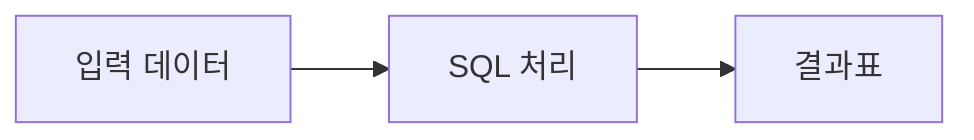

<!-- BEGIN:nextjs-agent-rules -->
# 이 프로젝트의 Next.js는 익숙한 버전과 다를 수 있다

Next.js 코드 또는 설정을 수정하기 전에는 `node_modules/next/dist/docs/`에서 해당 기능의 현재 문서를 확인한다. 사용 중단 안내와 현재 파일 구조를 우선한다.
<!-- END:nextjs-agent-rules -->

# Codex 작업 지침

이 저장소는 Nextra 4 + Next.js 기반의 개인 학습 문서 사이트다. Codex는 구현 작업과 `plan-codex/`에 있는 과목 문서 작성을 담당한다.

## 역할 분리

- Codex 담당 계획: `plan-codex/`
- Claude 담당 계획: `plan-claude/`
- Codex는 사용자가 별도로 요청하지 않는 한 `plan-claude/` 과목의 문서를 작성하거나 구조를 바꾸지 않는다.
- 문서 파일을 추가, 삭제, 이동, 이름 변경하면 관련 폴더의 `_meta.js`도 같은 작업에서 반드시 갱신한다.

## 반드시 유지할 문서 내비게이션 구조

이 사이트의 내비게이션은 **헤더에서 과목을 고르고, 사이드바에서는 그 과목의 선택된 하위 자료만 보는 구조**다. 전체 문서 트리를 한 번에 사이드바에 표시하는 사이트가 아니다.

### 1. 헤더

- 헤더의 최상위 메뉴는 `content/` 바로 아래의 과목 폴더다. 예: `javascript`, `React`, `css`, `독학사`, `자격증`.
- 헤더 메뉴에 마우스를 올리면 해당 과목의 **직접 하위 분류만** 드롭다운으로 표시한다.
  - JavaScript: `Browser`, `ECMAscript`
  - React: `Basic`, `Middle`, `Advanced`
  - CSS: `Basic`, `Middle`, `Advanced`
  - 독학사: 과목별 폴더 (`basic_statics`, `basic_math` 등)
  - 자격증: 시험별 폴더 (`SQLD`, `Linux1`, `Bigdata` 등)
- 드롭다운 항목을 클릭하면 그 하위 분류의 첫 번째 문서로 이동한다.
- 최상위 과목의 비어 있는 `index.mdx`는 만들지 않는다. 헤더 항목은 과목 소개 페이지가 아니라 하위 분류 선택을 위한 메뉴다.
- Nextra 기본 검색(`Search`)과 테마 전환(`ThemeSwitch`)은 헤더에서 제거하지 않는다.

### 2. 사이드바

- 현재 URL이 속한 **하위 분류 하나만** 사이드바에 표시한다.
  - `/javascript/Browser/...`에서는 Browser 문서 목록만 표시한다.
  - `/React/Basic/...`에서는 React Basic 문서 목록만 표시한다.
  - `/독학사/basic_math/...`에서는 일반수학 문서 목록만 표시한다.
  - `/자격증/SQLD/...`에서는 SQLD 문서 목록만 표시한다.
- 다른 최상위 과목이나 형제 분류의 문서는 사이드바에 같이 나오면 안 된다.
- 사이드바 문서 순서와 표시 이름은 해당 폴더의 `_meta.js`가 단일 기준이다.
- 문서가 많아져도 전체 트리를 펼쳐 길게 만들지 않는다. 헤더에서 분류를 바꿔서 사이드바 범위를 바꾸는 방식으로 유지한다.

### 2-1. 이 구조를 만드는 Nextra 규칙

- `app/layout.tsx`의 `<Layout>`에는 전체 `getPageMap()` 구조를 넘긴다. 한글 폴더 경로는 브라우저 URL과 맞추기 위해 route만 `encodeURI`로 정규화할 수 있지만, URL마다 `pageMap`을 잘라 넘기는 별도 필터 코드를 만들지 않는다.
- `content/_meta.js`의 최상위 과목은 반드시 `type: 'menu'`와 `items`를 사용한다.
- 각 과목의 `_meta.js`에서 실제 사이드바 범위가 되는 하위 분류(`Browser`, `Basic`, `SQLD` 등)는 반드시 `type: 'page'`로 선언한다.
- 이 `menu -> page -> 문서` 계층이 Nextra 기본 사이드바를 현재 분류의 문서 목록으로 자동 제한한다. 배포된 `https://zeno.it.kr/`의 헤더/사이드바 방식이 이 기준이다.
- 이 동작을 CSS 숨김, DOM 조작, 별도 라우트별 사이드바 데이터로 대체하지 않는다.
- `app/[[...mdxPath]]/page.tsx`의 `generateStaticParams()`는 홈만 `[]`로 보정하고, Nextra가 반환한 나머지 경로 조각은 다시 인코딩하지 않는다. Next가 정적 내보내기 과정에서 URL을 인코딩하므로 여기서 `encodeURIComponent`를 적용하면 한글 경로가 `%25...` 형태로 이중 인코딩된다.

### 3. 모바일과 화면 전환

- 모바일(768px 미만)에서는 헤더의 과목 드롭다운과 검색/테마 도구를 숨기고, Nextra 기본 햄버거 메뉴로 사이드바를 연다.
- 햄버거 메뉴에서 문서를 연 뒤 데스크톱 폭으로 돌아와도 사이드바와 본문은 정상 너비로 복구되어야 한다.
- Nextra 사이드바의 inline `width`, `transform`, `height`를 고정값으로 덮어써서 해결하지 않는다. 이런 방식은 모바일에서 열고 닫은 뒤 데스크톱 레이아웃을 깨뜨릴 수 있다.
- 내비게이션이나 CSS를 바꾸면 최소한 모바일 폭 -> 메뉴 열기 -> 문서 이동 -> 데스크톱 폭 복귀 흐름을 직접 확인한다.

### 4. UI 수정 범위

- 헤더, 사이드바, 모바일 메뉴는 Nextra 기본 동작을 우선 보존하고 필요한 부분만 덧씌운다.
- `body > div`, `aside`, `article`처럼 너무 넓은 전역 선택자로 레이아웃을 강제하지 않는다. Nextra 내부 구조가 바뀌면 쉽게 깨진다.
- 기존 동작을 교체하거나 제거하기 전에는 사용자에게 무엇을 바꾸는지와 이유를 먼저 설명한다.

## 폴더와 파일 규칙

- 문서는 `content/<최상위 과목>/<하위 분류>/NN_slug.mdx`에 둔다.
- 예시: `content/자격증/SQLD/01_database-overview.mdx`
- 번호는 하위 분류 폴더마다 `01`부터 다시 시작한다.
- 계획 문서는 `plan-codex/[최상위 과목][하위 분류].md` 형식으로 둔다.
- 새 폴더에는 `_meta.js`를 만든다. 존재하지 않는 파일을 `_meta.js`에 먼저 적지 않는다.
- 점(`.`)으로 시작하는 폴더나 파일은 일반 콘텐츠 경로로 쓰지 않는다. 도구나 배포 환경에서 숨김 또는 설정 파일로 취급될 수 있다.

## 문서 작성 규칙

- 대상은 초보 학습자다. 해당 과목을 처음 접한다고 가정하되, 시험에 필요한 깊이를 빼지 않는다.
- 독자가 본문을 읽다가 다른 검색을 하지 않아도 흐름을 이어갈 수 있게 쓴다. 설명에 필요한 기본 개념, 주변 개념, 약어와 전문 용어를 본문 안에서 먼저 풀어 준다.
- 한 문서는 대략 30~50분 동안 **읽고, 예제를 따라 하고, 확인 문제를 풀 수 있는 학습 단위**로 만든다. 짧은 개요 몇 문단만 쓰고 끝내지 않는다.
- MDX frontmatter에는 `title`, `description`만 넣는다.
- 본문 제목은 `##`부터 시작하고 `#`은 쓰지 않는다. 페이지 제목은 frontmatter의 `title`을 사용한다.
- 일반 본편은 마지막에 `## 참고 자료`를 두고 공식 문서나 신뢰 가능한 자료를 링크한다. 복습편은 본편의 자료를 다시 중복하지 않아도 된다.
- 다른 사이트의 문장을 길게 복사하지 않는다. 이해 경로와 예시는 새로 작성한다.

### 본편과 복습 문서

- 모든 일반 본편 `NN_slug.mdx` 바로 다음에는 `NN_slug-review.mdx`를 같은 번호로 만든다.
- `_meta.js` 순서는 반드시 `01 본편 -> 01-복습 -> 02 본편 -> 02-복습`으로 배치한다.
- 본편은 개념, 직관적 설명, 완성된 예제와 핵심 정리에 집중한다. 긴 문제 묶음과 전체 정답은 복습편으로 분리한다.
- 복습편은 15~20분 안에 끝낼 수 있는 **실제 문제 풀이 문서**로 만든다. 단답형 질문을 나열하는 방식으로 끝내지 않는다.
- 복습편마다 최소 5개의 4지선다 문제를 넣는다. 문제는 개념 확인, 사례 판단, 계산·명령 결과, 함정 선지, 오류 진단을 주제에 맞게 섞는다.
- 각 문제는 `① ② ③ ④` 네 선택지를 갖고 정답은 하나만 되도록 쓴다. 복수 정답이 필요하면 문제에서 명확히 알리고 선택지 수와 정답 수를 밝힌다.
- 객관식 문제는 전역 등록된 `<Quiz>` 컴포넌트로 작성한다. 독자가 `① ② ③ ④` 중 하나를 실제로 선택하면 즉시 정답 여부, 정답 번호, 정답 근거와 모든 오답 선지의 이유가 표시되어야 한다.
- 객관식 선택지와 정답·해설을 일반 텍스트나 별도 `Collapse`로 나열하지 않는다. `<Quiz>`에는 `questionNumber`, `question`, `options`, `correctAnswer`, `explanation`, `optionExplanations`를 빠짐없이 전달한다.
- 선택지를 읽지 않아도 맞힐 수 있는 지나치게 쉬운 문장, 말장난, 본문 문장을 그대로 복사한 문제는 만들지 않는다.
- 계산·실기 과목은 4지선다 외에 직접 계산하거나 수행하는 적용 문제를 1개 이상 추가하고, 풀이 과정이나 검증 절차를 `Collapse`로 숨긴다.
- 기출문제, 실전 모의고사, 종합 프로젝트, 정답·해설 전용 문서, 시험 직전 체크리스트에는 별도 복습편을 만들지 않는다.
- 새 진도를 추가할 때 본편만 만들고 복습편을 미루지 않는다. 두 파일과 `_meta.js`를 같은 작업에서 완성한다.

### 한 편의 필수 학습 구조

주제에 맞게 제목은 바꿀 수 있지만, 다음 역할은 빠뜨리지 않는다.

1. **이번 편의 목표**: 학습 후 독자가 설명하거나 풀 수 있어야 하는 것을 2~4개 제시한다.
2. **먼저 알아둘 말**: 이번 편에서 처음 등장하는 핵심 용어와 그 설명을 3~8개 제시한다. 용어 설명 안에 또 어려운 용어를 넣지 않는다.
3. **선수지식과 핵심 질문**: 앞 편에서 무엇을 가져오며, 이번 편이 어떤 질문에 답하는지 알려준다. 선수지식이 없으면 `없음`이라고 명시한다.
4. **직관적 도입**: 일상 사례, 업무 상황, 작은 데이터로 개념이 필요한 이유를 먼저 보여준다.
5. **기본 개념**: 정의를 일상어로 먼저 설명한 뒤 시험 용어를 붙인다. 처음 나온 약어는 원문, 한국어 뜻, 실제 역할을 함께 쓴다.
6. **주변 개념과 경계**: 함께 알아야 이해되는 기초 개념을 짧게 보충하고, 비슷하지만 다른 개념은 표·반례·비교 문장으로 구분한다.
7. **완결 예제**: 입력이나 상황부터 결과까지 중간 단계를 생략하지 않는다. 계산은 식과 단위를, 명령은 실행 결과와 확인 명령을 함께 쓴다.
8. **시험 연결**: 출제 포인트를 암기 문장으로만 주지 말고, 어떤 식으로 변형되어 묻는지 설명한다.
9. **짧은 확인**: 본문에는 흐름을 깨지 않는 즉시 확인만 둔다. 본격적인 문제와 실습은 같은 번호의 복습편으로 넘긴다.
10. **흔한 실수와 진단법**: 복습편에서 틀린 이유와 스스로 오류를 찾는 방법을 함께 다룬다.
11. **정리와 복습 연결**: 핵심을 3~6개로 압축하고 다음 진도보다 먼저 같은 번호의 복습편으로 안내한다.

### 초보 친화 설명 기준

- 전문 용어를 전문 용어로 정의하지 않는다. 먼저 쉬운 말로 뜻을 설명하고 괄호 안에 정식 용어를 붙인다.
- 한 문단에는 새로운 핵심 개념을 하나만 소개한다. 새 용어가 연달아 나오면 용어 표 또는 단계 목록으로 분리한다.
- `왜 필요한가 -> 무엇인가 -> 어떻게 구분하는가 -> 어디에 쓰는가` 순서를 기본으로 한다.
- 앞에서 배우지 않은 개념을 예제에 사용해야 하면 예제 전에 1~3문장으로 필요한 만큼 설명한다.
- 약어는 첫 등장에 전체 영문, 한국어 의미, 역할을 함께 쓴다. 예: `DBMS(Database Management System, 데이터베이스 관리 시스템)`.
- 수식의 기호, 명령어의 옵션, 표의 열 이름도 독자가 이미 안다고 가정하지 않는다.
- 비유는 이해를 돕는 보조 수단으로만 사용하고, 비유 뒤에는 실제 정의와 한계를 반드시 연결한다.
- 본편을 읽고 같은 번호의 복습편 4지선다 문제를 풀 수 없는 내용 누락이 없는지 마지막에 대조한다.
- 설명만 읽고 머릿속으로 구조를 추측하게 하지 않는다. 관계·단계·변화는 작은 표, 전후 비교표, 화살표 도식 중 하나로 바로 시각화한다.
- 객관식 오답은 주제와 무관한 단어로 채우지 않는다. 초보자가 실제로 혼동할 만한 인접 개념, 조건 누락, 방향 반대, 일부만 맞는 설명으로 구성한다.

### 과목 유형별 추가 규칙

- **수학·통계**: 공식보다 기호의 의미를 먼저 설명한다. 최소 한 문제는 숫자를 끝까지 계산하고, 왜 그 연산을 선택했는지 쓴다.
- **필기 자격증**: 시험 용어의 정의, 비교 기준, 함정 선지, 미니 문제를 포함한다. 시험 개요만 반복하지 않는다.
- **실기 자격증**: `문제 읽기 -> 작업 전 확인 -> 수행 -> 결과 검증 -> 실패 시 복구` 흐름으로 쓴다. 클릭 위치나 명령만 나열하지 않는다.
- **운영체제·네트워크 실습**: 명령의 목적, 옵션, 예상 결과, 검증 명령을 한 묶음으로 제공한다. 관리자 권한과 데이터 손실 위험은 명확히 경고한다.
- **데이터베이스**: 하나의 일관된 예제 스키마를 시리즈에서 재사용해 앞뒤 개념이 연결되게 한다.
- **SQL 결과 시각화**: `SELECT` 예시는 `실행 전 테이블 -> SQL -> 실행 결과표 -> 결과가 그렇게 나온 이유`를 한 묶음으로 제공한다. SQL만 제시하고 결과를 독자가 추측하게 하지 않는다.
- **DDL·제약조건 시각화**: `CREATE TABLE`, `ALTER TABLE`처럼 행 결과가 없는 SQL은 생성된 열·키·제약 구조를 표로 보여 주고, 필요한 경우 허용되는 값과 거부되는 값의 예를 덧붙인다.
- **행 수 설명**: 조인·집계·필터 예시는 결과 행 수와 결과 한 행이 뜻하는 대상을 반드시 설명한다. `NULL`이나 행 반복이 생기면 어느 입력 행에서 비롯됐는지 연결해 보여 준다.

### 품질 하한선

- 제목과 용어 목록만 풀어 쓴 문서는 완성으로 보지 않는다.
- 예제 없이 정의만 있는 문서, 답이 없는 문제, 실행 결과를 확인할 수 없는 실습은 허용하지 않는다.
- 분량을 채우기 위한 반복 문장과 근거 없는 비유는 넣지 않는다.
- 아직 배우지 않은 개념이 필요하면 한 줄로 범위를 제한하고 해당 편을 안내한다.
- 한 편을 작성한 뒤 `학습 목표를 실제 본문과 문제로 확인할 수 있는가`를 기준으로 자체 검토한다.

### 출처 우선순위

1. 시험 일정·과목·환경·합격 기준: 자격 시행기관과 국가기관의 최신 공고
2. 기술 동작과 명령: 제품 공식 문서, 표준 문서, 매뉴얼
3. 수학·통계 개념: 공신력 있는 공개 교재, 대학 강의 자료, 표준 용어 자료
4. 블로그·영상: 공식 자료에 없는 실기 화면과 경험을 보완할 때만 사용하고, 단독 근거로 삼지 않는다.

참고 링크는 홈페이지가 아니라 실제로 본문 설명을 뒷받침하는 세부 페이지를 우선한다.

## Nextra 컴포넌트

전역 등록된 Nextra 컴포넌트는 import 없이 쓴다. 필요한 경우에만 사용한다.

- `Callout`: 핵심 개념, 주의점
- `Steps`: 설치와 실습 순서
- `Tabs`: 환경별 예시 또는 비교
- `FileTree`: 파일/폴더 구조
- `Table`: 용어와 선택지 비교
- `Collapse`: 본문 흐름을 방해하는 보조 설명
- `Cards`: 다음 문서나 관련 문서 연결

### Mermaid 다이어그램

- Nextra 4에 포함된 Mermaid를 별도 import 없이 fenced code block의 `mermaid` 언어로 사용한다.
- 관계, 처리 순서, 상태 전이, 분기처럼 **연결과 흐름을 봐야 이해되는 내용**에는 `flowchart LR` 또는 `flowchart TD`를 우선 검토한다.
- 단순 수치 비교나 정확한 셀 값은 Mermaid로 바꾸지 않고 표를 사용한다. SQL 예시의 입력표와 결과표도 생략하지 않는다.
- 다이어그램만 보고 내용을 추측하게 하지 않는다. 바로 앞이나 뒤에 노드·화살표의 의미와 핵심 흐름을 텍스트로 설명한다.
- 노드 라벨은 짧고 초보자가 아는 말로 쓴다. 한 다이어그램이 너무 커지면 단계별로 나누며, 장식용 노드와 불필요한 교차선을 만들지 않는다.
- 다크·라이트 모드 자동 테마를 유지하기 위해 임의의 고정 색상, `style`, `classDef`, 테마 초기화 코드를 넣지 않는다.
- 기본 문법은 다음과 같다.

````mdx

````
- Mermaid를 처음 추가하거나 문법을 크게 바꾼 작업에서는 실제 MDX 빌드를 한 번 실행해 파싱 오류가 없는지 확인한다.

## 정확성과 검증

- 최신 API, 브라우저 지원, 시험 일정/출제 기준처럼 바뀔 수 있는 정보는 공식 문서로 확인한 뒤 작성한다.
- 문서 구조나 Nextra 라우팅을 크게 바꾼 경우에만 `npm.cmd run build`를 한 번 실행한다.
- 일반적인 문서 추가나 스타일 미세 조정에는 매번 build를 돌리지 않는다. 기본 확인은 `npm.cmd run lint`로 충분하다.
- 커밋과 push는 사용자가 명시적으로 요청했을 때만 한다.
