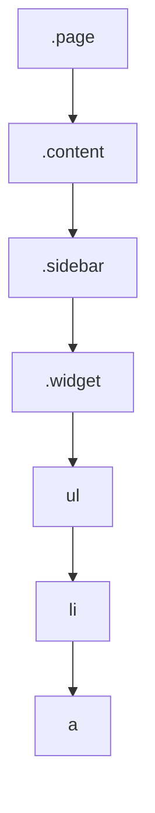

## 네이티브 CSS 중첩

같은 선택자를 반복해서 쓰는 건 CSS를 쓰다 보면 피할 수 없는 지루함이었다.

```css
.card { padding: 1rem; }
.card h2 { font-size: 1.5rem; }
.card p { color: gray; }
.card:hover { box-shadow: 0 2px 8px rgb(0 0 0 / 0.15); }
```

Sass 같은 전처리기를 쓰는 가장 큰 이유가 이 반복을 없애는 **중첩**<sup>Nesting</sup>이었다.
이제 **CSS 자체가 중첩을 지원한다.** 빌드 도구가 필요 없다.

```css
.card {
  padding: 1rem;

  h2 { font-size: 1.5rem; }
  p  { color: gray; }

  &:hover { box-shadow: 0 2px 8px rgb(0 0 0 / 0.15); }
}
```

<Callout type="info">
**Baseline 2023 (Newly available)**

Chrome 120, Safari 17.2, Firefox 117부터 완전한 형태로 지원한다. 주요 브라우저 전부에서 동작한다.
구형 브라우저까지 지원해야 하는 프로젝트라면 이 편 마지막의 폴백 전략을 참고한다.
</Callout>

## 기본 문법

중첩된 규칙은 **바깥 선택자의 자손**으로 해석된다.

```css
.card {
  color: black;

  h2 { color: navy; }
}
```

위 코드는 아래와 같다.

```css
.card { color: black; }
.card h2 { color: navy; }
```

### `&` — 부모 선택자 참조

`&`는 **바깥 선택자 자리에 그대로 대입**된다.

```css
.btn {
  background: gray;

  &:hover  { background: black; }   /* .btn:hover */
  &.active { background: crimson; } /* .btn.active */
  &::after { content: '→'; }        /* .btn::after */
}
```

자손이 아니라 **같은 요소**에 조건을 붙일 때 필요하다.

<Callout type="important">
**`&`를 빼면 의미가 완전히 달라진다**

```css
.btn {
  &.active { ... }   /* .btn.active  — btn이면서 active인 요소 */
  .active  { ... }   /* .btn .active — btn 안에 있는 active 요소 */
}
```

공백 하나 차이로 전혀 다른 요소를 가리킨다. 중첩에서 가장 흔한 실수다.
</Callout>

### `&`를 뒤에 놓기

`&`는 어디에나 놓을 수 있다. 조상 조건을 붙일 때 유용하다.

```css
.card {
  background: white;

  .dark-mode & {       /* .dark-mode .card */
    background: #222;
  }
}
```

"이 컴포넌트의 스타일"을 한곳에 모아 둘 수 있다는 게 중첩의 진짜 이점이다.

## Sass와 다른 점 — 반드시 알아야 할 것

Sass를 써 본 사람이 가장 많이 걸려 넘어지는 지점이다.

<Callout type="warning">
**`&`로 문자열을 이어 붙일 수 없다**

Sass에서는 이게 됐다.

```scss
/* Sass — 동작한다 */
.card {
  &__title { ... }   /* .card__title */
  &--large { ... }   /* .card--large */
}
```

**네이티브 CSS에서는 동작하지 않는다.** `&`는 문자열이 아니라 **선택자 자체를 가리키는 값**이기 때문이다.

```css
/* 네이티브 CSS — .card__title이 되지 않는다 */
.card {
  &__title { ... }   /* 잘못된 문법 */
}
```

BEM 방식으로 클래스를 짓는다면 **중첩을 쓰지 말고 그냥 풀어서 쓴다.**

```css
.card__title { ... }
.card--large { ... }
```
</Callout>

또 하나. **네이티브 중첩은 컴파일되지 않는다.** 브라우저가 실행 시점에 해석한다.
그래서 아래 두 가지가 Sass와 다르다.

| 항목 | Sass | 네이티브 CSS |
| --- | --- | --- |
| `&` 문자열 결합 | 가능 | **불가능** |
| 처리 시점 | 빌드 시 | 브라우저 실행 시 |
| 명시도 | 펼친 결과대로 | `&`는 `:is()`처럼 계산 |

마지막 항목을 조금 더 보자.

## 명시도 함정

중첩된 `&`의 명시도는 **`:is()`와 같은 방식**으로 계산된다.
즉 **바깥 선택자 목록 중 가장 높은 명시도**를 따른다.

```css
#app, .card {
  & h2 { color: red; }
}
```

`.card h2`에 적용될 때도 명시도는 `#app`을 기준으로 계산된다.
즉 `.card h2`(0,1,1)가 아니라 **`#app`급(1,0,1)** 으로 취급된다.

<Callout type="warning">
그래서 아래 코드로는 색이 바뀌지 않는다.

```css
#app, .card {
  & h2 { color: red; }
}

.card h2 { color: blue; }   /* 진다 — red가 이긴다 */
```

**해결책**: 선택자 목록에 ID 같은 고명시도 선택자를 섞지 않는다. 섞어야 한다면 `:where()`로 감싸 명시도를 0으로 만든다.

```css
:where(#app, .card) {
  & h2 { color: red; }
}
```
</Callout>

## 중첩할 수 있는 것

선택자뿐 아니라 **`@` 규칙도 중첩**된다. 이게 실무에서 가장 유용하다.

```css
.card {
  padding: 1rem;

  @media (width >= 768px) {
    padding: 2rem;
  }

  @supports (backdrop-filter: blur(4px)) {
    backdrop-filter: blur(4px);
  }
}
```

미디어 쿼리를 파일 하단에 몰아 쓰지 않고 **해당 컴포넌트 옆에 둘 수 있다.**
컴포넌트를 삭제할 때 관련 스타일이 함께 지워지므로 유지보수가 쉬워진다.

## 얼마나 중첩할 것인가

중첩은 편하지만 **깊어질수록 나빠진다.**

```css
/* 나쁜 예 — 무슨 요소인지 알 수 없다 */
.page {
  .content {
    .sidebar {
      .widget {
        ul { li { a { color: red; } } }
      }
    }
  }
}
```

선택자가 실제로 얼마나 깊이 쌓이는지 트리로 보면 문제가 더 뚜렷하다.



문제가 두 가지다.

1. **명시도가 계속 올라간다** — 나중에 덮어쓰기가 어려워진다
2. **구조에 묶인다** — HTML을 조금만 바꿔도 CSS가 깨진다

<Callout type="important">
**실무 기준: 2단계까지.**

`.card` 안에 `h2` 정도면 충분하다. 세 단계 이상 들어간다면 그건 중첩이 아니라
**클래스를 하나 더 만들어야 한다는 신호**다.

```css
/* 이렇게 */
.card { ... }
.card-title { ... }
.card-link { ... }
```
</Callout>

## 구형 브라우저 폴백

중첩을 지원하지 않는 브라우저에서는 **해당 규칙 전체가 무시된다.** 일부만 적용되는 게 아니라 통째로 사라진다.
그래서 폴백은 "지원 여부를 확인해 분기"하는 게 아니라 **빌드 단계에서 펼치는** 방식이 안전하다.

```bash
npm install -D postcss postcss-nesting
```

PostCSS의 `postcss-nesting` 플러그인이 중첩을 평평한 CSS로 변환해 준다.
Tailwind CSS나 Next.js처럼 PostCSS를 이미 쓰는 환경이라면 설정만 추가하면 된다.

<Callout type="info">
지원 브라우저만 상대한다면 폴백이 필요 없다. **어디까지 지원할지 먼저 정하는 게 순서다.**
</Callout>

## 정리

<Callout type="default">
- CSS가 **빌드 도구 없이 중첩을 지원**한다 (Baseline 2023)
- 중첩된 규칙은 기본적으로 **자손**으로 해석된다
- `&`는 **부모 선택자 자리에 대입**된다. `&.active`와 `.active`는 다르다
- **Sass처럼 `&__title`로 이어 붙일 수 없다.** BEM은 풀어서 쓴다
- `&`의 명시도는 `:is()` 방식이다 — 선택자 목록에 ID를 섞으면 함정이 된다
- `@media`, `@supports`도 중첩할 수 있다. 컴포넌트 옆에 두면 유지보수가 쉽다
- **2단계까지만.** 더 깊어지면 클래스를 새로 만든다
</Callout>

## 참고 자료

- [MDN — CSS 중첩 사용하기](https://developer.mozilla.org/en-US/docs/Web/CSS/Guides/Nesting)
- [MDN — `&` 중첩 선택자](https://developer.mozilla.org/en-US/docs/Web/CSS/Reference/Selectors/Nesting_selector)
- [W3C — CSS Nesting Module Level 1](https://www.w3.org/TR/css-nesting-1/)
- [Chrome for Developers — CSS Nesting](https://developer.chrome.com/docs/css-ui/css-nesting)
- [postcss-nesting](https://github.com/csstools/postcss-plugins/tree/main/plugins/postcss-nesting)
