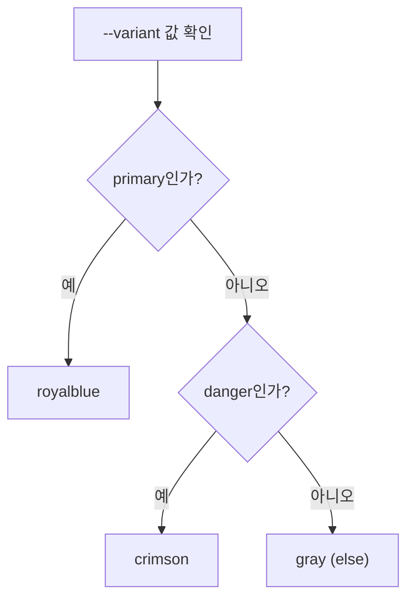

## if() 함수와 조건부 CSS

지금까지 "조건에 따라 다른 스타일"을 주려면 클래스를 바꾸거나 `@media`/`@supports` 블록을 따로 써야 했다.
`if()` 함수는 그 조건 분기를 **값 하나 안에** 넣을 수 있게 해준다.

<Callout type="warning">
**이 편의 내용은 아직 실험적이다.** `if()`는 2026년 중반 기준 **Chrome·Edge(137+)에서만** 지원하고,
Firefox는 개발 진행 중, Safari는 로드맵에만 있는 단계다. **Baseline에 들지 않은 기능**이므로,
지금 당장 실무에 쓰려면 반드시 이 편 마지막의 폴백 전략과 함께 사용해야 한다.
</Callout>

## 기본 문법

```css
.box {
  color: if(style(--theme: dark): white; else: black);
}
```

읽는 순서는 이렇다. **"`--theme`가 `dark`라는 스타일 조건이면 흰색, 아니면 검은색."**

`if()`는 세 가지 조건 함수를 받을 수 있다.

| 조건 함수 | 판단 기준 |
| --- | --- |
| `media(...)` | 미디어 쿼리 조건 (뷰포트 크기, 다크 모드 등) |
| `supports(...)` | 브라우저가 특정 CSS 기능을 지원하는지 |
| `style(...)` | 커스텀 프로퍼티(CSS 변수) 값이나 컨테이너 스타일 쿼리 조건 |

## media() 조건

```css
.text {
  font-size: if(media(width >= 768px): 1.25rem; else: 1rem);
}
```

지금까지 미디어 쿼리는 **블록 전체**를 감싸야 했다.

```css
/* 기존 방식 */
.text { font-size: 1rem; }

@media (width >= 768px) {
  .text { font-size: 1.25rem; }
}
```

`if()`를 쓰면 이 두 규칙이 **한 줄**로 줄어든다. 속성 하나만 조건부로 바꾸고 싶을 때 특히 간결해진다.

## style() 조건 — 커스텀 프로퍼티 기반 분기

가장 실용적인 활용은 **CSS 변수 값에 따라 분기**하는 것이다.

```css
.card {
  --variant: primary;

  background: if(
    style(--variant: primary): royalblue;
    style(--variant: danger): crimson;
    else: gray
  );
}
```

여러 조건을 세미콜론으로 나열하고, 위에서부터 순서대로 처음 맞는 조건이 적용된다. 마지막 `else`는 아무 조건도 안 맞을 때의 기본값이다.



<Callout type="info">
이 패턴은 지금까지 자바스크립트로 클래스를 갈아 끼우거나(`className={variant === 'danger' ? 'btn-danger' : 'btn-primary'}`),
Sass의 `@if`/`@else`로 처리하던 것과 같은 목적이다. `if()`가 자리 잡으면 **컴포넌트 변형(variant) 스타일을 순수 CSS로만** 표현할 수 있게 된다.
</Callout>

## 지금 당장은 무엇을 써야 하나

<Callout type="important">
**실무 판단**: `if()`가 Baseline이 되기 전까지는 아래 대안을 우선한다.

| 하고 싶은 것 | 지금 쓸 수 있는 방법 |
| --- | --- |
| 뷰포트 크기별 조건 | `@media` 블록 (계속 유효, 사라지지 않는다) |
| 컨테이너 크기별 조건 | `@container` (CSS 중급 과정에서 다룸) — 이미 Baseline |
| 변형(variant)별 스타일 | 클래스 분기 또는 `@scope`(2편) + 커스텀 프로퍼티 조합 |
| 기능 지원 여부 분기 | `@supports` (오래전부터 Baseline) |

`if()`는 이 방법들을 **대체하는 게 아니라, 짧게 줄여 쓰는 문법**에 가깝다. 지원이 갖춰질 때까지는 급하지 않다.
</Callout>

## 점진적 향상으로 도입하기

지원 브라우저에서만 혜택을 주고, 나머지는 기본값으로 자연스럽게 동작하게 하려면 `@supports`로 감싼다.

```css
.text {
  font-size: 1rem;   /* 기본값 — 모든 브라우저 */
}

@supports (color: if(style(--x: 1): red; else: blue)) {
  .text {
    font-size: if(media(width >= 768px): 1.25rem; else: 1rem);
  }
}
```

<Callout type="default">
기본값을 먼저 선언해두면, `if()`를 모르는 브라우저는 `@supports` 블록 전체를 건너뛰고 기본값만 적용한다.
지원 브라우저는 `@supports`를 통과해 향상된 스타일을 추가로 받는다. CSS 시리즈 전체에서 반복되는
**점진적 향상**<sup>Progressive Enhancement</sup> 원칙이 여기서도 그대로 적용된다.
</Callout>

## 정리

<Callout type="default">
- `if()`는 속성 값 안에 **조건 분기**를 직접 넣는 함수다
- `media()`, `supports()`, `style()` 세 종류의 조건을 쓸 수 있다
- 2026년 중반 기준 **Chromium 계열만 지원** — Baseline이 아니다
- 지금은 `@media`, `@container`, `@supports`, 클래스 분기 같은 **기존 방법이 여전히 정답**이다
- 도입한다면 반드시 **기본값 + `@supports` 감싸기**로 점진적 향상을 지킨다
</Callout>

다음 편에서는 반복되는 CSS 블록을 함수처럼 재사용하는 네이티브 믹스인 제안을 살펴본다.

## 참고 자료

- [Chrome for Developers — CSS if() 함수 소개](https://developer.chrome.com/blog/if-article)
- [MDN — if() (실험적)](https://developer.mozilla.org/en-US/docs/Web/CSS/if)
- [W3C — CSS Values and Units Module Level 5](https://www.w3.org/TR/css-values-5/#if-notation)
- [MDN — @supports](https://developer.mozilla.org/ko/docs/Web/CSS/@supports)
