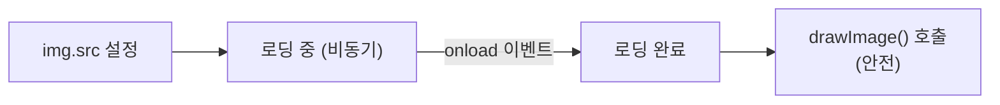

## Canvas 텍스트와 이미지

지금까지 도형만 그렸다. 실전에서는 글자와 이미지도 캔버스에 그려야 하는 경우가 많다 — 워터마크, 이미지 편집,
동적으로 생성하는 배지 이미지 같은 것들이다. 이번 편은 그 두 가지를 다룬다.

## 텍스트 그리기

```js
ctx.font = '32px sans-serif'
ctx.fillStyle = 'black'
ctx.fillText('안녕하세요', 20, 50)
```

`fillText(문자열, x, y)`는 채워진 글자를, `strokeText`는 테두리만 있는 글자를 그린다.

```js
ctx.font = '48px sans-serif'
ctx.strokeStyle = 'crimson'
ctx.lineWidth = 2
ctx.strokeText('테두리 글자', 20, 100)
```

### 정렬 맞추기

기본적으로 `(x, y)`는 텍스트의 **왼쪽 기준선**이다. 정렬 기준을 바꿀 수 있다.

```js
ctx.textAlign = 'center'      // left(기본) | center | right
ctx.textBaseline = 'middle'   // alphabetic(기본) | top | middle | bottom

ctx.fillText('중앙 정렬', canvas.width / 2, canvas.height / 2)
```

<Callout type="info">
캔버스 중앙에 글자를 정확히 맞추려면 `textAlign: 'center'`와 `textBaseline: 'middle'`을 함께 쓰고,
좌표에 캔버스 너비·높이의 절반을 넣는 게 가장 간단한 방법이다.
</Callout>

### 텍스트 크기 재기

글자가 캔버스 폭을 넘는지 미리 알고 싶을 때 쓴다.

```js
const metrics = ctx.measureText('안녕하세요')
console.log(metrics.width)   // 이 텍스트가 차지하는 픽셀 너비
```

## 이미지 그리기 — drawImage

`drawImage`는 인자 개수에 따라 세 가지 방식으로 동작한다. 헷갈리기 쉬운 부분이라 하나씩 본다.

### 방식 1 — 그냥 그리기

```js
const img = new Image()
img.src = 'cat.png'
img.onload = () => {
  ctx.drawImage(img, 10, 10)   // (10, 10) 위치에 원본 크기 그대로
}
```

<Callout type="warning">
**이미지는 로드가 끝난 뒤에 그려야 한다.** `img.src`를 설정한다고 바로 그릴 수 있는 게 아니다.
`onload` 콜백 안에서 `drawImage`를 호출해야 안전하다. (이미지·파일 비동기 로딩의 일반 원리는 Web APIs 시리즈에서 더 다룬다.)
</Callout>

### 방식 2 — 크기 지정해서 그리기

```js
ctx.drawImage(img, 10, 10, 200, 150)   // (x, y, 너비, 높이) — 원본 비율 무시하고 강제로 리사이즈
```

### 방식 3 — 이미지의 일부만 잘라 그리기 (스프라이트)

```js
ctx.drawImage(
  img,
  0, 0, 64, 64,      // 원본 이미지에서 (0,0)부터 64×64 크기만큼 잘라서
  100, 100, 128, 128  // 캔버스의 (100,100) 위치에 128×128 크기로 그린다
)
```

<Callout type="info">
이 방식은 하나의 큰 이미지(스프라이트 시트)에 여러 아이콘·캐릭터 프레임을 모아두고 필요한 부분만 잘라 쓸 때 유용하다.
게임 캐릭터 애니메이션이 대표적인 활용 사례다.
</Callout>

## 픽셀 직접 조작하기

캔버스는 그려진 결과를 **픽셀 배열**로 직접 읽고 쓸 수 있다. 이미지 필터 같은 걸 만들 때 이 방식을 쓴다.

```js
const imageData = ctx.getImageData(0, 0, canvas.width, canvas.height)
const pixels = imageData.data   // [R, G, B, A, R, G, B, A, ...] 형태의 배열

for (let i = 0; i < pixels.length; i += 4) {
  const gray = (pixels[i] + pixels[i + 1] + pixels[i + 2]) / 3
  pixels[i] = gray       // R
  pixels[i + 1] = gray   // G
  pixels[i + 2] = gray   // B
  // pixels[i + 3]은 알파(투명도) — 그대로 둔다
}

ctx.putImageData(imageData, 0, 0)   // 수정한 픽셀을 다시 캔버스에 반영
```

`data`는 픽셀마다 **R, G, B, A(빨강·초록·파랑·투명도) 네 개의 숫자**가 순서대로 반복되는 1차원 배열이다.
위 코드는 R·G·B 평균을 내 흑백으로 만드는 아주 기본적인 필터다.

<Callout type="important">
`getImageData`를 반복 호출하는 코드라면 1편에서 본 `willReadFrequently: true` 옵션을 컨텍스트 생성 시 켜두는 게 좋다.
브라우저가 이런 읽기 작업에 맞는 방식으로 캔버스를 미리 최적화해 준다.
</Callout>

## 흔한 실수 — 이미지 로딩 순서

```js
const img = new Image()
img.src = 'cat.png'
ctx.drawImage(img, 0, 0)   // 아무것도 안 그려질 수 있다!
```

이미지가 실제로 거치는 상태를 그리면 이렇다. `drawImage`는 반드시 "로딩 완료" 이후에 불러야 한다.



<Callout type="warning">
이미지 파일을 내려받는 데는 시간이 걸린다. `img.src`를 설정한 바로 다음 줄에서 `drawImage`를 호출하면,
**아직 이미지가 다 로드되지 않은 상태**일 수 있다. 이때는 아무것도 그려지지 않거나 에러가 난다.
반드시 `img.onload` 안에서 그리거나, 여러 이미지를 한꺼번에 다뤄야 한다면 `Promise`로 로딩 완료를 기다리는 패턴을 쓴다.
</Callout>

## 정리

<Callout type="default">
- 텍스트는 `fillText`/`strokeText`로 그리고, `textAlign`/`textBaseline`으로 정렬한다
- `drawImage`는 인자 개수에 따라 **그대로 그리기 / 크기 조절 / 일부만 잘라 그리기** 세 방식이 있다
- 이미지는 **로드가 끝난 뒤(`onload`)** 그려야 한다
- `getImageData`/`putImageData`로 픽셀 배열(R,G,B,A 반복)을 직접 읽고 쓸 수 있다
</Callout>

다음 편에서는 도형과 이미지를 회전·확대하고, 이를 반복해 애니메이션으로 움직이는 법을 본다.

## 참고 자료

- [MDN — Canvas에 텍스트 그리기](https://developer.mozilla.org/ko/docs/Web/API/Canvas_API/Tutorial/Drawing_text)
- [MDN — 이미지 사용하기](https://developer.mozilla.org/ko/docs/Web/API/Canvas_API/Tutorial/Using_images)
- [MDN — CanvasRenderingContext2D.drawImage()](https://developer.mozilla.org/ko/docs/Web/API/CanvasRenderingContext2D/drawImage)
- [MDN — ImageData와 픽셀 조작](https://developer.mozilla.org/ko/docs/Web/API/Canvas_API/Tutorial/Pixel_manipulation_with_canvas)
