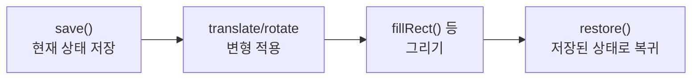
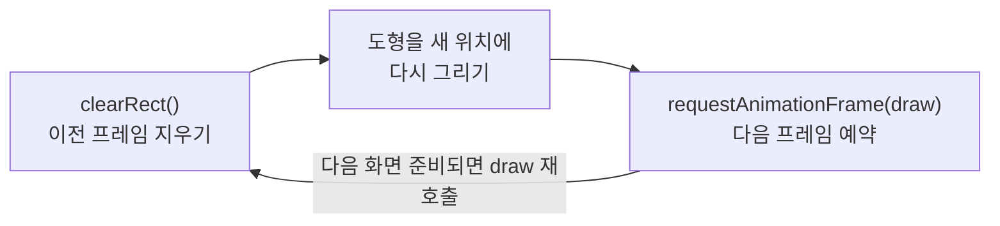

## Canvas 변형과 애니메이션

지금까지는 도형을 원하는 좌표에 직접 계산해서 그렸다. 회전한 사각형을 그리려면
꼭짓점 네 개의 회전된 좌표를 일일이 계산해야 했을 것이다. **변형**<sup>Transform</sup>을 쓰면 이걸 훨씬 쉽게 만들 수 있다.

## 좌표계 자체를 옮긴다는 발상

캔버스의 변형 메서드는 도형이 아니라 **좌표계(원점과 축)** 를 움직인다는 점이 핵심이다.

```js
ctx.translate(100, 100)   // 원점을 (100, 100)으로 옮긴다
ctx.fillRect(0, 0, 50, 50)  // "새 원점" 기준 (0,0)에 그린다 → 실제로는 (100,100)에 그려진다
```

<Callout type="important">
도형의 좌표를 계산해서 옮기는 게 아니라, **"어디를 (0,0)이라고 부를지"를 먼저 바꾸고 평소처럼 그린다.**
회전과 확대도 같은 발상이다.
</Callout>

## save()와 restore() — 변형을 되돌리는 안전장치

변형은 한번 적용하면 그 뒤의 모든 그리기에 계속 영향을 준다. 여러 도형을 각각 다르게 변형하려면
**변형을 걸기 전 상태를 저장해뒀다가 나중에 되돌리는** 습관이 필요하다.

```js
ctx.save()          // 지금 상태(변형 없음)를 저장
ctx.translate(100, 100)
ctx.rotate(Math.PI / 4)   // 45도 회전
ctx.fillRect(-25, -25, 50, 50)   // 회전된 사각형
ctx.restore()        // 저장해둔 상태로 복귀 — 이동·회전이 취소된다

ctx.fillRect(10, 10, 50, 50)   // 영향받지 않고 원래 좌표계에 그려진다
```

한 사이클을 그리면 이렇다.



<Callout type="warning">
`save()`/`restore()` 없이 여러 도형을 변형하면, 앞서 건 `translate`나 `rotate`가 계속 누적되어
다음 도형의 위치가 예상과 달라진다. **변형이 필요한 도형마다 `save()` → 변형 → 그리기 → `restore()`** 패턴을 습관화하자.
</Callout>

## 세 가지 기본 변형

```js
ctx.translate(x, y)     // 이동
ctx.rotate(각도_라디안)   // 회전 — 현재 원점을 중심으로 회전
ctx.scale(x배율, y배율)  // 확대·축소
```

회전은 항상 **현재 원점을 중심**으로 일어난다. 그래서 "특정 도형을 그 도형의 중심 기준으로 회전"시키려면
먼저 그 중심으로 `translate`한 뒤 회전하고, 도형은 원점(0,0) 기준 좌표로 그리는 게 일반적인 패턴이다.

```js
function drawRotatedSquare(centerX, centerY, size, angle) {
  ctx.save()
  ctx.translate(centerX, centerY)   // 회전축을 사각형 중심으로 옮기고
  ctx.rotate(angle)
  ctx.fillRect(-size / 2, -size / 2, size, size)   // 원점 기준으로 그린다
  ctx.restore()
}
```

## 애니메이션의 핵심 — requestAnimationFrame

정적인 그림을 넘어 **움직이는 화면**을 만들려면, 아주 짧은 간격으로 "지우고 다시 그리기"를 반복해야 한다.
이때 `setInterval`이 아니라 **`requestAnimationFrame`**을 쓴다.

```js
let x = 0

function draw() {
  ctx.clearRect(0, 0, canvas.width, canvas.height)   // 이전 프레임 지우기

  ctx.fillStyle = 'crimson'
  ctx.fillRect(x, 50, 50, 50)

  x += 2
  if (x > canvas.width) x = -50

  requestAnimationFrame(draw)   // 다음 프레임에 draw를 다시 실행해 달라고 예약
}

requestAnimationFrame(draw)   // 첫 실행
```

`draw` 함수가 스스로를 반복 예약하는 흐름을 그리면 이렇다.



<Callout type="important">
**왜 `setInterval(draw, 16)` 같은 걸 쓰지 않는가?**

`requestAnimationFrame`은 브라우저에게 **"다음 화면을 그릴 준비가 됐을 때 이 함수를 실행해 달라"** 고 요청하는 것이다.
브라우저가 화면 주사율(보통 초당 60번)에 맞춰 정확한 타이밍에 호출해 주고, 탭이 백그라운드에 있으면 자동으로 멈춰 배터리를 아낀다.
`setInterval`은 이런 조율 없이 그냥 정해진 시간마다 실행되므로 화면이 끊기거나 불필요하게 자원을 쓸 수 있다.
</Callout>

## 애니메이션 멈추기

```js
let animationId

function draw() {
  // ... 그리기 로직 ...
  animationId = requestAnimationFrame(draw)
}

animationId = requestAnimationFrame(draw)

// 멈추고 싶을 때
cancelAnimationFrame(animationId)
```

`requestAnimationFrame`이 반환하는 ID를 저장해뒀다가 `cancelAnimationFrame`에 넘기면 예약된 다음 실행을 취소할 수 있다.

## 프레임 사이 시간으로 속도 일정하게 유지하기

<Callout type="info">
지금까지 예제처럼 매 프레임 `x += 2`만 하면, 사용자 기기의 화면 주사율에 따라 체감 속도가 달라진다
(주사율 120Hz인 기기에서는 두 배 빠르게 움직인다). 정확한 속도 제어가 필요하면 `requestAnimationFrame`이 넘겨주는
타임스탬프를 이용해 "프레임 사이 실제 경과 시간"만큼만 이동시키는 방식을 쓴다.

```js
let lastTime = 0

function draw(currentTime) {
  const delta = currentTime - lastTime   // 이전 프레임과의 시간 차이(ms)
  lastTime = currentTime

  x += 0.1 * delta   // 시간에 비례해서 이동 → 기기 주사율과 무관하게 속도 일정
  // ...
  requestAnimationFrame(draw)
}
```

지금은 이런 방식이 있다는 것만 알아두면 충분하다.
</Callout>

## 정리

<Callout type="default">
- `translate`/`rotate`/`scale`은 도형이 아니라 **좌표계 자체**를 바꾼다
- 변형은 계속 누적되므로 **`save()`로 저장하고 `restore()`로 되돌리는** 습관이 필요하다
- 회전은 항상 **현재 원점 기준**이라, 도형 중심으로 돌리려면 먼저 그 중심으로 이동해야 한다
- 애니메이션은 `clearRect` → 그리기 → `requestAnimationFrame(draw)` 반복 패턴이다
- `setInterval`보다 `requestAnimationFrame`을 쓰는 이유는 **화면 주사율과 배터리 최적화**를 브라우저가 대신해주기 때문이다
</Callout>

다음 편에서는 Canvas 2D를 넘어, GPU를 활용하는 3D 그래픽스인 WebGL을 개념적으로 소개한다.

## 참고 자료

- [MDN — 변형(Transformations)](https://developer.mozilla.org/ko/docs/Web/API/Canvas_API/Tutorial/Transformations)
- [MDN — 애니메이션 기초](https://developer.mozilla.org/ko/docs/Web/API/Canvas_API/Tutorial/Basic_animations)
- [MDN — window.requestAnimationFrame()](https://developer.mozilla.org/ko/docs/Web/API/Window/requestAnimationFrame)
