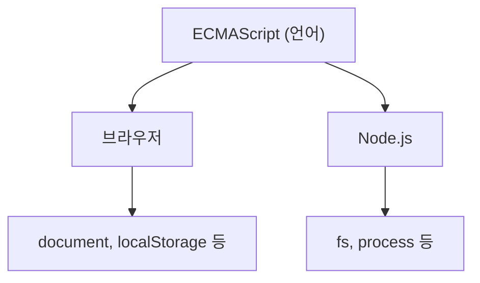

## ECMAScript와 자바스크립트

**자바스크립트**는 웹 페이지에 동작을 넣는 프로그래밍 언어다. 그런데 "자바스크립트"라는 이름 뒤에는 사실 두 가지가 있다.

- **ECMAScript** — "이 언어는 이렇게 동작해야 한다"고 정해둔 **표준 규격(문서)**
- **자바스크립트** — 그 규격을 실제로 구현한 **언어**

콘센트에 비유하면, ECMAScript는 "220V, 이런 모양"이라고 정한 규격 문서이고, 자바스크립트는 그 규격에 맞게 만들어진 실제 콘센트다.

<Callout type="info">
브라우저마다 자바스크립트가 제각각 동작하던 시절이 있었다. 1997년 **ECMA International**이라는 단체가 표준(ECMAScript)을 만들면서 이 혼란이 정리됐다. 지금은 이 규격을 브라우저·Node.js 등 모든 실행 환경이 따른다.
</Callout>

## 언어와 실행 환경은 다르다

가장 중요한 구분이 하나 있다. **언어 자체**와 **그 언어를 실행시키는 환경이 추가로 주는 기능**은 다르다.

```js
const message = '안녕'   // 언어 기능 — 어디서든 동작한다

document.title = message   // 브라우저가 주는 기능
localStorage.setItem('a', message)  // 브라우저가 주는 기능
```

`const`, `function`, `class`, `Promise`는 **언어(ECMAScript) 자체**의 문법이라 어디서 실행하든 똑같이 동작한다. 반면 `document`나 `localStorage`는 **브라우저가 추가로 얹어주는 기능**이다. Node.js에서 같은 코드를 실행하면 `document`는 없어서 에러가 난다.



이 구분이 이 사이트의 두 시리즈를 가른다. **ECMAScript 시리즈**(지금 이 시리즈)는 언어 자체를, **Web APIs 시리즈**는 브라우저가 주는 기능을 다룬다.

## 모던 자바스크립트

2015년에 나온 **ES6**(ES2015)에서 `let`/`const`, 화살표 함수, 클래스, `Promise` 등 지금 당연하게 쓰는 문법 대부분이 한꺼번에 추가됐다. 그래서 "모던 자바스크립트"는 보통 이 시점 이후를 가리킨다. 이 시리즈는 모던 문법을 기준으로 쓴다.

## 마무리 복습

<Quiz
  questionNumber={1}
  question={"ECMAScript와 자바스크립트의 관계를 가장 정확히 설명한 것은?"}
  options={[
    "완전히 같은 말이다. 이름이 두 개일 뿐이다",
    "ECMAScript는 표준 규격이고, 자바스크립트는 그 규격을 구현한 실제 언어다",
    "자바스크립트가 먼저 있었고, ECMAScript가 그걸 대체한 새 언어다",
    "ECMAScript는 자바스크립트의 옛날 이름이다",
  ]}
  correctAnswer={2}
  explanation={"ECMAScript는 '이 언어는 이렇게 동작해야 한다'고 정한 규격 문서이고, 자바스크립트는 그 규격을 실제로 구현한 언어다."}
  optionExplanations={[
    "이름만 다른 게 아니라 '규격 문서'와 '그 규격을 구현한 언어'라는 역할 자체가 다르다.",
    "정답이다. ECMAScript는 규격, 자바스크립트는 그 규격을 구현한 실제 언어다.",
    "시간 순서가 반대다. 자바스크립트가 먼저 있었고, 혼란을 정리하려고 ECMAScript 표준이 나중에 만들어졌다.",
    "옛날 이름이 아니라 지금도 쓰이는 표준의 공식 명칭이다.",
  ]}
/>
<Quiz
  questionNumber={2}
  question={"다음 중 Node.js에서 실행하면 에러가 나는 것은?"}
  options={[
    "const name = '지민'",
    "function greet() {}",
    "document.title",
    "[1, 2, 3].map(x => x)",
  ]}
  correctAnswer={3}
  explanation={"document는 브라우저가 주는 기능이라 Node.js에는 없다. const, function, 배열 메서드는 전부 언어(ECMAScript) 자체의 기능이라 어디서든 동작한다."}
  optionExplanations={[
    "변수 선언은 언어 자체의 문법이라 Node.js에서도 정상 동작한다.",
    "함수 선언도 언어 자체의 문법이라 어디서든 동작한다.",
    "정답이다. document는 브라우저 전용 기능이라 Node.js에는 존재하지 않는다.",
    "배열 메서드(map)는 언어 자체에 내장된 기능이라 어디서든 동작한다.",
  ]}
/>

## 참고 자료

- [MDN — JavaScript 첫걸음](https://developer.mozilla.org/ko/docs/Learn_web_development/Core/Scripting)
- [ECMAScript 명세 (TC39)](https://tc39.es/ecma262/)
