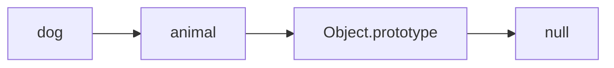

<Callout type="info">
  **이번 문서의 목표:** 프로토타입 체인이 어떻게 동작하는지 이해하고, 상속을 구현하는 방법을 익힙니다.
</Callout>

## 프로토타입이란

JavaScript의 모든 객체는 숨겨진 링크인 **[[Prototype]]** 을 가집니다. 이 링크는 다른 객체를 가리키며, 프로퍼티를 찾을 때 이 링크를 따라 올라갑니다.

```js
const animal = {
  breathe() {
    return '숨쉬기'
  },
}

const dog = Object.create(animal)  // dog의 [[Prototype]]이 animal
dog.bark = function() { return '멍멍' }

console.log(dog.bark())    // '멍멍' (dog의 고유 메서드)
console.log(dog.breathe()) // '숨쉬기' (animal에서 상속)
```

## 프로토타입 체인

프로퍼티를 찾는 순서는 다음과 같습니다.

1. 현재 객체에서 찾는다.
2. 없으면 [[Prototype]]이 가리키는 객체에서 찾는다.
3. 없으면 그 위의 [[Prototype]]으로 올라간다.
4. `null`에 도달하면 `undefined`를 반환한다.



## __proto__

`__proto__`는 [[Prototype]]에 접근하는 비표준 접근자입니다. 읽기 전용으로 확인하는 용도로만 사용하고, 직접 설정은 피하세요.

```js
console.log(dog.__proto__ === animal)  // true
```

## 생성자 함수와 prototype 프로퍼티

함수에는 `prototype` 프로퍼티가 있습니다. `new`로 생성된 인스턴스의 [[Prototype]]은 생성자 함수의 `prototype`을 가리킵니다.

```js
function Person(name) {
  this.name = name
}

Person.prototype.greet = function() {
  return `안녕하세요, ${this.name}입니다.`
}

const p = new Person('철수')
console.log(p.greet())           // '안녕하세요, 철수입니다.'
console.log(p.__proto__ === Person.prototype)  // true
```

## Object.create()

특정 객체를 [[Prototype]]으로 가지는 새 객체를 만듭니다.

```js
const proto = {
  describe() {
    return `이름: ${this.name}`
  },
}

const obj = Object.create(proto)
obj.name = '테스트'
console.log(obj.describe())  // '이름: 테스트'
```

`Object.create(null)`은 프로토타입이 없는 순수한 객체를 만듭니다.

## hasOwnProperty

프로토타입 체인을 타지 않고 객체 자신의 프로퍼티인지 확인합니다.

```js
console.log(p.hasOwnProperty('name'))    // true (자신의 프로퍼티)
console.log(p.hasOwnProperty('greet'))   // false (프로토타입에 있음)
```

## 핵심 정리

- 모든 객체는 [[Prototype]] 링크를 가지며 프로토타입 체인을 통해 프로퍼티를 상속합니다.
- 생성자 함수의 `prototype`에 메서드를 추가하면 인스턴스가 공유합니다.
- `Object.create(proto)`로 프로토타입을 지정한 객체를 만듭니다.
- `hasOwnProperty`로 자신의 프로퍼티와 상속된 프로퍼티를 구분합니다.

## 마무리 복습

<Quiz
  questionNumber={1}
  question="프로토타입 체인에서 프로퍼티를 찾는 순서는?"
  options={[
    '전역 객체 → prototype → 현재 객체',
    '현재 객체 → [[Prototype]] → 그 위 [[Prototype]] → null',
    '현재 객체 → null → [[Prototype]]',
    '항상 Object.prototype에서 먼저 찾는다.',
  ]}
  correctAnswer={2}
  explanation="현재 객체에서 시작해 [[Prototype]] 링크를 따라 위로 올라가며 찾고, null에 도달하면 undefined를 반환합니다."
  optionExplanations={[
    '전역 객체에서 시작하지 않습니다.',
    '맞습니다. 아래에서 위로 체인을 탐색합니다.',
    '현재 객체 다음에 null이 오지 않습니다.',
    'Object.prototype은 체인의 최상위입니다.',
  ]}
/>

<Quiz
  questionNumber={2}
  question="`Object.create(proto)`의 동작은?"
  options={[
    'proto의 모든 프로퍼티를 복사한 새 객체를 만든다.',
    'proto를 [[Prototype]]으로 가지는 새 객체를 만든다.',
    'proto를 클론해 완전히 독립된 객체를 만든다.',
    '항상 빈 객체를 만든다.',
  ]}
  correctAnswer={2}
  explanation="Object.create(proto)는 proto를 [[Prototype]]으로 갖는 새 객체를 생성합니다. 프로퍼티 복사가 아닌 프로토타입 링크를 설정합니다."
  optionExplanations={[
    '복사가 아닌 프로토타입 링크 설정입니다.',
    '맞습니다. proto를 프로토타입으로 가진 빈 객체를 만듭니다.',
    '독립 복사가 아닙니다.',
    '프로토타입 링크를 설정한 빈 객체입니다.',
  ]}
/>

<Quiz
  questionNumber={3}
  question="`hasOwnProperty`를 사용하는 이유는?"
  options={[
    '객체의 크기를 확인하기 위해',
    '프로토타입 체인을 탐색하지 않고 해당 객체 자신의 프로퍼티인지 확인하기 위해',
    '프로퍼티 값을 반환하기 위해',
    '프로퍼티를 삭제하기 위해',
  ]}
  correctAnswer={2}
  explanation="hasOwnProperty는 프로토타입 체인을 타지 않고 객체 자신에게 해당 프로퍼티가 직접 정의되어 있는지 확인합니다."
  optionExplanations={[
    '크기 확인은 length나 Object.keys().length를 씁니다.',
    '맞습니다. 자신의 프로퍼티인지 구분합니다.',
    '프로퍼티 값을 직접 반환하지 않고 boolean을 반환합니다.',
    '삭제는 delete를 씁니다.',
  ]}
/>

<Quiz
  questionNumber={4}
  question="생성자 함수의 `prototype`에 메서드를 추가하는 이유는?"
  options={[
    '모든 인스턴스가 메서드를 공유해 메모리를 효율적으로 사용하기 위해',
    '메서드를 숨기기 위해',
    '인스턴스마다 다른 메서드를 갖게 하기 위해',
    '생성자 함수를 빠르게 실행하기 위해',
  ]}
  correctAnswer={1}
  explanation="prototype에 메서드를 추가하면 모든 인스턴스가 같은 함수 객체를 공유하여 메모리를 절약할 수 있습니다."
  optionExplanations={[
    '맞습니다. 인스턴스 수에 관계없이 메서드 하나를 공유합니다.',
    '숨김 효과가 아닙니다.',
    '공유이므로 인스턴스마다 다르지 않습니다.',
    '실행 속도와 직접 관련이 없습니다.',
  ]}
/>

<Quiz
  questionNumber={5}
  question="프로토타입 체인의 끝에는 무엇이 있나요?"
  options={['Object.prototype', 'null', 'undefined', 'Function.prototype']}
  correctAnswer={2}
  explanation="프로토타입 체인의 최상위에는 Object.prototype이 있고, 그 위는 null입니다."
  optionExplanations={[
    'Object.prototype은 체인의 최상위 객체이지만, 그 위에 null이 있습니다.',
    '맞습니다. null이 체인의 끝입니다.',
    'undefined가 아닌 null이 끝입니다.',
    'Function.prototype은 함수 프로토타입이며 체인의 끝이 아닙니다.',
  ]}
/>

<Quiz
  questionNumber={6}
  question="다음 중 프로토타입 체인과 관련이 없는 것은?"
  options={['instanceof 연산자', 'in 연산자', 'hasOwnProperty 메서드', 'delete 연산자']}
  correctAnswer={4}
  explanation="delete는 객체에서 프로퍼티를 삭제하며 프로토타입 체인을 탐색하지 않습니다. instanceof, in, hasOwnProperty는 체인과 관련됩니다."
  optionExplanations={[
    'instanceof는 프로토타입 체인을 탐색합니다.',
    'in 연산자는 체인을 통해 프로퍼티를 찾습니다.',
    'hasOwnProperty는 체인을 타지 않고 자신의 프로퍼티를 확인합니다.',
    '맞습니다. delete는 프로토타입 체인과 무관합니다.',
  ]}
/>

## 참고 자료

- [MDN - 프로토타입 상속](https://developer.mozilla.org/ko/docs/Web/JavaScript/Inheritance_and_the_prototype_chain)
- [MDN - Object.create](https://developer.mozilla.org/ko/docs/Web/JavaScript/Reference/Global_Objects/Object/create)
