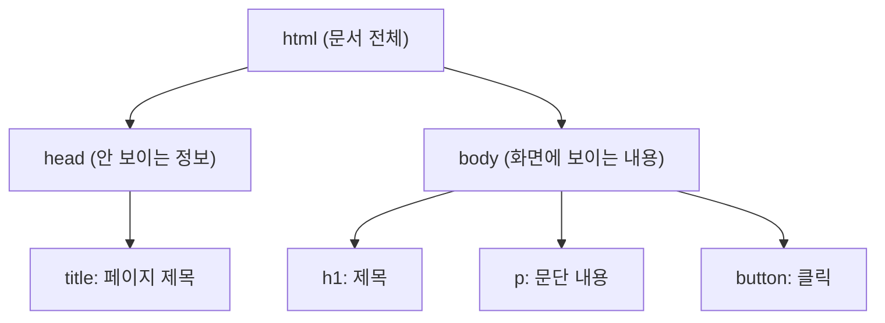

<Callout type="info">
  **이번 문서의 목표:** React 코드(JSX)를 읽고 쓰려면 HTML 태그의 의미, CSS가 요소를 배치하는 원리(박스 모델, Flexbox)를 알아야 합니다. 이 문서를 다 읽으면 카드 UI 하나를 HTML+CSS만으로 직접 배치할 수 있게 됩니다.
</Callout>

## 왜 HTML·CSS를 먼저 알아야 하나?

React는 화면(UI)을 만드는 라이브러리입니다. React가 최종적으로 브라우저에 그려내는 것은 결국 **HTML 요소**이고, 그 요소들의 위치와 모양을 정하는 것은 여전히 **CSS**입니다. React는 "HTML을 대신 그려주는 마법"이 아니라 "HTML을 자바스크립트로 더 편하게 조립하는 도구"입니다.

> **쉽게 말하면:** React를 레고 조립 로봇이라고 하면, HTML 태그는 레고 블록의 종류(둥근 블록, 네모 블록)이고 CSS는 그 블록에 색을 칠하고 배치하는 규칙입니다. 로봇을 쓰기 전에 블록의 종류와 배치 규칙을 알아야 로봇에게 무엇을 시킬지 정할 수 있습니다.

이 지식이 없으면 뒤에서 JSX를 배울 때 "`<div>`가 뭐 하는 태그인지", "`display: flex`가 왜 필요한지" 자체가 이해되지 않아 React 문법만 외우게 됩니다. 원리를 알아야 응용할 수 있습니다.

---

## HTML 기본 구조

### 이름부터 뜯어보기 — HTML이 무슨 뜻인가?

**HTML**은 네 개의 영단어를 줄인 말입니다. 하나씩 뜯어보면 이름 자체가 이 언어의 정체를 설명하고 있습니다.

| 단어 | 뜻 | 여기서의 의미 |
|------|-----|---------------|
| **Hyper** | "초월한, ~을 뛰어넘는"이라는 뜻의 접두사 | 한 문서 안에 갇히지 않고 **다른 문서로 뛰어넘어**(링크로 이동) 갈 수 있다는 뜻 |
| **Text** | 글, 문서 | 다루는 대상이 원래는 "글(텍스트)"이었다는 뜻 (지금은 이미지·영상도 포함) |
| **Markup** | mark(표시하다) + up(강조 접미사) → "표시를 달다, 주석을 붙이다" | 글에 "이 부분은 제목이다", "이 부분은 링크다"처럼 **표시(태그)를 붙인다**는 뜻 |
| **Language** | 언어 | 이 모든 규칙을 정리한 하나의 "언어"라는 뜻 |

**HTML = HyperText Markup Language = "여러 문서를 서로 뛰어넘어 연결할 수 있는 글에, 표시(태그)를 붙이는 언어"**

> **쉽게 말하면:** 그냥 글쓰기 도구가 아니라, "이 부분은 제목", "이 부분은 클릭하면 다른 페이지로 이동" 같은 **의미표시를 붙인 특수한 글쓰기 방식**입니다. 그 표시를 붙이는 도구가 바로 뒤에서 배울 **태그**입니다.

### 웹 페이지의 뼈대 — 문서 구조

HTML 문서는 아래처럼 태그들이 서로를 감싸는 **계층(트리) 구조**를 이룹니다.



```html
<!DOCTYPE html>
<html lang="ko">
  <head>
    <title>페이지 제목</title>
  </head>
  <body>
    <h1>제목</h1>
    <p>문단 내용</p>
    <button>클릭</button>
  </body>
</html>
```

- `<!DOCTYPE html>`: "이 문서는 최신 HTML5 표준을 따른다"고 브라우저에 알리는 선언. 항상 첫 줄에 옵니다. (`DOCTYPE` = Document(문서) + Type(종류) → "문서의 종류")
- `<html>`: 문서 전체를 감싸는 최상위 태그. `lang="ko"`의 `lang`은 language(언어)의 줄임말로, "이 문서는 한국어"라는 뜻이며 스크린 리더나 번역기가 참고합니다.
- `<head>`: head(머리)라는 이름처럼, 화면에 보이지 않는 "생각·정보"(제목, 문자 인코딩, 연결할 CSS 파일 등)가 들어갑니다.
- `<body>`: body(몸통)라는 이름처럼, 실제로 화면에 보이는 모든 내용(눈에 보이는 몸)이 들어갑니다.

> **비유:** `head`는 사람의 "머릿속 생각"(겉으로 안 보임), `body`는 "실제로 보이는 몸"이라고 생각하면 이름을 외우기 쉽습니다.

### 여는 태그와 닫는 태그

대부분의 태그는 `<태그명>내용</태그명>` 형태로 **내용을 감쌉니다**. `/`가 붙은 쪽이 "닫는 태그"입니다.

```html
<p>이것은 문단입니다.</p>
<!--  ↑ 여는 태그        ↑ 닫는 태그  -->
```

내용이 없이 태그 하나로 끝나는 것도 있습니다(예: 이미지, 줄바꿈). 이런 태그는 **자기 닫기**(self-closing) 형태를 씁니다.

```html

<br />
<input type="text" />
```

> **자주 틀리는 점:** 순수 HTML5에서는 ``, `<br>`처럼 슬래시 없이 써도 되지만, **JSX(React)에서는 반드시 ``처럼 슬래시로 닫아야** 합니다. 이 문서 뒤에서 다시 설명합니다.

### 자주 쓰는 HTML 태그

| 태그 | 원래 영단어 (뜻) | 용도 | 예시 |
| --- | --- | --- | --- |
| `h1`~`h6` | **h**eading (표제, 제목) | 제목(숫자가 작을수록 더 큰 제목) | `<h1>가장 큰 제목</h1>` |
| `p` | **p**aragraph (문단) | 문단 | `<p>텍스트</p>` |
| `div` | **div**ision (구역, 나눈 부분) | 의미 없는 블록 컨테이너(레이아웃용) | `<div>...</div>` |
| `span` | span (양팔을 벌린 폭, "한 뼘") | 의미 없는 인라인 컨테이너(텍스트 일부 강조용) | `<span>강조</span>` |
| `ul` / `ol` / `li` | **u**nordered/**o**rdered **l**ist, **l**ist **i**tem (순서없는/순서있는 목록, 목록 항목) | 목록과 그 항목 | `<ul><li>항목</li></ul>` |
| `button` | button (누르는 단추) | 클릭 가능한 버튼 | `<button>클릭</button>` |
| `input` | input (입력) | 사용자 입력창 | `<input type="text" />` |
| `img` | **im**a**g**e (이미지, 그림) | 이미지 삽입 | `` |
| `a` | **a**nchor (닻, 배를 고정하는 갈고리 — 페이지에 "고정된 이동 지점") | 다른 페이지로 이동하는 링크 | `<a href="...">텍스트</a>` |

> **`a` 태그가 왜 anchor(닻)일까?** 닻은 배를 한 자리에 단단히 고정하는 도구입니다. `<a>` 태그도 "이 글자를 클릭하면 특정 위치(다른 페이지 또는 같은 페이지의 특정 지점)에 도착한다"는 점에서, 마치 그 위치에 닻을 내려 고정해 둔 것과 같다는 비유로 이름 붙여졌습니다.

### 시맨틱(semantic) 태그 — 의미가 있는 구조

`div`는 아무 의미가 없는 "그냥 상자"지만, HTML5에는 **역할이 이름에 담긴 태그**들이 있습니다. 검색엔진과 스크린 리더가 문서 구조를 이해하는 데 도움을 줍니다.

| 태그 | 의미 |
|------|------|
| `header` | 페이지 또는 섹션의 머리말(로고, 제목, 내비게이션) |
| `nav` | 내비게이션(메뉴) 링크 모음 |
| `main` | 문서의 핵심 콘텐츠(페이지당 하나만) |
| `section` | 주제별로 묶인 구역 |
| `article` | 독립적으로 배포 가능한 콘텐츠(블로그 글, 뉴스 기사) |
| `aside` | 본문과 간접적으로 관련된 사이드 콘텐츠 |
| `footer` | 페이지 또는 섹션의 꼬리말(저작권, 연락처) |

```html
<header>
  <h1>내 블로그</h1>
  <nav><a href="/">홈</a> <a href="/about">소개</a></nav>
</header>
<main>
  <article>
    <h2>글 제목</h2>
    <p>글 내용...</p>
  </article>
</main>
<footer>© 2026 내 블로그</footer>
```

> **왜 div만 안 쓰고 시맨틱 태그를 쓰나?** `<div class="header">`도 화면상으로는 똑같이 보이지만, `<header>`를 쓰면 브라우저·검색엔진·시각장애인용 스크린 리더가 "이 부분은 머리말이다"라고 자동으로 인식합니다. 접근성(accessibility)과 SEO(검색엔진 최적화)에 유리합니다.

### 속성(Attribute)

태그 안에 **속성**을 추가해서 태그의 동작이나 모습을 지정합니다. `이름="값"` 형태로 씁니다.

```html
<!-- class: CSS 스타일을 연결할 때 사용하는 이름표 (하나의 요소에 여러 개 가능) -->
<div class="container highlight">내용</div>

<!-- id: 문서 전체에서 유일해야 하는 고유 식별자 (하나의 요소에 하나만) -->
<p id="intro">소개 문단</p>

<!-- href: 링크가 이동할 주소 -->
<a href="https://react.dev">React 공식 문서</a>

<!-- src, alt: 이미지 파일 경로와, 이미지를 못 볼 때 대신 보여줄 텍스트 -->


<!-- type, placeholder: input의 입력 종류와 안내 문구 -->
<input type="email" placeholder="이메일을 입력하세요" />
```

<Callout type="warning">
  **class와 id의 차이:** `class`는 여러 요소에 반복해서 붙일 수 있고, `id`는 문서 안에서 딱 하나의 요소에만 붙여야 합니다. "재사용할 스타일"은 class, "이 요소 하나만 딱 집어서 가리키고 싶을 때"는 id를 씁니다.
</Callout>

---

## CSS 기본

### 이름부터 뜯어보기 — CSS가 무슨 뜻인가?

| 단어 | 뜻 | 여기서의 의미 |
|------|-----|---------------|
| **Cascading** | cascade(작은 폭포처럼 계단식으로 흘러내리다) + ing | 스타일 규칙이 위에서 아래로, 부모에서 자식으로 **계단식으로 흘러 적용**된다는 뜻 |
| **Style** | 스타일, 꾸밈새 | 색상·크기 같은 "꾸미는 정보"라는 뜻 |
| **Sheet** | 종이 한 장, 시트 | 스타일 규칙들을 모아 놓은 "한 장의 표"라는 뜻 |

**CSS = Cascading Style Sheets = "계단식으로 흘러 적용되는, 꾸밈 규칙들을 모은 표"**

> **비유:** 회사의 복장 규정을 생각해 보세요. "전사 공통 규정"(가장 위) → "부서별 규정"(중간) → "개인 예외"(가장 구체적) 순서로 규정이 겹쳐 적용되고, 더 구체적인 규정이 우선합니다. CSS의 `Cascading`(계단식)이 바로 이런 "위에서 아래로 겹쳐 흐르며 더 구체적인 것이 이긴다"는 원리입니다. 뒤에서 배울 "선택자 우선순위"가 바로 이 원리입니다.

CSS는 HTML 요소의 **색상, 크기, 위치**를 지정합니다.

```css
/* 태그 이름으로 선택 — 모든 p 태그에 적용 */
p {
  color: blue;
  font-size: 16px;
}

/* class로 선택 (.클래스명) — class="container"인 모든 요소에 적용 */
.container {
  width: 800px;
  margin: 0 auto;
  padding: 20px;
}

/* id로 선택 (#id명) — id="intro"인 요소 하나에만 적용 */
#intro {
  font-weight: bold;
}

/* 자손 선택자 — .container 안에 있는 모든 p에만 적용 */
.container p {
  line-height: 1.6;
}

/* 가상 클래스 — 마우스를 올렸을 때(hover)만 적용 */
button:hover {
  background-color: #eee;
}
```

### 선택자 우선순위(Specificity) — 왜 어떤 스타일이 이기는가?

같은 요소에 여러 스타일이 겹치면, **더 구체적인(specific) 선택자가 이깁니다.**

| 선택자 종류 | 우선순위(구체성) | 예 |
|------------|----------------|-----|
| 태그 선택자 | 낮음 | `p { }` |
| class 선택자 | 중간 | `.title { }` |
| id 선택자 | 높음 | `#header { }` |
| 인라인 style 속성 | 매우 높음 | `<p style="color:red">` |

```css
p { color: blue; }        /* 태그 선택자 */
.text { color: green; }   /* class 선택자 — 이게 이김 */
```

```html
<p class="text">이 글자는 초록색입니다.</p>
```

class 선택자가 태그 선택자보다 구체적이므로 초록색이 적용됩니다.

> **자주 틀리는 점:** "코드에서 나중에 쓴 스타일이 항상 이긴다"고 착각하기 쉽지만, 선택자의 구체성이 먼저 결정하고, 구체성이 같을 때만 나중에 쓴 스타일이 이깁니다.

### 자주 쓰는 CSS 속성

| 속성 | 의미 | 예 |
| --- | --- | --- |
| `color` | 글자 색 | `color: red` |
| `background-color` | 배경 색 | `background-color: #f0f0f0` |
| `font-size` | 글자 크기 | `font-size: 16px` |
| `font-weight` | 글자 굵기(normal/bold/100~900) | `font-weight: bold` |
| `margin` | 요소 바깥의 여백 | `margin: 10px` |
| `padding` | 요소 안쪽의 여백 | `padding: 20px` |
| `width` / `height` | 너비 / 높이 | `width: 100%` |
| `display` | 요소의 배치 방식 | `display: flex` |
| `border` | 테두리 | `border: 1px solid gray` |
| `border-radius` | 모서리를 둥글게 | `border-radius: 8px` |
| `position` | 위치 지정 방식 | `position: relative` |

---

## 박스 모델(Box Model) — 모든 요소는 상자다

CSS에서 모든 HTML 요소는 사각형 **상자**로 취급됩니다. 상자는 안쪽부터 바깥쪽까지 4개의 층으로 이루어집니다.

```
┌─────────────────── margin (요소 바깥 여백) ───────────────────┐
│  ┌───────────────── border (테두리) ─────────────────────┐   │
│  │  ┌───────────── padding (요소 안쪽 여백) ───────────┐ │   │
│  │  │                                                    │ │   │
│  │  │            content (실제 내용, 글자·이미지)         │ │   │
│  │  │                                                    │ │   │
│  │  └────────────────────────────────────────────────────┘ │   │
│  └────────────────────────────────────────────────────────┘   │
└──────────────────────────────────────────────────────────────┘
```

- **content**: 글자, 이미지 등 실제 내용물이 차지하는 영역
- **padding**: 내용물과 테두리 사이의 여백. 배경색이 padding 영역까지 칠해집니다.
- **border**: 상자를 둘러싸는 테두리 선
- **margin**: 이 상자와 다른 상자 사이의 간격. 배경색이 적용되지 않습니다.

```css
.card {
  width: 200px;
  padding: 16px;    /* 내용과 테두리 사이 여백 */
  border: 1px solid #ddd;
  margin: 12px;      /* 다른 요소와의 간격 */
}
```

<Callout type="warning">
  **기본적으로 `width: 200px`는 content 영역만의 너비입니다.** padding과 border가 추가되면 실제 상자 크기는 200px보다 커집니다(200 + padding×2 + border×2). 이 때문에 레이아웃이 깨지는 경우가 많아, 실무에서는 `box-sizing: border-box;`를 전역으로 설정해 padding과 border를 width에 포함시킵니다.

  ```css
  * {
    box-sizing: border-box;
  }
  ```
</Callout>

### 블록 요소 vs 인라인 요소

| 구분 | 특징 | 예시 태그 |
|------|------|----------|
| **블록**(block) | 한 줄을 통째로 차지, width/height 지정 가능 | `div`, `p`, `h1`, `ul` |
| **인라인**(inline) | 내용 크기만큼만 차지, width/height 지정 무시됨 | `span`, `a`, `strong` |

`div`는 기본적으로 블록이라 옆에 다른 요소가 못 오지만, `span`은 인라인이라 텍스트 사이에 자연스럽게 끼어듭니다.

---

## Flexbox — 가장 많이 쓰는 레이아웃 방식

Flexbox는 요소들을 **가로 또는 세로 한 방향으로 정렬**하는 CSS 배치 시스템입니다. 부모 요소에 `display: flex`를 주면, 그 자식들이 자동으로 한 줄로 나란히 배치됩니다.

```css
.row {
  display: flex;           /* 이 요소를 flex 컨테이너로 만듦 */
  flex-direction: row;     /* 자식들을 가로로 나열 (기본값) */
  justify-content: center; /* 주축(가로) 방향 정렬 */
  align-items: center;     /* 교차축(세로) 방향 정렬 */
  gap: 16px;                /* 자식들 사이의 간격 */
}
```

### 주축(main axis)과 교차축(cross axis)

Flexbox를 헷갈리는 가장 큰 이유는 **어느 속성이 어느 방향을 조정하는지** 착각하기 때문입니다.

| flex-direction | 주축(justify-content가 조정) | 교차축(align-items가 조정) |
|---|---|---|
| `row` (기본값, 가로 나열) | 가로 | 세로 |
| `column` (세로 나열) | 세로 | 가로 |

> **쉽게 말하면:** `flex-direction`이 자식들이 흘러가는 "메인 방향"을 정하고, `justify-content`는 그 메인 방향을 따라 정렬하며, `align-items`는 메인 방향에 수직인 방향을 정렬합니다.

### justify-content 값별 비교

```
justify-content: flex-start   [■][■][■]···········
justify-content: center       ·····[■][■][■]·····
justify-content: flex-end     ···········[■][■][■]
justify-content: space-between [■]·······[■]·······[■]
justify-content: space-around  ·[■]···[■]···[■]·
```

### 실전 예시 — 카드 3개를 가로로 균등 배치

```html
<div class="card-list">
  <div class="card">카드 1</div>
  <div class="card">카드 2</div>
  <div class="card">카드 3</div>
</div>
```

```css
.card-list {
  display: flex;
  justify-content: space-between; /* 카드 사이 간격을 균등하게 */
  gap: 16px;
}

.card {
  flex: 1;              /* 남는 공간을 균등하게 나눠 가짐 */
  padding: 16px;
  border: 1px solid #ddd;
  border-radius: 8px;
}
```

`flex: 1`은 "이 요소가 남는 공간을 형제 요소들과 똑같은 비율로 나눠 가진다"는 뜻입니다. 카드 3개에 모두 `flex: 1`을 주면 정확히 3등분됩니다.

### flex-wrap — 공간이 부족하면 줄바꿈

기본적으로 flex 자식들은 한 줄에 억지로 다 들어가려 하며 찌그러집니다. `flex-wrap: wrap`을 주면 공간이 부족할 때 다음 줄로 넘어갑니다.

```css
.row {
  display: flex;
  flex-wrap: wrap; /* 한 줄에 다 안 들어가면 다음 줄로 */
  gap: 16px;
}
```

---

## React에서 달라지는 부분

React에서는 HTML을 **JSX**라는 문법으로 씁니다. 겉모습은 HTML과 거의 같지만, JSX는 사실 JavaScript 코드로 변환되기 때문에 몇 가지 규칙이 다릅니다.

| HTML | JSX (React) | 이유 |
| --- | --- | --- |
| `class="box"` | `className="box"` | `class`는 JavaScript의 예약어(클래스 문법)와 충돌 |
| `for="id"` | `htmlFor="id"` | `for`는 JavaScript의 반복문 예약어와 충돌 |
| `<br>` | `<br />` | JSX는 모든 태그를 반드시 닫아야 함(자기 닫기 포함) |
| `style="color:red"` | `style={{ color: 'red' }}` | JSX에서 style은 문자열이 아니라 JS 객체로 전달 |
| `onclick="fn()"` | `onClick={fn}` | 이벤트 이름은 camelCase, 값은 함수 자체 |
| `tabindex` | `tabIndex` | 여러 속성이 camelCase로 바뀜 |

```jsx
// HTML (문자열 기반)
<div class="box" onclick="handleClick()">
  <p style="color: red; font-size: 14px">텍스트</p>
</div>

// JSX (JavaScript 객체·표현식 기반)
<div className="box" onClick={handleClick}>
  <p style={{ color: 'red', fontSize: 14 }}>텍스트</p>
</div>
```

`style={{ color: 'red' }}`가 중괄호 두 개인 이유: 바깥 `{}`는 "지금부터 JS 표현식을 쓴다"는 JSX 문법이고, 안쪽 `{}`는 그 표현식이 **객체 리터럴**이라는 뜻입니다. CSS 속성명도 `font-size` → `fontSize`처럼 camelCase로 바뀝니다.

---

## 핵심 정리

- HTML은 웹 페이지의 구조(뼈대), CSS는 스타일(꾸밈)을 담당한다.
- 시맨틱 태그(`header`, `nav`, `main`, `footer`)는 `div`와 달리 의미를 전달해 접근성·SEO에 유리하다.
- 모든 요소는 **박스 모델**(content-padding-border-margin)로 이루어지며, `box-sizing: border-box`로 크기 계산 혼란을 방지한다.
- **선택자 우선순위**: 태그 < class < id < 인라인 style. 더 구체적인 선택자가 이긴다.
- **Flexbox**: `flex-direction`이 주축을 정하고, `justify-content`(주축)·`align-items`(교차축)로 정렬한다.
- JSX에서는 `class` → `className`, `style`은 객체로, 이벤트는 camelCase로 바뀐다.

---

## 마무리 복습

<Quiz
  questionNumber={1}
  question="HTML에서 순서 없는 목록을 만들 때 사용하는 태그는?"
  options={['①ol', '②ul', '③li', '④dl']}
  correctAnswer={2}
  explanation="ul(unordered list)은 순서 없는 목록, ol(ordered list)은 순서 있는 목록입니다. li는 목록 항목 태그입니다."
  optionExplanations={['ol은 순서 있는 목록입니다.', '맞습니다. ul이 순서 없는 목록입니다.', 'li는 목록 항목 태그입니다. ul이나 ol 안에 써야 합니다.', 'dl은 정의 목록입니다.']}
/>

<Quiz
  questionNumber={2}
  question="다음 CSS 중 가장 높은 우선순위(specificity)를 갖는 것은?"
  options={['①p { color: blue; }', '②.text { color: green; }', '③#title { color: red; }', '④인라인 스타일 style="color: orange"']}
  correctAnswer={4}
  explanation="선택자 우선순위는 태그 < class < id < 인라인 style 순으로 높아집니다. 인라인 스타일이 가장 높은 우선순위를 갖습니다."
  optionExplanations={['태그 선택자는 가장 낮은 우선순위입니다.', 'class 선택자는 태그보다 높지만 id보다 낮습니다.', 'id 선택자는 class보다 높지만 인라인보다 낮습니다.', '맞습니다. 인라인 style이 가장 높은 우선순위를 갖습니다.']}
/>

<Quiz
  questionNumber={3}
  question="박스 모델에서 배경색이 적용되지 않는 영역은?"
  options={['①content', '②padding', '③border', '④margin']}
  correctAnswer={4}
  explanation="margin은 요소 바깥의 다른 요소와의 간격으로, 배경색이 칠해지지 않는 투명한 영역입니다. content, padding, border 영역까지는 배경색이 적용됩니다."
  optionExplanations={['content는 배경색이 적용되는 영역입니다.', 'padding도 배경색이 적용되는 영역입니다.', 'border는 자체 색상을 가지며 배경과 별개입니다.', '맞습니다. margin은 배경색이 적용되지 않는 투명한 여백입니다.']}
/>

<Quiz
  questionNumber={4}
  question="flex-direction: column일 때, justify-content가 조정하는 방향은?"
  options={['①가로', '②세로', '③대각선', '④조정하지 않음']}
  correctAnswer={2}
  explanation="justify-content는 항상 '주축' 방향을 조정합니다. flex-direction이 column이면 주축이 세로가 되므로, justify-content도 세로 방향을 정렬합니다."
  optionExplanations={['column일 때 가로는 교차축이며 align-items가 담당합니다.', '맞습니다. column일 때 주축은 세로이므로 justify-content가 세로를 조정합니다.', '대각선 정렬은 flexbox 기본 기능이 아닙니다.', 'justify-content는 항상 주축을 조정합니다.']}
/>

<Quiz
  questionNumber={5}
  question="React JSX에서 인라인 스타일을 적용하는 올바른 방법은?"
  options={['①style="color: red"', '②style={color: red}', '③style={{ color: red }}', '④style={{ color: \'red\' }}']}
  correctAnswer={4}
  explanation="JSX에서 인라인 스타일은 JavaScript 객체로 전달합니다. 바깥 중괄호는 JSX 표현식, 안쪽 중괄호는 객체입니다. 값은 따옴표로 감싼 문자열이어야 합니다."
  optionExplanations={['HTML 방식입니다. JSX에서는 작동하지 않습니다.', '객체가 아닌 잘못된 형태입니다.', 'red가 변수가 아니라 문자열이라면 따옴표가 필요합니다.', '맞습니다. 스타일을 객체로 전달하고 값은 문자열입니다.']}
/>

<Quiz
  questionNumber={6}
  question="div 대신 header, nav, footer 같은 시맨틱 태그를 쓰는 주된 이유는?"
  options={['①시맨틱 태그가 더 빠르게 렌더링되어서', '②태그 이름 자체에 의미가 담겨 접근성과 검색엔진 최적화에 유리해서', '③div는 더 이상 지원되지 않아서', '④CSS를 적용할 수 없어서']}
  correctAnswer={2}
  explanation="시맨틱 태그는 렌더링 속도와는 무관하며, div는 여전히 널리 쓰입니다. 시맨틱 태그의 장점은 브라우저·검색엔진·스크린 리더가 문서 구조를 의미적으로 이해할 수 있다는 점입니다."
  optionExplanations={['렌더링 속도 차이는 없습니다.', '맞습니다. 의미 전달이 시맨틱 태그의 핵심 이점입니다.', 'div는 여전히 널리 쓰이는 유효한 태그입니다.', '시맨틱 태그에도 CSS를 자유롭게 적용할 수 있습니다.']}
/>

<Quiz
  questionNumber={7}
  question="width: 200px, padding: 20px, border: 2px인 요소의 기본(box-sizing: content-box) 실제 가로 폭은?"
  options={['①200px', '②220px', '③240px', '④244px']}
  correctAnswer={4}
  explanation="기본값에서 width는 content 영역만의 너비입니다. 실제 폭 = content(200) + padding 양쪽(20×2=40) + border 양쪽(2×2=4) = 244px입니다."
  optionExplanations={['padding과 border가 추가되지 않은 값입니다.', 'padding만 반영된 값입니다.', 'border 한쪽만 반영된 값입니다.', '맞습니다. 200 + 40(padding 양쪽) + 4(border 양쪽) = 244px입니다.']}
/>

---

## 참고 자료

- [MDN Web Docs - HTML 기초](https://developer.mozilla.org/ko/docs/Learn/HTML)
- [MDN Web Docs - CSS 박스 모델](https://developer.mozilla.org/ko/docs/Web/CSS/CSS_box_model/Introduction_to_the_CSS_box_model)
- [Flexbox Froggy - Flexbox 학습 게임](https://flexboxfroggy.com/#ko)
