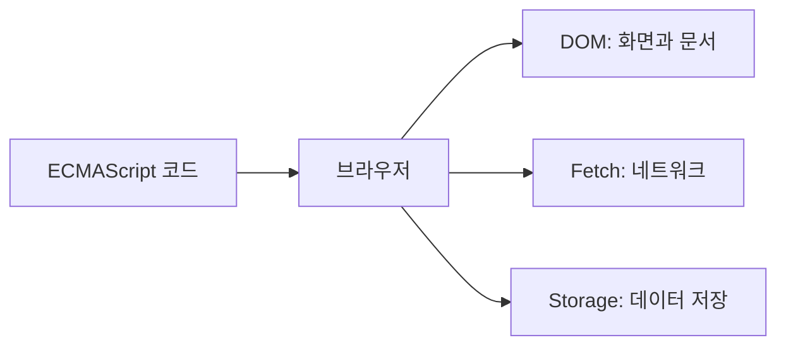

버튼을 눌렀을 때 제목을 바꾸려면 JavaScript 문법만으로는 부족합니다.

```html
<h1 id="title">학습 전</h1>
<button id="start">시작</button>
```

```js
const title = document.querySelector('#title')
const button = document.querySelector('#start')

button.addEventListener('click', () => {
  title.textContent = '학습 중'
})
```

이 코드의 변수, 함수, 문자열은 ECMAScript 규칙입니다. `document`, `querySelector`, `addEventListener`는 브라우저가 제공하는 **Web API**입니다.

## API는 기능을 사용하는 약속이다

**API(Application Programming Interface)** 는 프로그램이 다른 기능을 사용할 때 지키는 사용 방법입니다. 직접 브라우저 내부 코드를 작성하지 않아도, 정해진 이름과 인수를 사용해 기능을 요청할 수 있습니다.

예를 들어 `document.querySelector('#title')`은 다음 뜻입니다.

- `document`: 현재 웹 문서를 나타내는 객체
- `querySelector(...)`: CSS 선택자와 일치하는 첫 요소를 찾는 기능
- `'#title'`: 찾을 요소를 알려 주는 인수

**객체**는 관련된 값과 기능을 한곳에 묶은 값이고, **메서드**는 그 객체에 들어 있는 함수입니다. 따라서 `querySelector`는 `document` 객체의 메서드입니다.

## 브라우저가 언어와 웹을 연결한다



브라우저는 JavaScript 엔진으로 언어 코드를 실행하고, 동시에 웹 기능을 객체와 메서드 형태로 연결합니다.

| 하고 싶은 일 | 대표 Web API | 코드 예 |
| --- | --- | --- |
| 화면 내용 바꾸기 | DOM | `element.textContent = '완료'` |
| 클릭 감지하기 | Event | `button.addEventListener(...)` |
| 서버 데이터 받기 | Fetch | `fetch('/data.json')` |
| 브라우저에 값 저장하기 | Web Storage | `localStorage.setItem(...)` |

<Callout type="warning" emoji="🔎">
  모든 Web API를 모든 브라우저에서 똑같이 쓸 수 있는 것은 아닙니다. 위치 정보처럼 사용자 권한이나 HTTPS가 필요한 기능도 있으므로 사용 전 지원 조건을 확인해야 합니다.
</Callout>

## Web API를 사용하는 공통 모양

대부분 다음 세 단계로 읽을 수 있습니다.

1. 필요한 객체를 찾는다.
2. 메서드를 호출하거나 값을 설정한다.
3. 결과를 바로 받거나 이벤트·Promise로 기다린다.

```js
const response = await fetch('/profile.json')
const profile = await response.json()
console.log(profile.name)
```

`fetch()`는 네트워크 요청을 시작하고 **Promise**를 돌려줍니다. Promise는 지금 바로 끝나지 않은 작업의 미래 결과를 나타내는 객체입니다. `await`는 그 결과가 준비될 때까지 기다렸다가 다음 줄로 넘어가게 합니다.

여기서 `await`와 Promise의 기본 동작은 ECMAScript이고, 실제 네트워크 요청을 보내는 `fetch`는 실행 환경이 제공하는 Web API입니다. 한 코드 안에서도 두 영역은 함께 사용됩니다.

## 핵심 정리

- Web API는 브라우저가 화면, 이벤트, 네트워크, 저장소 기능을 쓰도록 제공하는 연결 창구다.
- `document`는 현재 문서를 나타내며 DOM API의 시작점이다.
- Web API는 객체, 메서드, 이벤트, Promise 같은 JavaScript 문법을 통해 사용한다.
- API마다 브라우저 지원 범위, 보안 조건, 권한 요구 사항이 다를 수 있다.

## 마무리 복습

<Quiz
  questionNumber={1}
  question="Web API를 가장 알맞게 설명한 것은?"
  options={[
    'JavaScript의 변수 이름을 짓는 규칙',
    '브라우저 기능을 정해진 방법으로 사용할 수 있게 만든 연결 창구',
    'HTML 파일을 압축하는 형식',
    'CSS 색상만 계산하는 프로그램',
  ]}
  correctAnswer={2}
  explanation="Web API는 브라우저의 문서, 네트워크, 저장소 같은 기능을 JavaScript에서 사용할 수 있게 합니다."
  optionExplanations={[
    '변수 이름 규칙은 JavaScript 언어 문법에 해당합니다.',
    '맞습니다. 개발자는 브라우저 내부 구현 대신 공개된 사용 방법을 이용합니다.',
    'Web API는 파일 압축 형식이 아닙니다.',
    '색상 계산만을 위한 기술이 아니며 다양한 웹 기능을 포함합니다.',
  ]}
/>

<Quiz
  questionNumber={2}
  question="버튼 클릭을 감지할 때 사용하는 대표적인 Web API 메서드는?"
  options={['addEventListener', 'JSON.stringify', 'Array.isArray', 'Math.round']}
  correctAnswer={1}
  explanation="addEventListener는 지정한 이벤트가 발생했을 때 실행할 함수를 등록합니다."
  optionExplanations={[
    '맞습니다. click 같은 브라우저 이벤트를 처리할 때 사용합니다.',
    'JSON.stringify는 값을 JSON 문자열로 바꾸는 ECMAScript 기능입니다.',
    'Array.isArray는 값이 배열인지 확인하는 ECMAScript 기능입니다.',
    'Math.round는 숫자를 반올림하는 ECMAScript 기능입니다.',
  ]}
/>

<Quiz
  questionNumber={3}
  question="fetch와 await가 함께 쓰인 코드에 대한 설명으로 옳은 것은?"
  options={[
    'fetch와 await 모두 HTML 태그다.',
    'fetch는 언어 문법이고 await는 브라우저 저장소다.',
    'fetch는 환경이 제공하는 API이고 await는 ECMAScript 문법이다.',
    '둘 다 CSS 기능이다.',
  ]}
  correctAnswer={3}
  explanation="fetch는 네트워크 기능을 제공하는 API이고, await는 비동기 결과를 기다리는 ECMAScript 문법입니다."
  optionExplanations={[
    '둘 다 HTML 태그가 아니라 JavaScript 코드에서 사용합니다.',
    '두 기능의 분류가 서로 바뀌었습니다.',
    '맞습니다. 한 코드 안에서 Web API와 언어 문법이 함께 동작합니다.',
    'CSS는 화면의 표현을 다루며 두 기능의 분류가 아닙니다.',
  ]}
/>

## 참고 자료

- [MDN — JavaScript 기술 개요](https://developer.mozilla.org/ko/docs/Web/JavaScript/Reference/JavaScript_technologies_overview)
- [MDN — Web API 소개](https://developer.mozilla.org/en-US/docs/Learn_web_development/Extensions/Client-side_APIs/Introduction)
- [WHATWG DOM Standard](https://dom.spec.whatwg.org/)
