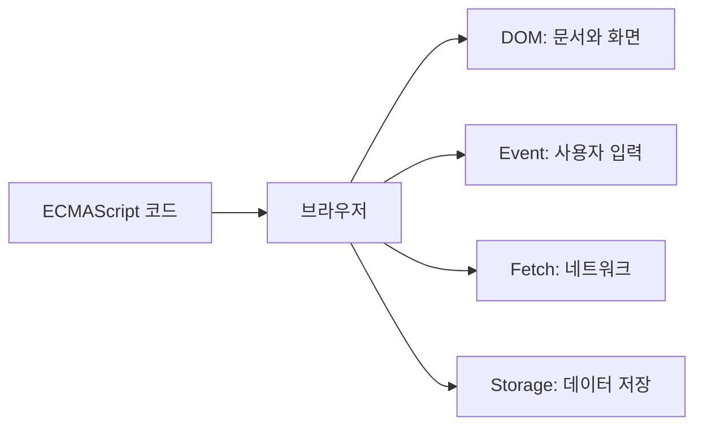

<Callout type="info">
  **이번 문서의 목표:** JavaScript 언어만으로 할 수 있는 일과 브라우저의 Web API가 필요한 일을 구분합니다.
</Callout>

## 버튼을 직접 눌러 보기

아래 미리보기에서 **시작**을 누르면 제목이 바뀝니다. 오른쪽 코드를 수정하고 다시 실행해도 됩니다.

<CodePlayground
  template="vanilla"
  activeFile="/index.js"
  label="DOM과 이벤트 실습"
  files={{
    '/index.html': `<main>
  <h1 id="title">학습 전</h1>
  <button id="start">시작</button>
</main>
<script src="/index.js"></script>`,
    '/index.js': `const title = document.querySelector('#title')
const button = document.querySelector('#start')

button.addEventListener('click', () => {
  title.textContent = '학습 중'
})`,
  }}
/>

변수와 함수, 문자열은 ECMAScript 규칙입니다. 반면 `document`, `querySelector()`, `addEventListener()`는 브라우저가 제공하는 **Web API**입니다.

## API는 기능을 사용하는 약속

**API(Application Programming Interface)** 는 다른 프로그램의 기능을 정해진 방법으로 사용하는 연결 창구입니다. 브라우저 내부를 직접 만들지 않아도 공개된 이름과 사용법을 따르면 기능을 쓸 수 있습니다.

`document.querySelector('#title')`을 나누면 다음과 같습니다.

- `document`: 현재 HTML 문서를 나타내는 객체
- `querySelector()`: CSS 선택자와 일치하는 첫 요소를 찾는 메서드
- `'#title'`: 찾을 요소를 알려 주는 인수

**객체**는 관련된 값과 기능을 묶은 대상이고, **메서드**는 그 객체에 들어 있는 함수입니다.

## 브라우저가 언어와 기능을 연결한다



브라우저는 JavaScript 엔진으로 언어 코드를 실행하면서 화면·입력·통신·저장 기능을 객체와 메서드 형태로 연결합니다.

| 하고 싶은 일 | 대표 Web API | 짧은 예 |
| --- | --- | --- |
| 화면 내용 바꾸기 | DOM | `element.textContent = '완료'` |
| 클릭 감지하기 | Event | `button.addEventListener(...)` |
| 서버 데이터 받기 | Fetch | `fetch('/data.json')` |
| 브라우저에 값 저장하기 | Web Storage | `localStorage.setItem(...)` |

## Web API 코드의 공통 흐름

1. 사용할 객체나 요소를 찾습니다.
2. 메서드를 호출하거나 값을 바꿉니다.
3. 즉시 결과를 받거나 이벤트·Promise를 기다립니다.

```js
const response = await fetch('/profile.json')
const profile = await response.json()
console.log(profile.name)
```

`fetch()`는 네트워크 요청을 시작하고 **Promise**를 반환합니다. Promise는 나중에 완료될 작업의 결과를 나타내는 객체입니다. `await`은 결과가 준비될 때까지 기다렸다가 다음 줄로 진행하게 하는 ECMAScript 문법입니다.

- `fetch`: 실행 환경이 제공하는 Web API
- `Promise`, `await`: ECMAScript가 정한 객체와 문법

<Callout type="warning">
  모든 Web API가 모든 브라우저에서 같은 조건으로 동작하지는 않습니다. 지원 범위, HTTPS 필요 여부, 사용자 권한을 함께 확인해야 합니다.
</Callout>

## 핵심 정리

- Web API는 브라우저 기능을 JavaScript에서 사용하게 해 주는 연결 창구입니다.
- DOM은 문서, Event는 사용자 입력, Fetch는 네트워크를 다룹니다.
- Web API도 JavaScript 문법으로 호출하지만 ECMAScript 자체 기능과는 구분됩니다.

## 마무리 복습

<Quiz
  questionNumber={1}
  question="Web API를 가장 알맞게 설명한 것은?"
  options={[
    'JavaScript 변수 이름을 짓는 규칙',
    '브라우저 기능을 정해진 방법으로 사용하게 해 주는 연결 창구',
    'HTML 파일을 압축하는 형식',
    'CSS 색상만 계산하는 프로그램',
  ]}
  correctAnswer={2}
  explanation="Web API는 문서, 이벤트, 네트워크 같은 브라우저 기능을 JavaScript에서 사용하도록 공개한 인터페이스입니다."
  optionExplanations={[
    '변수 이름 규칙은 JavaScript 문법에 해당합니다.',
    '맞습니다. 내부 구현을 몰라도 공개된 사용법으로 기능을 요청합니다.',
    '파일 압축 형식이 아닙니다.',
    '색상 계산에 한정된 기술이 아닙니다.',
  ]}
/>

<Quiz
  questionNumber={2}
  question="버튼 클릭을 감지할 때 주로 사용하는 메서드는?"
  options={['addEventListener', 'JSON.stringify', 'Array.isArray', 'Math.round']}
  correctAnswer={1}
  explanation="addEventListener는 지정한 이벤트가 발생했을 때 실행할 함수를 등록합니다."
  optionExplanations={[
    '맞습니다. click 같은 브라우저 이벤트를 처리합니다.',
    '값을 JSON 문자열로 바꾸는 ECMAScript 기능입니다.',
    '값이 배열인지 확인하는 ECMAScript 기능입니다.',
    '숫자를 반올림하는 ECMAScript 기능입니다.',
  ]}
/>

<Quiz
  questionNumber={3}
  question="fetch와 await의 역할을 올바르게 연결한 것은?"
  options={[
    '둘 다 HTML 태그이다.',
    'fetch는 문법이고 await은 저장소이다.',
    'fetch는 Web API이고 await은 ECMAScript 문법이다.',
    '둘 다 CSS 기능이다.',
  ]}
  correctAnswer={3}
  explanation="fetch는 네트워크 기능을 제공하는 API이고 await은 비동기 결과를 기다리는 언어 문법입니다."
  optionExplanations={[
    '둘 다 JavaScript 코드에서 사용합니다.',
    '두 기능의 분류가 서로 바뀌었습니다.',
    '맞습니다. 실행 환경 기능과 언어 문법이 함께 동작합니다.',
    'CSS 기능이 아닙니다.',
  ]}
/>

## 참고 자료

- [MDN - Web API 소개](https://developer.mozilla.org/en-US/docs/Learn_web_development/Extensions/Client-side_APIs/Introduction)
- [MDN - DOM 소개](https://developer.mozilla.org/ko/docs/Web/API/Document_Object_Model/Introduction)
- [WHATWG DOM Standard](https://dom.spec.whatwg.org/)
