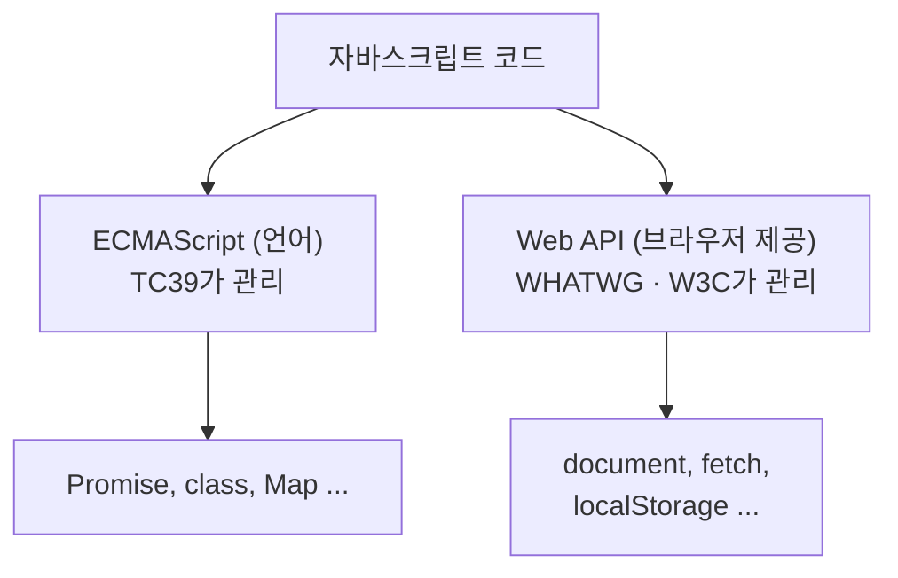

## 자바스크립트만으로는 아무것도 못 한다

`fetch()`는 자바스크립트 문법일까? 아니다. **브라우저가 제공하는 기능**이고, 언어 명세에는 없다.

자바스크립트 언어 자체(ECMAScript)에는 `if`, `function`, `Promise` 같은 문법과 계산 규칙만 있다. **화면에 뭔가 띄우기, 클릭 감지하기, 서버에 요청 보내기 — 이런 건 언어에 없다.** 언어를 실행시키는 **호스트 환경**(브라우저, Node.js 등)이 따로 얹어준다.

브라우저가 주는 이 기능 묶음을 **Web API**라 부른다. 이 시리즈의 주제다.



## 어떻게 구별하나

| 질문 | 예 → Web API | 아니오 → 언어 |
| --- | --- | --- |
| Node.js에 기본적으로 없는가? | `document`, `localStorage` | `Promise`, `class`, `Map` |
| 명세가 WHATWG/W3C에 있는가? | DOM, Fetch, HTML | ECMA-262 |

```js
console.log(document.querySelector)
// ƒ querySelector() { [native code] }
```

`[native code]`는 이 함수가 자바스크립트가 아니라 **브라우저 내부 코드(C++)** 로 짜였다는 뜻이다. Web API는 언어로 구현된 게 아니라, 브라우저가 창구만 열어준 기능이다.

<Callout type="warning">
`setTimeout`, `fetch`처럼 **Node.js에도 있는 API**가 있어 헷갈리기 쉽다. 이들은 원래 브라우저(WHATWG) 명세의 API였는데, Node.js가 나중에 가져다 구현한 것이다. "지금 어디서 쓸 수 있나"가 아니라 **"원래 어느 명세 소속인가"** 가 분류 기준이다.
</Callout>

## 마무리 복습

<Quiz
  questionNumber={1}
  question={"`fetch()`가 자바스크립트 언어 명세(ECMAScript)에 없는 이유는?"}
  options={[
    "너무 최신 기능이라서 아직 추가되지 않아서",
    "언어는 계산 규칙만 정의하고, 화면·네트워크 같은 외부 기능은 호스트 환경이 제공하기 때문에",
    "fetch는 사실 자바스크립트 문법이 맞아서 — 착각이다",
    "보안 문제로 언어에서 의도적으로 제외돼서",
  ]}
  correctAnswer={2}
  explanation={"언어(ECMAScript)는 계산 규칙만 정의하고, 화면 조작이나 네트워크 요청처럼 바깥 세상과 소통하는 기능은 브라우저 같은 호스트 환경이 추가로 제공한다."}
  optionExplanations={[
    "시간이 지나 추가될 기능이 아니라, 애초에 언어 명세가 다루는 영역 밖이다.",
    "정답이다. 언어는 계산 규칙만, 외부 소통 기능은 호스트 환경이 담당한다.",
    "fetch는 WHATWG가 관리하는 Web API이지 ECMAScript 문법이 아니다.",
    "보안과는 무관하다. 애초에 관리 주체(TC39 vs WHATWG)가 다른 별개의 것이다.",
  ]}
/>
<Quiz
  questionNumber={2}
  question={"다음 중 Web API에 속하는 것은?"}
  options={[
    "class",
    "Map",
    "addEventListener",
    "Promise",
  ]}
  correctAnswer={3}
  explanation={"addEventListener는 브라우저가 제공하는 Web API다. class, Map, Promise는 언어(ECMAScript) 자체에 내장된 기능이다."}
  optionExplanations={[
    "class는 언어 자체의 문법이다. Web API가 아니다.",
    "Map은 언어에 내장된 자료구조다. Web API가 아니다.",
    "정답이다. addEventListener는 브라우저가 제공하는 Web API다.",
    "Promise는 언어에 내장된 객체다. Web API가 아니다.",
  ]}
/>

## 참고 자료

- [MDN — Web API 목록](https://developer.mozilla.org/ko/docs/Web/API)
- [WHATWG — DOM Standard](https://dom.spec.whatwg.org/)
