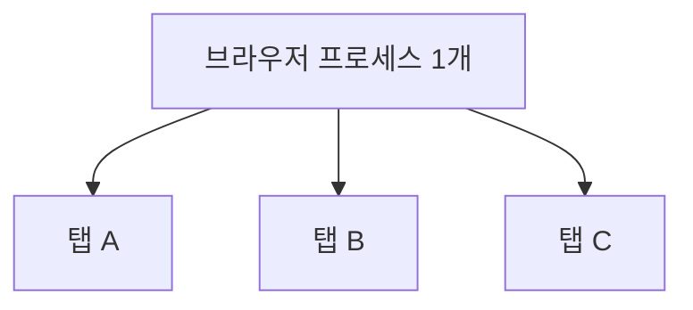
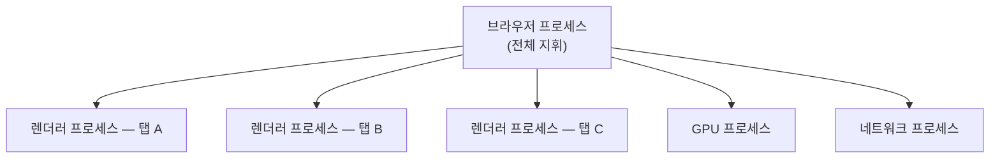

## 브라우저 구조와 프로세스 모델

탭 하나가 응답 없음에 빠졌는데 다른 탭은 멀쩡했던 경험이 있을 것이다.
우연이 아니다. 요즘 브라우저는 **탭마다 별도의 프로그램을 띄우는 구조**로 설계되어 있다.

## 프로세스란

운영체제 관점에서 **프로세스**Process는 **독립적으로 실행되는 하나의 프로그램 단위**다.
프로세스마다 자기만의 메모리 공간을 갖고, 하나가 멈추거나 죽어도 다른 프로세스에는 영향을 주지 않는다.

<Callout type="info">
메모장을 열고 크롬을 열면 운영체제 입장에서는 **별개의 프로세스 두 개**가 떠 있는 것이다.
메모장이 멈춰도 크롬은 멀쩡하다. 브라우저는 이 원리를 **탭 사이에도** 적용한다.
</Callout>

## 옛날 브라우저 — 프로세스 하나로 전부 처리

2008년 이전 브라우저는 대부분 **하나의 프로세스**가 모든 탭, 모든 확장 프로그램을 처리했다.

문제는 명확하다. **탭 A의 스크립트 하나가 무한 루프에 빠지면 탭 B, C까지 전부 멈춘다.**
탭 하나의 메모리 누수나 충돌이 브라우저 전체를 끌고 내려갔다.

## 지금의 브라우저 — 멀티 프로세스

2008년 크롬이 **멀티 프로세스 구조**를 들고 나오면서 표준이 바뀌었다.
지금은 크롬·엣지·파이어폭스 모두 이 구조를 쓴다. 크게 이렇게 나뉜다.

| 프로세스 | 역할 |
| --- | --- |
| **브라우저 프로세스**Browser Process | 주소창, 북마크, 탭 관리 등 브라우저 UI 전체를 총괄 |
| **렌더러 프로세스**Renderer Process | 실제 웹페이지(HTML·CSS·JS)를 처리 — **탭마다 따로** |
| **GPU 프로세스** | 화면을 그래픽카드로 그리는 작업 전담 |
| **네트워크 프로세스** | 요청·응답 등 네트워크 처리 |
| **플러그인/확장 프로세스** | 확장 프로그램 등을 별도로 격리 |

<Callout type="important">
**우리가 지금까지, 그리고 앞으로 배우는 자바스크립트 코드는 이 중 "렌더러 프로세스" 안에서 실행된다.**
탭마다 독립된 렌더러 프로세스를 갖기 때문에, 한 탭이 죽어도(응답 없음 뜨는 그 상황) 다른 탭은 영향을 받지 않는다.
</Callout>

## 작업 관리자로 직접 확인하기

크롬은 프로세스 목록을 직접 볼 수 있는 도구를 제공한다.

<Steps>

### 크롬 메뉴를 연다

우측 상단 점 세 개 → **도구 더보기** → **작업 관리자**를 클릭한다. (또는 <kbd>Shift</kbd>+<kbd>Esc</kbd>)

### 탭을 여러 개 열어 본다

새 탭을 두세 개 더 열고 작업 관리자를 다시 본다.

### 프로세스 개수 변화를 확인한다

탭이 늘어날 때마다 `탭: ...`으로 시작하는 항목이 함께 늘어나는 걸 볼 수 있다. 각각이 별도의 렌더러 프로세스다.

</Steps>

## 완전히 독립적이지는 않다 — Site Isolation

<Callout type="info">
같은 사이트 안에서도 iframe으로 다른 출처(도메인)의 콘텐츠를 담는 경우가 있다(예: 광고, 결제 위젯).
크롬은 **Site Isolation**이라는 정책으로, 이런 경우에도 출처가 다르면 별도 프로세스로 격리한다.
탭 하나 안에서도 상황에 따라 여러 렌더러 프로세스가 쓰일 수 있다는 뜻이다. 보안·동일 출처 정책은 Part 12에서 자세히 다룬다.
</Callout>

## 멀티 프로세스의 대가 — 메모리

탭을 많이 열면 컴퓨터가 느려지는 이유도 여기 있다. **프로세스마다 별도의 메모리를 차지**하기 때문이다.
프로세스 하나짜리 구조보다 전체 메모리 사용량은 늘어나지만, 그 대신 **안정성**(한 탭이 다른 탭을 끌고 내려가지 않음)과
**보안**(프로세스 간 메모리 격리)을 얻는다. 안정성과 메모리 사용량 사이의 트레이드오프다.

## 정리

<Callout type="default">
- 프로세스는 운영체제가 관리하는 독립적인 실행 단위다
- 옛날 브라우저는 프로세스 하나가 모든 탭을 처리해 **탭 하나의 문제가 전체를 멈췄다**
- 지금은 **탭마다 별도의 렌더러 프로세스**를 두는 멀티 프로세스 구조다
- 우리가 짜는 자바스크립트는 **렌더러 프로세스** 안에서 실행된다
- 출처가 다른 iframe은 **Site Isolation**으로 추가 격리될 수 있다
- 안정성을 얻는 대신 **메모리 사용량**이 늘어나는 트레이드오프가 있다
</Callout>

다음 편에서는 렌더러 프로세스 **안으로** 들어가, 그 안에서 렌더링 엔진과 자바스크립트 엔진이 어떻게 협업하는지 본다.

## 참고 자료

- [Chromium — Multi-process Architecture](https://www.chromium.org/developers/design-documents/multi-process-architecture/)
- [Chrome for Developers — Inside look at modern web browser](https://developer.chrome.com/blog/inside-browser-part1)
- [Chromium — Site Isolation](https://www.chromium.org/Home/chromium-security/site-isolation/)
