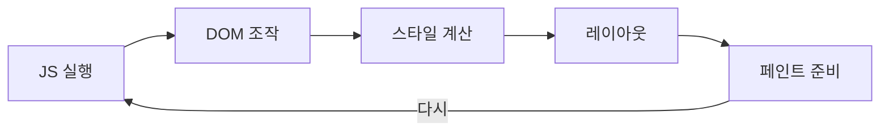

## 렌더링 엔진과 JavaScript 엔진

3편에서 자바스크립트가 **렌더러 프로세스** 안에서 실행된다고 했다.
그 렌더러 프로세스 안에는 사실 **두 개의 서로 다른 엔진**이 함께 일하고 있다. 이 편의 주제다.

## 두 엔진, 하나의 프로세스

| 엔진 | 하는 일 | 대표 구현체 |
| --- | --- | --- |
| **렌더링 엔진** | HTML·CSS를 읽어 화면에 그림 | Blink(크롬), WebKit(사파리), Gecko(파이어폭스) |
| **JavaScript 엔진** | JS 코드를 해석하고 실행함 | V8(크롬), JavaScriptCore(사파리), SpiderMonkey(파이어폭스) |

렌더링 엔진이 하는 일(DOM·CSSOM 생성, 레이아웃, 페인트)의 전체 흐름은 이미 익숙할 것이다.
자바스크립트 엔진은 우리가 짠 `.js` 코드를 실제로 실행시키는 쪽이다.

<Callout type="info">
둘 다 하나의 렌더러 프로세스 소속이지만, **완전히 다른 소프트웨어**다.
크롬이 V8을 Node.js에도 그대로 가져다 쓸 수 있는 것도 V8이 "브라우저 전용"이 아니라 **독립된 JS 엔진**이기 때문이다.
</Callout>

## 결정적인 사실 — 둘은 같은 스레드를 나눠 쓴다

여기가 이번 편의 핵심이다. 렌더링 엔진의 주요 작업(DOM 조작, 레이아웃, 스타일 계산)과
자바스크립트 실행은 기본적으로 **같은 스레드**(이를 **메인 스레드**<sup>Main Thread</sup>라 부른다)에서 이루어진다.



한 스레드는 **한 번에 한 가지 일만** 할 수 있다. 즉 **JS가 실행되는 동안은 화면을 다시 그릴 수 없고,
반대로 화면을 그리는 동안은 JS가 실행되지 않는다.**

## 눈으로 확인하기 — 무거운 계산이 화면을 멈춘다

```html
<button id="btn">클릭</button>
<div id="box" style="width:50px; height:50px; background:crimson;"></div>
```

```js
document.querySelector('#btn').addEventListener('click', () => {
  const start = Date.now()
  while (Date.now() - start < 3000) {
    // 3초 동안 아무것도 안 하며 메인 스레드를 붙잡는다
  }
  console.log('3초 지남')
})
```

이 버튼을 누르면 3초 동안 **페이지 전체가 멈춘다.** 스크롤도, 다른 버튼 클릭도, 심지어 CSS `:hover` 효과도 먹통이 된다.

<Callout type="warning">
**"멈췄다"는 게 정확히 뭘 뜻하나?**

`while` 루프가 메인 스레드를 3초간 붙잡고 있는 동안, 렌더링 엔진은 화면을 다시 그릴 기회를 얻지 못한다.
사용자 입력(클릭, 스크롤)에 반응하는 코드도 같은 스레드의 순서를 기다려야 해서 실행되지 못한다.
이 현상을 **메인 스레드 블로킹**이라 부른다.
</Callout>

## 왜 애초에 스레드를 나누지 않았나

"그럼 처음부터 JS용 스레드, 렌더링용 스레드를 나누면 되지 않나?"라는 의문이 자연스럽다.
답은 **DOM 때문**이다.

자바스크립트는 `document.querySelector(...).textContent = '...'` 처럼 DOM을 직접, 즉각적으로 읽고 쓴다.
만약 JS와 렌더링이 서로 다른 스레드에서 각자 DOM을 건드린다면, 두 스레드가 동시에 같은 데이터를 바꾸려는
**경쟁 상태**<sup>Race Condition</sup>가 끊임없이 발생한다. 이를 안전하게 조율하는 비용이
"그냥 한 스레드에서 순서대로 처리하는 것"보다 훨씬 크다는 게 지금까지의 설계 판단이다.

<Callout type="info">
완전히 예외가 없는 건 아니다. **Web Worker**는 DOM에 접근할 수 없는 대신 별도 스레드에서 무거운 계산을 돌릴 수 있게 해준다.
Part 10(Observer·Worker·PWA)에서 자세히 다룬다. 지금 기억할 점은 **"DOM을 만지는 코드는 결국 메인 스레드로 돌아온다"** 는 것이다.
</Callout>

## 컴포지터 스레드 — 예외적으로 분리된 작업

모든 게 메인 스레드에 묶여 있는 건 아니다. `transform`, `opacity` 같은 일부 CSS 속성은
**컴포지터**<sup>Compositor</sup>라는 별도 스레드가 처리할 수 있다.

<Callout type="info">
그래서 애니메이션에 `left`(레이아웃을 다시 계산해야 함) 대신 `transform: translateX()`(컴포지터가 처리 가능)를 쓰면
메인 스레드가 바쁘더라도 애니메이션이 끊기지 않을 수 있다. 이 최적화는 CSS 시리즈의 모션 파트, 그리고 Part 12(성능)에서 더 다룬다.
</Callout>

## 실무로 이어지는 감각

이 편의 내용은 이후 배울 여러 개념의 이유가 된다.

- **왜 비동기(Promise, async/await)가 필요한가** — 오래 걸리는 작업을 메인 스레드에서 기다리며 막아두지 않기 위해서다 (ECMAScript 21편, Part 7)
- **왜 무거운 반복문에서 UI가 멈추는가** — 지금 이 편에서 본 그대로다
- **왜 리스트 렌더링 성능이 중요한가** — DOM 조작이 곧 메인 스레드 작업이기 때문이다

## 정리

<Callout type="default">
- 렌더러 프로세스 안에는 **렌더링 엔진**과 **자바스크립트 엔진**이 함께 있다
- 둘은 대부분 **하나의 메인 스레드**를 공유한다
- JS 실행 중에는 화면이 멈추고, 화면을 그리는 동안은 JS가 대기한다
- DOM을 동시에 안전하게 다루기 위한 설계상의 트레이드오프다
- `transform`/`opacity` 애니메이션은 예외적으로 **컴포지터 스레드**가 처리할 수 있다
- Web Worker로 DOM과 무관한 무거운 작업을 메인 스레드 밖으로 뺄 수 있다
</Callout>

다음 편에서는 이 메인 스레드 위에서 실행되는 자바스크립트가 실제로 마주하는 첫 객체, **`window`** 를 본다.

## 참고 자료

- [Chrome for Developers — 렌더링 파이프라인 개요](https://developer.chrome.com/docs/devtools/performance)
- [web.dev — 메인 스레드 이해하기](https://web.dev/articles/optimize-long-tasks)
- [MDN — Web Workers 사용하기](https://developer.mozilla.org/ko/docs/Web/API/Web_Workers_API/Using_web_workers)
- [MDN — CSS 트리거(어떤 속성이 레이아웃/페인트/컴포지팅을 유발하는지)](https://developer.mozilla.org/en-US/docs/Web/Performance/Guides/CSS_JavaScript_animation_performance)
