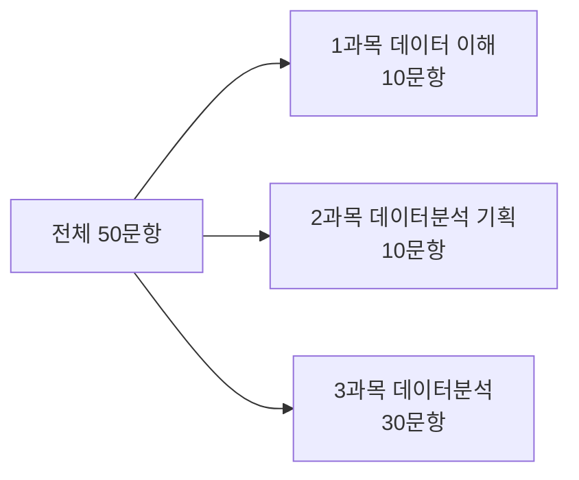

<Callout type="info">
  **이번 문서의 목표:** ADsP 시험이 어떤 과목으로, 몇 문항씩, 어떤 기준으로 채점되는지 정확히 알고, R과 RStudio를 내 컴퓨터에 설치해 콘솔·스크립트·패키지 개념을 이해한 채 실습을 시작할 수 있게 된다.
</Callout>

## 왜 시험 구조부터 알아야 하는가

**ADsP**(Advanced Data Analytics Semi-Professional, 데이터분석 준전문가)는 한국데이터산업진흥원(K-DATA)이 주관하는 국가공인 자격시험입니다. 이름이 길어 보이지만 뜯어보면 어렵지 않습니다. Advanced(고급)와 Semi-Professional(준전문가)이 붙은 이유는, 이 자격이 데이터분석 실무를 완전히 혼자 설계하는 전문가(Professional) 단계 바로 앞, 즉 데이터분석의 기본 이론과 통계·데이터마이닝 기법을 이해하고 있음을 증명하는 자격이기 때문입니다. 더 상위 자격으로 서술형 실기까지 치르는 **ADP**(데이터분석 전문가)가 있습니다.

> **쉽게 말하면:** ADsP는 "데이터분석의 이론과 R 실습 기초를 갖췄다"는 것을 객관식 시험으로 증명하는 자격증입니다.

시험 준비를 시작하기 전에 구조를 정확히 알아야 하는 이유는, 이 시험이 **과목별 과락**이 있는 구조이기 때문입니다. 전체 점수만 높이는 전략으로 공부하면 특정 과목에서 발이 걸려 떨어질 수 있습니다. 아래에서 이 구조를 자세히 뜯어봅니다.

## 1. 시험 과목과 문항 구성

ADsP는 3과목, 총 50문항의 객관식(4지선다형) 시험입니다. 아래 수치는 최근 회차 기준의 일반적인 구성이며, **정확한 문항 수·배점·시험 시간은 매 회차 공고에서 반드시 재확인해야 합니다**(공고 확인 필요). 시험 주관처가 세부 배점을 조정하는 경우가 있기 때문입니다.

| 과목 | 과목명 | 문항 수 | 다루는 내용 |
|------|--------|---------|-------------|
| 1과목 | 데이터 이해 | 10문항 | 데이터·정보·지식 위계, 데이터베이스와 DBMS, 빅데이터의 가치, 데이터 사이언스 |
| 2과목 | 데이터분석 기획 | 10문항 | 분석 기획의 방향, 분석 방법론(CRISP-DM 등), 분석 과제 발굴, 마스터플랜 |
| 3과목 | 데이터분석 | 30문항 | R 기초 문법, 기술통계, 확률분포, 가설검정, 상관·회귀분석, 데이터마이닝(분류·군집·연관규칙) |

**왜 3과목의 문항 수가 이렇게 나뉘어 있는가:** 1·2과목은 이론·개념 중심이라 각 10문항으로 비교적 가볍게 배정되고, 3과목은 통계 계산과 R 코드 해석까지 포함하는 실질적 분석 역량을 측정하므로 전체의 60퍼센트(30문항)를 차지합니다. 이 비중 때문에 **학습 시간도 3과목에 가장 많이 투자하는 것이 합리적**입니다.



## 2. 합격 기준과 과락

ADsP의 합격 기준은 두 가지 조건을 **동시에** 만족해야 합니다.

1. **전체 평균 60점 이상**: 100점 만점 기준으로 전체 문항의 정답률이 60퍼센트 이상이어야 합니다.
2. **과목별 40점 미만이면 과락**: 각 과목에서 정답률이 40퍼센트 미만이면, 전체 평균이 아무리 높아도 불합격입니다.

> **쉽게 말하면:** 전체 평균만 높이면 되는 시험이 아니라, "가장 약한 과목도 최소한은 넘겨야" 붙는 시험입니다.

**과락**(科落)은 한자로 "과목에서 떨어진다"는 뜻으로, 특정 과목 점수가 기준 미달이면 총점과 무관하게 불합격 처리되는 제도를 가리킵니다. 이 개념이 왜 중요한지 숫자로 확인해 보겠습니다.

예를 들어 1과목(10문항)에서 3문항만 맞혔다면 정답률은 30퍼센트입니다.

$$
\frac{3}{10} \times 100 = 30
$$

이 30퍼센트는 과락 기준선인 40퍼센트에 미달합니다. 이 경우 2·3과목을 만점에 가깝게 맞혀 전체 평균이 60점을 훌쩍 넘기더라도, 1과목 과락 하나 때문에 최종 결과는 **불합격**입니다.

**자주 틀리는 점:** "전체 평균만 60점 넘기면 된다"고 오해해 특정 과목(특히 1·2과목처럼 이론 위주 과목)을 소홀히 하는 경우가 많습니다. 3과목이 배점 비중이 크다고 해서 1·2과목 학습을 건너뛰면, 문항 수가 적은 만큼 몇 문제만 틀려도 과락 구간(40퍼센트 미만, 10문항 기준 3문항 이하 정답)에 쉽게 들어갈 수 있습니다. **과목당 최소 안전선을 확보하는 것이 먼저**입니다.

시험 일정, 접수 방법, 정확한 시험 시간과 배점은 회차마다 공지되므로 데이터자격검정 홈페이지의 공고를 반드시 직접 확인해야 합니다(공고 확인 필요).

## 3. R과 RStudio — 왜 이 조합을 쓰는가

ADsP 3과목(데이터분석)은 **R**이라는 프로그래밍 언어를 전제로 출제됩니다. R은 통계 계산과 데이터 분석을 위해 만들어진 프로그래밍 언어로, 1993년 뉴질랜드의 통계학자 로스 이하카(Ross Ihaka)와 로버트 젠틀맨(Robert Gentleman)이 개발했습니다. 왜 하필 R인가 하면, 통계 함수(평균·분산·회귀분석 등)가 언어 자체에 기본으로 내장되어 있어서, 다른 범용 언어로 통계 계산을 처음부터 구현하는 것보다 훨씬 적은 코드로 분석을 끝낼 수 있기 때문입니다. ADsP 시험 문제도 R 코드 조각을 보여주고 "이 코드의 실행 결과는?"을 묻는 형식이 자주 나오므로, 이 시리즈의 10~12편에서 R 문법을 처음부터 다룹니다.

**RStudio**는 R을 더 편하게 쓰도록 도와주는 통합 개발 환경(IDE, Integrated Development Environment, 통합 개발 환경)입니다. R만 설치해도 코드를 실행할 수는 있지만, RStudio를 함께 쓰면 코드 작성 창, 실행 결과 창, 변수 목록 창, 그래프 창을 한 화면에서 동시에 볼 수 있어 학습 효율이 크게 올라갑니다.

> **쉽게 말하면:** R은 엔진(계산을 실제로 수행하는 언어)이고, RStudio는 그 엔진을 편하게 다루는 계기판입니다. RStudio 혼자서는 계산할 수 없고, 반드시 R이 먼저 설치되어 있어야 합니다.

### 설치 순서

<Steps>

1. **R 설치**: CRAN(The Comprehensive R Archive Network, R 공식 배포 사이트)에 접속해 운영체제(Windows, macOS)에 맞는 설치 파일을 내려받아 설치합니다. 기본 설정 그대로 다음(Next)을 눌러 진행해도 됩니다.
2. **RStudio 설치**: R 설치가 끝난 뒤 RStudio 공식 사이트에서 무료 버전인 RStudio Desktop을 내려받아 설치합니다. 순서가 바뀌면(RStudio를 먼저 설치) RStudio가 R을 찾지 못해 오류가 납니다.
3. **실행 확인**: RStudio를 실행하면 화면이 보통 네 구획으로 나뉩니다. 왼쪽 위는 스크립트를 작성하는 **소스**(Source) 창, 왼쪽 아래는 코드를 바로 입력해 즉시 실행하는 **콘솔**(Console) 창, 오른쪽 위는 만든 변수 목록을 보는 **환경**(Environment) 창, 오른쪽 아래는 그래프·파일·패키지 목록을 보는 창입니다.

</Steps>

### 콘솔과 스크립트

R을 다루는 방법은 두 가지입니다.

- **콘솔**(console)에 코드를 한 줄 입력하고 엔터를 누르면 즉시 실행되고 결과가 바로 아래에 표시됩니다. 간단한 계산을 바로 확인할 때 씁니다.
- **스크립트**(script)는 여러 줄의 코드를 파일(`.R` 확장자)로 저장해 두고, 필요할 때 한꺼번에 또는 줄 단위로 실행하는 방식입니다. 나중에 다시 쓰거나 남에게 공유할 코드는 반드시 스크립트로 작성합니다.

콘솔에 아래처럼 입력하고 엔터를 누르면 결과가 바로 출력됩니다.

```r
1 + 1
```

```
[2] 2
```

**결과 해석:** 앞의 `[2]`처럼 보이는 부분은 실제로는 `[1]`로 출력되며, 이는 "출력된 결과 벡터의 첫 번째 값부터 시작한다"는 의미의 인덱스 표시입니다. R은 숫자 하나도 길이 1인 **벡터**(vector, 같은 자료형 값들의 순서 있는 나열)로 취급하기 때문에 이런 표시가 붙습니다. 벡터 개념은 11편에서 자세히 다룹니다.

### 패키지 — R의 기능을 확장하는 도구 상자

R을 설치하면 기본 기능(**베이스 R**, base R)만 들어 있습니다. 하지만 데이터 전처리, 시각화, 특정 통계 기법은 다른 사람들이 미리 만들어 둔 **패키지**(package)를 설치해서 써야 하는 경우가 많습니다. 패키지는 특정 목적을 위한 함수들을 모아 놓은 꾸러미라고 생각하면 됩니다.

패키지를 쓰려면 두 단계를 거칩니다.

1. **설치**(install): 컴퓨터에 패키지 파일을 내려받아 저장합니다. 한 번만 하면 됩니다.
2. **불러오기**(library, 로드): 현재 작업 세션에서 그 패키지의 함수를 쓸 수 있도록 활성화합니다. RStudio를 새로 켤 때마다 다시 해줘야 합니다.

```r
install.packages("dplyr")
library(dplyr)
```

**자주 틀리는 점:** `install.packages()`는 한 번만 실행하면 되는데, RStudio를 새로 켤 때마다 또 설치하려는 실수를 합니다. 반대로 `library()`는 설치와 무관하게 **매 세션마다** 다시 불러와야 하는데, 이를 빼먹고 "왜 함수가 없다고 나오지" 하며 당황하는 경우도 잦습니다. 설치는 한 번, 불러오기는 매번이라고 구분해 기억해 두면 됩니다.

## 4. 학습 전략

ADsP는 서술형이 없는 100퍼센트 객관식 시험이므로, 개념을 완벽하게 암기하지 않아도 **선택지 중 가장 옳은 것 또는 가장 틀린 것을 골라내는 판단력**만 있으면 통과할 수 있습니다. 다음 세 가지 원칙으로 이 시리즈를 학습하는 것을 권합니다.

- **1·2과목은 정의의 경계선을 정확히**: 이 두 과목은 새로운 개념을 만들어 내는 것이 아니라 "이 설명은 어느 용어에 해당하는가"를 정확히 구분하는 문제가 대부분입니다. 비슷해 보이는 용어(예: OLTP와 OLAP, 데이터 웨어하우스와 데이터 마트)의 차이를 표로 정리해 대조하는 습관이 중요합니다.
- **3과목은 계산 과정을 손으로 따라가며**: 통계 공식은 결과만 외우면 응용 문제에서 무너집니다. 이 시리즈는 공식이 나올 때마다 "왜 그 형태인지"부터 설명하므로, 계산 예시를 직접 손으로 짚어 보는 것이 좋습니다.
- **R 코드는 직접 실행**: 코드를 눈으로만 읽으면 실행 결과를 예측하는 문제에서 실수하기 쉽습니다. RStudio를 켜 두고 이 시리즈의 R 예제를 그대로 입력해 실행 결과를 직접 확인하며 진행하는 것을 권합니다.

## 핵심 정리

- ADsP는 3과목 50문항(데이터 이해 10, 데이터분석 기획 10, 데이터분석 30) 구조의 객관식 시험이며, 정확한 문항 수·배점·시험 시간은 회차 공고에서 반드시 재확인한다(공고 확인 필요).
- 합격 기준은 **전체 평균 60점 이상**과 **과목별 40점 미만이면 과락**이라는 두 조건을 동시에 만족해야 한다. 3과목 비중이 크다고 1·2과목을 소홀히 하면 과락 위험이 커진다.
- R은 통계 계산에 특화된 프로그래밍 언어, RStudio는 그것을 편하게 다루는 통합 개발 환경이다. R을 먼저 설치한 뒤 RStudio를 설치한다.
- 콘솔은 즉시 실행·확인용, 스크립트는 재사용·공유용 코드 저장 방식이다.
- 패키지는 `install.packages()`로 한 번만 설치하고, `library()`로 세션마다 불러온다.

## 마무리 복습

<Quiz
  questionNumber={1}
  question="ADsP 시험의 과목별 문항 수 구성으로 가장 적절한 것은? (정확한 수치는 회차 공고 확인 필요)"
  options={['데이터 이해 30, 데이터분석 기획 10, 데이터분석 10', '데이터 이해 10, 데이터분석 기획 10, 데이터분석 30', '데이터 이해 10, 데이터분석 기획 30, 데이터분석 10', '데이터 이해 20, 데이터분석 기획 20, 데이터분석 10']}
  correctAnswer={2}
  explanation="ADsP는 데이터 이해 10문항, 데이터분석 기획 10문항, 데이터분석 30문항으로 총 50문항이 일반적인 구성이다. 데이터분석 과목이 전체의 60퍼센트를 차지해 가장 비중이 크다."
  optionExplanations={['3과목(데이터분석)이 가장 문항 수가 적다고 뒤바뀐 오답이다.', '3과목 데이터분석의 비중이 가장 크다는 구성과 일치한다.', '2과목과 3과목의 문항 수가 서로 바뀐 오답이다.', '세 과목을 균등하게 나눈 것으로 실제 비중 구조와 다르다.']}
/>

<Quiz
  questionNumber={2}
  question="1과목(10문항)에서 3문항을 맞히고 2·3과목에서 만점을 받아 전체 평균이 85점이 되었다. 이 응시자의 합격 여부로 옳은 것은?"
  options={['전체 평균이 60점을 넘었으므로 합격이다', '1과목 정답률이 40퍼센트 미만인 과락에 해당해 불합격이다', '2·3과목 만점이므로 과락 규정이 면제되어 합격이다', '과락은 3과목에만 적용되므로 합격이다']}
  correctAnswer={2}
  explanation="1과목 3문항 정답은 10문항 중 30퍼센트로, 과락 기준선인 40퍼센트에 미달한다. ADsP는 전체 평균 60점 이상과 과목별 40점 미만 과락 회피를 동시에 만족해야 하므로, 전체 평균이 높아도 과락 과목이 있으면 불합격이다."
  optionExplanations={['전체 평균 조건만 확인하고 과락 조건을 놓친 판단이다.', '1과목 30퍼센트는 40퍼센트 미만이므로 과락이 맞고 불합격이다.', '다른 과목 점수가 높다고 과락이 면제되는 규정은 없다.', '과락 기준은 1·2·3과목 모두에 동일하게 적용된다.']}
/>

<Quiz
  questionNumber={3}
  question="R과 RStudio의 관계에 대한 설명으로 가장 적절한 것은?"
  options={['RStudio만 설치해도 R 없이 통계 계산이 가능하다', 'R은 계산을 수행하는 언어이고, RStudio는 이를 다루는 통합 개발 환경이므로 R을 먼저 설치해야 한다', 'R과 RStudio는 서로 대체 가능한 동일한 프로그램이다', 'RStudio를 먼저 설치하면 R이 자동으로 함께 설치된다']}
  correctAnswer={2}
  explanation="R은 통계 계산을 실제로 수행하는 프로그래밍 언어이고, RStudio는 그 R을 편하게 다루도록 도와주는 통합 개발 환경이다. RStudio는 R 없이 단독으로 계산을 수행할 수 없으므로 R을 먼저 설치해야 한다."
  optionExplanations={['RStudio는 R 없이는 계산 엔진이 없어 동작하지 않는다.', 'R을 먼저 설치해야 RStudio가 정상 동작한다는 설명과 일치한다.', '역할이 다른 별개의 소프트웨어이며 대체 관계가 아니다.', 'RStudio 설치가 R 설치를 자동으로 포함하지는 않는다.']}
/>

<Quiz
  questionNumber={4}
  question="R 콘솔과 스크립트에 대한 설명으로 옳은 것은?"
  options={['콘솔은 코드를 파일로 저장해 재사용하는 방식이다', '스크립트는 한 줄 입력 후 즉시 결과를 확인하는 방식이다', '콘솔은 즉시 실행·확인용이고, 스크립트는 파일로 저장해 재사용·공유하는 용도다', '콘솔과 스크립트는 완전히 동일한 기능이라 구분할 필요가 없다']}
  correctAnswer={3}
  explanation="콘솔은 코드를 한 줄씩 입력해 즉시 실행 결과를 확인하는 용도이고, 스크립트는 여러 줄의 코드를 .R 파일로 저장해 나중에 다시 쓰거나 공유하는 용도다. 두 방식은 목적이 다르다."
  optionExplanations={['파일로 저장해 재사용하는 것은 스크립트의 역할이다.', '즉시 입력·확인은 콘솔의 역할이다.', '즉시 실행용 콘솔과 재사용·공유용 스크립트의 역할 구분이 정확하다.', '재사용 가능 여부 등 용도가 다르므로 구분이 필요하다.']}
/>

<Quiz
  questionNumber={5}
  question="R 패키지의 설치와 불러오기에 대한 설명으로 가장 적절한 것은?"
  options={['install.packages()와 library() 모두 세션마다 실행해야 한다', 'install.packages()는 한 번만 하면 되고, library()는 세션마다 다시 불러와야 한다', 'library()는 한 번만 하면 되고, install.packages()는 세션마다 다시 설치해야 한다', '두 함수는 순서를 바꿔 실행해도 결과가 같다']}
  correctAnswer={2}
  explanation="install.packages()는 컴퓨터에 패키지 파일을 내려받는 작업으로 한 번만 하면 되고, library()는 현재 세션에서 그 패키지의 함수를 쓸 수 있도록 활성화하는 작업으로 RStudio를 새로 켤 때마다 다시 실행해야 한다."
  optionExplanations={['install.packages()까지 매번 반복할 필요는 없다.', '설치는 한 번, 불러오기는 매 세션이라는 구분과 일치한다.', '설치와 불러오기의 반복 주기가 서로 바뀐 설명이다.', '설치 전에 library()만 실행하면 패키지를 찾을 수 없어 오류가 난다.']}
/>

<Quiz
  questionNumber={6}
  question="ADsP와 ADP의 관계에 대한 설명으로 가장 적절한 것은?"
  options={['ADP가 ADsP보다 하위 단계의 자격이다', 'ADsP는 객관식 위주 자격이고, ADP는 서술형 실기까지 포함하는 상위 단계의 자격이다', '두 자격은 완전히 무관한 별개 분야의 시험이다', 'ADsP와 ADP는 시험 범위와 난이도가 완전히 동일하다']}
  correctAnswer={2}
  explanation="ADsP(데이터분석 준전문가)는 이론과 R 기초를 객관식으로 검증하는 자격이고, ADP(데이터분석 전문가)는 서술형 실기까지 포함하는 상위 단계 자격이다. Semi-Professional과 Professional이라는 이름 차이가 이를 보여준다."
  optionExplanations={['ADP가 상위 단계이므로 순서가 뒤바뀐 설명이다.', 'ADsP는 준전문가, ADP는 전문가 단계로 상하 관계가 정확하다.', '두 자격은 같은 데이터분석 분야 안에서 단계가 나뉜 관계다.', '서술형 실기 포함 여부 등 범위와 난이도에 차이가 있다.']}
/>

## 참고 자료

- [데이터자격검정 - ADsP 출제기준](https://www.dataq.or.kr/www/sub/a_06.do)
- [데이터자격검정 메인](https://www.dataq.or.kr/www/main.do)
