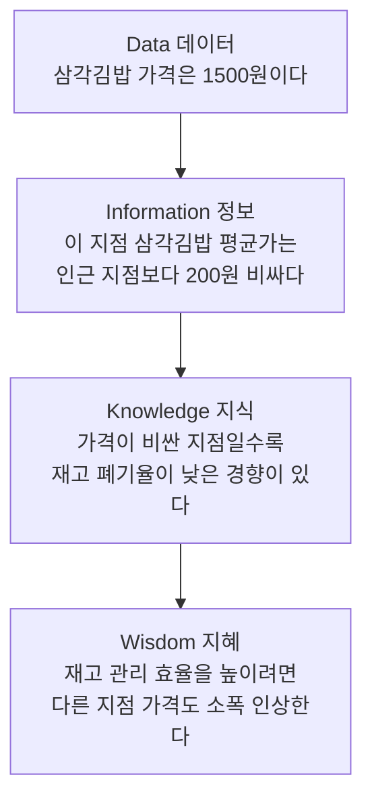

<Callout type="info">
  **이번 문서의 목표:** 데이터·정보·지식·지혜를 하나의 예시로 끝까지 구분할 수 있고, 데이터의 존재적·당위적 특성과 정성적·정량적 데이터의 차이를 헷갈리지 않게 된다.
</Callout>

## 왜 데이터와 정보를 구분해야 하는가

일상에서는 "데이터"와 "정보"를 거의 같은 말처럼 씁니다. 하지만 ADsP 1과목에서는 이 둘을 **엄격히 다른 단계**로 구분합니다. 왜 굳이 구분할까요. 회사가 매일 쌓는 숫자(데이터) 그 자체는 아무것도 결정해 주지 않습니다. 그 숫자를 정리하고, 의미를 붙이고, 경험과 결합해 이해하고, 마지막으로 판단을 내리는 과정을 거쳐야 비로소 "그래서 무엇을 할 것인가"에 도달합니다. 이 네 단계의 흐름을 하나의 체계로 정리한 것이 **DIKW 피라미드**입니다. DIKW는 Data(데이터)·Information(정보)·Knowledge(지식)·Wisdom(지혜)의 앞글자를 이어 붙인 이름입니다.

> **쉽게 말하면:** DIKW는 "숫자 하나가 어떻게 판단으로 이어지는가"를 네 계단으로 나눈 것입니다.

이 개념은 ADsP 매 회차에서 빠지지 않고 출제됩니다. 특히 "다음 설명 중 다른 단계에 속하는 것은?"처럼 보기 네 개 중 하나만 다른 단계에 속한 것을 골라내는 형식이 대표 유형입니다. 정의를 외우는 것만으로는 부족하고, **구체적인 문장을 보고 어느 단계인지 즉시 판정하는 연습**이 필요합니다.

## 1. DIKW 피라미드 — 상품 가격 하나로 네 단계 관통하기

같은 소재 하나를 끝까지 따라가며 네 단계를 구분해 보겠습니다. 소재는 **한 편의점에서 파는 삼각김밥의 가격**입니다.

| 단계 | 정의 | 삼각김밥 가격 예시 |
|------|------|---------------------|
| 데이터(Data) | 가공되기 전의 객관적 사실이나 수치 그 자체 | 이 편의점의 삼각김밥 가격은 `1,500원`이다 |
| 정보(Information) | 데이터를 정리·가공해 의미를 부여한 것 | 이 지점의 삼각김밥 평균가는 인근 지점보다 `200원` 비싸다 |
| 지식(Knowledge) | 여러 정보 사이의 관계·패턴을 경험·맥락과 결합해 이해한 것 | 가격이 비싼 지점일수록 유통기한 임박 폐기율이 낮은 경향이 있다 |
| 지혜(Wisdom) | 지식을 바탕으로 실제 행동·판단을 내리는 것 | 재고 폐기 손실을 줄이기 위해 다른 지점의 가격도 소폭 인상하기로 결정한다 |

각 단계를 하나씩 뜯어보겠습니다.

**데이터 단계**의 `1,500원`이라는 숫자는 그 자체로는 아무 의미가 없습니다. 비싼 것인지 싼 것인지, 좋은 신호인지 나쁜 신호인지 이 숫자 하나만으로는 판단할 수 없습니다. 그저 관찰되고 기록된 사실일 뿐입니다.

**정보 단계**에서는 이 숫자를 다른 숫자와 **비교·집계**합니다. "인근 지점보다 200원 비싸다"는 문장은 이 지점의 가격과 다른 지점들의 가격을 모아 평균을 내고 차이를 계산한 결과입니다. 단순 계산과 정리만으로도 정보가 만들어집니다.

**지식 단계**에서는 이 정보를 **다른 정보, 그리고 경험이나 맥락**과 엮습니다. "가격이 비싼 지점일수록 폐기율이 낮다"는 문장은 가격 정보와 폐기율 정보를 함께 놓고 그 사이의 **관계·패턴**을 읽어낸 결과입니다. 단순히 "얼마다"를 넘어 "왜 그런가, 무엇과 관련 있는가"까지 나아간 것이 지식입니다.

**지혜 단계**에서는 그 지식을 근거로 **실제 행동**을 결정합니다. "가격을 인상하기로 한다"는 문장은 앞선 지식(가격과 폐기율의 관계)을 바탕으로 미래의 행동을 선택한 것입니다. 지식만으로는 아무 일도 일어나지 않지만, 지혜는 반드시 판단이나 실행으로 이어집니다.

**자주 틀리는 점:** 정보와 지식의 경계를 묻는 문제가 가장 자주 나옵니다. 판정 기준은 **경험·맥락·관계의 결합 여부**입니다. 단순 집계·비교(평균, 순위, 증감률)까지는 정보이고, 거기에 "왜 그런가" 또는 "무엇과 관련 있는가"라는 인과·상관관계까지 붙으면 지식입니다. 그리고 그 지식을 근거로 "그래서 이렇게 하겠다"는 **의사결정 문장**이 나오면 지혜입니다. 44회 기출에서는 "아직 발생하지 않은 일을 예상하는 추론"이 담긴 보기 하나만 지혜 단계이고, 나머지 세 보기는 모두 현황을 요약·집계한 정보 단계인 문제가 출제된 바 있습니다. 이처럼 **보기 네 개 중 셋은 같은 단계, 하나만 다른 단계**인 형태로 자주 출제되므로, 각 보기를 하나씩 "이것은 단순 집계인가, 관계 해석인가, 미래 행동 결정인가"로 나눠 판정하는 습관이 필요합니다.

### 데이터가 지혜로 곧장 이어지지 않는 이유

간혹 "데이터만 있으면 바로 지혜로 갈 수 있는 것 아닌가"라는 오해가 생깁니다. 하지만 `1,500원`이라는 숫자 하나만으로는 그것이 비싼지 싼지조차 알 수 없으므로, 비교(정보)와 관계 해석(지식)이라는 중간 단계 없이는 올바른 판단(지혜)에 도달할 수 없습니다. 중간 단계를 건너뛴 판단은 근거 없는 추측에 불과합니다. 기출에서 "지혜는 데이터에서 바로 도출되는 최종 결과물이다"라는 보기가 오답으로 나오는 이유가 여기에 있습니다. 지혜는 반드시 정보와 지식을 거쳐야 도달하는 단계입니다.

## 2. 데이터의 존재적 특성과 당위적 특성

DIKW의 가장 아래 단계인 데이터 자체도 두 가지 성격을 함께 가지고 있습니다.

- **존재적 특성**: 데이터는 과거에 있었던 일이나 현재 관측된 사실을 있는 그대로 담고 있는 **객관적 존재**입니다. `1,500원`이라는 값은 누가 해석하기 전부터 이미 그 자체로 존재하는 사실입니다.
- **당위적 특성**: 동시에 데이터는 미래의 판단이나 예측의 **근거로 쓰여야 하는** 재료이기도 합니다. `1,500원`이라는 값은 나중에 가격 정책을 결정할 때 참고할 근거가 됩니다.

> **쉽게 말하면:** 데이터는 "있는 그대로의 사실"이면서 동시에 "앞으로 쓰일 재료"라는 두 얼굴을 가지고 있습니다.

**자주 틀리는 점:** 두 특성의 이름이 비슷해 보여 뒤바뀌기 쉽습니다. "존재적"은 데이터가 **이미 있는 것**(과거·현재의 사실)이라는 뜻이고, "당위적"은 데이터가 **마땅히 쓰여야 하는 것**(미래 판단의 근거)이라는 뜻입니다. "존재"는 상태를, "당위"는 마땅히 그래야 함(의무·목적)을 가리키는 한자어라는 점을 기억해 두면 헷갈리지 않습니다.

## 3. 정성적 데이터와 정량적 데이터

데이터는 표현되는 형식에 따라 정성적 데이터와 정량적 데이터로 나뉩니다.

> **쉽게 말하면:** 숫자로 딱 떨어지면 정량적, 말이나 글로 풀어야 하면 정성적입니다.

- **정량적 데이터**(quantitative data): 수치로 측정되고 표현되는 데이터입니다. 삼각김밥의 가격, 판매 개수, 온도, 매출액처럼 숫자 자체가 값입니다.
- **정성적 데이터**(qualitative data): 언어나 문자, 이미지처럼 수치로 딱 떨어지지 않는 데이터입니다. 고객이 남긴 상품평 텍스트, 상담원과의 통화 녹음, 설문의 서술형 답변이 여기 속합니다.

| 구분 | 정성적 데이터 | 정량적 데이터 |
|------|----------------|----------------|
| 표현 형식 | 언어·문자·이미지 등 | 수치 |
| 형태 | 형태와 형식이 일정하지 않은 **비정형**인 경우가 많음 | 정형화된 틀 안에 들어감 |
| 저장·분석 난이도 | 저장·분석에 더 많은 비용과 고도의 기술이 필요함 | 상대적으로 저장과 분석이 용이함 |
| 대규모 수집·일반화 | 상대적으로 어려움 | 정형화된 틀 안에서 대규모 수집과 일반화에 유리함 |
| 예시 | 상품평 텍스트, 인터뷰 녹취, 사진 | 가격, 판매량, 방문자 수 |

**왜 정량적 데이터가 저장·분석이 더 쉬운가:** 정량적 데이터는 이미 숫자라는 정해진 틀 안에 들어 있으므로, 표(관계형 데이터베이스의 열)에 그대로 넣고 평균·합계 같은 계산을 바로 적용할 수 있습니다. 반면 정성적 데이터는 "이 상품평이 긍정적인지 부정적인지"조차 사람이 읽거나, 별도의 자연어 처리 기술을 거쳐야 판단할 수 있습니다. 이 때문에 정성적 데이터는 형태가 일정하지 않은 **비정형 데이터**로 분류되는 경우가 많고, 분석에 더 많은 비용과 고도의 기술이 필요합니다.

**자주 틀리는 점:** 이 표의 대응 관계를 정반대로 뒤집는 것이 48회 기출의 대표적인 함정이었습니다. 실제 출제된 보기 중 "정량적 데이터가 정성적 데이터보다 분석에 더 많은 비용과 고도의 기술이 필요하다"와 "정성적 데이터는 수치 형태로 표현되어 저장과 분석이 용이하다"는 문장이 함께 오답으로 제시되었습니다. 두 문장 모두 정성적과 정량적의 역할을 서로 바꿔친 것입니다. 실제로는 **비용·기술이 더 드는 쪽은 비정형이 많은 정성적 데이터**이고, **저장·분석이 쉬운 쪽은 정형화된 정량적 데이터**입니다. "어느 쪽이 비정형이고 어느 쪽이 다루기 쉬운가"를 반대로 외우지 않도록, 표의 좌우 열을 통째로 짝지어 기억해야 합니다.

## 핵심 정리

- DIKW는 데이터(Data) → 정보(Information) → 지식(Knowledge) → 지혜(Wisdom) 순으로 이어지는 위계이며, 하나의 소재(가격)를 관찰(데이터) → 비교·집계(정보) → 관계·패턴 해석(지식) → 행동 결정(지혜)까지 끝까지 따라가면 구분이 명확해진다.
- 정보와 지식의 경계는 **경험·맥락·관계의 결합 여부**로 판정하고, 지식과 지혜의 경계는 **실제 행동·판단으로 이어졌는가**로 판정한다.
- 데이터는 과거·현재의 사실을 담는 **존재적 특성**과 미래 판단의 근거가 되는 **당위적 특성**을 함께 가진다.
- 정성적 데이터는 언어·문자 중심으로 비정형이 많아 저장·분석에 비용과 기술이 더 들고, 정량적 데이터는 수치로 정형화되어 저장·분석과 대규모 일반화에 유리하다. 이 대응 관계를 뒤집는 것이 기출의 대표 함정이다.

## 마무리 복습

<Quiz
  questionNumber={1}
  question="다음 중 DIKW 피라미드에서 다른 세 보기와 단계가 다른 것은?"
  options={['이번 분기 지역별 매출 합계를 정리한 표', '지난 3개월간 매출 증감률 추이 그래프', '요일별 방문자 수를 집계한 자료', '내년 여름 폭염이 예상되므로 냉방 용품 재고를 미리 확충한다']}
  correctAnswer={4}
  explanation="1~3번은 데이터를 집계·정리해 의미를 부여한 정보 단계에 해당한다. 4번은 예측(폭염 예상)이라는 지식을 근거로 재고 확충이라는 실제 행동을 결정했으므로 지혜 단계에 해당해 나머지와 다르다."
  optionExplanations={['매출 합계 정리는 데이터를 가공한 정보 단계다.', '증감률 추이 그래프도 데이터를 집계한 정보 단계다.', '요일별 집계 자료 역시 정보 단계에 해당한다.', '예측을 근거로 실제 행동을 결정했으므로 지혜 단계이며 다른 보기와 구분된다.']}
/>

<Quiz
  questionNumber={2}
  question="편의점의 삼각김밥 가격 사례에서 지식(Knowledge) 단계에 해당하는 설명으로 가장 적절한 것은?"
  options={['이 편의점의 삼각김밥 가격은 1500원이다', '이 지점의 평균가는 인근 지점보다 200원 비싸다', '가격이 비싼 지점일수록 폐기율이 낮은 경향이 있다', '재고 손실을 줄이기 위해 다른 지점 가격도 인상하기로 한다']}
  correctAnswer={3}
  explanation="가격과 폐기율이라는 두 정보 사이의 관계·패턴을 경험적으로 파악한 문장이 지식 단계에 해당한다. 단순 관측값은 데이터, 비교·집계는 정보, 실제 행동 결정은 지혜다."
  optionExplanations={['가공 전의 단순 관측값이므로 데이터 단계다.', '다른 지점과 비교·집계한 결과이므로 정보 단계다.', '가격과 폐기율의 관계를 경험적으로 파악했으므로 지식이 맞다.', '지식을 근거로 실제 행동을 결정했으므로 지혜 단계다.']}
/>

<Quiz
  questionNumber={3}
  question="데이터의 존재적 특성과 당위적 특성에 대한 설명으로 가장 적절한 것은?"
  options={['존재적 특성은 미래 판단의 근거가 되어야 함을, 당위적 특성은 과거의 객관적 사실임을 의미한다', '존재적 특성은 있는 그대로의 객관적 사실임을, 당위적 특성은 추론·예측의 근거로 쓰여야 함을 의미한다', '두 특성은 동일한 개념을 다른 이름으로 부른 것이다', '존재적 특성과 당위적 특성은 정성적 데이터에만 해당한다']}
  correctAnswer={2}
  explanation="존재적 특성은 데이터가 과거·현재의 객관적 사실을 있는 그대로 담고 있다는 성질이고, 당위적 특성은 그 데이터가 추론이나 예측, 판단의 근거로 활용되어야 한다는 성질이다."
  optionExplanations={['두 특성의 정의가 서로 뒤바뀐 설명이다.', '존재는 사실, 당위는 근거로 쓰여야 함이라는 정의와 일치한다.', '이름과 정의가 서로 다른 별개의 특성이다.', '두 특성은 데이터 전반에 적용되며 정성적 데이터에 한정되지 않는다.']}
/>

<Quiz
  questionNumber={4}
  question="정성적 데이터와 정량적 데이터에 대한 설명으로 옳은 것을 모두 고르면?  가. 정성적 데이터는 형태가 일정하지 않은 비정형인 경우가 많다  나. 정량적 데이터는 정형화된 틀 안에서 대규모 수집과 일반화에 유리하다  다. 정량적 데이터는 정성적 데이터보다 분석에 더 많은 비용과 고도의 기술이 필요하다  라. 정성적 데이터는 수치 형태로 표현되어 저장과 분석이 용이하다"
  options={['가, 나', '가, 다', '나, 라', '다, 라']}
  correctAnswer={1}
  explanation="가와 나는 옳다. 다는 정성적 데이터가 비정형이 많아 분석 비용과 기술이 더 필요하다는 사실과 반대이며, 라는 정량적 데이터의 특징을 정성적 데이터로 잘못 서술한 것이다."
  optionExplanations={['비정형 특성(가)과 대규모 수집·일반화 유리함(나)을 정확히 짝지었으므로 정답이다.', '다가 포함되어 있으나 다는 정성적과 정량적의 역할이 뒤바뀐 틀린 설명이다.', '나는 옳지만 라가 정성적과 정량적을 뒤바꾼 틀린 설명이라 오답이다.', '다와 라 모두 정성적과 정량적의 역할이 뒤바뀐 틀린 설명이다.']}
/>

<Quiz
  questionNumber={5}
  question="다음 중 정보(Information) 단계로 보기 가장 어려운 것은?"
  options={['지난달 온라인 쇼핑몰의 카테고리별 매출 합계', '연령대별 평균 구매 금액을 정리한 표', '고객 만족도 설문의 자유 서술형 답변 원문', '요일별 방문자 수의 전월 대비 증감률']}
  correctAnswer={3}
  explanation="자유 서술형 답변 원문은 아직 정리·가공되지 않은 문자 데이터 그 자체이므로 데이터 단계에 해당한다. 나머지는 합계, 평균, 증감률처럼 데이터를 집계·가공해 의미를 부여했으므로 정보 단계다."
  optionExplanations={['매출을 카테고리별로 합산한 정보 단계에 해당한다.', '평균을 계산해 정리한 정보 단계에 해당한다.', '가공되지 않은 원문 그대로이므로 데이터 단계이며 정보로 보기 어렵다.', '증감률을 계산한 정보 단계에 해당한다.']}
/>

<Quiz
  questionNumber={6}
  question="데이터에서 지혜가 중간 단계 없이 곧바로 도출된다는 주장에 대한 반박으로 가장 적절한 것은?"
  options={['데이터는 이미 그 자체로 최종 판단의 근거이므로 이 주장은 옳다', '데이터 하나만으로는 비교 대상이 없어 좋고 나쁨을 판단할 수 없으므로, 정보와 지식 단계의 해석을 거쳐야 올바른 판단에 이를 수 있다', '지혜는 정보나 지식과 무관하게 독립적으로 발생한다', '정보 단계를 거치면 지식 단계는 건너뛰어도 무방하다']}
  correctAnswer={2}
  explanation="가격 1500원 같은 단일 관측값은 비교 대상 없이는 비싼지 싼지조차 판단할 수 없다. 정보 단계의 비교·집계와 지식 단계의 관계 해석을 거쳐야 근거 있는 지혜(판단)에 도달할 수 있다."
  optionExplanations={['단일 데이터만으로는 판단 근거가 부족하므로 옳지 않은 설명이다.', '중간 단계인 정보·지식을 거쳐야 근거 있는 판단이 가능하다는 반박이 타당하다.', '지혜는 지식을 근거로 형성되므로 무관하다는 설명은 옳지 않다.', '지식 단계를 건너뛰면 관계·패턴 해석 없이 판단하게 되어 근거가 부족해진다.']}
/>

## 참고 자료

- [데이터자격검정 - ADsP 출제기준](https://www.dataq.or.kr/www/sub/a_06.do)
- [데이터자격검정 메인](https://www.dataq.or.kr/www/main.do)
