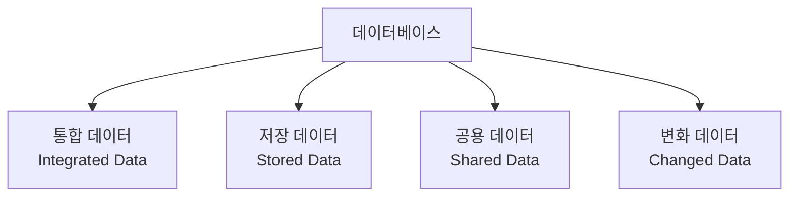

<Callout type="info">
  **이번 문서의 목표:** 데이터베이스가 갖춰야 할 4가지 특성을 근거를 들어 설명할 수 있고, DBMS가 하는 일과 OLTP·OLAP의 차이, DW·DM·CRM·SCM·ERP 같은 기업 정보 시스템의 역할을 구분할 수 있게 된다.
</Callout>

## 왜 데이터베이스를 별도로 정의하는가

02편에서 데이터가 정보·지식·지혜로 이어지려면 먼저 잘 정리되어 저장되어 있어야 한다는 것을 확인했습니다. 이 "잘 정리되어 저장하는 방식"을 체계화한 것이 데이터베이스입니다. 회사가 데이터를 아무렇게나 파일 여러 개에 흩어 저장하면, 같은 고객 정보가 여러 곳에 중복되고, 한쪽만 수정하면 나머지와 값이 어긋나며, 필요한 정보를 찾는 데도 오래 걸립니다. 데이터베이스는 이런 문제를 해결하기 위해 만들어진 **체계적인 데이터 저장·관리 방식**입니다.

## 1. 데이터베이스의 정의와 4가지 특성

**데이터베이스**(Database, DB)는 여러 사람이 공유할 목적으로 통합·관리되는, 중복을 최소화한 데이터의 집합입니다. 이 정의를 이루는 네 가지 성질을 하나씩 뜯어보면 데이터베이스가 왜 이런 구조를 갖는지 이해할 수 있습니다.

| 특성 | 원어 | 의미 |
|------|------|------|
| 통합 데이터 | Integrated Data | 동일한 내용의 데이터가 중복되어 저장되지 않는다(최소한의 중복은 허용될 수 있으나 원칙은 중복 배제) |
| 저장 데이터 | Stored Data | 컴퓨터가 접근할 수 있는 저장 매체에 저장되어 있다 |
| 공용 데이터 | Shared Data | 여러 사용자와 응용 프로그램이 서로 다른 목적으로 공동 이용한다 |
| 변화 데이터 | Changed Data | 삽입·삭제·수정을 통해 항상 최신의 정확한 상태를 유지한다 |

**통합 데이터**는 같은 고객의 이름과 주소가 회사 안 여러 시스템에 따로따로 저장되지 않는다는 뜻입니다. 예를 들어 고객 정보를 주문 시스템과 배송 시스템 각각에 따로 저장하면, 고객이 이사를 갔을 때 두 곳을 모두 고쳐야 하고 한쪽만 고치면 데이터가 서로 어긋납니다. 데이터베이스는 고객 정보를 한 곳에 모아 두고 여러 시스템이 그곳을 함께 참조하도록 설계해 이 문제를 줄입니다.

**저장 데이터**는 데이터베이스가 종이 문서나 사람의 기억이 아니라, 컴퓨터가 읽고 쓸 수 있는 하드디스크·SSD 같은 저장 매체에 담겨 있다는 뜻입니다. 이 덕분에 대량의 데이터를 빠르게 검색·처리·백업할 수 있습니다.

**공용 데이터**는 데이터베이스가 한 사람, 한 목적만을 위해 만들어지지 않는다는 뜻입니다. 같은 고객 데이터를 마케팅팀은 "이 고객에게 어떤 상품을 추천할까"라는 목적으로 쓰고, 배송팀은 "이 고객에게 물건을 어디로 보낼까"라는 다른 목적으로 씁니다. 여러 사용자가 **각자 다른 목적**으로 같은 데이터를 공동 활용할 수 있어야 공용 데이터입니다.

**변화 데이터**는 데이터베이스가 한번 저장하고 끝나는 정적인 기록물이 아니라는 뜻입니다. 고객이 주소를 바꾸면 즉시 수정되고, 새 주문이 들어오면 즉시 추가되며, 취소된 주문은 삭제됩니다. 데이터베이스는 이런 삽입·삭제·수정을 거치며 **항상 현재 시점에서 가장 정확한 상태**를 유지해야 합니다.

**자주 틀리는 점:** "데이터베이스는 사용자 모두가 반드시 동일한 목적만으로 데이터를 활용하도록 설계된다"는 문장이 오답으로 자주 나옵니다. 공용성의 핵심은 오히려 **서로 다른 목적**으로 함께 쓸 수 있다는 데 있으므로, "동일한 목적만"이라는 표현이 나오면 공용 데이터의 정의를 뒤집은 함정입니다. 또한 "데이터베이스는 데이터·정보·지식·저작물 등 인식 가능한 모든 자료를 포괄하기 때문에 그 자체로 구조적 체계를 갖지 않는다"는 문장도 함정입니다. 데이터베이스는 오히려 **정해진 규칙과 구조에 따라** 데이터를 저장·관리하는 체계이므로, "구조적 체계를 갖지 않는다"는 설명은 정반대입니다.

## 2. DBMS의 기능

**DBMS**(Database Management System, 데이터베이스 관리 시스템)는 데이터베이스를 생성하고, 데이터를 저장·검색·수정·삭제하며, 여러 사용자가 동시에 접근해도 문제가 없도록 관리하는 소프트웨어입니다. 데이터베이스가 "정리된 데이터 그 자체"라면, DBMS는 그 데이터베이스를 **다루는 프로그램**입니다.

> **쉽게 말하면:** 데이터베이스가 창고라면, DBMS는 그 창고의 입출고를 관리하는 관리 시스템입니다.

DBMS가 수행하는 핵심 기능은 다음과 같습니다.

- **데이터 정의**: 어떤 데이터를 어떤 형태(자료형, 열 이름)로 저장할지 미리 정의합니다.
- **데이터 조작**: 데이터를 삽입·검색·수정·삭제합니다.
- **데이터 제어**: 누가 어떤 데이터에 접근할 수 있는지 권한을 관리하고, 여러 사용자가 동시에 접근해도 데이터가 꼬이지 않도록 통제합니다.
- **일관성·정확성 유지**: 여러 곳에서 동시에 데이터를 바꾸더라도 데이터가 서로 어긋나지 않고 정확한 상태를 유지하도록 검증합니다.

대표적인 DBMS 제품으로는 오라클(Oracle), MySQL, MariaDB, PostgreSQL, Microsoft SQL Server 등이 있습니다.

**자주 틀리는 점:** "데이터의 일관성과 정확성을 유지하고 검증하는 DBMS의 특징은 무엇인가"를 묻는 문제에서, 통합성·공용성 같은 데이터베이스 자체의 특성과 DBMS의 기능(일관성·정확성 검증)을 혼동하지 않아야 합니다. 데이터베이스의 4가지 특성은 데이터베이스가 **가져야 할 성질**이고, DBMS의 기능은 그 성질을 **실제로 관리·유지시키는 소프트웨어의 역할**이라는 차이를 구분해서 기억해야 합니다.

## 3. 기업 내부 정보 시스템 — OLTP와 OLAP

기업은 데이터베이스를 목적에 따라 서로 다른 방식으로 운영합니다. 그 대표적인 두 축이 OLTP와 OLAP입니다.

- **OLTP**(OnLine Transaction Processing, 온라인 거래 처리): 은행 거래, 온라인 쇼핑, 예약처럼 실시간으로 발생하는 짧고 빈번한 트랜잭션(삽입·수정·삭제)을 즉시 처리하는 시스템입니다. **트랜잭션**(transaction)이란 "잔액을 차감하고 상대 계좌에 입금한다"처럼 여러 단계가 하나의 작업 단위로 묶여, 전부 성공하거나 전부 실패해야 하는 처리 단위를 말합니다.
- **OLAP**(OnLine Analytical Processing, 온라인 분석 처리): 여러 기간·지역·부서에 걸친 대량의 데이터를 모아 다차원으로 분석해 의사결정을 지원하는 시스템입니다. "지난 3년간 지역별·계절별 매출 추이"처럼 크고 복잡한 집계·조회를 다룹니다.

> **쉽게 말하면:** OLTP는 계산대에서 한 건씩 빠르게 처리하는 일이고, OLAP는 회의실에서 지난 데이터를 모아 놓고 큰 그림을 분석하는 일입니다.

| 구분 | OLTP | OLAP |
|------|------|------|
| 목적 | 실시간 거래 처리 | 의사결정 지원을 위한 분석 |
| 처리 단위 | 짧고 빈번한 단건 트랜잭션 | 대량 데이터의 다차원 집계·조회 |
| 데이터 갱신 여부 | 삽입·수정·삭제가 실시간으로 빈번하게 발생 | 갱신은 드물고 주로 읽기(조회) 위주 |
| 응답 속도 | 매우 빠른 응답이 필수(밀리초 단위) | 복잡한 집계라 상대적으로 응답 시간이 길 수 있음 |

**자주 틀리는 점:** "짧고 빈번한 트랜잭션을 실시간으로 처리하는 시스템은 무엇인가"라는 질문에 OLAP를 답으로 고르는 실수가 잦습니다. 이름이 비슷해서 헷갈리기 쉬운데, **T**ransaction이 들어간 OLTP가 거래(짧고 빈번한 삽입·갱신·삭제)를 처리하고, **A**nalytical이 들어간 OLAP가 분석(대량 집계)을 담당한다고 이름 자체에서 역할을 떠올리면 헷갈리지 않습니다. 또한 OLTP에서 쌓인 데이터가 정제·통합되어 데이터 웨어하우스를 거쳐 OLAP 분석에 활용되는 흐름, 즉 **OLTP가 원천 데이터를 만들고 OLAP가 그것을 분석**하는 순서도 함께 기억해 두어야 합니다.

## 4. DW·DM·CRM·SCM·ERP — 약어로 뒤덮인 기업 정보 시스템

기업 내부에는 각기 다른 목적을 가진 여러 정보 시스템이 함께 운영됩니다. 약어만 보면 헷갈리기 쉬우므로, 이름을 풀어 쓰고 역할을 한 줄로 정리합니다.

| 약어 | 원어 | 한 줄 역할 |
|------|------|------------|
| DW | Data Warehouse(데이터 웨어하우스) | 여러 운영 시스템의 데이터를 추출·변환·적재해 의사결정 지원을 위한 분석용으로 통합 저장하는 저장소 |
| DM | Data Mart(데이터 마트) | 데이터 웨어하우스의 부분집합으로, 특정 부서·주제에 맞춰 잘라낸 소규모 분석용 저장소 |
| CRM | Customer Relationship Management(고객관계관리) | 고객 정보와 상호작용 이력을 관리해 고객 관계를 유지·강화하는 시스템 |
| SCM | Supply Chain Management(공급망관리) | 원자재 조달부터 생산·유통·판매까지 이어지는 공급망 전체를 관리하는 시스템 |
| ERP | Enterprise Resource Planning(전사적자원관리) | 회계·인사·생산·재고 등 기업의 자원과 업무 프로세스를 하나로 통합 관리하는 시스템 |

각 시스템을 조금 더 풀어보면 이렇습니다.

**DW**는 판매 시스템, 회원 시스템, 물류 시스템처럼 서로 떨어져 있는 OLTP 원천 데이터를 한 곳에 모아 **주제 중심**(Subject-Oriented)으로 통합합니다. "이번 달 지역별 매출과 반품률의 관계"처럼 여러 시스템에 흩어진 데이터를 함께 봐야 하는 분석은, 각 시스템을 따로 조회해서는 답할 수 없기 때문에 DW가 필요합니다.

**DM**은 DW 전체를 마케팅팀이나 재무팀 같은 특정 조직이 쓰기에는 규모가 크고 불필요한 데이터까지 포함되어 있을 때, 그 부서에 필요한 부분만 잘라낸 작은 창고입니다. DW가 회사 전체의 통합 창고라면, DM은 그 창고에서 한 부서가 쓸 물건만 따로 챙긴 진열대에 가깝습니다.

**CRM**은 고객이 언제 무엇을 샀는지, 어떤 문의를 남겼는지, 어떤 상품에 관심을 보였는지를 관리해 고객별 맞춤 마케팅이나 이탈 방지 전략에 활용합니다.

**SCM**은 원재료를 사 오는 단계부터 공장에서 만들고, 창고에 쌓아 두고, 매장까지 옮기고, 소비자에게 팔리는 전체 흐름을 관리합니다. 한 단계에서 지연이 생기면 전체 흐름에 영향을 주므로, 이 흐름 전체를 한눈에 보고 조율하는 것이 SCM의 목적입니다.

**ERP**는 앞서 나온 여러 업무(회계, 인사, 생산, 재고 등)를 부서마다 따로 관리하면 정보가 서로 어긋나기 쉬우므로, 이를 하나의 시스템으로 통합해 회사 전체의 자원 흐름을 일관되게 관리합니다. CRM과 SCM이 특정 영역(고객, 공급망)에 집중한 시스템이라면, ERP는 회사 전체 업무를 아우르는 더 포괄적인 시스템입니다.

**자주 틀리는 점:** DW를 설명하는 지문에 "OLTP 시스템과 동일한 스키마 구조를 사용한다"는 보기가 함정으로 나옵니다. DW는 여러 OLTP 원천의 데이터를 **분석 목적에 맞게 변환·재구성**해 저장하므로, OLTP와 스키마 구조가 동일하지 않습니다. 또한 "다양한 소스의 데이터를 통합해 의사결정 지원을 위한 분석용 저장소이다"라는 설명은 DW를 가리키는데, 이를 OLTP·CRM·SCM으로 잘못 짝짓는 문제도 자주 나오므로, 각 시스템의 핵심 목적어(거래 처리·통합 분석·고객 관계·공급망)를 정확히 짝지어 기억해야 합니다.

## 핵심 정리

- 데이터베이스는 **통합 데이터**(중복 최소화), **저장 데이터**(저장 매체에 보관), **공용 데이터**(여러 사용자가 다른 목적으로 공동 활용), **변화 데이터**(삽입·삭제·수정으로 최신 상태 유지)라는 4가지 특성을 가진다.
- DBMS는 데이터베이스를 정의·조작·제어하고 일관성과 정확성을 유지·검증하는 소프트웨어이며, 데이터베이스 자체의 특성과 DBMS의 관리 기능은 구분해서 기억해야 한다.
- OLTP는 실시간 거래 처리(짧고 빈번한 트랜잭션), OLAP는 대량 데이터의 다차원 분석(의사결정 지원)을 담당하며, 이름의 T(Transaction)와 A(Analytical)로 역할을 구분하면 헷갈리지 않는다.
- DW(통합 분석 저장소), DM(부서별 부분집합), CRM(고객관계관리), SCM(공급망관리), ERP(전사적자원관리)는 각기 다른 목적을 가진 기업 정보 시스템으로, 핵심 목적어로 구분해 기억한다.

## 마무리 복습

<Quiz
  questionNumber={1}
  question="다음 중 데이터베이스의 특성으로 적절하지 않은 것은?"
  options={['데이터베이스는 사용자 모두가 반드시 동일한 목적만으로 데이터를 활용하도록 설계된다', '데이터베이스는 여러 사용자가 원격으로 접속해 사용할 수 있다', '데이터베이스의 데이터는 일관성과 지속성을 유지하도록 관리된다', '데이터베이스의 데이터는 권한이 있는 사용자가 접근하고 변경할 수 있어야 한다']}
  correctAnswer={1}
  explanation="공용 데이터의 핵심은 여러 사용자가 서로 다른 목적으로 데이터를 공동 활용한다는 데 있다. 동일한 목적만으로 활용하도록 설계된다는 설명은 공용성의 정의를 뒤집은 것이므로 적절하지 않다."
  optionExplanations={['공용성은 서로 다른 목적의 공동 활용을 의미하므로 이 설명은 틀렸다.', '데이터베이스는 원격 접속과 다중 사용자 환경을 지원하는 저장 데이터의 특성과 일치한다.', '변화 데이터로서 일관성과 지속성을 유지한다는 설명과 일치한다.', '권한 있는 사용자의 접근·변경이 가능해야 한다는 설명과 일치한다.']}
/>

<Quiz
  questionNumber={2}
  question="데이터베이스의 4가지 특성 중 삽입, 갱신, 삭제를 통해 항상 최신 상태를 유지한다는 설명에 해당하는 것은?"
  options={['통합 데이터', '저장 데이터', '공용 데이터', '변화 데이터']}
  correctAnswer={4}
  explanation="변화 데이터(Changed Data)는 데이터베이스가 삽입·삭제·수정을 거치며 항상 현재 시점의 정확한 상태를 유지해야 한다는 특성이다."
  optionExplanations={['통합 데이터는 중복을 최소화해 하나로 모아 저장한다는 특성이다.', '저장 데이터는 컴퓨터가 접근 가능한 매체에 저장되어 있다는 특성이다.', '공용 데이터는 여러 사용자가 다른 목적으로 공동 이용한다는 특성이다.', '삽입·갱신·삭제로 최신 상태를 유지하는 것은 변화 데이터의 정의와 일치한다.']}
/>

<Quiz
  questionNumber={3}
  question="아래에서 설명하는 데이터베이스 시스템은 무엇인가? 은행 거래, 온라인 쇼핑, 예약 등 실시간으로 발생하는 대규모 데이터 삽입, 업데이트, 삭제와 같은 짧고 빈번한 트랜잭션을 수시로 처리하는 정보 시스템"
  options={['OLAP', 'OLTP', 'CRM', 'SCM']}
  correctAnswer={2}
  explanation="짧고 빈번한 트랜잭션(삽입·갱신·삭제)을 실시간으로 처리하는 시스템은 OLTP(OnLine Transaction Processing)다. OLAP는 대량 데이터의 분석, CRM은 고객관계관리, SCM은 공급망관리를 담당한다."
  optionExplanations={['OLAP는 다차원 데이터의 분석을 담당하며 실시간 거래 처리가 목적이 아니다.', '은행 거래, 예약 등 짧고 빈번한 실시간 트랜잭션 처리는 OLTP의 정의와 일치한다.', 'CRM은 고객 관계를 관리하는 시스템으로 거래 처리 시스템이 아니다.', 'SCM은 공급망을 관리하는 시스템으로 거래 처리 시스템이 아니다.']}
/>

<Quiz
  questionNumber={4}
  question="OLTP와 OLAP의 차이에 대한 설명으로 가장 적절한 것은?"
  options={['OLTP는 대량 데이터의 다차원 분석을, OLAP는 실시간 거래 처리를 담당한다', 'OLTP는 짧고 빈번한 트랜잭션을 실시간 처리하고, OLAP는 대량 데이터를 다차원으로 분석해 의사결정을 지원한다', '두 시스템 모두 갱신 없이 조회만 수행한다', 'OLTP와 OLAP는 응답 속도 요구사항이 동일하다']}
  correctAnswer={2}
  explanation="OLTP는 삽입·수정·삭제가 빈번한 실시간 거래 처리 시스템으로 매우 빠른 응답이 필요하고, OLAP는 대량 데이터의 다차원 집계·분석으로 의사결정을 지원하는 시스템으로 상대적으로 복잡한 조회를 다룬다."
  optionExplanations={['OLTP와 OLAP의 역할이 서로 뒤바뀐 설명이다.', 'OLTP는 실시간 거래 처리, OLAP는 다차원 분석이라는 역할 구분이 정확하다.', 'OLTP는 삽입·수정·삭제가 빈번하게 발생하므로 조회만 수행한다는 설명은 틀렸다.', 'OLTP는 밀리초 단위의 빠른 응답이 필수이지만 OLAP는 복잡한 집계로 응답 시간이 더 길 수 있어 요구사항이 다르다.']}
/>

<Quiz
  questionNumber={5}
  question="다음 중 DW(Data Warehouse)에 대한 설명으로 가장 적절한 것은?"
  options={['실시간 거래를 빠르게 처리하기 위한 운영 시스템이다', '다양한 소스의 데이터를 통합하여 의사결정 지원을 위한 분석용 저장소이다', '고객 관계 관리를 위한 전문 시스템이다', '공급망 관리에 특화된 데이터베이스 시스템이다']}
  correctAnswer={2}
  explanation="DW는 여러 운영 시스템으로부터 데이터를 추출·변환·적재하여 의사결정 지원을 위한 분석 목적으로 활용하는 통합 데이터 저장소다. 1번은 OLTP, 3번은 CRM, 4번은 SCM에 대한 설명이다."
  optionExplanations={['실시간 거래 처리는 OLTP 시스템에 대한 설명이다.', '여러 소스를 통합해 분석용으로 저장한다는 설명이 DW의 정의와 일치한다.', '고객 관계 관리는 CRM에 대한 설명이다.', '공급망 관리는 SCM에 대한 설명이다.']}
/>

<Quiz
  questionNumber={6}
  question="ERP(전사적자원관리)에 대한 설명으로 가장 적절한 것은?"
  options={['특정 부서만을 위해 잘라낸 데이터 웨어하우스의 부분집합이다', '고객과의 상호작용 이력만을 전문적으로 관리하는 시스템이다', '회계·인사·생산·재고 등 기업의 자원과 업무 프로세스를 하나로 통합 관리하는 시스템이다', '원자재 조달부터 유통까지의 흐름만을 관리하는 시스템이다']}
  correctAnswer={3}
  explanation="ERP(Enterprise Resource Planning)는 회계·인사·생산·재고 등 여러 부서의 업무를 하나의 시스템으로 통합해 회사 전체의 자원 흐름을 일관되게 관리하는 시스템이다."
  optionExplanations={['부서별 부분집합은 데이터 마트(DM)에 대한 설명이다.', '고객과의 상호작용 관리는 CRM에 대한 설명이다.', '여러 업무 영역을 하나로 통합 관리한다는 설명이 ERP의 정의와 일치한다.', '공급망 흐름 관리는 SCM에 대한 설명이며 ERP는 이보다 더 포괄적이다.']}
/>

<Quiz
  questionNumber={7}
  question="DBMS의 기능에 대한 설명으로 가장 적절한 것은?"
  options={['DBMS는 데이터의 정의·조작·제어를 담당하며 여러 사용자의 동시 접근에서도 일관성과 정확성을 유지·검증한다', 'DBMS는 데이터베이스 특성 중 공용성만을 담당하는 도구다', 'DBMS는 데이터를 저장 매체가 아닌 메모리에만 임시로 보관한다', 'DBMS는 단일 사용자 환경에서만 동작하도록 설계된다']}
  correctAnswer={1}
  explanation="DBMS는 데이터 정의, 조작(삽입·검색·수정·삭제), 접근 권한 제어를 수행하며, 여러 사용자가 동시에 접근해도 데이터의 일관성과 정확성이 유지되도록 관리·검증하는 소프트웨어다."
  optionExplanations={['정의·조작·제어와 일관성·정확성 검증까지 포괄한 설명이 DBMS의 역할과 일치한다.', 'DBMS는 공용성뿐 아니라 통합·저장·변화 등 여러 특성의 유지를 함께 지원한다.', 'DBMS는 저장 매체에 영구 저장된 데이터베이스를 관리하는 소프트웨어다.', 'DBMS는 다중 사용자의 동시 접근을 전제로 동시성을 제어하도록 설계된다.']}
/>

<Quiz
  questionNumber={8}
  question="다음 중 데이터베이스에 대한 설명으로 적절하지 않은 것은?"
  options={['다수의 사용자가 동시에 공유하고 활용할 수 있도록 구조화하여 통합 저장한 데이터의 집합이다', '데이터의 중복을 최소화하고 일관성을 유지함으로써 데이터의 신뢰도를 높이는 시스템이다', '응용 프로그램과 데이터가 서로 독립적으로 존재하여, 데이터 구조가 바뀌어도 응용 프로그램에는 영향을 주지 않는 독립성을 가진다', '데이터베이스는 데이터, 정보, 지식, 저작물 등 인식 가능한 모든 자료를 포괄하기 때문에 그 자체로 구조적 체계를 갖지 않는다']}
  correctAnswer={4}
  explanation="데이터베이스는 정해진 규칙과 체계적인 구조에 따라 데이터를 저장·관리하는 집합이므로, 구조적 체계를 갖지 않는다는 설명은 정의와 정반대다."
  optionExplanations={['다수 사용자의 공동 활용을 위한 통합 저장이라는 정의와 일치한다.', '중복 최소화와 일관성 유지를 통한 신뢰도 확보라는 설명과 일치한다.', '데이터와 응용 프로그램 간 독립성을 가진다는 설명과 일치한다.', '데이터베이스는 오히려 정해진 구조적 체계를 갖추고 있으므로 이 설명은 틀렸다.']}
/>

## 참고 자료

- [데이터자격검정 - ADsP 출제기준](https://www.dataq.or.kr/www/sub/a_06.do)
