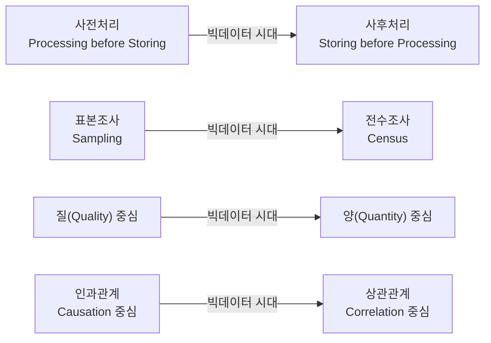

<Callout type="info">
  **이번 문서의 목표:** 빅데이터의 3V(그리고 확장된 4V·5V)를 설명하고, 빅데이터가 데이터 처리·분석의 방식을 어떻게 근본적으로 바꿨는지 4가지 변화로 정리하며, 빅데이터의 가치가 왜 측정하기 어려운지와 그로 인해 생기는 위기 요인 3가지 및 통제 방안을 짝지어 말할 수 있게 된다.
</Callout>

## 왜 "빅"데이터인가 — 그냥 데이터가 많은 게 아니다

02편(데이터·정보·지식·지혜 위계)에서 데이터가 정보와 지식의 재료라는 것을 봤습니다. 03편(데이터베이스와 DBMS)에서는 그 데이터를 저장·관리하는 그릇을 다뤘습니다. 이번 편은 그 데이터의 양과 성질이 어느 순간 임계점을 넘으면서, 데이터를 다루는 방식 자체가 통째로 바뀌었다는 이야기입니다.

옛날에도 데이터는 있었습니다. 회사 매출 장부, 인구 조사 통계, 도서관 목록 모두 데이터입니다. 그런데 우리가 지금 "빅데이터"라고 부르는 것은 단순히 "예전보다 데이터가 많다"는 뜻이 아닙니다. 데이터의 양(volume)뿐 아니라 생성 속도(velocity)와 형태의 다양함(variety)이 동시에 폭증하면서, **기존의 데이터베이스·통계 기법으로는 감당할 수 없는 새로운 종류의 데이터 환경**이 만들어졌다는 뜻입니다. 스마트폰의 위치 로그, 소셜미디어의 텍스트·이미지, 공장 센서의 초 단위 신호가 그 예입니다. 이 편에서는 이 새로운 환경이 정확히 어떤 특징(3V)을 가지는지, 그 특징 때문에 데이터를 다루는 철학이 어떻게 바뀌었는지, 그리고 그만큼 커진 위험을 어떻게 통제하는지를 봅니다.

## 1. 빅데이터의 3V — 그리고 확장된 4V·5V

> **쉽게 말하면:** 빅데이터는 양이 많고(Volume), 종류가 다양하고(Variety), 빠르게 쏟아지는(Velocity) 데이터입니다.

**3V**는 빅데이터를 처음 정의할 때 가장 널리 쓰인 3가지 특징입니다. 시험에서는 한국어 이름과 영단어를 서로 바꿔 묻는 문제가 자주 나오므로, 이름과 영단어를 항상 짝으로 기억해야 합니다.

| 특징(영단어) | 의미 | 예시 |
|---|---|---|
| 규모(Volume) | 데이터의 물리적 양이 기존 시스템으로 감당하기 어려울 만큼 크다 | 한 이커머스 기업이 하루에 쌓는 로그가 수십 테라바이트에 이른다 |
| 다양성(Variety) | 정형·반정형·비정형 데이터가 뒤섞여 있다 | 매출표(정형), 로그 파일(반정형), 고객 리뷰 텍스트·사진(비정형)이 동시에 쌓인다 |
| 속도(Velocity) | 데이터가 생성·수집·처리되는 속도가 실시간에 가깝다 | 카드 결제 시스템이 초 단위로 이상 거래를 탐지해야 한다 |

여기서 **정형(structured) 데이터**는 표처럼 행과 열이 고정된 데이터(엑셀 표, 관계형 DB의 테이블), **반정형(semi-structured) 데이터**는 형식은 있지만 행·열처럼 고정되지 않은 데이터(JSON, XML, 로그 파일), **비정형(unstructured) 데이터**는 정해진 구조가 아예 없는 데이터(자유 텍스트, 이미지, 음성, 동영상)입니다. 이 구분은 03편에서 DBMS가 다루기 쉬운 데이터와 어려운 데이터를 가를 때도 이미 등장했습니다. 빅데이터의 Variety는 바로 이 세 종류가 한 조직 안에 동시에, 그것도 비정형 데이터의 비중이 압도적으로 커지면서 섞여 있다는 뜻입니다.

> **자주 틀리는 점:** 3V 각각의 영단어와 한국어 뜻을 뒤바꿔 놓은 보기가 자주 나옵니다. 예를 들어 "Variety는 데이터가 실시간으로 생성되는 속도를 의미한다"처럼 Variety와 Velocity의 정의를 바꿔치기하는 함정이 반복 출제됩니다. 세 단어 모두 앞글자가 V로 같아서 혼동하기 쉬우니, 뜻으로 먼저 이해한 뒤 영단어를 붙이는 순서로 외우는 것이 안전합니다.

### 확장된 4V·5V — Value와 Veracity

3V만으로는 "그래서 이 데이터가 쓸모 있는가"라는 질문에 답하지 못한다는 지적이 이어지면서, 두 가지 특징이 추가로 논의됩니다.

- **가치(Value):** 데이터 자체가 아무리 많아도, 거기서 의미 있는 통찰을 뽑아내지 못하면 소용이 없습니다. 3V에 Value를 더한 것을 **4V**라고 부릅니다.
- **정확성(Veracity):** 빅데이터는 다양한 출처에서 정제되지 않은 채로 모이기 때문에, 데이터 자체의 신뢰도(오류·중복·편향 여부)가 기존 정형 데이터보다 낮을 위험이 있습니다. Veracity는 이 데이터 품질과 신뢰성을 가리키며, 여기까지 더한 것을 **5V**라고 부릅니다.

> **쉽게 말하면:** 3V가 "빅데이터는 이런 모양이다"라면, Value는 "그래서 쓸모가 있는가", Veracity는 "그래서 믿을 수 있는가"를 묻는 확장입니다.

**자주 틀리는 점:** 4V·5V에 어떤 V가 추가되는지 정확한 조합을 묻는 문제가 나옵니다. 3V(Volume·Variety·Velocity)에 Value가 더해지면 4V, 여기에 Veracity까지 더해지면 5V입니다. 간혹 Visualization(시각화)이나 Variability(가변성)를 5번째 V로 제시하는 오답 보기가 나오는데, ADsP 공식 출제 범위에서 표준으로 다루는 확장은 **Value와 Veracity**입니다.

## 2. 빅데이터가 만든 4가지 변화

빅데이터 시대는 단순히 데이터가 많아진 시대가 아니라, **데이터를 다루는 방법론 자체가 뒤집힌 시대**입니다. 이 변화는 정확히 4가지 축으로 정리되며, 매 회차 시험에 거의 빠짐없이 등장하는 최빈출 개념입니다. 아래 표와 그림으로 정리하되, 각 항목이 "왜 예전에는 그랬고, 왜 지금은 바뀌었는가"를 반드시 함께 이해해야 합니다.

| 변화 | 이전(전통적 데이터 처리) | 이후(빅데이터 시대) | 바뀐 이유 |
|---|---|---|---|
| 처리 시점 | 사전처리(데이터를 저장하기 전에 필요한 형태로 미리 가공) | 사후처리(일단 있는 그대로 모두 저장한 뒤 필요할 때 가공) | 저장·처리 비용이 급격히 낮아져 "쓸모없어 보이는 데이터"도 버리지 않고 모아 둘 수 있게 됐다 |
| 조사 범위 | 표본조사(전체 중 일부만 뽑아 추정) | 전수조사(모집단 전체를 그대로 분석) | 대용량 데이터를 병렬로 처리하는 기술(분산 처리)이 발전해 표본을 뽑는 수고 없이 전체를 다룰 수 있게 됐다 |
| 추구하는 것 | 질(정확하고 오류 없는 소량의 데이터) | 양(다소 부정확해도 압도적으로 많은 데이터) | 데이터 양이 충분히 크면 개별 오류가 전체 결과에 미치는 영향이 희석되어, 정확성보다 규모의 이점이 커진다 |
| 분석의 초점 | 인과관계(왜 그런 일이 일어났는가, 원인 규명) | 상관관계(무엇과 무엇이 함께 움직이는가, 관계 포착) | 원인을 하나하나 검증하는 데는 시간과 비용이 크지만, 대량의 데이터에서 통계적으로 유의미한 관계를 찾는 것은 상대적으로 빠르고 실용적이다 |

각 항목을 좀 더 풀어보겠습니다.

**사전처리에서 사후처리로:** 전통적인 데이터베이스 설계는 저장 공간이 비쌌기 때문에, 저장하기 전에 "정말 필요한 데이터인지, 어떤 형태로 저장할지"를 미리 정리했습니다(이것이 사전처리입니다). 빅데이터 시대에는 저장 장치와 분산 처리 기술의 가격이 크게 떨어지면서, 일단 원본 그대로 모두 저장해 두고(사후처리) 나중에 필요한 목적이 생기면 그때 가공하는 방식이 자리 잡았습니다.

**표본조사에서 전수조사로:** 통계학의 기본 전제 중 하나는 "모집단 전체를 조사하기엔 시간과 비용이 너무 크므로, 대표성 있는 표본을 뽑아 전체를 추정한다"는 것이었습니다(15편 표본추출에서 자세히 다룹니다). 빅데이터 환경에서는 분산 처리 기술 덕분에 수십억 건의 데이터도 병렬로 한 번에 처리할 수 있게 되면서, 표본을 뽑아 추정하는 대신 **모집단 전체(전수)를 그대로 분석**하는 것이 가능해졌습니다. 표본조사에서 필연적으로 생기는 표본 오차(sampling error) 자체를 없앨 수 있다는 것이 전수조사의 강점입니다.

**질에서 양으로:** 전통 통계학은 데이터 하나하나의 정확성을 중시했습니다. 값 하나가 잘못 측정되면 전체 분석이 왜곡될 수 있었기 때문입니다. 그러나 데이터의 양이 충분히 크면, 일부의 노이즈(오류·결측·잡음)가 섞여 있어도 전체 경향을 읽는 데는 문제가 없다는 인식이 자리 잡았습니다. 즉 "적더라도 완벽한 데이터"보다 "다소 지저분해도 압도적으로 많은 데이터"가 더 실용적인 가치를 준다는 방향으로 무게중심이 옮겨간 것입니다.

**인과관계에서 상관관계로:** 전통적인 과학적 분석은 "왜 이런 결과가 나왔는가"라는 인과관계(causation)를 규명하는 데 집중했습니다. 인과관계를 증명하려면 다른 변수를 통제한 실험이나 정밀한 논리적 설계가 필요해 시간과 비용이 많이 듭니다. 빅데이터 시대에는 방대한 데이터에서 "A가 늘어날 때 B도 함께 늘어난다"는 상관관계(correlation)만 통계적으로 포착해도, 원인을 몰라도 실용적인 예측과 의사결정에 활용할 수 있다는 실용주의가 힘을 얻었습니다. 예를 들어 어떤 온라인 쇼핑몰이 "기저귀를 산 고객이 맥주도 함께 사는 경향이 있다"는 상관관계를 발견했다면, 왜 그런지 완벽히 설명하지 못해도 두 상품을 함께 진열해 매출을 올릴 수 있습니다.

> **자주 틀리는 점 — 반드시 구분할 것:** 이 문서에서 말하는 "인과관계에서 상관관계로의 변화"는 **빅데이터 시대에 분석가들이 어디에 무게를 두는지가 바뀌었다는 시대적·방법론적 변화**를 뜻합니다. 이것은 통계학의 기본 원칙인 "**상관관계는 인과관계를 의미하지 않는다**(correlation does not imply causation)"는 말과는 다른 층위의 이야기입니다. 후자는 두 변수가 함께 움직인다고 해서 한쪽이 다른 쪽의 원인이라고 함부로 단정하면 안 된다는, 언제나 참인 통계적 경계 원칙입니다(17편 상관분석에서 자세히 다룹니다). 빅데이터 시대에 상관관계 분석의 비중이 커졌다고 해서, 상관관계가 곧 인과관계를 증명한다는 뜻은 절대 아닙니다. 시험에서는 이 두 문장을 뒤섞어 "빅데이터 시대에는 상관관계가 곧 인과관계로 인정된다"처럼 틀린 진술을 만드는 함정이 나올 수 있습니다.

## 3. 빅데이터의 가치 산정이 왜 어려운가

02편에서 데이터가 정보·지식으로 가공되며 가치를 갖는다는 것을 봤습니다. 그런데 빅데이터는 전통적인 자산(공장 설비, 재고 상품)과 달리 그 가치를 미리 값으로 매기기가 유독 어렵습니다. 이유는 크게 세 가지입니다.

1. **데이터 재사용·재조합·다목적 활용이 일반화됐다:** 같은 데이터라도 어떤 다른 데이터와 결합하는지, 누가 어떤 목적으로 쓰는지에 따라 전혀 다른 가치를 만들어냅니다. 위치 데이터 하나가 배달 경로 최적화에도, 상권 분석에도, 감염병 확산 예측에도 쓰일 수 있는데, 이 모든 활용 가능성을 미리 예측해 가치를 매기는 것은 사실상 불가능합니다.
2. **분석 기술의 발전에 따라 가치가 계속 달라진다:** 오늘은 활용법을 몰라 방치된 데이터가, 새로운 분석 기법이나 인공지능 모델이 등장하면 갑자기 핵심 자산이 되기도 합니다. 즉 데이터의 가치는 데이터 자체의 성질이 아니라 **그 시점의 분석 기술 수준에 의해 결정**되므로, 고정된 가격표를 매길 수 없습니다.
3. **새로운 가치 창출 방식 자체가 계속 생겨난다:** 기존에 존재하지 않던 방식으로 데이터를 조합해 완전히 새로운 서비스나 통찰을 만들어내는 경우가 많아, 사전에 정해진 회계적 가치 평가 기준으로는 담아낼 수 없는 가치가 계속 등장합니다.

> **쉽게 말하면:** 빅데이터의 가치는 "얼마나 많이 있는가"가 아니라 "누가, 무엇과 결합해서, 어떤 새로운 방식으로 쓰는가"에 달려 있어서, 데이터가 만들어지는 순간에는 그 최종 가치를 알 수 없습니다.

## 4. 빅데이터의 위기 요인 3가지와 통제 방안

빅데이터의 가치가 커진 만큼, 그 데이터를 잘못 다뤘을 때의 위험도 커졌습니다. ADsP는 이 위기 요인을 정확히 3가지로 정리하고, 각각에 대한 통제 방안을 짝지어 묻습니다. 이름이 비슷한 오답(예: "기업 경쟁력 약화", "보안 시스템 노후화")을 위기 요인으로 잘못 고르게 하는 문제가 반복 출제되므로, 아래 3가지 외에는 정답이 아니라는 점을 분명히 기억해야 합니다.

| 위기 요인 | 무엇이 문제인가 | 통제 방안 |
|---|---|---|
| 사생활 침해 | 여러 데이터를 결합·분석하면 익명이었던 개인이 다시 식별될 수 있다 | 사용 단계마다 매번 **동의**를 받는 방식에서, 데이터를 다루는 쪽이 오·남용에 대한 **책임**을 지는 방식으로 무게중심을 옮긴다 |
| 책임 원칙 훼손 | 아직 하지 않은 행동에 대한 예측 결과만으로 개인에게 불이익을 준다(예: 범죄를 저지를 확률이 높다는 예측만으로 불이익) | 결과에 대한 예측이 아니라 실제 **행위**에 대해서만 책임을 묻는 원칙을 지킨다 |
| 데이터 오용 | 분석 알고리즘이 어떻게 결론을 냈는지 알 수 없어, 잘못된 판단이 걸러지지 않고 그대로 쓰인다 | 알고리즘의 판단 근거를 확인·검증할 수 있도록 **투명성과 접근성**을 보장한다 |

**사생활 침해의 해법이 "동의 강화"가 아니라 "책임 부여"라는 점**이 이 표에서 가장 중요하고 가장 자주 함정으로 쓰이는 지점입니다. 빅데이터 환경에서는 데이터를 수집하는 시점에 그 데이터가 나중에 어떤 목적으로, 어떤 다른 데이터와 결합되어 쓰일지 전부 예측할 수 없습니다. 그래서 "수집할 때 모든 활용 목적에 대해 동의를 받자"는 접근은 현실적으로 불가능하거나 형식적인 동의서 클릭으로 흐르기 쉽습니다. 대신 ADsP가 제시하는 해법은 **데이터를 실제로 활용하는 주체(기업 등)에게 오·남용의 책임을 지우는 사후 책임제**로 무게중심을 옮기는 것입니다. "동의에서 책임으로"라는 짧은 문장으로 외워 두면 됩니다.

**책임 원칙 훼손**은 조금 더 추상적인 개념이라 예를 들어 보겠습니다. 어떤 신용평가 모형이 "이 사람은 특정 지역에 살고 특정 소비 패턴을 보이므로 향후 연체할 확률이 높다"고 예측했다는 이유만으로, 이 사람이 실제로 아무 잘못도 하지 않았는데 대출을 거절한다면 어떻게 될까요. 이는 근대 법과 윤리의 기본 전제인 "사람은 자신이 실제로 한 행위에 대해서만 책임을 진다"는 원칙을 무너뜨립니다. 통제 방안은 예측 결과 자체를 금지하는 것이 아니라, **예측만으로 불이익을 확정하지 않고 실제 행위를 근거로만 책임을 묻는 원칙**을 지키는 것입니다.

## 핵심 정리

- 빅데이터의 3V는 규모(Volume)·다양성(Variety)·속도(Velocity)이며, 여기에 가치(Value)를 더하면 4V, 정확성(Veracity)까지 더하면 5V다.
- 빅데이터가 만든 4가지 변화: 사전처리→사후처리, 표본조사→전수조사, 질→양, 인과관계→상관관계. "인과에서 상관으로의 시대적 변화"와 "상관은 인과가 아니다라는 통계 원칙"은 서로 다른 이야기다.
- 빅데이터의 가치는 재사용·재조합·다목적 활용, 분석 기술의 발전, 새로운 가치 창출 방식 때문에 미리 산정하기 어렵다.
- 위기 요인 3가지는 사생활 침해·책임 원칙 훼손·데이터 오용이며, 순서대로 동의에서 책임으로·예측이 아닌 행위 기준으로·알고리즘 투명성 보장으로 대응한다.

## 마무리 복습

<Quiz
  questionNumber={1}
  question="빅데이터의 3V에 해당하지 않는 것은?"
  options={['Volume(규모)', 'Variety(다양성)', 'Velocity(속도)', 'Value(가치)']}
  correctAnswer={4}
  explanation="빅데이터의 기본 3V는 Volume·Variety·Velocity다. Value(가치)는 이후 논의에서 추가된 확장 개념으로 4V를 구성하는 요소이며, 원래의 3V에는 포함되지 않는다."
  optionExplanations={['3V 중 규모를 나타내는 정확한 요소다', '3V 중 다양성을 나타내는 정확한 요소다', '3V 중 속도를 나타내는 정확한 요소다', '3V가 아니라 이후 추가된 확장 요소이므로 정답이다']}
/>

<Quiz
  questionNumber={2}
  question="3V에 Value와 Veracity를 더해 5V로 확장했을 때, Veracity가 의미하는 것으로 가장 적절한 것은?"
  options={['데이터가 생성되는 속도가 빠르다는 것', '데이터의 출처와 형태가 다양하다는 것', '데이터 자체의 신뢰성과 품질', '데이터로부터 얻는 실용적 가치']}
  correctAnswer={3}
  explanation="Veracity는 데이터의 정확성과 신뢰성, 즉 데이터 품질을 뜻한다. 다양한 출처에서 정제 없이 수집되는 빅데이터의 특성상 데이터 자체를 얼마나 믿을 수 있는지가 중요한 문제가 되면서 5V의 하나로 추가됐다."
  optionExplanations={['이는 Velocity(속도)에 대한 설명이다', '이는 Variety(다양성)에 대한 설명이다', 'Veracity에 대한 정확한 설명이다', '이는 Value(가치)에 대한 설명이다']}
/>

<Quiz
  questionNumber={3}
  question="빅데이터가 만들어낸 데이터 분석 방향의 변화로 옳은 것은?"
  options={['사후처리 방식에서 사전처리 중심으로 변화했다', '전수조사 방식에서 표본조사 중심으로 변화했다', '질 중심에서 양 중심으로 변화했다', '상관관계 중심에서 인과관계 중심으로 변화했다']}
  correctAnswer={3}
  explanation="빅데이터 시대에는 데이터의 정확성(질)보다 방대한 양을 확보하는 것이 더 실용적인 가치를 준다는 인식으로, 질 중심에서 양 중심으로 무게중심이 이동했다."
  optionExplanations={['방향이 반대다. 사전처리에서 사후처리로 변화했다', '방향이 반대다. 표본조사에서 전수조사로 변화했다', '질에서 양으로의 변화를 옳게 설명한다', '방향이 반대다. 인과관계에서 상관관계로 변화했다']}
/>

<Quiz
  questionNumber={4}
  question="빅데이터 시대에 표본조사에서 전수조사로 무게중심이 옮겨간 핵심적인 이유로 가장 적절한 것은?"
  options={['모집단의 정의가 더 이상 필요 없어졌기 때문에', '분산 처리 기술의 발전으로 대용량 데이터를 한꺼번에 처리할 수 있게 됐기 때문에', '표본 오차가 이론적으로 완전히 사라졌기 때문에', '통계적 추정 이론 자체가 더 이상 유효하지 않기 때문에']}
  correctAnswer={2}
  explanation="대용량 데이터를 병렬로 처리하는 분산 처리 기술이 발전하면서, 표본을 뽑아 추정하는 수고 없이 모집단 전체를 그대로 처리하는 전수조사가 현실적으로 가능해졌다."
  optionExplanations={['모집단 개념은 여전히 유효하며 전수조사도 모집단 전체를 대상으로 한다', '분산 처리 기술 발전을 정확히 짚은 설명이다', '전수조사는 표본 오차 자체가 발생하지 않는 것이지, 표본조사의 표본 오차가 사라진 것이 아니며 이 보기의 인과 설명은 부정확하다', '표본추출·추정 이론은 전수조사가 불가능한 상황에서 여전히 유효하게 쓰인다']}
/>

<Quiz
  questionNumber={5}
  question="빅데이터 시대의 위기 요인이 아닌 것은?"
  options={['사생활 침해', '기업 경쟁력 약화', '책임 원칙 훼손', '데이터 오용']}
  correctAnswer={2}
  explanation="빅데이터의 3대 위기 요인은 사생활 침해, 책임 원칙 훼손, 데이터 오용이다. 기업 경쟁력 약화는 이 3가지 범주에 속하지 않는다."
  optionExplanations={['3대 위기 요인 중 하나다', '3대 위기 요인에 속하지 않으므로 정답이다', '3대 위기 요인 중 하나다', '3대 위기 요인 중 하나다']}
/>

<Quiz
  questionNumber={6}
  question="빅데이터 위기 요인 중 사생활 침해에 대한 통제 방안으로 가장 적절한 것은?"
  options={['수집 시점에 모든 활용 목적에 대한 동의를 최대한 세분화해서 받는다', '데이터를 활용하는 주체가 오·남용에 대한 책임을 지도록 하는 방향으로 무게중심을 옮긴다', '개인정보가 포함된 데이터는 수집 자체를 전면 금지한다', '알고리즘의 내부 로직을 외부에 공개하지 않는다']}
  correctAnswer={2}
  explanation="빅데이터 환경에서는 수집 시점에 미래의 모든 활용 목적을 예측해 동의를 받는 것이 현실적으로 어렵다. 그래서 사전 동의 중심에서 데이터를 실제로 다루는 주체의 사후 책임 중심으로 통제 방안의 무게중심을 옮기는 것이 표준적인 해법이다."
  optionExplanations={['빅데이터의 다양한 활용 가능성을 수집 시점에 전부 예측해 동의받는 것은 현실적으로 불가능하다는 것이 이 위기의 핵심 배경이다', '동의에서 책임으로 무게중심을 옮기는 방안을 정확히 설명한다', '데이터 수집을 전면 금지하는 것은 빅데이터의 가치 창출 자체를 포기하는 극단적 조치로, 표준 통제 방안이 아니다', '이는 오히려 데이터 오용 위기 요인에 대한 잘못된 대응 방향이다. 알고리즘은 투명성을 보장하는 쪽이 통제 방안이다']}
/>

<Quiz
  questionNumber={7}
  question="빅데이터 위기 요인 중 책임 원칙 훼손에 해당하는 사례로 가장 적절한 것은?"
  options={['한 고객의 구매 이력이 유출되어 다른 사람에게 노출된 경우', '범죄 예측 모형이 특정인의 범죄 확률이 높다고 판정했다는 이유만으로 그 사람에게 불이익을 준 경우', '분석 알고리즘의 로직을 아무도 검증할 수 없어 잘못된 추천이 그대로 노출된 경우', '데이터 형식이 시스템마다 달라 통합 분석이 어려운 경우']}
  correctAnswer={2}
  explanation="책임 원칙 훼손은 실제 행위가 아니라 예측 결과만으로 개인에게 불이익을 주는 상황을 말한다. 아직 범죄를 저지르지 않았는데 예측 확률만으로 불이익을 주는 것이 대표적인 사례다."
  optionExplanations={['이는 사생활 침해에 해당하는 사례다', '예측만으로 불이익을 주어 책임 원칙을 훼손한 정확한 사례다', '이는 데이터 오용(알고리즘 불투명성)에 해당하는 사례다', '이는 위기 요인이 아니라 데이터 표준화가 필요한 기술적 문제에 가깝다']}
/>

## 참고 자료

- [데이터자격시험 - ADsP 출제기준](https://www.dataq.or.kr/www/sub/a_06.do)
