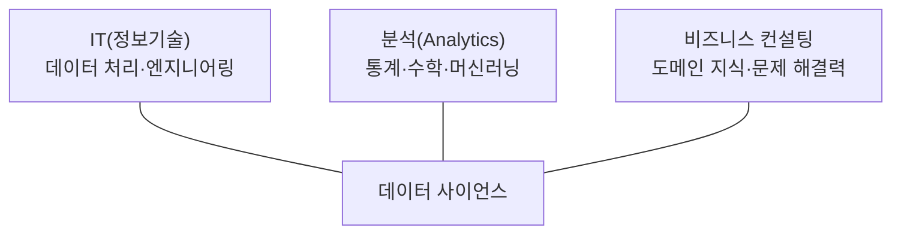
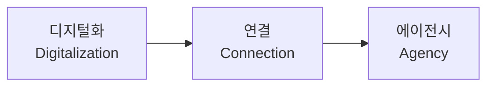

<Callout type="info">
  **이번 문서의 목표:** 데이터 사이언스가 IT·분석·비즈니스 컨설팅의 3가지 영역이 겹치는 자리에 있다는 것을 설명하고, 데이터 사이언티스트에게 필요한 하드 스킬과 소프트 스킬을 구분하며, 빅데이터 시대의 가치 패러다임이 어떻게 변해 왔는지 순서대로 말할 수 있게 된다.
</Callout>

## 왜 "사이언스"인가 — 분석 그 이상이 필요한 이유

04편에서 빅데이터가 만든 4가지 변화를 봤습니다. 데이터가 사후처리·전수조사·양·상관관계 중심으로 다뤄지게 되면서, 이 방대하고 지저분한 데이터에서 실제로 쓸모 있는 결론을 뽑아내는 일은 예전의 "통계 담당자" 한 사람이 감당할 수 있는 범위를 넘어섰습니다. 데이터를 저장할 시스템을 설계할 줄 알아야 하고(공학), 통계와 수학으로 패턴을 찾아낼 줄 알아야 하고(분석), 그 결과가 회사의 어떤 의사결정에 어떻게 연결되는지도 알아야 합니다(비즈니스). 이 세 가지를 한 사람 또는 한 팀이 종합적으로 수행하는 것을 **데이터 사이언스**(Data Science)라고 부르고, 이를 수행하는 사람을 **데이터 사이언티스트**(Data Scientist)라고 부릅니다.

## 1. 데이터 사이언스의 3가지 영역

> **쉽게 말하면:** 데이터 사이언스는 "데이터를 다룰 줄 아는 기술(IT)" + "패턴을 찾는 수학·통계(분석)" + "그래서 회사에 어떤 의미인지 아는 감각(비즈니스 컨설팅)"이 겹치는 자리입니다.

데이터 사이언스가 다루는 역량은 다음 3가지 영역으로 정리됩니다. 이 3가지 중 어느 하나만 있어서는 데이터 사이언스가 성립하지 않는다는 점이 핵심입니다.

| 영역 | 무엇을 하는가 | 없으면 생기는 문제 |
|---|---|---|
| IT(정보기술) | 대용량 데이터를 저장·수집·처리하는 시스템과 도구를 다룬다(분산 처리, 데이터베이스, 프로그래밍) | 아무리 좋은 분석 아이디어가 있어도 데이터를 실제로 꺼내 쓸 수 없다 |
| 분석(Analytics) | 통계학·수학·머신러닝 기법으로 데이터에서 패턴과 관계를 찾아낸다 | 데이터는 잘 쌓여 있어도 그 안에서 의미 있는 결론을 뽑아내지 못한다 |
| 비즈니스 컨설팅 | 그 조직의 산업·업무 맥락을 이해하고, 분석 결과를 실제 의사결정과 연결한다(도메인 지식) | 통계적으로는 맞는 분석이라도 회사의 실제 문제와 동떨어진 엉뚱한 결론이 나온다 |

세 영역이 겹치지 않으면 어떤 일이 생기는지 예를 들어 보겠습니다. IT와 분석만 갖춘 사람은 "이탈 확률이 87퍼센트로 계산됐습니다"라는 정확한 숫자는 낼 수 있지만, 그 숫자가 이 회사의 어떤 마케팅 예산 결정과 연결되어야 하는지는 모를 수 있습니다. 반대로 비즈니스 감각만 있고 분석·IT 역량이 없으면, "고객이 이탈하는 것 같다"는 직관은 있지만 그것을 데이터로 검증하고 정량화할 방법이 없습니다. 데이터 사이언스는 이 세 다리가 동시에 튼튼해야 걸을 수 있는 의자와 같습니다.

**02편과의 연결:** DIKW 피라미드(데이터→정보→지식→지혜)에서 데이터가 지혜(통찰)로 올라가려면 사람의 경험과 판단이 필요하다고 했습니다. 데이터 사이언스의 비즈니스 컨설팅 영역이 바로 이 마지막 단계, 즉 분석 결과를 실제 의사결정의 지혜로 바꾸는 역할을 담당합니다.

## 2. 데이터 사이언티스트의 하드 스킬과 소프트 스킬

데이터 사이언티스트에게 필요한 역량은 크게 **하드 스킬**(Hard Skill)과 **소프트 스킬**(Soft Skill) 두 갈래로 나뉩니다. 하드(hard)는 "단단하다"는 뜻 그대로 수치로 검증 가능한 기술적 역량을, 소프트(soft)는 사람과의 관계·소통처럼 수치화하기 어려운 역량을 가리키는 관용적 표현입니다.

| 구분 | 정의 | 구체적인 예 |
|---|---|---|
| 하드 스킬(Hard Skill) | 빅데이터에 대한 이론적 지식과 분석 기술의 숙련도 | 통계 이론 이해, 머신러닝 알고리즘 구현, R·Python 같은 프로그래밍, 분산 처리 시스템 운용 |
| 소프트 스킬(Soft Skill) | 통찰력 있는 분석, 설득력 있는 전달, 협업 능력 | 문제를 정의하는 통찰력, 분석 결과를 비전문가에게 설득력 있게 전달하는 커뮤니케이션, 여러 부서와 협업하는 능력 |

> **쉽게 말하면:** 하드 스킬은 "계산을 정확히 해내는 능력", 소프트 스킬은 "그 계산이 왜 중요한지 사람들을 설득하는 능력"입니다.

**판정 요령:** 기출문제는 여러 역량을 보기로 나열하고 "다음 중 소프트 스킬에 가장 가까운 것은?"이라고 묻는 형태를 즐겨 씁니다. **분산 처리 프레임워크 설정, 통계적 추정량 계산, 머신러닝 알고리즘 구현**처럼 기술 자체를 다루는 항목은 모두 하드 스킬이고, **서로 다른 부서의 관점을 통합해 분석 결과를 설득력 있게 전달하는 능력**, **분석 업무와 관리 업무를 상황에 맞게 함께 수행하는 유연성**, **팀워크**는 소프트 스킬로 분류됩니다. 데이터 사이언티스트를 "코딩만 하는 사람"으로 한정 짓는 보기는 항상 틀린 설명이라는 점도 함께 기억해 두세요. 실제 업무는 문제 정의, 데이터 해석, 결과 전달까지 포함합니다.

**자주 틀리는 함정 — "객관성 확보를 위해 도메인 지식은 배제한다":** 이런 형태의 보기가 반복 출제되는데, 언제나 틀린 설명입니다. 객관성은 통계적 근거와 검증 절차로 확보하는 것이지, 그 데이터가 어떤 맥락에서 나왔는지에 대한 배경지식(도메인 지식)을 일부러 없애서 얻는 것이 아닙니다. 오히려 도메인 지식이 없으면 지표가 무엇을 뜻하는지조차 해석할 수 없습니다. 예를 들어 "재구매율이 15퍼센트"라는 숫자만으로는 이 업종에서 좋은 수치인지 나쁜 수치인지 판단할 수 없고, 해당 산업의 평균과 맥락을 알아야만 의미 있는 해석이 나옵니다.

## 3. 데이터 시대의 가치 패러다임 변화

빅데이터가 만들어내는 가치는 시간이 지나며 한 방향으로 진화해 왔습니다. ADsP는 이 진화 과정을 3단계로 정리합니다. 영단어 순서를 정확히 외우는 것이 시험의 핵심입니다.

| 단계 | 영단어 | 무엇이 달라지는가 |
|---|---|---|
| 1단계 | 디지털화(Digitalization) | 아날로그 형태로 흩어져 있던 정보(종이 문서, 사람의 기억)를 컴퓨터가 다룰 수 있는 디지털 데이터로 바꾸는 단계다 |
| 2단계 | 연결(Connection) | 디지털화된 개별 데이터들을 서로 연결하고 통합해, 개별로는 보이지 않던 관계를 드러내는 단계다 |
| 3단계 | 에이전시(Agency) | 연결된 데이터를 바탕으로 시스템이 스스로 판단하고 행동하는 주체(에이전트)처럼 작동하는 단계다 |

각 단계를 예로 풀어 보면, 종이 진료 기록을 전자의무기록(EMR) 시스템에 입력하는 것이 **디지털화**입니다. 여러 병원의 전자의무기록을 서로 연동해 한 환자의 전체 진료 이력을 한 곳에서 볼 수 있게 만드는 것이 **연결**입니다. 그리고 이렇게 연결된 데이터를 학습한 인공지능이 환자의 증상을 입력받아 스스로 진단 후보를 제시하거나 처방을 추천하는 단계까지 나아가면, 이는 데이터가 단순한 참고 자료를 넘어 **에이전시**, 즉 스스로 판단하고 행동하는 주체의 역할을 하게 된 것입니다.

> **쉽게 말하면:** 디지털화는 "종이를 컴퓨터 파일로 만드는 것", 연결은 "파일들을 서로 이어 붙이는 것", 에이전시는 "그 이어진 데이터가 스스로 판단해서 움직이는 것"입니다.

**자주 틀리는 점:** 이 3단계의 순서를 뒤섞어 놓은 보기가 자주 나옵니다. "연결 → 디지털화 → 에이전시"처럼 순서를 바꾸면 틀린 진술이 됩니다. 순서는 반드시 **디지털화 → 연결 → 에이전시**이며, 이는 논리적으로도 타당합니다. 디지털화되지 않은 데이터는 애초에 연결할 수 없고, 연결되지 않은 데이터는 시스템이 종합적으로 판단할 근거가 부족하기 때문입니다.

## 핵심 정리

- 데이터 사이언스는 IT(정보기술)·분석(Analytics)·비즈니스 컨설팅의 3가지 영역이 겹치는 자리에서 성립하며, 어느 하나가 빠지면 성립하지 않는다.
- 데이터 사이언티스트의 하드 스킬은 이론·기술적 숙련(통계·프로그래밍·알고리즘 구현)이고, 소프트 스킬은 통찰력·전달력·협업 능력이다. "도메인 지식을 배제해야 객관적"이라는 보기는 항상 틀렸다.
- 빅데이터 시대의 가치 패러다임은 디지털화(Digitalization) → 연결(Connection) → 에이전시(Agency) 순서로 진화한다.

## 마무리 복습

<Quiz
  questionNumber={1}
  question="데이터 사이언스를 구성하는 3가지 영역으로 가장 적절한 것은?"
  options={['IT, 분석, 비즈니스 컨설팅', 'IT, 마케팅, 회계', '분석, 디자인, 영업', '비즈니스 컨설팅, 법무, 재무']}
  correctAnswer={1}
  explanation="데이터 사이언스는 데이터를 처리하는 IT(정보기술), 통계·수학으로 패턴을 찾는 분석(Analytics), 그 결과를 실제 의사결정과 연결하는 비즈니스 컨설팅 3가지 영역이 겹치는 자리에서 성립한다."
  optionExplanations={['데이터 사이언스의 3가지 영역을 정확히 짚었다', 'IT는 포함되지만 마케팅과 회계는 데이터 사이언스의 3대 영역이 아니다', '분석은 포함되지만 디자인과 영업은 3대 영역이 아니다', '비즈니스 컨설팅은 포함되지만 법무와 재무는 3대 영역이 아니다']}
/>

<Quiz
  questionNumber={2}
  question="데이터 사이언스에서 분석(Analytics) 역량과 비즈니스 컨설팅 역량이 모두 있지만 IT 역량이 부족한 경우 발생하기 쉬운 문제로 가장 적절한 것은?"
  options={['분석 결과를 회사 의사결정과 연결하지 못한다', '통계적으로 유의미한 패턴을 찾지 못한다', '대용량 데이터를 실제로 저장·처리·확보하지 못해 분석 자체를 시작하기 어렵다', '분석 결과를 비전문가에게 설득력 있게 전달하지 못한다']}
  correctAnswer={3}
  explanation="IT 역량은 대용량 데이터를 저장·수집·처리하는 기술적 기반을 제공한다. 이 역량이 부족하면 아무리 좋은 분석·비즈니스 감각이 있어도 데이터 자체를 다룰 수단이 없어 분석을 시작하기 어렵다."
  optionExplanations={['이는 비즈니스 컨설팅 역량이 부족할 때 생기는 문제다', '이는 분석 역량이 부족할 때 생기는 문제다', 'IT 역량 부족으로 생기는 정확한 문제다', '이는 소프트 스킬(전달력) 부족의 문제이지 IT 역량과는 다른 범주다']}
/>

<Quiz
  questionNumber={3}
  question="다음 중 데이터 사이언티스트의 소프트 스킬에 가장 가까운 것은?"
  options={['분산 처리 프레임워크의 설정과 운용', '통계적 추정량의 수식을 정확히 계산하는 능력', '머신러닝 알고리즘을 코드로 직접 구현하는 능력', '서로 다른 부서의 관점을 통합해 분석 결과를 설득력 있게 전달하는 능력']}
  correctAnswer={4}
  explanation="소프트 스킬은 통찰력 있는 분석과 설득력 있는 전달, 협업 능력을 뜻한다. 여러 부서의 관점을 통합해 전달하는 능력이 이에 해당한다. 나머지는 모두 기술적 숙련도인 하드 스킬이다."
  optionExplanations={['기술 시스템을 다루는 능력으로 하드 스킬에 해당한다', '통계 계산 능력으로 하드 스킬에 해당한다', '알고리즘 구현 능력으로 하드 스킬에 해당한다', '통합·전달·협업 능력으로 소프트 스킬의 정확한 예다']}
/>

<Quiz
  questionNumber={4}
  question="데이터 사이언티스트에 대한 설명으로 옳지 않은 것은?"
  options={['도메인 지식이 있는 사람이 분석에 참여하면 더 깊은 통찰을 얻을 수 있다', '분석가는 상황에 따라 분석 업무와 관리 업무를 함께 수행할 수 있다', '객관성을 확보하기 위해 도메인 지식은 의도적으로 배제해야 한다', '데이터 사이언티스트의 역할은 코딩에만 한정되지 않는다']}
  correctAnswer={3}
  explanation="객관성은 통계적 근거와 검증 절차로 확보하는 것이지 도메인 지식을 배제해서 얻는 것이 아니다. 도메인 지식이 없으면 분석 결과가 무엇을 의미하는지조차 해석할 수 없으므로 이 보기는 옳지 않다."
  optionExplanations={['도메인 지식은 업무 맥락을 반영한 통찰을 얻는 데 도움을 주므로 옳은 설명이다', '분석가가 관리 업무를 절대 수행할 수 없다는 주장은 지나치게 단정적이며, 실제로는 상황에 따라 함께 수행할 수 있으므로 옳은 설명이다', '도메인 지식을 배제해야 객관적이라는 주장은 틀린 설명이므로 이 보기가 정답이다', '문제 정의·데이터 해석·결과 전달 등 코딩 외 업무도 포함하므로 옳은 설명이다']}
/>

<Quiz
  questionNumber={5}
  question="빅데이터 가치 패러다임의 변화 과정을 순서대로 나열한 것은?"
  options={['디지털화 → 연결 → 에이전시', '연결 → 디지털화 → 에이전시', '에이전시 → 연결 → 디지털화', '연결 → 에이전시 → 디지털화']}
  correctAnswer={1}
  explanation="가치 패러다임은 아날로그 정보를 컴퓨터가 다룰 수 있게 바꾸는 디지털화, 그 데이터들을 서로 잇는 연결, 연결된 데이터가 스스로 판단·행동하는 에이전시 순서로 진화한다."
  optionExplanations={['디지털화 → 연결 → 에이전시 순서를 정확히 나열했다', '디지털화되지 않은 데이터는 연결할 수 없으므로 이 순서는 논리적으로 성립하지 않는다', '에이전시가 가장 마지막 단계인데 첫 단계로 제시되어 순서가 틀렸다', '디지털화가 가장 먼저 와야 하는데 마지막에 배치되어 순서가 틀렸다']}
/>

<Quiz
  questionNumber={6}
  question="가치 패러다임의 두 번째 단계인 '연결(Connection)'에 해당하는 사례로 가장 적절한 것은?"
  options={['종이 진료 기록을 전자의무기록(EMR) 시스템에 입력한다', '여러 병원의 전자의무기록을 서로 연동해 한 환자의 전체 진료 이력을 통합해 본다', '인공지능이 증상을 입력받아 스스로 진단 후보를 제시한다', '병원 내부 서버의 저장 공간을 늘린다']}
  correctAnswer={2}
  explanation="연결 단계는 이미 디지털화된 개별 데이터를 서로 이어 붙여 통합된 관점을 만드는 단계다. 여러 병원의 전자의무기록을 연동해 통합 진료 이력을 보는 것이 정확한 사례다."
  optionExplanations={['이는 아날로그를 디지털로 바꾸는 디지털화 단계의 사례다', '흩어진 데이터를 서로 잇는 연결 단계의 정확한 사례다', '이는 데이터가 스스로 판단·행동하는 에이전시 단계의 사례다', '이는 저장 용량 확장으로 가치 패러다임의 어느 단계에도 해당하지 않는 인프라 문제다']}
/>

<Quiz
  questionNumber={7}
  question="데이터 사이언스에서 비즈니스 컨설팅 영역이 결여됐을 때 나타나기 쉬운 상황으로 가장 적절한 것은?"
  options={['데이터를 저장할 시스템 자체를 구축하지 못한다', '통계적으로는 정확하지만 조직의 실제 문제와 동떨어진 결론이 나온다', '분산 처리 기술을 전혀 사용할 수 없다', '데이터의 형태(정형·반정형·비정형)를 구분하지 못한다']}
  correctAnswer={2}
  explanation="비즈니스 컨설팅 영역은 그 조직의 산업·업무 맥락(도메인 지식)을 이해하고 분석 결과를 실제 의사결정과 연결하는 역할을 한다. 이 영역이 없으면 통계적으로는 맞아도 실제 업무와 동떨어진 결론이 나오기 쉽다."
  optionExplanations={['이는 IT 영역이 결여됐을 때의 문제다', '비즈니스 컨설팅 영역 결여의 정확한 결과다', '이는 IT 영역의 기술적 역량 문제다', '이는 04편에서 다룬 데이터 유형 구분의 문제로 분석 역량과 더 관련이 깊다']}
/>

## 참고 자료

- [데이터자격시험 - ADsP 출제기준](https://www.dataq.or.kr/www/sub/a_06.do)
