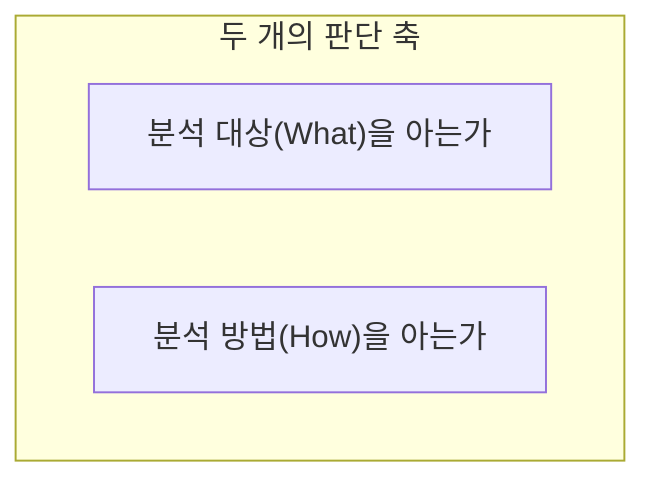

<Callout type="info">
  **이번 문서의 목표:** 분석 기획이 무엇을 위한 활동인지 설명하고, 분석 대상(What)과 분석 방법(How)을 아는지에 따라 나뉘는 4가지 분석 주제 유형을 그림으로 구분하며, 목표 시점에 따른 과제 중심 접근과 마스터플랜 접근의 차이, 분석 기획 시 반드시 검토해야 할 고려사항을 말할 수 있게 된다.
</Callout>

## 왜 분석에 "기획"이 필요한가

05편에서 데이터 사이언스가 IT·분석·비즈니스 컨설팅 3가지 영역이 겹쳐야 성립한다는 것을 봤습니다. 그런데 아무리 뛰어난 분석 기술이 있어도, "무엇을 왜 분석할 것인가"를 먼저 정하지 않으면 그 기술은 방향 없이 낭비됩니다. 예를 들어 회사가 가진 모든 데이터를 대상으로 아무 가설 없이 머신러닝 모델을 이것저것 돌려 본다면, 시간과 비용은 많이 들지만 회사의 실제 의사결정에 도움이 되는 결과가 나올 확률은 낮습니다. **분석 기획**(Analytics Planning)은 이 문제를 막기 위해, 분석을 시작하기 전에 "어떤 목표를 위해, 어떤 데이터로, 어떤 방식으로 분석할 것인가"를 체계적으로 설계하는 활동입니다. 이번 편은 그 분석 기획의 방향을 정하는 첫 단계를 다루고, 다음 편(07편)에서는 그 기획을 실제로 수행하는 방법론(CRISP-DM·KDD)을 이어서 다룹니다.

## 1. 분석 기획의 정의와 목표

> **쉽게 말하면:** 분석 기획은 "무엇을(what) 어떻게(how) 분석해서 어떤 가치를 만들지"를 실행에 앞서 설계하는 일입니다.

분석 기획은 조직이 보유한 데이터와 해결해야 할 비즈니스 문제를 연결해, 어떤 분석 과제를 어떤 순서와 방식으로 수행할지 미리 그려 보는 활동입니다. 이 활동이 제대로 되지 않으면, 분석 하나하나는 기술적으로 훌륭해도 조직 전체로 보면 중복 투자, 우선순위 혼선, 방향성 없는 산발적 프로젝트로 이어지기 쉽습니다.

분석 기획이 다뤄야 할 질문은 크게 두 갈래로 나뉩니다.

1. **무엇을 분석할 것인가(대상, What):** 조직이 풀어야 할 비즈니스 문제, 그리고 그 문제와 관련된 데이터가 무엇인지 정의하는 것.
2. **어떻게 분석할 것인가(방법, How):** 그 문제를 풀기 위해 어떤 분석 기법과 절차를 쓸 것인지 정의하는 것.

이 두 질문에 대해 조직이 이미 답을 알고 있는지 모르는지가, 다음 절에서 다룰 4가지 분석 주제 유형을 가르는 기준이 됩니다.

## 2. 분석 주제 유형 4분면 — 최적화·솔루션·통찰·발견

이 표는 ADsP에서 가장 자주, 가장 정확하게 외워야 하는 표 중 하나입니다. 분석 주제의 유형은 "분석 대상(What)을 아는가"와 "분석 방법(How)을 아는가"라는 **두 개의 축**으로 나뉘며, 이 두 축의 조합으로 정확히 4가지 유형이 만들어집니다.

| | 분석 방법(How)을 안다 | 분석 방법(How)을 모른다 |
|---|---|---|
| **분석 대상(What)을 안다** | 최적화(Optimization) | 솔루션(Solution) |
| **분석 대상(What)을 모른다** | 통찰(Insight) | 발견(Discovery) |

각 칸이 정확히 무엇을 뜻하는지 하나씩 짚어 보겠습니다.

- **최적화(Optimization):** 무엇을 분석해야 할지도 알고, 어떤 방법으로 풀어야 할지도 이미 아는 경우입니다. 예를 들어 "이번 달 재고 회전율을 개선한다"는 목표(대상)가 명확하고, 이를 위해 기존에 써 오던 재고 최적화 알고리즘(방법)이 있다면, 이미 아는 두 가지를 더 정교하게 다듬는 최적화 작업이 됩니다.
- **솔루션(Solution):** 무엇을 풀어야 할지(대상)는 명확한데, 그것을 어떻게 풀어야 할지(방법)는 아직 정해지지 않은 경우입니다. 예를 들어 "고객 이탈을 줄이고 싶다"는 문제는 분명하지만, 이를 어떤 분석 기법으로 접근할지는 새롭게 찾아야 한다면 솔루션 유형입니다. 즉 새로운 해법(solution)을 개발하는 상황입니다.
- **통찰(Insight):** 반대로 어떤 분석 방법을 쓸지는 이미 알고 있는데(예: 이미 익숙하게 쓰는 특정 통계 기법이나 시각화 방식), 이 방법을 적용할 명확한 대상, 즉 어떤 문제를 풀지는 아직 정해지지 않은 경우입니다. 이 경우에는 그 방법을 여러 데이터에 적용해 보며 미처 몰랐던 통찰(insight)을 얻는 방향으로 접근합니다.
- **발견(Discovery):** 무엇을 분석할지도, 어떻게 분석할지도 아직 모르는 경우입니다. 가장 탐색적인 유형으로, 데이터를 이리저리 살펴보며 새로운 문제와 새로운 방법을 동시에 발견(discovery)해 나가야 합니다.

> **쉽게 말하면:** 최적화는 "답도 알고 푸는 법도 안다", 솔루션은 "답은 아는데 푸는 법을 새로 찾아야 한다", 통찰은 "푸는 법은 아는데 어디에 쓸지 찾아야 한다", 발견은 "둘 다 처음부터 찾아야 한다"입니다.

**자주 틀리는 점:** 4분면의 이름과 조건을 서로 뒤바꾼 보기가 반복 출제됩니다. 예를 들어 "분석 대상은 알지만 분석 방법을 모르는 경우는 발견 유형이다"처럼 솔루션과 발견을 바꿔치기하거나, "분석 대상과 방법을 모두 아는 경우는 발견 유형이다"처럼 최적화와 발견을 바꿔치기하는 함정이 나옵니다. 표를 그대로 암기하기보다, "**대상을 아는 축이 왼쪽 열, 방법을 아는 축이 위쪽 행**"이라는 표의 구조 자체를 기억해 두면 어떤 조합으로 물어봐도 즉시 답을 유도할 수 있습니다.

## 3. 목표 시점에 따른 접근 — 과제 중심 탐색과 마스터플랜 접근

분석 기획은 **언제까지, 어느 범위로 성과를 낼 것인가**에 따라서도 접근 방식이 달라집니다. ADsP는 이를 두 축으로 구분합니다.

| 구분 | 과제 중심 탐색(Speed & Test) | 마스터플랜 접근(Master Plan) |
|---|---|---|
| 목표 시점 | 당면한 과제를 즉시 해결(단기) | 중장기적으로 여러 과제를 조직적으로 추진 |
| 특징 | 빠른 실행과 검증(속도와 테스트 중시), 특정 문제를 빠르게 해결 | 전체 그림을 먼저 그리고 과제들의 우선순위와 로드맵을 설계 |
| 장점 | 빠르게 성과를 체감할 수 있고, 조직의 분석 문화 확산에 도움이 된다 | 과제 간 중복과 자원 낭비를 막고, 장기적으로 일관된 방향을 유지할 수 있다 |
| 유의점 | 과제 중심이라도 실제 이행 시에는 과제 간 선후관계와 의존성을 고려해야 한다 | 초기 설계에 시간이 걸려 당장 눈앞의 문제 해결이 늦어질 수 있다 |

**과제 중심 탐색**은 이미 시급한 문제가 있을 때, 그 문제 하나를 빠르게 풀어 성과를 증명하는 방식입니다. "속도와 검증"이 핵심 가치이며, 작은 성공 사례를 쌓아 조직 내에서 분석에 대한 신뢰를 얻는 데 유리합니다. 다만 여러 개의 과제 중심 프로젝트를 개별적으로만 진행하면, 나중에 그 과제들이 서로 얽히거나 중복될 때 문제가 생깁니다. 그래서 과제 중심 접근이라 하더라도, 여러 이행 과제를 실행할 때는 어떤 과제가 먼저 끝나야 다른 과제가 가능한지 등 **과제 간 선후관계**를 반드시 고려해야 합니다. 이를 무시하면 실행 가능성과 효과가 함께 떨어집니다.

**마스터플랜 접근**은 조직 전체의 데이터 분석 역량을 중장기적으로 어떻게 키워 나갈지 미리 설계하는 방식입니다. 이 접근은 09편(분석 마스터플랜과 우선순위 로드맵)에서 더 자세히 다루며, 여기서는 "당장의 과제 해결"과 "전체 그림을 먼저 그리는 것" 중 어느 쪽에 무게를 두는지가 두 접근의 근본적인 차이라는 점만 기억해 둡니다.

> **쉽게 말하면:** 과제 중심은 "일단 눈앞의 불부터 끈다", 마스터플랜은 "건물 전체의 소방 계획부터 짠다"입니다. 어느 한쪽이 항상 옳은 것이 아니라, 조직의 상황(급한 문제가 있는지, 장기 투자 여력이 있는지)에 맞춰 선택하거나 병행합니다.

## 4. 분석 기획 시 고려해야 할 사항

분석 기획 단계에서 놓치면 나중에 큰 비용으로 되돌아오는 검토 항목들이 있습니다. ADsP는 이를 다음과 같이 정리합니다.

- **가치 창출 시나리오와 활용 사례(유즈케이스) 탐색:** 이 분석이 실제로 어떤 가치를 만들고, 조직의 어떤 업무에 어떻게 쓰일지를 미리 그려 봅니다. 분석 결과가 나온 다음에 "그래서 이걸로 뭘 하지?"라고 묻는 것은 이미 늦습니다.
- **장애 요소와 대응 방안 검토:** 데이터 접근 권한, 조직의 반발, 예산 부족 등 분석을 가로막을 수 있는 요인을 미리 파악하고 대응 계획을 세웁니다.
- **데이터 정합성(무결성) 검토:** 분석에 쓸 데이터가 신뢰할 만한지, 데이터 간에 모순은 없는지 미리 점검합니다. 03편에서 다룬 DBMS의 데이터 무결성 개념과 연결됩니다.
- **데이터 확보 가능성 검토:** 분석에 필요한 데이터를 실제로 구할 수 있는지(수집 경로, 법적 제약 등)를 확인합니다. 아무리 좋은 분석 설계라도 데이터를 구할 수 없으면 실행할 수 없습니다.
- **데이터 유형에 대한 고려:** 04편에서 다룬 정형·반정형·비정형 데이터의 구분은 어떤 분석 방법과 처리 방식을 쓸지에 직접 영향을 주므로, 분석 기획 단계에서 반드시 함께 검토해야 합니다.
- **지속적인 교육과 변화 관리:** 분석 결과가 실제 업무에 정착하려면, 이를 사용할 구성원에 대한 교육과 조직의 변화 관리가 함께 필요합니다.

> **자주 틀리는 점:** "데이터 유형은 분석 기획 단계에서 고려하지 않아도 된다"거나 "항상 최신 분석 기법을 사용하는 것을 최우선으로 한다"는 형태의 보기가 오답으로 자주 등장합니다. 데이터 유형은 분석 방법과 처리 방식, 이후 모델링에까지 직접 영향을 주므로 기획 단계에서 반드시 고려해야 할 항목입니다. 또한 분석 기획의 목적은 "최신 기법을 쓰는 것" 자체가 아니라 **문제 해결에 적합한 방법을 선택**하는 것이므로, 최신 기법 사용 자체를 최우선 목표로 두는 진술은 옳지 않습니다. 문제 적합성과 해석 가능성, 실제 운영 가능성이 최신성보다 더 중요할 수 있습니다.

## 핵심 정리

- 분석 기획은 무엇을 어떻게 분석해 어떤 가치를 만들지 실행에 앞서 설계하는 활동이다.
- 분석 주제 유형은 분석 대상(What)을 아는가와 분석 방법(How)을 아는가의 조합으로 최적화(둘 다 앎)·솔루션(대상만 앎)·통찰(방법만 앎)·발견(둘 다 모름) 4가지로 나뉜다.
- 목표 시점에 따라 당면 과제를 빠르게 해결하는 과제 중심 탐색과, 중장기 로드맵을 먼저 설계하는 마스터플랜 접근으로 나뉜다. 과제 중심이라도 과제 간 선후관계는 반드시 고려해야 한다.
- 분석 기획 시 고려사항: 가치 창출 시나리오, 장애 요소 대응, 데이터 정합성, 데이터 확보 가능성, 데이터 유형, 교육·변화 관리. "데이터 유형은 몰라도 된다", "최신 기법이 최우선이다"는 항상 틀린 진술이다.

## 마무리 복습

<Quiz
  questionNumber={1}
  question="분석 주제 유형에 대한 설명으로 적절한 것은?"
  options={['분석 대상과 분석 방법 모두 모르는 경우, 솔루션 개발을 통해 문제를 해결한다', '분석 대상은 알지만 분석 방법을 모르는 경우, 발견을 통해 문제를 해결한다', '분석 대상과 분석 방법 모두 아는 경우, 최적화를 통해 문제를 해결한다', '분석 대상은 모르지만 분석 방법은 아는 경우, 솔루션을 통해 문제를 해결한다']}
  correctAnswer={3}
  explanation="분석 대상(What)과 분석 방법(How)을 모두 아는 경우는 최적화(Optimization) 유형에 해당한다. 이미 아는 문제와 방법을 더 정교하게 다듬는 작업이기 때문이다."
  optionExplanations={['대상과 방법 모두 모르면 발견(Discovery) 유형이다', '대상은 알지만 방법을 모르면 솔루션(Solution) 유형이다', '대상·방법 모두 알면 최적화 유형으로 옳은 설명이다', '대상은 모르고 방법은 알면 통찰(Insight) 유형이다']}
/>

<Quiz
  questionNumber={2}
  question="분석 방법(How)은 이미 알고 있지만 이를 적용할 명확한 분석 대상(What)이 아직 정해지지 않은 경우에 해당하는 분석 주제 유형은?"
  options={['최적화(Optimization)', '솔루션(Solution)', '통찰(Insight)', '발견(Discovery)']}
  correctAnswer={3}
  explanation="분석 방법은 알지만 분석 대상, 즉 무엇을 분석할지 문제 정의가 명확하지 않은 경우는 통찰(Insight) 유형에 해당한다. 알고 있는 방법을 여러 데이터에 적용해 보며 새로운 통찰을 얻는 방식으로 접근한다."
  optionExplanations={['최적화는 대상과 방법을 모두 아는 경우다', '솔루션은 대상은 알지만 방법을 모르는 경우다', '방법은 알고 대상을 모르는 경우를 정확히 짚었다', '발견은 대상과 방법을 모두 모르는 경우다']}
/>

<Quiz
  questionNumber={3}
  question="분석 기획 시 고려사항으로 가장 부적절한 것은?"
  options={['가치창출 시나리오와 유즈케이스를 탐색한다', '장애요소와 대응방안을 검토한다', '데이터 정합성을 검토한다', '데이터 유형은 분석 기획 단계에서 고려하지 않아도 된다']}
  correctAnswer={4}
  explanation="데이터 유형(정형·반정형·비정형)은 이후 분석 방법·처리 방식·모델링에 직접 영향을 주므로 분석 기획 단계에서 반드시 고려해야 하는 항목이다."
  optionExplanations={['가치 창출 시나리오 탐색은 분석 기획의 핵심 고려사항이다', '장애요소 검토는 실행 가능성을 높이는 핵심 고려사항이다', '데이터 정합성 검토는 분석 결과의 신뢰성을 위해 필요한 고려사항이다', '데이터 유형은 반드시 고려해야 하는 항목인데 고려하지 않아도 된다고 했으므로 정답이다']}
/>

<Quiz
  questionNumber={4}
  question="과제 중심적 데이터 분석에 대한 설명으로 옳지 않은 것은?"
  options={['즉각적인 실행을 통해 성과를 도출하는 데 초점을 둔다', '속도와 검증을 중시한다', '빠른 문제 해결을 목표로 한다', '여러 이행 과제를 실행할 때 과제 간 선후관계는 고려하지 않아도 된다']}
  correctAnswer={4}
  explanation="과제 중심적 분석이라도 실제 이행 과정에서는 과제 간 선후관계와 의존성을 반드시 고려해야 한다. 이를 무시하면 실행 가능성과 효과가 함께 떨어진다."
  optionExplanations={['빠른 실행과 성과 도출에 초점을 두는 것이 옳은 설명이다', '가설을 빠르게 검증하고 성과를 확인하는 것이 옳은 설명이다', '특정 문제를 빠르게 해결하는 성격이 강하므로 옳은 설명이다', '선후관계를 무시해도 된다는 설명은 실행 가능성을 떨어뜨리므로 옳지 않아 정답이다']}
/>

<Quiz
  questionNumber={5}
  question="분석 기획에서 목표 시점에 따른 접근인 마스터플랜 접근에 대한 설명으로 가장 적절한 것은?"
  options={['당면한 하나의 문제를 최대한 빠르게 해결하는 데 집중한다', '중장기적으로 여러 분석 과제를 조직적으로 설계하고 우선순위를 정한다', '분석 방법을 검증하는 절차 없이 즉시 실행에 옮긴다', '조직 전체 그림 없이 부서별로 개별 과제를 진행한다']}
  correctAnswer={2}
  explanation="마스터플랜 접근은 중장기적 관점에서 여러 분석 과제를 조직적으로 설계하고, 그 과제들의 우선순위와 로드맵을 미리 그리는 접근이다."
  optionExplanations={['이는 과제 중심 탐색(Speed & Test)에 대한 설명이다', '중장기 설계와 우선순위 수립을 정확히 짚은 설명이다', '속도와 검증을 중시하는 것은 과제 중심 접근의 특징이다', '전체 그림 없이 개별로 진행하는 것은 마스터플랜 접근이 막고자 하는 문제 상황이다']}
/>

<Quiz
  questionNumber={6}
  question="분석 대상은 알지만 분석 방법을 모르는 경우, 새로운 해법을 개발해야 하는 분석 주제 유형은?"
  options={['최적화(Optimization)', '솔루션(Solution)', '통찰(Insight)', '발견(Discovery)']}
  correctAnswer={2}
  explanation="분석 대상, 즉 풀어야 할 문제는 명확하지만 이를 풀 방법이 정해지지 않은 경우는 솔루션(Solution) 유형이다. 이 경우 새로운 해법을 개발하는 방향으로 접근한다."
  optionExplanations={['최적화는 대상과 방법을 모두 아는 경우다', '대상은 알고 방법을 모르는 경우를 정확히 짚었다', '통찰은 방법은 알고 대상을 모르는 경우다', '발견은 대상과 방법을 모두 모르는 경우다']}
/>

<Quiz
  questionNumber={7}
  question="분석 기획 시 고려사항에 해당하지 않는 것은?"
  options={['필요한 데이터의 확보 가능성을 고려한다', '가치 창출 방법과 활용 사례를 고려한다', '지속적인 교육과 활용 확산을 위한 변화 관리를 고려한다', '항상 최신 분석기법을 사용하는 것을 최우선으로 한다']}
  correctAnswer={4}
  explanation="분석 기획에서는 최신 기법 사용 자체가 목적이 아니라, 문제 해결에 적합한 방법을 선택하는 것이 핵심이다. 문제 적합성과 해석 가능성, 운영 가능성이 최신성보다 더 중요할 수 있다."
  optionExplanations={['데이터 확보 가능성은 분석 기획의 핵심 고려사항이다', '분석이 만들 가치와 활용 방식을 미리 고려하는 것은 핵심 고려사항이다', '분석 결과가 정착되려면 교육과 변화 관리가 필요하므로 핵심 고려사항이다', '최신 기법 사용 자체를 최우선으로 삼는 것은 옳지 않으므로 정답이다']}
/>

## 참고 자료

- [데이터자격시험 - ADsP 출제기준](https://www.dataq.or.kr/www/sub/a_06.do)
