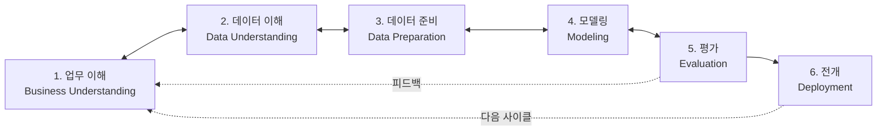

<Callout type="info">
  **이번 문서의 목표:** 데이터분석 방법론이 왜 필요한지 설명하고, KDD의 5단계와 CRISP-DM의 6단계를 각각 순서대로 말할 수 있으며, 두 방법론의 단계가 어떻게 대응되는지, CRISP-DM이 왜 일방통행이 아닌 순환 구조인지 설명할 수 있다.
</Callout>

## 방법론이 왜 필요한가

### 왜 필요한가

데이터분석 프로젝트를 처음 맡은 담당자를 떠올려보자. "매출을 늘리고 싶다"는 막연한 요청만 받고 곧바로 R 코드부터 짜기 시작하면 어떤 일이 벌어질까. 어떤 데이터를 모아야 할지 기준이 없어 이것저것 긁어모으고, 분석 중간에 "애초에 무엇을 풀려던 거였지"를 잊어버리고, 결과가 나와도 그게 정말 처음 목표에 맞는 답인지 확신할 수 없다. 개인의 감(感)에 의존한 분석은 특정 담당자가 바뀌면 다시 처음부터 시작해야 하고, 프로젝트마다 품질이 들쭉날쭉해진다.

**방법론**(methodology)이란 어떤 일을 할 때 "무엇을, 어떤 순서로, 어떤 기준으로 해야 하는가"를 체계적으로 정리해 둔 절차와 지침의 집합이다. 데이터분석 방법론은 이 문제를 해결하기 위해 등장했다. 분석의 시작부터 끝까지를 몇 개의 단계로 표준화해 두면, 담당자가 바뀌어도 같은 절차를 따라갈 수 있고, 지금 어느 단계에 있는지 항상 점검할 수 있으며, 앞 단계에서 놓친 부분을 뒤 단계에서 알아챘을 때 되돌아가 보완할 수 있다.

> **쉽게 말하면:** 방법론은 데이터분석이라는 요리를 만들 때 따르는 "레시피"다. 재료 손질(데이터 준비) 순서를 건너뛰고 바로 굽기(모델링)부터 하면 요리를 망치듯, 분석도 정해진 순서를 지켜야 실패 확률이 줄어든다.

### 정의

ADsP 시험 범위에서 가장 자주 등장하는 데이터분석 방법론은 세 가지다.

1. **KDD**(Knowledge Discovery in Databases, 데이터베이스에서의 지식 발견)
2. **CRISP-DM**(Cross Industry Standard Process for Data Mining, 산업 간 표준 데이터마이닝 프로세스)
3. **빅데이터 분석 방법론**(국내 데이터거버넌스 표준교재 기준의 5단계 방법론)

셋 다 "분석 프로젝트를 몇 개의 큰 단계로 나누고, 각 단계에서 무엇을 하는지 정의한다"는 목적은 같지만, 단계 수와 이름, 강조점이 다르다. 이 차이를 정확히 구분하는 문항이 회차마다 빠지지 않고 출제되므로, 세 방법론을 각각 외우는 것보다 **서로 대응시켜서** 이해하는 것이 훨씬 오래 기억에 남는다.

## KDD: 데이터베이스에서 지식을 캐내는 5단계

### 왜 필요한가

KDD는 1996년 파야드(Fayyad) 등이 제안한 방법론으로, 이름 그대로 "데이터베이스(Database, 자료를 저장·관리하는 체계)에 파묻힌 지식을 발견(Discovery)하는 과정"에 초점을 둔다. 데이터마이닝(Data Mining, 대량의 데이터에서 유용한 패턴을 찾아내는 작업)이라는 용어가 KDD의 한 단계로 등장한다는 점에서, KDD는 "데이터마이닝을 포함하는 더 큰 지식 발견 프로세스"라고 이해하면 된다.

> **쉽게 말하면:** KDD는 "원석(데이터)에서 보석(지식)을 캐내는 다섯 단계의 채굴·가공 공정"이다.

### 정의: KDD의 5단계

<Steps>
1. **데이터셋 선택**(Selection): 분석 목적에 맞는 원본 데이터를 전체 데이터베이스에서 골라낸다. 목표와 무관한 데이터를 걷어내는 첫 필터링 단계다.
2. **데이터 전처리**(Preprocessing): 선택된 데이터의 잡음(noise, 분석을 방해하는 오류나 이상한 값)과 결측치(missing value, 비어 있는 값)를 처리해 품질을 정리한다.
3. **데이터 변환**(Transformation): 전처리된 데이터를 실제로 적용할 데이터마이닝 기법에 맞는 형태로 바꾼다. 예를 들어 문자로 된 등급("상"·"중"·"하")을 숫자(3, 2, 1)로 바꾸거나, 여러 변수를 하나로 요약하는 차원 축소를 수행한다.
4. **데이터마이닝**(Data Mining): 변환된 데이터에 실제 분석 알고리즘(분류, 군집, 연관규칙 등)을 적용해 숨어 있는 패턴이나 모델을 찾아낸다.
5. **해석 및 평가**(Interpretation/Evaluation): 데이터마이닝으로 도출된 패턴이 실제로 의미가 있는지, 비즈니스 목표에 쓸모가 있는지를 해석하고 평가해 최종 지식으로 확정한다.
</Steps>

<Callout type="warning">
  **자주 틀리는 함정 (모의고사 125번 유형)**: "변환(Transformation) 단계의 목적은 시각화를 통한 해석이다" 같은 보기가 오답으로 나온다. 시각화·해석은 마지막 단계인 해석 및 평가의 역할이고, 변환 단계는 어디까지나 **데이터마이닝 알고리즘이 처리할 수 있는 형태로 데이터를 가공**하는 것이 목적이다. "이 단계의 산출물을 다음에 어떤 단계가 쓰는가"를 기준으로 단계를 구분하면 헷갈리지 않는다.
</Callout>

## CRISP-DM: 산업 표준 데이터마이닝 프로세스의 6단계

### 왜 필요한가

CRISP-DM은 1996년 유럽연합의 지원을 받아 여러 기업이 공동으로 만든 방법론으로, 이름의 "Cross Industry"(산업 간)가 뜻하듯 특정 업종에 국한되지 않고 널리 쓰이도록 설계됐다. KDD가 "지식 발견"이라는 학술적 관점에 가깝다면, CRISP-DM은 **비즈니스 문제 해결**이라는 실무 관점에서 출발한다는 점이 가장 큰 차이다. 그래서 첫 단계 이름부터 "업무 이해"로 시작한다.

> **쉽게 말하면:** CRISP-DM은 "우리 회사의 어떤 문제를 풀 것인가"부터 시작해 실제로 그 해법을 현장에 심는 데까지 이어지는 여섯 걸음이다.

### 정의: CRISP-DM의 6단계

<Steps>
1. **업무 이해**(Business Understanding): 분석 프로젝트의 목적과 요구사항을 비즈니스 관점에서 파악하고, 이를 데이터마이닝 문제 정의로 옮긴다.
2. **데이터 이해**(Data Understanding): 초기 데이터를 수집해 데이터의 구조, 품질, 특성을 탐색하며 숨은 인사이트의 실마리를 찾는다.
3. **데이터 준비**(Data Preparation): 최종 분석에 사용할 데이터셋을 만들기 위해 정제(cleaning), 통합(integration), 포맷팅(formatting) 등을 수행한다. 이 단계가 전체 프로젝트에서 시간이 가장 많이 든다고 알려져 있다.
4. **모델링**(Modeling): 다양한 모델링 기법을 선택하고 파라미터(parameter, 모델의 세부 설정값)를 조정해 최적의 모델을 만든다.
5. **평가**(Evaluation): 만들어진 모델이 처음 업무 이해 단계에서 세운 비즈니스 목표를 실제로 달성하는지 평가한다.
6. **전개**(Deployment): 평가를 통과한 모델을 실제 현업 시스템에 적용하고, 그 결과를 모니터링할 계획을 수립한다. "배포"라고도 부른다.
</Steps>

<Callout type="warning">
  **자주 틀리는 함정 (46회 기출)**: 6단계의 순서를 뒤섞어 놓은 보기가 반복 출제된다. 예를 들어 "데이터 이해 → 데이터 준비 → 업무 이해 → 모델링 → 평가 → 전개"처럼 업무 이해를 첫 단계가 아닌 자리에 넣는 함정이다. **업무 이해가 반드시 첫 단계**라는 점, 그리고 데이터 준비 단계에서 하는 활동으로 "데이터 정제·통합·포맷팅"은 맞지만 **탐색적 분석(데이터 탐색)은 데이터 이해 단계의 활동**이라는 점(48회 기출)을 혼동하지 않아야 한다.
</Callout>

### CRISP-DM은 왜 순환 구조인가

CRISP-DM의 6단계는 숫자가 매겨져 있어 얼핏 1번부터 6번까지 순서대로만 흘러가는 것처럼 보이지만, 실제로는 **단방향이 아니다.** 예를 들어 데이터 이해 단계에서 데이터를 살펴보다가 애초에 업무 이해 단계에서 정의한 문제 자체가 잘못됐다는 것을 깨달으면, 업무 이해 단계로 돌아가 문제 정의를 다시 다듬는다. 모델링 단계에서 모델 성능이 기대에 못 미치면 데이터 준비 단계로 돌아가 변수를 추가하거나 정제 방식을 바꾼다. 평가 단계에서 비즈니스 목표에 못 미친다고 판단되면 업무 이해로 돌아가 목표 자체를 재검토하기도 한다. 전개 이후에도 실제 운영 데이터로 다시 데이터 이해 단계를 시작하는 새로운 프로젝트 사이클이 열릴 수 있다.

이렇게 이전 단계로 되돌아가 다시 다듬는 것을 **피드백**(feedback, 결과를 이전 단계에 되돌려 반영하는 것)이라 부르며, CRISP-DM은 이 피드백을 전제로 설계된 **순환형**(iterative) 프로세스다.

위 다이어그램에서 실선 양방향 화살표(`<-->`)는 인접한 두 단계 사이를 자유롭게 오갈 수 있음을, 점선 화살표는 멀리 떨어진 단계로 되돌아가는 큰 피드백 루프를 나타낸다. 이 구조 때문에 CRISP-DM을 도식화할 때 흔히 원(circle) 모양으로 그려 "끝없이 돌아가는 순환"이라는 이미지를 강조한다.

<Callout type="warning">
  **자주 틀리는 점**: "CRISP-DM은 정해진 순서대로만 진행되는 폭포수(waterfall)식 모델이다"라는 진술은 옳지 않다. 정답 근거는 정확히 반대로, **단계 간 피드백을 허용하는 반복적(iterative) 프로세스**라는 점이다. 폭포수 모델(이전 단계가 완전히 끝나야만 다음 단계로 진행하고 되돌아가지 않는 방식)의 특징을 CRISP-DM에 잘못 갖다 붙이는 보기가 나오면 오답으로 걸러야 한다.
</Callout>

## KDD와 CRISP-DM 단계 대조

두 방법론은 **단계 수 자체가 다르다**(KDD 5단계, CRISP-DM 6단계). 그래서 1대1로 완벽히 맞아떨어지지는 않지만, "무엇을 하는 단계인가"를 기준으로 보면 대략 다음처럼 대응된다. 이 대응 관계 자체를 묻는 문항(모의고사 117번 유형: "각 방법론과 단계의 연결이 옳지 않은 것은?")이 자주 나오므로 표로 정리해 둔다.

| 순서 | KDD (5단계) | CRISP-DM (6단계) | 공통적으로 하는 일 |
|---|---|---|---|
| 1 | — | 업무 이해(Business Understanding) | CRISP-DM에만 있는 단계. 비즈니스 목표를 분석 문제로 정의한다 |
| 2 | 데이터셋 선택(Selection) | 데이터 이해(Data Understanding) | 분석에 쓸 데이터를 고르고 탐색한다 |
| 3 | 데이터 전처리(Preprocessing), 데이터 변환(Transformation) | 데이터 준비(Data Preparation) | 잡음·결측치를 정리하고 분석 가능한 형태로 가공한다 |
| 4 | 데이터마이닝(Data Mining) | 모델링(Modeling) | 알고리즘을 적용해 패턴이나 모델을 찾는다 |
| 5 | 해석 및 평가(Interpretation/Evaluation) | 평가(Evaluation) | 결과가 목적에 맞는지 판단한다 |
| 6 | — | 전개(Deployment) | CRISP-DM에만 있는 단계. 실제 현업에 적용한다 |

이 표에서 눈여겨볼 점은 두 가지다. 첫째, **KDD의 전처리와 변환 두 단계가 CRISP-DM에서는 데이터 준비 한 단계로 합쳐진다.** 둘째, **CRISP-DM의 업무 이해와 전개는 KDD에 대응하는 단계가 없다.** KDD는 "이미 데이터베이스가 있고 그 안에서 지식을 캐낸다"는 데이터 중심 출발점을 가정하는 반면, CRISP-DM은 "비즈니스 문제가 무엇인지부터 정의하고, 해법을 실제 현장에 심는 것까지"를 범위에 포함하기 때문이다. 그래서 CRISP-DM이 KDD보다 실무 프로젝트의 전체 생애주기를 더 폭넓게 다룬다고 이해하면 된다.

<Callout type="warning">
  **자주 틀리는 점 (모의고사 117·122번 유형)**: SEMMA(Sample-Explore-Modify-Model-Assess, SAS사가 제안한 5단계 방법론)까지 함께 등장해 세 방법론을 헷갈리게 하는 문항이 나온다. SEMMA의 Assess(평가) 단계는 **모델의 통계적 성능 평가에 집중**하고, CRISP-DM의 Evaluation(평가)처럼 비즈니스 목표 달성 여부까지 포괄적으로 보지는 않는다는 차이를 기억해 두면 오답 함정을 피할 수 있다.
</Callout>

## 빅데이터 분석 방법론의 5단계

### 왜 필요한가

KDD와 CRISP-DM이 국제적으로 통용되는 일반 데이터마이닝 방법론이라면, 국내 ADsP 표준교재는 이를 바탕으로 국내 기업 환경에 맞춘 **빅데이터 분석 방법론**을 별도로 제시한다. 시스템 구축까지 명시적으로 단계에 포함한다는 점이 특징이다.

### 정의: 5단계

<Steps>
1. **분석 기획**(Planning): 비즈니스 이해와 프로젝트 범위 설정, 프로젝트 정의 및 계획 수립, 프로젝트 위험 계획 수립을 수행한다.
2. **데이터 준비**(Preparing): 필요한 데이터를 정의하고, 데이터 스토어(자료를 모아두는 저장 공간)를 설계하며, 데이터를 수집한다.
3. **데이터 분석**(Analyzing): 분석용 데이터를 준비하고, 텍스트 분석·탐색적 분석·모델링·모델 평가 및 검증을 수행한다.
4. **시스템 구현**(Developing): 설계된 분석 모델을 실제 시스템으로 구현하고, 시스템을 테스트하며 운영 환경에 반영한다.
5. **평가 및 전개**(Deploying): 프로젝트 성과를 종합적으로 평가하고, 다음 분석 과제에 반영할 교훈을 정리한다.
</Steps>

CRISP-DM과 비교하면, "시스템 구현"이라는 단계를 별도로 명시해 **분석 결과를 실제 IT 시스템으로 만드는 공학적 작업**을 강조한다는 점이 특징이다. CRISP-DM의 전개(Deployment)가 이 시스템 구현과 평가 및 전개 두 단계에 걸쳐 나뉘어 들어 있다고 이해하면 된다.

## 핵심 정리

- 방법론은 분석 프로젝트를 표준 절차로 만들어 담당자가 바뀌어도 일관된 품질을 유지하게 한다.
- KDD는 데이터셋 선택 → 전처리 → 변환 → 데이터마이닝 → 해석 및 평가의 5단계로, 데이터베이스 중심의 지식 발견에 초점을 둔다.
- CRISP-DM은 업무 이해 → 데이터 이해 → 데이터 준비 → 모델링 → 평가 → 전개의 6단계로, 비즈니스 문제 해결에 초점을 두며 **단계 간 피드백을 허용하는 순환형 프로세스**다.
- KDD의 전처리·변환은 CRISP-DM의 데이터 준비에 대응하지만, CRISP-DM의 업무 이해·전개는 KDD에 대응 단계가 없다.
- 국내 빅데이터 분석 방법론은 분석 기획 → 데이터 준비 → 데이터 분석 → 시스템 구현 → 평가 및 전개의 5단계로, 시스템 구현을 별도 단계로 강조한다.

## 마무리 복습

<Quiz
  questionNumber={1}
  question="KDD(Knowledge Discovery in Databases)의 5단계를 순서대로 나열한 것은?"
  options={['전처리 → 선택 → 변환 → 데이터마이닝 → 해석 및 평가', '데이터셋 선택 → 전처리 → 변환 → 데이터마이닝 → 해석 및 평가', '데이터마이닝 → 선택 → 전처리 → 변환 → 해석 및 평가', '선택 → 변환 → 전처리 → 해석 및 평가 → 데이터마이닝']}
  correctAnswer={2}
  explanation="KDD는 데이터셋 선택(Selection) → 전처리(Preprocessing) → 변환(Transformation) → 데이터마이닝(Data Mining) → 해석 및 평가(Interpretation/Evaluation) 순서로 진행된다."
  optionExplanations={['선택이 전처리보다 먼저 이루어져야 한다', 'KDD의 정확한 5단계 순서이므로 정답이다', '데이터마이닝은 변환 이후에 수행되는 네 번째 단계다', '전처리가 변환보다 먼저 수행되어야 한다']}
/>

<Quiz
  questionNumber={2}
  question="CRISP-DM의 6단계 순서로 옳은 것은?"
  options={['데이터 이해 → 업무 이해 → 데이터 준비 → 모델링 → 평가 → 전개', '업무 이해 → 데이터 이해 → 데이터 준비 → 모델링 → 평가 → 전개', '업무 이해 → 데이터 준비 → 데이터 이해 → 모델링 → 전개 → 평가', '데이터 준비 → 업무 이해 → 데이터 이해 → 모델링 → 평가 → 전개']}
  correctAnswer={2}
  explanation="CRISP-DM은 업무 이해(Business Understanding)를 가장 먼저 수행한 뒤, 데이터 이해 → 데이터 준비 → 모델링 → 평가 → 전개 순서로 진행한다."
  optionExplanations={['업무 이해가 데이터 이해보다 먼저 수행되어야 한다', 'CRISP-DM의 정확한 6단계 순서이므로 정답이다', '평가가 전개보다 먼저 이루어져야 모델을 검증한 뒤 배포할 수 있다', '업무 이해가 가장 먼저 수행되는 단계다']}
/>

<Quiz
  questionNumber={3}
  question="CRISP-DM 데이터 준비(Data Preparation) 단계에서 수행하는 활동으로 적절하지 않은 것은?"
  options={['데이터 정제', '데이터 통합', '탐색적 데이터 분석을 통한 초기 인사이트 도출', '데이터 포맷팅']}
  correctAnswer={3}
  explanation="탐색적 데이터 분석을 통해 데이터의 구조와 특성을 처음 파악하는 활동은 데이터 준비가 아니라 그 앞 단계인 데이터 이해(Data Understanding) 단계의 활동이다."
  optionExplanations={['데이터 정제는 데이터 준비 단계의 대표적인 활동이다', '데이터 통합도 데이터 준비 단계에서 수행한다', '이 활동은 데이터 이해 단계에 속하므로 데이터 준비 단계의 활동이 아니어서 정답이다', '데이터 포맷팅도 최종 데이터셋을 만들기 위한 데이터 준비 활동이다']}
/>

<Quiz
  questionNumber={4}
  question="CRISP-DM 프로세스의 구조적 특징에 대한 설명으로 가장 적절한 것은?"
  options={['이전 단계가 완전히 끝나야만 다음 단계로 진행할 수 있는 폭포수식 구조다', '단계 간 피드백을 허용하며 필요하면 이전 단계로 되돌아가는 순환형 구조다', '여섯 단계가 서로 독립적이라 어느 단계부터 시작해도 무방하다', '전개 단계 이후에는 어떤 단계로도 되돌아갈 수 없다']}
  correctAnswer={2}
  explanation="CRISP-DM은 모델링·평가 단계에서 문제가 발견되면 업무 이해나 데이터 준비 단계로 돌아가는 등, 단계 간 피드백을 허용하는 반복적(순환형) 프로세스다."
  optionExplanations={['폭포수식 구조는 CRISP-DM과 반대되는 특징이다', 'CRISP-DM의 핵심 구조적 특징이므로 정답이다', '업무 이해가 반드시 첫 단계가 되어야 하므로 순서 자체는 정해져 있다', '전개 이후에도 새로운 프로젝트 사이클로 업무 이해 단계로 돌아갈 수 있다']}
/>

<Quiz
  questionNumber={5}
  question="KDD와 CRISP-DM의 단계 대응 관계에 대한 설명으로 옳지 않은 것은?"
  options={['KDD의 데이터셋 선택은 CRISP-DM의 데이터 이해에 대응한다', 'KDD의 전처리와 변환은 CRISP-DM의 데이터 준비에 대응한다', 'CRISP-DM의 업무 이해와 전개는 KDD에 대응하는 단계가 없다', 'KDD는 CRISP-DM보다 단계 수가 많아 더 세분화되어 있다']}
  correctAnswer={4}
  explanation="KDD는 5단계, CRISP-DM은 6단계로 오히려 CRISP-DM의 단계 수가 더 많다. KDD가 더 세분화되어 있다는 설명은 옳지 않다."
  optionExplanations={['대응 관계로 옳은 설명이다', '대응 관계로 옳은 설명이다', 'CRISP-DM에만 있는 두 단계에 대한 옳은 설명이다', 'KDD는 5단계로 CRISP-DM(6단계)보다 단계 수가 적으므로 옳지 않은 설명이며 이 문제의 정답이다']}
/>

<Quiz
  questionNumber={6}
  question="국내 빅데이터 분석 방법론 5단계에서 '시스템 구현' 단계가 강조하는 것은?"
  options={['비즈니스 목표를 데이터마이닝 문제로 정의하는 것', '분석에 필요한 데이터를 수집하고 저장 공간을 설계하는 것', '분석 모델을 실제 IT 시스템으로 구현하고 테스트하는 것', '프로젝트 성과를 평가해 다음 과제에 반영하는 것']}
  correctAnswer={3}
  explanation="시스템 구현 단계는 설계된 분석 모델을 실제 시스템으로 구현·테스트하고 운영 환경에 반영하는, 공학적 구현 작업에 초점을 둔다."
  optionExplanations={['이는 분석 기획 단계의 활동이다', '이는 데이터 준비 단계의 활동이다', '시스템 구현 단계의 정확한 설명이므로 정답이다', '이는 평가 및 전개 단계의 활동이다']}
/>

<Quiz
  questionNumber={7}
  question="SEMMA 방법론의 Assess(평가) 단계와 CRISP-DM의 Evaluation(평가) 단계를 비교한 설명으로 가장 적절한 것은?"
  options={['둘 다 비즈니스 목표 달성 여부를 동일한 비중으로 평가한다', 'SEMMA의 Assess는 모델의 통계적 성능에, CRISP-DM의 Evaluation은 비즈니스 목표 달성 여부에 더 무게를 둔다', 'SEMMA에는 평가 단계가 존재하지 않는다', 'CRISP-DM의 Evaluation은 통계적 성능만 다루고 비즈니스 관점은 배제한다']}
  correctAnswer={2}
  explanation="SEMMA의 Assess 단계는 모델의 통계적 성능과 기술적 정확성 평가에 중점을 두는 반면, CRISP-DM의 Evaluation은 비즈니스 목표 달성 여부까지 포괄적으로 평가한다."
  optionExplanations={['두 단계는 강조점이 다르므로 옳지 않다', 'SEMMA와 CRISP-DM 평가 단계의 차이를 정확히 설명하므로 정답이다', 'SEMMA도 Assess라는 평가 단계를 명시적으로 가지고 있다', 'CRISP-DM의 Evaluation은 비즈니스 목표 달성 여부까지 포함해 평가한다']}
/>

## 참고 자료

- [CRISP-DM 1.0 공정 가이드](https://www.the-modeling-agency.com/crisp-dm.pdf)
- [데이터자격시험 - ADsP 출제기준](https://www.dataq.or.kr/www/sub/a_06.do)
