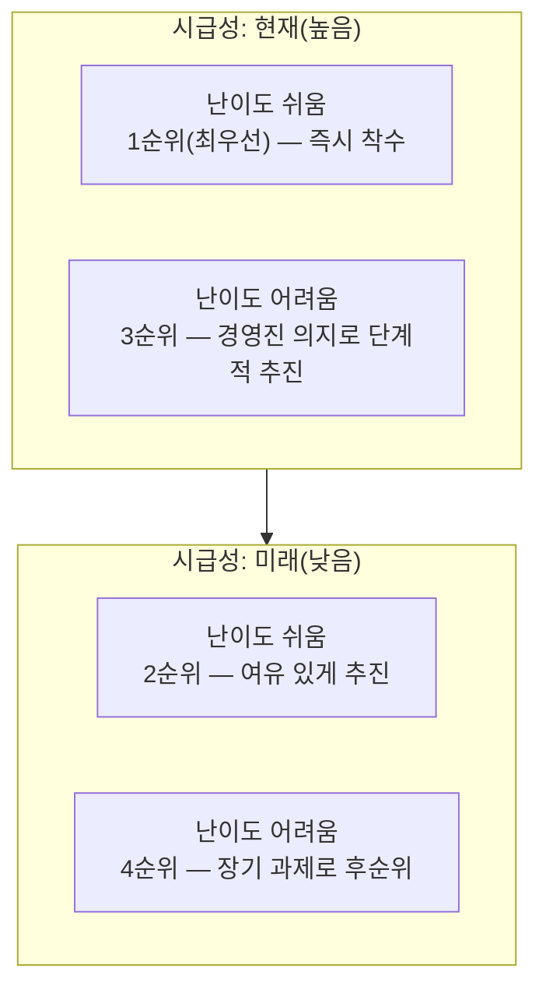

<Callout type="info">
  **이번 문서의 목표:** 여러 개의 분석 과제가 발굴됐을 때 마스터플랜을 어떻게 수립하는지, 우선순위를 정하는 기준(시급성·난이도, ROI 관점의 3V와 Value)이 무엇인지, 포트폴리오 사분면에서 어느 과제부터 착수해야 하는지, 조직의 분석 준비도·성숙도에 따라 어떤 유형으로 나뉘는지 설명할 수 있다.
</Callout>

## 마스터플랜이 필요한 이유

### 왜 필요한가

08편에서 하향식·상향식 접근법으로 분석 과제를 발굴하는 방법을 배웠다. 그런데 실제 기업에서는 이런 방식으로 과제를 찾다 보면 열 개, 스무 개의 후보 과제가 한꺼번에 쏟아지는 경우가 흔하다. 문제는 **자원(인력·예산·시간)은 항상 한정되어 있다**는 것이다. 46회 기출에서 나온 것처럼, "효율적 분석을 위해 여러 개의 분석을 동시에 수행해야 한다"는 생각은 오히려 오답이다. 한정된 자원을 여러 과제에 흩뿌리면 어느 과제도 제대로 끝내지 못하고 흐지부지되기 쉽다.

이 문제를 해결하려면 발굴된 과제들을 한 번에 실행하는 대신, **어떤 순서로 실행할지**를 미리 계획해야 한다. 이렇게 여러 분석 과제의 우선순위를 매기고 단계적인 실행 계획을 수립한 것을 **분석 마스터플랜**(analytics master plan)이라 부른다.

> **쉽게 말하면:** 마스터플랜은 "해야 할 분석 과제 목록"에 번호를 매겨 "1번부터 차례로 하겠다"고 정리한 실행 계획표다.

## 마스터플랜 수립 절차

### 정의

마스터플랜은 다음과 같은 절차로 수립한다.

<Steps>
1. **분석 과제 도출**: 08편의 하향식·상향식 접근법으로 실행 가능한 분석 과제 후보들을 모두 나열한다.
2. **우선순위 평가**: 각 과제를 시급성과 난이도라는 기준(아래에서 자세히 다룬다)으로 평가해 순위를 매긴다.
3. **로드맵 수립**: 우선순위에 따라 어떤 과제를 언제, 어떤 순서로 수행할지 시간 축 위에 배치한 실행 계획, 즉 **로드맵**(roadmap)을 그린다.
4. **단계적 실행**: 수립된 로드맵에 따라 과제를 순차적으로 실행하며, 각 단계의 결과를 다음 단계 계획에 반영한다.
</Steps>

이 중 가장 많이 출제되는 부분이 2단계인 **우선순위 평가**다. "무엇을 기준으로 순서를 정하는가"가 이 편의 핵심이다.

## 우선순위 평가 기준: 시급성과 난이도

### 정의

과제 우선순위는 크게 두 축으로 평가한다.

- **시급성**(urgency): 이 과제를 지금 당장 해야 하는 절박함의 정도다. **전략적 중요도**(기업의 핵심 목표나 KPI와 얼마나 직결되는가)와 **비즈니스 성과 및 ROI**(투자 대비 효과가 얼마나 빠르고 크게 나타나는가)를 함께 고려해 판단한다. 45회 기출에서 "본원적 업무와의 직접적 연관성, 이슈 미해결 시 발생할 위험이나 손실"을 묻는 문항의 정답이 **전략적 필요성**이었던 것처럼, 시급성은 "지금 풀지 않으면 손해가 큰가"를 따지는 기준이다.
- **난이도**(feasibility, 실행 용이성으로도 표현): 이 과제를 실제로 수행할 수 있는 여건이 얼마나 갖춰졌는가를 뜻한다. 데이터 확보 가능성, 필요한 분석 기술의 보유 여부, 필요한 인력의 확보 여부 등 **비용 측면과 구현 가능성**을 함께 고려한다. 난이도가 낮다는 것은 "지금 바로 손댈 수 있을 만큼 쉽다"는 뜻이다.

<Callout type="warning">
  **자주 틀리는 함정 (46회 기출)**: "시급성은 전략적 중요도와 데이터 분석 비용에 의해 결정된다"는 보기가 오답으로 나온다. **비용은 시급성이 아니라 난이도를 판단하는 요소**다. 시급성은 어디까지나 "얼마나 급한가(전략적 중요도·ROI)"를, 난이도는 "얼마나 쉬운가(비용·기술적 구현 가능성)"를 묻는다는 점을 혼동하면 안 된다.
</Callout>

### ROI 관점의 3V와 Value

우선순위를 ROI(Return On Investment, 투자 대비 회수 비율) 관점에서 더 구체적으로 뜯어보면, 투입(비용)과 산출(효과)로 나눠 생각할 수 있다. 04편에서 배운 빅데이터의 3V(Volume·Velocity·Variety)를 떠올려 보자. 여기서는 이 3V가 **투자비용을 늘리는 요소**로 다시 등장한다.

| 요소 | 영문 | ROI 관점의 역할 | 늘어나면 생기는 일 |
|---|---|---|---|
| 규모 | Volume | 투자비용 요소 | 데이터의 양이 많을수록 저장·처리에 드는 비용이 커진다 |
| 속도 | Velocity | 투자비용 요소 | 실시간에 가깝게 처리해야 할수록 시스템 구축 비용이 커진다 |
| 다양성 | Variety | 투자비용 요소 | 다루는 데이터 형태(정형·비정형 등)가 다양할수록 처리 비용이 커진다 |
| 가치 | Value | 비즈니스 효과 요소 | 분석 결과가 만들어내는 비즈니스 성과이며, ROI 계산에서 **분자**(투자로 얻는 회수 효과)에 해당한다 |

즉 3V(Volume·Variety·Velocity)는 ROI 계산식에서 **분모에 해당하는 투자비용**을 키우는 요소들이고, 네 번째 V인 **Value**는 그 투자로부터 얻는 **비즈니스 효과**, 즉 분자에 해당한다. 우선순위를 정할 때는 "3V가 크다(비용이 크다) = 난이도가 높다"와 "Value가 크다(효과가 크다) = 시급성이 높다"는 대응 관계로 이해하면 두 기준(시급성·난이도)과 ROI의 4V가 자연스럽게 연결된다.

> **쉽게 말하면:** 3V(규모·속도·다양성)는 "돈이 얼마나 드는가"를 키우는 비용 요인이고, Value는 "그래서 얼마나 남는가"를 나타내는 효과 요인이다.

## 포트폴리오 사분면: 난이도와 시급성으로 순서 정하기

### 왜 필요한가

시급성과 난이도라는 두 기준을 각각 "높다·낮다"로 나누면 네 가지 조합이 생긴다. 이 네 조합을 가로·세로 두 축의 표(매트릭스)로 그려 어떤 과제를 먼저 실행할지 시각적으로 판단하는 도구가 **포트폴리오 사분면**(우선순위 매트릭스)이다.

### 정의

포트폴리오 사분면은 가로축을 **난이도**(쉬움 ↔ 어려움), 세로축을 **시급성**(현재 ↔ 미래)으로 놓고 네 칸으로 나눈다.

네 칸이 뜻하는 바와 착수 순서는 다음과 같다.

| 난이도 | 시급성 | 해당 과제의 성격 | 착수 판단 |
|---|---|---|---|
| 쉬움 | 현재 | 지금 당장 필요하고 실행도 쉬운 과제 | **가장 먼저 착수한다(최우선, 이른바 Quick Win 과제)** |
| 쉬움 | 미래 | 나중에 필요해질 것이지만 실행은 쉬운 과제 | 여유를 두고 추진할 수 있다 |
| 어려움 | 현재 | 지금 당장 필요하지만 실행이 어려운 과제 | 경영진의 의지를 담아 단계적으로 자원을 투입해 추진한다 |
| 어려움 | 미래 | 나중에 필요해질 것이면서 실행도 어려운 과제 | 장기적 관점에서 미리 대비하되 우선순위는 가장 낮다 |

<Callout type="warning">
  **자주 틀리는 함정 (44·46회 기출)**: "분석 마스터플랜 수립 시 최우선 순위로 고려할 과제 유형은?"이라는 문항에서 정답은 언제나 "**난이도는 낮고 시급성은 현재(높음)인 과제**"다. "난이도가 높고 시급성이 미래인 과제"를 최우선으로 고르는 함정, 혹은 난이도와 시급성 중 하나만 좋고 다른 하나는 나쁜 과제(예: 난이도는 낮지만 시급성은 미래)를 최우선으로 잘못 고르는 함정에 주의해야 한다. **두 조건(쉬움 + 현재)을 모두 만족하는 칸이 최우선**이라는 점을 정확히 기억한다. 다만 실제 시험에서는 회차에 따라 우선순위를 판단하는 기준(시급성을 먼저 볼지, 난이도를 먼저 볼지)에 따라 그다음 순위가 달라질 수 있다고 서술되므로, "최우선 칸이 어디인가"를 확실히 잡아두고 나머지 순서는 문제의 조건문을 그대로 따라가며 푸는 것이 안전하다.
</Callout>

## 분석 준비도와 성숙도

### 왜 필요한가

포트폴리오 사분면이 "개별 과제"의 우선순위를 정하는 도구였다면, 조직 전체가 "분석을 도입할 준비가 얼마나 되어 있는가"를 진단하는 것도 마스터플랜 수립의 중요한 과정이다. 이를 위해 **분석 준비도**와 **분석 성숙도**라는 두 지표를 함께 사용한다.

### 정의

- **분석 준비도**(analytics readiness): 조직이 데이터분석을 받아들일 **여건**이 얼마나 갖춰졌는지를 진단한다. 진단 영역은 분석 업무 파악, 인력 및 조직, 분석 기법, 분석 데이터, 분석 문화, IT 인프라의 6가지다. 45·46회 기출에서 공통으로 확인되듯, **분석 비용이나 기업의 재무 상태는 준비도 진단 항목에 포함되지 않는다**는 점이 반복 출제된다.
- **분석 성숙도**(analytics maturity): 조직이 데이터분석을 **실제로 얼마나 능숙하게 수행하고 있는지**를 진단한다. 흔히 CMMI(Capability Maturity Model Integration, 소프트웨어 공학에서 온 성숙도 평가 모델) 방식을 응용해 단계를 나눈다.

이 둘은 서로 다른 축이기 때문에, "여건은 갖췄지만 아직 잘 못 하는 조직"이나 "여건은 부족해도 이미 일부 영역에서 능숙한 조직"처럼 다양한 조합이 나올 수 있다. 준비도와 성숙도를 각각 높음·낮음 두 단계로 나누면 다음 네 가지 유형이 만들어진다.

| 유형 | 준비도 | 성숙도 | 의미 |
|---|---|---|---|
| 도입형 | 높음 | 낮음 | 조직·인력·인프라 등 여건은 갖췄지만, 아직 분석 업무나 기법 활용 수준은 낮아 이제 막 시작하는 단계 |
| 준비형 | 낮음 | 낮음 | 여건도, 실제 활용 수준도 모두 낮아 기초부터 준비해야 하는 단계 |
| 정착형 | 낮음 | 높음 | 여건은 다소 부족하지만, 이미 일정 수준의 분석 업무·기법을 실제로 운용하고 있는 단계 |
| 확산형 | 높음 | 높음 | 여건과 실제 활용 수준이 모두 높아 전사적으로 분석을 폭넓게 활용하는 단계 |

<Callout type="warning">
  **자주 틀리는 함정 (44·45회 기출)**: "분석 업무와 분석 기법은 부족하지만 조직 및 인력 등 준비도가 높아 데이터분석을 바로 시행할 수 있는 기업"을 묻는 문항의 정답은 **도입형**이다. "경영진 주도로 분석을 전략적으로 활용한다"거나 "성과를 실시간으로 분석한다"처럼 높은 수준의 활용을 묘사하는 보기는 도입형이 아니라 확산형·최적화 단계에 가까운 설명이므로, **준비도(여건)와 성숙도(실제 활용 수준)를 뒤섞지 않고 각각 따로 판단**해야 함정에 걸리지 않는다.
</Callout>

## 핵심 정리

- 마스터플랜은 여러 분석 과제 중 무엇을 먼저 할지 정하는 실행 계획으로, 과제 도출 → 우선순위 평가 → 로드맵 수립 → 단계적 실행 순서로 수립한다.
- 우선순위는 시급성(전략적 중요도·ROI)과 난이도(비용·구현 가능성) 두 기준으로 평가하며, 비용은 시급성이 아닌 난이도 요소다.
- ROI 관점에서 3V(Volume·Velocity·Variety)는 투자비용 요소이고, 네 번째 V인 Value는 비즈니스 효과(회수) 요소다.
- 포트폴리오 사분면에서 난이도가 쉽고 시급성이 현재인 과제가 최우선 착수 대상이다.
- 분석 준비도(여건)와 분석 성숙도(실제 활용 수준)의 조합으로 도입형·준비형·정착형·확산형 4가지 유형이 나뉜다.

## 마무리 복습

<Quiz
  questionNumber={1}
  question="분석 과제 우선순위를 평가할 때 시급성을 판단하는 핵심 기준으로 가장 적절한 것은?"
  options={['데이터 확보에 드는 비용', '전략적 중요도와 비즈니스 성과(ROI)', '분석 기술의 구현 난이도', '필요한 인력의 확보 여부']}
  correctAnswer={2}
  explanation="시급성은 전략적 중요도와 비즈니스 성과 및 ROI를 핵심 기준으로 판단한다."
  optionExplanations={['비용은 시급성이 아니라 난이도를 판단하는 요소다', '전략적 중요도와 ROI는 시급성 판단의 핵심 기준이므로 정답이다', '구현 난이도는 난이도를 판단하는 요소다', '인력 확보 여부는 난이도를 판단하는 요소다']}
/>

<Quiz
  questionNumber={2}
  question="ROI 관점에서 빅데이터의 3V(Volume, Velocity, Variety)와 Value의 관계를 옳게 설명한 것은?"
  options={['3V와 Value 모두 투자비용을 증가시키는 요소다', '3V는 투자비용 요소이고, Value는 그 투자로 얻는 비즈니스 효과 요소다', 'Value는 투자비용 요소이고, 3V는 비즈니스 효과 요소다', '3V와 Value는 모두 비즈니스 효과만을 나타내는 지표다']}
  correctAnswer={2}
  explanation="3V(규모·속도·다양성)는 데이터를 다루는 데 드는 투자비용을 늘리는 요소이며, Value는 그 투자로부터 얻는 비즈니스 효과를 나타내는 요소다."
  optionExplanations={['Value는 비용이 아니라 효과를 나타내는 요소다', '3V를 비용, Value를 효과로 대응시킨 정확한 설명이므로 정답이다', '3V와 Value의 역할이 반대로 서술되어 있다', '3V는 효과가 아니라 비용 요소다']}
/>

<Quiz
  questionNumber={3}
  question="난이도-시급성 포트폴리오 사분면에서 가장 먼저 착수해야 할 과제 유형은?"
  options={['난이도가 높고 시급성이 미래인 과제', '난이도가 낮고 시급성이 현재인 과제', '난이도가 높고 시급성이 현재인 과제', '난이도가 낮고 시급성이 미래인 과제']}
  correctAnswer={2}
  explanation="난이도가 낮고(쉽고) 시급성이 현재(높음)인 과제가 실행도 쉽고 지금 당장 필요하므로 가장 먼저 착수해야 한다."
  optionExplanations={['난이도도 높고 시급성도 낮아 가장 나중에 고려할 과제다', '두 조건을 모두 만족하는 최우선 착수 과제이므로 정답이다', '시급하지만 실행이 어려워 단계적으로 자원을 투입해야 하는 과제다', '실행은 쉽지만 당장 급하지 않아 여유 있게 추진할 수 있는 과제다']}
/>

<Quiz
  questionNumber={4}
  question="분석 준비도(readiness) 진단 영역에 해당하지 않는 것은?"
  options={['분석 업무 파악', '분석 인력 및 조직', '기업의 재무 상태', '분석 데이터']}
  correctAnswer={3}
  explanation="기업의 재무 상태는 분석 준비도 진단 영역에 포함되지 않는다. 분석 준비도는 분석 업무, 인력 및 조직, 분석 기법, 분석 데이터, 분석 문화, IT 인프라의 6가지 영역으로 진단한다."
  optionExplanations={['분석 준비도 진단 영역에 해당한다', '분석 준비도 진단 영역에 해당한다', '재무 상태는 준비도 진단 영역이 아니므로 정답이다', '분석 준비도 진단 영역에 해당한다']}
/>

<Quiz
  questionNumber={5}
  question="분석 업무와 분석 기법은 아직 부족하지만, 조직 및 인력 등 준비도가 높아 데이터분석을 바로 시행할 수 있는 기업의 분석 수준 유형은?"
  options={['준비형', '도입형', '정착형', '확산형']}
  correctAnswer={2}
  explanation="준비도는 높지만 성숙도(분석 업무·기법 활용 수준)는 낮은 조합은 도입형에 해당한다."
  optionExplanations={['준비형은 준비도와 성숙도가 모두 낮은 유형이다', '준비도는 높고 성숙도는 낮은 조합이 도입형이므로 정답이다', '정착형은 준비도는 낮지만 성숙도가 높은 유형이다', '확산형은 준비도와 성숙도가 모두 높은 유형이다']}
/>

<Quiz
  questionNumber={6}
  question="분석 준비도는 낮지만 이미 일정 수준의 분석 업무와 기법을 실제로 운용하고 있는 조직의 유형은?"
  options={['도입형', '준비형', '정착형', '확산형']}
  correctAnswer={3}
  explanation="준비도는 낮지만 성숙도(실제 활용 수준)는 높은 조합은 정착형에 해당한다."
  optionExplanations={['도입형은 준비도는 높고 성숙도는 낮은 유형이다', '준비형은 준비도와 성숙도가 모두 낮은 유형이다', '준비도는 낮고 성숙도는 높은 조합이 정착형이므로 정답이다', '확산형은 준비도와 성숙도가 모두 높은 유형이다']}
/>

<Quiz
  questionNumber={7}
  question="분석 마스터플랜 수립 절차의 순서로 가장 적절한 것은?"
  options={['우선순위 평가 → 분석 과제 도출 → 로드맵 수립 → 단계적 실행', '분석 과제 도출 → 우선순위 평가 → 로드맵 수립 → 단계적 실행', '로드맵 수립 → 우선순위 평가 → 분석 과제 도출 → 단계적 실행', '단계적 실행 → 분석 과제 도출 → 우선순위 평가 → 로드맵 수립']}
  correctAnswer={2}
  explanation="마스터플랜은 분석 과제 도출 → 우선순위 평가 → 로드맵 수립 → 단계적 실행 순서로 진행한다."
  optionExplanations={['과제 도출이 우선순위 평가보다 먼저 이루어져야 한다', '마스터플랜 수립의 정확한 절차 순서이므로 정답이다', '과제 도출과 우선순위 평가가 로드맵 수립보다 먼저 이루어져야 한다', '단계적 실행은 로드맵이 수립된 이후 마지막에 이루어진다']}
/>

## 참고 자료

- [데이터자격시험 - ADsP 출제기준](https://www.dataq.or.kr/www/sub/a_06.do)
