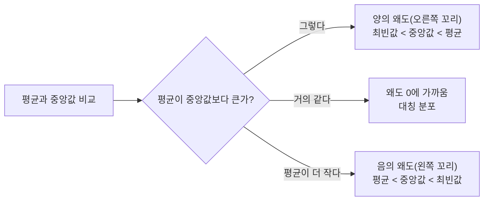

<Callout type="info">
  **이번 문서의 목표:** 평균·중앙값·최빈값, 분산·표준편차·사분위수를 실제 숫자로 계산하고, 왜도로 분포의 치우침을, 4가지 척도(명목·서열·구간·비율)로 변수의 성질을 구분해 설명할 수 있다.
</Callout>

## 기술통계란 무엇인가

### 왜 필요한가

12편까지는 R로 데이터를 불러오고(`data.frame`) 필요한 부분만 골라내는 방법(`dplyr`)을 배웠다. 그런데 학생 100명의 시험 점수를 R 콘솔에 그대로 출력하면 숫자 100개가 쭉 나열될 뿐, "우리 반 성적이 대체로 어떤지"는 한눈에 들어오지 않는다. 이럴 때 100개의 숫자를 "평균 72점, 표준편차 8점" 같은 몇 개의 대표값으로 요약하면, 데이터 전체의 특징을 순식간에 파악할 수 있다. 이렇게 데이터를 몇 개의 숫자나 표·그래프로 요약해 그 특징을 설명하는 통계 기법을 **기술통계**(descriptive statistics)라 한다.

> **쉽게 말하면:** 기술통계는 데이터 뭉치를 "평균이 얼마고, 얼마나 흩어져 있는지" 몇 개의 숫자로 요약하는 것이다.

기술통계는 크게 두 갈래로 나뉜다. 데이터가 어디에 몰려 있는지를 보여주는 **중심경향**(central tendency, 평균·중앙값·최빈값)과, 데이터가 그 중심에서 얼마나 흩어져 있는지를 보여주는 **산포도**(dispersion, 분산·표준편차·사분위수)다. 이 두 갈래를 이해하면 16편의 가설검정, 17~18편의 상관·회귀분석에서 쓰이는 모든 통계량의 기초가 자연히 세워진다.

## 중심경향: 평균·중앙값·최빈값

### 왜 필요한가

"우리 팀 평균 연봉이 5,000만원이다"라는 말은 팀원들의 연봉을 하나의 숫자로 대표하는 것이다. 그런데 대표하는 방법에는 여러 가지가 있다. 다 더해서 인원수로 나눌 수도 있고(평균), 줄을 세워 한가운데 있는 사람의 값을 쓸 수도 있고(중앙값), 가장 많은 사람이 받는 연봉을 쓸 수도 있다(최빈값). 어떤 대표값을 쓰느냐에 따라 데이터에 대한 인상이 크게 달라질 수 있어서, 세 가지를 모두 알고 상황에 맞게 골라 써야 한다.

> **쉽게 말하면:** 평균은 "다 합쳐서 고르게 나눈 값", 중앙값은 "줄 세웠을 때 정가운데 값", 최빈값은 "가장 자주 나오는 값"이다.

### 정의

**평균**(mean, 산술평균 arithmetic mean)은 모든 관측값을 더한 뒤 개수로 나눈 값이다. 모집단(population, 관심 대상 전체 집합)의 평균은 $\mu$(뮤, mu)로, 표본(sample, 모집단에서 실제로 뽑아낸 일부)의 평균은 $\bar{x}$(엑스바, x-bar)로 표기한다.

$$
\bar{x} = \frac{\sum_{i=1}^{n} x_i}{n}
$$

- $\bar{x}$: 표본평균
- $\sum$ (시그마, sigma): "모두 더하라"는 뜻의 기호. $\sum_{i=1}^{n} x_i$는 $x_1$부터 $x_n$까지 전부 더하라는 의미다.
- $x_i$: $i$번째 관측값
- $n$: 표본의 크기(관측값 개수)

**중앙값**(median)은 관측값을 크기순으로 정렬했을 때 정확히 가운데에 위치하는 값이다. 관측값 개수 $n$이 홀수면 가운데 값 하나가 중앙값이고, 짝수면 가운데 두 값의 평균이 중앙값이다.

**최빈값**(mode)은 데이터에서 가장 빈번하게 나타나는 값이다. 값이 하나면 단봉(unimodal), 두 개면 쌍봉(bimodal)이라 부른다. 최빈값은 세 대표값 중 유일하게 숫자가 아닌 범주형 데이터(예: 가장 많이 팔린 아이스크림 맛)에도 쓸 수 있다.

### 작은 예시와 계산

어느 편의점의 최근 9일간 일일 방문객 수(명)를 조사했다.

$$
12, 15, 15, 18, 20, 22, 25, 30, 95
$$

평균을 계산하면 다음과 같다.

$$
\bar{x} = \frac{12+15+15+18+20+22+25+30+95}{9} = \frac{252}{9} = 28
$$

정렬된 9개 값 중 다섯 번째($n=9$가 홀수이므로 $(9+1)/2 = 5$번째)가 중앙값이다.

$$
\text{중앙값} = 20 \; (\text{5번째 값})
$$

가장 자주 나타난 값은 15(두 번 등장)이므로 최빈값은 15다.

### 결과 해석: 왜 평균과 중앙값이 다른가

평균(28)이 중앙값(20)보다 훨씬 크다. 이유는 마지막 값 95 때문이다. 하루 방문객이 갑자기 95명으로 튄 이상치(outlier, 다른 값들과 동떨어진 극단값)가 평균을 크게 끌어올렸다. 반면 중앙값은 "가운데 순서"만 보므로 95가 96이든 950이든 영향을 받지 않는다. 이래서 소득·집값·방문객 수처럼 극단값이 섞이기 쉬운 데이터를 요약할 때는 평균보다 중앙값이 더 안정적인 대표값으로 쓰인다. 뉴스에서 "평균 소득"보다 "중위 소득"을 함께 보도하는 이유도 여기에 있다.

### 자주 틀리는 점

기출 자료를 확인한 결과 "평균이 중앙값보다 항상 크다" 또는 "상자그림(box plot)에 평균이 표시된다"는 식의 오답이 자주 등장한다. 평균과 중앙값의 대소 관계는 **분포의 모양(왜도)에 따라 달라지며 항상 성립하는 규칙이 아니다.** 또한 상자그림은 최소값·Q1·중앙값·Q3·최대값의 5가지 수치(5수치 요약)로 그리므로 평균은 원칙적으로 표시되지 않는다.

## 산포도: 분산·표준편차·사분위수

### 왜 필요한가

평균이 같은 두 반이 있다고 하자. A반은 모든 학생이 70점 근처에 몰려 있고, B반은 20점과 120점(가상의 상황)처럼 극단적으로 갈렸다. 두 반의 평균은 같아도 "성적이 고른 정도"는 완전히 다르다. 중심경향만으로는 이 차이를 설명할 수 없다. 데이터가 중심에서 얼마나 멀리, 얼마나 넓게 흩어져 있는지를 나타내는 지표가 **산포도**(dispersion, 흩어짐의 정도)다.

> **쉽게 말하면:** 산포도는 "데이터가 평균 근처에 옹기종기 모여 있는지, 아니면 넓게 퍼져 있는지"를 숫자로 나타낸 것이다.

### 정의: 분산과 표준편차

**분산**(variance)은 각 관측값이 평균에서 떨어진 거리(편차, deviation)를 제곱해서 평균 낸 값이다. 편차를 그냥 더하면 양수와 음수가 서로 상쇄되어 항상 0이 되므로, 제곱해서 부호를 없앤 뒤 평균을 낸다.

모분산(population variance, 모집단 전체를 대상으로 계산한 분산)은 다음과 같이 정의한다.

$$
\sigma^2 = \frac{\sum_{i=1}^{n} (x_i - \mu)^2}{n}
$$

- $\sigma^2$ (시그마 제곱): 모분산
- $x_i - \mu$: 각 관측값과 모평균의 차이(편차)
- $n$: 모집단 크기

표본분산(sample variance, 표본으로 모분산을 추정할 때 쓰는 분산)은 분모를 $n$이 아니라 $n-1$로 나눈다.

$$
s^2 = \frac{\sum_{i=1}^{n} (x_i - \bar{x})^2}{n-1}
$$

- $s^2$: 표본분산
- $n-1$: 자유도(degree of freedom, 자유롭게 값을 정할 수 있는 개수). 표본평균 $\bar{x}$를 이미 계산에 썼기 때문에 편차 $n$개 중 마지막 하나는 나머지에 의해 자동으로 결정되어 자유롭지 않다. 그래서 하나를 뺀 $n-1$로 나눠야 표본분산이 모분산을 편향 없이(치우치지 않게) 추정한다. 만약 $n$으로 나누면 표본분산이 평균적으로 모분산보다 작게 나오는 편향이 생긴다.

분산은 제곱한 값이라 원래 데이터의 단위와 달라진다(예: cm로 잰 키의 분산은 $\text{cm}^2$ 단위가 된다). 그래서 분산에 제곱근을 씌워 원래 단위로 되돌린 것이 **표준편차**(standard deviation)다.

$$
s = \sqrt{s^2}
$$

- $s$: 표본표준편차. 모표준편차는 $\sigma = \sqrt{\sigma^2}$로 표기한다.

### 계산 예제: 8개 데이터로 모분산·표본분산 직접 구하기

어느 카페의 최근 8일간 일일 판매 케이크 개수(개)는 다음과 같다.

$$
10, 12, 14, 14, 16, 18, 20, 24
$$

**1단계: 평균 계산**

$$
\bar{x} = \frac{10+12+14+14+16+18+20+24}{8} = \frac{128}{8} = 16
$$

**2단계: 각 값의 편차와 편차 제곱**

| 관측값 $x_i$ | 편차 $x_i-\bar{x}$ | 편차 제곱 $(x_i-\bar{x})^2$ |
|---|---|---|
| 10 | −6 | 36 |
| 12 | −4 | 16 |
| 14 | −2 | 4 |
| 14 | −2 | 4 |
| 16 | 0 | 0 |
| 18 | 2 | 4 |
| 20 | 4 | 16 |
| 24 | 8 | 64 |

편차 제곱의 합은 $36+16+4+4+0+4+16+64 = 144$다.

**3단계: 모분산(이 8일이 관심 대상 전체라고 볼 때, $n$으로 나눔)**

$$
\sigma^2 = \frac{144}{8} = 18
$$

**4단계: 표본분산(이 8일이 더 큰 기간을 대표하는 표본이라고 볼 때, $n-1$로 나눔)**

$$
s^2 = \frac{144}{8-1} = \frac{144}{7} \approx 20.57
$$

**5단계: 표준편차**

$$
\sigma = \sqrt{18} \approx 4.24
$$

$$
s = \sqrt{20.57} \approx 4.54
$$

**검산**: 표본분산은 항상 모분산보다 크거나 같다(분모가 더 작은 수로 나누기 때문). $20.57 > 18$이므로 계산 방향이 맞다. 또한 편차의 합은 항상 0이어야 하므로 확인하면 $(-6)+(-4)+(-2)+(-2)+0+2+4+8 = 0$으로 정상이다.

### 결과 해석

표준편차가 약 4.24~4.54개라는 것은, 케이크 판매량이 평균 16개를 중심으로 대략 하루에 4~5개 정도씩 오르내린다는 뜻이다. 만약 다른 카페의 표준편차가 1개라면, 그 카페는 판매량이 훨씬 일정하게 유지된다는 의미로 해석할 수 있다.

### 정의: 사분위수와 IQR

**사분위수**(quartile)는 정렬된 데이터를 4등분하는 경계값이다. 제1사분위수 $Q_1$은 하위 25%, 제2사분위수 $Q_2$는 50%(중앙값과 같음), 제3사분위수 $Q_3$는 하위 75% 지점의 값이다. $Q_3$에서 $Q_1$을 뺀 값을 **사분위범위**(interquartile range, IQR)라 하며, 중앙값 주변 데이터가 얼마나 퍼져 있는지를 나타낸다.

$$
\text{IQR} = Q_3 - Q_1
$$

앞의 8개 케이크 판매량 데이터로 사분위수를 구해 보자. 정렬된 데이터는 $10, 12, 14, 14, 16, 18, 20, 24$이며, 하위 절반 $10, 12, 14, 14$의 중앙값이 $Q_1 = (12+14)/2 = 13$, 상위 절반 $16, 18, 20, 24$의 중앙값이 $Q_3 = (18+20)/2 = 19$다.

$$
\text{IQR} = 19 - 13 = 6
$$

IQR은 이상치의 영향을 적게 받으므로, 상자그림에서 "정상 범위"를 정하는 기준으로도 쓰인다(보통 $Q_1 - 1.5 \times \text{IQR}$ 미만이거나 $Q_3 + 1.5 \times \text{IQR}$을 초과하면 이상치로 간주한다).

### 자주 틀리는 점

기출 자료를 보면 "IQR = $Q_3 - Q_1$"이라는 공식 자체를 묻기보다, 그래프나 표에 제시된 $Q_1$·$Q_3$ 값을 그대로 대입해 계산하는 문항이 반복해서 나온다. 뺄셈 순서(반드시 $Q_3$에서 $Q_1$을 빼는 순서)와 두 값을 바꿔 넣지 않는지 항상 확인해야 한다.

## 왜도와 첨도: 분포의 모양 읽기

### 왜 필요한가

평균과 표준편차만으로는 분포의 "생김새"까지는 알 수 없다. 평균과 표준편차가 똑같은 두 데이터라도, 한쪽은 좌우가 대칭이고 다른 한쪽은 한쪽으로 심하게 치우쳐 있을 수 있다. 이 치우침과 뾰족한 정도를 숫자로 나타내는 것이 왜도와 첨도다.

> **쉽게 말하면:** 왜도는 "분포가 어느 쪽으로 기울었는가", 첨도는 "분포 가운데가 얼마나 뾰족한가"를 나타낸다.

### 정의: 왜도

**왜도**(skewness)는 분포의 비대칭 정도를 나타내는 지표다.

- **왜도 = 0**: 좌우 대칭 분포(정규분포가 대표적).
- **양의 왜도**(positive skewness, 오른쪽 꼬리가 긴 분포): 대부분의 값은 낮은 쪽에 몰려 있고, 소수의 매우 큰 값이 오른쪽으로 긴 꼬리를 만든다. 이때 대소 관계는 **최빈값 < 중앙값 < 평균** 순서다. 극단적으로 큰 값 몇 개가 평균을 오른쪽으로 끌어당기기 때문이다. 소득 분포(대부분은 평범한 소득이지만 극소수 고소득자가 있는 경우)가 대표적인 예다.
- **음의 왜도**(negative skewness, 왼쪽 꼬리가 긴 분포): 대부분의 값은 높은 쪽에 몰려 있고, 소수의 매우 작은 값이 왼쪽으로 긴 꼬리를 만든다. 대소 관계는 **평균 < 중앙값 < 최빈값** 순서다. 예를 들어 어려운 시험에서 대부분 고득점인데 소수만 매우 낮은 점수를 받는 경우다.

### 정의: 첨도

**첨도**(kurtosis)는 분포가 얼마나 뾰족하고 꼬리가 두꺼운지를 나타내는 지표다. 통계에서는 흔히 정규분포의 첨도를 0으로 맞춘 **초과 첨도**(excess kurtosis)를 사용한다.

- **첨도 = 0**: 정규분포와 비슷한 뾰족함.
- **첨도 > 0**: 정규분포보다 중심이 더 뾰족하고 꼬리가 두꺼워, 평균 근처와 극단값 양쪽 모두에 관측치가 더 많이 몰린다.
- **첨도 < 0**: 정규분포보다 완만하고 납작하며, 극단값이 상대적으로 적다.

### 자주 틀리는 점

기출 자료를 확인해 보면 "평균이 중앙값보다 크면 오른쪽 꼬리가 긴 양의 왜도로 해석할 수 있다"처럼 왜도와 평균·중앙값의 대소 관계를 직접 잇는 문항이 여러 회차에 걸쳐 나온다. 이때 유의할 점은 이 관계가 "항상 수학적으로 100% 성립하는 법칙"이 아니라 "일반적인 경향"이라는 것이다(극히 드물게 예외가 있을 수 있다). 그러나 시험에서는 이 일반적 경향을 정답 판단 기준으로 요구하므로, **오른쪽 꼬리 = 양의 왜도 = 평균이 가장 큼**, **왼쪽 꼬리 = 음의 왜도 = 평균이 가장 작음**이라는 방향을 확실히 외워 둬야 한다.

## 척도: 데이터의 성질 구분하기

### 왜 필요한가

"성별(남/여)"과 "온도(섭씨)"는 둘 다 숫자나 범주로 표현할 수 있지만, 이 둘에 허용되는 연산은 완전히 다르다. 성별에는 평균을 구하는 것이 의미가 없지만, 온도에는 평균이 의미가 있다. 이렇게 변수마다 "어떤 연산이 허용되는가"가 다르기 때문에, 분석 기법을 고르기 전에 먼저 변수가 어떤 **척도**(scale)인지 구분해야 한다. 척도를 잘못 판단하면 엉뚱한 통계 기법(예: 순서 없는 범주에 평균을 계산)을 적용하는 실수를 하게 된다.

> **쉽게 말하면:** 척도는 "이 데이터에 어떤 계산을 해도 되는가"를 정하는 규칙이다.

### 정의: 4가지 척도

| 척도 | 영문 | 의미 | 가능한 연산 | 예시 |
|---|---|---|---|---|
| 명목척도 | nominal scale | 순서 없이 이름·범주로만 구분 | 분류·빈도 계산(같다/다르다만 판단) | 성별, 혈액형, 고향(수도권/비수도권) |
| 서열척도 | ordinal scale | 순서는 있지만 간격이 일정하지 않음 | 명목척도 연산 + 순서 비교(크다/작다) | 학점(A·B·C), 만족도(상·중·하), 순위 |
| 구간척도 | interval scale | 순서와 간격이 일정하지만 절대영점 없음 | 서열척도 연산 + 덧셈·뺄셈(차이 계산) | 섭씨 온도, 지능지수(IQ), 서기 연도 |
| 비율척도 | ratio scale | 순서·간격이 일정하고 절대영점이 존재 | 구간척도 연산 + 곱셈·나눗셈(비율 계산) | 몸무게, 키, 나이, 매출액, 절대온도(켈빈) |

### 구간척도와 비율척도, 핵심 차이는 절대영점

네 척도 중 가장 헷갈리는 것이 구간척도와 비율척도의 구분이다. 둘 다 "간격이 일정"하다는 공통점이 있어서 겉보기에는 비슷해 보이지만, 결정적인 차이는 **절대영점**(absolute zero, 정말로 "아무것도 없음"을 의미하는 원점)의 유무다.

섭씨 0도는 "온도가 아예 없다"는 뜻이 아니라 물이 어는 지점을 임의로 0으로 정한 것뿐이다. 그래서 섭씨 20도가 섭씨 10도보다 "2배 더 덥다"고 말할 수 없다(실제로 배율로 비교하면 성립하지 않는다). 반면 몸무게 0kg은 "정말로 무게가 없음"을 의미하는 진짜 원점이다. 그래서 몸무게 60kg은 30kg의 정확히 2배라고 말할 수 있다. 이처럼 **곱셈·나눗셈(배수 비교)이 의미를 가지려면 절대영점이 있어야 하고**, 절대영점이 없으면 덧셈·뺄셈(차이 비교)까지만 의미를 가진다.

### 작은 예시

- 시험 점수 0점: "그 과목에 대한 지식이 0이다"라는 절대적 의미가 아니라 채점 기준상 0점일 뿐이라고 보면 구간척도, 문항 배점의 합산으로서 "정말 아무것도 못 맞혔다"는 절대적 원점으로 본다면 비율척도로 볼 수도 있어 시험에 따라 해석이 갈릴 수 있다. 다만 ADsP 시험에서는 온도·연도처럼 명확한 예시로 구분을 묻는 경우가 대부분이다.
- 연도(서기 2024년): 서기 0년이 "시간이 아예 존재하지 않는 시점"이 아니라 기준점을 임의로 정한 것이므로 구간척도다.
- 매출액 0원: "정말로 매출이 하나도 없다"는 절대적 의미이므로 비율척도다.

### 자주 틀리는 점

기출 자료를 확인해 보면 "정수 0~5 중 하나를 선택하는 값"이나 "몸무게" 같은 구체적 사례를 주고 어떤 척도인지 묻거나, "연속형/이산형"이라는 다른 분류 기준과 섞어서 혼동을 유도하는 문항이 나온다. 여기서 중요한 것은 **명목·서열·구간·비율**(질적·양적 성질에 대한 척도 분류)과 **이산형·연속형**(값이 셀 수 있는지 여부에 대한 분류)은 서로 다른 기준이라는 점이다. 예를 들어 몸무게는 비율척도이면서 동시에 연속형 변수이고, 주사위 눈금은 비율척도(0이 진짜 없음을 의미)이면서 이산형 변수다. 두 분류 기준을 섞어 쓴 보기가 나오면, "지금 묻는 것이 성질(척도)인지 형태(이산·연속)인지"부터 구분해야 한다.

또한 스피어만 상관계수(Spearman correlation, 순위를 이용하는 상관분석 기법)처럼 순위 정보가 필요한 기법은 **서열척도 이상**(서열·구간·비율)에는 적용할 수 있지만, 순서가 아예 없는 명목척도에는 적용할 수 없다는 함정도 자주 출제된다.

## 핵심 정리

- 중심경향 3형제(평균·중앙값·최빈값) 중 이상치에 가장 흔들리지 않는 것은 중앙값이다.
- 모분산은 $n$으로, 표본분산은 자유도를 반영해 $n-1$로 나눈다. 표본분산이 항상 모분산보다 크거나 같다.
- 사분위범위(IQR)는 $Q_3 - Q_1$이며, 이상치 판단 기준(1.5×IQR 규칙)의 토대가 된다.
- 양의 왜도(오른쪽 꼬리)는 최빈값 < 중앙값 < 평균, 음의 왜도(왼쪽 꼬리)는 평균 < 중앙값 < 최빈값 순서다.
- 4가지 척도(명목·서열·구간·비율) 중 구간척도와 비율척도를 가르는 기준은 절대영점의 유무이며, 절대영점이 있어야 곱셈·나눗셈(배수 비교)이 의미를 가진다.

## 마무리 복습

<Quiz
  questionNumber={1}
  question="어느 부서 7명의 월급(단위: 백만원)이 300, 310, 320, 330, 340, 350, 900일 때, 이 자료를 요약하는 대표값에 대한 설명으로 가장 적절한 것은?"
  options={['평균이 중앙값보다 크게 나타나며, 이는 극단값 900의 영향이다', '중앙값이 평균보다 크게 나타나며, 이는 극단값 900의 영향이다', '평균과 중앙값은 항상 같은 값을 가진다', '최빈값이 존재하지 않으므로 이 자료는 요약할 수 없다']}
  correctAnswer={1}
  explanation="평균은 (300+310+320+330+340+350+900)/7 = 2850/7 ≈ 407.1이고, 정렬된 7개 값 중 4번째인 중앙값은 330이다. 900이라는 극단값이 평균만 크게 끌어올려 평균이 중앙값보다 크다."
  optionExplanations={['평균 약 407.1이 중앙값 330보다 크며 극단값 900 때문이라는 설명이 정확하다', '실제로는 평균이 중앙값보다 크므로 이 설명은 방향이 반대다', '이 자료에서는 평균 약 407.1과 중앙값 330이 서로 다르므로 틀렸다', '최빈값이 없어도 평균과 중앙값으로 자료를 요약할 수 있으므로 틀렸다']}
/>

<Quiz
  questionNumber={2}
  question="어느 공장에서 생산한 부품 6개(이 6개가 생산된 부품 전체 모집단이라고 가정)의 무게(g)가 8, 10, 10, 12, 14, 18일 때 모분산은?"
  options={['약 10.67', '약 12.80', '약 9.33', '약 11.00']}
  correctAnswer={1}
  explanation="평균은 (8+10+10+12+14+18)/6 = 72/6 = 12다. 편차 제곱은 16, 4, 4, 0, 4, 36이고 합은 64다. 모집단 전체이므로 n=6으로 나누면 64/6 ≈ 10.67이다."
  optionExplanations={['64/6 ≈ 10.67로 계산이 정확하다', '표본분산 방식으로 n-1=5로 나누면 64/5=12.80이 나오지만 이 문제는 모집단이므로 n으로 나눠야 한다', '편차 제곱합을 잘못 계산했을 때 나올 수 있는 값으로 정답이 아니다', '평균 계산을 다르게 했을 때 나올 수 있는 값으로 정답이 아니다']}
/>

<Quiz
  questionNumber={3}
  question="분포의 오른쪽 꼬리가 길게 늘어진 형태(양의 왜도)일 때, 중심경향 대표값들의 대소 관계로 옳은 것은?"
  options={['최빈값 < 중앙값 < 평균', '평균 < 중앙값 < 최빈값', '평균 = 중앙값 = 최빈값', '중앙값 < 최빈값 < 평균']}
  correctAnswer={1}
  explanation="오른쪽 꼬리가 긴 양의 왜도 분포는 소수의 큰 값이 평균을 오른쪽으로 끌어올려 평균이 가장 크고, 최빈값이 가장 작다. 따라서 최빈값이 가장 작고 중앙값이 중간, 평균이 가장 큰 순서다."
  optionExplanations={['오른쪽 꼬리가 긴 분포의 대소 관계와 정확히 일치한다', '이 순서는 왼쪽 꼬리가 긴 음의 왜도일 때의 관계다', '이 관계는 좌우 대칭인 분포(왜도 0)에서 성립하며 양의 왜도에서는 성립하지 않는다', '실제 양의 왜도 분포에서는 평균이 가장 크므로 이 순서는 틀렸다']}
/>

<Quiz
  questionNumber={4}
  question="변수의 척도 중 절대영점이 존재하여 곱셈·나눗셈(배수 비교)이 의미를 가지는 척도는?"
  options={['명목척도', '서열척도', '구간척도', '비율척도']}
  correctAnswer={4}
  explanation="비율척도는 절대영점(정말로 아무것도 없음을 의미하는 원점)이 존재해 두 값의 비율(배수)을 계산하는 것이 의미를 가진다. 몸무게 60kg은 30kg의 2배라고 말할 수 있는 것이 대표적인 예다."
  optionExplanations={['명목척도는 이름·범주 구분만 가능하고 배수 비교는 불가능하다', '서열척도는 순서 비교만 가능하고 배수 비교는 불가능하다', '구간척도는 절대영점이 없어 덧셈·뺄셈은 가능하지만 배수 비교는 의미가 없다', '절대영점이 있는 비율척도에서만 배수 비교가 의미를 가지므로 정답이다']}
/>

<Quiz
  questionNumber={5}
  question="섭씨 온도(구간척도)와 몸무게(비율척도)의 차이를 설명한 것으로 가장 적절한 것은?"
  options={['섭씨 온도는 절대영점이 있어 20도가 10도의 2배로 덥다고 말할 수 있다', '몸무게는 절대영점이 없어 60kg이 30kg의 2배라고 말할 수 없다', '섭씨 온도는 절대영점이 없어 20도가 10도의 2배로 덥다고 말할 수 없지만, 몸무게는 절대영점이 있어 60kg이 30kg의 2배라고 말할 수 있다', '두 변수 모두 절대영점이 없어 배수 비교가 불가능하다']}
  correctAnswer={3}
  explanation="섭씨 0도는 물이 어는 지점을 임의로 정한 것일 뿐 절대영점이 아니므로 배수 비교가 의미 없는 구간척도다. 몸무게 0kg은 정말로 무게가 없음을 뜻하는 절대영점이므로 비율척도이며 배수 비교가 가능하다."
  optionExplanations={['섭씨 온도는 절대영점이 없으므로 배수 비교가 불가능하다는 점이 반대로 서술됐다', '몸무게는 절대영점이 있는 비율척도이므로 배수 비교가 가능하다는 설명이 반대로 서술됐다', '두 변수의 절대영점 유무와 배수 비교 가능 여부를 정확히 구분한 설명이다', '섭씨 온도는 절대영점이 없지만 몸무게는 절대영점이 있으므로 이 설명은 틀렸다']}
/>

<Quiz
  questionNumber={6}
  question="어느 8개 매장의 일일 방문객 수 자료에서 Q1=40, Q3=68일 때 IQR과 그 의미로 옳은 것은?"
  options={['IQR = 28이며, 값이 클수록 중앙값 주변 데이터가 넓게 퍼져 있음을 뜻한다', 'IQR = 108이며, Q1과 Q3를 더한 값이다', 'IQR = 28이며, 항상 표준편차와 같은 값이다', 'IQR = 1.7이며, Q3를 Q1로 나눈 값이다']}
  correctAnswer={1}
  explanation="IQR은 Q3에서 Q1을 뺀 값으로 68-40=28이다. IQR이 클수록 데이터의 중간 50% 구간이 넓게 퍼져 있다는 뜻이며, 이상치 판단 기준(1.5×IQR)의 토대가 된다."
  optionExplanations={['68-40=28이며 IQR이 클수록 산포가 크다는 해석도 정확하다', 'IQR은 두 값을 더하는 것이 아니라 빼는 것이므로 계산 방식이 틀렸다', 'IQR과 표준편차는 서로 다른 산포 지표이며 항상 같은 값이 아니다', 'IQR은 나눗셈이 아니라 뺄셈으로 구하므로 계산 방식과 값 모두 틀렸다']}
/>

<Quiz
  questionNumber={7}
  question="표본분산을 구할 때 편차 제곱합을 n이 아니라 n-1로 나누는 이유로 가장 적절한 것은?"
  options={['계산을 더 간단하게 만들기 위해서다', '표본평균을 이미 계산에 사용해 자유도가 하나 줄어들어, n으로 나누면 모분산을 체계적으로 과소추정하기 때문이다', 'n-1로 나누면 항상 정수 값이 나오기 때문이다', '모집단과 표본의 크기를 맞추기 위해서다']}
  correctAnswer={2}
  explanation="표본평균을 계산에 사용하면 편차 n개 중 하나는 나머지에 의해 자동으로 결정되어 자유도가 n-1이 된다. n으로 나누면 표본분산이 평균적으로 모분산보다 작게 추정되는 편향이 생기므로, 이를 보정하기 위해 n-1로 나눈다."
  optionExplanations={['자유도 보정이 목적이지 계산 편의를 위한 것이 아니다', '자유도 감소로 인한 편향을 보정한다는 설명이 통계학적으로 정확한 이유다', 'n-1로 나눠도 정수가 아닌 값이 나오는 경우가 대부분이므로 틀렸다', '표본 크기를 모집단과 맞추는 것과는 무관한 개념이다']}
/>

<Quiz
  questionNumber={8}
  question="최빈값(mode)에 대한 설명으로 가장 적절한 것은?"
  options={['최빈값은 항상 하나만 존재한다', '최빈값은 순서가 없는 명목척도 데이터에도 적용할 수 있는 유일한 중심경향 대표값이다', '최빈값은 평균, 중앙값과 달리 항상 계산으로 구해야 하는 값이다', '최빈값은 이상치의 영향을 가장 크게 받는 대표값이다']}
  correctAnswer={2}
  explanation="최빈값은 가장 빈번하게 나타나는 값으로, 숫자로 계산되는 값이 아니라 범주 그 자체도 될 수 있어 순서가 없는 명목척도(예: 혈액형, 좋아하는 색깔)에도 적용할 수 있는 유일한 중심경향 대표값이다."
  optionExplanations={['빈도가 같은 값이 여러 개면 쌍봉·다봉처럼 최빈값이 두 개 이상일 수 있으므로 틀렸다', '명목척도에도 적용 가능한 유일한 대표값이라는 설명이 정확하다', '최빈값은 계산이 아니라 빈도를 세는 것으로 구하므로 틀렸다', '최빈값은 빈도만 세므로 오히려 이상치(극단값)의 영향을 가장 적게 받는 편이다']}
/>

## 참고 자료

- [데이터자격시험 - ADsP 출제기준](https://www.dataq.or.kr/www/sub/a_06.do)
