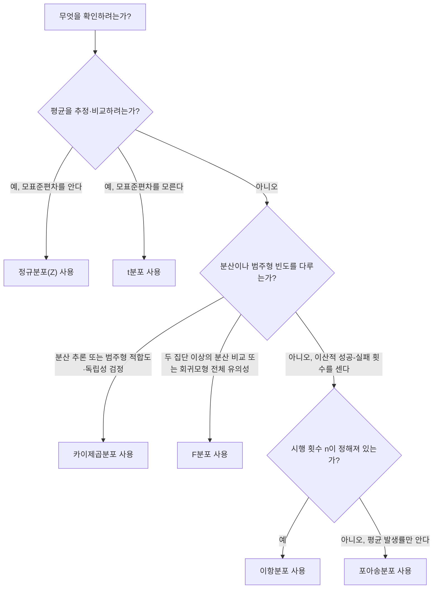

<Callout type="info">
  **이번 문서의 목표:** 확률변수와 확률분포의 관계를 설명하고, 정규분포를 표준정규분포로 표준화하는 계산을 직접 수행하며, 이항·포아송·t·카이제곱·F 분포를 상황에 맞게 골라 쓸 수 있다.
</Callout>

## 확률변수와 확률분포

### 왜 필요한가

13편에서는 이미 손에 쥔 데이터(예: 카페의 8일치 판매량)를 요약했다. 그런데 통계학의 진짜 힘은 "아직 벌어지지 않은 일이 어떤 값을 가질 가능성이 얼마인가"를 미리 계산하는 데 있다. 예를 들어 "내일 이 카페에서 케이크가 20개 이상 팔릴 확률은 얼마인가"를 알고 싶다면, 판매량이라는 값에 확률을 짝지어 주는 규칙이 필요하다. 이 규칙을 다루는 것이 확률변수와 확률분포다.

> **쉽게 말하면:** 확률변수는 "결과가 숫자로 나오는 무작위 실험", 확률분포는 "그 숫자들이 각각 얼마의 확률로 나오는지 정리한 표나 함수"다.

### 정의

**확률변수**(random variable)는 무작위 실험(random experiment, 결과를 미리 확정할 수 없는 실험이나 관찰)의 결과를 숫자로 대응시키는 함수다. 예를 들어 동전을 두 번 던져 앞면이 나온 횟수를 $X$라 하면, $X$는 0, 1, 2 중 하나의 값을 가지는 확률변수다.

확률변수는 값을 셀 수 있느냐에 따라 두 종류로 나뉜다.

- **이산확률변수**(discrete random variable): 0, 1, 2처럼 셀 수 있는 값만 가진다(예: 주사위 눈, 하루 방문객 수).
- **연속확률변수**(continuous random variable): 키·몸무게처럼 구간 안의 모든 실수 값을 가질 수 있다.

**확률분포**(probability distribution)는 확률변수가 가질 수 있는 각 값에 확률을 대응시킨 것이다. 이산확률변수의 확률분포는 **확률질량함수**(probability mass function, PMF)로, 연속확률변수의 확률분포는 **확률밀도함수**(probability density function, PDF)로 나타낸다. PMF는 특정 값 하나가 나올 확률을 직접 알려주지만, PDF는 특정 값 하나의 확률이 아니라 "곡선 아래 특정 구간의 넓이"가 그 구간에 속할 확률을 의미한다는 차이가 있다.

> **쉽게 말하면:** 이산확률변수는 계단처럼 뚝뚝 끊어진 값을, 연속확률변수는 자로 잰 듯 이어진 값을 가진다.

## 정규분포와 표준정규분포

### 왜 필요한가

키·시험 점수·측정 오차처럼 자연·사회 현상에서 관찰되는 수많은 연속형 데이터가 "평균 근처에 가장 많이 몰리고, 양극단으로 갈수록 점점 드물어지는" 좌우 대칭의 종 모양을 따른다. 이 패턴을 수학적으로 정리한 것이 **정규분포**(normal distribution)이며, 통계학에서 가장 중요하고 자주 등장하는 확률분포다. 16편의 가설검정, 18편의 회귀분석 모두 정규분포를 전제로 만들어졌다.

> **쉽게 말하면:** 정규분포는 평균을 중심으로 좌우 대칭인 종 모양 곡선이다.

### 정의

정규분포는 평균 $\mu$와 분산 $\sigma^2$ 두 개의 모수(parameter, 분포의 모양을 결정하는 값)로 완전히 결정되며, $X \sim N(\mu, \sigma^2)$로 표기한다. 정규분포는 다음 성질을 가진다.

- 평균을 중심으로 완전히 좌우 대칭이다. 그래서 평균 = 중앙값 = 최빈값이며 왜도는 0이다.
- 평균에서 표준편차 1개 범위(구간 $[\mu - \sigma, \mu + \sigma]$) 안에 전체 관측치의 약 68퍼센트가, 2개 범위 안에 약 95퍼센트가, 3개 범위 안에 약 99.7퍼센트가 들어온다(경험적 규칙, empirical rule).

문제는 평균과 표준편차가 다른 정규분포가 무수히 많다는 점이다(시험 점수 분포, 키 분포는 평균·표준편차가 서로 다르다). 매번 다른 모양의 곡선을 따로 계산하는 대신, 모든 정규분포를 **평균 0, 표준편차 1로 통일한 기준 분포**로 바꿔서 다루면 표 하나로 모든 문제를 풀 수 있다. 이 기준 분포가 **표준정규분포**(standard normal distribution, $N(0, 1)$)다.

원래 값 $x$를 표준정규분포 위의 값으로 바꾸는 계산을 **표준화**(standardization)라 하며, 그 결과값을 **Z-점수**(Z-score)라 한다.

$$
Z = \frac{x - \mu}{\sigma}
$$

- $Z$: 표준화된 값(Z-점수). "평균에서 표준편차 몇 개만큼 떨어져 있는가"를 나타낸다.
- $x$: 원래 관측값
- $\mu$: 원래 분포의 평균
- $\sigma$: 원래 분포의 표준편차

### 작은 예시와 계산

어느 시험의 점수가 평균 $\mu = 70$점, 표준편차 $\sigma = 10$점인 정규분포를 따른다고 하자. 85점을 받은 학생의 Z-점수를 구하면 다음과 같다.

$$
Z = \frac{85 - 70}{10} = \frac{15}{10} = 1.5
$$

### 결과 해석

Z-점수 1.5는 "이 학생의 점수가 평균보다 표준편차 1.5배만큼 높다"는 뜻이다. 표준정규분포표를 찾아보면 $Z = 1.5$ 이하에 전체의 약 93.3퍼센트가 위치하므로, 이 학생은 상위 약 6.7퍼센트에 속한다고 해석할 수 있다. 이렇게 서로 다른 시험(평균·표준편차가 다른 시험)의 점수라도 Z-점수로 바꾸면 같은 잣대로 비교할 수 있게 된다.

### 자주 틀리는 점

Z-점수 공식에서 분자를 $\mu - x$로 뒤집어 계산하거나, 표준편차 대신 분산을 나누는 실수가 흔하다. "원래 값에서 평균을 빼고 표준편차로 나눈다"는 순서를 정확히 기억해야 한다. 또한 표준정규분포는 정규분포의 특수한 하나의 경우($\mu=0, \sigma=1$)일 뿐, 별개의 분포가 아니라는 점도 헷갈리기 쉬운 부분이다.

## 이항분포와 포아송분포

### 왜 필요한가

정규분포는 연속확률변수를 다루지만, "동전을 10번 던져 앞면이 몇 번 나오는가"처럼 결과가 성공·실패로만 갈리는 반복 시행에는 다른 분포가 필요하다. 이런 상황을 다루는 대표적인 이산형 분포가 이항분포와 포아송분포다.

> **쉽게 말하면:** 이항분포는 "성공 아니면 실패"인 시행을 여러 번 반복했을 때 성공 횟수의 분포이고, 포아송분포는 "정해진 시간·공간 안에서 드물게 일어나는 사건"이 몇 번 발생하는지의 분포다.

### 정의: 이항분포

**이항분포**(binomial distribution)는 성공 확률이 $p$로 동일하고 서로 독립인 시행을 $n$번 반복할 때, 성공 횟수 $X$가 따르는 분포다. $X \sim B(n, p)$로 표기하며, 각 시행은 성공 아니면 실패의 두 결과만 가지는 **베르누이 시행**(Bernoulli trial)이어야 한다.

$$
E(X) = np
$$

- $E(X)$: $X$의 기댓값(평균적으로 기대되는 성공 횟수)
- $n$: 시행 횟수
- $p$: 각 시행에서의 성공 확률

예를 들어 동전을 10번 던질 때(성공 확률 $p=0.5$인 독립 시행 10번) 앞면이 나오는 횟수의 기댓값은 $E(X) = 10 \times 0.5 = 5$번이다.

### 정의: 포아송분포

**포아송분포**(Poisson distribution)는 정해진 시간이나 공간 안에서 평균적으로 $\lambda$(람다, lambda)번 발생하는 드문 사건이, 실제로는 몇 번 발생하는지를 나타내는 분포다. 예를 들어 "하루 평균 콜센터에 걸려오는 불만 전화 3건"처럼 발생 빈도가 낮고 발생 시점이 독립적인 사건에 적용한다. 이항분포는 시행 횟수 $n$이 정해져 있지만, 포아송분포는 $n$이 매우 크고 성공 확률 $p$는 매우 작은 극단적인 상황(예: 하루 동안 발생 가능한 순간은 무수히 많지만 사고가 날 확률은 매우 낮음)을 다룰 때 쓰인다는 차이가 있다. 실제로 $n$이 크고 $p$가 작을 때 이항분포는 포아송분포로 근사할 수 있다.

### 자주 틀리는 점

이항분포와 포아송분포를 헷갈릴 때 기준은 "전체 시행 횟수 $n$이 명확히 정해져 있는가"이다. "주사위를 5번 던진다"처럼 $n$이 명시되면 이항분포, "한 시간 동안 매장에 방문하는 손님 수"처럼 $n$을 특정할 수 없고 평균 발생률만 알려진 경우는 포아송분포로 판단한다.

## t분포·카이제곱분포·F분포의 쓰임

### 왜 필요한가

정규분포는 모표준편차 $\sigma$를 알고 있다는 전제가 필요할 때가 많다. 하지만 현실에서는 모표준편차를 모르는 경우가 대부분이라 표본에서 계산한 표본표준편차 $s$로 대신 추정해야 한다. 이렇게 모수 대신 표본 통계량을 쓰면 정규분포보다 불확실성이 더 커지는데, 이 불확실성을 반영한 분포들이 t분포·카이제곱분포·F분포다. 이 세 분포는 16편 가설검정, 18편 회귀분석에서 검정통계량의 기준 분포로 반복해서 쓰인다.

> **쉽게 말하면:** t분포는 "모표준편차를 모를 때 평균을 비교하는 데", 카이제곱분포는 "분산이나 범주형 자료의 빈도 차이를 검정하는 데", F분포는 "두 집단 이상의 분산을 비교하는 데" 쓰는 분포다.

### 정의

**t분포**(t-distribution)는 모표준편차를 모르는 상태에서 표본으로 모평균을 추정하거나 검정할 때 쓰는 분포다. 정규분포와 마찬가지로 좌우 대칭인 종 모양이지만, 표본 크기가 작을수록 양쪽 꼬리가 정규분포보다 두꺼워(극단값이 나올 가능성이 더 커) 불확실성을 더 크게 반영한다. 표본 크기가 커질수록(자유도가 커질수록) t분포는 표준정규분포에 점점 가까워진다.

**카이제곱분포**(chi-squared distribution, $\chi^2$분포)는 정규분포를 따르는 값들을 제곱해서 더한 값이 따르는 분포로, 항상 0 이상의 값만 가지며 오른쪽으로 긴 꼬리를 가진 비대칭 분포다. 분산에 대한 추론이나, 범주형 자료에서 "관측된 빈도와 기대되는 빈도가 얼마나 차이 나는가"를 검정하는 적합도 검정·독립성 검정에 쓰인다.

**F분포**(F-distribution)는 두 개의 카이제곱분포의 비율로 정의되는 분포로, 역시 0 이상의 값만 가진다. 두 개 이상 집단의 분산이 같은지 비교하거나, 회귀분석에서 회귀모형 전체의 유의성을 검정할 때(18편 참고) 쓰인다.

### 어떤 분포를 언제 쓰는가: 판단 트리

### 자주 틀리는 점

기출 자료를 확인해 보면 "표본 크기가 매우 작을 때 비모수 검정을 고려할 수 있다" 같은 문항에서 t분포·정규분포 기반의 모수 검정과 비모수 검정을 구분하는 함정이 나온다. 모집단이 정규분포에 가깝고 표본이 충분히 크다면 모수 검정(t검정 등)이 일반적으로 더 효율적이며, "정규분포에 가까우면 비모수 검정이 항상 더 좋다"는 진술은 틀린 설명이다. 또한 t·카이제곱·F 세 분포 모두 표본 크기(정확히는 자유도)에 따라 모양이 달라지는 분포족(family of distributions)이라는 점, 그리고 카이제곱분포와 F분포는 음수를 가질 수 없다는 점을 함께 기억해 두어야 한다.

## 핵심 정리

- 확률변수는 이산형(셀 수 있음, PMF)과 연속형(구간 전체, PDF)으로 나뉜다.
- 정규분포는 $\mu, \sigma^2$로 결정되는 좌우 대칭 종 모양이며, $Z=(x-\mu)/\sigma$로 표준화해 표준정규분포 $N(0,1)$ 위에서 비교한다.
- 이항분포는 시행 횟수 $n$이 정해진 성공-실패 반복, 포아송분포는 $n$을 특정할 수 없는 드문 사건의 발생 횟수에 쓰인다.
- t분포는 모표준편차를 모를 때의 평균 추론, 카이제곱분포는 분산·범주형 빈도 검정, F분포는 분산 비교·회귀모형 유의성 검정에 쓰인다.
- t·카이제곱·F 분포는 자유도에 따라 모양이 달라지며, 표본이 커질수록 t분포는 표준정규분포에 가까워진다.

## 마무리 복습

<Quiz
  questionNumber={1}
  question="확률변수와 확률분포에 대한 설명으로 가장 적절한 것은?"
  options={['연속확률변수는 확률질량함수(PMF)로 나타낸다', '이산확률변수는 키·몸무게처럼 구간 안의 모든 실수 값을 가진다', '확률변수는 무작위 실험의 결과를 숫자로 대응시키는 함수다', '확률분포는 항상 좌우 대칭 모양을 가진다']}
  correctAnswer={3}
  explanation="확률변수는 동전 던지기, 주사위 던지기처럼 결과를 미리 확정할 수 없는 무작위 실험의 결과를 숫자로 대응시키는 함수로 정의된다."
  optionExplanations={['연속확률변수는 확률밀도함수(PDF)로 나타내며 PMF는 이산확률변수에 쓰인다', '구간 안의 모든 실수 값을 가지는 것은 연속확률변수의 정의이며 이산확률변수와 반대로 서술됐다', '확률변수의 정의를 정확히 서술했다', '이항분포·카이제곱분포처럼 비대칭인 확률분포도 많으므로 틀렸다']}
/>

<Quiz
  questionNumber={2}
  question="어느 자격시험 점수가 평균 60점, 표준편차 8점인 정규분포를 따를 때, 76점을 받은 응시자의 Z-점수는?"
  options={['1.5', '2.0', '2.5', '0.5']}
  correctAnswer={2}
  explanation="Z=(x-μ)/σ 공식에 대입하면 Z=(76-60)/8=16/8=2.0이다. 이 응시자의 점수는 평균보다 표준편차 2배만큼 높다는 뜻이다."
  optionExplanations={['분자 16을 8로 나누면 1.5가 아니라 2.0이 나오므로 계산이 틀렸다', '(76-60)/8=2.0으로 계산이 정확하다', '분모나 분자를 잘못 대입했을 때 나올 수 있는 값으로 정답이 아니다', '표준편차를 잘못 나눴을 때 나오는 값으로 정답이 아니다']}
/>

<Quiz
  questionNumber={3}
  question="정규분포의 성질에 대한 설명으로 옳지 않은 것은?"
  options={['평균을 중심으로 좌우 대칭이다', '평균, 중앙값, 최빈값이 모두 같다', '왜도는 0이다', '표준편차가 다르면 서로 다른 확률변수이므로 비교할 수 없다']}
  correctAnswer={4}
  explanation="표준편차가 다른 정규분포라도 Z-점수로 표준화하면 표준정규분포라는 같은 기준 위에서 비교할 수 있다. 따라서 비교가 불가능하다는 설명은 틀렸다."
  optionExplanations={['정규분포는 실제로 평균을 중심으로 완전히 좌우 대칭이다', '좌우 대칭이므로 세 대표값이 모두 일치하는 것이 정규분포의 특징이다', '좌우 대칭 분포이므로 왜도가 0인 것이 맞는 설명이다', '표준화(Z-점수)를 이용하면 표준편차가 다른 정규분포끼리도 비교할 수 있으므로 이 설명이 틀렸다']}
/>

<Quiz
  questionNumber={4}
  question="성공 확률이 0.3인 독립 시행을 20번 반복할 때 성공 횟수가 따르는 분포와 그 기댓값으로 옳은 것은?"
  options={['포아송분포, 기댓값 0.3', '이항분포, 기댓값 6', '카이제곱분포, 기댓값 20', 'F분포, 기댓값 6']}
  correctAnswer={2}
  explanation="시행 횟수 n=20이 명확히 정해져 있고 각 시행이 성공-실패의 독립 베르누이 시행이므로 이항분포 B(20, 0.3)을 따른다. 기댓값은 E(X)=np=20×0.3=6이다."
  optionExplanations={['시행 횟수 n이 명확히 정해져 있으므로 포아송분포가 아니라 이항분포이며 기댓값도 잘못됐다', 'n=20이 정해진 성공-실패 반복 시행이므로 이항분포이고 기댓값 np=6이 정확하다', '카이제곱분포는 분산·범주형 검정에 쓰이는 분포로 이 상황과 무관하다', 'F분포는 분산 비교에 쓰이는 분포로 이 상황과 무관하다']}
/>

<Quiz
  questionNumber={5}
  question="이항분포와 포아송분포를 구분하는 가장 중요한 기준은?"
  options={['이산형인지 연속형인지 여부', '전체 시행 횟수 n을 명확히 특정할 수 있는지 여부', '평균이 0보다 큰지 여부', '분포가 좌우 대칭인지 여부']}
  correctAnswer={2}
  explanation="이항분포는 시행 횟수 n이 정해진 상황(예: 동전을 10번 던짐)에, 포아송분포는 n을 특정할 수 없고 평균 발생률만 알려진 드문 사건(예: 한 시간 동안 매장 방문객 수)에 적용한다."
  optionExplanations={['이항분포와 포아송분포는 둘 다 이산형 확률분포이므로 이 기준으로는 구분되지 않는다', '시행 횟수를 특정할 수 있는지가 두 분포를 구분하는 핵심 기준이다', '두 분포 모두 평균이 0보다 큰 경우를 다루므로 구분 기준이 될 수 없다', '이항분포는 대칭일 수도 비대칭일 수도 있어 대칭 여부는 구분 기준이 아니다']}
/>

<Quiz
  questionNumber={6}
  question="t분포에 대한 설명으로 가장 적절한 것은?"
  options={['모표준편차를 알고 있을 때 항상 정규분포 대신 사용한다', '표본 크기가 커질수록(자유도가 커질수록) 표준정규분포에 가까워진다', '항상 0 이상의 값만 가지는 오른쪽 꼬리 분포다', '두 집단의 분산을 비교할 때 사용하는 분포다']}
  correctAnswer={2}
  explanation="t분포는 모표준편차를 모를 때 표본표준편차로 대신 추정하면서 생기는 불확실성을 반영한 분포이며, 표본 크기가 커질수록(자유도 증가) 표준정규분포에 점점 가까워진다."
  optionExplanations={['t분포는 모표준편차를 모를 때 사용하는 분포이며, 알고 있으면 정규분포(Z)를 사용한다', '자유도가 커질수록 t분포가 표준정규분포에 가까워진다는 설명이 정확하다', '음수 값도 가지는 좌우 대칭 분포이며 이는 카이제곱분포·F분포의 특징이다', '두 집단의 분산 비교에 사용하는 분포는 t분포가 아니라 F분포다']}
/>

<Quiz
  questionNumber={7}
  question="카이제곱분포와 F분포의 공통된 특징으로 옳은 것은?"
  options={['둘 다 음수 값을 가질 수 없다', '둘 다 좌우 대칭인 종 모양이다', '둘 다 평균을 비교하는 데만 사용된다', '둘 다 자유도와 무관하게 항상 같은 모양이다']}
  correctAnswer={1}
  explanation="카이제곱분포는 정규분포 값을 제곱해서 더한 값의 분포이고, F분포는 두 카이제곱분포의 비율이므로 둘 다 제곱 또는 제곱의 비율 구조 때문에 음수 값을 가질 수 없다."
  optionExplanations={['카이제곱분포와 F분포는 제곱 구조 때문에 항상 0 이상이며 오른쪽으로 긴 비대칭 분포다', '두 분포 모두 오른쪽 꼬리가 긴 비대칭 분포이며 좌우 대칭이 아니다', '카이제곱분포는 분산·빈도 검정에, F분포는 분산 비교·회귀 유의성 검정에 쓰이며 평균 비교가 주목적이 아니다', '두 분포 모두 자유도에 따라 모양이 달라지는 분포족이다']}
/>

<Quiz
  questionNumber={8}
  question="다음 중 F분포가 사용되는 상황으로 가장 적절한 것은?"
  options={['한 집단의 평균이 특정 값과 같은지 검정할 때', '두 집단 이상의 분산이 서로 같은지 비교할 때', '범주형 변수 두 개가 서로 독립인지 검정할 때', '모표준편차를 알 때 두 집단의 평균 차이를 검정할 때']}
  correctAnswer={2}
  explanation="F분포는 두 개의 카이제곱분포의 비율로 정의되며, 두 개 이상 집단의 분산이 동일한지 비교하거나 회귀모형 전체의 유의성을 검정할 때 사용한다."
  optionExplanations={['한 집단의 평균 검정에는 표본 크기와 모표준편차 인지 여부에 따라 정규분포 또는 t분포가 사용된다', '두 집단 이상의 분산 비교는 F분포가 사용되는 대표적인 상황이다', '범주형 변수의 독립성 검정에는 카이제곱분포가 사용된다', '모표준편차를 아는 평균 차이 검정에는 정규분포(Z)가 사용된다']}
/>

## 참고 자료

- [데이터자격시험 - ADsP 출제기준](https://www.dataq.or.kr/www/sub/a_06.do)
