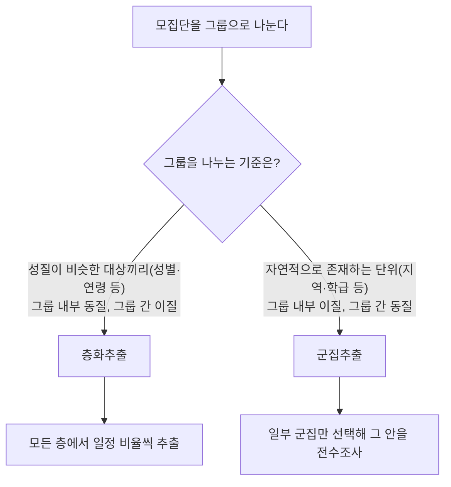

<Callout type="info">
  **이번 문서의 목표:** 표본추출 4가지 방법의 차이(특히 층화추출과 군집추출)를 구분하고, 중심극한정리를 이해하며, 점추정·구간추정과 95퍼센트 신뢰구간을 올바르게 해석할 수 있다.
</Callout>

## 모집단과 표본, 그리고 표본추출이 필요한 이유

### 왜 필요한가

전국 유권자의 지지 성향을 알고 싶다고 하자. 5천만 명 전체를 일일이 조사하는 **전수조사**(census)는 시간과 비용이 감당하기 어렵다. 그래서 실제로는 일부(예: 1,000명)만 뽑아 조사하고, 그 결과로 전체를 추측한다. 관심의 대상이 되는 전체 집합을 **모집단**(population)이라 하고, 그 모집단에서 실제로 뽑아낸 일부를 **표본**(sample)이라 한다. 표본이 모집단을 얼마나 잘 대표하느냐가 분석 결과의 신뢰성을 좌우하기 때문에, "어떻게 뽑을 것인가"를 다루는 **표본추출**(sampling)이 통계학의 출발점이 된다.

> **쉽게 말하면:** 모집단은 궁금한 대상 전체, 표본은 그중 실제로 뽑아서 살펴보는 일부다.

## 표본추출 방법 4가지

### 왜 필요한가

표본을 아무렇게나 뽑으면 모집단을 제대로 대표하지 못할 수 있다. 예를 들어 서울에서만 설문을 돌리고 전국 여론이라고 주장하면 왜곡된 결과가 나온다. 이런 편향을 줄이기 위해 통계학에서는 몇 가지 체계적인 표본추출 방법을 정리해 두었다.

> **쉽게 말하면:** 표본추출 방법은 "모집단에서 어떤 절차로 일부를 골라낼 것인가"에 대한 규칙이다.

### 정의

| 추출 방법 | 영문 | 절차 | 핵심 아이디어 |
|---|---|---|---|
| 단순랜덤추출 | simple random sampling | 모집단의 모든 개체에 번호를 부여하고 완전히 무작위로 추출 | 모든 개체가 뽑힐 확률이 동일 |
| 계통추출 | systematic sampling | 번호를 부여한 뒤 첫 표본을 무작위로 정하고, 이후 일정한 간격 $k$마다 추출 | 단순랜덤추출을 간편하게 만든 방식 |
| 층화추출 | stratified sampling | 모집단을 성질이 비슷한 층(strata)으로 나눈 뒤, 각 층에서 일정 비율씩 추출 | 층 내부는 동질적, 층 사이는 이질적으로 나눈 뒤 모든 층에서 골고루 뽑음 |
| 군집추출 | cluster sampling | 모집단을 여러 군집(cluster)으로 나눈 뒤, 일부 군집을 통째로 선택해 그 안을 전수조사 | 군집 내부는 이질적, 군집 사이는 동질적으로 나눈 뒤 일부 군집만 뽑음 |

### 층화추출과 군집추출, 핵심 차이는 "무엇을 어떻게 나누고 뽑는가"

네 가지 방법 중 가장 대표적인 함정은 층화추출과 군집추출을 혼동하는 것이다. 둘 다 모집단을 여러 그룹으로 나눈다는 점은 같지만, **그룹을 나누는 기준**과 **그룹 안에서 뽑는 방식**이 정반대다.

**층화추출**은 모집단을 성별·연령대·지역처럼 성질이 비슷한 대상끼리 묶어 층(strata)을 만든다. 이때 목표는 "각 층 내부는 최대한 동질적으로, 서로 다른 층끼리는 최대한 이질적으로" 나누는 것이다. 예를 들어 전국 유권자를 20대·30대·40대·50대 이상으로 층을 나누면, 같은 층 안의 사람들은 연령대 특성이 비슷하다(동질적). 층을 나눈 뒤에는 **모든 층에서 빠짐없이** 일정 비율씩 표본을 뽑는다.

**군집추출**은 반대로 지역·학급처럼 자연적으로 존재하는 집단을 그대로 군집(cluster)으로 삼는다. 이때는 "각 군집 내부는 모집단 전체의 축소판처럼 다양하게(이질적으로), 군집끼리는 서로 비슷하게(동질적으로)" 구성되어 있다고 가정한다. 예를 들어 전국의 학교 하나하나를 군집으로 보면, 한 학교 안에는 성적이 좋은 학생과 나쁜 학생이 고루 섞여 있다(이질적). 군집을 나눈 뒤에는 **일부 군집만 무작위로 선택**해서, 그 선택된 군집 안에서는 전수조사(구성원 전체를 조사)한다.

| 구분 기준 | 층화추출 | 군집추출 |
|---|---|---|
| 그룹 내부 성질 | 동질적(비슷한 특성끼리 묶음) | 이질적(모집단의 축소판처럼 다양함) |
| 그룹 사이 성질 | 이질적(층마다 특성이 다름) | 동질적(군집끼리 비슷한 구성) |
| 추출 대상 | 모든 그룹에서 표본 추출 | 일부 그룹만 선택 |
| 선택된 그룹 내 처리 | 그 안에서 다시 표본 추출 | 그 안은 전수조사(통째로 포함) |
| 예시 | 연령대별로 나눠 각 연령대에서 100명씩 | 전국 학교 중 20개교를 뽑아 그 학교 학생 전체 조사 |

### 자주 틀리는 점

기출 자료를 확인해 보면 계통추출("번호를 부여하고 일정 간격으로 추출")을 단순랜덤추출이나 층화추출로 착각하게 만드는 보기가 자주 나온다. 계통추출은 첫 표본만 무작위로 뽑고 이후에는 규칙적인 간격 $k$를 따른다는 점에서 단순랜덤추출과 구별된다. 그리고 가장 자주 나오는 함정은 층화추출과 군집추출을 서로 뒤바꿔 서술하는 보기다. **동질적인 것끼리 묶고 전부에서 뽑으면 층화**, **이질적인 것을 통째로 묶고 일부만 뽑으면 군집**이라는 대응 관계를 정확히 기억해야 한다.

## 표본분포와 중심극한정리

### 왜 필요한가

모집단에서 표본 하나를 뽑아 평균을 계산하면 특정한 하나의 값이 나온다. 그런데 다른 표본을 다시 뽑으면 평균값이 조금 달라진다. 즉 표본평균 자체도 매번 값이 달라지는 하나의 확률변수다. "표본평균이라는 확률변수는 어떤 분포를 따르는가"를 알아야, 표본 하나만 보고도 모집단에 대한 결론을 얼마나 믿을 수 있는지 판단할 수 있다.

> **쉽게 말하면:** 표본분포는 "같은 크기의 표본을 계속 뽑아서 매번 평균을 계산한다면, 그 평균값들이 어떤 패턴으로 흩어지는가"를 나타낸 분포다.

### 정의

**표본분포**(sampling distribution)는 모집단에서 크기 $n$인 표본을 반복해서 뽑았을 때, 그 표본들로부터 계산한 통계량(표본평균, 표본비율 등)이 따르는 확률분포다. 표본평균의 표본분포에서 특히 중요한 정리가 **중심극한정리**(central limit theorem, CLT)다.

**중심극한정리**는 모집단의 분포 모양과 관계없이, 표본의 크기 $n$이 충분히 크면(일반적으로 $n \geq 30$을 기준으로 삼는다) 표본평균 $\bar{X}$의 분포가 정규분포에 가까워진다는 정리다.

$$
\bar{X} \sim N\left(\mu, \frac{\sigma^2}{n}\right) \quad (n\text{이 충분히 클 때})
$$

- $\bar{X}$: 표본평균(확률변수로서의 표본평균)
- $\mu$: 모집단의 평균
- $\sigma^2$: 모집단의 분산
- $n$: 표본의 크기

여기서 $\sigma/\sqrt{n}$을 **표준오차**(standard error, SE)라 하며, 표본평균이라는 확률변수 자체가 얼마나 흩어져 있는지를 나타낸다. 표본 크기 $n$이 커질수록 표준오차는 작아지므로, 표본이 클수록 표본평균이 모평균에 더 가깝게 몰린다는 뜻이다.

### 작은 예시

주사위를 한 번 던진 눈금은 1부터 6까지 균등하게 나오는 분포(균등분포, 정규분포와 전혀 다른 모양)를 따른다. 그런데 주사위를 30번 던진 평균을 계산하고, 이 시행을 수백 번 반복해 평균값들을 모아 그래프를 그리면, 원래 균등분포와 전혀 다른 좌우 대칭의 종 모양(정규분포에 가까운 모양)이 나타난다. 이것이 중심극한정리의 힘이다. **원래 모집단의 분포가 어떤 모양이든** 표본평균의 분포는 표본 크기가 커지면 정규분포에 가까워진다.

### 결과 해석

중심극한정리 덕분에, 모집단이 정규분포를 따르는지조차 몰라도 표본 크기만 충분히 크면 정규분포를 이용한 다양한 추정·검정 기법(구간추정, 16편의 가설검정 등)을 적용할 수 있다. 이것이 중심극한정리가 통계학 전체의 토대로 불리는 이유다.

### 자주 틀리는 점

"표본 크기가 크면 모집단 자체가 정규분포를 따르게 된다"는 오해가 흔하다. 중심극한정리가 정규분포에 가까워진다고 보장하는 대상은 **모집단이 아니라 표본평균의 분포**다. 모집단의 모양은 어떻든 원래 그대로다.

## 점추정과 구간추정

### 왜 필요한가

표본에서 계산한 표본평균 $\bar{x} = 72$가 있다고 해서 모평균이 정확히 72라고 확신할 수는 없다. 표본을 다시 뽑으면 71.5나 72.8처럼 다른 값이 나올 수 있기 때문이다. 그래서 모수를 추측하는 방법에는 하나의 값으로 콕 집어 말하는 방법과, "이 범위 안에 있을 것"이라고 폭을 두고 말하는 방법 두 가지가 있다.

> **쉽게 말하면:** 점추정은 "모평균은 대략 72다"처럼 값 하나로 콕 집어 말하는 것이고, 구간추정은 "모평균은 68에서 76 사이에 있을 가능성이 높다"처럼 범위로 말하는 것이다.

### 정의

**점추정**(point estimation)은 모수를 하나의 값(점)으로 추정하는 방법이다. 표본평균 $\bar{x}$로 모평균 $\mu$를, 표본분산 $s^2$으로 모분산 $\sigma^2$을 추정하는 것이 대표적이다. 점추정은 간단하지만, 그 값이 얼마나 정확한지(신뢰할 수 있는 정도)에 대한 정보를 담지 못한다는 한계가 있다.

**구간추정**(interval estimation)은 모수가 포함될 것으로 기대되는 범위를 제시하는 방법이다. 이 범위를 **신뢰구간**(confidence interval, CI)이라 하며, 모표준편차를 알고 표본 크기가 충분히 클 때 표본평균 기준 신뢰구간은 다음과 같이 구한다.

$$
\bar{x} \pm Z_{\alpha/2} \times \frac{\sigma}{\sqrt{n}}
$$

- $\bar{x}$: 표본평균
- $Z_{\alpha/2}$: 신뢰수준에 대응하는 표준정규분포의 임계값(95퍼센트 신뢰수준에서는 약 1.96)
- $\sigma/\sqrt{n}$: 표준오차

### 계산 예제

어느 공장에서 생산하는 부품 무게의 모표준편차가 $\sigma = 4$g으로 알려져 있다. 이 공장에서 표본 $n=64$개를 뽑아 측정했더니 표본평균이 $\bar{x} = 100$g이었다. 95퍼센트 신뢰구간을 구하면 다음과 같다.

$$
\frac{\sigma}{\sqrt{n}} = \frac{4}{\sqrt{64}} = \frac{4}{8} = 0.5
$$

$$
100 \pm 1.96 \times 0.5 = 100 \pm 0.98
$$

따라서 95퍼센트 신뢰구간은 약 $[99.02, 100.98]$이다.

**검산**: 신뢰구간의 폭은 $1.96 \times 0.5 \times 2 = 1.96$이며, 상한($100.98$)에서 하한($99.02$)을 빼면 $1.96$으로 일치한다.

## 신뢰수준의 의미: "95퍼센트 신뢰구간"을 올바르게 읽기

### 왜 필요한가

신뢰구간에서 가장 많이 오해하는 부분이 "95퍼센트"라는 숫자가 정확히 무엇을 의미하는지다. 이 오해를 정면으로 짚지 않으면 시험에서도 실무에서도 결과를 잘못 해석하게 된다.

> **쉽게 말하면:** 95퍼센트 신뢰수준은 "이 구간 안에 모평균이 있을 확률이 95퍼센트"라는 뜻이 아니라, "이런 방식으로 구간을 100번 만들면 그중 약 95번은 진짜 모평균을 포함한다"는 뜻이다.

### 올바른 해석과 흔한 오해

앞서 계산한 신뢰구간 $[99.02, 100.98]$을 예로 들어보자.

- **흔한 오해**: "모평균이 이 구간 안에 있을 확률이 95퍼센트다." 이 해석은 틀렸다. 모평균 $\mu$는 이미 정해져 있는(우리가 모를 뿐인) 고정된 상수이지, 확률적으로 움직이는 값이 아니다. 이미 계산되어 고정된 구간 $[99.02, 100.98]$에 대해 "모평균이 그 안에 있을 확률이 95퍼센트"라고 말하는 것은, 이미 던져서 바닥에 떨어진 동전을 보면서 "앞면일 확률이 50퍼센트"라고 말하는 것과 같은 논리적 오류다. 이 구간이 모평균을 포함하는지 여부는 이미 예/아니오로 정해져 있으며, 다만 우리가 그 답을 모를 뿐이다.
- **올바른 해석**: 신뢰수준 95퍼센트는 **구간을 만드는 절차(방법)에 대한 신뢰도**를 의미한다. 즉 같은 표본추출 방법으로 신뢰구간을 100번 반복해서 만든다면, 표본을 뽑을 때마다 다른 구간이 나오겠지만, 그렇게 만들어진 100개의 구간 중 평균적으로 약 95개는 실제 모평균을 포함하고 약 5개는 포함하지 못한다는 뜻이다. 확률은 "구간 안에 모평균이 있는가"가 아니라 "이 절차가 모평균을 포함하는 구간을 만들어 낼 가능성"에 붙는다.

### 자주 틀리는 점

"신뢰수준을 99퍼센트로 높이면 구간이 더 좁아진다"는 오해도 흔하다. 실제로는 반대다. 더 높은 확률로 모평균을 포함시키려면 $Z_{\alpha/2}$ 값이 커져야 하므로(95퍼센트일 때 약 1.96, 99퍼센트일 때 약 2.58) 신뢰구간의 폭은 오히려 넓어진다. 즉 **신뢰수준을 높이면 확신은 커지지만 그만큼 범위는 넓어져서 정보의 정밀도는 떨어지는 상충 관계**가 있다는 점을 기억해야 한다. 또한 표본 크기 $n$이 커지면 표준오차($\sigma/\sqrt{n}$)가 작아져 신뢰구간이 좁아진다는 점도 함께 기억하면, 신뢰수준과 표본 크기가 신뢰구간의 폭에 미치는 영향을 헷갈리지 않을 수 있다.

## 핵심 정리

- 표본추출 4가지 방법 중 계통추출은 일정 간격으로, 층화추출은 동질적인 층 전부에서, 군집추출은 이질적인 군집 중 일부를 통째로 뽑는다.
- 층화추출은 "그룹 내부 동질, 그룹 간 이질, 모든 그룹에서 추출"이고, 군집추출은 "그룹 내부 이질, 그룹 간 동질, 일부 그룹만 통째로 추출"이다.
- 중심극한정리는 모집단의 분포 모양과 무관하게, 표본 크기가 충분히 크면 표본평균의 분포가 정규분포에 가까워진다는 정리다.
- 점추정은 값 하나로, 구간추정은 신뢰구간이라는 범위로 모수를 추정한다.
- 95퍼센트 신뢰구간은 "모평균이 그 구간에 있을 확률이 95퍼센트"가 아니라 "같은 방법으로 구간을 반복해 만들면 약 95퍼센트가 모평균을 포함한다"는 절차에 대한 신뢰도다.

## 마무리 복습

<Quiz
  questionNumber={1}
  question="전국 고등학교를 지역·특성이 비슷한 15개 지역으로 나눈 뒤, 그중 3개 지역을 무작위로 선택해 선택된 지역의 모든 고등학교 학생을 조사했다. 이 표본추출 방법은?"
  options={['단순랜덤추출', '계통추출', '층화추출', '군집추출']}
  correctAnswer={4}
  explanation="지역을 하나의 집단(군집)으로 보고 일부 군집만 선택한 뒤 그 안을 통째로(전수) 조사했으므로 군집추출이다. 층화추출이라면 모든 지역에서 일부씩 뽑아야 하지만, 이 사례는 일부 지역만 선택해 그 안을 전부 조사했다."
  optionExplanations={['단순랜덤추출은 모집단 전체 개체에서 직접 무작위로 뽑는 방법으로 이 사례와 다르다', '계통추출은 번호를 매겨 일정 간격으로 뽑는 방법으로 이 사례와 다르다', '층화추출이라면 모든 지역(층)에서 표본을 뽑아야 하는데 이 사례는 일부 지역만 선택했으므로 틀렸다', '일부 집단만 선택해 그 안을 전수조사하는 방식은 군집추출의 정의와 정확히 일치한다']}
/>

<Quiz
  questionNumber={2}
  question="층화추출과 군집추출의 차이에 대한 설명으로 옳은 것은?"
  options={['층화추출은 그룹 내부가 이질적이도록 나누고, 군집추출은 그룹 내부가 동질적이도록 나눈다', '층화추출은 모든 그룹에서 표본을 뽑고, 군집추출은 일부 그룹만 선택해 통째로 조사한다', '두 방법 모두 그룹을 나누지 않고 개체를 직접 무작위로 뽑는다', '군집추출이 층화추출보다 항상 표본 오차가 작다']}
  correctAnswer={2}
  explanation="층화추출은 동질적인 층으로 나눈 뒤 모든 층에서 일정 비율씩 추출하고, 군집추출은 이질적인(모집단의 축소판 같은) 군집으로 나눈 뒤 일부 군집만 선택해 그 안을 통째로 조사한다."
  optionExplanations={['층화추출은 그룹 내부가 동질적, 군집추출은 그룹 내부가 이질적이도록 나누므로 설명이 반대다', '층화추출은 모든 층에서, 군집추출은 일부 군집만 선택한다는 설명이 정확하다', '두 방법 모두 먼저 모집단을 여러 그룹으로 나눈 뒤 추출하는 방법이므로 틀렸다', '표본 오차의 크기는 상황에 따라 다르며 군집추출이 항상 더 작다고 단정할 수 없다']}
/>

<Quiz
  questionNumber={3}
  question="중심극한정리(central limit theorem)에 대한 설명으로 가장 적절한 것은?"
  options={['표본 크기가 충분히 크면 모집단 자체의 분포가 정규분포로 바뀐다', '모집단의 분포 모양과 관계없이, 표본 크기가 충분히 크면 표본평균의 분포가 정규분포에 가까워진다', '표본 크기가 작을수록 표본평균의 분포가 정규분포에 더 가까워진다', '중심극한정리는 모집단이 정규분포일 때만 성립한다']}
  correctAnswer={2}
  explanation="중심극한정리는 원래 모집단의 분포 모양이 무엇이든, 표본 크기 n이 충분히 크면(일반적으로 30 이상) 표본평균의 분포가 정규분포에 가까워진다는 정리다."
  optionExplanations={['중심극한정리가 정규분포에 가까워진다고 말하는 대상은 모집단이 아니라 표본평균의 분포다', '모집단 분포 모양과 무관하게 표본평균의 분포가 정규분포에 가까워진다는 설명이 정확하다', '표본 크기가 클수록 정규분포에 더 가까워지므로 이 설명은 반대로 서술됐다', '중심극한정리의 핵심은 모집단의 분포 모양과 무관하게 성립한다는 점이므로 틀렸다']}
/>

<Quiz
  questionNumber={4}
  question="모표준편차가 6이고 표본 크기가 36인 표본에서 표본평균이 50일 때, 95퍼센트 신뢰구간(Z=1.96 사용)은?"
  options={['[48.04, 51.96]', '[49.02, 50.98]', '[47.06, 52.94]', '[49.67, 50.33]']}
  correctAnswer={2}
  explanation="표준오차는 6/루트(36)=6/6=1이다. 신뢰구간은 50±1.96×1=50±1.96이므로 [48.04, 51.96]이다."
  optionExplanations={['표준오차 1에 1.96을 곱한 값을 더하고 뺀 정확한 계산 결과다', '표준오차를 잘못 계산했을 때(예: 6/루트(36)을 0.5로 착각) 나올 수 있는 값으로 정답이 아니다', 'Z값이나 표준오차를 다르게 대입했을 때 나오는 값으로 정답이 아니다', '표준오차를 실제보다 작게 계산했을 때 나오는 값으로 정답이 아니다']}
/>

<Quiz
  questionNumber={5}
  question="95퍼센트 신뢰구간을 계산한 결과 [70, 80]을 얻었다. 이에 대한 해석으로 가장 적절한 것은?"
  options={['모평균이 70에서 80 사이에 있을 확률이 95퍼센트다', '같은 표본추출 방법으로 신뢰구간을 반복해서 만들면, 그중 약 95퍼센트의 구간이 실제 모평균을 포함한다', '표본의 95퍼센트가 70에서 80 사이의 값을 가진다', '모평균은 정확히 75(구간의 중앙값)이다']}
  correctAnswer={2}
  explanation="모평균은 고정된 상수이므로 이미 계산된 구간 [70, 80]에 대해 확률을 논할 수 없다. 95퍼센트 신뢰수준은 같은 절차로 구간을 반복 생성했을 때 그중 약 95퍼센트가 모평균을 포함한다는, 구간을 만드는 절차 자체에 대한 신뢰도를 의미한다."
  optionExplanations={['모평균은 고정된 상수이므로 이미 계산된 구간에 대해 확률을 부여하는 것은 틀린 해석이다', '신뢰수준을 구간을 만드는 절차에 대한 신뢰도로 해석한 것이 통계학적으로 정확하다', '신뢰구간은 개별 표본 값들의 분포가 아니라 모평균 추정 범위에 대한 것이므로 틀렸다', '신뢰구간의 중앙값이 반드시 모평균과 일치한다는 보장은 없으므로 틀렸다']}
/>

<Quiz
  questionNumber={6}
  question="신뢰수준을 95퍼센트에서 99퍼센트로 높일 때, 다른 조건이 모두 같다면 신뢰구간의 폭은 어떻게 변하는가?"
  options={['좁아진다', '넓어진다', '변화가 없다', '표본 크기에 의해서만 결정되며 신뢰수준과는 무관하다']}
  correctAnswer={2}
  explanation="신뢰수준을 높이면 더 높은 확률로 모평균을 포함시켜야 하므로 임계값 Z가 커진다(95퍼센트일 때 약 1.96, 99퍼센트일 때 약 2.58). 그 결과 신뢰구간의 폭은 넓어진다."
  optionExplanations={['신뢰수준을 높이면 임계값이 커져 구간이 좁아지는 것이 아니라 넓어진다', '더 높은 확신을 담보하려면 더 넓은 범위가 필요하므로 폭이 넓어진다는 설명이 정확하다', '신뢰수준이 임계값 Z에 직접 영향을 주므로 폭에 변화가 없다는 설명은 틀렸다', '신뢰구간의 폭은 표본 크기와 신뢰수준 둘 다에 의해 결정되므로 틀렸다']}
/>

<Quiz
  questionNumber={7}
  question="점추정과 구간추정의 차이에 대한 설명으로 가장 적절한 것은?"
  options={['점추정은 모수를 범위로, 구간추정은 하나의 값으로 추정한다', '점추정은 하나의 값으로, 구간추정은 신뢰구간이라는 범위로 모수를 추정한다', '점추정과 구간추정은 항상 동일한 결과를 준다', '구간추정은 표본을 사용하지 않고도 계산할 수 있다']}
  correctAnswer={2}
  explanation="점추정은 표본평균처럼 모수를 하나의 값으로 콕 집어 추정하는 방법이고, 구간추정은 모수가 포함될 것으로 기대되는 범위(신뢰구간)를 제시하는 방법이다."
  optionExplanations={['점추정과 구간추정의 정의가 서로 뒤바뀌어 서술됐다', '점추정은 값 하나, 구간추정은 범위로 추정한다는 설명이 정확하다', '점추정값은 구간추정 구간의 중심 근처에 오지만 둘이 표현하는 정보의 형태 자체가 다르다', '구간추정도 표본에서 계산한 통계량(표본평균, 표준오차 등)을 바탕으로 계산되므로 틀렸다']}
/>

<Quiz
  questionNumber={8}
  question="표본 크기를 늘렸을 때(다른 조건은 동일) 신뢰구간에 나타나는 변화로 옳은 것은?"
  options={['표준오차가 커져 신뢰구간이 넓어진다', '표준오차가 작아져 신뢰구간이 좁아진다', '신뢰수준이 자동으로 높아진다', '표본 크기는 신뢰구간의 폭에 영향을 주지 않는다']}
  correctAnswer={2}
  explanation="표준오차는 σ/루트(n)으로 계산되므로 표본 크기 n이 커질수록 표준오차가 작아지고, 그 결과 신뢰구간의 폭도 좁아져 더 정밀한 추정이 가능해진다."
  optionExplanations={['표본 크기가 커지면 표준오차는 작아지므로 이 설명은 방향이 반대다', '표본 크기 증가로 표준오차가 작아져 구간이 좁아진다는 설명이 정확하다', '신뢰수준은 분석자가 미리 정하는 값이며 표본 크기에 따라 자동으로 바뀌지 않는다', '표본 크기는 표준오차를 통해 신뢰구간의 폭에 직접 영향을 준다']}
/>

## 참고 자료

- [데이터자격시험 - ADsP 출제기준](https://www.dataq.or.kr/www/sub/a_06.do)
