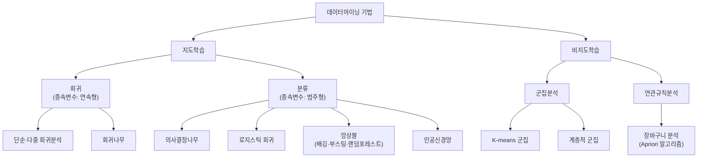

<Callout type="info">
  **이번 문서의 목표:** 데이터마이닝이 무엇을 하는 작업인지, 지도학습과 비지도학습이 어떻게 다르고 어떤 기법이 어디에 속하는지, 그리고 왜 데이터를 학습·검증·평가용으로 나누는지 설명할 수 있다.
</Callout>

## 데이터마이닝이란 무엇인가

### 왜 필요한가

지금까지 13~19편에서는 평균·분산 같은 요약값을 구하거나(기술통계), 두 변수 사이의 관계를 하나의 식으로 표현하는(상관·회귀) 방법을 배웠다. 그런데 실제 기업 데이터는 변수가 수십~수백 개에 이르고, 사람이 눈으로 하나하나 관계를 확인하기 어렵다. "고객 100만 명 중 누가 이탈할 것인가", "이 거래는 사기인가 아닌가", "어떤 상품들을 함께 진열해야 잘 팔리는가" 같은 질문에 답하려면, 컴퓨터가 대량의 데이터 속에서 스스로 패턴을 찾아내는 기법이 필요하다. 이런 기법들을 통틀어 **데이터마이닝**(data mining)이라 부른다.

> **쉽게 말하면:** 데이터마이닝은 산더미 같은 데이터(광산, mine) 속에서 유용한 패턴이라는 광물을 캐내는 작업이다.

### 정의

**데이터마이닝**(data mining)은 대용량 데이터 속에 숨어 있는 의미 있는 패턴·규칙·관계를 통계학·기계학습(machine learning, 데이터로부터 규칙을 스스로 학습하는 컴퓨터 기법) 등의 기법으로 찾아내, 예측이나 의사결정에 활용하는 과정이다. 목적은 크게 두 가지로 나뉜다. 첫째는 **예측**(prediction) — 아직 일어나지 않은 미래의 값이나 범주를 미리 짐작하는 것. 둘째는 **기술**(description) — 데이터 안에 있는 숨은 구조나 관계를 사람이 이해할 수 있는 형태로 설명하는 것이다.

데이터마이닝의 수행 절차는 다음 5단계로 진행된다(기출에서 순서를 묻는 문항이 반복 출제된다).

<Steps>
1. **목적 설정**: 무엇을 알아내고 싶은지(이탈 예측, 부정거래 탐지 등) 분석 목표를 정한다.
2. **데이터 준비**: 목적에 맞는 원천 데이터를 수집한다.
3. **데이터 가공**: 결측치 처리, 이상치 제거, 파생변수 생성 등 전처리를 수행한다.
4. **기법 적용**: 목적과 데이터 특성에 맞는 분석 기법(분류·군집·연관규칙 등)을 적용해 모델을 만든다.
5. **검증**: 만든 모델이 실제로 잘 작동하는지 확인한다.
</Steps>

<Callout type="warning">
  **자주 틀리는 함정 (46회 기출)**: "목적 설정 → 데이터 가공 → 데이터 준비 → 기법 적용 → 검증"처럼 **데이터 준비와 데이터 가공의 순서를 뒤바꾼** 보기가 오답으로 나온다. 원천 데이터를 먼저 확보(준비)한 뒤에야 그 데이터를 다듬을(가공) 수 있으므로, 준비가 가공보다 항상 앞선다. SAS사가 제시한 유사 방법론인 **SEMMA**(Sample 표본추출 → Explore 탐색 → Modify 수정 → Model 모델링 → Assess 평가)도 같은 논리로 "표본추출이 가장 먼저, 평가가 가장 나중"이라는 순서가 자주 출제된다.
</Callout>

## 지도학습과 비지도학습의 구분

### 왜 필요한가

데이터마이닝 기법은 수십 가지가 있지만, 이들을 이해하는 가장 큰 분류 기준은 "정답(레이블)이 있는 데이터로 학습하는가, 아닌가"이다. 이 구분을 알아야 어떤 상황에 어떤 기법을 써야 할지 감을 잡을 수 있고, ADsP 시험에서도 특정 기법을 제시하고 지도학습인지 비지도학습인지 묻는 문항이 꾸준히 나온다.

> **쉽게 말하면:** 지도학습은 "정답지를 보면서 공부하는 것", 비지도학습은 "정답지 없이 스스로 규칙을 찾아내는 것"이다.

### 정의

**지도학습**(supervised learning)은 입력 변수(독립변수, X)와 그에 대응하는 정답(종속변수·레이블, Y)이 함께 주어진 데이터로 학습해, 새로운 입력이 들어왔을 때 정답을 예측하는 방식이다. 예를 들어 과거 대출자들의 소득·신용점수(X)와 실제 연체 여부(Y)를 함께 학습시켜, 새로운 대출 신청자의 연체 여부를 예측하는 것이 지도학습이다.

**비지도학습**(unsupervised learning)은 정답(Y) 없이 입력 변수(X)만 주어진 데이터에서, 데이터 자체의 구조·유사성·패턴을 찾아내는 방식이다. 예를 들어 고객들의 구매 데이터만 가지고 "성향이 비슷한 고객끼리 몇 개의 그룹으로 묶이는가"를 찾아내는 것이 비지도학습이다. 정답이 없으므로 "몇 개 그룹이 맞다/틀리다"를 채점할 수 없고, 결과를 사람이 해석해서 의미를 부여해야 한다.

| 구분 | 지도학습 | 비지도학습 |
|---|---|---|
| 정답(레이블) 존재 여부 | 있음(X와 Y 함께 학습) | 없음(X만 사용) |
| 목적 | 예측(prediction) — 새 입력의 정답을 맞히기 | 탐색(description) — 숨은 구조·군집·연관 찾기 |
| 대표 기법 | 회귀분석, 로지스틱 회귀, 의사결정나무, 인공신경망 | 군집분석(K-means 등), 연관규칙분석, 주성분분석(PCA) |
| 결과 평가 방법 | 정답과 예측값을 비교(정확도, RMSE 등) | 사람이 해석하거나 응집도·분리도 같은 별도 지표로 판단 |
| 일상 비유 | 선생님이 정답을 채점해주는 문제집 풀이 | 정답 없이 사진을 보고 스스로 비슷한 것끼리 분류하는 놀이 |

<Callout type="warning">
  **자주 틀리는 함정**: "지도학습은 정답이 없는 데이터로 학습한다"거나 "비지도학습은 입력과 출력이 모두 주어진 데이터로 학습한다"처럼 두 개념을 **완전히 뒤바꾼** 보기가 자주 나온다. 지도학습(supervised)의 "지도(감독)"는 정답이 학습을 감독·지도해준다는 뜻이라고 기억하면 헷갈리지 않는다. 참고로 강화학습(reinforcement learning)은 정답 대신 행동에 대한 보상(reward)을 통해 환경과 상호작용하며 학습하는 별도의 범주로, ADsP 범위에서는 개념만 알아두면 충분하다.
</Callout>

## 분석 기법 지도

### 왜 필요한가

앞으로 21~25편에서 의사결정나무·로지스틱회귀·앙상블·군집분석·연관규칙분석을 각각 자세히 배운다. 각 기법을 낱개로 외우기 전에, 이 기법들이 지도학습·비지도학습이라는 큰 지도 위에서 어디에 위치하는지 먼저 파악해두면 전체 그림이 훨씬 잘 잡힌다.

> **쉽게 말하면:** 지도학습 안에는 "숫자를 맞히는 회귀"와 "범주를 맞히는 분류"가 있고, 비지도학습 안에는 "그룹을 나누는 군집"과 "관계를 찾는 연관규칙"이 있다.

### 정의

지도학습은 예측하려는 종속변수의 형태에 따라 다시 둘로 나뉜다. 종속변수가 **연속형**(키·매출액처럼 숫자로 끝없이 이어지는 값)이면 **회귀**(regression), 종속변수가 **범주형**(연체/정상, 스팸/정상메일처럼 몇 개의 그룹 중 하나)이면 **분류**(classification)라 한다.

| 대분류 | 세부 기법 | 종속변수 형태 | 다루는 편 |
|---|---|---|---|
| 회귀(지도학습) | 단순·다중 회귀분석 | 연속형 | 18편 |
| 분류(지도학습) | 의사결정나무 | 범주형(또는 연속형 회귀나무) | 21편 |
| 분류(지도학습) | 로지스틱 회귀 | 범주형(이진) | 22편 |
| 분류(지도학습) | 앙상블(배깅·부스팅·랜덤포레스트) | 범주형·연속형 모두 가능 | 22편 |
| 군집(비지도학습) | K-means, 계층적 군집 | 없음(레이블 불필요) | 23편 |
| 연관규칙(비지도학습) | Apriori 알고리즘 | 없음(레이블 불필요) | 24편 |

로지스틱 회귀는 이름에 "회귀"가 들어가 회귀로 착각하기 쉽지만, 실제로는 결과가 "성공/실패"처럼 범주형이므로 **분류** 기법으로 분류된다는 점에 주의해야 한다(22편에서 자세히 다룬다). 마찬가지로 의사결정나무도 종속변수가 연속형이면 "회귀나무"로 분산 감소를 기준으로 분할하고, 범주형이면 "분류나무"로 지니지수·엔트로피를 기준으로 분할한다(21편에서 계산 과정을 상세히 다룬다).

## 데이터 분할과 과적합

### 왜 필요한가

지도학습 모델을 만들 때 흔히 저지르는 실수가 "가지고 있는 데이터 전부로 학습시키고, 같은 데이터로 성능을 평가"하는 것이다. 이렇게 하면 마치 시험 문제와 정답을 미리 다 외운 학생이 만점을 받는 것처럼, 모델이 학습 데이터의 사소한 잡음(noise)까지 통째로 암기해버려 실제 새로운 데이터에서는 형편없는 성능을 보이는 문제가 생긴다. 이를 방지하려는 것이 데이터 분할이다.

> **쉽게 말하면:** 학습 데이터로 공부하고, 검증 데이터로 중간고사를 보며 방법을 조정하고, 평가 데이터로 기말고사를 봐서 최종 실력을 확인한다.

### 정의

지도학습에서는 보유한 데이터를 보통 세 부분으로 나눈다.

| 데이터셋 | 영문 | 용도 |
|---|---|---|
| 학습 데이터 | training data | 모델이 패턴을 학습하고 파라미터(가중치 등)를 조정하는 데 사용 |
| 검증 데이터 | validation data | 여러 후보 모델·하이퍼파라미터 중 무엇이 더 나은지 비교·선택하는 데 사용(모델 학습에는 직접 관여하지 않음) |
| 평가(테스트) 데이터 | test data | 최종 선택된 모델의 성능을 딱 한 번, 마지막에 객관적으로 측정하는 데 사용 |

세 데이터셋을 나누는 핵심 이유는 **일반화 성능**(generalization performance, 학습에 쓰지 않은 새로운 데이터에서도 비슷하게 잘 작동하는 능력)을 제대로 측정하기 위해서다. 검증·평가 데이터는 학습 과정에서 모델이 한 번도 보지 않은 데이터여야 하며, 특히 평가 데이터는 모델 선택 과정에도 전혀 관여하지 않아야 진짜 성능을 보여준다.

**과적합**(overfitting)은 모델이 학습 데이터에는 지나치게 잘 들어맞지만, 학습에 사용하지 않은 새로운 데이터에는 성능이 뚝 떨어지는 현상이다. 반대로 모델이 너무 단순해서 학습 데이터의 패턴조차 제대로 못 잡아내는 경우는 **과소적합**(underfitting)이라 한다.

일상 비유로, 시험 직전에 기출문제의 정답 번호만 통째로 외운 학생을 생각해보자. 똑같은 기출문제가 나오면 만점을 받지만(학습 데이터 성능 매우 높음), 문제의 숫자나 상황만 살짝 바뀌어도 전혀 풀지 못한다(평가 데이터 성능 낮음). 이 학생은 "문제 푸는 원리"가 아니라 "이 문제의 정답 번호"라는 잡음까지 외운 것이다. 이것이 바로 과적합이다. 원리를 이해한 학생이라면 숫자가 바뀌어도 비슷하게 풀 수 있어야 하는데, 이런 능력이 곧 일반화 성능이다.

과적합은 모델이 지나치게 복잡할 때(변수를 너무 많이 쓰거나, 의사결정나무의 가지를 끝까지 뻗을 때) 잘 발생한다. 그래서 21편에서 배울 **가지치기**(pruning)처럼 모델을 적당히 단순화하는 절차가 필요해진다. 데이터 분할과 과적합은 25편의 모형평가에서 다시 정량적으로(혼동행렬 기반 지표로) 다룬다.

<Callout type="warning">
  **자주 틀리는 함정 (48회 기출)**: "연속형 변수인 경우 의사결정나무는 학습 데이터에 대해 항상 예측 정확도 100퍼센트 모델 구현이 가능하다"는 보기가 오답으로 나온다. 나무를 끝까지(잎마다 데이터 1개가 남을 때까지) 뻗으면 학습 데이터에서는 정확도 100퍼센트를 만들 수 있지만, 이는 전형적인 과적합 상태이며 새로운 데이터에서는 성능이 낮아진다. "학습 데이터 100퍼센트 정확도가 가능하다"는 것 자체는 사실이지만, 이를 "적절한 모델"인 것처럼 포장하는 함정에 주의해야 한다.
</Callout>

## 핵심 정리

- 데이터마이닝은 목적 설정 → 데이터 준비 → 데이터 가공 → 기법 적용 → 검증의 5단계로 진행된다(준비가 가공보다 먼저다).
- 지도학습은 정답(레이블)이 있는 데이터로 예측을 학습하고, 비지도학습은 정답 없이 데이터의 구조를 탐색한다.
- 지도학습은 종속변수가 연속형이면 회귀, 범주형이면 분류로 나뉜다. 비지도학습의 대표 기법은 군집분석과 연관규칙분석이다.
- 데이터는 학습·검증·평가(테스트) 데이터로 나누어, 학습에 쓰지 않은 데이터로 성능을 객관적으로 측정한다.
- 과적합은 모델이 학습 데이터의 잡음까지 암기해 새로운 데이터에서 성능이 떨어지는 현상이며, 모델을 지나치게 복잡하게 만들 때 발생하기 쉽다.

## 마무리 복습

<Quiz
  questionNumber={1}
  question="데이터마이닝의 수행 절차 순서로 옳은 것은?"
  options={['목적 설정 → 데이터 가공 → 데이터 준비 → 기법 적용 → 검증', '목적 설정 → 데이터 준비 → 데이터 가공 → 기법 적용 → 검증', '데이터 준비 → 목적 설정 → 기법 적용 → 데이터 가공 → 검증', '기법 적용 → 목적 설정 → 데이터 준비 → 데이터 가공 → 검증']}
  correctAnswer={2}
  explanation="데이터마이닝은 목적 설정 후 원천 데이터를 준비(수집)하고, 그 데이터를 가공(전처리)한 뒤 기법을 적용하고 검증하는 순서로 진행된다."
  optionExplanations={['데이터 준비와 가공의 순서가 뒤바뀌었다', '준비가 가공보다 먼저인 올바른 순서이므로 정답이다', '목적 설정이 데이터 준비보다 먼저 이루어져야 한다', '목적 설정 없이 기법부터 적용할 수 없다']}
/>

<Quiz
  questionNumber={2}
  question="지도학습과 비지도학습에 대한 설명으로 가장 적절한 것은?"
  options={['지도학습은 정답이 없는 데이터로 학습한다', '비지도학습은 입력과 출력이 모두 주어진 데이터로 학습한다', '지도학습은 입력과 정답이 함께 주어진 데이터로 예측을 학습한다', '비지도학습은 회귀분석과 로지스틱 회귀를 대표 기법으로 한다']}
  correctAnswer={3}
  explanation="지도학습은 입력 변수(X)와 정답(Y)이 함께 주어진 데이터로 학습해 새로운 입력의 정답을 예측하는 방식이다."
  optionExplanations={['지도학습은 정답이 있는 데이터로 학습한다', '입력과 출력이 모두 주어지는 것은 지도학습에 대한 설명이다', '지도학습의 정확한 정의이므로 정답이다', '회귀분석과 로지스틱 회귀는 지도학습의 대표 기법이다']}
/>

<Quiz
  questionNumber={3}
  question="종속변수가 연속형인지 범주형인지에 따라 지도학습 기법을 구분할 때, 다음 중 분류(classification)에 해당하는 기법은?"
  options={['단순 회귀분석', '다중 회귀분석', '의사결정나무를 이용한 스팸메일 여부 예측', 'K-means 군집분석']}
  correctAnswer={3}
  explanation="스팸메일 여부(스팸/정상)처럼 종속변수가 범주형인 경우는 분류에 해당하며, 의사결정나무는 대표적인 분류 기법이다."
  optionExplanations={['단순 회귀분석은 종속변수가 연속형인 회귀 기법이다', '다중 회귀분석도 종속변수가 연속형인 회귀 기법이다', '종속변수가 범주형(스팸/정상)이므로 분류에 해당하며 정답이다', 'K-means는 정답 없이 그룹을 나누는 비지도학습 기법이다']}
/>

<Quiz
  questionNumber={4}
  question="비지도학습에 대한 설명으로 가장 적절한 것은?"
  options={['정답(레이블) 없이 데이터 자체의 구조나 패턴을 탐색한다', '새로운 입력에 대한 정답을 예측하는 것이 유일한 목적이다', '로지스틱 회귀가 대표적인 비지도학습 기법이다', '학습 결과를 정답과 비교해 정확도를 채점할 수 있다']}
  correctAnswer={1}
  explanation="비지도학습은 정답 없이 입력 데이터만으로 군집이나 연관성 같은 숨은 구조를 찾아내는 방식이다."
  optionExplanations={['비지도학습의 정확한 정의이므로 정답이다', '정답 예측은 지도학습의 목적이다', '로지스틱 회귀는 지도학습(분류) 기법이다', '정답이 없으므로 지도학습처럼 정확도로 채점할 수 없고 사람이 해석해야 한다']}
/>

<Quiz
  questionNumber={5}
  question="검증 데이터(validation data)의 용도로 가장 적절한 것은?"
  options={['모델의 파라미터를 직접 학습시키는 데 사용한다', '여러 후보 모델이나 하이퍼파라미터 중 더 나은 것을 선택하는 데 사용한다', '최종 모델의 성능을 단 한 번 객관적으로 측정하는 데 사용한다', '데이터 가공 단계에서 결측치를 채우는 데 사용한다']}
  correctAnswer={2}
  explanation="검증 데이터는 모델 학습에는 직접 관여하지 않고, 여러 모델·하이퍼파라미터 후보 중 무엇이 더 나은지 비교해 선택하는 데 사용한다."
  optionExplanations={['파라미터 학습은 학습 데이터의 역할이다', '검증 데이터의 정확한 용도이므로 정답이다', '최종 성능 측정은 평가(테스트) 데이터의 역할이다', '결측치 처리는 데이터 가공 단계의 작업으로 데이터 분할과 무관하다']}
/>

<Quiz
  questionNumber={6}
  question="과적합(overfitting)에 대한 설명으로 가장 적절한 것은?"
  options={['모델이 너무 단순해 학습 데이터의 패턴조차 못 잡는 현상이다', '학습 데이터에는 매우 잘 맞지만 새로운 데이터에서는 성능이 떨어지는 현상이다', '학습 데이터와 평가 데이터를 나누지 않아도 되는 이유가 된다', '모델이 복잡할수록 항상 방지되는 현상이다']}
  correctAnswer={2}
  explanation="과적합은 모델이 학습 데이터의 잡음까지 암기해, 학습에 사용하지 않은 새로운 데이터에서는 성능이 크게 떨어지는 현상이다."
  optionExplanations={['그 반대 현상은 과소적합(underfitting)이다', '과적합의 정확한 정의이므로 정답이다', '오히려 과적합을 확인하기 위해 학습·평가 데이터를 반드시 나누어야 한다', '모델이 복잡할수록 과적합이 발생하기 쉬워진다']}
/>

<Quiz
  questionNumber={7}
  question="의사결정나무를 잎 노드마다 데이터 1개만 남을 때까지 끝까지 뻗은 뒤 나타나는 현상으로 가장 적절한 것은?"
  options={['학습 데이터에서 예측 정확도 100퍼센트를 만들 수 있지만 과적합 위험이 크다', '학습 데이터에서도 평가 데이터에서도 성능이 모두 낮아진다', '비지도학습으로 전환된다', '가지치기가 자동으로 함께 적용되어 문제가 없다']}
  correctAnswer={1}
  explanation="나무를 끝까지 뻗으면 학습 데이터 각각을 별도 잎으로 암기하게 되어 학습 데이터 정확도는 100퍼센트에 가까워지지만, 새로운 데이터에는 잘 맞지 않는 전형적인 과적합 상태가 된다."
  optionExplanations={['학습 데이터 정확도는 높아지지만 새로운 데이터 성능은 떨어지는 것이 정확한 설명이므로 정답이다', '학습 데이터에서는 오히려 정확도가 매우 높게 나타난다', '분류나무는 여전히 정답(레이블)을 사용하는 지도학습이다', '가지치기는 자동으로 적용되지 않으며 별도로 수행해야 하는 절차다']}
/>

<Quiz
  questionNumber={8}
  question="다음 중 비지도학습 기법으로만 짝지어진 것은?"
  options={['의사결정나무, 로지스틱 회귀', '다중 회귀분석, 랜덤포레스트', 'K-means 군집분석, 연관규칙분석(Apriori)', '앙상블, 인공신경망']}
  correctAnswer={3}
  explanation="K-means 군집분석과 연관규칙분석은 정답(레이블) 없이 데이터의 구조나 관계를 탐색하는 대표적인 비지도학습 기법이다."
  optionExplanations={['의사결정나무와 로지스틱 회귀는 모두 지도학습(분류) 기법이다', '다중 회귀분석과 랜덤포레스트는 모두 지도학습 기법이다', 'K-means와 연관규칙분석 모두 레이블이 필요 없는 비지도학습 기법이므로 정답이다', '앙상블과 인공신경망은 일반적으로 정답을 사용하는 지도학습 기법으로 활용된다']}
/>

## 참고 자료

- [데이터자격시험 - ADsP 출제기준](https://www.dataq.or.kr/www/sub/a_06.do)
