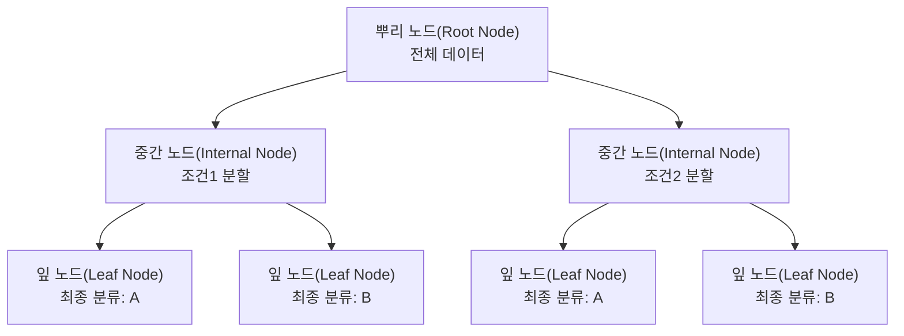

<Callout type="info">
  **이번 문서의 목표:** 의사결정나무가 데이터를 어떤 기준으로 어떻게 쪼개는지 지니지수·엔트로피 계산 전 과정으로 설명하고, 과적합을 막는 가지치기와 CART·C4.5·CHAID의 차이를 구분할 수 있다.
</Callout>

## 의사결정나무란 무엇인가

### 왜 필요한가

20편에서 분류(classification)는 범주형 종속변수를 예측하는 지도학습 기법이라고 배웠다. 분류를 하는 방법은 여러 가지지만, 그중 가장 직관적인 방법은 "질문을 계속 던지면서 데이터를 좁혀나가는 것"이다. 예를 들어 병원에서 새 환자가 당뇨병 위험군인지 판단할 때, "공복 혈당이 126 이상인가?" → "예"면 "체질량지수가 25 이상인가?" → 이런 식으로 질문(=조건)을 이어가며 최종 판정에 도달하는 방식이 바로 **의사결정나무**(decision tree)다.

> **쉽게 말하면:** 의사결정나무는 스무고개처럼 예/아니오 질문을 반복해 데이터를 그룹으로 나누어 가는 분류 기법이다.

### 정의와 용어

**의사결정나무**(decision tree)는 데이터를 특정 기준으로 반복해서 분할해 나가는 나무 모양의 구조로 분류(또는 회귀) 규칙을 표현하는 기법이다. 나무는 위에서 아래로 뒤집힌 형태로 그린다.

| 용어 | 영문 | 의미 |
|---|---|---|
| 뿌리 노드 | root node | 나무의 맨 위, 분할이 시작되는 전체 데이터 |
| 중간 노드 | internal node | 뿌리와 잎 사이에서 한 번 더 분할되는 노드 |
| 가지 | branch | 노드와 노드를 연결하는 선, 하나의 분할 조건에 대응 |
| 잎 노드(끝 노드) | leaf node, terminal node | 더 이상 분할되지 않는 최종 노드, 여기서 분류 결과가 확정된다 |
| 깊이 | depth | 뿌리 노드부터 특정 노드까지의 단계 수 |

의사결정나무를 만드는 핵심 작업은 "각 노드에서 어떤 변수의 어떤 기준값으로 쪼개야 가장 잘 나뉘는가"를 정하는 것이다. 이때 "잘 나뉜다"는 것은 분할 후 각 자식 노드에 **한 범주의 데이터만 최대한 모이는 것**을 뜻한다. 이 순수한 정도를 측정하는 지표가 바로 다음 절에서 다룰 **불순도**(impurity)다.

## 분리 기준: 지니지수와 엔트로피

### 왜 필요한가

한 노드 안에 두 범주(예: 합격/불합격)가 섞여 있을 때, 이 섞인 정도를 숫자로 표현할 수 있어야 "어떤 방식으로 쪼갤 때 더 잘 나뉘는가"를 컴퓨터가 비교할 수 있다. 이 섞인 정도(불순도)를 측정하는 대표적인 두 지표가 **지니지수**(Gini index)와 **엔트로피**(entropy)다. **두 지표 모두 값이 작을수록 노드가 순수하다**는 공통점이 있으며, 나무는 분할 전후로 이 불순도가 가장 많이 줄어드는 분할 기준을 선택한다.

> **쉽게 말하면:** 지니지수와 엔트로피는 "이 바구니 안에 서로 다른 과일이 얼마나 섞여 있는가"를 숫자로 나타낸 것이다. 한 종류만 있으면 0, 여러 종류가 반반씩 섞이면 값이 최대가 된다.

### 지니지수의 정의와 계산

**지니지수**(Gini index, 지니계수)는 한 노드에서 임의로 데이터 2개를 뽑았을 때, 둘의 범주가 서로 다를 확률로 정의된다.

$$
Gini = 1 - \sum_{i=1}^{k} p_i^2
$$

- $Gini$: 해당 노드의 지니지수
- $k$: 범주(클래스)의 개수
- $p_i$: 해당 노드에서 범주 $i$가 차지하는 비율(확률)

이진 분류(범주가 2개)일 때 지니지수는 모든 데이터가 한 범주에 쏠리면(완전 순수) 최솟값 0을, 두 범주가 정확히 반반씩 섞이면 최댓값 0.5를 갖는다.

**작은 예시로 직접 계산해보자.** 어느 노드에 데이터 10개가 있고, 이 중 범주 A가 6개, 범주 B가 4개 있다고 하자.

$$
p_A = \frac{6}{10} = 0.6, \quad p_B = \frac{4}{10} = 0.4
$$

이 비율을 지니지수 공식에 대입한다.

$$
Gini = 1 - (0.6^2 + 0.4^2) = 1 - (0.36 + 0.16) = 1 - 0.52 = 0.48
$$

**검산**: $0.6^2 = 0.36$, $0.4^2 = 0.16$이고 두 값을 더하면 $0.36 + 0.16 = 0.52$, $1 - 0.52 = 0.48$이다. 계산이 맞다. 이 노드의 지니지수는 0.48로, 이진 분류의 이론적 최댓값인 0.5에 가까운 값이다. 즉 A와 B가 6:4로 상당히 고르게 섞여 있어 불순도가 높은(순수하지 않은) 노드라고 해석한다.

### 엔트로피의 정의와 계산

**엔트로피**(entropy)는 정보이론(information theory)에서 가져온 개념으로, 정보의 불확실성(무질서도)을 측정하는 지표다.

$$
Entropy = -\sum_{i=1}^{k} p_i \log_2(p_i)
$$

- $Entropy$: 해당 노드의 엔트로피
- $p_i$: 범주 $i$가 차지하는 비율
- $\log_2$: 밑이 2인 로그(정보를 이진수 비트 단위로 측정하기 위해 밑을 2로 사용한다)

이진 분류에서 엔트로피는 한 범주로 완전히 쏠리면 최솟값 0을, 두 범주가 정확히 반반씩 섞이면 최댓값 1을 갖는다.

**같은 예시(A 6개, B 4개, 총 10개)로 엔트로피를 계산해보자.** 먼저 $\log_2(0.6)$과 $\log_2(0.4)$의 값을 구해야 한다. $\log_2(x) = \ln(x) / \ln(2)$ 관계를 이용하면 $\log_2(0.6) \approx -0.737$, $\log_2(0.4) \approx -1.322$이다.

$$
Entropy = -(0.6 \times \log_2 0.6 + 0.4 \times \log_2 0.4)
$$

이제 로그값을 대입해 계산을 마무리한다.

$$
Entropy = -(0.6 \times (-0.737) + 0.4 \times (-1.322)) = -(-0.442 - 0.529) = 0.971
$$

**검산**: $0.6 \times (-0.737) = -0.4422$, $0.4 \times (-1.322) = -0.5288$이며 둘을 더하면 $-0.4422 + (-0.5288) = -0.971$이다. 여기에 마이너스 부호를 붙이면 $0.971$이 된다. 계산이 맞다. 이 노드의 엔트로피는 0.971로, 이론적 최댓값 1에 매우 가깝다. 지니지수(0.48)가 최댓값 0.5에 가까웠던 것과 같은 결론 — "이 노드는 거의 반반으로 섞여 매우 불순하다" — 을 보여준다.

<Callout type="warning">
  **자주 틀리는 점**: 지니지수와 엔트로피 모두 "**값이 작을수록 순수하다**"는 방향을 반대로 기억하는 실수가 잦다. "값이 클수록 노드의 순수도가 높다"는 보기는 항상 오답이다. 또한 "지니지수의 이진 분류 최댓값은 1이다"라는 보기도 자주 나오는 함정인데, 이진 분류에서 지니지수의 최댓값은 **0.5**이고, 엔트로피의 최댓값이 **1**이다. 두 지표의 최댓값을 서로 바꿔치기하지 않도록 주의해야 한다. 마지막으로 "지니지수는 로그 함수를 사용한다"는 보기도 오답이다 — **로그를 사용하는 쪽은 엔트로피**이며, 지니지수는 비율의 제곱만 사용한다.
</Callout>

### 정보이득: 분할 전후 비교

**정보이득**(information gain)은 분할 전 불순도에서, 분할 후 각 자식 노드의 불순도를 데이터 개수 비율로 가중평균한 값을 뺀 것이다. 정보이득이 클수록 그 분할이 불순도를 많이 줄인, 즉 더 좋은 분할이라는 뜻이다.

$$
IG = Impurity_{parent} - \sum_{j} \frac{n_j}{n} \times Impurity_{j}
$$

- $IG$: 정보이득(Information Gain)
- $Impurity_{parent}$: 분할 전 부모 노드의 불순도(지니지수 또는 엔트로피)
- $n_j$: 분할 후 $j$번째 자식 노드의 데이터 개수
- $n$: 분할 전 전체 데이터 개수
- $Impurity_j$: $j$번째 자식 노드의 불순도

**앞의 예시를 이어서 계산해보자.** 부모 노드(A 6개, B 4개, 총 10개)를 어떤 변수 기준으로 두 자식 노드로 나눈 결과, 왼쪽 자식 노드에는 A 4개·B 1개(총 5개), 오른쪽 자식 노드에는 A 2개·B 3개(총 5개)로 나뉘었다고 하자.

먼저 왼쪽 자식 노드의 지니지수를 구한다. 비율은 $p_A = 4/5 = 0.8$, $p_B = 1/5 = 0.2$이다.

$$
Gini_{left} = 1 - (0.8^2 + 0.2^2) = 1 - (0.64 + 0.04) = 0.32
$$

다음으로 오른쪽 자식 노드의 지니지수를 구한다. 비율은 $p_A = 2/5 = 0.4$, $p_B = 3/5 = 0.6$이다.

$$
Gini_{right} = 1 - (0.4^2 + 0.6^2) = 1 - (0.16 + 0.36) = 0.48
$$

두 자식 노드를 데이터 개수 비율(각각 5/10)로 가중평균한다.

$$
Gini_{split} = \frac{5}{10} \times 0.32 + \frac{5}{10} \times 0.48 = 0.16 + 0.24 = 0.40
$$

마지막으로 분할 전 지니지수(0.48)에서 분할 후 가중평균 지니지수(0.40)를 뺀다.

$$
IG_{Gini} = 0.48 - 0.40 = 0.08
$$

**검산**: $0.5 \times 0.32 = 0.16$, $0.5 \times 0.48 = 0.24$, $0.16+0.24=0.40$이 맞고, $0.48-0.40=0.08$도 맞다. 즉 이 분할은 지니지수를 0.48에서 0.40으로, 0.08만큼 낮춰 노드를 더 순수하게 만들었다. 정보이득이 0보다 크므로 이 분할은 의미가 있다(정보이득이 0이라면 분할 전후 불순도가 동일해 나눈 효과가 없다는 뜻이다).

같은 방식으로 엔트로피 기준의 정보이득도 확인해보자. 왼쪽 자식($p_A=0.8, p_B=0.2$)의 엔트로피는 $\log_2 0.8 \approx -0.322$, $\log_2 0.2 \approx -2.322$를 대입하면 다음과 같다.

$$
Entropy_{left} = -(0.8 \times (-0.322) + 0.2 \times (-2.322)) = -(-0.258 - 0.464) = 0.722
$$

오른쪽 자식($p_A=0.4, p_B=0.6$)의 비율은 부모 노드와 같은 6:4 구성이 뒤집힌 형태이므로, 엔트로피는 앞서 구한 부모 노드의 엔트로피와 같은 0.971이다(엔트로피 공식은 비율의 순서를 바꿔도 값이 같다).

두 자식을 가중평균하면 다음과 같다.

$$
Entropy_{split} = \frac{5}{10} \times 0.722 + \frac{5}{10} \times 0.971 = 0.361 + 0.486 = 0.847
$$

$$
IG_{Entropy} = 0.971 - 0.847 = 0.124
$$

**검산**: $0.5 \times 0.722 = 0.361$, $0.5 \times 0.971 = 0.4855 \approx 0.486$, 합이 $0.847$이고, $0.971 - 0.847 = 0.124$가 맞다. 지니지수 기준 정보이득(0.08)과 엔트로피 기준 정보이득(0.124)은 절대적인 값은 다르지만, 둘 다 "이 분할이 불순도를 줄이는 데 효과가 있었다"는 같은 결론을 보여준다. 실제 알고리즘은 여러 후보 변수·기준값에 대해 이런 정보이득을 전부 계산해 비교한 뒤, **정보이득이 가장 큰 분할을 선택**한다.

## 분리 기준 3종 비교: 지니지수·엔트로피·카이제곱

### 왜 필요한가

의사결정나무를 만드는 구체적인 알고리즘은 여러 종류가 있는데, 이들의 가장 큰 차이는 "노드를 나눌 때 어떤 불순도 지표를 쓰는가"이다. 어떤 알고리즘이 어떤 기준을 쓰는지는 ADsP 시험에서 회차마다 빠지지 않고 나오는 단골 문항이다.

> **쉽게 말하면:** 같은 목적(가장 잘 나뉘는 분할 찾기)을 다른 잣대(지니지수, 엔트로피, 카이제곱)로 재는 것이 CART·C4.5·CHAID의 차이다.

### 정의

| 알고리즘 | 분리 기준(분류나무) | 특징 |
|---|---|---|
| CART (Classification And Regression Tree) | 지니지수(분류), 분산 감소(회귀) | 항상 **이진분할**(한 노드를 정확히 2개로만 분할)만 수행. 분류·회귀 모두 지원 |
| C4.5 (및 후속 C5.0) | 엔트로피 기반 **정보이득비**(gain ratio) | 다지분할(한 노드를 3개 이상으로도 분할) 가능. 정보이득이 특정 변수의 범주 개수에 유리하게 쏠리는 편향을 정보이득비로 보정 |
| CHAID (Chi-squared Automatic Interaction Detection) | **카이제곱 통계량**(범주형), F-통계량(연속형) | 통계적 유의성 검정을 기반으로 분할. 다지분할 가능하며 사전 가지치기(정지 규칙) 방식을 주로 사용 |

세 알고리즘 모두 "어느 노드가 가장 불순도를 많이 줄이는가"를 판단한다는 목적은 같지만, 그 판단에 쓰는 통계량이 다르다는 점, 그리고 CART는 이진분할만 가능하다는 점이 시험에서 반복 출제되는 핵심 구분점이다. 46편 기출에서 확인한 것처럼, "잔차 제곱합"은 **회귀나무**의 분할 기준이고 분류나무의 기준(지니지수·엔트로피·카이제곱)과는 구분해야 한다.

<Callout type="warning">
  **자주 틀리는 점 (46회 기출)**: "의사결정나무에서 가지치기 시 평가기준으로 사용되기 어려운 것"을 묻는 문항에서, 지니지수·엔트로피·카이제곱 통계량은 모두 분류나무의 정상적인 기준이고, **잔차 제곱합**만 회귀나무의 기준이라 분류 관점에서는 답이 된다. 알고리즘과 기준을 짝짓는 문제뿐 아니라, 나무의 종류(분류나무·회귀나무)와 기준을 짝짓는 문제도 함께 대비해야 한다.
</Callout>

## 가지치기와 과적합

### 왜 필요한가

20편에서 배운 과적합(overfitting) 개념이 의사결정나무에서 가장 두드러지게 나타난다. 나무를 계속 뻗어나가 잎 노드마다 데이터가 1~2개만 남을 때까지 분할하면, 학습 데이터에 대해서는 거의 완벽한(심지어 100퍼센트) 정확도를 만들 수 있다. 하지만 이는 학습 데이터의 사소한 잡음(noise)까지 나무 구조로 암기해버린 것이라, 새로운 데이터에는 오히려 성능이 떨어진다. 이를 방지하는 절차가 **가지치기**(pruning)다.

> **쉽게 말하면:** 가지치기는 정원사가 나무를 너무 무성하게 자라지 않도록 잔가지를 잘라내, 전체적으로 더 튼튼하고 보기 좋은 나무로 다듬는 것과 같다.

### 정의

**가지치기**(pruning)는 지나치게 세분화된 나무의 불필요한 가지·노드를 제거해 나무를 단순화하는 절차다. 가지치기의 목적은 학습 데이터에서의 정확도를 높이는 것이 **아니라**, 오히려 학습 데이터 정확도를 약간 희생하더라도 새로운 데이터에서의 **일반화 성능**을 높이는 것이다.

가지치기는 크게 두 방식으로 나뉜다.

- **사전 가지치기**(pre-pruning): 나무를 만드는 도중에 "최대 깊이", "잎 노드의 최소 데이터 개수" 같은 정지 규칙(stopping rule)을 미리 정해, 그 조건에 도달하면 더 이상 분할하지 않는 방식. CHAID가 주로 이 방식을 쓴다.
- **사후 가지치기**(post-pruning): 일단 나무를 최대한 끝까지 키운 뒤, 검증 데이터를 이용해 성능에 큰 도움이 안 되는 가지를 거꾸로 잘라내는 방식. CART가 주로 이 방식(비용-복잡도 가지치기 등)을 쓴다.

과적합과 가지치기의 관계는 다음과 같이 연결된다. 나무의 최종 노드(잎 노드)가 많고 깊이가 깊을수록, 나무는 학습 데이터의 세세한 패턴(잡음 포함)까지 반영하게 되어 과적합 위험이 커진다. 가지치기로 나무를 단순화하면 학습 데이터에 대한 정확도는 다소 낮아질 수 있지만, 새로운 데이터에서의 일반화 성능은 오히려 높아진다. 즉 "학습 데이터 정확도"와 "일반화 성능"은 나무의 복잡도에 따라 트레이드오프(trade-off, 하나를 얻으려면 다른 하나를 어느 정도 포기해야 하는 관계) 관계에 있으며, 가지치기는 이 균형점을 찾는 작업이다.

<Callout type="warning">
  **자주 틀리는 점 (45회 기출)**: "가지치기를 통해 학습 데이터 세트에서의 정확도를 높이는 것이 주목적이다"라는 보기가 오답으로 나온다. 가지치기의 진짜 목적은 학습 데이터 정확도가 아니라 **일반화 성능(새 데이터에 대한 예측력) 향상**이다. 이 함정은 "가지치기 = 정확도 향상"이라는 직관적이지만 틀린 연결을 노린다.
</Callout>

## 의사결정나무의 장단점

의사결정나무는 결과가 "만약 소득이 3천만 원 이상이고, 신용점수가 700점 이상이면 대출 승인"처럼 IF-THEN 규칙으로 표현되어 **사람이 직접 눈으로 보고 이해할 수 있다**. 이런 특성 때문에 내부 작동 원리를 알 수 없는 **블랙박스**(black box) 모형(예: 인공신경망)과 대비해 **화이트박스**(white box) 모형으로 분류된다.

| 구분 | 내용 |
|---|---|
| 장점 | 결과 해석이 쉽고 직관적이다(화이트박스). 수치형·범주형 변수를 모두 다룰 수 있다. 변수의 척도(단위)를 맞추는 전처리(정규화 등)가 크게 필요 없다 |
| 단점 | 나무가 깊어지면 과적합에 취약하다. 데이터가 조금만 바뀌어도 나무 구조 자체가 크게 달라질 수 있어(불안정성) 다른 모형보다 예측 성능이 떨어질 수 있다 |

이 단점을 보완하기 위해 여러 개의 나무를 결합하는 **앙상블**(ensemble) 기법(배깅·부스팅·랜덤포레스트)이 등장했으며, 22편에서 자세히 다룬다.

## 핵심 정리

- 의사결정나무는 뿌리 노드에서 시작해 조건에 따라 반복 분할하며, 잎 노드에서 최종 분류가 확정되는 화이트박스 모형이다.
- 지니지수와 엔트로피는 모두 노드의 불순도를 측정하며, 값이 작을수록 노드가 순수하다.
- 정보이득은 분할 전 불순도에서 분할 후 가중평균 불순도를 뺀 값이며, 정보이득이 클수록 좋은 분할이다.
- CART는 지니지수(분류)·분산 감소(회귀)를 쓰고 이진분할만 가능하며, C4.5는 엔트로피 기반 정보이득비를 쓰고, CHAID는 카이제곱 통계량을 쓴다.
- 가지치기는 학습 데이터 정확도가 아니라 일반화 성능을 높이기 위해, 지나치게 복잡해진 나무를 단순화하는 절차다.

## 마무리 복습

<Quiz
  questionNumber={1}
  question="어느 노드에 범주 A가 6개, 범주 B가 4개(총 10개) 있을 때, 이 노드의 지니지수는?"
  options={['0.24', '0.48', '0.52', '0.96']}
  correctAnswer={2}
  explanation="p_A=0.6, p_B=0.4를 지니지수 공식 1-(p_A^2+p_B^2)에 대입하면 1-(0.36+0.16)=1-0.52=0.48이다."
  optionExplanations={['제곱을 합산하는 과정에서 계산을 잘못한 값이다', '1-(0.36+0.16)=0.48을 정확히 계산한 값이므로 정답이다', '이는 1에서 빼기 전의 중간값(0.36+0.16)이다', '이는 0.48의 2배로, 계산 과정에서 실수한 값이다']}
/>

<Quiz
  questionNumber={2}
  question="위와 같은 노드(A 6개, B 4개)의 엔트로피 값에 가장 가까운 것은? (단 log2(0.6)≈-0.737, log2(0.4)≈-1.322)"
  options={['0.48', '0.72', '0.97', '1.32']}
  correctAnswer={3}
  explanation="-(0.6×(-0.737)+0.4×(-1.322))=-(-0.442-0.529)=0.971로, 약 0.97에 해당한다."
  optionExplanations={['0.48은 같은 노드의 지니지수 값이다', '0.72는 이 예시에서 왼쪽 자식 노드(4:1)의 엔트로피 값이다', '엔트로피 계산 결과 0.971에 가장 가까운 값이므로 정답이다', '1.32는 log2(0.4)의 절댓값에 가까운 값으로 엔트로피 결과가 아니다']}
/>

<Quiz
  questionNumber={3}
  question="지니지수와 엔트로피에 대한 설명으로 가장 적절한 것은?"
  options={['두 지표 모두 값이 클수록 노드가 순수하다', '이진 분류에서 지니지수의 최댓값은 1이다', '두 지표 모두 값이 작을수록 노드가 순수하며 분할 기준으로 사용된다', '지니지수는 로그 함수를 사용하고 엔트로피는 사용하지 않는다']}
  correctAnswer={3}
  explanation="지니지수와 엔트로피는 모두 값이 작을수록 노드가 순수함을 의미하며, 이 값이 최대한 줄어드는 방향으로 분할 기준을 선택한다."
  optionExplanations={['값이 작을수록 순수하다는 것이 올바른 방향이다', '이진 분류에서 지니지수의 최댓값은 0.5이다', '두 지표의 방향성과 용도에 대한 정확한 설명이므로 정답이다', '로그 함수를 사용하는 쪽은 엔트로피이며 지니지수는 사용하지 않아 설명이 반대로 되어 있다']}
/>

<Quiz
  questionNumber={4}
  question="부모 노드의 지니지수가 0.48이고, 분할 후 가중평균 지니지수가 0.40이라면 이 분할의 정보이득은?"
  options={['0.08', '0.40', '0.48', '0.88']}
  correctAnswer={1}
  explanation="정보이득은 분할 전 불순도에서 분할 후 가중평균 불순도를 뺀 값이므로 0.48-0.40=0.08이다."
  optionExplanations={['0.48-0.40=0.08을 정확히 계산한 값이므로 정답이다', '0.40은 분할 후 가중평균 지니지수 자체이지 정보이득이 아니다', '0.48은 분할 전 지니지수 자체이지 정보이득이 아니다', '두 값을 더한 값으로, 정보이득 계산법을 뺄셈 대신 덧셈으로 잘못 적용한 값이다']}
/>

<Quiz
  questionNumber={5}
  question="CART, C4.5, CHAID 알고리즘의 분리 기준을 짝지은 것으로 옳은 것은?"
  options={['CART-카이제곱, C4.5-지니지수, CHAID-정보이득비', 'CART-지니지수, C4.5-정보이득비(엔트로피 기반), CHAID-카이제곱 통계량', 'CART-정보이득비, C4.5-카이제곱, CHAID-지니지수', 'CART, C4.5, CHAID 모두 동일하게 지니지수만 사용한다']}
  correctAnswer={2}
  explanation="CART는 지니지수(분류)를, C4.5는 엔트로피 기반 정보이득비를, CHAID는 카이제곱 통계량을 분리 기준으로 사용한다."
  optionExplanations={['세 알고리즘과 기준이 서로 뒤바뀌어 짝지어졌다', 'CART-지니지수, C4.5-정보이득비, CHAID-카이제곱의 올바른 조합이므로 정답이다', '세 알고리즘과 기준이 서로 뒤바뀌어 짝지어졌다', '세 알고리즘은 서로 다른 분리 기준을 사용하므로 옳지 않다']}
/>

<Quiz
  questionNumber={6}
  question="CART 알고리즘의 분할 방식에 대한 설명으로 가장 적절한 것은?"
  options={['한 노드를 항상 3개 이상으로 분할하는 다지분할만 수행한다', '한 노드를 정확히 2개로만 분할하는 이진분할만 수행한다', '분류와 회귀 중 회귀나무만 만들 수 있다', '카이제곱 통계량을 기준으로 분할한다']}
  correctAnswer={2}
  explanation="CART(Classification And Regression Tree)는 분류·회귀 모두 지원하지만, 분할 방식은 항상 한 노드를 정확히 2개로 나누는 이진분할만 수행한다."
  optionExplanations={['CART는 다지분할이 아니라 이진분할만 수행한다', 'CART의 이진분할 특성에 대한 정확한 설명이므로 정답이다', 'CART는 이름 그대로 분류(Classification)와 회귀(Regression) 나무를 모두 만들 수 있다', '카이제곱 통계량은 CHAID의 분리 기준이다']}
/>

<Quiz
  questionNumber={7}
  question="가지치기(pruning)의 주된 목적으로 가장 적절한 것은?"
  options={['학습 데이터에서의 정확도를 최대한 높이는 것', '나무의 깊이를 무한히 늘려 세밀한 규칙을 만드는 것', '과적합을 줄이고 새로운 데이터에 대한 일반화 성능을 높이는 것', '지니지수 계산 없이도 나무를 만들 수 있게 하는 것']}
  correctAnswer={3}
  explanation="가지치기는 지나치게 복잡해진 나무의 가지를 제거해 과적합을 줄이고, 새로운 데이터에 대한 일반화 성능을 향상시키는 것이 목적이다."
  optionExplanations={['학습 데이터 정확도 향상이 목적이라면 나무를 오히려 더 키워야 하므로 가지치기의 목적과 반대된다', '나무를 무한히 늘리는 것은 가지치기와 반대되는 방향이다', '가지치기의 정확한 목적이므로 정답이다', '가지치기는 분리 기준 계산 여부와는 무관한 절차다']}
/>

<Quiz
  questionNumber={8}
  question="의사결정나무가 화이트박스(white box) 모형으로 분류되는 이유로 가장 적절한 것은?"
  options={['항상 인공신경망보다 예측 정확도가 높기 때문이다', 'IF-THEN 규칙으로 표현되어 결과 과정을 직관적으로 이해할 수 있기 때문이다', '결측치 처리가 전혀 필요 없기 때문이다', '항상 이진분할만 수행하기 때문이다']}
  correctAnswer={2}
  explanation="의사결정나무는 분류 결과가 IF-THEN 형태의 규칙으로 표현되어 사람이 그 과정을 눈으로 보고 이해할 수 있기 때문에 화이트박스 모형으로 분류된다."
  optionExplanations={['화이트박스 여부는 예측 정확도가 아니라 해석 가능성과 관련된 개념이다', '해석 가능성이 화이트박스로 분류되는 정확한 이유이므로 정답이다', '결측치 처리 필요 여부는 화이트박스 개념과 직접 관련이 없다', '이진분할은 CART만의 특성이며 화이트박스 여부와는 무관하다']}
/>

## 참고 자료

- [scikit-learn 대응 개념 문서 - Decision Trees](https://scikit-learn.org/stable/modules/tree.html)
- [데이터자격시험 - ADsP 출제기준](https://www.dataq.or.kr/www/sub/a_06.do)
