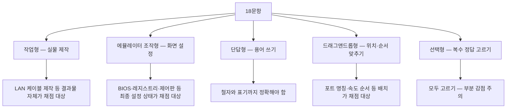
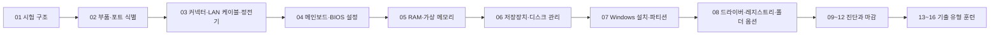

<Callout type="info">
  **이번 문서의 목표:** 이 파일을 다 읽으면 PC정비사 2급 실기가 어떤 유형의 문항으로 구성되는지, 각 유형에서 "정답"이 화면의 어느 지점에 있는지, 그리고 80분을 어떻게 쪼개 써야 하는지를 스스로 설계할 수 있습니다.
</Callout>

## 왜 실기 공부는 필기 공부와 완전히 다른가

필기 시험은 "안다"를 묻습니다. RAID 5가 무엇인지, UEFI가 무엇인지 골라내면 점수가 됩니다.
실기 시험은 **"한다"를 묻습니다.** 알고 있어도 그 값을 **어느 창의 어느 탭에 어떤 순서로 입력하는지** 손이 기억하지 못하면 0점입니다.

이 차이를 실감할 수 있는 예를 하나 보겠습니다. 다음 두 문장은 지식 수준이 완전히 다릅니다.

- 필기 수준: "Cortana를 끄려면 그룹 정책이나 레지스트리를 수정한다."
- 실기 수준: `HKEY_LOCAL_MACHINE\SOFTWARE\Policies\Microsoft\Windows\Windows Search` 키에서 `AllowCortana` 라는 이름의 DWORD(32비트) 값을 만들고 데이터를 `0` 으로 입력한 뒤 확인을 누른다.

실기에서 점수를 주는 것은 두 번째 문장입니다. 키 경로의 철자 하나, 값 이름의 대소문자, 값 형식이 DWORD인지 문자열인지, 데이터가 `0` 인지 `1` 인지 — 이 네 가지가 전부 맞아야 한 문항이 완성됩니다.

> **쉽게 말하면:** 실기는 "무엇을 아는가"가 아니라 "어느 화면에서 어떤 값을 넣는가"를 묻는 시험입니다.

그래서 이 교재 전체는 개념을 설명한 뒤 반드시 **정확한 경로와 값**으로 끝맺습니다. 개념은 그 값을 잊지 않게 붙잡아 주는 손잡이일 뿐, 채점표에 적히는 것은 값입니다.

## 1. 시험의 형식 — 숫자로 먼저 잡기

PC정비사 2급은 한국정보통신자격협회(ICQA, Institute of Communication and Qualification Assessment)가 시행하는 국가공인 자격입니다. 필기 합격 후 실기를 치르며, 실기의 운영 형식은 다음과 같습니다.

| 항목 | 내용 | 실기 대응 |
|------|------|-----------|
| 시험 시간 | 80분 | 1문항 평균 4분 20초 남짓 |
| 문항 수 | 18문항 | 유형이 섞여 출제 |
| 출제 형식 | 작업형·에뮬레이터 조작형·단답형·드래그앤드롭형·선택형 | 유형마다 채점 방식이 다름 |
| 합격 기준 | 100점 만점 60점 이상 | 버릴 문항을 고르는 전략이 유효 |
| 준비물 | 신분증, 수험표, 지참 공구(LAN Tool 등) | 공구 미지참은 작업형 전면 0점 |

여기서 가장 먼저 체감해야 할 숫자는 **1문항당 4분 20초**입니다. LAN 케이블을 한 가닥 제작하는 데 익숙한 사람도 5분 안팎이 걸립니다. 즉 **한 문항이라도 헤매기 시작하면 뒤가 전부 밀립니다.** 실기 준비의 절반은 지식이고 나머지 절반은 속도입니다.

## 2. 문항 유형 다섯 가지 — 각 유형의 "정답이 놓인 자리"

실기 문항은 겉보기에 열여덟 개가 제각각이지만, 채점 방식으로 묶으면 딱 다섯 종류입니다. 유형을 구분하는 능력 자체가 점수입니다. 유형을 알면 "이 문항에서 채점자가 볼 지점"이 어디인지 바로 보이기 때문입니다.

### 유형 ① 작업형 — 결과물이 곧 답

지참한 공구로 실물을 만들어 제출하는 유형입니다. 대표적으로 **LAN 케이블 제작**이 나옵니다. 지참한 LAN Tool(랜툴, 압착 공구)과 UTP(Unshielded Twisted Pair, 비차폐 꼬임쌍선) 케이블, RJ-45 잭으로 지정된 규격의 케이블을 만듭니다.

여기서 채점자가 보는 것은 세 가지입니다.

1. **배선 순서** — 잭을 투명한 쪽에서 들여다봤을 때 8가닥의 색 순서가 규격과 일치하는가.
2. **물리적 완성도** — 피복이 잭 안쪽까지 물려 압착되었는가, 심선이 잭 끝까지 닿았는가.
3. **케이블 종류 선택** — 문제가 요구한 것이 다이렉트인지 크로스인지.

배선 순서는 이 교재 03편에서 8핀 표로 완전히 외웁니다. 지금은 "**작업형은 만든 물건 자체가 답안지**"라는 점만 기억하면 됩니다. 답안지에 글로 아무리 잘 써도, 케이블 색 순서가 틀리면 0점입니다.

### 유형 ② 에뮬레이터 조작형 — 최종 상태가 답

실기의 몸통입니다. 실제 Windows가 아니라 시험용으로 만든 **에뮬레이터**(emulator, 흉내내는 프로그램) 화면이 뜨고, 그 안에서 BIOS 설정·레지스트리 편집기·제어판·디스크 관리·서비스 관리자 같은 도구를 조작합니다.

에뮬레이터는 실제 시스템을 바꾸지 않고 **"당신이 이 화면에서 어떤 선택을 했는가"만 기록**합니다. 그래서 채점 대상은 조작 과정이 아니라 **마지막에 남은 상태**입니다. 여기서 초심자가 가장 많이 잃는 점수가 나옵니다.

<Callout type="warning">
  **가장 흔한 감점 원인:** 값을 올바르게 입력하고도 `[설정]`, `[적용]`, `[확인]` 버튼을 누르지 않고 다음 문항으로 넘어가는 것. 입력란에 글자가 보이는 것과, 그 값이 적용된 것은 완전히 다릅니다. 특히 가상 메모리 설정 창의 `[설정]` 버튼은 누르지 않으면 입력값이 그대로 증발합니다.
</Callout>

에뮬레이터 조작형에서 반복 출제되는 도구는 다음과 같고, 각각을 이 교재의 어느 편에서 다루는지 함께 적었습니다.

| 도구 | 실행 방법 | 대표 과제 | 다루는 편 |
|------|-----------|-----------|-----------|
| BIOS/UEFI 설정 | 부팅 중 `Del` 또는 `F2` | 특정 항목을 Enabled로 변경 | 04편 |
| 레지스트리 편집기 | `regedit` | 키 경로 이동 후 값 생성·수정 | 08편 |
| 성능 옵션 · 가상 메모리 | `sysdm.cpl` | 페이징 파일 크기 지정 | 05편 |
| 디스크 관리 | `diskmgmt.msc` | 비할당 공간 파티션 분할 | 06편 |
| 폴더 옵션 | 탐색기 `[보기]` 메뉴 | 숨김 파일 표시 여부, 검색 옵션 | 08편 |
| 서비스 관리자 | `services.msc` | 특정 서비스 중지·사용 안 함 | 10편 |
| 원격 데스크톱 연결 | `mstsc` | 주소·사용자·리소스 옵션 지정 | 11편 |
| 로컬 보안 정책 | `secpol.msc` | 암호 정책·계정 잠금 정책 | 12편 |

이 표가 사실상 실기 시험의 지도입니다. 왼쪽 열의 여덟 개 도구를 눈 감고도 열 수 있고, 각 도구 안에서 탭 이름을 헷갈리지 않으면 에뮬레이터 조작형은 거의 다 맞습니다.

### 유형 ③ 단답형 — 철자가 채점 기준

용어를 직접 적는 유형입니다. 기출을 보면 macOS의 최신 파일 시스템, 번개 아이콘의 다용도 단자, DirectX 진단 도구 실행 명령어처럼 **"설명을 읽고 이름을 떠올리는"** 형태로 나옵니다.

단답형의 함정은 지식이 아니라 표기입니다.

- 한글로 써도 되는가, 영문 약어로 써야 하는가 — 문제에 지시가 없으면 **널리 통용되는 표기**로 씁니다. 예를 들어 썬더볼트(Thunderbolt)처럼 한글 표기가 일반적인 것은 한글로, `dxdiag` 처럼 명령어는 반드시 영문 소문자로 씁니다.
- 명령어는 확장자를 붙이지 않아도 됩니다. `dxdiag` 로 충분합니다.
- 약어는 풀어 쓰지 않아도 되지만, 애매하면 "APFS(Apple File System)"처럼 병기하는 것이 안전합니다.

### 유형 ④ 드래그앤드롭형 — 배치가 답

화면의 항목을 끌어다 제자리에 놓는 유형입니다. 기출에서는 **메인보드 백패널의 I/O 포트에 명칭을 붙이기**, **백업 방식을 속도 순서로 배열하기** 같은 형태로 나왔습니다.

이 유형은 "어느 것이 무엇인지"뿐 아니라 **색과 모양 같은 시각 단서**를 알아야 합니다. USB 2.0 포트는 내부 플라스틱이 검은색, USB 3.0(USB 3.2 Gen1)은 파란색, DisplayPort는 한쪽 모서리가 깎인 비대칭 사각형 — 이런 단서는 02편에서 사진 대신 표와 도식으로 정리합니다.

### 유형 ⑤ 선택형 — "모두 고르시오"의 함정

보기 여러 개 중 **맞는 것을 모두** 고르는 형태가 나옵니다. 기출의 UEFI 문항이 대표적으로, 여섯 개 보기 중 다섯 개가 정답이었습니다.

여기서 초심자가 잃는 점수의 정체는 "**확실한 것만 고르는 소심함**"입니다. 다섯 개가 정답인데 세 개만 고르면 부분 점수도 위태롭습니다. 반대로 확실히 틀린 보기(예: "UEFI는 32비트 운영체제만 지원한다")를 골라내는 훈련이 더 효율적입니다. 즉 **정답을 찾는 시험이 아니라 오답을 지우는 시험**으로 접근합니다.

## 3. 80분을 어떻게 쓸 것인가 — 시간 설계

문항 순서대로 푸는 것은 실기에서 가장 나쁜 전략입니다. 1번이 LAN 케이블 제작인데 여기서 두 번 실패하면 15분이 사라지고, 3분이면 풀 수 있었던 단답형 여섯 개를 못 보고 시험이 끝납니다.

권장 순서는 다음과 같습니다.

<Steps>

### 0~5분: 전체 훑기

문제지를 처음부터 끝까지 넘기며 유형만 확인합니다. 풀지 않습니다. 이때 각 문항 옆에 세 가지 표시 중 하나를 합니다 — `즉답`(단답·선택형 중 아는 것), `절차`(에뮬레이터 조작형), `시간`(작업형·모르는 것).

### 5~15분: 즉답 문항 전부 처리

단답형·선택형·드래그앤드롭형을 먼저 쓸어 담습니다. 이 유형은 알면 30초, 모르면 5분을 써도 모릅니다. 모르면 즉시 넘어가고 표시만 남깁니다.

### 15~50분: 에뮬레이터 조작형 처리

가장 배점이 두텁고 확실히 맞힐 수 있는 구간입니다. 한 문항을 끝낼 때마다 반드시 **적용 버튼을 눌렀는지 소리 내어 확인**합니다.

### 50~70분: 작업형(LAN 케이블) 수행

일부러 뒤로 미룹니다. 손 작업은 실패해도 재료가 남아 있으면 다시 할 수 있지만, 앞에 두면 심리적으로 무너지기 때문입니다. 단, 재료 수량이 제한적이라면 시험 안내에 따라 앞당길 수 있습니다.

### 70~80분: 되돌아보기

미룬 문항을 찍더라도 반드시 채웁니다. 그리고 에뮬레이터 문항을 다시 열어 **설정이 남아 있는지** 눈으로 확인합니다.

</Steps>

이 배분에서 핵심은 "**작업형을 뒤로**"와 "**적용 버튼 확인을 절차에 포함**" 두 가지입니다. 나머지는 개인 속도에 맞춰 조정해도 됩니다.

## 4. 채점자의 눈으로 보기 — 부분 점수는 어디서 갈리는가

실기 채점표는 문항마다 **체크 항목이 여러 개**로 쪼개져 있는 경우가 많습니다. 예를 들어 가상 메모리 문항 하나에도 이런 식으로 항목이 잡힙니다.

| 체크 항목 | 맞았을 때 | 자주 하는 실수 |
|-----------|-----------|----------------|
| 자동 관리 체크 해제 | 사용자 지정 입력이 가능해짐 | 해제하지 않아 입력란이 비활성 |
| 대상 드라이브 선택 | 지정된 드라이브에만 적용 | C 드라이브에 잘못 적용 |
| 처음 크기 값 | 문제에서 준 하한 숫자 | 단위를 GB로 착각해 1 입력 |
| 최대 크기 값 | 문제에서 준 상한 숫자 | 처음과 최대를 뒤집어 입력 |
| 설정 버튼 클릭 | 목록에 값이 반영됨 | 확인만 누르고 종료 |

같은 문항인데도 다섯 개의 독립된 채점점이 있습니다. 즉 "**대충 맞으면 부분 점수"가 아니라 "각 항목이 개별로 맞아야 그만큼 점수**"입니다. 그래서 이 교재는 모든 절차를 `<Steps>`로 쪼개고, 각 단계마다 정확한 값을 명시합니다. 단계를 건너뛰면 그 단계의 점수가 사라지기 때문입니다.

> **쉽게 말하면:** 실기의 점수는 "이해도"가 아니라 "체크 항목을 몇 개 채웠는가"로 계산됩니다.

## 5. 실기에서 요구되는 수행 태도 세 가지

### ① 값을 입력한 뒤 반드시 눈으로 되읽는다

에뮬레이터 입력란은 실제 Windows보다 반응이 둔한 경우가 있어, 타이핑이 한 글자 누락되기 쉽습니다. `1000` 을 입력했는데 `100` 이 들어간 상태로 넘어가면 그 항목은 0점입니다. 입력 후 값을 **소리 없이 다시 읽는 습관**을 들이세요.

### ② 문제의 조건 단어를 밑줄 친다

"D드라이브에", "1000 ~ 2000MB", "백그라운드 서비스에 최적화", "항목만 체크" — 이런 단어 하나가 채점 항목입니다. 특히 "**~만**"이라는 조건은 다른 항목을 전부 해제하라는 뜻입니다. 시각 효과 문항에서 "화면 글꼴의 가장자리 다듬기 항목만 체크"라고 나오면, 기본으로 켜져 있던 나머지 항목을 모두 꺼야 정답입니다.

### ③ 되돌릴 수 없는 조작을 조심한다

디스크 관리 문항에서 이미 만든 볼륨을 지우고 다시 만들면 시간이 두 배로 듭니다. 파티션은 **크기 → 드라이브 문자 → 파일 시스템 → 볼륨 레이블** 순으로 마법사가 진행되므로, 시작 전에 네 값을 문제지에서 먼저 확인한 뒤 한 번에 통과하는 것이 안전합니다.

## 6. 이 교재를 읽는 순서

02·03편은 사물의 이름을 익히는 구간이라 빠르게 지나갈 수 있습니다. **04~08편이 에뮬레이터 조작형의 본체**이므로 여기서 시간을 가장 많이 쓰세요. 09~12편은 진단 사고를 다루며 서술·선택형에 대응합니다. 13~16편은 실제 기출 형식을 재구성한 훈련장입니다.

## 핵심 정리

- PC정비사 2급 실기는 **80분 18문항**이며, 작업형·에뮬레이터 조작형·단답형·드래그앤드롭형·선택형 다섯 유형으로 구성됩니다.
- 채점 대상은 조작 과정이 아니라 **마지막에 남은 설정 상태**이므로, 값을 입력한 뒤 `[설정]`·`[적용]`·`[확인]`을 누르는 것까지가 한 문항입니다.
- 한 문항 안에 여러 개의 독립 채점 항목이 있으므로, 절차를 건너뛰면 그만큼 점수가 사라집니다.
- 시간 전략은 "즉답 먼저 → 에뮬레이터 → 작업형 → 되돌아보기"이며, LAN 케이블 같은 손 작업을 앞에 두지 않습니다.
- 문제의 조건 단어(드라이브 문자, 숫자 범위, "~만") 하나하나가 채점 항목이므로 반드시 표시하며 읽습니다.

## 마무리 복습

<Quiz
  questionNumber={1}
  question="PC정비사 2급 실기 시험의 운영 형식으로 옳은 것은?"
  options={['40분 10문항, 전부 선택형', '80분 18문항, 작업·에뮬레이터·단답·드래그앤드롭·선택형 혼합', '120분 25문항, 전부 실물 조립', '60분 20문항, 서술형만 출제']}
  correctAnswer={2}
  explanation="실기는 80분 동안 18문항을 풀며, 실물을 만드는 작업형과 화면을 조작하는 에뮬레이터형, 그리고 단답·드래그앤드롭·선택형이 섞여 출제됩니다."
  optionExplanations={['시간과 문항 수가 모두 다르며 유형도 선택형만이 아닙니다', '시간, 문항 수, 유형 구성이 모두 실제 운영과 일치합니다', '실물 조립만 하는 형태가 아니라 화면 조작 비중이 더 큽니다', '서술형만 출제되지 않으며 시간과 문항 수도 다릅니다']}
/>

<Quiz
  questionNumber={2}
  question="에뮬레이터 조작형 문항에서 값을 정확히 입력하고도 점수를 잃는 가장 흔한 원인은?"
  options={['입력 속도가 느려서', '설정 버튼이나 적용 버튼을 누르지 않아서', '마우스 대신 키보드를 사용해서', '창을 최대화하지 않아서']}
  correctAnswer={2}
  explanation="에뮬레이터는 최종 설정 상태만 기록하므로, 입력란에 값이 보여도 적용 버튼을 누르지 않으면 반영되지 않아 0점 처리됩니다. 특히 가상 메모리 창의 설정 버튼이 대표적입니다."
  optionExplanations={['속도는 시간 배분 문제이지 해당 문항의 채점 사유가 아닙니다', '적용되지 않은 입력값은 채점 대상 상태에 남지 않습니다', '입력 수단은 채점과 무관합니다', '창 크기는 채점과 무관합니다']}
/>

<Quiz
  questionNumber={3}
  question="문제에 화면 글꼴의 가장자리 다듬기 항목만 체크하라고 명시된 경우 올바른 수행은?"
  options={['해당 항목을 체크하고 나머지는 그대로 둔다', '해당 항목을 체크하고 나머지 항목은 모두 해제한다', '해당 항목만 해제하고 나머지는 체크한다', '최적 성능으로 조정을 선택한다']}
  correctAnswer={2}
  explanation="조건에 쓰인 만이라는 단어는 지정 항목 외 전부를 해제하라는 뜻입니다. 기본으로 켜져 있던 다른 시각 효과가 남아 있으면 감점됩니다."
  optionExplanations={['나머지를 남기면 만이라는 조건을 위반합니다', '지정 항목만 남기는 것이 조건에 부합합니다', '체크 대상을 반대로 이해한 것입니다', '자동 옵션을 고르면 개별 체크 상태를 통제할 수 없습니다']}
/>

<Quiz
  questionNumber={4}
  question="80분 시험에서 LAN 케이블 제작 같은 작업형 문항을 뒤로 미루는 이유로 가장 적절한 것은?"
  options={['작업형은 배점이 없기 때문', '손 작업에서 막히면 남은 문항 전체가 밀리기 때문', '작업형은 채점하지 않기 때문', '공구 사용이 금지되어 있기 때문']}
  correctAnswer={2}
  explanation="작업형은 소요 시간의 편차가 크고 실패 시 재작업이 필요하므로, 확실히 얻을 수 있는 단답형과 에뮬레이터형을 먼저 확보한 뒤 수행하는 것이 안전합니다."
  optionExplanations={['작업형에도 배점이 있습니다', '시간 편차가 큰 유형을 뒤로 미뤄 나머지 점수를 보호합니다', '작업형은 결과물 자체가 채점 대상입니다', '지참 공구 사용은 작업형의 전제입니다']}
/>

<Quiz
  questionNumber={5}
  question="다음 중 에뮬레이터 조작형에서 사용되는 도구와 실행 명령어의 연결이 잘못된 것은?"
  options={['서비스 관리자 — services.msc', '디스크 관리 — diskmgmt.msc', '로컬 보안 정책 — secpol.msc', '레지스트리 편집기 — mstsc']}
  correctAnswer={4}
  explanation="레지스트리 편집기의 실행 명령어는 regedit이며, mstsc는 원격 데스크톱 연결을 실행하는 명령어입니다."
  optionExplanations={['서비스 관리자는 services.msc가 맞습니다', '디스크 관리는 diskmgmt.msc가 맞습니다', '로컬 보안 정책은 secpol.msc가 맞습니다', 'mstsc는 원격 데스크톱 연결이며 레지스트리 편집기는 regedit입니다']}
/>

<Quiz
  questionNumber={6}
  question="맞는 것을 모두 고르는 선택형 문항에 대한 대응으로 가장 효율적인 전략은?"
  options={['확실한 보기 한두 개만 고른다', '명백히 틀린 보기를 소거하고 나머지를 모두 고른다', '보기 개수의 절반을 무작위로 고른다', '가장 긴 보기를 고른다']}
  correctAnswer={2}
  explanation="복수 정답형은 정답 개수가 많은 경우가 잦으므로, 확실히 틀린 보기를 소거하는 방식이 누락으로 인한 실점을 줄입니다."
  optionExplanations={['정답을 누락해 실점할 가능성이 큽니다', '오답 소거는 복수 정답형에서 가장 안정적인 접근입니다', '근거 없는 선택은 감점 위험을 키웁니다', '보기 길이는 정답과 상관이 없습니다']}
/>

<Quiz
  questionNumber={7}
  question="실기 채점에서 한 문항이 여러 개의 체크 항목으로 쪼개져 있다는 사실이 시사하는 학습 방향은?"
  options={['개념만 이해하면 절차는 생략해도 된다', '절차의 각 단계와 정확한 값을 모두 수행해야 한다', '마지막 단계만 정확하면 된다', '문제를 빨리 읽는 연습만 하면 된다']}
  correctAnswer={2}
  explanation="체크 항목이 독립적으로 채점되므로 중간 단계를 건너뛰면 그 항목의 점수가 사라집니다. 절차 전체를 값과 함께 익혀야 합니다."
  optionExplanations={['절차 생략은 곧 체크 항목 누락입니다', '단계별 정확한 값 수행이 점수와 직결됩니다', '중간 단계도 각각 채점됩니다', '읽기 속도만으로는 체크 항목을 채울 수 없습니다']}
/>

## 참고 자료

- [한국정보통신자격협회 - PC정비사 2급](https://www.icqa.or.kr/cn/page/pc)
- [한국정보통신자격협회 - 실기 안내](https://www.icqa.or.kr/cn/page/mil_popup)
- [한국정보통신자격협회 - 시험 공지(실기 시간)](https://www.icqa.or.kr/cn/board/notice/494)
- [한국정보통신자격협회 - 원서접수 안내](https://www.icqa.or.kr/cn/board/notice/528)
