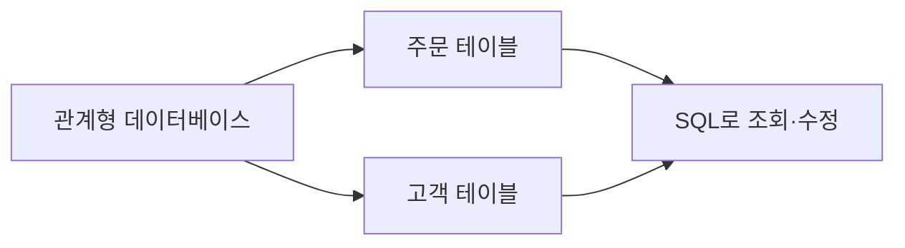

<OneDriveVideo
  title="SQLD 01 학습 영상"
  src="https://1drv.ms/v/c/e113a377499c31ab/IQR35mA7qvsuT4SYCD2YV7b6AdOGt2_QfLZ1n02j_jeOgrg?width=1280&height=720"
/>

<Callout type="info">
  **이번 문서의 목표:** 테이블의 행과 열을 구분하고, 한 행을 정확히 찾는 기본키가 왜 필요한지 설명합니다.
</Callout>

## 주문 목록을 표로 관리하면 생기는 일

온라인 쇼핑몰이 주문 정보를 아래처럼 관리한다고 해 봅시다.

| 주문번호 | 고객명 | 상품명 | 수량 |
| ---: | --- | --- | ---: |
| 101 | 민지 | 키보드 | 1 |
| 102 | 준호 | 모니터 | 2 |
| 103 | 민지 | 마우스 | 1 |

이 표 하나를 **테이블(table)** 이라고 합니다. 관계형 데이터베이스는 이렇게 생긴 테이블을 여러 개 저장하고, 필요한 정보를 SQL로 꺼내 쓰는 방식입니다.



테이블이 여러 개여도 공통된 값으로 연결하면 주문한 고객, 주문한 상품처럼 서로 관련 있는 정보를 함께 찾을 수 있습니다. 이 연결을 나중에 **관계**와 **조인**에서 자세히 다룹니다.

## 행과 열은 무엇이 다를까

| 용어 | 표에서 보는 위치 | 뜻 |
| --- | --- | --- |
| 열(column) | `고객명`, `상품명`, `수량` | 같은 종류의 데이터를 담는 칸 |
| 행(row) | `101, 민지, 키보드, 1` | 한 번의 주문처럼 하나의 대상에 관한 데이터 묶음 |
| 값(value) | `키보드`, `2` | 행과 열이 만나는 실제 데이터 |

`수량` 열에는 숫자만, `고객명` 열에는 이름만 넣는 것처럼 열마다 역할을 정합니다. 이렇게 규칙을 정해 두면 잘못된 값이 들어오는 일을 줄일 수 있습니다.

## 같은 이름만으로는 한 주문을 찾을 수 없다

민지는 주문을 두 번 했습니다. 그래서 `고객명 = 민지`만으로는 어느 주문을 고칠지 알 수 없습니다.

```sql
SELECT 주문번호, 상품명
FROM 주문
WHERE 고객명 = '민지';
```

| 주문번호 | 상품명 |
| ---: | --- |
| 101 | 키보드 |
| 103 | 마우스 |

이처럼 각 행을 다른 행과 겹치지 않게 구분하는 열이 필요합니다. 여기서는 `주문번호`가 그 역할을 합니다.

## 기본키는 행의 주민등록번호 같은 역할이다

**기본키(primary key)** 는 테이블 안에서 행 하나를 유일하게 찾게 해 주는 열 또는 열의 조합입니다.

주문 테이블의 `주문번호`는 같은 값이 두 행에 있으면 안 되고, 비어 있으면 안 됩니다. 이름이나 상품명처럼 겹칠 수 있는 값은 보통 기본키로 적합하지 않습니다.

```sql
SELECT 고객명, 상품명, 수량
FROM 주문
WHERE 주문번호 = 103;
```

| 고객명 | 상품명 | 수량 |
| --- | --- | ---: |
| 민지 | 마우스 | 1 |

<Callout type="warning">
  기본키는 숫자 하나로만 만들 필요는 없습니다. 문자 값이나 여러 열의 조합도, 각 행을 유일하게 구분한다면 기본키가 될 수 있습니다.
</Callout>

## 핵심 정리

- 관계형 데이터베이스는 관련 있는 정보를 테이블로 나누어 관리합니다.
- 열은 데이터의 종류, 행은 한 대상에 대한 데이터 묶음입니다.
- 기본키는 한 행을 정확히 찾기 위한 값이며 중복되거나 비어 있으면 안 됩니다.
- 여러 테이블을 연결하는 방법은 이후 관계와 조인에서 배웁니다.

## 마무리 복습

<Quiz
  questionNumber={1}
  question="주문 테이블에서 `상품명`은 무엇에 해당하나요?"
  options={['행', '열', '테이블 전체', '기본키']}
  correctAnswer={2}
  explanation="상품명은 모든 주문에 공통으로 적용되는 데이터 종류이므로 열입니다."
  optionExplanations={[
    '행은 주문 한 건 전체를 뜻합니다.',
    '맞습니다. 상품명이라는 데이터 종류를 정한 열입니다.',
    '테이블은 행과 열 전체를 포함합니다.',
    '상품명은 중복될 수 있어 기본키가 되기 어렵습니다.',
  ]}
/>

<Quiz
  questionNumber={2}
  question="다음 중 주문 테이블의 기본키로 가장 알맞은 것은?"
  options={['고객명', '상품명', '주문번호', '수량']}
  correctAnswer={3}
  explanation="주문번호는 각 주문을 하나씩 구분하도록 정한 값입니다."
  optionExplanations={[
    '한 고객은 여러 번 주문할 수 있습니다.',
    '같은 상품을 여러 사람이 주문할 수 있습니다.',
    '맞습니다. 각 행을 유일하게 찾는 값입니다.',
    '여러 주문의 수량이 같을 수 있습니다.',
  ]}
/>

<Quiz
  questionNumber={3}
  question="기본키에 대한 설명으로 옳은 것은?"
  options={['중복되어도 된다.', '빈 값을 허용하는 것이 좋다.', '한 행을 유일하게 구분한다.', '반드시 숫자 한 개여야 한다.']}
  correctAnswer={3}
  explanation="기본키의 목적은 테이블의 한 행을 다른 행과 겹치지 않게 구분하는 것입니다."
  optionExplanations={[
    '중복되면 어느 행인지 구분할 수 없습니다.',
    '기본키는 비어 있으면 안 됩니다.',
    '맞습니다. 기본키의 핵심 역할입니다.',
    '문자나 여러 열의 조합도 기본키가 될 수 있습니다.',
  ]}
/>

## 참고 자료

- [KDATA 데이터자격시험 - SQL 개발자](https://www.dataq.or.kr/www/sub/a_04.do)
- [PostgreSQL Documentation - Tables](https://www.postgresql.org/docs/current/ddl-basics.html)