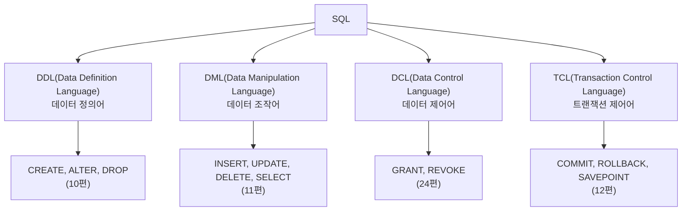

<Callout type="info">
  **이번 문서의 목표:** 이 파일을 다 읽으면 "데이터베이스", "DBMS", "관계형", "SQL"이라는 네 단어가 서로 어떤 층에 있는지 구분하고, SQLD 시험이 무엇을 얼마나 묻는지 정확히 파악할 수 있게 된다.
</Callout>

## 왜 이 문서부터 시작하는가

SQLD(SQL Developer, SQL 개발자) 시험은 응시 자격 제한이 없습니다. 그래서 SQL 문법을 이미 조금 아는 사람부터, 데이터베이스 자체를 한 번도 만져본 적 없는 사람까지 함께 응시합니다. 이 책은 뒤쪽 사람 기준으로 씁니다. "데이터베이스"라는 단어를 들으면 막연히 "데이터를 저장하는 곳" 정도로만 아는 상태에서 출발합니다.

문제는 SQLD 교재 대부분이 "관계형 데이터베이스는 테이블로 이루어진 데이터베이스다"라는 문장으로 곧장 시작한다는 점입니다. 이 문장 안에는 이미 "데이터베이스", "테이블", "관계형"이라는 세 개념이 압축되어 있고, 이 압축을 풀지 않은 채 다음 편(엔터티·속성·관계)으로 넘어가면 반드시 어딘가에서 막힙니다. 그래서 이 편은 오직 하나의 목적을 가집니다 — **뒤에 나올 모든 용어가 딛고 설 바닥을 까는 것**입니다.

> **쉽게 말하면:** 이 편은 SQL 문법이 아니라, "데이터베이스가 왜 있고 SQL이 왜 필요한가"라는 **존재 이유**를 다지는 편입니다.

## 1. 데이터베이스와 DBMS — 창고와 창고지기

### 왜 파일만으로는 부족한가

회원 정보를 엑셀 파일 하나에 적어 관리한다고 해봅시다. 처음엔 문제가 없습니다. 그런데 회원이 10만 명이 되고, 동시에 여러 직원이 그 파일을 열어 수정하려 하고, 정전이 나서 저장 중이던 파일이 깨지고, "탈퇴한 회원인데 왜 아직도 목록에 있지?" 같은 데이터 불일치가 생기기 시작하면 파일 하나로는 감당이 안 됩니다. 이 문제들 — **동시 접근**, **장애 복구**, **데이터 일관성**, **대용량 검색 속도** — 을 전문적으로 해결하기 위해 만들어진 소프트웨어가 있습니다.

> **쉽게 말하면:** 데이터베이스는 **데이터가 쌓여 있는 창고**이고, 그 창고를 관리하는 소프트웨어가 **DBMS**입니다.

**데이터베이스**(Database, DB)는 여러 사람이 공유하며 사용할 목적으로 통합·저장된 데이터의 집합입니다. **DBMS**(DataBase Management System, 데이터베이스 관리 시스템)는 이 데이터베이스를 생성·조작·제어하는 소프트웨어 자체를 가리킵니다. 흔히 "MySQL을 쓴다", "Oracle을 쓴다"고 말할 때 그 MySQL·Oracle이 바로 DBMS 제품 이름입니다. 데이터베이스는 창고(데이터 더미) 그 자체이고, DBMS는 그 창고를 관리하는 창고지기 겸 시스템입니다.

DBMS가 없다면 프로그램마다 각자 파일을 읽고 쓰는 코드를 직접 짜야 하고, 그 코드마다 제각각 방식으로 동시 접근을 처리하다 데이터가 깨질 위험이 커집니다. DBMS는 이 문제를 표준화된 방식으로 대신 처리해 줍니다.

| 구분 | 정의 | 예시 |
|------|------|------|
| 데이터베이스 | 통합·저장된 데이터의 집합 자체 | 회원 데이터, 주문 데이터가 쌓인 실체 |
| DBMS | 데이터베이스를 관리하는 소프트웨어 | Oracle, MySQL, PostgreSQL, SQL Server |

<Callout type="warning">
  **자주 틀리는 점:** "MySQL이 데이터베이스다"라고 말하는 경우가 많은데, 정확히는 MySQL은 **DBMS**(관리 소프트웨어)이고 그 안에 실제로 만들어 넣는 각각의 데이터 집합이 **데이터베이스**입니다. 하나의 DBMS 안에 여러 개의 데이터베이스를 만들 수 있습니다.
</Callout>

## 2. 관계형 모델 — 표(테이블)로 데이터를 담는 방식

### 왜 하필 표 모양인가

데이터를 저장하는 방식(모델)은 여러 가지가 있었습니다. 계층형(Hierarchical, 트리 구조), 네트워크형(Network, 그래프 구조) 모델이 먼저 나왔지만, 구조가 복잡해질수록 데이터를 찾고 바꾸는 절차 자체가 어려워졌습니다. 1970년 에드거 codd(에드거 커드)가 제안한 **관계형 모델**(Relational Model)은 이 문제를 아주 단순한 아이디어로 풀었습니다. **모든 데이터를 행과 열로 이루어진 표(table)로 표현하자**는 것입니다.

> **쉽게 말하면:** 관계형 모델은 데이터를 **엑셀 시트 같은 표** 여러 개로 쪼개 저장하고, 표끼리는 **공통된 값**으로 연결하는 방식입니다.

여기서 "관계형(Relational)"이라는 이름은 흔히 오해하는 것처럼 "표와 표 사이의 관계"만을 뜻하는 말이 아닙니다. 원래 수학의 **릴레이션**(Relation, 관계)이라는 집합 개념에서 온 용어로, 표 하나 자체가 하나의 릴레이션입니다. 다만 실무·시험에서는 "표들이 서로 관계를 맺는다"는 직관적 의미로 통용되므로, 여기서도 그 직관을 기준으로 설명합니다.

### 테이블·행·열 — 세 이름을 정확히 맞춰라

관계형 데이터베이스의 표 하나는 아래처럼 생겼습니다.

| 사원번호 | 사원명 | 부서 |
|----------|--------|------|
| E01 | 홍길동 | 영업1팀 |
| E02 | 김민준 | 개발팀 |
| E03 | 이서연 | 영업1팀 |

이 표를 이루는 요소마다 이름이 여러 겹으로 붙습니다. 이 이름 대응이 SQLD 시험의 용어 문제에서 자주 나오므로 표로 정리합니다.

| 일상 용어 | SQL(관계형 DB) 용어 | 데이터 모델링 용어 | 뜻 |
|-----------|----------------------|----------------------|-----|
| 표 | 테이블(Table) | 엔터티(Entity) | 데이터를 담는 하나의 표 전체 |
| 세로줄 | 컬럼(Column) | 속성(Attribute) | 표의 각 항목(사원번호, 사원명, 부서) |
| 가로줄 | 로우(Row) | 인스턴스(Instance) | 표의 한 줄(홍길동 한 명의 정보) |
| 칸 하나 | 값(Value) | 속성값(Attribute Value) | 행과 열이 만나는 한 칸의 데이터 |

이 대응표는 외워두면 다음 편(ERD 표기법과 용어 지도)과 03편(엔터티·속성·관계)에서 등장하는 용어를 헷갈리지 않는 데 그대로 쓰입니다. **테이블 = 엔터티, 컬럼 = 속성, 로우 = 인스턴스**라는 세 쌍을 지금 확실히 잡아두십시오.

<Callout type="warning">
  **자주 틀리는 점:** "필드(Field)"라는 말도 자주 섞여 나옵니다. 필드는 컬럼과 거의 같은 뜻으로 쓰이지만, 엄밀히는 "특정 행의 특정 컬럼 값 하나"를 가리킬 때도 씁니다. 시험에서는 컬럼과 필드를 같은 의미로 취급하는 경우가 많으니 문맥으로 판단하십시오.
</Callout>

## 3. SQL이 하는 일 — 창고에 말을 거는 언어

### SQL은 프로그래밍 언어가 아니라 질의어다

**SQL**(Structured Query Language, 구조화 질의어)은 DBMS에게 "이 데이터를 넣어줘", "이 조건에 맞는 데이터를 찾아줘", "이 값을 바꿔줘"라고 요청하는 언어입니다. 자바·파이썬 같은 범용 프로그래밍 언어와 달리, SQL은 **데이터를 다루는 것 한 가지 목적**에 집중된 언어입니다. 이런 언어를 질의어(Query Language)라고 부릅니다.

SQL이 하는 일은 목적에 따라 네 갈래로 나뉩니다. 이 네 갈래는 이 과목 전체(10~24편)의 뼈대이므로, 지금은 "이런 이름의 큰 카테고리가 있다"는 지도만 그려둡니다. 각 항목의 구체적인 문법은 해당 편(괄호 안 편 번호)에서 다룹니다.

| 분류 | 영문 풀이 | 하는 일 | 대표 명령어 |
|------|-----------|---------|-------------|
| DDL | Data Definition Language, 데이터 정의어 | 테이블 같은 **그릇 자체**를 만들고 바꾸고 없앤다 | `CREATE`, `ALTER`, `DROP` |
| DML | Data Manipulation Language, 데이터 조작어 | 그릇 **안의 내용물**을 넣고 고치고 지우고 조회한다 | `INSERT`, `UPDATE`, `DELETE`, `SELECT` |
| DCL | Data Control Language, 데이터 제어어 | 누가 그 그릇을 만지도록 **허락**할지 정한다 | `GRANT`, `REVOKE` |
| TCL | Transaction Control Language, 트랜잭션 제어어 | DML로 바꾼 내용을 **확정하거나 취소**한다 | `COMMIT`, `ROLLBACK`, `SAVEPOINT` |

> **비유:** DDL은 서랍장을 짜고 부수는 목수의 일, DML은 서랍 안 물건을 넣고 빼는 일, DCL은 서랍장 열쇠를 누구에게 줄지 정하는 일, TCL은 "지금까지 넣고 뺀 걸 진짜로 확정할지, 없던 일로 되돌릴지" 결정하는 일입니다.

<Callout type="warning">
  **자주 틀리는 점:** `SELECT`를 DML이 아닌 별도 분류로 착각하는 경우가 있습니다. `SELECT`는 데이터를 "조작"한다기보다 "조회"만 하지만, 공식 분류상 DML에 포함됩니다. 또한 DDL 명령은 실행 즉시 **자동으로 커밋(확정)** 되어 롤백으로 되돌릴 수 없다는 점도 자주 출제되는 함정입니다. 이 내용은 09편(트랜잭션)과 12편(TCL)에서 다시 깊게 다룹니다.
</Callout>

## 4. SQLD 시험 구조 — 무엇을, 얼마나, 어떻게 평가하는가

### 과목과 배점

SQLD는 2과목 50문항 객관식 시험입니다. 두 과목의 이름과 문항 수는 다음과 같이 나뉩니다.

| 과목 | 이름 | 문항 수(공고 확인 필요) | 다루는 범위 |
|------|------|--------------------------|-------------|
| 1과목 | 데이터 모델링의 이해 | 10문항 | 엔터티·속성·관계, 식별자, 정규화·반정규화 |
| 2과목 | SQL 기본 및 활용 | 40문항 | DDL·DML·TCL, WHERE·함수·조인·서브쿼리, 윈도우 함수·집합 연산 등 |

> **쉽게 말하면:** 50문제 중 10문제는 "표를 어떻게 설계하는가"(모델링), 40문제는 "그 표에 SQL로 어떻게 명령하는가"(SQL)를 묻습니다.

이 과목 배분 비율(10:40, 즉 20퍼센트 대 80퍼센트)이 이 책의 편성 순서에도 그대로 반영되어 있습니다. 03~09편이 데이터 모델링, 10~24편이 SQL 기본·활용을 다루고, 26~30편의 모의고사도 같은 비율(데이터 모델링 10문항 + SQL 40문항)로 구성됩니다.

### 합격 기준

합격 기준은 **두 조건을 동시에** 만족해야 합니다.

1. **전체 평균 60점 이상**
2. **과목별 40점 미만이면 과락** — 평균이 아무리 높아도 한 과목이라도 40점 미만이면 불합격

즉 "SQL은 자신 있으니 데이터 모델링은 대충 찍어도 된다"는 전략이 성립하지 않습니다. 데이터 모델링 10문항 중 최소 4문항(40퍼센트) 이상은 맞혀야 과락을 면합니다. 10문항밖에 없는 과목이라 문항당 배점 비중이 크고, 한두 문제만 실수해도 과락 경계에 가까워지므로 이 책이 데이터 모델링 부분(03~09편)에서도 SQL 못지않게 깊이 다루는 이유가 여기에 있습니다.

<Callout type="warning">
  **자주 틀리는 점(공고 확인 필요):** 문항 수·배점·합격 기준의 정확한 수치는 시행 회차·기관 공고에 따라 세부 조정될 수 있습니다. 이 책은 통상적으로 알려진 기준(2과목 50문항, 평균 60점 이상, 과목별 40점 미만 과락)을 기준으로 설명하지만, **실제 응시 전에는 반드시 한국데이터산업진흥원(dataq.or.kr)의 최신 시행 공고에서 문항 수·배점·합격 기준을 재확인**하십시오.
</Callout>

### 문항 유형 미리보기

기출·복원 문제를 살펴보면 SQLD는 다음과 같은 형식을 반복해서 씁니다. 이 형식들은 뒤에 나올 모의고사 편에서 그대로 재현됩니다.

- **정의·개념 고르기**: "다음 중 ○○에 대한 설명으로 옳은 것은?"
- **옳지 않은 것 고르기**: "다음 설명 중 옳지 않은 것은?" — 4개 보기 중 3개가 맞는 설명이라 더 헷갈립니다.
- **ERD 해석형**: 그림(또는 텍스트로 표현된 관계)을 보고 카디널리티·참여도를 읽어내는 문제.
- **SQL 실행 결과 예측형**: 주어진 SQL을 보고 실행 결과(출력되는 행·값)를 맞히는 문제.
- **보기 조합형**: "가, 나, 다, 라" 중 옳은 것을 모두 고르는 문제.

## 핵심 정리

- **데이터베이스**는 데이터의 집합 자체이고, **DBMS**는 그것을 관리하는 소프트웨어다. "MySQL이 데이터베이스다"는 흔한 오개념이다.
- **관계형 모델**은 데이터를 표(테이블)로 표현한다. **테이블 = 엔터티, 컬럼 = 속성, 로우 = 인스턴스**라는 세 겹의 용어 대응을 반드시 익혀둔다.
- SQL은 목적에 따라 **DDL**(정의: CREATE/ALTER/DROP), **DML**(조작: INSERT/UPDATE/DELETE/SELECT), **DCL**(제어: GRANT/REVOKE), **TCL**(트랜잭션: COMMIT/ROLLBACK/SAVEPOINT) 네 갈래로 나뉜다.
- SQLD는 **2과목 50문항**(데이터 모델링 10 + SQL 40), **평균 60점 이상 + 과목별 40점 미만 과락**이 통상 기준이지만 회차 공고를 반드시 재확인해야 한다.
- 데이터 모델링은 문항 수가 적어(10문항) 과락 위험이 크므로, SQL 못지않게 소홀히 하면 안 된다.

## 마무리 복습

<Quiz
  questionNumber={1}
  question="데이터베이스와 DBMS의 관계를 가장 정확하게 설명한 것은?"
  options={['데이터베이스는 DBMS를 실행하는 하드웨어 장비이다', 'DBMS는 데이터베이스를 관리하는 소프트웨어이고, 데이터베이스는 그 안에 저장된 데이터의 집합이다', '데이터베이스와 DBMS는 완전히 같은 개념으로 혼용해도 무방하다', 'DBMS는 SQL 문법의 옛 이름이다']}
  correctAnswer={2}
  explanation="DBMS(DataBase Management System)는 데이터베이스를 생성·조작·제어하는 소프트웨어이고, 데이터베이스는 그 소프트웨어가 관리하는 실제 데이터의 집합이다. Oracle, MySQL 등은 DBMS 제품명이다."
  optionExplanations={['DBMS는 소프트웨어이지 하드웨어 장비가 아니다', '정답 — 관리 소프트웨어와 그 안의 데이터 집합이라는 관계다', '두 용어는 층이 다른 개념이라 혼용하면 개념 혼동이 생긴다', 'DBMS는 SQL과 별개의 소프트웨어 카테고리이며 SQL의 옛 이름이 아니다']}
/>

<Quiz
  questionNumber={2}
  question="관계형 데이터베이스의 테이블, 컬럼, 로우를 데이터 모델링 용어로 옳게 짝지은 것은?"
  options={['테이블–속성, 컬럼–엔터티, 로우–인스턴스', '테이블–엔터티, 컬럼–속성, 로우–인스턴스', '테이블–인스턴스, 컬럼–엔터티, 로우–속성', '테이블–엔터티, 컬럼–인스턴스, 로우–속성']}
  correctAnswer={2}
  explanation="테이블 전체는 엔터티, 테이블의 세로줄(항목)은 속성, 테이블의 가로줄(한 건의 데이터)은 인스턴스에 대응한다."
  optionExplanations={['테이블과 속성, 컬럼과 엔터티가 서로 뒤바뀌었다', '정답 — 테이블=엔터티, 컬럼=속성, 로우=인스턴스의 대응이 옳다', '테이블이 인스턴스가 될 수 없고, 컬럼도 엔터티가 될 수 없다', '컬럼과 인스턴스, 로우와 속성이 서로 뒤바뀌었다']}
/>

<Quiz
  questionNumber={3}
  question="SQL의 네 분류 중 CREATE, ALTER, DROP이 속하는 것과 그 역할로 옳은 것은?"
  options={['DML — 테이블 안의 데이터를 조작한다', 'DCL — 사용자에게 권한을 부여하거나 회수한다', 'DDL — 테이블 같은 객체 구조 자체를 정의한다', 'TCL — 트랜잭션을 확정하거나 취소한다']}
  correctAnswer={3}
  explanation="CREATE·ALTER·DROP은 테이블 등 데이터베이스 객체의 구조 자체를 만들고 바꾸고 없애는 명령으로, 데이터 정의어(DDL, Data Definition Language)에 속한다."
  optionExplanations={['DML은 INSERT/UPDATE/DELETE/SELECT처럼 데이터 내용을 다루는 분류다', 'DCL은 GRANT/REVOKE처럼 권한을 다루는 분류다', '정답 — DDL은 객체 구조 자체를 정의하는 명령 분류다', 'TCL은 COMMIT/ROLLBACK/SAVEPOINT처럼 트랜잭션을 제어하는 분류다']}
/>

<Quiz
  questionNumber={4}
  question="SQL 명령어와 소속 분류의 짝이 옳지 않은 것은?"
  options={['SELECT — DML', 'GRANT — DCL', 'COMMIT — TCL', 'ALTER — DML']}
  correctAnswer={4}
  explanation="ALTER는 테이블 구조를 변경하는 명령으로 DDL(데이터 정의어)에 속한다. DML이 아니다."
  optionExplanations={['SELECT는 조회 기능이지만 공식 분류상 DML에 포함된다', 'GRANT는 권한 부여 명령으로 DCL에 정확히 속한다', 'COMMIT은 트랜잭션 확정 명령으로 TCL에 정확히 속한다', '정답 — ALTER는 DML이 아니라 DDL에 속한다']}
/>

<Quiz
  questionNumber={5}
  question="SQLD 시험의 통상적인 과목·문항 구성으로 옳은 것은? (세부 수치는 회차 공고에 따라 달라질 수 있음)"
  options={['1과목 SQL 기본 및 활용 10문항, 2과목 데이터 모델링의 이해 40문항', '1과목 데이터 모델링의 이해 10문항, 2과목 SQL 기본 및 활용 40문항', '데이터 모델링과 SQL을 구분하지 않고 50문항을 통합 출제한다', '1과목과 2과목이 각각 25문항씩 동일하게 배분된다']}
  correctAnswer={2}
  explanation="SQLD는 통상 1과목 데이터 모델링의 이해(10문항)와 2과목 SQL 기본 및 활용(40문항)으로 구성된 2과목 50문항 시험이다. 정확한 수치는 응시 전 공고 확인이 필요하다."
  optionExplanations={['과목 순서와 문항 수가 뒤바뀐 설명이다', '정답 — 데이터 모델링 10문항, SQL 40문항 구성이 통상 기준이다', '두 과목은 별도로 구분되어 출제되고 과목별 과락 기준도 따로 적용된다', '25문항씩 균등 배분이 아니라 10:40으로 비대칭 배분된다']}
/>

<Quiz
  questionNumber={6}
  question="SQLD의 합격 기준에 대한 설명으로 옳은 것은?"
  options={['전체 평균 60점 이상이면 과목별 점수와 무관하게 합격한다', '전체 평균이 60점 미만이어도 한 과목만 100점이면 합격한다', '전체 평균 60점 이상이면서 각 과목이 40점 미만이 아니어야 합격한다', '두 과목 모두 각각 60점 이상이어야만 합격한다']}
  correctAnswer={3}
  explanation="SQLD는 전체 평균 60점 이상이면서 동시에 어느 과목도 40점 미만(과락)이 아니어야 합격하는 통상 기준을 따른다. 평균만 높아도 한 과목이 과락이면 불합격이다."
  optionExplanations={['과목별 과락 기준을 무시한 설명이라 틀렸다', '평균이 60점 미만이면 과목 점수와 무관하게 불합격이다', '정답 — 평균 60점 이상과 과목별 과락 방지 두 조건을 모두 만족해야 한다', '각 과목 60점 이상이 아니라 40점 미만만 아니면 되므로 기준이 더 엄격하게 서술되었다']}
/>

<Quiz
  questionNumber={7}
  question="데이터 모델링 과목(10문항)에서 과락을 면하기 위해 최소 몇 문항 이상 맞혀야 하는가? (과목별 40점 미만 과락 기준, 문항당 배점이 동일하다고 가정)"
  options={['2문항 이상', '3문항 이상', '4문항 이상', '6문항 이상']}
  correctAnswer={3}
  explanation="과목별 40점 미만이면 과락이므로, 100점 만점 기준 40점 이상을 받아야 한다. 10문항에 배점이 균등하다면 문항당 10점이므로 4문항(40점) 이상을 맞혀야 과락을 면한다."
  optionExplanations={['2문항(20점)은 40점 미만이라 과락에 해당한다', '3문항(30점)도 40점 미만이라 과락에 해당한다', '정답 — 4문항(40점)이 과락을 면하는 최소 기준이다', '6문항(60점)은 과락 방지에는 필요 이상으로 높은 기준이다']}
/>

## 참고 자료

- [데이터자격시험 - SQLD 출제기준](https://www.dataq.or.kr/www/sub/a_04.do)
- [데이터자격검정 메인 - 데이터자격시험](https://www.dataq.or.kr/www/main.do)
- [MDN - SQL 개요 (관계형 DB 기초)](https://developer.mozilla.org/ko/docs/Glossary/SQL)
