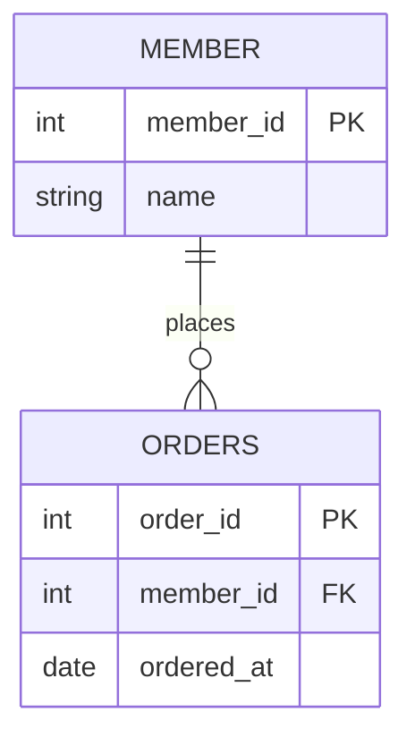
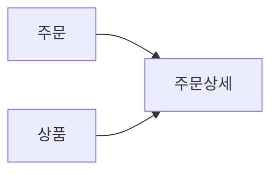

<Callout type="info">
  **이번 문서의 목표:** 엔터티, 속성, 관계를 구분하고 간단한 ERD를 읽습니다.
</Callout>

## 테이블을 만들기 전에 먼저 관계를 정한다

데이터베이스를 만든다는 것은 열을 아무렇게나 나열하는 일이 아닙니다. 업무에서 관리할 대상과 그 대상 사이의 연결을 먼저 정해야 합니다. 이 설계 과정을 **데이터 모델링(data modeling)** 이라고 합니다.

온라인 쇼핑몰이라면 회원, 주문, 상품이 관리 대상이 될 수 있습니다. 회원 한 명은 여러 주문을 할 수 있고, 주문 하나에는 여러 상품이 담길 수 있습니다. 이런 업무 규칙을 표로 옮기기 전에 그림으로 정리하면 빠진 정보와 중복을 줄일 수 있습니다.

## ERD의 세 가지 기본 단어

**ERD(Entity Relationship Diagram)** 는 엔터티와 관계를 그림으로 표현한 도구입니다.

| 용어 | 쉽게 말하면 | 주문 서비스 예 |
| --- | --- | --- |
| 엔터티(entity) | 따로 관리할 대상 | 회원, 주문, 상품 |
| 속성(attribute) | 대상이 가진 정보 | 회원 이름, 주문 일자 |
| 관계(relationship) | 대상끼리의 연결 | 회원이 주문한다 |

엔터티는 나중에 보통 테이블이 되고, 속성은 그 테이블의 열이 됩니다. 관계는 외래키와 조인으로 구현할 기반이 됩니다.

이 그림은 회원 한 명이 주문을 0건 이상 만들 수 있고, 주문 한 건은 한 회원에 속한다는 뜻입니다. `PK`는 기본키, `FK`는 다른 테이블의 기본키를 가리키는 **외래키(foreign key)** 입니다.

## 관계의 개수는 왜 중요할까

관계에는 보통 다음 세 가지 모양이 있습니다.

| 관계 | 뜻 | 예 |
| --- | --- | --- |
| 1:1 | 한 건이 한 건과 연결 | 사람과 주민등록증 |
| 1:N | 한 건이 여러 건과 연결 | 회원 한 명과 여러 주문 |
| N:M | 여러 건이 서로 여러 건과 연결 | 주문과 상품 |

주문과 상품은 N:M 관계입니다. 주문 하나에 여러 상품이 들어갈 수 있고, 상품 하나도 여러 주문에 들어갈 수 있기 때문입니다. 실제 테이블에서는 보통 `주문상세` 같은 중간 테이블을 만들어 두 개의 1:N 관계로 나눕니다.

## 모델링은 세 단계로 구체화한다

| 단계 | 하는 일 | 예 |
| --- | --- | --- |
| 개념 데이터 모델 | 업무 대상을 넓게 정리 | 회원, 주문, 상품을 찾기 |
| 논리 데이터 모델 | 속성과 관계를 구체화 | 회원-주문은 1:N 관계 |
| 물리 데이터 모델 | DBMS에 맞는 테이블로 구현 | `member_id`, 자료형, 인덱스 결정 |

처음부터 SQL 문법이나 자료형만 고민하면 업무 규칙을 놓치기 쉽습니다. “누가 무엇을 몇 번 할 수 있는가?”를 먼저 확인한 뒤 테이블로 내려오는 순서가 안전합니다.

<Callout type="warning">
  ERD의 모양만 외우기보다, 관계가 실제 업무 규칙과 맞는지 확인해야 합니다. 예를 들어 회원 한 명이 여러 주문을 할 수 있는데 1:1로 그리면 주문 이력을 제대로 저장할 수 없습니다.
</Callout>

## 핵심 정리

- 데이터 모델링은 업무의 대상·정보·연결을 데이터베이스 구조로 설계하는 일입니다.
- 엔터티는 관리 대상, 속성은 대상의 정보, 관계는 대상끼리의 연결입니다.
- ERD는 이 세 요소를 그림으로 표현합니다.
- 주문과 상품처럼 N:M 관계는 중간 테이블로 나누어 구현하는 경우가 많습니다.

## 마무리 복습

<Quiz
  questionNumber={1}
  question="주문 시스템에서 `회원`, `주문`, `상품`처럼 따로 관리하는 대상은 무엇인가요?"
  options={['엔터티', '속성', '도수', '인덱스']}
  correctAnswer={1}
  explanation="엔터티는 업무에서 관리할 대상을 뜻하며, 보통 테이블 후보가 됩니다."
  optionExplanations={[
    '맞습니다. 회원, 주문, 상품은 각각 엔터티입니다.',
    '속성은 엔터티가 가진 세부 정보입니다.',
    '도수는 통계에서 횟수를 뜻합니다.',
    '인덱스는 데이터 검색을 돕는 구조입니다.',
  ]}
/>

<Quiz
  questionNumber={2}
  question="회원 한 명이 여러 주문을 할 수 있을 때 회원과 주문의 관계로 알맞은 것은?"
  options={['1:1', '1:N', 'N:1만 가능', '관계가 없다']}
  correctAnswer={2}
  explanation="회원 한 건이 주문 여러 건에 연결되므로 회원 기준으로 1:N 관계입니다."
  optionExplanations={[
    '회원 한 명이 주문 하나만 할 수 있다는 뜻이 됩니다.',
    '맞습니다. 한 회원 대 여러 주문의 관계입니다.',
    '주문에서 회원을 보면 N:1로 읽을 수 있지만, 회원 기준 설명은 1:N입니다.',
    '주문에는 회원 정보와의 연결이 필요합니다.',
  ]}
/>

<Quiz
  questionNumber={3}
  question="외래키(FK)의 주된 역할은 무엇인가요?"
  options={['현재 테이블의 행을 유일하게 찾는다.', '다른 테이블의 기본키를 참조해 관계를 연결한다.', '문자열 길이를 제한한다.', '테이블의 모든 행을 삭제한다.']}
  correctAnswer={2}
  explanation="외래키는 다른 테이블의 기본키를 참조해 두 테이블 사이의 관계를 표현합니다."
  optionExplanations={[
    '이 역할은 기본키(PK)의 핵심입니다.',
    '맞습니다. 테이블 사이의 연결 기준이 됩니다.',
    '문자열 길이 제한은 자료형이나 제약 조건의 역할입니다.',
    '삭제 명령과는 관계가 없습니다.',
  ]}
/>

## 참고 자료

- [KDATA 데이터자격시험 - SQL 개발자](https://www.dataq.or.kr/www/sub/a_04.do)
- [Oracle Database Concepts - Data Modeling](https://docs.oracle.com/en/database/oracle/oracle-database/23/cncpt/data-modeling.html)