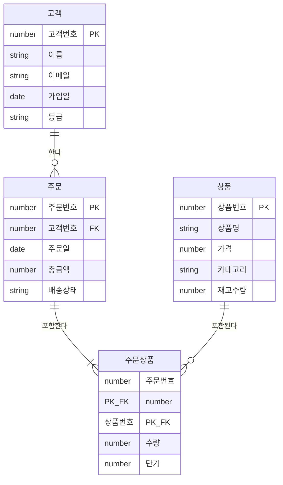

<Callout type="info">
  **이번 문서의 목표:** 데이터 모델링이 무엇이고 왜 필요한지 이해하고, ERD(개체-관계 다이어그램)를 보고 데이터 구조를 파악할 수 있다.
</Callout>

## 데이터 모델링이란?

**데이터 모델링(Data Modeling)**은 현실 세계의 정보를 데이터베이스로 구현하기 위해 **구조를 설계하는 과정**입니다.

건물을 짓기 전에 설계도를 그리듯, 데이터베이스를 만들기 전에 "어떤 데이터를 어떤 형태로 저장할지"를 먼저 설계합니다. 이 설계도 역할을 하는 것이 데이터 모델입니다.

데이터 모델링은 세 가지 목적을 가집니다.

1. **업무 이해**: 업무 규칙과 데이터를 명확히 정의합니다
2. **의사소통**: 개발자, 기획자, 비즈니스 담당자가 같은 그림을 보며 소통합니다
3. **설계 품질**: 데이터 중복과 이상현상을 미리 방지합니다

## 3단계 모델링

데이터 모델링은 **개념적 → 논리적 → 물리적** 3단계로 진행됩니다. 각 단계는 추상적인 것에서 구체적인 것으로 점점 세밀해집니다.

| 단계 | 이름 | 목적 | 결과물 | 주요 개념 |
|------|------|------|--------|-----------|
| 1단계 | **개념적 모델링** | 핵심 데이터 식별 | 개념 ERD | 엔터티, 관계 |
| 2단계 | **논리적 모델링** | 상세 구조 설계 | 논리 ERD | 속성, 키, 정규화 |
| 3단계 | **물리적 모델링** | 실제 DB 구현 설계 | DDL (CREATE TABLE) | 테이블, 컬럼, 인덱스 |

### 1단계: 개념적 모델링

업무 담당자와 함께 "어떤 정보가 필요한가?"를 정의합니다. 기술적 세부사항 없이 핵심 개념만 식별합니다.

예시: 쇼핑몰 시스템의 개념적 모델
- **고객**이 있다
- **상품**이 있다
- 고객은 상품을 **주문**한다

이 단계에서는 속성(열)의 자세한 내용보다 "무엇이 존재하고, 무엇과 연결되는가"가 중요합니다.

### 2단계: 논리적 모델링

개념적 모델을 더 상세하게 발전시킵니다. 각 엔터티의 **속성**, **키**, **관계의 상세**를 정의합니다. 특정 DBMS(Oracle, MySQL 등)에 종속되지 않는 추상적인 설계입니다.

예시: 고객 엔터티에 속성 추가
- 고객: **고객번호(PK)**, 이름, 이메일, 가입일, 등급

### 3단계: 물리적 모델링

특정 DBMS에 맞춰 실제 구현 가능한 형태로 변환합니다. 데이터 타입, 인덱스, 파티션 등을 결정합니다.

```sql
CREATE TABLE 고객 (
    고객번호  NUMBER(10)    NOT NULL,
    이름      VARCHAR2(50)  NOT NULL,
    이메일    VARCHAR2(100),
    가입일    DATE          NOT NULL,
    등급      VARCHAR2(10),
    CONSTRAINT PK_고객 PRIMARY KEY (고객번호)
);
```

## ERD란?

**ERD(Entity-Relationship Diagram, 개체-관계 다이어그램)**는 데이터 모델을 시각적으로 표현한 다이어그램입니다. ERD에는 세 가지 핵심 요소가 있습니다.

- **엔터티(Entity)**: 저장할 대상. 예) 고객, 상품, 주문
- **속성(Attribute)**: 엔터티가 가진 특성. 예) 고객의 이름, 이메일
- **관계(Relationship)**: 엔터티 간의 연결. 예) 고객은 주문을 한다

## Crow's Foot 표기법

SQLD에서 주로 사용하는 표기법은 **Crow's Foot(까마귀 발) 표기법**입니다. 관계의 양 끝에 기호를 붙여 "몇 개"와 "있어야 하는지"를 표현합니다.

| 기호 | 의미 |
|------|------|
| `||` | 정확히 1 (필수) |
| `|o` | 0 또는 1 (선택) |
| `}|` | 1 이상 (필수, 여러 개 가능) |
| `}o` | 0 이상 (선택, 여러 개 가능) |

## 실제 ERD 예시: 쇼핑몰 시스템

아래 ERD는 고객, 주문, 상품의 관계를 표현합니다.



### ERD 읽는 방법

위 ERD에서 읽을 수 있는 정보:

**고객 → 주문 관계 (`||--o{`)**
- 왼쪽 `||`: 주문 입장에서 고객은 정확히 1명이어야 한다 (주문에는 반드시 고객이 있다)
- 오른쪽 `o{`: 고객 입장에서 주문은 0개 이상 있을 수 있다 (주문을 한 번도 안 한 고객도 있다)
- 해석: **한 고객은 여러 주문을 할 수 있고, 하나의 주문은 반드시 한 명의 고객에 속한다**

**주문 → 주문상품 관계 (`||--|{`)**
- 왼쪽 `||`: 주문상품은 반드시 하나의 주문에 속한다
- 오른쪽 `|{`: 주문에는 최소 1개 이상의 주문상품이 있어야 한다 (빈 주문은 없다)
- 해석: **하나의 주문에는 최소 1개 이상의 상품이 반드시 포함된다**

**상품 → 주문상품 관계 (`||--o{`)**
- 한 상품은 여러 주문에 포함될 수 있다 (인기 상품은 많이 팔린다)
- 주문상품은 반드시 하나의 상품을 참조한다
- 해석: **상품은 주문된 적 없을 수도 있고, 여러 주문에 포함될 수도 있다**

<Callout type="info">
  **주문상품 테이블**은 상품과 주문의 다대다(M:N) 관계를 해소하기 위한 **교차 엔터티**입니다. 하나의 주문에 여러 상품이 담기고, 하나의 상품이 여러 주문에 담길 수 있기 때문에 중간 테이블이 필요합니다.
</Callout>

## ERD에서 실제로 확인하는 정보

좋은 ERD를 보면 다음 정보들을 바로 파악할 수 있습니다.

| 확인 항목 | 예시 |
|-----------|------|
| 어떤 데이터가 존재하는가 | 고객, 주문, 상품이 있다 |
| 각 데이터의 특성은? | 고객은 이름, 이메일, 등급을 가진다 |
| 데이터 간 관계는? | 고객은 여러 주문을 할 수 있다 |
| 필수/선택 여부는? | 주문에는 반드시 고객이 있어야 한다 |
| 기본키(PK)는 무엇인가? | 고객번호, 주문번호, 상품번호 |
| 외래키(FK)는 무엇인가? | 주문의 고객번호는 고객 테이블 참조 |

## 모델링의 중요성

데이터 모델이 잘못 설계되면 나중에 발생하는 문제들이 매우 심각합니다.

- 데이터를 수정할 때 여러 곳을 동시에 바꿔야 하는 **수정 이상**
- 데이터를 삭제할 때 원하지 않는 데이터까지 지워지는 **삭제 이상**
- 데이터를 추가할 때 불필요한 정보가 강제되는 **삽입 이상**

이러한 이상현상을 예방하기 위해 3단계 모델링을 거쳐 ERD를 꼼꼼히 검토하는 것입니다.

## 핵심 정리

- 데이터 모델링은 **개념적 → 논리적 → 물리적** 3단계로 진행된다
- **ERD**는 엔터티, 속성, 관계를 시각적으로 표현한 설계 다이어그램이다
- **Crow's Foot 표기법**으로 관계의 차수(1:1, 1:N, M:N)와 선택성(필수/선택)을 표현한다
- ERD를 통해 테이블 구조, 관계, 키를 한눈에 파악할 수 있다
- 모델링이 잘못되면 삽입·수정·삭제 이상현상이 발생한다

## 마무리 복습

<Quiz
  questionNumber={1}
  question="데이터 모델링 3단계를 올바른 순서로 나열한 것은?"
  options={['물리적 → 논리적 → 개념적', '개념적 → 물리적 → 논리적', '개념적 → 논리적 → 물리적', '논리적 → 개념적 → 물리적']}
  correctAnswer={3}
  explanation="데이터 모델링은 추상적인 것에서 구체적인 것 순서로 진행됩니다. 개념적(핵심 개념 식별) → 논리적(상세 속성 및 관계 정의) → 물리적(실제 DBMS 구현 설계) 순서입니다."
  optionExplanations={['반대 순서입니다. 물리적 단계는 마지막입니다.', '물리적과 논리적 순서가 바뀌었습니다.', '개념적 → 논리적 → 물리적이 올바른 순서입니다. (맞습니다.)', '논리적 단계가 개념적보다 먼저 올 수 없습니다.']}
/>

<Quiz
  questionNumber={2}
  question="ERD에서 Crow's Foot 표기법으로 '0개 이상'을 나타내는 기호는?"
  options={['`||`', '`|o`', '`}|`', '`}o`']}
  correctAnswer={4}
  explanation="`}o`는 까마귀 발(`}`)과 원(`o`)의 조합으로, '여러 개 가능하고(까마귀 발) 없을 수도 있다(원)'는 뜻의 '0개 이상'을 나타냅니다."
  optionExplanations={['`||`는 정확히 1, 즉 필수적으로 하나임을 나타냅니다.', '`|o`는 0 또는 1, 즉 있거나 없거나를 나타냅니다.', '`}|`는 1 이상, 즉 최소 하나는 반드시 있어야 함을 나타냅니다.', '`}o`는 0개 이상을 나타냅니다. 있어도 되고 여러 개여도 됩니다. (맞습니다.)']}
/>

<Quiz
  questionNumber={3}
  question="논리적 모델링 단계에서 주로 수행하는 작업이 아닌 것은?"
  options={['속성 상세 정의', '정규화 적용', '인덱스 설계', '기본키와 외래키 정의']}
  correctAnswer={3}
  explanation="인덱스 설계는 특정 DBMS의 성능을 위한 작업으로, 물리적 모델링 단계에서 수행합니다. 논리적 모델링은 특정 DBMS에 종속되지 않는 추상적 수준의 설계를 합니다."
  optionExplanations={['속성 상세 정의는 논리적 모델링의 핵심 작업입니다.', '정규화는 논리적 모델링 단계에서 수행하여 데이터 중복을 제거합니다.', '인덱스 설계는 물리적 모델링 단계의 작업입니다. (맞습니다.)', '기본키와 외래키 정의는 논리적 모델링 단계에서 수행합니다.']}
/>

## 참고 자료

- [KDATA 데이터자격시험 - SQL 개발자](https://www.dataq.or.kr/www/sub/a_04.do)
- [PostgreSQL Documentation - SQL](https://www.postgresql.org/docs/current/sql.html)
