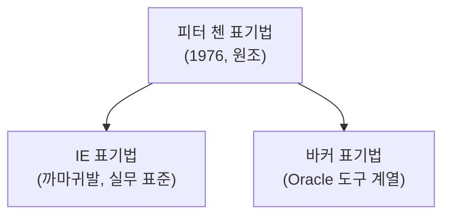
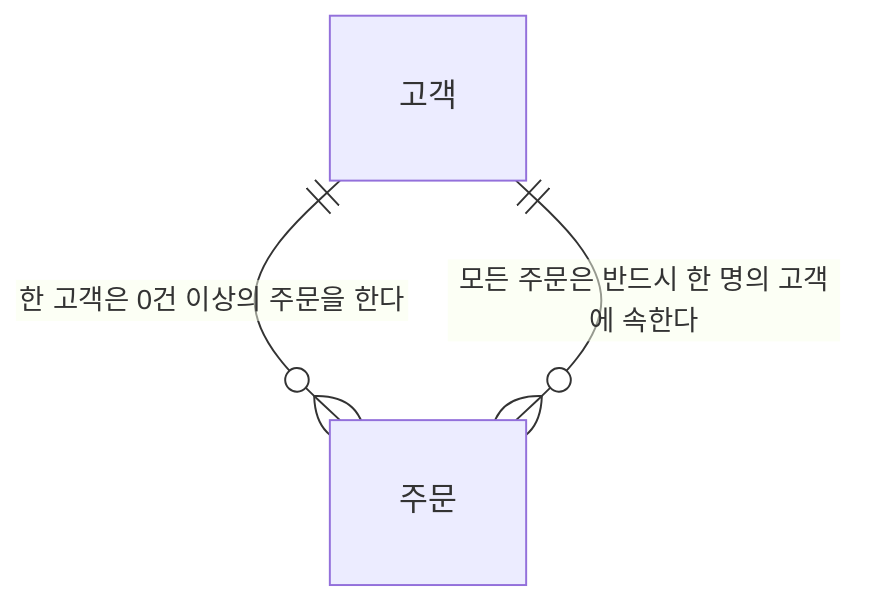

<Callout type="info">
  **이번 문서의 목표:** 이 파일을 다 읽으면 어떤 ERD 그림을 보더라도 그 그림이 IE 표기법인지 바커 표기법인지 구분하고, 관계선의 기호만으로 두 테이블 사이의 관계 차수와 참여 여부를 읽어낼 수 있게 된다.
</Callout>

## 왜 이 문서가 필요한가

01편에서 "테이블 = 엔터티, 컬럼 = 속성, 로우 = 인스턴스"라는 용어 대응을 잡았습니다. 그런데 데이터 모델링 작업은 실제 테이블을 만들기 **전에** 종이나 도구 위에서 먼저 설계도를 그리는 단계를 거칩니다. 이 설계도가 **ERD**이고, ERD를 그리는 표기법(기호 체계)은 하나가 아니라 여러 종류가 공존합니다.

SQLD 기출을 살펴보면 관계선 끝에 붙은 동그라미(◯)나 까마귀발(어지러운 세 갈래 선) 모양만 보고 "이 관계가 필수인지 선택인지, 1:1인지 1:N인지"를 읽어내라는 문제가 반복해서 나옵니다. 즉 표기법을 모르면 문제 자체를 읽을 수 없습니다. 이 편은 그 기호를 읽는 법을 다집니다.

> **쉽게 말하면:** 이번 편은 "ERD 그림을 읽는 눈"을 만드는 편입니다. 03편(엔터티·속성·관계의 정의)에서 다룰 개념들이 그림으로 어떻게 그려지는지 먼저 익혀 둡니다.

## 1. ERD란 무엇인가

**ERD**(Entity-Relationship Diagram, 개체-관계 다이어그램)는 데이터베이스에 어떤 엔터티(표로 만들 대상)들이 있고, 그 엔터티들이 서로 어떤 관계를 맺는지를 그림으로 표현한 것입니다. 1976년 피터 첸(Peter Chen)이 처음 제안한 개념으로, 이후 여러 표기법으로 발전했습니다.

> **비유:** ERD는 건물을 짓기 전에 그리는 **설계 도면**과 같습니다. 도면에는 방(엔터티)이 몇 개 있고, 방과 방 사이에 문이 몇 개(관계의 개수, 카디널리티) 있으며, 그 문이 항상 열려 있어야 하는지 잠가둬도 되는지(관계의 필수·선택 여부)까지 표시됩니다.

ERD를 구성하는 기본 요소는 세 가지입니다.

| 요소 | 뜻 | 03편과의 연결 |
|------|-----|----------------|
| 엔터티(Entity) | 관리할 대상이 되는 사물·사건의 집합 | 03편에서 정의·분류를 자세히 다룬다 |
| 속성(Attribute) | 엔터티가 가지는 세부 정보 항목 | 03편에서 분류를 자세히 다룬다 |
| 관계(Relationship) | 엔터티와 엔터티 사이의 연관성 | 03편에서 정의·차수를 자세히 다룬다 |

## 2. 표기법이 여러 개인 이유 — 피터 첸, IE, 바커

ERD를 그리는 표기법은 시대와 도구 업체에 따라 여러 갈래로 갈라졌습니다. SQLD에서 특히 자주 등장하는 세 가지를 비교합니다.

### 피터 첸 표기법 — 원조, 그러나 실무에서는 드묾

가장 먼저 나온 표기법으로, 엔터티는 **사각형**, 속성은 **타원**, 관계는 **마름모**로 그리고 이들을 선으로 연결합니다. 개념을 처음 설명할 때 직관적이지만, 속성 하나하나를 타원으로 다 그리면 그림이 매우 커지기 때문에 실무 ERD 도구에서는 거의 쓰이지 않습니다. 시험에서는 "관계를 나타내는 기호는 무엇인가(마름모)"처럼 기호 자체를 묻는 문제로 나옵니다.

### IE 표기법 — 까마귀발, 실무의 사실상 표준

**IE**(Information Engineering, 정보공학) 표기법은 속성을 타원으로 그리지 않고 **엔터티 사각형 안에 목록으로** 적어 넣습니다. 관계의 "다(多, Many)"쪽 끝은 세 갈래로 갈라진 선으로 표현하는데, 그 모양이 까마귀 발을 닮았다고 해서 **까마귀발 표기법**(Crow's Foot Notation)이라고도 부릅니다. ERWin, MySQL Workbench 등 실무 모델링 도구 대부분이 이 표기법을 기본으로 씁니다.

### 바커 표기법 — Oracle 계열 도구의 표기법

**바커**(Barker) 표기법은 Oracle의 모델링 도구(Oracle Designer 등)에서 주로 쓰던 표기법으로, 까마귀발로 "다(多)"를 표현하는 것은 IE와 같지만, **선택·필수 여부를 점선·실선**으로 표현하는 방식에서 차이가 있습니다. SQLD는 Oracle SQL을 기준으로 출제되는 시험이라 바커 표기법 관련 문제도 함께 나옵니다.

| 구분 | 피터 첸 | IE(까마귀발) | 바커 |
|------|---------|---------------|------|
| 엔터티 | 사각형 | 사각형(속성을 안에 나열) | 사각형(속성을 안에 나열) |
| 속성 | 별도의 타원 | 사각형 안에 목록으로 표시 | 사각형 안에 목록으로 표시 |
| 관계 | 마름모 | 선(마름모 없음) | 선(마름모 없음) |
| "다(多)" 표현 | 선 옆에 숫자·문자 표기 | 까마귀발(세 갈래 선) | 까마귀발(세 갈래 선) |
| 필수·선택 표현 | 표기 방식이 도구마다 상이 | 선 위 동그라미(선택)·수직선(필수) | 실선(필수)·점선(선택) |

<Callout type="warning">
  **자주 틀리는 점:** IE 표기법과 바커 표기법 모두 "다(多)"쪽을 까마귀발로 그리기 때문에 겉모습이 비슷해 보이지만, **필수·선택을 표시하는 방식이 다릅니다.** IE는 관계선 위에 동그라미(선택) 또는 수직 막대(필수)를 추가로 그리고, 바커는 선 자체를 실선(필수) 또는 점선(선택)으로 다르게 긋습니다. "이 그림이 어느 표기법인가"를 먼저 판단한 뒤 기호를 해석해야 합니다.
</Callout>

## 3. 카디널리티 기호 읽는 법 — IE(까마귀발) 기준

시험에 가장 많이 나오는 것은 IE(까마귀발) 표기법입니다. 관계선 양쪽 끝에 붙는 기호를 하나씩 뜯어봅니다.

> **쉽게 말하면:** 관계선 끝의 기호는 "**최대 몇 개까지**"(차수, 까마귀발 유무)와 "**최소 몇 개부터**"(참여도, 동그라미·막대)를 동시에 알려주는 두 겹의 정보입니다.

| 기호 | 이름 | 뜻 |
|------|------|-----|
| 까마귀발(세 갈래 선) | 다(多, Many) | 이쪽 엔터티의 인스턴스가 여러 개 대응할 수 있다 |
| 까마귀발 없는 수직 막대 하나 | 일(1, One) | 이쪽 엔터티의 인스턴스가 딱 하나만 대응한다 |
| 동그라미(◯) | 선택(Optional) | 대응하는 인스턴스가 0개일 수도 있다(없어도 된다) |
| 수직 막대(│) | 필수(Mandatory) | 대응하는 인스턴스가 반드시 1개 이상 있어야 한다 |

이 두 정보(차수 + 참여도)는 항상 **함께** 붙어서 하나의 관계선 끝을 이룹니다. 예를 들어 "동그라미 + 까마귀발"이 함께 있으면 "0개 이상"이라는 뜻이고, "막대 + 까마귀발"이 함께 있으면 "1개 이상"이라는 뜻입니다.

이 mermaid 표기(`||--o{`)는 mermaid 문법 자체의 기호이지만, 읽는 방식은 IE 표기법과 같은 원리입니다. `||`는 "1(필수, 정확히 하나)", `o{`는 "0개 이상(선택 + 다수)"를 뜻합니다. 이 관계를 문장으로 풀면 다음과 같습니다.

- 고객 쪽: 주문 한 건은 **반드시** 한 명의 고객에 속한다(필수, 1).
- 주문 쪽: 고객 한 명은 주문이 **0건 이상**일 수 있다(선택, 다수).

즉 "고객 : 주문 = 1 : N"이며, 고객이 존재해도 아직 주문을 하지 않았을 수 있습니다(선택). 반대로 주문은 고객 없이 홀로 존재할 수 없습니다(필수).

<Callout type="warning">
  **자주 틀리는 점:** "관계 차수(1:1, 1:N, N:M)"와 "참여도(필수·선택)"는 **서로 다른 축의 정보**입니다. "1:N 관계이니 무조건 필수"라거나 "선택 관계이니 1:1일 것"이라고 섞어서 추론하면 틀립니다. 반드시 두 정보를 따로 읽어야 합니다. 예를 들어 58회 기출에는 "병원은 0명 이상의 의사를 둘 수 있다"는 조건이 나오는데, 이는 차수(1:N)와 별개로 병원 쪽 참여가 선택(0 가능)임을 알려주는 정보입니다.
</Callout>

## 4. 논리 모델링과 물리 모델링 용어 대조표

데이터 모델링은 두 단계로 나뉩니다. 먼저 업무 관점에서 "무엇을 관리할 것인가"를 사람이 읽기 쉬운 용어로 설계하는 **논리 모델링**(Logical Modeling) 단계가 있고, 이를 실제 DBMS에 만들 수 있는 형태로 옮기는 **물리 모델링**(Physical Modeling) 단계가 있습니다. SQLD는 이 두 단계의 용어를 서로 짝지어 묻는 문제를 즐겨 냅니다.

| 논리 모델링 용어 | 물리 모델링(실제 DB) 용어 | 뜻 |
|-------------------|------------------------------|-----|
| 엔터티(Entity) | 테이블(Table) | 데이터를 담는 하나의 표 |
| 속성(Attribute) | 컬럼(Column) | 표의 세로줄 항목 |
| 인스턴스(Instance) | 로우 / 레코드(Row / Record) | 표의 한 줄 데이터 |
| 관계(Relationship) | 외래키(Foreign Key)에 의한 참조 | 표와 표 사이의 연결 구현 방식 |
| 주식별자(Primary Identifier) | 기본키(Primary Key) | 인스턴스를 유일하게 구분하는 속성(집합) |
| 도메인(Domain) | 데이터 타입 + 제약조건 | 속성이 가질 수 있는 값의 범위 |

<Callout type="warning">
  **자주 틀리는 점:** "관계(Relationship)"라는 논리적 개념이 실제 DB에서는 **외래키(FK)라는 물리적 장치로 구현**된다는 연결을 놓치는 경우가 많습니다. ERD에 그려진 관계선 하나하나가 실제 테이블을 만들 때는 "자식 테이블에 부모 테이블의 기본키를 외래키 컬럼으로 추가하는" 구체적인 작업으로 바뀝니다. 이 원리는 08편(관계와 조인의 개념적 연결)에서 조인과 함께 더 깊이 다룹니다.
</Callout>

## 핵심 정리

- **ERD**(Entity-Relationship Diagram)는 엔터티·속성·관계를 그림으로 표현한 데이터 모델링 설계도다.
- 표기법은 **피터 첸**(사각형·타원·마름모), **IE/까마귀발**(속성을 사각형 안에, 동그라미·막대로 필수·선택 표기), **바커**(까마귀발 + 실선·점선으로 필수·선택 표기) 세 갈래가 있으며 실무·시험 모두 IE가 주류다.
- 관계선 끝 기호는 **차수**(까마귀발=다, 막대만=일)와 **참여도**(동그라미=선택, 막대=필수)라는 **서로 다른 두 축**의 정보를 함께 담는다.
- 논리 모델링 용어(엔터티·속성·인스턴스·관계·주식별자)는 물리 모델링 용어(테이블·컬럼·로우·외래키·기본키)와 1:1로 대응하며, 이 대응표는 시험 전체에서 반복 사용된다.
- 관계(논리)는 실제 DB에서 외래키(물리)로 구현된다는 연결을 반드시 기억해야 한다.

## 마무리 복습

<Quiz
  questionNumber={1}
  question="ERD 표기법 중 관계를 나타낼 때 마름모 기호를 사용하는 것은?"
  options={['IE(까마귀발) 표기법', '바커(Barker) 표기법', '피터 첸(Peter Chen) 표기법', 'UML 클래스 다이어그램']}
  correctAnswer={3}
  explanation="피터 첸 표기법은 엔터티를 사각형, 속성을 타원, 관계를 마름모로 표현하는 원조 ERD 표기법이다. IE와 바커 표기법은 관계를 마름모 없이 선으로만 표현한다."
  optionExplanations={['IE 표기법은 관계를 선으로 표현하고 마름모를 쓰지 않는다', '바커 표기법도 관계를 선으로 표현하고 마름모를 쓰지 않는다', '정답 — 피터 첸 표기법의 관계 기호는 마름모다', 'UML 클래스 다이어그램은 ERD 표기법이 아니라 별도의 객체지향 설계 표기법이다']}
/>

<Quiz
  questionNumber={2}
  question="IE(까마귀발) 표기법에서 관계선 끝에 붙는 기호의 의미로 옳은 것은?"
  options={['까마귀발은 필수 참여를, 동그라미는 관계 차수를 나타낸다', '까마귀발은 다(多, Many)를, 동그라미는 선택(Optional) 참여를 나타낸다', '까마귀발과 동그라미는 같은 의미로 어느 쪽에 써도 무방하다', '동그라미는 항상 1:1 관계에서만 사용된다']}
  correctAnswer={2}
  explanation="까마귀발(세 갈래 선)은 관계 차수 중 '다(多)'를 나타내고, 동그라미는 참여도 중 '선택(0 가능)'을 나타낸다. 이 둘은 서로 다른 축의 정보다."
  optionExplanations={['까마귀발과 동그라미의 역할이 서로 뒤바뀐 설명이다', '정답 — 까마귀발은 차수(다수), 동그라미는 참여도(선택)를 나타낸다', '두 기호는 서로 다른 정보(차수와 참여도)를 나타내므로 혼용할 수 없다', '동그라미는 관계 차수와 무관하게 선택 참여를 나타내는 기호로, 1:1에 국한되지 않는다']}
/>

<Quiz
  questionNumber={3}
  question="'한 명의 고객은 0건 이상의 주문을 하고, 모든 주문은 반드시 한 명의 고객에 속한다'는 규칙을 IE 표기법으로 나타낼 때 옳은 것은?"
  options={['고객 쪽은 필수(막대), 주문 쪽은 선택+다수(동그라미+까마귀발)로 표기한다', '고객 쪽은 선택+다수(동그라미+까마귀발), 주문 쪽은 필수(막대)로 표기한다', '양쪽 모두 필수(막대)로만 표기한다', '양쪽 모두 선택(동그라미)으로만 표기한다']}
  correctAnswer={2}
  explanation="고객은 주문이 0건 이상일 수 있으므로 고객 쪽(주문이 붙는 끝)에는 선택(동그라미)과 다수(까마귀발)가 함께 붙고, 주문은 반드시 고객이 있어야 하므로 주문 쪽(고객이 붙는 끝)에는 필수(막대)가 붙는다."
  optionExplanations={['필수·선택의 위치가 실제 규칙과 반대로 서술되었다', '정답 — 고객은 0건 이상(선택+다수), 주문은 반드시 1명(필수)이라는 규칙에 맞는 표기다', '고객 쪽은 0건 이상을 허용하므로 필수만으로 표기하면 규칙과 맞지 않는다', '주문은 반드시 고객에 속해야 하므로 선택으로만 표기하면 규칙과 맞지 않는다']}
/>

<Quiz
  questionNumber={4}
  question="논리 모델링 용어와 물리 모델링 용어의 대응으로 옳지 않은 것은?"
  options={['엔터티 – 테이블', '속성 – 컬럼', '주식별자 – 기본키', '관계 – 인스턴스']}
  correctAnswer={4}
  explanation="관계(Relationship)는 물리적으로 외래키(Foreign Key)에 의한 참조로 구현된다. 인스턴스는 관계가 아니라 로우(레코드)에 대응하는 용어다."
  optionExplanations={['엔터티는 물리적으로 테이블에 대응하므로 옳은 짝이다', '속성은 물리적으로 컬럼에 대응하므로 옳은 짝이다', '주식별자는 물리적으로 기본키에 대응하므로 옳은 짝이다', '정답 — 관계는 인스턴스가 아니라 외래키에 의한 참조로 구현된다']}
/>

<Quiz
  questionNumber={5}
  question="IE 표기법과 바커 표기법의 공통점과 차이점에 대한 설명으로 옳은 것은?"
  options={['둘 다 속성을 별도의 타원으로 표현한다는 공통점이 있다', '둘 다 관계의 다(多)쪽을 까마귀발로 표현하지만, 필수·선택 표기 방식이 다르다', '바커 표기법은 필수·선택을 동그라미와 막대로, IE는 실선과 점선으로 표현한다', '두 표기법은 완전히 동일하여 구분할 필요가 없다']}
  correctAnswer={2}
  explanation="IE와 바커 표기법은 둘 다 까마귀발로 다(多)를 표현하는 공통점이 있지만, 필수·선택 표기 방식이 다르다. IE는 동그라미(선택)·막대(필수)를 추가로 그리고, 바커는 선 자체를 점선(선택)·실선(필수)으로 구분한다."
  optionExplanations={['속성을 별도 타원으로 그리는 것은 피터 첸 표기법의 특징이지 IE·바커의 공통점이 아니다', '정답 — 까마귀발은 공통이지만 필수·선택 표기 방식이 서로 다르다', 'IE와 바커의 필수·선택 표기 방식 설명이 서로 뒤바뀌었다', '두 표기법은 필수·선택 표기 방식이 다르므로 구분해서 읽어야 한다']}
/>

<Quiz
  questionNumber={6}
  question="ERD 표기법 중 실무 모델링 도구(ERWin, MySQL Workbench 등)에서 사실상 표준으로 가장 널리 쓰이는 것은?"
  options={['피터 첸 표기법', 'IE(까마귀발) 표기법', 'UML 시퀀스 다이어그램', 'BPMN 표기법']}
  correctAnswer={2}
  explanation="IE(Information Engineering, 까마귀발) 표기법은 속성을 엔터티 사각형 안에 나열해 그림이 간결하고, 관계 차수와 참여도를 명확히 표현할 수 있어 실무 모델링 도구 대부분이 기본으로 채택하고 있다."
  optionExplanations={['피터 첸 표기법은 원조이지만 속성을 모두 타원으로 그려야 해 실무에서는 잘 쓰이지 않는다', '정답 — IE(까마귀발) 표기법이 실무 도구의 사실상 표준이다', 'UML 시퀀스 다이어그램은 객체 간 메시지 흐름을 표현하는 별개의 다이어그램으로 ERD가 아니다', 'BPMN은 비즈니스 프로세스(업무 흐름)를 표현하는 표기법으로 ERD와 무관하다']}
/>

## 참고 자료

- [데이터자격시험 - SQLD 출제기준](https://www.dataq.or.kr/www/sub/a_04.do)
- [MDN - SQL 개요 (관계형 DB 기초)](https://developer.mozilla.org/ko/docs/Glossary/SQL)
