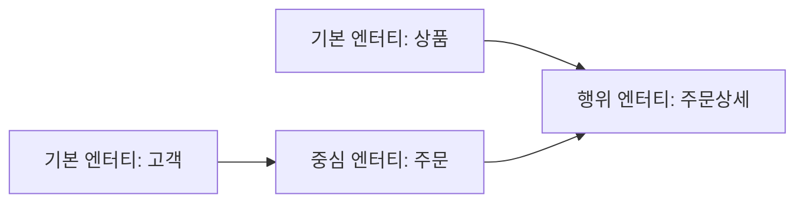
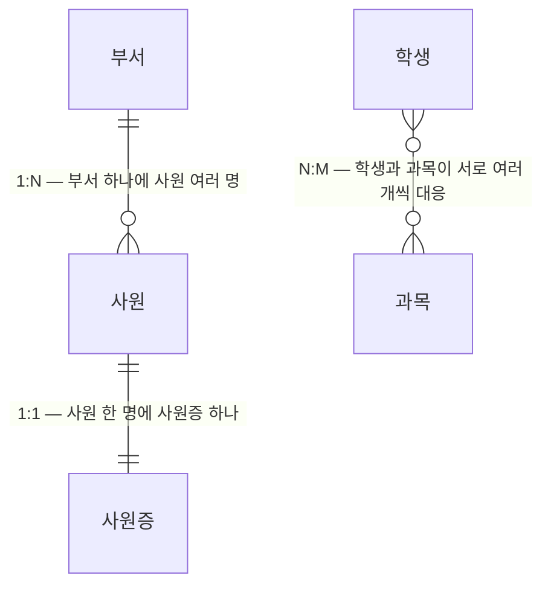
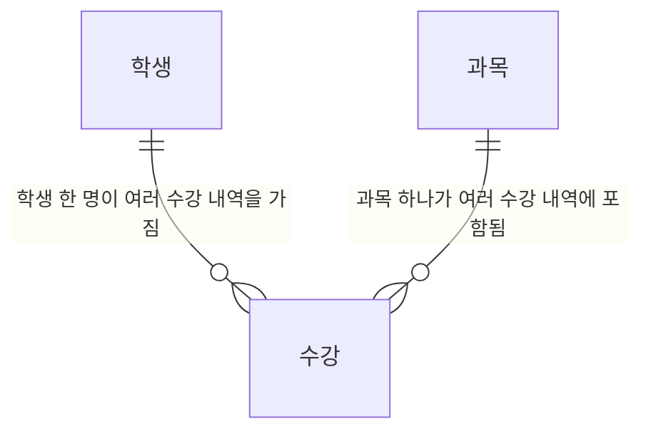

<Callout type="info">
  **이번 문서의 목표:** 이 파일을 다 읽으면 어떤 대상이 "엔터티가 될 자격이 있는지" 판단하고, 엔터티·속성을 여러 기준으로 정확히 분류하며, 관계의 카디널리티를 스스로 그려낼 수 있게 된다.
</Callout>

## 왜 이 문서가 중요한가

02편에서 ERD를 그리는 기호(표기법)를 익혔다면, 이번 편은 그 기호가 **가리키는 실체**를 다룹니다. "이 업무 대상이 엔터티가 맞는가?", "이 항목은 어떤 종류의 속성인가?", "두 엔터티는 어떤 관계로 묶이는가?"라는 질문에 정확히 답하는 것이 데이터 모델링의 첫 관문입니다.

기출 문제를 살펴보면 이 세 개념(엔터티·속성·관계) 중에서도 **엔터티의 분류**가 특히 반복 출제되는데, 그 이유는 분류 기준이 두 가지(발생 시점 기준, 유무형 기준)로 나뉘어 있고 출제자가 이 둘을 섞어서 헷갈리게 만들기 좋기 때문입니다. 이 편은 그 두 기준을 처음부터 분리해서 다룹니다.

> **쉽게 말하면:** 이 편은 "표(엔터티)로 만들 자격이 있는 대상", "표 안의 항목(속성)의 종류", "표와 표를 잇는 선(관계)의 의미"를 정의하는 편입니다.

## 1. 엔터티의 정의

**엔터티**(Entity)는 업무 수행에 필요하며, 관리해야 할 정보를 가지고 있는 대상으로서, 다른 엔터티와 구별되는 독립적인 실체입니다. "사원", "부서", "주문", "상품"처럼 업무에서 관리 대상이 되는 사물이나 사건의 집합을 가리킵니다.

> **쉽게 말하면:** 엔터티는 "이 업무에서 정보를 따로 관리해야 하는 것들의 묶음"입니다. 사람(사원, 고객), 사물(상품), 사건(주문, 계약)이 모두 대상이 될 수 있습니다.

여기서 헷갈리기 쉬운 점이 하나 있습니다. "엔터티"라고 하면 흔히 "홍길동이라는 한 사람"을 떠올리기 쉽지만, 정확히는 **엔터티는 집합**이고 "홍길동"은 그 집합에 속한 하나의 원소, 즉 **인스턴스**(Instance)입니다. 01편의 용어 대응표를 다시 떠올리면 "사원"이라는 **엔터티**(테이블)에 "홍길동", "김민준" 같은 여러 **인스턴스**(로우)가 속하는 구조입니다.

### 엔터티가 되기 위한 조건

아무 명사나 엔터티가 되는 것은 아닙니다. 기출에서 "엔터티의 특징으로 옳지 않은 것"을 고르는 문제가 반복 출제될 만큼, 아래 다섯 조건은 정확히 암기해야 합니다.

<Steps>

### 조건 1 — 업무에서 필요하고 관리되어야 하는 정보를 가져야 한다

그 업무 프로세스에 실제로 쓰이지 않는 대상은 엔터티로 만들 이유가 없습니다. "관리할 필요가 있는가"가 첫 번째 관문입니다.

### 조건 2 — 유일한 식별자로 각 인스턴스를 구분할 수 있어야 한다

엔터티 안의 인스턴스들은 서로 구별될 수 있어야 하며, 이를 위한 유일한 식별자(주식별자)를 가져야 합니다. 식별자의 구체적인 조건(유일성·최소성 등)은 04편(식별자)에서 깊게 다룹니다.

### 조건 3 — 인스턴스가 2개 이상이어야 한다

엔터티는 집합이므로, 원소(인스턴스)가 하나뿐이라면 굳이 별도의 표로 관리할 이유가 없습니다. "회사 하나만 있는 정보"처럼 인스턴스가 1개인 경우는 엔터티가 아니라 속성이나 상수로 다루는 편이 자연스럽습니다.

### 조건 4 — 속성을 2개 이상 가져야 한다

관리할 항목이 하나뿐이라면(예: 이름 하나만 있는 목록) 별도 엔터티로 분리할 실익이 적습니다. 엔터티는 여러 속성이 함께 모여 하나의 의미 있는 단위를 이룰 때 성립합니다.

### 조건 5 — 다른 엔터티와 최소 한 번 이상 관계를 맺어야 한다

관계형 모델에서 어떤 엔터티도 관계를 맺지 않는다면 데이터 모델 전체에서 고립된 섬이 됩니다. 업무적으로 다른 엔터티와 전혀 연관이 없는 대상은 그 자체로 이 모델에 포함될 필요가 있는지 의심해봐야 합니다(단, 이 조건은 실무에서 100퍼센트 강제되지는 않고, 시험에서는 원칙으로 다룹니다).

</Steps>

<Callout type="warning">
  **자주 틀리는 점:** "엔터티는 반드시 하나의 인스턴스만 가진다"처럼 조건 3을 뒤집은 오답이 자주 나옵니다. 정확히는 그 반대로, **엔터티는 두 개 이상의 인스턴스 집합**이어야 합니다. 다섯 조건(업무 필요성, 유일한 식별자, 인스턴스 2개 이상, 속성 2개 이상, 관계 존재)을 하나라도 뒤집어 놓으면 그것이 곧 오답 선택지가 됩니다.
</Callout>

## 2. 엔터티의 분류 — 두 가지 기준을 절대 섞지 말 것

엔터티를 나누는 기준은 **발생 시점**과 **유무형**이라는 서로 다른 두 축이 있습니다. 기출을 살펴보면 이 두 기준의 항목 이름(기본·중심·행위 vs 유형·개념·사건)을 섞어서 오답 선택지로 만드는 패턴이 반복됩니다. 그래서 이 절은 두 기준을 완전히 분리해서 각각 표로 정리합니다.

### 기준 A — 발생 시점에 따른 분류(기본·중심·행위)

이 기준은 "그 엔터티가 업무 흐름상 **언제** 생겨나는가"를 봅니다.

| 분류 | 정의 | 특징 | 예시 |
|------|------|------|------|
| 기본 엔터티(Key Entity, 기본키 엔터티) | 다른 엔터티의 도움 없이 **독립적으로 존재**하는 엔터티 | 업무에 원래 존재하는 정보, 다른 엔터티로부터 발생하지 않음 | 사원, 부서, 고객, 상품, 회사 |
| 중심 엔터티(Main Entity) | 기본 엔터티로부터 발생하며 업무의 **중심**을 이루는 엔터티 | 기본 엔터티를 참조하지만 그 자체로 업무의 핵심 개체 | 계약, 주문, 수주 |
| 행위 엔터티(Active Entity, 액티브 엔터티) | 두 개 이상의 엔터티(기본·중심)로부터 **업무 수행의 결과**로 발생 | 데이터가 지속적으로 발생·누적되어 양이 가장 많고 자주 변경됨 | 주문상세, 이체, 접수, 수강 |

> **쉽게 말하면:** 기본 엔터티는 "원래부터 있던 것"(사원, 부서), 중심 엔터티는 "그것들을 바탕으로 업무가 실제로 벌어지는 자리"(계약, 주문), 행위 엔터티는 "그 업무가 반복되면서 쌓이는 기록"(주문상세, 이체 내역)입니다.

이 그림에서 "주문상세"(행위 엔터티)는 "주문"(중심 엔터티)과 "상품"(기본 엔터티) 양쪽으로부터 발생합니다. 행위 엔터티는 이렇게 **두 개 이상의 선행 엔터티**를 필요로 하는 경우가 많고, 주문이 반복될수록 주문상세 데이터도 계속 쌓이므로 데이터 양이 가장 많습니다.

### 기준 B — 유무형에 따른 분류(유형·개념·사건)

이 기준은 "그 엔터티가 가리키는 대상이 **눈에 보이는 실체인가, 관리 목적의 개념인가, 시간에 따라 발생하는 사건인가**"를 봅니다. 발생 시점 기준과는 완전히 다른 잣대입니다.

| 분류 | 정의 | 예시 |
|------|------|------|
| 유형 엔터티(Tangible Entity) | 물리적 형태가 있어 눈으로 보고 만질 수 있는 대상 | 사원, 상품, 장비 |
| 개념 엔터티(Conceptual Entity) | 물리적 형태는 없지만 관리 목적으로 정의한 개념적 대상 | 부서, 조직, 직위 |
| 사건 엔터티(Event Entity) | 업무 수행 과정에서 시간의 흐름에 따라 발생하는 사건 | 주문, 신청, 계약, 사고 |

<Callout type="warning">
  **자주 틀리는 점 — 두 분류 기준을 섞는 것이 대표 함정이다:** "발생 시점에 따라 구분할 수 있는 엔터티의 유형으로 적절하지 않은 것은?"이라는 질문에 보기로 "기본 엔터티, 행위 엔터티, 중심 엔터티, **개념 엔터티**"를 나열하면, 개념 엔터티는 발생 시점 기준이 아니라 **유무형 기준**의 항목이므로 정답(적절하지 않은 것)이 됩니다. 반대로 유무형 분류를 묻는 문제에 "행위 엔터티"가 오답 보기로 섞여 나올 수도 있습니다. **"기본·중심·행위"는 발생 시점, "유형·개념·사건"은 유무형** — 이 두 묶음을 절대 뒤섞지 마십시오.
</Callout>

두 기준을 나란히 놓으면 다음과 같이 정리됩니다.

| 축 | 이 축에 속하는 분류 항목 |
|-----|---------------------------|
| 발생 시점 | 기본 엔터티, 중심 엔터티, 행위 엔터티 |
| 유무형 | 유형 엔터티, 개념 엔터티, 사건 엔터티 |

같은 대상(예: "주문")이 두 기준에서 각각 다른 이름으로 불릴 수 있다는 점도 기억해 두면 좋습니다. "주문"은 발생 시점 기준으로는 중심 엔터티(또는 문맥에 따라 행위 엔터티에 가깝게 다뤄지는 경우도 있음)이면서, 유무형 기준으로는 사건 엔터티입니다. 즉 한 엔터티에 두 기준의 이름표가 동시에 붙을 수 있습니다.

## 3. 속성의 정의와 분류

**속성**(Attribute)은 엔터티가 가지고 있는 고유한 특성으로, 하나의 인스턴스를 구성하는 세부 항목입니다. 01편 용어표에서 다뤘듯 관계형 DB의 컬럼에 대응합니다.

> **쉽게 말하면:** 속성은 엔터티(표)가 가진 항목(칸의 종류)입니다. "사원" 엔터티라면 사원번호, 사원명, 입사일, 부서 등이 속성입니다.

속성도 엔터티처럼 원칙이 있습니다. 하나의 인스턴스는 하나의 속성에 대해 **오직 하나의 값**만 가져야 합니다(원자값 원칙). 이것은 06편(정규화 1: 1NF~3NF)에서 배울 제1정규형의 핵심 조건과 그대로 이어집니다.

### 분류 기준 1 — 특성에 따른 분류(기본·설계·파생)

속성이 "어떻게 만들어졌는가"를 기준으로 나눈 분류입니다.

| 분류 | 정의 | 예시 |
|------|------|------|
| 기본속성(Basic Attribute) | 업무로부터 **원래 그대로 도출**되는 가장 근본적인 속성 | 사원명, 생년월일, 원금, 예치기간 |
| 설계속성(Designed Attribute) | 업무상 원래 존재하지 않지만 **모델링·관리 편의**를 위해 새로 정의한 속성 | 상품코드, 일련번호 같은 코드성 속성 |
| 파생속성(Derived Attribute) | 다른 속성(들)의 값을 **계산하거나 가공**해서 만들어지는 속성 | 나이(=현재일-생년월일), 합계금액, 계산이자(=원금×이자율×기간) |

> **비유:** 기본속성은 "원재료"이고, 설계속성은 관리를 위해 "새로 붙인 라벨"이며, 파생속성은 원재료를 조합해 만든 "가공식품"입니다. 가공식품은 원재료가 바뀌면 다시 만들어야 하듯, 파생속성도 원본 속성이 바뀌면 값을 다시 계산해야 정합성이 유지됩니다.

**파생속성이 왜 주의 대상인가**를 짚어야 합니다. 파생속성은 원본 데이터로부터 계산 가능하기 때문에 편의를 위해 미리 저장해 두는 경우가 많은데, 문제는 **원본 값이 바뀌었을 때 파생속성 값도 함께 갱신해줘야** 한다는 점입니다. 예를 들어 "생년월일"이 수정되었는데 미리 저장해 둔 "나이" 속성을 갱신하는 로직을 빠뜨리면, 생년월일과 나이가 서로 맞지 않는 **정합성 오류**가 발생합니다. 그래서 데이터 모델링 원칙에서는 파생속성을 **꼭 필요한 경우로 최소화**하고, 가능하면 조회 시점에 직접 계산하는 방식을 권장합니다.

<Callout type="warning">
  **자주 틀리는 점:** "이자율"이나 "예치기간"처럼 업무에서 직접 정해지는 값을 파생속성으로 착각하는 경우가 있습니다. 파생속성인지 판단하는 기준은 "**다른 속성으로부터 계산되어 나오는가**" 하나뿐입니다. 이자율·예치기간은 계약 시점에 직접 입력받는 기본속성이고, 그 둘을 곱해서 만든 "계산이자"만 파생속성입니다. "계산과 관련된 것 같다"는 인상만으로 파생속성이라 단정하지 말고, 실제로 다른 속성의 연산 결과인지를 확인해야 합니다.
</Callout>

### 분류 기준 2 — 구성 방식에 따른 분류(PK·FK·일반)

이 기준은 "그 속성이 테이블 안에서 **어떤 역할**을 하는가"를 봅니다. 01·02편에서 다룬 물리 모델링 용어와 바로 연결됩니다.

| 분류 | 정의 | 비고 |
|------|------|------|
| 기본키 속성(PK, Primary Key) | 인스턴스를 유일하게 식별하는 속성(집합) | 04편(식별자)에서 후보키·기본키 선정 기준을 깊게 다룬다 |
| 외래키 속성(FK, Foreign Key) | 다른 엔터티의 기본키를 참조해 관계를 표현하는 속성 | 이 편 4절의 "관계"가 물리적으로 구현된 형태 |
| 일반 속성(General Attribute) | 기본키·외래키가 아닌 나머지 모든 속성 | 사원명, 입사일처럼 그 엔터티 고유의 정보 |

두 분류 기준(특성 기준 vs 구성방식 기준)도 서로 독립적인 축입니다. 예를 들어 "부서코드"라는 속성은 구성방식 기준으로는 외래키(FK, 부서 엔터티를 참조)이면서, 특성 기준으로는 설계속성(코드성 속성)에 해당할 수 있습니다. 한 속성이 두 기준 각각에서 이름표를 하나씩 가진다는 점은 엔터티 분류와 같은 원리입니다.

## 4. 관계의 정의와 카디널리티

**관계**(Relationship)는 엔터티와 엔터티 사이에 존재하는 업무적인 연관성을 말합니다. 02편에서 다룬 ERD의 관계선이 바로 이 관계를 그림으로 표현한 것입니다.

> **쉽게 말하면:** 관계는 "이 두 엔터티가 서로 관련이 있다"는 사실 자체입니다. "사원은 부서에 소속된다", "고객은 주문을 한다"는 문장이 곧 관계입니다.

### 관계를 표현하는 세 가지 요소

관계는 그림 하나에 세 가지 정보를 함께 담습니다.

1. **관계명**(Relationship Name): 두 엔터티가 어떤 의미로 연관되는지 이름을 붙인 것. "소속한다", "주문한다"처럼 동사로 표현합니다.
2. **관계 차수**(Cardinality, 카디널리티): 한쪽 인스턴스 하나에 다른 쪽 인스턴스가 몇 개까지 대응하는지를 나타냅니다. 1:1, 1:N, N:M(다대다) 세 가지로 나뉩니다.
3. **관계 선택사양**(Optionality, 참여도): 그 관계에 반드시 참여해야 하는지(필수), 참여하지 않아도 되는지(선택)를 나타냅니다. 02편에서 다룬 동그라미·막대 기호가 이것을 표현합니다.

<Callout type="warning">
  **자주 틀리는 점:** 관계 표기 요소를 "관계명, 차수, 선택사양" 세 가지로 정확히 외워야 합니다. "관계 빈도(Relationship Frequency)"처럼 그럴듯하게 들리지만 표준 표기 요소가 아닌 용어를 보기에 섞어 놓는 문제가 실제로 출제된 적이 있습니다. 트랜잭션 발생 횟수 등은 성능 분석의 관점이지, ERD가 구조적으로 표기하는 요소가 아닙니다.
</Callout>

### 카디널리티 세 가지 — 1:1, 1:N, N:M

카디널리티는 두 엔터티 사이에서 인스턴스가 대응하는 개수의 패턴을 말합니다.

| 카디널리티 | 뜻 | 예시 |
|-------------|-----|------|
| 1:1 | 한쪽 인스턴스 하나에 다른 쪽 인스턴스도 정확히 하나만 대응 | 사원 – 사원증(사원 한 명당 사원증 한 장) |
| 1:N | 한쪽 인스턴스 하나에 다른 쪽 인스턴스가 여러 개 대응 | 부서 – 사원(부서 하나에 여러 사원이 소속) |
| N:M(다대다) | 양쪽 모두 서로 여러 개씩 대응 | 학생 – 과목(학생은 여러 과목을 듣고, 과목도 여러 학생이 들음) |

**N:M 관계는 관계형 데이터베이스에서 테이블 두 개만으로는 직접 구현할 수 없습니다.** 학생 테이블과 과목 테이블만 있으면 "이 학생이 어느 과목들을 듣는지"를 저장할 곳이 없기 때문입니다. 그래서 N:M 관계는 반드시 그 사이에 **새로운 엔터티(교차 엔터티, 관계 엔터티)를 하나 더 만들어** 1:N과 N:1(사실상 두 개의 1:N)로 풀어냅니다. 앞서 다룬 "학생 – 수강 – 과목" 구조가 바로 이 해소 방식이며, "수강"이 바로 두 기본 엔터티 사이에서 태어난 **행위 엔터티**입니다(2절 기준 A 참고).

이 그림에서 "수강"은 학생·과목 어느 쪽으로부터도 독립되지 않고 **양쪽 모두와 관계**를 맺습니다. 여기서 "수강 엔터티는 독립적으로 발생하는 기본 엔터티다"라고 서술하면 틀립니다. 수강은 학생과 과목이라는 두 기본 엔터티가 있어야만 비로소 생겨나는 행위 엔터티이기 때문입니다.

<Callout type="warning">
  **자주 틀리는 점:** "N:M 관계를 해소하는 교차 엔터티는 어느 쪽과도 관계를 맺지 않는 독립 엔터티다"라는 서술이 오답으로 나온 적이 있습니다. 정반대로, 교차 엔터티는 **N:M 관계의 양쪽 엔터티 모두와 관계(외래키)를 맺어야만** 그 역할을 할 수 있습니다. "독립적"이라는 단어가 나오면 그 엔터티가 정말 아무 관계도 없이 홀로 존재하는지 반드시 되짚어 보십시오.
</Callout>

## 핵심 정리

- **엔터티**는 업무에서 관리가 필요하고, 유일한 식별자·2개 이상의 인스턴스·2개 이상의 속성·다른 엔터티와의 관계를 모두 갖춰야 성립한다.
- 엔터티 분류는 **발생 시점 기준**(기본·중심·행위)과 **유무형 기준**(유형·개념·사건)이라는 서로 다른 두 축이 있으며, 이 둘을 섞는 것이 대표적인 함정이다.
- 속성은 **특성 기준**(기본·설계·파생)과 **구성방식 기준**(PK·FK·일반)으로 각각 분류되며, 파생속성은 원본 값 변경 시 정합성 관리 부담이 있어 최소화 대상이다.
- 관계는 **관계명·차수(카디널리티)·선택사양(참여도)** 세 요소로 표현되며, 카디널리티는 1:1, 1:N, N:M 세 가지다.
- **N:M 관계는 테이블 두 개만으로 구현할 수 없어** 교차(관계) 엔터티를 도입해 두 개의 1:N 관계로 풀어내야 한다.

## 마무리 복습

<Quiz
  questionNumber={1}
  question="엔터티가 성립하기 위한 조건으로 옳지 않은 것은?"
  options={['업무에서 필요하며 관리되어야 하는 정보를 가져야 한다', '각 인스턴스를 유일하게 구분하는 식별자를 가져야 한다', '엔터티는 반드시 하나의 인스턴스만 가져야 한다', '두 개 이상의 속성을 가지고, 다른 엔터티와 관계를 맺어야 한다']}
  correctAnswer={3}
  explanation="엔터티는 두 개 이상의 인스턴스로 이루어진 집합이어야 한다. '하나의 인스턴스만 가진다'는 조건은 엔터티 성립 조건과 정반대다."
  optionExplanations={['업무에서 관리가 필요하다는 것은 엔터티 성립의 옳은 조건이다', '유일한 식별자를 가져야 한다는 것은 엔터티 성립의 옳은 조건이다', '정답 — 엔터티는 두 개 이상의 인스턴스를 가져야 하므로 이 서술은 틀렸다', '속성 2개 이상과 관계 존재는 엔터티 성립의 옳은 조건이다']}
/>

<Quiz
  questionNumber={2}
  question="발생 시점에 따른 엔터티 분류에 해당하지 않는 것은?"
  options={['기본 엔터티', '중심 엔터티', '행위 엔터티', '개념 엔터티']}
  correctAnswer={4}
  explanation="발생 시점에 따른 분류는 기본·중심·행위 엔터티다. 개념 엔터티는 유무형에 따른 분류(유형·개념·사건)에 속하는 항목으로, 서로 다른 분류 기준을 섞어 놓은 오답이다."
  optionExplanations={['기본 엔터티는 발생 시점 분류에 속하는 옳은 항목이다', '중심 엔터티는 발생 시점 분류에 속하는 옳은 항목이다', '행위 엔터티는 발생 시점 분류에 속하는 옳은 항목이다', '정답 — 개념 엔터티는 유무형 분류에 속하며 발생 시점 분류가 아니다']}
/>

<Quiz
  questionNumber={3}
  question="고객, 상품, 주문, 주문상품 네 엔터티가 있을 때 각 엔터티의 발생 시점 분류로 옳은 것은?"
  options={['고객·상품은 행위 엔터티, 주문은 기본 엔터티, 주문상품은 중심 엔터티다', '고객·상품은 기본 엔터티, 주문은 중심 엔터티, 주문상품은 고객·상품과 무관한 독립 기본 엔터티다', '고객·상품은 기본 엔터티, 주문은 중심 엔터티, 주문상품은 주문과 상품의 관계에서 발생하는 행위 엔터티다', '네 엔터티 모두 발생 시점상 동일하게 기본 엔터티로 분류된다']}
  correctAnswer={3}
  explanation="고객·상품은 독립적으로 존재하는 기본 엔터티이고, 주문은 그로부터 발생하는 업무의 중심인 중심 엔터티이며, 주문상품은 주문과 상품의 관계에 의해 발생하는 행위 엔터티다."
  optionExplanations={['고객·상품은 기본 엔터티이지 행위 엔터티가 아니며, 분류가 전반적으로 뒤바뀌었다', '주문상품은 독립적인 기본 엔터티가 아니라 주문·상품 관계로부터 발생하는 행위 엔터티다', '정답 — 기본(고객·상품)-중심(주문)-행위(주문상품)의 순서가 옳다', '네 엔터티는 발생 시점 기준으로 서로 다른 세 분류(기본·중심·행위)에 속하므로 동일하게 볼 수 없다']}
/>

<Quiz
  questionNumber={4}
  question="다른 속성을 이용해 계산이나 가공을 거쳐 결과를 도출하는 속성을 무엇이라 하는가?"
  options={['설계속성', '기본속성', '파생속성', '일반속성']}
  correctAnswer={3}
  explanation="파생속성(Derived Attribute)은 다른 속성의 값을 계산·가공해 만들어지는 속성으로, 나이·합계금액·계산이자 등이 해당한다."
  optionExplanations={['설계속성은 업무에 원래 없지만 모델링 편의를 위해 새로 정의한 코드성 속성이다', '기본속성은 업무로부터 원래 그대로 도출되는 속성이다', '정답 — 계산·가공으로 도출되는 속성은 파생속성이다', '일반속성은 구성방식 기준(PK·FK·일반)의 분류로, 계산 여부와는 무관한 기준이다']}
/>

<Quiz
  questionNumber={5}
  question="은행이 예금분류 엔터티에서 원금·예치기간·이자율을 직접 입력받고, 계산이자를 원금×이자율×예치기간으로 산출한다고 할 때, 속성 분류에 대한 설명으로 옳은 것은?"
  options={['원금과 예치기간은 파생속성이다', '이자율과 예치기간은 다른 속성으로부터 계산된 파생속성이다', '계산이자는 원금·이자율·예치기간으로부터 산출되는 파생속성이다', '계산이자는 업무로부터 직접 입력받는 기본속성이다']}
  correctAnswer={3}
  explanation="계산이자는 원금·이자율·예치기간이라는 다른 속성들을 곱해 산출되므로 파생속성이다. 원금·예치기간·이자율은 모두 계약 시 직접 입력되는 기본속성이다."
  optionExplanations={['원금과 예치기간은 직접 입력받는 기본속성이지 파생속성이 아니다', '이자율과 예치기간은 직접 입력되는 기본속성이며 계산으로 도출되지 않는다', '정답 — 계산이자만 다른 속성들의 계산 결과이므로 파생속성이다', '계산이자는 계산 결과로 만들어지는 파생속성이지 직접 입력받는 기본속성이 아니다']}
/>

<Quiz
  questionNumber={6}
  question="ERD에서 관계(Relationship)를 표기할 때 사용하는 표준 요소가 아닌 것은?"
  options={['관계명', '관계 차수(카디널리티)', '관계 선택사양(참여도)', '관계 빈도']}
  correctAnswer={4}
  explanation="관계를 표기하는 표준 요소는 관계명, 관계 차수(카디널리티), 관계 선택사양(참여도) 세 가지다. 관계 빈도는 표준 표기 요소가 아니며, 트랜잭션 발생 횟수 등 성능 분석 관점의 용어일 뿐이다."
  optionExplanations={['관계명은 두 엔터티의 연관성을 명명하는 표준 표기 요소다', '관계 차수는 1:1, 1:N, N:M을 나타내는 표준 표기 요소다', '관계 선택사양은 필수·선택 참여를 나타내는 표준 표기 요소다', '정답 — 관계 빈도는 ERD의 표준 관계 표기 요소가 아니다']}
/>

<Quiz
  questionNumber={7}
  question="학생과 과목이 N:M(다대다) 관계일 때, 이를 관계형 데이터베이스로 구현하는 올바른 방법은?"
  options={['학생 테이블과 과목 테이블만으로 그대로 저장한다', '학생과 과목 사이에 수강 같은 교차 엔터티를 만들어 두 개의 1:N 관계로 해소한다', '과목 테이블에 학생 정보를 다중값 속성으로 그대로 저장한다', 'N:M 관계는 구현이 불가능하므로 둘 중 하나의 엔터티를 삭제한다']}
  correctAnswer={2}
  explanation="N:M 관계는 테이블 두 개만으로 직접 구현할 수 없어, 교차(관계) 엔터티를 도입해 학생-수강, 과목-수강 두 개의 1:N 관계로 풀어낸다."
  optionExplanations={['테이블 두 개만으로는 다대다 대응 관계를 저장할 곳이 없어 이 방법으로는 구현할 수 없다', '정답 — 교차 엔터티를 통한 두 개의 1:N 분해가 N:M 관계의 표준 구현 방법이다', '다중값 속성으로 저장하면 제1정규형(원자값 원칙)을 위반하게 된다', 'N:M 관계는 교차 엔터티로 해소 가능하며 엔터티를 삭제할 필요가 없다']}
/>

<Quiz
  questionNumber={8}
  question="고객과 상품 사이의 M:N 관계를 해소하기 위해 도출된 서비스이용 엔터티에 대한 설명으로 옳지 않은 것은?"
  options={['서비스이용은 고객, 상품 어느 쪽과도 관계를 맺지 않는 독립 엔터티다', '서비스이용은 고객과 상품의 M:N 관계를 해소하는 교차(관계) 엔터티다', '서비스이용은 발생 시점 기준으로 행위 엔터티에 해당한다', '서비스이용은 고객·상품 각각에 대한 외래키를 가진다']}
  correctAnswer={1}
  explanation="교차 엔터티는 M:N 관계를 해소하기 위해 양쪽 엔터티 모두와 관계(외래키)를 맺어야 그 역할을 할 수 있다. '어느 쪽과도 관계를 맺지 않는 독립 엔터티'라는 서술은 교차 엔터티의 본질과 정반대다."
  optionExplanations={['정답 — 교차 엔터티는 양쪽 모두와 관계를 맺어야 하므로 이 서술은 틀렸다', 'M:N 관계를 해소하는 교차 엔터티라는 설명은 옳다', '두 기본 엔터티로부터 발생하는 행위 엔터티라는 설명은 옳다', '양쪽 엔터티의 기본키를 외래키로 가진다는 설명은 옳다']}
/>

## 참고 자료

- [데이터자격시험 - SQLD 출제기준](https://www.dataq.or.kr/www/sub/a_04.do)
- [MDN - SQL 개요 (관계형 DB 기초)](https://developer.mozilla.org/ko/docs/Glossary/SQL)
