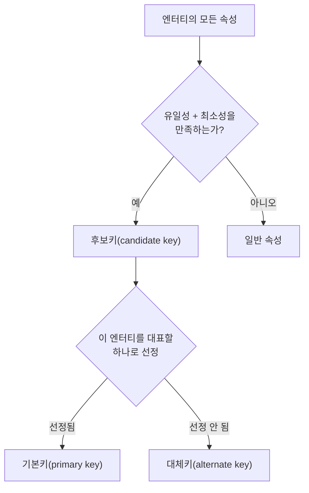

<Callout type="info">
  **이번 문서의 목표:** 이 파일을 다 읽으면 어떤 속성이 주식별자가 될 자격이 있는지 스스로 판정하고, 식별자를 분류하는 네 가지 기준을 구분하며, SQLD 기출의 단골 함정인 **식별관계와 비식별관계의 차이**를 ERD만 보고 즉시 구별할 수 있게 된다.
</Callout>

## 왜 식별자가 필요한가

03편에서 엔터티(entity)는 "관리할 필요가 있는 정보의 집합"이고, 그 안의 각 행 하나하나를 인스턴스(instance)라고 부른다고 배웠습니다. 그런데 "학생"이라는 엔터티에 이름이 똑같은 "김민준"이 세 명 있다면, 시스템은 그중 누구의 성적을 조회해야 할지 알 수 없습니다. 사람은 문맥으로 구분하지만 데이터베이스는 문맥을 모릅니다.

> **쉽게 말하면:** 식별자(identifier)는 "이 행은 다른 모든 행과 다른, 세상에 하나뿐인 이 행이다"라고 증명하는 속성 또는 속성의 묶음입니다.

식별자가 없으면 엔터티는 그저 값이 나열된 표에 불과합니다. 특정 행을 지목해 수정하거나 삭제할 방법이 없고, 다른 엔터티가 "그 학생"을 가리켜 참조할 방법도 없습니다. 그래서 SQLD 데이터 모델링 출제범위는 엔터티의 성립 조건 중 하나로 "식별자를 가져야 한다"를 명시하며, 실제로 이 조건 자체를 묻는 문제(예: "엔터티의 조건으로 부적절한 것은?")가 반복 출제됩니다.

## 1. 식별자의 특징 — 후보가 되기 위한 자격 조건

모든 속성이 식별자가 될 수 있는 것은 아닙니다. 어떤 속성(또는 속성 묶음)이 주식별자(主識別子, primary identifier) 후보가 되려면 다음 네 조건을 만족해야 합니다.

| 조건 | 의미 | 위반 예시 |
|------|------|-----------|
| 유일성(uniqueness) | 하나의 엔터티 안에서 모든 인스턴스가 서로 다른 값을 가져야 한다 | "이름"은 동명이인이 있어 유일성이 깨진다 |
| 최소성(minimality) | 유일성을 만족하는 선에서 속성 개수가 가장 적어야 한다 | (학번, 이름) 두 속성으로 묶었는데 학번 하나로도 이미 유일하다면 이름은 군더더기다 |
| 불변성(stability) | 값이 자주 바뀌지 않아야 한다 | "휴대폰번호"를 주식별자로 쓰면 번호를 바꾼 사람의 과거 데이터 연결이 끊어질 위험이 있다 |
| 존재성(not null) | 모든 인스턴스가 값을 반드시 가져야 한다(NULL 불가) | 아직 배정되지 않아 비어 있을 수 있는 "담당자사번"은 부적합하다 |

이 네 조건 중 유일성과 최소성 두 가지를 만족하는 속성(또는 속성 묶음)의 집합을 **후보키**(candidate key, 후보 키)라고 부릅니다. 후보키는 이름 그대로 "주식별자가 될 자격이 있는 후보"입니다. 한 엔터티에 후보키가 여러 개 있을 수 있습니다.

예를 들어 "사원" 엔터티에 사원번호와 (주민등록번호 뒷자리를 제외한) 이메일 주소가 각각 유일하다면, 두 속성 모두 후보키입니다.

<Callout type="warning">
  **자주 틀리는 점:** 57회 기출에서 "주식별자에 관한 설명 중 틀린 것은?"의 오답 선택지로 "주식별자는 NULL이어도 된다"가 등장했습니다. 존재성 조건을 거꾸로 뒤집은 전형적인 함정입니다. 주식별자는 반드시 NOT NULL이어야 하며, 이는 관계형 모델의 **엔터티 무결성**(entity integrity) 규칙 그 자체입니다.
</Callout>

## 2. 후보키에서 기본키·대체키로 — 하나를 고르는 과정

후보키가 여러 개 있을 때, 그중 실제로 그 엔터티를 대표해 사용할 **하나**를 골라야 합니다.



- **기본키**(primary key, PK): 후보키 중 실제로 엔터티를 대표하는 대표 선수로 뽑혀, 다른 엔터티가 이 엔터티를 참조할 때 실제로 쓰이는 식별자입니다. 관계형 데이터베이스는 테이블마다 기본키를 하나만 지정할 수 있습니다.
- **대체키**(alternate key, AK): 후보키였지만 기본키로 선정되지 못한 나머지입니다. 대표로 뽑히지 못했다고 자격을 잃는 것은 아닙니다 — 여전히 유일성이 보장되므로 `UNIQUE` 제약조건으로 선언해 중복을 막고, 필요하면 참조 무결성의 참조 대상(다른 테이블이 외래키로 가리키는 대상)으로도 쓸 수 있습니다.

사원 엔터티의 예로 돌아가면, 사원번호를 기본키로 뽑았다면 이메일 주소는 대체키가 되어 `UNIQUE` 제약을 겁니다. 이렇게 하면 이메일 중복 가입 같은 업무 규칙 위반을 데이터베이스 차원에서 막을 수 있습니다.

<Callout type="warning">
  **자주 틀리는 점:** "고유키(대체키)는 NULL을 여러 개 허용하는가?"를 묻는 문제가 반복됩니다. 표준적으로 `UNIQUE` 제약은 NULL을 값이 없는 상태로 보아 여러 행에서 중복 허용하지만(NULL끼리는 서로 다르다고 취급), 기본키는 NOT NULL과 결합되어 있어 NULL 자체가 아예 불가능합니다. "**기본키는 고유키에 NOT NULL을 더한 것**"으로 기억하면 두 개념을 헷갈리지 않습니다.
</Callout>

## 3. 주식별자 도출 기준 — 실무에서 어떻게 고르는가

후보키가 여러 개일 때 무엇을 기본키(주식별자)로 뽑을지는 다음 우선순위를 참고합니다.

1. 해당 업무에서 **자주 이용되는** 속성을 우선한다 — 조회 조건으로 자주 쓰이는 속성일수록 대표 자격이 있다.
2. **명칭이나 내역**이 아닌, 값이 안정적인 코드성 속성을 우선한다 — "주소"보다는 "학번"처럼 체계적으로 부여된 값을 우선한다.
3. **속성의 수가 적은 것**을 우선한다 — 이미 최소성 조건을 만족하는 후보키 중에서도 더 단순한 쪽을 우선한다.

이 기준을 적용해도 마땅한 자연스러운 속성이 없거나, 있는 속성이 너무 복잡하면 인위적으로 식별자를 만들어 냅니다. 이 판단은 아래 5절의 본질식별자·인조식별자 구분과 바로 이어집니다.

## 4. 식별자의 네 가지 분류 기준

식별자는 하나의 잣대로만 나뉘지 않습니다. SQLD는 다음 **네 가지 서로 다른 기준**으로 식별자를 분류하며, 기출에서는 이 기준들을 섞어서 "다음을 본질식별자와 인조식별자로 분류하시오" 같은 형태로 묻습니다. 기준이 다르다는 것 자체를 먼저 명확히 구분해야 합니다.

| 분류 기준 | 종류 | 의미 |
|-----------|------|------|
| 대표성 여부 | 주식별자(primary identifier) | 대표로 선정되어 실제로 사용되는 식별자(기본키) |
| 대표성 여부 | 보조식별자(secondary identifier) | 대표로 선정되지 못한 후보키(대체키) |
| 생성 위치 | 내부식별자(internal identifier) | 엔터티 스스로 자신의 속성만으로 만들어 내는 식별자 |
| 생성 위치 | 외부식별자(foreign identifier) | 다른 엔터티와의 관계를 통해 넘겨받는 식별자(외래키가 주식별자에 포함되는 경우) |
| 구성 속성 수 | 단일식별자(single identifier) | 속성 하나로 구성된 식별자 |
| 구성 속성 수 | 복합식별자(composite identifier) | 속성 두 개 이상이 묶여야 유일성이 성립하는 식별자 |
| 대체 여부 | 본질식별자(natural identifier) | 업무 자체에서 자연적으로 존재하는 값(주민등록번호, 학번, 사업자등록번호) |
| 대체 여부 | 인조식별자(surrogate identifier) | 본질식별자가 마땅치 않을 때 시스템이 인위적으로 부여하는 값(시퀀스, UUID) |

<Callout type="warning">
  **자주 틀리는 점:** "외래키(FK)는 항상 내부식별자다"라는 선택지가 오답으로 등장했습니다. 틀렸습니다 — 외래키가 그 엔터티의 **주식별자 일부**로 편입되면 외부식별자이고, 그저 일반 속성으로만 들어가 있으면 식별자 취급조차 받지 않습니다. "외래키 = 무조건 외부식별자"도 아니고 "외래키 = 무조건 내부식별자"도 아닙니다. 그 외래키가 이 엔터티의 주식별자 구성에 참여하는지를 봐야 합니다.
</Callout>

### 복합식별자와 인조식별자의 트레이드오프

복합식별자는 값 자체는 의미가 명확하지만, 04절 3항의 관계(다음 05·06편에서 다룰 자식 엔터티로의 전파)를 따라 하위 엔터티로 갈수록 속성 개수가 계속 늘어나는 문제가 있습니다. 예를 들어 "계약(계약년도, 지역코드, 계약순번)"처럼 3개 속성이 묶인 복합키를 자식 엔터티인 "납부"가 그대로 물려받고, 납부의 자식인 "환불"이 또 물려받으면 환불 엔터티의 기본키는 5개, 6개로 계속 불어납니다.

이런 상황에서 시스템이 자동 채번하는 단일 속성 인조식별자("계약ID")를 도입하면 조인 조건이 단순해지고 자식으로의 전파도 가벼워집니다. 다만 인조식별자를 도입한다고 해서 원래 있던 본질식별자의 유일성 관리가 사라지는 것은 아닙니다 — 계약년도·지역코드·계약순번의 조합이 실제로 유일해야 한다는 업무 규칙 자체는 그대로 남으므로, 이 조합에 별도로 `UNIQUE` 제약(대체키)을 걸어 계속 관리해야 합니다.

<Callout type="warning">
  **자주 틀리는 점:** "인조식별자를 도입하면 본질식별자의 유일성 관리 자체가 필요 없어진다"는 44회 모의고사의 대표적인 오답 함정입니다. 인조식별자는 주식별자 "자리"만 대신할 뿐, 업무상 유일해야 하는 값이라는 사실은 변하지 않습니다.
</Callout>

## 5. 식별관계와 비식별관계 — 기출 최다 빈출 포인트

이제 이 문서에서 가장 중요한 개념입니다. 두 엔터티가 1대다(1:M) 관계로 연결될 때, 부모 엔터티의 주식별자가 자식 엔터티로 **어떻게** 넘어가는지에 따라 관계는 두 가지로 나뉩니다.

> **쉽게 말하면:** 부모의 기본키가 자식의 기본키 "안으로" 들어가면 식별관계, 자식의 그냥 "일반 속성(외래키)"으로만 들어가면 비식별관계입니다.

### 예시로 대조하기 — 학과와 학생

학과(학과코드 PK, 학과명)와 학생이 1:M 관계라고 합시다. 학생 엔터티를 설계하는 두 가지 방식을 나란히 봅니다.

**방식 A — 식별관계(identifying relationship)**

| 학생(자식) | 속성 구분 |
|------------|-----------|
| 학과코드 | 기본키의 일부(부모에게서 상속받은 PK) + 외래키 |
| 학번 | 기본키의 일부 |
| 학생명 | 일반 속성 |

이 경우 학생의 기본키는 (학과코드, 학번) 두 속성이 합쳐진 복합키입니다. 학과코드가 **기본키 자리**에 들어가 있다는 점이 핵심입니다.

**방식 B — 비식별관계(non-identifying relationship)**

| 학생(자식) | 속성 구분 |
|------------|-----------|
| 학번 | 기본키 |
| 학과코드 | 일반 속성(외래키) |
| 학생명 | 일반 속성 |

이 경우 학생의 기본키는 학번 하나뿐입니다. 학과코드는 여전히 학과 엔터티를 참조하는 외래키이지만, 기본키 자리가 아니라 **일반 속성 자리**에 있습니다.

```mermaid
erDiagram
  DEPARTMENT ||--o{ STUDENT_A : "식별관계 (부모 PK가 자식 PK 일부)"
  DEPARTMENT ||--o{ STUDENT_B : "비식별관계 (부모 PK가 자식 FK 일반속성)"
  DEPARTMENT {
    string 학과코드 PK
    string 학과명
  }
  STUDENT_A {
    string 학과코드 PK_FK
    string 학번 PK
    string 학생명
  }
  STUDENT_B {
    string 학번 PK
    string 학과코드 FK
    string 학생명
  }
```

### 표기법의 차이 — 실선과 점선

실제 ERD 표기법(IE 표기법, Barker 표기법 모두 공통)에서는 두 관계를 선의 모양으로 구분합니다.

| 구분 | 선 모양 | 의미 |
|------|---------|------|
| 식별관계 | 실선 | 부모 없이는 자식이 독립적으로 존재조차 할 수 없는 강한 종속 |
| 비식별관계 | 점선 | 자식이 부모 참조 없이도 독립적으로 존재 가능한 약한 종속 |

이 실선·점선 차이는 단순한 그림 규칙이 아니라 **자식 엔터티가 부모 없이 홀로 의미를 가질 수 있는가**라는 업무적 판단을 반영합니다. 방식 A(식별관계)에서는 "학과 없는 학생"이라는 개념 자체가 성립하지 않는다고 본 것이고, 방식 B(비식별관계)에서는 학생이라는 존재는 일단 학번만으로 독립적으로 식별 가능하며 학과 소속은 부가 정보로 취급한 것입니다.

### 어느 쪽을 선택하는가 — 판단 기준

| 판단 기준 | 식별관계를 선택 | 비식별관계를 선택 |
|-----------|-----------------|-------------------|
| 자식의 존재 의미 | 부모 없이는 존재 자체가 무의미하다(강한 종속) | 부모와 별개로 독립적 존재 의미가 있다 |
| 자식 스스로의 식별력 | 자신만의 속성으로는 유일성을 보장할 수 없다 | 자신만의 속성(또는 인조키)으로 유일성이 이미 보장된다 |
| 상위 정보 조회 빈도 | 상위 키 값을 조인 없이 자주 조회해야 한다 | 상위 정보 조회가 상대적으로 드물다 |
| 기본키 전파 부담 | 감내할 만하다 | 여러 단계로 전파되면 복합키가 과도하게 길어진다 |

<Callout type="warning">
  **자주 틀리는 점 1:** "1:M 관계라면 자식의 기본키에 부모의 식별자가 항상 포함되어야 한다"는 오답이 반복 출제됩니다. 43회 모의고사에서 "고객-주문" 1:M 관계를 예로 들며 "주문 엔터티의 기본키에 고객코드가 포함되어야 한다"를 옳지 않은 선택지로 제시했습니다. 주문번호 하나로 이미 각 주문이 유일하게 식별된다면 고객코드는 외래키로만 있으면 충분합니다 — **1:M이라고 해서 자동으로 식별관계가 되는 것은 아닙니다.** 식별관계 여부는 관계의 차수가 아니라 "자식이 부모 없이 독립적으로 식별 가능한가"로 결정됩니다.

  **자주 틀리는 점 2:** "비식별관계로 바꾸면 조인이 없어져 조회 성능이 항상 향상된다"도 자주 나오는 함정입니다(59회 기출). 오히려 반대로 작동하는 경우가 있습니다 — 식별관계는 부모의 키가 자식의 기본키 안에 들어와 있으므로, 자식 데이터만 보고도 상위 키 값을 조인 없이 바로 얻을 수 있어 특정 조회에는 더 유리합니다. 비식별관계는 모델을 단순하게 만들지만, 상위 정보를 얻으려면 오히려 조인이 필요해질 수 있다는 트레이드오프가 있습니다. "비식별 = 항상 성능 우위"라는 일반화는 틀린 진술입니다.

  **자주 틀리는 점 3:** "식별관계에서 부모의 기본키는 자식에게 절대 전달되지 않는다"는 정의를 정반대로 뒤집은 오답입니다. 식별관계의 정의 자체가 "부모 기본키가 자식 기본키의 일부로 전달(상속)된다"는 것이므로, 이 선택지가 나오면 바로 오답으로 골라야 합니다.
</Callout>

## 핵심 정리

- 주식별자 후보(후보키)는 유일성과 최소성을 모두 만족해야 하며, 실제 기본키는 여기에 불변성·존재성(NOT NULL)까지 고려해 대표로 뽑는다.
- 후보키 중 대표로 뽑히지 못한 나머지는 대체키이며, `UNIQUE` 제약으로 관리한다. 기본키는 고유키에 NOT NULL이 더해진 것으로 이해하면 헷갈리지 않는다.
- 식별자 분류는 대표성(주/보조), 생성 위치(내부/외부), 구성 속성 수(단일/복합), 대체 여부(본질/인조)라는 **서로 다른 네 기준**이 겹쳐 있다.
- **식별관계는 부모의 기본키가 자식의 기본키 일부로 상속(실선)되고, 비식별관계는 자식의 일반 속성(외래키)으로만 상속(점선)된다.** 관계의 차수(1:M 등)와는 별개의 판단이다.
- 비식별관계가 항상 성능에 유리하다는 식의 절대적 일반화는 트레이드오프를 무시한 오답 패턴이므로 경계한다.

## 마무리 복습

<Quiz
  questionNumber={1}
  question="주식별자 후보가 되기 위한 조건으로 옳지 않은 것은?"
  options={['모든 인스턴스가 서로 다른 값을 가져야 한다', '유일성을 만족하는 선에서 속성 개수가 최소여야 한다', '값이 NULL이어도 무방하다', '값이 자주 바뀌지 않아야 한다']}
  correctAnswer={3}
  explanation="주식별자는 엔터티 무결성 규칙에 따라 반드시 NOT NULL이어야 한다. NULL이어도 된다는 것은 존재성 조건을 위반한 진술이다. 나머지 셋은 각각 유일성, 최소성, 불변성 조건을 올바르게 설명한다."
  optionExplanations={['유일성 조건을 올바르게 설명했다', '최소성 조건을 올바르게 설명했다', '정답 — 주식별자는 NOT NULL이어야 하므로 이 진술이 틀렸다', '불변성 조건을 올바르게 설명했다']}
/>

<Quiz
  questionNumber={2}
  question="후보키와 기본키, 대체키의 관계를 가장 정확히 설명한 것은?"
  options={['기본키가 여러 개 모여 후보키가 된다', '후보키 중 대표로 선정된 것이 기본키이고, 나머지는 대체키다', '대체키는 후보키의 조건을 만족하지 못한 속성이다', '한 엔터티는 후보키를 하나만 가질 수 있다']}
  correctAnswer={2}
  explanation="후보키는 유일성과 최소성을 만족하는 속성(묶음)의 집합이며, 그중 대표로 선정되어 실제 사용되는 것이 기본키, 선정되지 못한 나머지가 대체키다. 한 엔터티에 후보키는 여러 개 있을 수 있다."
  optionExplanations={['기본키와 후보키의 포함 관계가 거꾸로 되어 있다', '정답 — 대표 선정 여부로 기본키와 대체키가 갈린다', '대체키도 후보키 조건(유일성·최소성)을 만족한다', '후보키는 여러 개 있을 수 있다']}
/>

<Quiz
  questionNumber={3}
  question="외래키(FK)와 내부식별자·외부식별자의 관계에 대한 설명으로 가장 적절한 것은?"
  options={['외래키는 항상 내부식별자로 분류된다', '외래키는 항상 외부식별자로 분류된다', '외래키가 그 엔터티의 주식별자 일부로 편입될 때만 외부식별자가 된다', '외래키는 식별자 분류와 무관한 개념이다']}
  correctAnswer={3}
  explanation="외부식별자는 다른 엔터티와의 관계로 넘겨받아 자신의 주식별자 구성에 참여하는 식별자를 말한다. 외래키가 일반 속성으로만 존재하면 식별자 분류에 포함되지 않으므로, 주식별자 편입 여부가 기준이 된다."
  optionExplanations={['외래키가 일반 속성으로만 있으면 식별자 자체가 아니다', '식별관계가 아니면 외부식별자가 아니다', '정답 — 주식별자 편입 여부가 판단 기준이다', '외래키의 식별자 편입 여부는 내부·외부 분류와 직접 관련된다']}
/>

<Quiz
  questionNumber={4}
  question="복합키 기반의 자연 식별자를 인조식별자(시퀀스)로 대체하는 이유로 가장 적절한 것은?"
  options={['업무적 의미를 더 풍부하게 담기 위해서', '자식 엔터티로의 기본키 전파를 단순화하기 위해서', '본질식별자의 유일성 관리를 완전히 없애기 위해서', '데이터베이스가 자동으로 값을 검증해 주기 때문에']}
  correctAnswer={2}
  explanation="인조식별자를 도입하는 대표적인 이유는 복합키가 자식·손자 엔터티로 계속 전파되며 비대해지는 문제를 단일 속성으로 단순화하기 위해서다. 인조식별자는 자리만 대신할 뿐 원래 값의 유일성 관리 필요성을 없애지는 않는다."
  optionExplanations={['인조식별자는 오히려 업무적 의미가 없는 값이다', '정답 — 복합키 전파 문제를 단순화한다', '원래 속성 조합의 유일성 관리는 여전히 필요하다', '유일성 검증은 별도의 제약조건으로 계속 관리해야 한다']}
/>

<Quiz
  questionNumber={5}
  question="고객(고객코드 PK)과 주문이 1:M 관계이고, 각 주문은 주문번호만으로 이미 유일하게 식별된다고 할 때 가장 적절한 설계는?"
  options={['주문의 기본키를 (고객코드, 주문번호) 복합키로 구성한다', '주문의 기본키는 주문번호 단일 속성으로 하고, 고객코드는 외래키(일반 속성)로 둔다', '주문에는 고객코드를 아예 저장하지 않는다', '고객 엔터티를 없애고 주문에 고객 정보를 모두 병합한다']}
  correctAnswer={2}
  explanation="주문번호만으로 이미 유일성이 보장되므로 고객코드까지 기본키에 포함할 필요가 없다. 이는 비식별관계로 설계하는 것이 적절한 대표 사례이며, 1:M 관계라고 해서 자동으로 식별관계가 되는 것은 아니다."
  optionExplanations={['불필요하게 복합키를 만드는 식별관계 설계다 — 주문번호만으로 충분하다', '정답 — 비식별관계가 적절한 사례다', '외래키를 제거하면 참조 무결성을 보장할 수 없다', '정규화를 거스르는 과도한 병합이다']}
/>

<Quiz
  questionNumber={6}
  question="식별관계와 비식별관계에 대한 설명으로 옳지 않은 것은?"
  options={['식별관계에서는 부모의 기본키가 자식의 기본키 일부로 상속된다', '비식별관계에서는 부모의 기본키가 자식의 일반 속성(외래키)으로 상속된다', '비식별관계로 설계하면 조인이 사라져 조회 성능이 항상 향상된다', '식별관계는 실선, 비식별관계는 점선으로 표기하는 것이 일반적이다']}
  correctAnswer={3}
  explanation="비식별관계는 상위 키가 자식의 일반 속성으로만 존재하므로, 오히려 상위 정보를 조회할 때 조인이 더 필요해질 수 있다. 조회 성능이 항상 향상된다는 것은 트레이드오프를 무시한 과도한 일반화이며 옳지 않다."
  optionExplanations={['식별관계의 정의를 올바르게 설명했다', '비식별관계의 정의를 올바르게 설명했다', '정답 — 항상 향상된다는 진술은 트레이드오프를 무시한 오류다', '실선·점선 표기 관례를 올바르게 설명했다']}
/>

<Quiz
  questionNumber={7}
  question="다음 중 본질식별자로 분류하기에 가장 적절한 것은?"
  options={['주문 시퀀스로 자동 채번한 주문번호', 'surrogate key로 부여한 회원ID', '사업자등록번호', '내부 관리를 위해 시스템이 부여한 임의의 관리번호']}
  correctAnswer={3}
  explanation="본질식별자는 업무 자체에서 자연적으로 존재하고 부여되는 값이다. 사업자등록번호는 국세청 등록 절차에서 업무적으로 부여되는 값이므로 본질식별자에 해당한다. 나머지는 모두 시스템이 인위적으로 채번한 인조식별자다."
  optionExplanations={['시퀀스로 자동 채번했으므로 인조식별자다', 'surrogate key라고 명시했으므로 인조식별자다', '정답 — 업무에서 자연 발생하는 본질식별자다', '시스템이 인위적으로 부여했으므로 인조식별자다']}
/>

<Quiz
  questionNumber={8}
  question="후보키·기본키·대체키에 대한 설명으로 가장 적절한 것은?"
  options={['대체키는 UNIQUE 제약을 걸 수 없다', '기본키는 고유키(UNIQUE) 제약과 NOT NULL 제약이 결합된 것으로 볼 수 있다', '한 테이블에는 기본키를 두 개 이상 지정할 수 있다', '고유키(대체키)로는 다른 테이블의 참조 무결성 대상이 될 수 없다']}
  correctAnswer={2}
  explanation="기본키는 유일성(UNIQUE)과 NOT NULL이 함께 적용된 제약으로 볼 수 있다. 대체키는 UNIQUE 제약으로 관리하며 참조 무결성의 참조 대상이 될 수 있고, 한 테이블의 기본키는 하나만 지정 가능하다."
  optionExplanations={['대체키는 UNIQUE 제약으로 관리하는 것이 일반적이다', '정답 — 기본키를 이렇게 이해하면 고유키와 헷갈리지 않는다', '기본키는 테이블당 하나만 지정할 수 있다', '고유키도 참조 무결성의 참조 대상 후보가 될 수 있다']}
/>

## 참고 자료

- [데이터자격시험 - SQLD 출제기준](https://www.dataq.or.kr/www/sub/a_04.do)
- [MDN - SQL 개요 (관계형 DB 기초)](https://developer.mozilla.org/ko/docs/Glossary/SQL)
