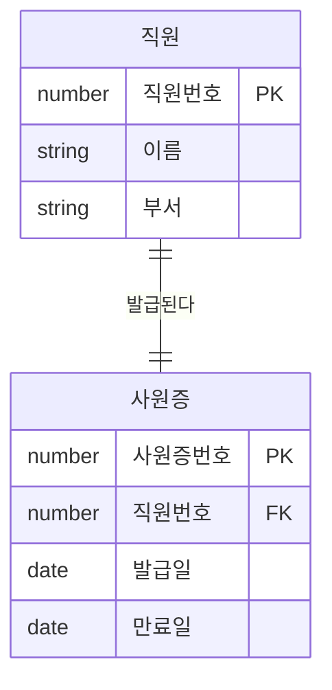
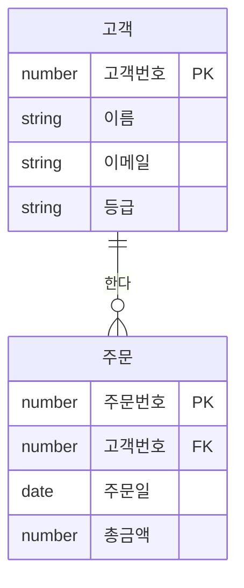
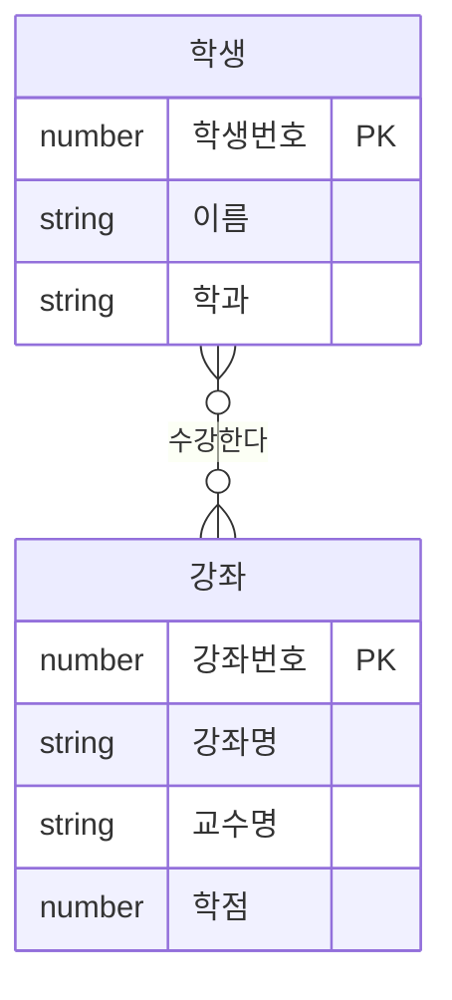
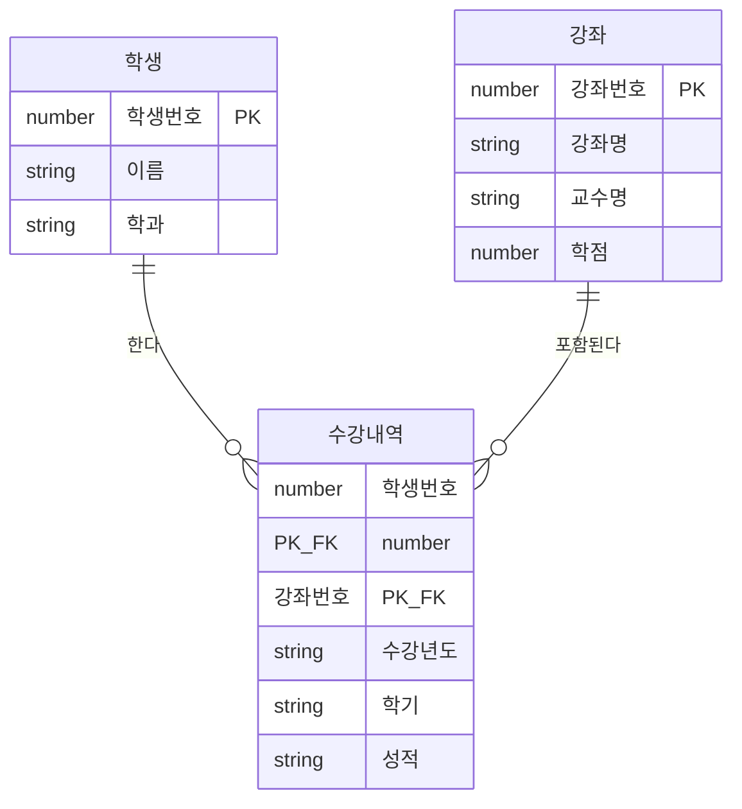
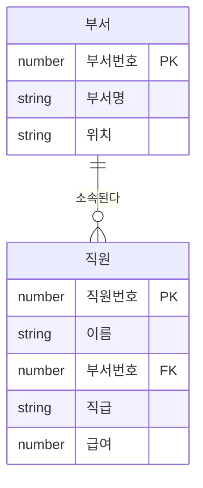

<Callout type="info">
  **이번 문서의 목표:** 엔터티 간의 관계가 무엇인지 이해하고, 1:1/1:N/M:N 차수와 필수/선택 선택성을 ERD에서 읽고 표현할 수 있다.
</Callout>

## 관계(Relationship)란?

**관계(Relationship)**는 두 엔터티 사이의 **업무적 연관성**입니다. 관계는 ERD에서 두 엔터티를 잇는 선으로 표현됩니다.

예를 들어:
- 고객은 주문을 **한다**
- 직원은 부서에 **소속된다**
- 학생은 강좌를 **수강한다**

동사로 표현되는 이 연관성이 바로 관계입니다.

### 관계의 구성 요소

관계를 완전히 정의하려면 세 가지를 결정해야 합니다.

1. **관계명**: 관계를 설명하는 동사 (예: "한다", "소속된다")
2. **차수(Cardinality)**: 몇 대 몇의 관계인가? (1:1, 1:N, M:N)
3. **선택성(Optionality)**: 반드시 존재해야 하는가, 없어도 되는가? (필수/선택)

## 차수(Cardinality): 관계의 수량

**차수(Cardinality)**는 한 엔터티의 인스턴스(행)가 반대편 엔터티의 인스턴스와 몇 개까지 연결될 수 있는지를 나타냅니다.

### 1:1 관계 (일대일)

한 인스턴스가 반대편의 정확히 하나의 인스턴스와만 연결됩니다.

- 한 직원은 사원증을 하나만 가집니다
- 하나의 사원증은 한 직원에게만 발급됩니다
- **실제로 1:1 관계는 드뭅니다.** 대부분 두 엔터티를 하나로 합칠 수 있는지 검토해야 합니다

### 1:N 관계 (일대다) — 가장 흔한 관계

한 인스턴스가 반대편의 여러 인스턴스와 연결될 수 있습니다.

- 한 고객은 여러 개의 주문을 할 수 있습니다 (1:N에서 N 쪽)
- 하나의 주문은 반드시 하나의 고객에게 속합니다 (1:N에서 1 쪽)
- **1:N 관계가 가장 일반적**입니다. 부서-직원, 게시판-게시글, 카테고리-상품 모두 1:N입니다

### M:N 관계 (다대다)

양쪽 모두 여러 개와 연결될 수 있습니다.

- 한 학생은 여러 강좌를 수강할 수 있습니다
- 하나의 강좌에는 여러 학생이 있을 수 있습니다
- **M:N 관계는 데이터베이스에서 직접 구현이 불가능합니다**

### M:N 관계를 해소하는 방법

M:N 관계는 중간에 **교차 엔터티(Associative Entity)**를 만들어 두 개의 1:N 관계로 변환합니다.

**수강내역** 테이블이 교차 엔터티입니다. 학생번호와 강좌번호를 복합 기본키로 가지며, 추가 정보(성적, 학기)도 담을 수 있습니다.

## 선택성(Optionality): 필수 vs 선택

**선택성**은 관계에서 해당 엔터티가 반드시 존재해야 하는지를 나타냅니다.

- **필수(Mandatory)**: 반드시 존재해야 합니다. ERD에서 `|` (직선)으로 표현
- **선택(Optional)**: 없어도 됩니다. ERD에서 `o` (원)으로 표현

### 필수/선택 조합 4가지

| 고객 쪽 | 주문 쪽 | 의미 | ERD 기호 |
|---------|---------|------|-----------|
| 필수 | 필수 | 주문은 반드시 고객이 있어야 하고, 고객은 반드시 주문이 있어야 함 | `\|\|--\|\|` |
| 필수 | 선택 | 주문은 반드시 고객이 있어야 하지만, 고객은 주문 없어도 됨 | `\|\|--o\|` |
| 선택 | 필수 | 주문에 고객이 없어도 되지만, 고객은 반드시 주문이 있어야 함 | `o\|--\|\|` |
| 선택 | 선택 | 양쪽 모두 없어도 됨 | `o\|--o\|` |

### 현실적인 예시로 이해하기

**고객 - 주문 관계**

- 주문은 반드시 고객이 있어야 합니다 (고객 없는 주문은 없다) → **필수**
- 고객은 주문이 없어도 됩니다 (가입만 하고 주문 안 한 고객도 있다) → **선택**

ERD에서: `고객 ||--o{ 주문` → 고객 쪽에 `||`(고객은 1명 필수), 주문 쪽에 `o{`(주문은 0개 이상)

**직원 - 부서 관계**

- 직원은 반드시 부서에 소속되어야 합니다 → **필수**
- 부서는 직원이 없어도 됩니다 (새로 만든 빈 부서도 있을 수 있다) → **선택**

## 관계 읽기 연습

ERD 관계를 읽는 표준 방법은 **양방향으로 읽기**입니다.

`부서 ||--o{ 직원 : "소속된다"` 를 읽으면:

**왼쪽에서 오른쪽으로** (부서 → 직원)
> "하나의 부서는 0명 이상의 직원을 가질 수 있다"

**오른쪽에서 왼쪽으로** (직원 → 부서)
> "하나의 직원은 정확히 하나의 부서에 반드시 소속되어야 한다"

## 관계와 외래키

1:N 관계에서 외래키(FK)는 항상 **N 쪽(많은 쪽) 테이블**에 위치합니다.

| 관계 | 외래키 위치 |
|------|-----------|
| 고객(1) - 주문(N) | 주문 테이블에 고객번호(FK) |
| 부서(1) - 직원(N) | 직원 테이블에 부서번호(FK) |
| 카테고리(1) - 상품(N) | 상품 테이블에 카테고리번호(FK) |

이 원칙은 1:1 관계에서는 어느 쪽에 두어도 되지만, 일반적으로 더 자주 조회되는 쪽에 둡니다.

<Callout type="warning">
  "외래키는 N(다) 쪽에 있다"는 원칙은 SQLD 시험에서 자주 출제됩니다. 1:N 관계를 보면 반사적으로 "FK는 N 쪽"을 떠올리세요.
</Callout>

## 핵심 정리

- **관계**는 두 엔터티 사이의 업무적 연관성으로, 관계명/차수/선택성으로 정의된다
- **차수**는 1:1, 1:N, M:N 세 가지이며, 1:N이 가장 일반적이다
- **M:N 관계**는 DB에서 직접 구현 불가능하며, 교차 엔터티로 두 개의 1:N으로 변환한다
- **선택성**은 필수(|)와 선택(o)으로 표현하며, 관계의 양쪽에 각각 정의된다
- **외래키(FK)**는 1:N 관계에서 항상 N(많은) 쪽 테이블에 위치한다

## 마무리 복습

<Quiz
  questionNumber={1}
  question="M:N (다대다) 관계를 관계형 데이터베이스에서 구현하는 올바른 방법은?"
  options={['두 테이블 중 한 쪽에 배열 컬럼을 추가한다', '교차 엔터티(중간 테이블)를 만들어 두 개의 1:N 관계로 변환한다', 'M:N 관계는 데이터베이스에서 그대로 구현 가능하다', '두 테이블을 하나로 합친다']}
  correctAnswer={2}
  explanation="M:N 관계는 관계형 DB에서 직접 표현할 수 없습니다. 교차 엔터티(교차 테이블)를 중간에 만들어 두 개의 1:N 관계로 분해해야 합니다."
  optionExplanations={['배열 컬럼은 관계형 모델의 원자성 원칙을 위반합니다.', '교차 엔터티로 두 개의 1:N 관계로 변환하는 것이 올바른 방법입니다. (맞습니다.)', 'M:N 관계는 관계형 DB에서 직접 구현할 수 없습니다.', '두 테이블을 합치면 심각한 중복과 이상현상이 발생합니다.']}
/>

<Quiz
  questionNumber={2}
  question="ERD에서 `고객 ||--o{ 주문` 표기의 의미를 올바르게 해석한 것은?"
  options={['고객은 반드시 주문이 있어야 하고, 주문은 고객이 없어도 된다', '고객은 주문이 없어도 되고, 주문은 반드시 고객이 있어야 한다', '고객과 주문 모두 서로 없어도 된다', '고객과 주문 모두 서로 반드시 있어야 한다']}
  correctAnswer={2}
  explanation="`||`는 필수 1개, `o{`는 0개 이상(선택)을 의미합니다. 주문 쪽(`||`)을 보면 주문은 반드시 1명의 고객이 있어야 하고, 고객 쪽(`o{`)을 보면 고객은 0개 이상의 주문을 가질 수 있습니다(0개도 가능)."
  optionExplanations={['고객 쪽이 o{이므로 고객은 주문이 없어도 됩니다. 첫 번째가 반대입니다.', '주문은 반드시 고객이 있어야 하고(`||`), 고객은 주문이 없어도 됩니다(`o{`). (맞습니다.)', '주문 쪽 `||`는 필수를 의미하므로 주문에는 반드시 고객이 있어야 합니다.', '고객 쪽 `o{`는 선택이므로 고객은 주문이 없어도 됩니다.']}
/>

<Quiz
  questionNumber={3}
  question="1:N 관계에서 외래키(FK)는 어느 쪽 테이블에 위치하는가?"
  options={['1(일) 쪽 테이블', 'N(다) 쪽 테이블', '별도의 중간 테이블', '양쪽 테이블 모두']}
  correctAnswer={2}
  explanation="1:N 관계에서 외래키는 항상 N(다) 쪽 테이블에 위치합니다. 예를 들어 고객(1)-주문(N) 관계에서 외래키 '고객번호'는 주문 테이블에 있습니다."
  optionExplanations={['외래키를 1 쪽에 두면 한 행이 여러 FK 값을 가져야 해서 불가능합니다.', 'N 쪽 테이블에 외래키를 두면 각 N 행이 1 쪽의 한 행을 참조합니다. (맞습니다.)', '별도 중간 테이블은 M:N 관계를 해소할 때 사용합니다.', '1:N 관계에서 외래키는 N 쪽 한 곳에만 위치합니다.']}
/>

## 참고 자료

- [KDATA 데이터자격시험 - SQL 개발자](https://www.dataq.or.kr/www/sub/a_04.do)
- [PostgreSQL Documentation - SQL](https://www.postgresql.org/docs/current/sql.html)
