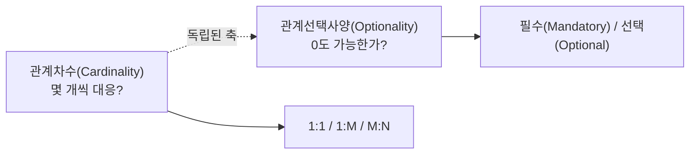
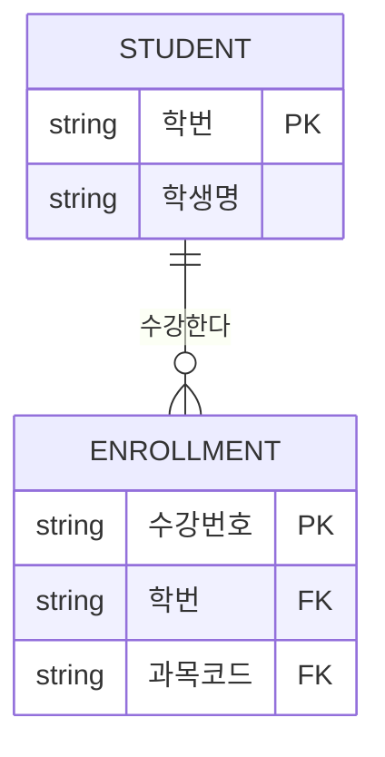

<Callout type="info">
  **이번 문서의 목표:** 이 파일을 다 읽으면 어떤 표기법으로 그려진 ERD든 관계선 양 끝의 기호만 보고 "몇 대 몇 관계이고, 어느 쪽이 필수 참여인가"를 문장으로 즉시 번역할 수 있게 된다.
</Callout>

## 왜 ERD를 "읽는 훈련"이 따로 필요한가

ERD(Entity Relationship Diagram, 개체 관계 다이어그램)는 데이터 모델을 그림 하나로 압축해 보여주는 도구입니다. 문제는 SQLD 시험이 ERD를 **그리라고** 시키지 않고, 이미 그려진 ERD를 보여주며 "이 그림에서 옳은/옳지 않은 설명은?"이라고 **읽으라고** 시킨다는 점입니다. 즉 시험에서 필요한 능력은 손으로 그리는 숙련도가 아니라, 기호 하나하나를 정확한 한국어 문장으로 번역하는 해독 능력입니다.

> **쉽게 말하면:** ERD는 암호문이 아니라 압축된 문장입니다. 기호마다 정해진 뜻이 있고, 그 뜻을 순서대로 읽으면 그대로 문장이 됩니다.

## 1. ERD를 만드는 순서 — 왜 이 순서인가

먼저 ERD가 어떤 절차로 완성되는지 알아야, 그림의 "어디까지 확정된 상태"인지를 파악할 수 있습니다. 03편에서 다룬 엔터티·속성·관계 정의와 04편의 식별자 개념이 아래 순서에서 그대로 재사용됩니다.

<Steps>

### 1단계: 엔터티 도출

업무에서 관리해야 할 정보 덩어리를 찾아 엔터티 후보로 뽑습니다. 이 시점에는 아직 속성이나 키를 확정하지 않습니다.

### 2단계: 속성 부여

각 엔터티가 가져야 할 속성을 나열합니다. 명칭이 하나뿐인 단일값 속성인지, 여러 값을 가질 수 있는 다중값 속성인지, 시도·시군구·상세주소처럼 더 쪼갤 수 있는 복합 속성인지를 이 단계에서 구분합니다.

### 3단계: 관계 설정

엔터티 사이에 실제로 업무적 연관이 있는지 확인하고 관계선을 긋습니다. 이때 관계명, 관계차수(카디널리티), 관계선택사양(옵셔널리티) 세 요소를 함께 정합니다(2절에서 자세히 다룹니다).

### 4단계: 식별자 확정

04편에서 배운 기준으로 각 엔터티의 주식별자를 정하고, 관계가 식별관계인지 비식별관계인지에 따라 부모의 식별자가 자식의 기본키 일부로 들어갈지, 일반 속성으로 들어갈지를 확정합니다.

</Steps>

<Callout type="warning">
  **자주 틀리는 점:** "물리 모델링에서는 사용자 관점의 화면 항목만 정의하고 테이블 구조는 다루지 않는다"는 106회 모의고사의 오답 함정입니다. 개념 모델링(업무 중심의 큰 그림) → 논리 모델링(엔터티·속성·관계·식별자를 정교화, 위 4단계가 여기 해당) → 물리 모델링(실제 DBMS의 테이블명·컬럼 타입·인덱스까지 확정)의 순서를 헷갈리게 하는 문제가 반복됩니다. **인덱스와 저장 구조는 물리 모델링, 식별자까지의 정교화는 논리 모델링**이라는 경계선을 정확히 기억해야 합니다.
</Callout>

## 2. 관계 표기의 3요소

ERD에서 관계선 하나에는 세 가지 정보가 동시에 담겨 있습니다. 59회 기출에서 "관계를 표기할 때 다루는 요소가 아닌 것은?"이라는 형태로 정확히 이 3요소를 뒤집어 묻는 문제가 나왔습니다.

| 요소 | 영문 | 의미 | 표기 예 |
|------|------|------|---------|
| 관계명 | relationship name | 두 엔터티가 어떤 업무적 의미로 연결되는가 | "소속한다", "주문한다" |
| 관계차수 | cardinality | 한쪽 인스턴스 하나에 상대편 인스턴스가 몇 개 대응하는가 | 1:1, 1:M(1:N), M:N |
| 관계선택사양 | optionality | 그 참여가 필수(mandatory)인가 선택(optional)인가 | 필수(실선/막대), 선택(점선/원) |

<Callout type="warning">
  **자주 틀리는 점:** "관계빈도(relationship frequency)"나 "관계정렬순서" 같은 그럴듯한 이름의 보기가 오답으로 섞여 나옵니다. 표준 관계 표기 요소는 **관계명·관계차수·관계선택사양** 세 가지뿐입니다. 처음 들어보는 용어가 보기에 있으면 일단 의심하는 습관을 들이면 좋습니다.
</Callout>

### 관계차수와 관계선택사양은 완전히 별개의 축이다

가장 많이 틀리는 지점이 바로 여기입니다. "1:M이니까 M쪽은 당연히 필수(1개 이상)겠지"처럼 차수와 선택사양을 하나로 묶어 생각하면 함정에 빠집니다. 60회 기출의 예시로 확인해 봅시다.

> 업무 규칙: "한 고객은 0건 이상의 주문을 낼 수 있다. 모든 주문은 반드시 한 명의 고객에 속한다."

이 문장을 표로 분해하면 다음과 같습니다.

| 항목 | 고객 쪽 | 주문 쪽 |
|------|---------|---------|
| 관계차수 | 1 | M |
| 참여가 필수인가 | 아니오 — 주문이 0건이어도 고객은 존재 가능(선택) | 예 — 주문은 반드시 고객에 속함(필수) |

고객 : 주문의 관계차수는 1:M으로 정해지지만, 그 안에서 "누가 필수이고 누가 선택인가"는 완전히 다른 질문이며 답도 다릅니다. 관계차수는 "몇 개씩 대응하는가"를, 관계선택사양은 "그 대응이 0을 포함하는가"를 답합니다.

## 3. 표기법 비교 — IE(까마귀발)와 Barker

같은 개념도 표기법에 따라 기호가 다릅니다. SQLD는 실무에서 흔한 **IE 표기법**(까마귀발 표기법, Crow's Foot Notation)을 기준으로 문제를 내지만, **Barker 표기법**과의 차이를 묻는 문제도 나옵니다.

| 구분 | IE(까마귀발) 표기법 | Barker 표기법 |
|------|----------------------|----------------|
| 다(多, Many) 표시 | 선 끝이 갈라지는 까마귀발 모양 | 까마귀발 모양(동일) |
| 필수 참여 표시 | 실선(또는 막대 `\|`) | 실선 + 원(◯) 없음 |
| 선택 참여 표시 | 점선 또는 원(◯) | 원(◯) |
| 속성 표기 | 엔터티 사각형 안에 목록 | 엔터티 사각형 안에 목록(관례는 유사) |
| NULL 허용 여부 표현 | 원(◯) 기호로 명시적으로 표현 가능 | 상대적으로 NULL 허용 여부가 명시적으로 드러나지 않는 경우가 있다 |

<Callout type="warning">
  **자주 틀리는 점:** "바커 표기법은 NULL 허용 여부를 알 수 없으나, IE 표기법은 알 수 있다"는 57회 기출의 정답 선택지입니다. IE 표기법은 관계선 끝에 원(선택, NULL 허용)과 막대(필수, NOT NULL)를 명시적으로 구분해 그리므로 그림만 보고 NULL 허용 여부를 바로 판단할 수 있다는 점이 핵심입니다.
</Callout>

한편 좀 더 오래된 **피터 첸(Peter Chen) 표기법**은 아예 결이 다릅니다. 사각형은 엔터티, 타원은 속성, **마름모는 관계** 그 자체를 별도의 도형으로 그립니다. IE·Barker 표기법이 "관계=선"으로 압축해 그리는 것과 달리, 피터 첸 표기법은 관계도 하나의 독립된 도형으로 취급한다는 점이 시험에서 구분 포인트로 나옵니다.

## 4. 기호 읽는 법 — 까마귀발 표기 실전 해독

아래 ERD를 놓고 실제로 기호를 하나씩 문장으로 옮겨 보겠습니다.

이 그림에서 학생 쪽 끝은 `||`(막대 두 개, 필수 1)이고 수강 쪽 끝은 `o{`(원 + 까마귀발, 선택적 다수)입니다. 읽는 순서는 다음과 같습니다.

1. **관계선의 양 끝 기호를 각각 분리해서 본다.** 한쪽 끝의 기호가 반대쪽 엔터티의 개수·필수 여부를 설명한다는 점에 주의해야 합니다 — 학생 쪽에 붙은 `||` 기호는 "학생이 몇 개인가"가 아니라 "하나의 수강 레코드가 정확히 몇 명의 학생과 연결되는가(1명, 필수)"를 뜻합니다.
2. **까마귀발(갈라진 발 모양)이 있는 쪽이 "다(多, Many)"다.** 수강 쪽에 까마귀발이 있으므로 학생 한 명에 여러 수강 레코드가 붙을 수 있습니다 → 학생 : 수강 = 1 : M.
3. **원(○)이 있으면 선택, 막대(‖)만 있으면 필수다.** 수강 쪽 끝에 원이 있다면(선택) "학생이 존재해도 아직 수강 기록이 없을 수 있다"는 뜻이고, 막대만 있다면(필수) "모든 학생은 반드시 1건 이상 수강해야 한다"는 뜻입니다.
4. **두 정보를 합쳐 완결된 문장으로 만든다.** 예: "학생 한 명은 0건 이상의 수강 기록을 가질 수 있고(선택적 1:M), 각 수강 기록은 반드시 정확히 한 명의 학생에 속한다(필수적)."

<Callout type="warning">
  **자주 틀리는 점:** 59회 기출에서 학생 쪽이 필수(막대)이고 수강 쪽이 "까마귀발 + 필수" 조합으로 표기된 문제가 나왔는데, 오답 선택지들이 "차수"와 "선택사양"을 서로 바꿔치기한 문장들이었습니다. "최대 한 개"(차수 1:1로 착각), "하지 않을 수도 있다"(선택으로 착각) 등입니다. 관계선을 읽을 때는 **반드시 차수(몇 개)와 선택사양(필수/선택)을 따로 짚은 뒤 마지막에 합쳐야** 실수가 줄어듭니다.
</Callout>

## 5. 특수한 관계 표기 — 배타적 관계(Arc)

두 개 이상의 관계 중 **오직 하나만** 성립할 수 있음을 표시해야 할 때가 있습니다. 예를 들어 "차량"은 "법인" 소유이거나 "개인" 소유 중 **하나에만** 속하고 동시에 둘 다일 수는 없습니다. 이런 상황을 표기하는 것이 배타적 관계(exclusive arc, 아크)입니다. 관계선 여러 개에 걸쳐 호(arc) 모양의 표시를 추가해 "이 중 하나만 선택된다"는 제약을 나타냅니다.

<Callout type="warning">
  **자주 틀리는 점:** 58회 기출에서 "부서-사원", "고객-주문"처럼 흔한 1:M 관계를 배타적 관계의 사례로 착각하게 만드는 오답이 여럿 제시되었습니다. 배타적 관계는 **한 자식이 여러 부모 후보 중 하나만 골라 연결되는 특수한 상황**에서만 성립하며, 단순한 1:M 관계 전부에 적용되는 개념이 아닙니다.
</Callout>

## 6. 식별관계·비식별관계 표기 다시 보기

04편에서 식별관계는 **실선**, 비식별관계는 **점선**으로 그린다고 배웠습니다. ERD를 읽을 때는 이 선의 종류만으로도 "부모의 기본키가 자식의 기본키 안으로 들어가는가"를 즉시 판단할 수 있어야 합니다.

| 확인할 것 | 식별관계(실선) | 비식별관계(점선) |
|-----------|----------------|-------------------|
| 자식 엔터티 표기에서 부모 유래 속성의 위치 | 기본키 영역(밑줄 또는 상단 구획)에 위치 | 일반 속성 영역(하단 구획)에 위치 |
| 생명주기 | 부모와 강하게 결합(부모 삭제 시 자식도 의미를 잃음) | 부모와 독립적으로 유지 가능 |
| 전형적 사례 | 학과-학생처럼 자식이 독자적 식별력이 약한 경우 | 고객-주문처럼 자식이 자체 번호로 이미 유일한 경우 |

<Callout type="warning">
  **자주 틀리는 점:** "통합 후에도 별도 관리가 필요해 약하게 연결한다", "부모의 외래키가 NULL을 허용해도 된다", "부모 식별자를 받을 수 있어도 별도의 주식별자를 둔다" — 이 세 가지는 모두 **비식별관계**를 정당화하는 전형적인 근거이며, 반대로 "생명주기를 부모와 동일하게 관리해야 한다"는 **식별관계**를 정당화하는 근거입니다(58회 기출). 어떤 서술이 어느 쪽 관계의 근거인지 뒤섞으면 바로 오답이 됩니다.
</Callout>

## 핵심 정리

- ERD는 개념 모델링 → 논리 모델링(엔터티·속성·관계·식별자 정교화) → 물리 모델링(테이블·컬럼·인덱스 확정) 순서로 구체화된다.
- 관계 표기의 3요소는 관계명·관계차수·관계선택사양이며, **차수(몇 개씩 대응하는가)와 선택사양(필수/선택인가)은 서로 다른 독립된 축**이다.
- 까마귀발이 있는 쪽이 "다(多)"이고, 원(○)이 있으면 선택(NULL 허용), 막대만 있으면 필수(NOT NULL)다.
- IE 표기법은 원과 막대로 NULL 허용 여부를 명시적으로 보여주지만, Barker 표기법은 이 구분이 상대적으로 덜 명시적이다. 피터 첸 표기법은 관계 자체를 마름모라는 별도 도형으로 그린다.
- 배타적 관계(Arc)는 여러 관계 후보 중 하나만 성립하는 특수 상황에만 쓰며, 일반적인 1:M 관계와 혼동하지 않는다.
- 식별관계는 실선(부모 PK가 자식 PK 일부), 비식별관계는 점선(부모 PK가 자식의 일반 속성)이다.

## 마무리 복습

<Quiz
  questionNumber={1}
  question="ERD에서 관계를 표기할 때 사용하는 표준 요소가 아닌 것은?"
  options={['관계명', '관계차수', '관계선택사양', '관계빈도']}
  correctAnswer={4}
  explanation="관계 표기의 표준 3요소는 관계명, 관계차수(카디널리티), 관계선택사양(옵셔널리티)이다. 관계빈도는 성능·트랜잭션 분석에서 쓰일 수 있는 용어일 뿐 ERD의 구조적 표기 요소가 아니다."
  optionExplanations={['표준 표기 요소다', '표준 표기 요소다', '표준 표기 요소다', '정답 — 표준 관계 표기 요소가 아니다']}
/>

<Quiz
  questionNumber={2}
  question="'한 고객은 0건 이상의 주문을 낼 수 있고, 모든 주문은 반드시 한 명의 고객에 속한다'를 정확히 해석한 것은?"
  options={['관계차수는 1:1이고 고객 쪽이 필수다', '관계차수는 1:M이고 고객 쪽이 필수, 주문 쪽이 선택이다', '관계차수는 1:M이고 고객 쪽이 선택, 주문 쪽이 필수다', '관계차수와 참여 여부는 이 문장만으로 알 수 없다']}
  correctAnswer={3}
  explanation="한 고객에 여러 주문이 대응하므로 차수는 1:M이다. 고객은 주문이 0건이어도 존재 가능하므로 고객 쪽 참여는 선택이고, 모든 주문은 반드시 고객에 속하므로 주문 쪽 참여는 필수다."
  optionExplanations={['차수 자체가 1:1이 아니다', '필수·선택이 서로 바뀌었다', '정답 — 차수와 선택사양을 모두 올바르게 분리했다', '문장에 필요한 정보가 모두 제시되어 있다']}
/>

<Quiz
  questionNumber={3}
  question="IE(까마귀발) 표기법과 Barker 표기법의 차이에 대한 설명으로 가장 적절한 것은?"
  options={['두 표기법 모두 관계를 마름모로 표현한다', 'IE 표기법은 원과 막대로 NULL 허용 여부를 명시적으로 드러내지만 Barker 표기법은 상대적으로 그렇지 않다', 'Barker 표기법에는 까마귀발 개념 자체가 없다', 'IE 표기법은 속성을 타원으로 표기한다']}
  correctAnswer={2}
  explanation="IE 표기법은 원(선택)과 막대(필수) 기호로 NULL 허용 여부를 명시적으로 구분해 표현한다는 점이 Barker 표기법과의 대표적인 차이로 출제된다. 마름모로 관계를 표현하는 것은 피터 첸 표기법의 특징이다."
  optionExplanations={['마름모 표현은 피터 첸 표기법의 특징이다', '정답 — NULL 허용 여부 표현의 명시성 차이다', 'Barker 표기법도 까마귀발로 다(多)를 표현한다', '속성을 타원으로 표기하는 것은 피터 첸 표기법이다']}
/>

<Quiz
  questionNumber={4}
  question="피터 첸(Peter Chen) 표기법에서 관계 자체를 나타내는 도형은?"
  options={['사각형', '타원', '마름모', '원']}
  correctAnswer={3}
  explanation="피터 첸 표기법은 사각형=엔터티, 타원=속성, 마름모=관계로 표현한다. IE·Barker 표기법이 관계를 선 하나로 압축하는 것과 달리, 관계를 독립된 도형으로 그린다는 점이 구분 포인트다."
  optionExplanations={['사각형은 엔터티를 나타낸다', '타원은 속성을 나타낸다', '정답 — 마름모가 관계를 나타낸다', '원은 관계의 도형이 아니다']}
/>

<Quiz
  questionNumber={5}
  question="배타적 관계(Arc)에 대한 설명으로 가장 적절한 것은?"
  options={['부서와 사원처럼 흔한 1:M 관계 전부에 적용되는 표기다', '차량이 법인 또는 개인 중 하나에만 속하는 것처럼, 여러 관계 후보 중 하나만 성립함을 나타낸다', '두 엔터티 사이에 관계가 전혀 없음을 나타낸다', '식별관계에서만 사용할 수 있는 표기다']}
  correctAnswer={2}
  explanation="배타적 관계는 하나의 엔터티가 여러 관계 후보 중 정확히 하나에만 참여할 수 있음을 나타내는 특수 표기다. 일반적인 1:M 관계 전체에 해당하는 개념이 아니다."
  optionExplanations={['일반적인 1:M 관계에는 적용되지 않는다', '정답 — 여러 후보 중 하나만 성립하는 상황을 나타낸다', '관계가 없는 것이 아니라 후보 중 하나가 선택되는 것이다', '식별·비식별 여부와 무관하게 사용할 수 있다']}
/>

<Quiz
  questionNumber={6}
  question="ERD에서 식별관계(실선)와 비식별관계(점선)를 구분하는 근거로 가장 적절한 것은?"
  options={['관계선의 길이', '부모의 기본키가 자식의 기본키 일부로 들어가는지 여부', '엔터티 이름의 알파벳 순서', '속성의 개수']}
  correctAnswer={2}
  explanation="식별관계와 비식별관계의 구분 기준은 부모의 기본키가 자식의 기본키 구성에 포함되는지(식별) 아니면 일반 속성으로만 포함되는지(비식별)이다."
  optionExplanations={['선의 길이는 의미를 갖지 않는다', '정답 — 기본키 편입 여부가 판단 기준이다', '엔터티 이름 순서와는 무관하다', '속성 개수만으로는 판단할 수 없다']}
/>

<Quiz
  questionNumber={7}
  question="데이터 모델링 단계에 대한 설명으로 가장 적절한 것은?"
  options={['개념 모델링에서 DBMS에 맞는 인덱스와 저장 구조를 먼저 결정한다', '논리 모델링에서는 업무 개념을 엔터티, 속성, 관계, 식별자로 구체화한다', '물리 모델링에서는 사용자 관점의 화면 항목만 정의하고 테이블 구조는 다루지 않는다', '개념 모델링은 실제 테이블명과 컬럼 타입을 확정하는 단계다']}
  correctAnswer={2}
  explanation="논리 모델링은 개념 모델을 바탕으로 엔터티, 속성, 관계, 식별자 등을 정교하게 정의하는 단계다. 인덱스·저장 구조 결정과 테이블명·컬럼 타입 확정은 물리 모델링의 영역이다."
  optionExplanations={['인덱스와 저장 구조는 물리 모델링에서 다룬다', '정답 — 논리 모델링의 산출물을 올바르게 설명했다', '물리 모델링은 실제 테이블 구조까지 다룬다', '테이블명·컬럼 타입 확정은 물리 모델링의 역할이다']}
/>

<Quiz
  questionNumber={8}
  question="관계선 끝에 까마귀발과 원(○)이 함께 표기되어 있을 때의 해석으로 옳은 것은?"
  options={['상대편이 정확히 1개이며 필수로 존재한다', '상대편이 0개 이상 여러 개일 수 있다(선택적 다수)', '상대편이 반드시 1개 이상 존재해야 한다(필수적 다수)', '이 표기는 식별관계에서만 나타난다']}
  correctAnswer={2}
  explanation="까마귀발은 다(多, Many)를, 원(○)은 선택(0 포함 가능)을 나타낸다. 두 기호가 함께 있으면 '0개 이상의 여러 개'라는 선택적 다수 관계를 의미한다."
  optionExplanations={['까마귀발이 있으므로 1개가 아니라 다수다', '정답 — 선택적 다수를 뜻하는 조합이다', '막대(필수)가 아니라 원(선택)이 붙어 있다', '표기 자체는 식별·비식별 여부와 별개로 쓰일 수 있다']}
/>

## 참고 자료

- [데이터자격시험 - SQLD 출제기준](https://www.dataq.or.kr/www/sub/a_04.do)
- [MDN - SQL 개요 (관계형 DB 기초)](https://developer.mozilla.org/ko/docs/Glossary/SQL)
