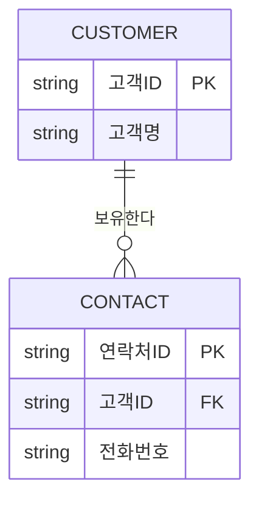
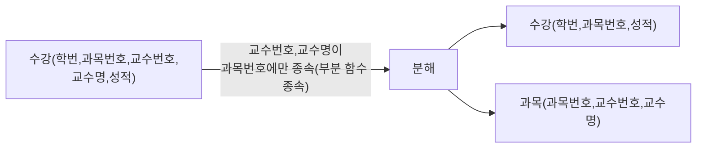
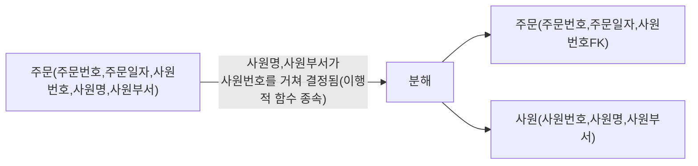
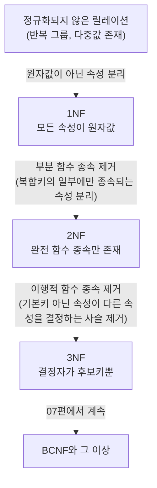

<Callout type="info">
  **이번 문서의 목표:** 이 파일을 다 읽으면 테이블 하나를 보고 1NF·2NF·3NF 중 어디까지 만족하는지 스스로 판별하고, 위반한 정규형에 맞춰 테이블을 실제로 분해할 수 있게 된다.
</Callout>

## 왜 정규화가 필요한가 — 이상현상 먼저 겪어보기

정규화(normalization)를 정의부터 외우면 왜 필요한지 감이 오지 않습니다. 먼저 정규화되지 않은 테이블이 실제로 어떤 사고를 일으키는지 겪어봅니다. 다음은 "수강신청" 정보를 테이블 하나에 몰아넣은 예시입니다.

| 학번 | 과목번호 | 과목명 | 담당교수 | 교수연구실 |
|------|----------|--------|----------|------------|
| S01 | C10 | 데이터베이스 | 김교수 | 공학관 401 |
| S01 | C20 | 자료구조 | 이교수 | 공학관 502 |
| S02 | C10 | 데이터베이스 | 김교수 | 공학관 401 |

이 테이블에 데이터를 넣고 빼고 고치다 보면 세 가지 사고가 반복적으로 발생합니다. 이를 **이상현상**(anomaly, 애노멀리)이라고 부릅니다.

> **쉽게 말하면:** 이상현상은 "같은 정보를 여러 곳에 중복 저장해서 생기는 뒤틀림"입니다. 정보 하나가 바뀌어야 하는데 사본이 여러 개라 일부만 바뀌는 사고입니다.

| 이상현상 종류 | 언제 발생하는가 | 이 테이블에서의 예 |
|---------------|------------------|---------------------|
| 삽입 이상(insertion anomaly) | 새 정보를 넣고 싶은데 불필요한 다른 정보까지 함께 넣어야만 저장이 가능할 때 | 아직 수강생이 한 명도 없는 신설 과목("C30, 운영체제, 박교수")을 등록하려 해도, 이 테이블 구조는 "학번"이 있어야 한 행이 성립하므로 학번 없이는 과목 정보만 따로 넣을 수 없다 |
| 갱신 이상(update anomaly) | 같은 값이 여러 행에 중복 저장되어 있어, 하나를 고칠 때 전부 찾아 고치지 않으면 값이 서로 어긋날 때 | 김교수의 연구실이 "공학관 401"에서 "공학관 410"으로 바뀌면 김교수가 담당하는 모든 행(S01의 C10, S02의 C10 등)을 빠짐없이 고쳐야 한다. 한 행이라도 놓치면 같은 교수의 연구실이 두 가지 값으로 공존하게 된다 |
| 삭제 이상(deletion anomaly) | 특정 사실 하나를 지우려다 함께 저장돼 있던 다른 유효한 정보까지 같이 사라질 때 | S02 학생이 유일하게 C10을 수강 중인 상태에서 그 수강 기록을 삭제하면, "C10 = 데이터베이스, 담당 김교수, 연구실 공학관 401"이라는 과목·교수 정보까지 통째로 사라진다 |

정규화는 바로 이 세 가지 이상현상을 없애기 위해, **하나의 사실은 데이터베이스 안에 오직 한 곳에만 저장되도록** 테이블을 쪼개는 절차입니다.

## 1. 함수적 종속성 — 정규화 판별의 유일한 도구

정규형을 판별하려면 먼저 함수적 종속성(functional dependency, FD)을 이해해야 합니다.

> **쉽게 말하면:** "A값을 알면 B값이 자동으로 하나로 정해진다"면 "A가 B를 함수적으로 결정한다"고 말합니다.

기호로는 A → B(A가 B를 함수적으로 결정한다, A determines B)로 씁니다. 이때 A를 **결정자**(determinant, 디터미넌트)라 하고 B를 **종속자**(dependent)라고 부릅니다. 위 표에서 과목번호를 알면 과목명이 저절로 정해지므로 다음이 성립합니다.

$$
\text{과목번호} \rightarrow \text{과목명}
$$

같은 방식으로 과목번호를 알면 담당교수도, 담당교수를 알면 교수연구실도 정해집니다.

$$
\text{과목번호} \rightarrow \text{담당교수}
$$

$$
\text{담당교수} \rightarrow \text{교수연구실}
$$

이렇게 A → B이고 B → C이면 A → C도 성립합니다(과목번호를 알면 결국 교수연구실도 알 수 있습니다). 이 연쇄를 **이행적 함수 종속**(transitive functional dependency)이라고 부르며, 3NF를 판별하는 핵심 개념입니다(4절에서 다시 다룹니다).

복합키가 있는 테이블에서는 종속의 범위를 더 세밀하게 나눠야 합니다.

- **완전 함수 종속**(full functional dependency): 종속자가 기본키를 구성하는 속성 **전체**에 의존해야만 값이 정해지는 경우.
- **부분 함수 종속**(partial functional dependency): 종속자가 기본키 **일부** 속성만으로도 이미 값이 정해지는 경우. 나머지 기본키 속성은 사실 필요 없었다는 뜻입니다.

## 2. 제1정규형(1NF) — 원자값 조건

제1정규형의 조건은 하나뿐입니다.

> **모든 속성이 원자값**(atomic value)**을 가져야 한다** — 하나의 셀에 값이 하나만 들어가야 하며, 반복되는 값 그룹이나 다중값이 들어가서는 안 된다.

다음은 1NF를 위반한 "고객" 테이블입니다. 한 셀에 값이 여러 개 들어 있습니다.

| 고객ID | 고객명 | 연락처 |
|--------|--------|--------|
| C01 | 김민준 | 010-1111-2222, 010-3333-4444 |
| C02 | 이서연 | 010-5555-6666 |

연락처 셀에 값이 두 개 들어있는 C01 행은 "이 안에서 값을 하나씩 골라 조회하거나 수정한다"는 관계형 모델의 기본 동작을 깨뜨립니다. 특정 번호 하나만 삭제하려 해도 문자열을 파싱해야 하는 처지가 됩니다.

**분해 결과:** 다중값 속성인 연락처를 별도 엔터티로 분리합니다.

| 고객(분해 후) | | 연락처(분해 후) | | |
|---|---|---|---|---|
| 고객ID | 고객명 | 연락처ID | 고객ID | 전화번호 |
| C01 | 김민준 | P01 | C01 | 010-1111-2222 |
| C02 | 이서연 | P02 | C01 | 010-3333-4444 |
| | | P03 | C02 | 010-5555-6666 |

이제 각 셀은 값을 하나만 담고, 전화번호 하나를 추가·삭제·수정하는 작업이 다른 전화번호에 전혀 영향을 주지 않습니다.

<Callout type="warning">
  **자주 틀리는 점:** "제1정규형은 모든 속성이 원자값을 가져야 한다는 조건이다"라는 진술 자체는 옳지만, 이를 "반복되는 속성만 없으면 무조건 1NF"라고 성급히 결론 내리는 경우가 많습니다. 다중값 속성뿐 아니라 "주소" 같은 **복합 속성**(시도, 시군구, 상세주소로 더 쪼갤 수 있는 속성)을 반드시 쪼개야 하는지는 실무 관례에 따라 다르지만, 시험에서는 "하나의 속성에 여러 값이 들어갈 수 있는 다중값 속성"을 정규화 대상으로 지목하는 문제가 훨씬 빈번합니다.
</Callout>

## 3. 제2정규형(2NF) — 부분 함수 종속 제거

제2정규형의 조건은 다음과 같습니다.

> **1NF를 만족하면서, 기본키가 아닌 모든 속성이 기본키 전체에 완전 함수 종속되어야 한다** — 즉 부분 함수 종속이 없어야 한다.

이 조건은 **기본키가 복합키일 때만** 실질적인 의미를 가집니다. 기본키가 속성 하나뿐이라면 "일부"라는 개념 자체가 성립하지 않으므로 부분 함수 종속도 있을 수 없고, 자동으로 2NF를 만족합니다.

다음은 2NF를 위반한 "수강" 테이블입니다. 기본키는 (학번, 과목번호) 복합키입니다.

| 학번(PK) | 과목번호(PK) | 교수번호 | 교수명 | 성적 |
|----------|--------------|----------|--------|------|
| S01 | C10 | P100 | 김교수 | A |
| S01 | C20 | P200 | 이교수 | B |
| S02 | C10 | P100 | 김교수 | A |

**왜 위반인가:** 이 테이블의 함수적 종속을 모두 나열하면 다음과 같습니다.

$$
(\text{학번}, \text{과목번호}) \rightarrow \text{성적}
$$

$$
\text{과목번호} \rightarrow \text{교수번호}, \text{교수명}
$$

성적은 학번과 과목번호 **둘 다** 있어야 정해지므로 완전 함수 종속입니다(수강 기록마다 성적이 다를 수 있으니 당연합니다). 하지만 교수번호와 교수명은 **과목번호 하나만으로** 이미 정해집니다. 학번은 전혀 필요하지 않습니다. 이것이 부분 함수 종속이며, 43회 모의고사에서 정확히 이 구조가 "제2정규형을 위반하는 이유"를 묻는 문제로 출제되었습니다.

**분해 결과:** 과목번호에만 종속되는 속성들을 별도 테이블로 뽑아냅니다.

| 수강(분해 후) | | | 과목(분해 후) | | |
|---|---|---|---|---|---|
| 학번 | 과목번호 | 성적 | 과목번호 | 교수번호 | 교수명 |
| S01 | C10 | A | C10 | P100 | 김교수 |
| S01 | C20 | B | C20 | P200 | 이교수 |
| S02 | C10 | A | | | |

이제 교수 배정이 바뀌어도 과목 테이블 단 한 행만 고치면 되고, 수강생이 몇 명이든 갱신 이상이 발생하지 않습니다.

## 4. 제3정규형(3NF) — 이행적 함수 종속 제거

제3정규형의 조건은 다음과 같습니다.

> **2NF를 만족하면서, 기본키가 아닌 속성 사이에 이행적 함수 종속이 없어야 한다** — 즉 기본키가 아닌 속성이 다른 기본키 아닌 속성을 결정해서는 안 된다.

다음은 3NF를 위반한 "주문" 테이블입니다. 기본키는 주문번호 하나뿐이라 2NF는 이미 만족합니다(속성 하나짜리 키는 부분 종속이 성립할 수 없습니다).

| 주문번호(PK) | 주문일자 | 사원번호 | 사원명 | 사원부서 |
|--------------|----------|----------|--------|----------|
| 1001 | 2026-01-02 | E01 | 홍길동 | 영업1팀 |
| 1002 | 2026-01-03 | E01 | 홍길동 | 영업1팀 |

**왜 위반인가:** 이 테이블의 함수적 종속 연쇄는 다음과 같습니다.

$$
\text{주문번호} \rightarrow \text{사원번호}
$$

$$
\text{사원번호} \rightarrow \text{사원명}, \text{사원부서}
$$

주문번호가 사원번호를 결정하고, 사원번호가 다시 사원명·사원부서를 결정하므로

$$
\text{주문번호} \rightarrow \text{사원명}, \text{사원부서}
$$

가 성립하지만, 이는 **주문번호가 직접 결정한 것이 아니라 사원번호를 거쳐서** 간접적으로 결정된 것입니다. 기본키가 아닌 속성인 사원번호가 또 다른 기본키 아닌 속성(사원명, 사원부서)을 결정하고 있으므로 이행적 함수 종속입니다.

**분해 결과:** 사원 관련 정보를 별도 테이블로 분리하고, 주문에는 사원번호만 외래키로 남깁니다.

| 주문(분해 후) | | | 사원(분해 후) | | |
|---|---|---|---|---|---|
| 주문번호 | 주문일자 | 사원번호 | 사원번호 | 사원명 | 사원부서 |
| 1001 | 2026-01-02 | E01 | E01 | 홍길동 | 영업1팀 |
| 1002 | 2026-01-03 | E01 | | | |

이제 홍길동 사원이 부서를 옮기면 사원 테이블의 딱 한 행만 고치면 되고, 그 사원의 모든 과거 주문 기록에 자동으로 최신 부서 정보가 반영됩니다(조인으로 연결되어 있으므로).

## 5. 2NF 위반과 3NF 위반, 정면으로 대조하기

두 정규형 위반은 겉보기에 비슷해 보이지만 **종속의 출발점이 다릅니다.** 이 차이를 정확히 구분하는 것이 정규화 판별 문제의 핵심입니다.

| 구분 | 2NF 위반(부분 함수 종속) | 3NF 위반(이행적 함수 종속) |
|------|--------------------------|------------------------------|
| 전제 조건 | 기본키가 **복합키**여야만 성립 가능 | 기본키가 단일키여도 성립 가능 |
| 종속의 출발점 | **기본키의 일부** 속성이 다른 속성을 결정 | **기본키가 아닌 일반 속성**이 다른 일반 속성을 결정 |
| 관계식 형태 | 복합키(A, B) 중 B → C (A는 불필요) | 기본키 A → B이고 B → C이므로 A → C(간접) |
| 이 문서 예시 | (학번, 과목번호) → 성적은 정상, 과목번호 → 교수번호는 부분 종속 | 주문번호 → 사원번호 → 사원명의 사슬에서 사원번호가 중간 결정자 |
| 분해 결과 | 기본키 일부(과목번호)를 기본키로 하는 테이블 분리 | 중간 결정자(사원번호)를 기본키로 하는 테이블 분리 |

<Callout type="warning">
  **자주 틀리는 점:** 44회 모의고사의 "강의평가(강의코드, 학생번호, 교수번호, 교수명, 학과명, 평가점수)" 테이블처럼 **부분 함수 종속과 이행적 함수 종속이 동시에 존재**하는 경우가 실전에서는 더 흔합니다. 강의코드가 교수번호를 결정하는 것은 부분 종속(2NF 위반)이고, 교수번호가 다시 교수명·학과명을 결정하는 것은 이행적 종속(3NF 위반)입니다. "어느 하나만 위반한다"고 단정 짓는 오답 선택지에 특히 주의해야 하며, 이런 경우 "2NF와 3NF를 동시에 위반한다"가 정답이 됩니다. 정규화는 순서대로 쌓아가는 것이므로, 2NF를 위반한 테이블은 자동으로 3NF도 만족하지 못한 상태라는 점도 함께 기억해야 합니다.
</Callout>

## 6. 정규화 전체 흐름과 성능 트레이드오프

세 정규형을 단계별로 쌓아가는 흐름을 정리하면 다음과 같습니다.

정규화를 진행할수록 중복은 줄지만 테이블 개수는 늘어나고, 원래 하나로 조회되던 정보를 얻으려면 **조인**(join, 08·16편에서 다룹니다)이 더 많이 필요해집니다. 이 때문에 "정규화는 항상 데이터베이스 성능을 향상시킨다"는 진술은 틀린 설명입니다 — 정규화의 목적은 무결성과 저장 공간 효율화이며, 조회 성능은 오히려 저하될 수 있습니다. 이 트레이드오프를 되돌리는 기법이 07편의 반정규화(denormalization)입니다.

<Callout type="warning">
  **자주 틀리는 점:** "정규화를 통해 항상 데이터베이스 성능이 향상된다"는 43회 모의고사에서 정답(옳지 않은 설명)으로 지목된 문장입니다. 정규화의 직접적인 효과는 **데이터 중복 최소화와 무결성 향상**이며, 테이블이 분해될수록 조인이 늘어 조회 성능은 오히려 떨어질 수 있다는 점을 놓치면 안 됩니다.
</Callout>

## 핵심 정리

- 정규화되지 않은 테이블은 삽입·갱신·삭제 이상현상을 일으킨다. 세 이상현상 모두 "같은 사실이 여러 곳에 중복 저장되어 생기는 뒤틀림"이라는 공통 원인을 가진다.
- 함수적 종속(A → B)은 정규형 판별의 유일한 도구다. 복합키 상황에서는 완전 함수 종속과 부분 함수 종속을 구분해야 한다.
- 1NF는 모든 속성이 원자값이어야 한다는 조건이다. 다중값 속성을 별도 엔터티로 분리해 해결한다.
- 2NF는 부분 함수 종속(복합키의 일부에만 종속) 제거이며, 기본키가 단일 속성이면 자동으로 성립한다.
- 3NF는 이행적 함수 종속(기본키 아닌 속성이 다른 기본키 아닌 속성을 결정) 제거다.
- 부분 함수 종속과 이행적 함수 종속은 종속의 출발점(기본키 일부 vs 일반 속성)이 다르며, 실제 테이블은 두 위반을 동시에 가질 수 있다.
- 정규화는 무결성·저장 효율을 높이지만 조인 증가로 조회 성능이 저하될 수 있어, "항상 성능이 향상된다"는 진술은 틀렸다.

## 마무리 복습

<Quiz
  questionNumber={1}
  question="정규화되지 않은 테이블에서 발생하는 이상현상에 대한 설명으로 옳지 않은 것은?"
  options={['삽입 이상은 불필요한 다른 정보까지 함께 넣어야만 저장이 가능할 때 발생한다', '갱신 이상은 중복 저장된 값 중 일부만 수정되어 값이 서로 어긋나는 현상이다', '삭제 이상은 특정 사실을 지우려다 다른 유효한 정보까지 함께 사라지는 현상이다', '이상현상은 테이블을 여러 개로 분해했을 때만 발생하는 현상이다']}
  correctAnswer={4}
  explanation="이상현상은 정규화되지 않아 데이터가 중복 저장된 하나의 테이블 안에서 발생하는 현상이다. 오히려 정규화를 통해 테이블을 적절히 분해하면 이상현상이 줄어들거나 사라진다."
  optionExplanations={['삽입 이상을 올바르게 설명했다', '갱신 이상을 올바르게 설명했다', '삭제 이상을 올바르게 설명했다', '정답 — 이상현상은 정규화되지 않은 단일 테이블에서 주로 발생한다']}
/>

<Quiz
  questionNumber={2}
  question="함수적 종속 A → B에 대한 설명으로 가장 적절한 것은?"
  options={['B의 값을 알면 A의 값이 하나로 정해진다', 'A의 값을 알면 B의 값이 하나로 정해진다', 'A와 B는 항상 같은 값을 가진다', 'A와 B 사이에는 아무 관계도 없다']}
  correctAnswer={2}
  explanation="A → B는 A가 결정자, B가 종속자인 함수적 종속으로, A의 값이 정해지면 B의 값도 하나로 정해진다는 의미다. 방향이 반대인 B → A와는 다른 관계다."
  optionExplanations={['방향이 반대로 서술되어 있다', '정답 — 결정자 A가 종속자 B의 값을 하나로 정한다', '같은 값을 가진다는 뜻이 아니라 결정 관계를 뜻한다', '함수적 종속은 명확한 결정 관계를 의미한다']}
/>

<Quiz
  questionNumber={3}
  question="기본키가 (학번, 과목번호)인 수강 테이블에서 '과목번호 → 교수번호'라는 종속이 존재할 때, 이는 어떤 종속에 해당하는가?"
  options={['완전 함수 종속', '부분 함수 종속', '이행적 함수 종속', '다치 종속']}
  correctAnswer={2}
  explanation="교수번호가 복합키 전체(학번, 과목번호)가 아니라 그중 일부인 과목번호만으로 정해지므로 부분 함수 종속이며, 이는 제2정규형 위반의 원인이 된다."
  optionExplanations={['완전 함수 종속이라면 학번과 과목번호 둘 다 필요해야 한다', '정답 — 기본키 일부에만 종속되는 부분 함수 종속이다', '이행적 종속은 기본키 아닌 속성 사이의 연쇄 종속을 말한다', '다치 종속은 이 예시에서 다루지 않는 별개의 개념이다']}
/>

<Quiz
  questionNumber={4}
  question="주문(주문번호 PK, 사원번호, 사원명, 사원부서) 테이블에서 '주문번호 → 사원번호', '사원번호 → 사원명, 사원부서'라는 종속이 있을 때 위반하는 정규형은?"
  options={['제1정규형', '제2정규형', '제3정규형', '위반 없음']}
  correctAnswer={3}
  explanation="주문번호가 사원번호를 거쳐 간접적으로 사원명, 사원부서를 결정하는 이행적 함수 종속이 존재하므로 제3정규형을 위반한다. 기본키가 단일 속성(주문번호)이라 부분 함수 종속은 애초에 성립할 수 없어 제2정규형은 이미 만족한다."
  optionExplanations={['원자값 문제는 이 테이블에 없다', '기본키가 단일 속성이라 부분 함수 종속이 성립하지 않는다', '정답 — 이행적 함수 종속이 존재해 제3정규형을 위반한다', '이행적 함수 종속이 명백히 존재한다']}
/>

<Quiz
  questionNumber={5}
  question="강의평가(강의코드 PK, 학생번호 PK, 교수번호, 교수명, 학과명, 평가점수) 테이블에서 '강의코드 → 교수번호'와 '교수번호 → 교수명, 학과명'이 모두 성립할 때 가장 적절한 설명은?"
  options={['부분 함수 종속으로 인해 제2정규형만 위반된다', '이행적 함수 종속으로 인해 제3정규형만 위반된다', '제2정규형과 제3정규형을 동시에 위반한다', '이 테이블은 이미 제3정규형을 만족한다']}
  correctAnswer={3}
  explanation="강의코드가 복합키의 일부만으로 교수번호를 결정하는 것은 부분 함수 종속(2NF 위반)이고, 교수번호가 다시 교수명·학과명을 결정하는 것은 이행적 함수 종속(3NF 위반)이다. 두 위반이 동시에 존재한다."
  optionExplanations={['이행적 종속도 함께 존재하므로 2NF 위반만 있는 것이 아니다', '부분 함수 종속도 함께 존재하므로 3NF 위반만 있는 것이 아니다', '정답 — 두 위반이 동시에 존재한다', '두 종류의 종속이 모두 존재해 정규형을 만족하지 못한다']}
/>

<Quiz
  questionNumber={6}
  question="정규화에 대한 설명으로 가장 부적절한 것은?"
  options={['정규화는 데이터의 중복을 최소화하고 데이터 무결성을 향상시킨다', '정규화 과정에서 테이블이 분해되면서 조인 연산이 증가할 수 있다', '제1정규형은 모든 속성이 원자값을 가져야 한다는 조건이다', '정규화를 통해 항상 데이터베이스 성능이 향상된다']}
  correctAnswer={4}
  explanation="정규화는 무결성과 저장 공간 효율성을 향상시키지만, 테이블 분해로 조인이 늘어 조회 성능이 저하될 수 있다. 따라서 항상 성능이 향상된다는 진술은 옳지 않다."
  optionExplanations={['정규화의 주요 목적을 올바르게 설명했다', '분해로 인한 조인 증가를 올바르게 설명했다', '1NF의 조건을 올바르게 설명했다', '정답 — 항상 성능이 향상된다는 설명은 트레이드오프를 무시한 오류다']}
/>

<Quiz
  questionNumber={7}
  question="기본키가 단일 속성(하나의 컬럼)으로만 구성된 테이블에 대한 설명으로 가장 적절한 것은?"
  options={['부분 함수 종속이 존재할 수 있어 항상 2NF를 확인해야 한다', '기본키가 단일 속성이면 부분 함수 종속이 성립할 수 없어 자동으로 2NF를 만족한다', '기본키가 단일 속성이면 이행적 함수 종속도 발생할 수 없다', '기본키가 단일 속성이면 항상 3NF까지 자동으로 만족한다']}
  correctAnswer={2}
  explanation="부분 함수 종속은 복합키의 일부만으로 다른 속성이 정해지는 현상이므로, 기본키가 속성 하나뿐이면 '일부'라는 개념 자체가 성립하지 않아 부분 함수 종속이 있을 수 없다. 다만 이행적 함수 종속(3NF 위반)은 기본키가 단일 속성이어도 얼마든지 발생할 수 있다."
  optionExplanations={['단일 속성 기본키에서는 부분 함수 종속이 아예 성립하지 않는다', '정답 — 부분 함수 종속이 성립할 수 없어 2NF는 자동으로 만족한다', '이행적 함수 종속은 단일 속성 기본키에서도 발생할 수 있다', '3NF까지 자동으로 만족하는 것은 아니다']}
/>

<Quiz
  questionNumber={8}
  question="1NF를 위반한 '고객(고객ID, 고객명, 연락처)' 테이블에서 한 고객이 전화번호 두 개를 한 셀에 콤마로 나열해 저장하고 있다. 올바른 분해 방향은?"
  options={['연락처 속성을 그대로 두고 고객명만 별도 테이블로 분리한다', '고객과 연락처를 1:M 관계의 별도 엔터티로 분리하여 전화번호 하나마다 한 행이 되게 한다', '연락처 속성을 아예 삭제한다', '고객ID를 없애고 전화번호를 기본키로 사용한다']}
  correctAnswer={2}
  explanation="다중값 속성인 연락처를 원자값으로 만들려면, 고객과 연락처를 1:M 관계의 별도 엔터티로 분리해 전화번호 하나가 한 행에 대응하도록 해야 한다. 이렇게 하면 각 셀이 값을 하나만 가지게 되어 1NF를 만족한다."
  optionExplanations={['문제가 되는 다중값 속성을 그대로 두면 1NF 위반이 해결되지 않는다', '정답 — 다중값 속성을 별도 엔터티로 분리하는 표준적인 1NF 해결 방식이다', '필요한 정보를 삭제하는 것은 해결책이 아니다', '전화번호는 유일하지 않을 수 있어 기본키로 부적절하다']}
/>

## 참고 자료

- [데이터자격시험 - SQLD 출제기준](https://www.dataq.or.kr/www/sub/a_04.do)
- [MDN - SQL 개요 (관계형 DB 기초)](https://developer.mozilla.org/ko/docs/Glossary/SQL)
