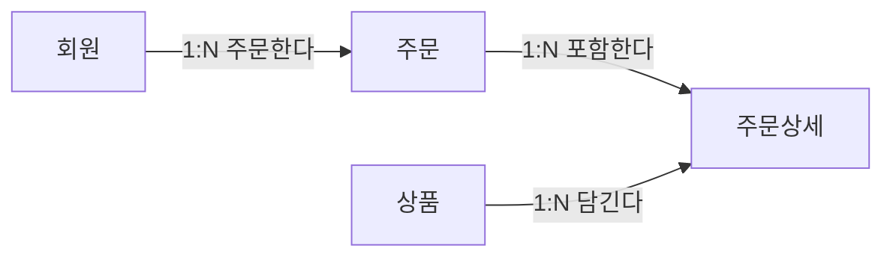

## 이번 편의 목표

- 관계가 필요한 이유와 관계를 구성하는 요소를 설명한다.
- 1:1, 1:N, M:N 카디널리티를 업무 문장에서 판별한다.
- 필수·선택 관계를 양쪽 방향에서 읽는다.
- M:N 관계를 연결 엔터티로 해소하고 관계 이름을 올바르게 붙인다.

## 먼저 알아둘 말

| 용어 | 쉬운 뜻 |
| --- | --- |
| 관계 | 두 엔터티의 인스턴스 사이에 존재하는 업무 연결 |
| 관계명 | 연결의 의미를 동사형으로 표현한 이름 |
| 카디널리티 | 한쪽 인스턴스 하나와 연결될 수 있는 반대쪽 인스턴스 수 |
| 선택성 | 관계 참여가 반드시 필요한지 없어도 되는지 나타내는 규칙 |
| 1:1 관계 | 양쪽 모두 최대 한 건과 연결되는 관계 |
| 1:N 관계 | 한쪽 한 건이 반대쪽 여러 건과 연결되는 관계 |
| M:N 관계 | 양쪽 모두 여러 건과 연결될 수 있는 관계 |
| 연결 엔터티 | M:N 관계와 그 관계에서 발생한 속성을 기록하는 엔터티 |

## 선수지식과 핵심 질문

선수지식은 엔터티와 인스턴스, 식별자 후보, 속성의 의미다.

이번 편은 다음 질문에 답한다.

> 회원·주문·상품이 따로 존재할 때, 누가 무엇을 주문했는지 모델에서 어떻게 표현할까?

## 먼저 실제 행을 선으로 연결해 보기

| 회원번호 | 회원명 |
| --- | --- |
| M01 | 민지 |
| M02 | 준호 |

| 주문번호 | 회원번호 |
| ---: | --- |
| 1001 | M01 |
| 1002 | M01 |
| 1003 | M02 |

`M01`이라는 값이 같은 행끼리 선으로 잇는다고 생각하면 된다.

```text
민지 M01 ─┬─ 주문 1001
           └─ 주문 1002

준호 M02 ─── 주문 1003
```

회원 한 행이 주문 여러 행과 연결되므로 **회원 1 : N 주문**이다. 관계는 막연한 선이 아니라 “어느 실제 행이 어느 행과 연결되는가”를 일반화한 규칙이다.

## 관계는 업무 규칙을 선으로 표현한다

**관계(relationship)** 는 엔터티의 인스턴스들이 업무에서 서로 연결되는 방식이다.

```text
회원은 주문한다.
주문은 회원에 의해 주문된다.
주문은 주문상세를 포함한다.
상품은 주문상세에 담긴다.
```

ERD(Entity-Relationship Diagram, 엔터티-관계 다이어그램)에서는 엔터티를 상자, 관계를 선으로 표현한다. 선 하나에는 단순한 연결뿐 아니라 연결의 이름, 수량과 필수 여부가 담긴다.



화살표는 읽는 방향을 돕기 위한 것이고, `1:N`은 한 회원·주문·상품이 반대편 여러 행과 연결될 수 있다는 수량 규칙이다.

<Callout type="important">
  관계는 한 방향 문장만 읽지 않는다. `회원은 주문한다`와 `주문은 회원에 의해 주문된다`처럼 양쪽 방향의 업무 규칙을 모두 확인한다.
</Callout>

## 관계를 판단하는 세 가지 요소

### 관계명

두 엔터티가 어떻게 연결되는지 동사형으로 표현한다.

```text
회원 — 주문한다 — 주문
주문 — 포함한다 — 주문상세
상품 — 주문된다 — 주문상세
```

`관련된다`, `가지고 있다`처럼 너무 넓은 표현보다 업무 의미가 드러나는 이름을 쓴다.

### 카디널리티

한 인스턴스가 반대편 인스턴스와 최대 몇 건까지 연결되는지 나타낸다.

### 선택성

관계에 반드시 참여해야 하는지 나타낸다. 최소 연결 수가 0이면 선택, 1이면 필수다.

```text
회원 한 명은 주문이 0건 이상일 수 있다.  → 회원 입장에서 주문은 선택
주문 한 건은 반드시 회원 한 명에 속한다. → 주문 입장에서 회원은 필수
```

## 1:1, 1:N, M:N 관계

### 1:1 관계

양쪽 인스턴스가 서로 최대 한 건과 연결된다.

예를 들어 회사 규칙상 사원 한 명에게 현재 사용 중인 사원증 하나만 발급되고, 사원증 하나도 한 사원에게만 속한다면 1:1이다.

1:1이라고 항상 테이블을 합치는 것은 아니다. 보안, 선택적 정보, 변경 주기와 책임이 다르면 분리할 수 있다.

### 1:N 관계

한쪽 인스턴스 하나가 반대쪽 여러 인스턴스와 연결된다.

```text
회원 1명 : 주문 여러 건
주문 1건 : 주문상세 여러 건
상품 1개 : 주문상세 여러 건
```

관계형 데이터베이스에서는 보통 N쪽 테이블에 1쪽의 식별자를 외래키로 둔다.

```sql
CREATE TABLE orders (
  order_id   BIGINT PRIMARY KEY,
  member_id  BIGINT NOT NULL REFERENCES members(member_id),
  ordered_at TIMESTAMP NOT NULL
);
```

`CREATE TABLE` 실행 뒤 `orders`에는 다음 규칙이 생긴다.

| 주문 데이터 | 저장 가능 여부 | 이유 |
| --- | --- | --- |
| `1001, M01, 2026-08-10 10:00` | 가능 | 회원 M01이 실제로 존재함 |
| `1002, M99, 2026-08-10 11:00` | 불가능 | 회원 테이블에 M99가 없음 |
| `1003, NULL, 2026-08-10 12:00` | 불가능 | `member_id`가 `NOT NULL`임 |

`orders.member_id`는 주문이 어떤 회원에게 속하는지 나타낸다. 외래키는 잘못된 연결을 막고, `NOT NULL`은 연결 자체가 빠지는 것을 막는다.

### M:N 관계

양쪽 모두 여러 건과 연결될 수 있다.

```text
주문 한 건에는 여러 상품이 들어간다.
상품 하나는 여러 주문에 들어갈 수 있다.
```

개념 모델에서는 주문과 상품이 M:N 관계다. 관계형 테이블로 구현할 때는 `주문상세` 연결 엔터티를 두어 두 개의 1:N 관계로 바꾼다.

```text
주문 1 ─── N 주문상세 N ─── 1 상품
```

주문상세에는 단순 연결뿐 아니라 `주문수량`, `주문단가`처럼 그 관계에서 발생한 속성도 저장한다.

## 관계의 선택성을 양쪽에서 읽기

다음 업무 규칙을 보자.

```text
가입 직후 아직 주문하지 않은 회원도 저장한다.
모든 주문은 반드시 회원 한 명이 생성한다.
```

| 읽는 방향 | 최소 | 최대 | 뜻 |
| --- | --- | --- | --- |
| 회원 → 주문 | 0 | N | 회원은 주문이 없어도 되고 여러 건 할 수 있음 |
| 주문 → 회원 | 1 | 1 | 주문은 반드시 정확히 한 회원에 속함 |

`1:N`만 외우면 최소 참여 수를 놓친다. 시험에서 `반드시`, `없을 수 있다`, `여러` 같은 단어를 표시해 두면 선택성과 카디널리티를 구분하기 쉽다.

## 존재 관계와 행위 관계

관계를 업무 의미로 분류하기도 한다.

- **존재 관계**: 조직에 사원이 소속되는 것처럼 비교적 지속적인 소속이나 구조를 표현한다.
- **행위 관계**: 회원이 주문하고 학생이 과목을 수강하는 것처럼 업무 활동으로 생긴 연결이다.

표현 방법보다 중요한 것은 실제 업무 규칙이다. 같은 두 엔터티 사이에도 `작성한다`, `승인한다`처럼 역할이 다른 관계가 여러 개 존재할 수 있다.

## 재귀 관계

한 엔터티가 자기 자신과 관계를 맺을 수도 있다.

```text
직원은 다른 직원을 관리한다.
카테고리는 상위 카테고리를 가진다.
```

카테고리 예시는 같은 테이블의 식별자를 외래키로 참조한다.

```sql
CREATE TABLE categories (
  category_id        BIGINT PRIMARY KEY,
  category_name      VARCHAR(100) NOT NULL,
  parent_category_id BIGINT REFERENCES categories(category_id)
);
```

이 구조에 다음 행을 넣었다고 하자.

| category_id | category_name | parent_category_id |
| ---: | --- | ---: |
| 1 | 전자기기 | NULL |
| 2 | 키보드 | 1 |
| 3 | 마우스 | 1 |
| 4 | 기계식 키보드 | 2 |

```text
전자기기(1)
  ├─ 키보드(2)
  │    └─ 기계식 키보드(4)
  └─ 마우스(3)
```

`parent_category_id`는 같은 표의 `category_id`를 가리킨다. 최상위인 전자기기는 부모가 없으므로 NULL이고, 기계식 키보드의 부모는 키보드이므로 2다.

## 관계와 외래키는 같은 단계가 아니다

관계는 업무를 분석한 논리 모델의 연결이다. 외래키는 그 관계를 데이터베이스에 구현하고 잘못된 참조를 막는 제약조건이다.

```text
업무 규칙: 주문은 반드시 존재하는 회원에 속한다.
논리 모델: 회원 1 : N 주문, 주문 쪽 회원은 필수
물리 구현: orders.member_id NOT NULL FOREIGN KEY
```

세 단계의 뜻은 이어지지만 완전히 같은 용어는 아니다.

## 완결 예제: 주문과 상품 모델링

요구사항은 다음과 같다.

> 회원은 상품을 주문한다. 주문 한 건에는 하나 이상의 상품이 들어가며 상품별 수량과 주문 당시 가격을 기록한다.

1. 회원과 주문은 1:N이다.
2. 주문과 상품은 업무상 M:N이다.
3. M:N 관계에 수량과 단가가 있으므로 주문상세 엔터티를 만든다.
4. 주문상세는 주문과 상품을 각각 외래키로 참조한다.

```sql
CREATE TABLE order_items (
  order_id   BIGINT NOT NULL REFERENCES orders(order_id),
  product_id BIGINT NOT NULL REFERENCES products(product_id),
  quantity   INTEGER NOT NULL CHECK (quantity > 0),
  unit_price NUMERIC(12, 0) NOT NULL CHECK (unit_price >= 0),
  PRIMARY KEY (order_id, product_id)
);
```

생성된 주문상세 표에는 다음처럼 **주문과 상품의 조합마다 한 행**이 들어간다.

| order_id | product_id | quantity | unit_price |
| ---: | --- | ---: | ---: |
| 1001 | P10 | 1 | 50,000 |
| 1001 | P20 | 2 | 28,000 |
| 1002 | P20 | 1 | 30,000 |

```text
주문 1001 ─┬─ P10 키보드 1개
            └─ P20 마우스 2개

상품 P20 ─┬─ 주문 1001에 2개
           └─ 주문 1002에 1개
```

이 예제에서는 `(order_id, product_id)`가 복합 기본키라 같은 상품이 한 주문에 한 번만 등장한다. `1001, P20`을 다시 넣으면 기본키 중복으로 거부된다. 같은 상품을 여러 줄에 나눌 수 있는 업무라면 `order_item_id` 같은 별도 식별자를 두는 설계도 가능하다.

## 흔한 실수와 진단법

| 실수 | 문제 | 진단법 |
| --- | --- | --- |
| 모든 관계를 1:N으로 가정 | M:N이나 1:1 업무 규칙을 잃음 | 양쪽에서 최대 몇 건인지 각각 묻는다. |
| 최소 참여 수를 표시하지 않음 | 필수와 선택을 구분하지 못함 | `없어도 되는가?`를 양쪽에 질문한다. |
| M:N을 한쪽 외래키 하나로 구현 | 여러 연결과 관계 속성을 표현하지 못함 | 연결 엔터티가 필요한지 확인한다. |
| 관계명을 `관련`으로만 표현 | 업무 의미와 역할이 드러나지 않음 | 양방향 동사 문장으로 읽는다. |
| 외래키와 관계를 동일시 | 논리 규칙과 구현 수단을 혼동 | 업무 규칙 → 관계 → 제약조건 순서로 확인한다. |

## 시험 연결

1. 관계는 엔터티 사이가 아니라 실제로는 인스턴스 사이의 연결을 일반화한 것이다.
2. 카디널리티는 최대 참여 수, 선택성은 최소 참여 수를 표현한다.
3. 1:N 관계의 외래키는 일반적으로 N쪽에 둔다.
4. M:N 관계는 연결 엔터티를 추가해 1:N과 N:1로 해소한다.
5. 한 관계는 양쪽 방향에서 관계명과 참여 수를 읽어야 한다.

## 짧은 확인

회원은 주문하지 않아도 가입할 수 있고 주문은 반드시 회원 한 명에 속한다. 회원과 주문 관계를 최소·최대로 표현해 보자.

<Collapse title="확인하기">

회원에서 주문 방향은 `0..N`, 주문에서 회원 방향은 `1..1`이다. 전체 관계 유형은 회원 1 : N 주문이다.

</Collapse>

## 다음 단계: 복습

[07편 복습 문제와 적용 과제](./07_relationship-review)에서 카디널리티와 선택성을 직접 판별하자.

## 정리

<Callout type="default">
  - 관계는 엔터티 인스턴스 사이의 업무 연결이다.
  - 카디널리티는 최대 참여 수, 선택성은 최소 참여 수를 나타낸다.
  - 관계는 양쪽 방향에서 읽고 관계명을 동사형으로 표현한다.
  - M:N 관계는 연결 엔터티로 해소하며 관계에서 발생한 속성도 그곳에 둔다.
  - 외래키는 논리 관계를 물리 테이블에 구현하는 수단이다.
</Callout>

다음 편에서는 각 인스턴스를 유일하게 구분하는 식별자의 조건과 종류를 배운다.

## 참고 자료

- [한국데이터산업진흥원 — SQLD 안내](https://www.dataq.or.kr/www/sub/a_04.do)
- [Oracle Database — Logical Design](https://docs.oracle.com/cd/E11882_01/server.112/e25554/logical.htm)
- [PostgreSQL — Foreign Keys](https://www.postgresql.org/docs/current/ddl-constraints.html#DDL-CONSTRAINTS-FK)
