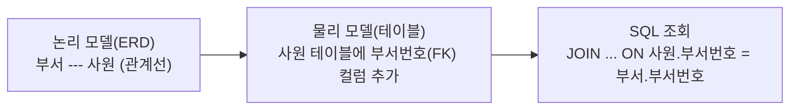
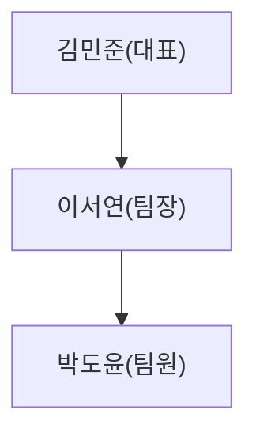
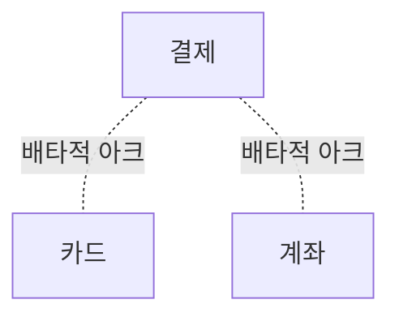

<Callout type="info">
  **이번 문서의 목표:** 이 문서를 다 읽으면 ERD의 관계선 하나가 실제 데이터베이스에서 어떻게 조인(JOIN) 조건으로 바뀌는지 설명하고, 계층형 관계와 상호배타적 관계라는 두 가지 특수한 관계 유형을 구분해 식별할 수 있다.
</Callout>

## 관계는 왜 조인으로 이어지는가

### 왜 필요한가

06편과 07편에서 정규화를 배우며 하나의 큰 테이블을 여러 개의 작은 테이블로 쪼개는 과정을 살펴봤다. 그런데 데이터를 실제로 활용할 때는 정반대의 작업이 필요하다. 화면에 "주문번호, 주문일자, 고객명"을 함께 보여 주려면, 주문 테이블과 고객 테이블에 흩어진 정보를 다시 하나로 모아야 한다. 이렇게 흩어진 테이블을 다시 이어 붙이는 SQL 연산이 바로 **조인**(JOIN)이며, 조인이 가능한 이유는 애초에 두 테이블이 논리적으로 **관계**(relationship)를 맺고 있었기 때문이다.

> **쉽게 말하면:** ERD에서 두 엔터티(entity, 관리 대상이 되는 실체) 사이에 그어진 관계선은 "설계도 위의 약속"이고, 조인은 그 약속을 실제 데이터베이스에서 SQL로 실행하는 행위다.

### 정의: 논리 모델의 관계선이 물리 모델의 외래키로

03편에서 관계는 "두 엔터티 사이의 논리적인 연관성"이라고 정의했다. 이 관계는 논리 데이터 모델(ERD) 위에서는 두 엔터티를 잇는 선 하나로 표현되지만, 이 설계가 실제 데이터베이스 테이블로 옮겨지는 과정(물리 모델링)에서는 한쪽 테이블에 **외래키**(foreign key, FK, 다른 테이블의 기본키를 그대로 가져와 저장한 컬럼)를 추가하는 형태로 구현된다. 즉 ERD의 관계선 하나가 실제로는 "이 컬럼 값은 저 테이블의 기본키 값 중 하나와 반드시 일치해야 한다"는 제약으로 번역되는 것이다.



### 작은 예시

부서 테이블과 사원 테이블이 다음과 같이 설계되어 있다고 하자.

| 부서번호(PK) | 부서명 |
|---|---|
| `10` | 개발팀 |
| `20` | 영업팀 |

| 사원번호(PK) | 사원명 | 부서번호(FK) |
|---|---|---|
| `100` | 김민준 | `10` |
| `101` | 이서연 | `10` |
| `102` | 박도윤 | `20` |

부서와 사원 사이의 "한 부서에는 여러 사원이 속한다(1:N)"는 관계는, 사원 테이블에 부서번호라는 외래키 컬럼이 추가되는 형태로 구현되어 있다. 이 외래키는 반드시 부서 테이블의 부서번호(PK) 값 중 하나와 같아야 하며, 이 규칙을 **참조 무결성**(referential integrity)이라 부른다.

### 계산·적용: SQL 조인으로 다시 합치기

이제 "사원명과 그 사원이 속한 부서명을 함께 조회"하려면, 사원 테이블의 부서번호와 부서 테이블의 부서번호가 같은 행끼리 짝지어야 한다.

```sql
SELECT e.사원명, d.부서명
FROM 사원 e
JOIN 부서 d ON e.부서번호 = d.부서번호;
```

| 사원명 | 부서명 |
|---|---|
| 김민준 | 개발팀 |
| 이서연 | 개발팀 |
| 박도윤 | 영업팀 |

### 결과 해석

`ON e.부서번호 = d.부서번호` 부분이 바로 ERD에서 부서와 사원 사이에 그어졌던 관계선의 정체다. 설계 단계에서는 선 하나로 그려졌던 약속이, 실행 단계에서는 두 컬럼의 값을 비교하는 조건식으로 구체화된 것이다. 관계가 1:N이므로 조인 결과에서 개발팀이라는 부서명이 두 번(김민준 행, 이서연 행) 반복해서 나타나는 점도 눈여겨봐야 한다. 이는 오류가 아니라 "여러 사원이 한 부서에 속한다"는 관계의 정상적인 결과다.

### 자주 틀리는 점

관계와 조인을 배우는 초반에 가장 흔한 실수는 `ON` 절(또는 `WHERE` 절의 조인 조건)을 빠뜨리는 것이다. 조인 조건 없이 두 테이블을 나열하면 16편에서 다룰 **카티전 곱**(Cartesian product, 두 테이블의 모든 행을 하나씩 전부 짝짓는 결과)이 발생해, 사원 3명과 부서 2개가 있으면 엉뚱하게도 6행이 나온다. "관계가 있다는 것"과 "조인 조건을 명시했다는 것"은 별개이며, 조인 조건을 직접 써 주지 않으면 SQL은 그 관계를 스스로 추론해 주지 않는다.

## PK와 FK가 조인 조건이 되는 과정

### 왜 필요한가

앞의 예시에서 조인 조건이 왜 하필 "부서번호 = 부서번호"였는지, 그 근거를 좀 더 명확히 짚어 볼 필요가 있다. 이 근거를 알아야 두 개 이상의 테이블을 조인할 때 "어떤 컬럼끼리 비교해야 하는가"를 스스로 판단할 수 있다.

> **쉽게 말하면:** 기본키(PK)는 "나는 누구인지" 스스로 증명하는 값이고, 외래키(FK)는 "나는 저 테이블의 누구를 가리키고 있다"고 알려 주는 값이다. 조인은 이 둘을 맞춰 보는 과정이다.

### 정의: 참조 무결성이 조인을 안전하게 만든다

04편에서 배운 **기본키**(primary key, PK)는 한 엔터티(테이블)의 인스턴스(행)를 유일하게 식별하는 속성이다. 외래키는 다른 테이블의 기본키 값을 그대로 복사해 온 컬럼으로, "이 행은 저 테이블의 어떤 행과 연결되어 있다"는 정보를 담는다. 데이터베이스는 **참조 무결성** 제약(10편에서 `FOREIGN KEY` 문법으로 자세히 다룬다)을 통해, 외래키 컬럼에는 참조 대상 테이블의 기본키에 실제로 존재하는 값만 들어갈 수 있도록 강제한다. 이 보장이 있기 때문에, 외래키 값과 기본키 값을 비교하는 조인이 "엉뚱한 행끼리 잘못 짝지어지는" 사고 없이 안전하게 동작한다.

### 계산·적용

사원 테이블의 부서번호(FK)가 항상 부서 테이블의 부서번호(PK) 중 하나라는 보장이 없다면 어떻게 될까? 예를 들어 부서 테이블에 없는 `99`라는 부서번호가 사원 테이블에 잘못 들어가 있다면, 그 사원은 `JOIN`(내부 조인, 이후 16편에서 자세히 다룰 `INNER JOIN`)으로는 결과에서 아예 빠져 버린다.

```sql
-- 사원 테이블에 부서번호 99(부서 테이블에는 없는 값)를 가진 행이 있다고 가정
SELECT e.사원명, d.부서명
FROM 사원 e
JOIN 부서 d ON e.부서번호 = d.부서번호;
-- 부서번호 99인 사원은 결과에서 조용히 누락된다
```

참조 무결성 제약이 걸려 있다면, 애초에 부서 테이블에 없는 `99`는 사원 테이블의 부서번호 컬럼에 입력되는 순간 오류로 거부된다. 즉 참조 무결성은 "조인했을 때 데이터가 조용히 사라지는 사고"를 애초에 막아 주는 안전장치다.

### 결과 해석

PK-FK 관계는 "테이블 설계 시점의 약속"이면서 동시에 "조회 시점의 조인 조건"이라는 두 가지 역할을 동시에 수행한다. 이 두 역할이 하나로 이어져 있다는 사실을 이해하면, 앞으로 여러 테이블을 조인할 때 "이 두 테이블은 어떤 컬럼으로 연결되어 있었는가"라는 질문에서 출발해 조인 조건을 스스로 찾아낼 수 있다.

### 자주 틀리는 점

"기본키와 외래키의 컬럼명이 반드시 똑같아야 조인할 수 있다"고 오해하는 경우가 있다. 컬럼명이 같으면 조건을 읽기 편할 뿐이며, SQL 문법상으로는 컬럼명이 달라도(`ON e.소속부서코드 = d.부서번호`처럼) 값이 같은 컬럼끼리 비교하기만 하면 조인은 정상적으로 동작한다. 조인의 본질은 "이름이 같은 컬럼끼리 잇는 것"이 아니라 "PK-FK로 맺어진 관계에 따라 값이 일치하는 행끼리 잇는 것"이다.

## 계층형 관계: 같은 엔터티 안에서 상하 구조를 표현한다

### 왜 필요한가

조직도(사원-상사), 카테고리 구조(대분류-중분류-소분류)처럼 "같은 종류의 대상끼리 상하 관계를 맺는" 경우가 실무에는 흔하다. 이런 구조를 표현하려고 부서 테이블, 상사 테이블처럼 계층 단계마다 별도의 엔터티를 만들면, 계층이 몇 단계까지 깊어질지 미리 알 수 없다는 문제에 부딪힌다.

> **쉽게 말하면:** 계층형 관계는 "한 엔터티가 자기 자신과 관계를 맺는" 특수한 관계다. 사원 엔터티 안에서 "이 사원의 상사도 결국 사원 중 한 명이다"라고 표현하는 방식이다.

### 정의: 재귀 관계와 자기 참조 외래키

이렇게 하나의 엔터티가 자기 자신을 참조하는 관계를 **재귀 관계**(recursive relationship) 또는 **자기 참조 관계**(self-referencing relationship)라 부른다. 물리 모델에서는 사원 테이블 안에 "상사사원번호"처럼, **같은 테이블의 기본키를 가리키는 외래키**를 추가하는 방식으로 구현한다.

### 작은 예시

| 사원번호(PK) | 사원명 | 상사사원번호(FK, 자기 참조) |
|---|---|---|
| `100` | 김민준(대표) | `NULL` |
| `101` | 이서연(팀장) | `100` |
| `102` | 박도윤(팀원) | `101` |



상사사원번호 컬럼은 사원번호와 똑같은 사원 테이블을 가리키고 있다. 대표인 김민준은 상사가 없으므로 상사사원번호가 `NULL`인데, 이는 "값이 없다"는 것이 아니라 "이 사원에게는 참조할 상사가 존재하지 않는다"는 자연스러운 상태다(NULL의 정확한 의미는 09편에서 깊게 다룬다).

### 계산·적용

계층형 관계에서 "각 사원과 그 상사의 이름을 나란히" 조회하려면, 같은 테이블을 마치 두 개의 다른 테이블인 것처럼 취급해 스스로와 조인해야 한다. 이를 **셀프 조인**(self join)이라 하며, 16편에서 다시 자세히 다룬다.

```sql
SELECT e.사원명 AS 사원, m.사원명 AS 상사
FROM 사원 e
LEFT JOIN 사원 m ON e.상사사원번호 = m.사원번호;
```

| 사원 | 상사 |
|---|---|
| 김민준(대표) | `NULL` |
| 이서연(팀장) | 김민준(대표) |
| 박도윤(팀원) | 이서연(팀장) |

### 결과 해석

같은 사원 테이블을 `e`(직원 관점)와 `m`(상사 관점)이라는 별칭(alias)으로 각각 다르게 부르지 않으면, SQL 엔진은 "사원명"이 직원의 이름인지 상사의 이름인지 구분하지 못한다. 상사가 없는 대표(김민준)의 상사 컬럼이 `NULL`로 나오는 것은, `LEFT JOIN`을 썼기 때문에 왼쪽 테이블(직원 관점)의 행이 보존되고 오른쪽(상사 관점)에서 대응하는 행을 찾지 못해 `NULL`로 채워진 결과다.

### 자주 틀리는 점

셀프 조인에서는 반드시 별칭을 서로 다르게 지정해야 한다. 별칭 없이 "사원 조인 사원"이라고만 쓰면 어느 사원 테이블을 가리키는지 SQL 파서가 구분할 수 없어 오류가 발생한다. 또한 계층형 관계를 "1:1 관계"로 오해하는 경우가 있는데, 한 상사 밑에 여러 부하 직원이 있을 수 있으므로 계층형 관계는 본질적으로 1:N 관계이며, 22편에서 배울 `CONNECT BY` 같은 계층형 질의로 여러 단계를 한 번에 조회할 수 있다.

## 상호배타적 관계: 둘 중 하나와만 관계를 맺는다

### 왜 필요한가

한 엔터티가 상황에 따라 서로 다른 두 종류의 대상 중 **하나와만** 관계를 맺어야 하는 경우가 있다. 예를 들어 결제 내역은 카드 결제일 수도, 계좌이체 결제일 수도 있지만, 한 건의 결제가 카드이면서 동시에 계좌이체일 수는 없다. 이런 상황을 일반적인 관계선 두 개로만 표현하면, "카드와 계좌이체 정보가 동시에 채워져도 되는 것처럼" 오해를 살 수 있다.

> **쉽게 말하면:** 상호배타적 관계는 "이 문 아니면 저 문, 둘 다는 안 된다"는 규칙을 ERD에 표시하는 방법이다.

### 정의: Barker 표기법의 배타적 아크

02편에서 다룬 Barker 표기법에서는 이런 "둘 중 하나만 성립하는 관계"를 관계선 여러 개를 둥근 호(arc)로 묶어 표시하며, 이를 **배타적 아크**(exclusive arc) 또는 상호배타적 관계라 부른다.



물리 모델에서는 보통 결제 테이블에 카드번호(FK)와 계좌번호(FK) 컬럼을 둘 다 두되, "이 두 컬럼 중 정확히 하나만 값이 채워지고 나머지는 반드시 `NULL`이어야 한다"는 규칙으로 구현한다.

### 작은 예시

| 결제번호(PK) | 결제수단 | 카드번호(FK) | 계좌번호(FK) |
|---|---|---|---|
| `1` | 카드 | `CARD-01` | `NULL` |
| `2` | 계좌이체 | `NULL` | `ACC-01` |

### 계산·적용: 무결성을 강제하려면

문제는 카드번호와 계좌번호를 그냥 각각 `NULL` 허용 외래키로만 선언하면, "둘 다 값이 채워지는" 잘못된 행이나 "둘 다 `NULL`인" 잘못된 행이 들어오는 것을 데이터베이스가 막아 주지 못한다는 점이다. 이 규칙을 실제로 강제하려면 10편에서 배울 `CHECK` 제약조건을 함께 걸어야 한다.

```sql
ALTER TABLE 결제
ADD CONSTRAINT ck_결제수단_배타
CHECK (
  (카드번호 IS NOT NULL AND 계좌번호 IS NULL)
  OR
  (카드번호 IS NULL AND 계좌번호 IS NOT NULL)
);
```

### 결과 해석

이 `CHECK` 제약은 "카드번호와 계좌번호 중 정확히 하나만 값이 있어야 한다"는 상호배타 규칙을, ERD의 배타적 아크에서 SQL 제약조건으로 그대로 옮긴 것이다. 여기서 `IS NULL`이라는 연산자가 등장하는 것을 눈여겨봐야 한다. 상호배타적 관계는 결국 "선택적 관계(optional relationship, 관계를 맺지 않아도 되는 관계)에서 어느 한쪽이 비어 있는(`NULL`인) 상태"로 구현되며, 이는 관계의 선택성(optionality)이 `NULL` 값과 직접 연결된다는 것을 보여 준다. `NULL`을 값이 아니라 상태로 이해해야 하는 이유는 09편에서 훨씬 깊게 다룬다.

### 자주 틀리는 점

상호배타적 관계를 "두 외래키 모두 `NULL`을 허용하면 자동으로 구현된다"고 착각하는 경우가 많다. `NULL` 허용은 "값이 없어도 된다"는 뜻일 뿐, "두 컬럼 중 하나만 값이 있어야 한다"는 상호배타 규칙까지 저절로 보장해 주지는 않는다. 이 규칙을 실제로 지키려면 `CHECK` 제약이나 애플리케이션 로직 같은 별도의 강제 장치가 반드시 필요하다는 점이 시험에서 자주 확인하는 포인트다.

## 핵심 정리

- 논리 모델(ERD)의 관계선은 물리 모델에서 외래키(FK) 컬럼으로 구현되고, 조회 시점에는 `ON` 절의 조인 조건으로 다시 나타난다. 관계-외래키-조인은 하나의 흐름으로 이어져 있다.
- 참조 무결성은 외래키 값이 항상 참조 대상 테이블의 기본키 값 중 하나이도록 보장해, 조인 결과에서 데이터가 조용히 누락되는 사고를 막는다.
- 계층형 관계는 한 엔터티가 자기 자신을 참조하는 재귀 관계로, 같은 테이블을 서로 다른 별칭으로 두 번 등장시키는 셀프 조인으로 조회한다.
- 상호배타적 관계는 여러 외래키 중 정확히 하나만 값을 가져야 하는 규칙으로, `NULL` 허용만으로는 보장되지 않으며 `CHECK` 제약 같은 별도 장치가 필요하다.

## 마무리 복습

<Quiz
  questionNumber={1}
  question="논리 모델(ERD)의 관계선이 물리 모델과 SQL 조회 단계에서 각각 어떻게 구현되는지 순서대로 가장 올바르게 나열한 것은?"
  options={['관계선 → 인덱스 → GROUP BY', '관계선 → 외래키(FK) → JOIN의 ON 조건', '관계선 → 제약조건(CHECK) → 트리거', '관계선 → 후보키 → 서브쿼리']}
  correctAnswer={2}
  explanation="ERD의 관계선은 물리 모델에서 외래키(FK) 컬럼으로 구현되고, 이 외래키는 조회 시 JOIN의 ON 절 조인 조건으로 다시 사용된다."
  optionExplanations={['인덱스와 GROUP BY는 관계 구현과 직접적인 대응 관계가 아니다', '정답. 관계선은 외래키로 구현되고, 외래키는 조인 조건으로 사용된다', 'CHECK 제약과 트리거는 특수한 관계(예: 상호배타적 관계)를 보강할 때 쓰일 뿐, 일반적인 관계 구현 경로는 아니다', '후보키와 서브쿼리는 관계가 조인으로 이어지는 일반적인 흐름과는 관련이 없다']}
/>

<Quiz
  questionNumber={2}
  question="사원 테이블의 부서번호(FK)가 부서 테이블에 존재하지 않는 값(예: 99)을 갖지 못하도록 보장하는 제약을 무엇이라 하는가?"
  options={['도메인 무결성', '참조 무결성', '개체 무결성', '사용자 정의 무결성']}
  correctAnswer={2}
  explanation="외래키 값이 반드시 참조 대상 테이블의 기본키에 존재하는 값이어야 한다는 규칙은 참조 무결성이다. 이 보장이 있어야 조인 결과에서 데이터가 조용히 누락되는 문제를 막을 수 있다."
  optionExplanations={['도메인 무결성은 컬럼 값이 정의된 값의 범위(도메인) 안에 있어야 한다는 규칙이다', '정답. 외래키가 참조하는 기본키 값의 존재를 보장하는 것이 참조 무결성이다', '개체 무결성은 기본키가 NULL이거나 중복되지 않아야 한다는 규칙이다', '사용자 정의 무결성은 업무 규칙에 따라 별도로 정의하는 제약을 가리키며 이 상황을 직접 설명하지 않는다']}
/>

<Quiz
  questionNumber={3}
  question="사원 테이블 안에 상사사원번호(FK)를 두어 같은 테이블을 참조하는 관계를 무엇이라 하는가?"
  options={['상호배타적 관계', '재귀 관계(자기 참조 관계)', '식별 관계', '슈퍼타입-서브타입 관계']}
  correctAnswer={2}
  explanation="한 엔터티가 자기 자신을 참조하는 관계를 재귀 관계 또는 자기 참조 관계라 하며, 조직도의 상사-부하 구조가 대표적인 예다."
  optionExplanations={['상호배타적 관계는 서로 다른 두 엔터티 중 하나와만 관계를 맺는 구조로, 자기 참조와는 다른 개념이다', '정답. 같은 테이블 안에서 상하 관계를 표현하는 것이 재귀 관계다', '식별 관계는 부모 엔터티의 기본키가 자식 엔터티의 기본키 일부로 상속되는지 여부를 가리키는 별개의 분류다', '슈퍼타입-서브타입 관계는 공통 속성과 특수 속성을 분리하는 구조로, 자기 참조와는 다른 개념이다']}
/>

<Quiz
  questionNumber={4}
  question="계층형 관계를 조회할 때 같은 사원 테이블을 두 번 등장시켜야 하는 이유로 가장 적절한 것은?"
  options={['외래키 컬럼이 두 개 이상 필요하기 때문이다', '직원 관점과 상사 관점을 구분해 사원명 컬럼이 어느 쪽 이름인지 식별해야 하기 때문이다', '계층형 관계는 항상 두 개의 서로 다른 테이블로 저장되기 때문이다', 'GROUP BY 절에서 두 번 집계해야 하기 때문이다']}
  correctAnswer={2}
  explanation="같은 사원 테이블이 직원 역할과 상사 역할을 동시에 수행하므로, 서로 다른 별칭을 붙여 두 번 등장시켜야 사원명이 직원의 이름인지 상사의 이름인지 SQL이 구분할 수 있다."
  optionExplanations={['외래키는 상사사원번호 하나만 있으면 재귀 관계 구현에 충분하다', '정답. 셀프 조인은 같은 테이블을 서로 다른 역할(직원·상사)로 구분하기 위한 것이다', '재귀 관계는 하나의 테이블 안에서 자기 자신을 참조하는 구조이지, 두 개의 별도 테이블로 저장되지 않는다', 'GROUP BY 집계는 계층형 관계의 셀프 조인과 직접적인 관련이 없다']}
/>

<Quiz
  questionNumber={5}
  question="결제 테이블에 카드번호(FK)와 계좌번호(FK)를 모두 NULL 허용으로만 선언했을 때 발생할 수 있는 문제는?"
  options={['두 컬럼 모두 값이 채워지거나 모두 NULL인 잘못된 행을 데이터베이스가 막지 못한다', '조인 시 카티전 곱이 무조건 발생한다', 'NULL을 포함한 컬럼은 인덱스를 생성할 수 없다', '카드번호와 계좌번호의 데이터 타입이 자동으로 문자형으로 바뀐다']}
  correctAnswer={1}
  explanation="NULL 허용은 값이 없어도 된다는 뜻일 뿐, 두 컬럼 중 정확히 하나만 값을 가져야 한다는 상호배타 규칙까지 보장하지는 않는다. 이 규칙을 지키려면 CHECK 제약 같은 별도 장치가 필요하다."
  optionExplanations={['정답. NULL 허용만으로는 상호배타 규칙(정확히 하나만 값을 가짐)이 강제되지 않는다', '카티전 곱은 조인 조건을 아예 생략했을 때 발생하는 문제로, NULL 허용 여부와는 무관하다', 'NULL을 포함한 컬럼에도 인덱스를 생성할 수 있으며, 이는 이 상황과 관련이 없다', '데이터 타입은 컬럼 정의 시점에 고정되며 NULL 허용 여부에 따라 자동으로 바뀌지 않는다']}
/>

<Quiz
  questionNumber={6}
  question="부서(1) : 사원(N) 관계에서 사원 테이블에 부서번호(FK)를 두고 조인했을 때, 조인 결과에 같은 부서명이 여러 번 반복해 나타나는 이유로 가장 적절한 것은?"
  options={['조인 조건에 오류가 있기 때문이다', '여러 사원이 같은 부서에 속한다는 1:N 관계가 정상적으로 반영된 결과이기 때문이다', '부서 테이블에 중복된 행이 저장되어 있기 때문이다', 'NULL 값이 조인 결과에 포함되었기 때문이다']}
  correctAnswer={2}
  explanation="1:N 관계에서는 N쪽(사원)의 행 수만큼 1쪽(부서)의 값이 반복해 나타나는 것이 정상이다. 이는 관계의 카디널리티(cardinality, 관계 차수)가 조인 결과에 그대로 반영된 것이다."
  optionExplanations={['조인 조건 자체는 정상이며, 반복은 관계의 특성에서 비롯된 정상적인 결과다', '정답. 1:N 관계의 N쪽 행 수만큼 1쪽 값이 반복되는 것은 정상 동작이다', '부서 테이블에는 부서마다 한 행만 있으며, 반복은 조인 결과에서 나타나는 현상일 뿐 원본 테이블의 중복이 아니다', '이 예시에는 NULL이 개입되지 않았으며, 반복 현상은 NULL과 무관하게 1:N 관계 자체에서 비롯된다']}
/>

## 참고 자료

- [데이터자격시험 - SQLD 출제기준](https://www.dataq.or.kr/www/sub/a_04.do)
- [MDN - SQL 개요 (관계형 DB 기초)](https://developer.mozilla.org/ko/docs/Glossary/SQL)
