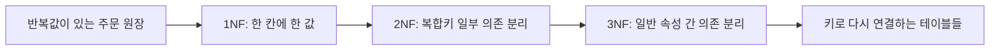

## 이번 편의 목표

- 정규화가 필요한 이유를 중복과 이상 현상으로 설명한다.
- 함수 종속, 결정자, 부분 함수 종속과 이행 함수 종속을 구분한다.
- 비정규형 데이터를 1정규형, 2정규형, 3정규형으로 단계별 분해한다.
- 정규화 후 테이블을 키와 관계로 다시 연결하고 과도한 분해를 피한다.

## 먼저 알아둘 말

| 용어 | 쉬운 뜻 |
| --- | --- |
| 정규화 | 데이터 중복과 잘못된 의존을 줄이도록 테이블을 나누는 과정 |
| 이상 현상 | 한 테이블에 여러 사실을 섞어 저장해 입력·수정·삭제가 비정상적으로 되는 문제 |
| 함수 종속 | 어떤 속성값을 알면 다른 속성값 하나가 결정되는 규칙 |
| 결정자 | 다른 속성값을 결정하는 기준이 되는 속성 또는 속성 묶음 |
| 완전 함수 종속 | 복합 결정자의 전체를 알아야 값이 결정되는 관계 |
| 부분 함수 종속 | 복합 결정자의 일부만으로도 값이 결정되는 관계 |
| 이행 함수 종속 | 키가 다른 일반 속성을 거쳐 또 다른 속성을 간접 결정하는 관계 |
| 정규형 | 정규화 규칙을 어느 단계까지 만족하는지 나타내는 상태 |

## 선수지식과 핵심 질문

속성은 자신이 속한 엔터티를 직접 설명해야 하고 식별자는 각 인스턴스를 유일하게 구분한다는 내용을 사용한다.

핵심 질문은 이것이다.

> 주문 한 줄에 회원·상품 정보까지 모두 넣으면 보기에는 편한데, 왜 테이블을 나누어야 할까?

## 정규화를 아주 쉽게 말하면

정규화는 **한 가지 사실을 한 곳에서만 고치게 만드는 정리 방법**이다.

예를 들어 P10 상품명이 세 주문 행에 반복되어 있다면 이름을 바꿀 때 세 군데를 찾아야 한다. 상품 정보를 상품 표 한 곳에 두면 P10 행 한 군데만 수정하면 된다.

```text
정리 전
P10 키보드 ─ 주문 1001
P10 키보드 ─ 주문 1002
P10 키보드 ─ 주문 1003
      ↑ 상품명이 세 군데 반복

정리 후
상품 P10 키보드  ← 한 곳
   ↑ 상품번호로 연결
주문상세 1001·1002·1003
```



각 단계는 앞 단계의 규칙을 버리는 것이 아니라 유지하면서 다음 중복 원인을 추가로 분리한다.

테이블을 무작정 잘게 나누는 것이 아니라, **누가 그 값을 결정하는가**를 보고 사실의 주인을 찾아 주는 과정이다.

## 정규화는 한 곳에 한 사실을 두는 과정이다

**정규화(normalization)** 는 속성 사이의 의존 관계를 분석해 서로 다른 사실을 적절한 테이블로 분리하는 과정이다.

다음 주문 원장을 생각해 보자.

| 주문번호 | 주문일 | 회원번호 | 회원명 | 등급코드 | 등급명 | 상품번호 | 상품명 | 현재가격 | 수량 |
| --- | --- | --- | --- | --- | --- | --- | --- | ---: | ---: |
| 1001 | 8/10 | M01 | 민지 | G1 | 일반 | P10 | 키보드 | 50000 | 1 |
| 1001 | 8/10 | M01 | 민지 | G1 | 일반 | P20 | 마우스 | 30000 | 2 |
| 1002 | 8/11 | M02 | 준호 | G2 | VIP | P10 | 키보드 | 50000 | 1 |

한 표에서 주문 내역을 모두 볼 수 있지만 회원명, 등급명, 상품명이 여러 행에 반복된다. 반복 자체보다 더 큰 문제는 서로 다른 사실의 변경 시점이 한 테이블에 섞인다는 것이다.

<Callout type="info">
  정규화의 핵심은 테이블 수를 늘리는 것이 아니다. 어떤 속성이 어떤 식별자에 의존하는지 찾아 각 사실을 한 곳에서 관리하는 것이다.
</Callout>

## 중복이 만드는 세 가지 이상 현상

### 입력 이상

아직 주문되지 않은 새 상품 P30을 등록하려 해도 주문번호가 없어서 주문 원장에 넣기 어렵다. 상품 등록이라는 사실이 주문 발생에 묶였다.

### 수정 이상

상품 P10의 이름을 `기계식 키보드`로 바꾸려면 P10이 등장하는 모든 행을 수정해야 한다. 한 행을 놓치면 같은 상품번호에 서로 다른 상품명이 생긴다.

### 삭제 이상

주문 1002를 삭제했는데 M02 회원의 유일한 행이었다면 회원 정보까지 사라진다. 주문 삭제가 회원 삭제를 일으킨다.

| 이상 | 원인 | 잃거나 어긋나는 사실 |
| --- | --- | --- |
| 입력 이상 | 서로 다른 사실의 생성을 한 행에 강제 | 주문 전 상품 등록 불가 |
| 수정 이상 | 같은 사실이 여러 행에 반복 | 상품명 불일치 |
| 삭제 이상 | 한 행에 여러 사실이 함께 존재 | 주문 삭제로 회원 정보 손실 |

## 함수 종속을 읽는 법

`X → Y`는 X값이 같으면 Y값도 반드시 같다는 뜻이다. X를 **결정자**, Y를 **종속 속성**이라고 한다.

```text
회원번호 → 회원명, 등급코드
등급코드 → 등급명
상품번호 → 상품명, 현재가격
주문번호 → 주문일, 회원번호
(주문번호, 상품번호) → 수량
```

`회원번호 → 회원명`은 회원번호 하나가 특정 회원명을 결정한다는 업무 규칙이다. 반대로 동명이인이 있을 수 있으므로 `회원명 → 회원번호`는 일반적으로 성립하지 않는다.

화살표는 계산식이 아니라 “왼쪽 값 하나를 고르면 오른쪽 값이 하나로 정해지는가?”라는 질문이다.

| 왼쪽에서 고른 값 | 오른쪽에서 찾은 값 | 하나로 정해지는가? |
| --- | --- | --- |
| 회원번호 M01 | 회원명 민지 | 예. `M01 → 민지` |
| 회원명 민지 | 회원번호 M01 또는 M03 | 아니오. 동명이인이 가능 |
| 주문번호 1001 | 회원번호 M01 | 예. 한 주문의 주문자는 한 명 |
| 상품번호 P10 | 상품명 키보드 | 예. 한 상품번호는 한 상품을 가리킴 |

따라서 화살표 방향을 마음대로 뒤집으면 안 된다.

<Callout type="warning">
  함수 종속은 현재 표본에서 우연히 값이 같은지를 보는 것이 아니라 업무 전체에서 지켜져야 하는 규칙이다.
</Callout>

## 제1정규형: 한 칸에는 하나의 값

**제1정규형(1NF)** 은 각 속성이 현재 업무에서 원자값 하나를 갖고 반복 그룹이 없도록 한다.

```text
잘못된 구조
주문(주문번호, 상품1, 수량1, 상품2, 수량2, 상품3, 수량3)
```

상품 개수가 늘 때마다 열을 추가해야 한다. 상품별 행으로 바꾸면 반복 그룹이 사라진다.

```text
1NF 주문원장
한 행 = 주문 한 건에 포함된 상품 한 종류
후보키 = (주문번호, 상품번호)
```

`P10,P20`처럼 여러 값을 한 칸에 합치는 것도 검색·검증과 관계 표현을 어렵게 한다.

## 제2정규형: 복합키의 일부에만 의존하지 않기

**제2정규형(2NF)** 은 1NF를 만족하면서, 일반 속성이 복합 후보키 전체에 완전 함수 종속되도록 한다.

현재 주문원장의 키가 `(주문번호, 상품번호)`라고 하자.

```text
주문번호만 알면 결정: 주문일, 회원번호, 회원명, 등급코드, 등급명
상품번호만 알면 결정: 상품명, 현재가격
둘 다 알아야 결정: 수량
```

주문번호 또는 상품번호 일부만으로 결정되는 속성이 **부분 함수 종속**이다. 이를 분리한다.

복합키를 두 조각짜리 열쇠라고 생각하면 쉽다.

```text
복합키 = [주문번호] + [상품번호]

주문일    : 주문번호 조각만 있어도 찾을 수 있음 → 부분 종속
상품명    : 상품번호 조각만 있어도 찾을 수 있음 → 부분 종속
수량      : 두 조각이 모두 있어야 찾을 수 있음 → 완전 종속
```

```text
주문(주문번호, 주문일, 회원번호, 회원명, 등급코드, 등급명)
상품(상품번호, 상품명, 현재가격)
주문상세(주문번호, 상품번호, 수량)
```

실제 행을 나누면 다음처럼 보인다.

**주문**

| 주문번호 | 주문일 | 회원번호 | 회원명 | 등급코드 | 등급명 |
| ---: | --- | --- | --- | --- | --- |
| 1001 | 8/10 | M01 | 민지 | G1 | 일반 |
| 1002 | 8/11 | M02 | 준호 | G2 | VIP |

**상품**

| 상품번호 | 상품명 | 현재가격 |
| --- | --- | ---: |
| P10 | 키보드 | 50,000 |
| P20 | 마우스 | 30,000 |

**주문상세**

| 주문번호 | 상품번호 | 수량 |
| ---: | --- | ---: |
| 1001 | P10 | 1 |
| 1001 | P20 | 2 |
| 1002 | P10 | 1 |

주문 1001의 주문일과 회원 정보는 주문 표에 한 번만 남고, P10 상품 정보도 상품 표에 한 번만 남는다.

이제 주문상세의 수량은 복합키 전체에 의존한다. 상품을 주문 없이 등록할 수도 있다.

<Callout type="info">
  검토 중인 후보키가 단일 속성이면 키 일부라는 개념이 없으므로 그 후보키에 대한 부분 함수 종속은 발생하지 않는다. 2NF 문제는 복합 후보키가 있는지 먼저 확인한다.
</Callout>

## 제3정규형: 일반 속성을 거쳐 의존하지 않기

**제3정규형(3NF)** 은 2NF를 만족하면서, 일반 속성이 키가 아닌 다른 일반 속성에 의존하는 이행 함수 종속을 제거한다.

2NF의 주문 테이블을 보자.

```text
주문번호 → 회원번호
회원번호 → 회원명, 등급코드
등급코드 → 등급명
```

주문번호가 회원번호를 거쳐 회원명을 간접 결정한다. 회원명은 주문 사실이 아니라 회원 사실이다. 등급명도 등급코드가 설명하는 사실이다.

```text
회원등급(등급코드, 등급명)
회원(회원번호, 회원명, 등급코드)
주문(주문번호, 주문일, 회원번호)
상품(상품번호, 상품명, 현재가격)
주문상세(주문번호, 상품번호, 수량, 주문단가)
```

`주문단가`는 상품의 현재가격을 중복한 값처럼 보이지만 주문 시점에 확정된 거래 사실이다. `(주문번호, 상품번호)`에 의존하므로 주문상세에 두는 것이 자연스럽다.

3NF에서 제거하는 간접 의존은 다음처럼 읽는다.

```text
주문번호 1001
  → 회원번호 M01을 알 수 있음
  → M01을 통해 회원명 민지를 알 수 있음

주문번호가 회원명을 직접 설명하는 것이 아니다.
회원명이 속할 진짜 자리는 회원 테이블이다.
```

최종 표에 예제 값을 배치하면 다음과 같다.

| 회원번호 | 회원명 | 등급코드 |
| --- | --- | --- |
| M01 | 민지 | G1 |
| M02 | 준호 | G2 |

| 등급코드 | 등급명 |
| --- | --- |
| G1 | 일반 |
| G2 | VIP |

회원 이름을 바꿀 때는 회원 표 한 행만, 등급 이름을 바꿀 때는 회원등급 표 한 행만 수정하면 된다.

## 단계별 결과를 비교하기

| 단계 | 제거하는 문제 | 핵심 질문 |
| --- | --- | --- |
| 1NF | 반복 속성, 한 칸의 여러 값 | 한 칸에 값 하나인가? |
| 2NF | 복합키 일부에만 의존 | 키 전체를 알아야 결정되는가? |
| 3NF | 일반 속성 사이의 간접 의존 | 키가 아닌 속성이 다른 일반 속성을 결정하는가? |

정규형은 순서대로 만족한다. 3NF를 말하려면 1NF와 2NF도 이미 만족해야 한다.

## 정규화 뒤에는 관계로 다시 연결한다

테이블을 나눈 뒤 정보가 사라진 것이 아니다. 식별자와 외래키로 연결한다.

```text
회원등급 1 ─ N 회원 1 ─ N 주문 1 ─ N 주문상세 N ─ 1 상품
```

```sql
SELECT o.order_id,
       m.member_name,
       p.product_name,
       oi.quantity,
       oi.unit_price
FROM orders AS o
JOIN members AS m
  ON m.member_id = o.member_id
JOIN order_items AS oi
  ON oi.order_id = o.order_id
JOIN products AS p
  ON p.product_id = oi.product_id;
```

분리한 테이블에 위의 예제 값을 넣고 실행하면 다음처럼 다시 한 화면용 결과를 만들 수 있다.

| order_id | member_name | product_name | quantity | unit_price |
| ---: | --- | --- | ---: | ---: |
| 1001 | 민지 | 키보드 | 1 | 50,000 |
| 1001 | 민지 | 마우스 | 2 | 28,000 |
| 1002 | 준호 | 키보드 | 1 | 50,000 |

결과에서 민지가 두 번 보이지만 회원 테이블에 민지를 두 번 저장한 것은 아니다. 주문 1001의 상품이 두 종류라 조회 결과가 주문상세 두 행으로 펼쳐진 것이다. 분리한 테이블은 JOIN으로 필요한 조회 결과를 다시 구성한다. 이 연결은 다음 편에서 자세히 다룬다.

## 정규화가 항상 열을 가장 작게 나눈다는 뜻은 아니다

원자성은 업무에서 값을 어떻게 사용하는지에 따라 달라진다.

- 주소를 통째로 출력만 한다면 하나의 속성으로 볼 수 있다.
- 우편번호별 배송 정책을 적용한다면 우편번호를 분리해야 한다.
- 이름을 성과 이름으로 각각 검색하지 않는다면 반드시 둘로 나눌 필요는 없다.

또한 성능 때문에 의도적으로 중복을 허용하는 **반정규화**가 있지만, 먼저 정상적인 정규 모델과 중복으로 생길 위험을 이해한 뒤 선택해야 한다.

## 흔한 실수와 진단법

| 실수 | 문제 | 진단법 |
| --- | --- | --- |
| 열 이름만 보고 테이블 분리 | 함수 종속 근거가 없음 | 결정자와 종속 속성을 화살표로 쓴다. |
| 현재 데이터가 중복 없어서 정규화됐다고 판단 | 미래 업무 규칙을 반영하지 못함 | 표본이 아닌 업무 규칙을 확인한다. |
| 2NF에서 단일키 테이블을 부분 종속이라 함 | 키 일부가 존재하지 않음 | 후보키가 복합인지 먼저 본다. |
| 파생값과 스냅숏 사실을 혼동 | 과거 거래를 재현하지 못함 | 값이 어느 시점의 무엇을 설명하는지 묻는다. |
| 테이블을 나눈 뒤 키를 두지 않음 | 다시 연결할 수 없음 | 각 테이블의 PK와 FK를 표시한다. |

## 시험 연결

1. 정규화는 데이터 중복과 입력·수정·삭제 이상을 줄인다.
2. 1NF는 원자값과 반복 그룹, 2NF는 부분 함수 종속, 3NF는 이행 함수 종속이 핵심이다.
3. 부분 함수 종속은 복합 후보키의 일부가 일반 속성을 결정할 때 발생한다.
4. 이행 함수 종속은 키가 일반 속성을 거쳐 다른 일반 속성을 결정하는 관계다.
5. 정규화는 조회 시 JOIN이 늘 수 있지만 데이터의 일관성과 변경 안전성을 높인다.

## 짧은 확인

`수강(학생번호, 과목번호, 학생이름, 과목명, 성적)`의 키가 `(학생번호, 과목번호)`라면 2NF를 위반하는 속성을 찾아보자.

<Collapse title="확인하기">

학생이름은 학생번호만으로, 과목명은 과목번호만으로 결정되므로 복합키 일부에 부분 함수 종속된다. 학생·과목·수강 테이블로 분리한다. 성적은 학생과 과목을 모두 알아야 결정되므로 수강에 남는다.

</Collapse>

## 다음 단계: 복습

[09편 복습 문제와 정규화 실습](./09_normalization-review)에서 함수 종속을 직접 표시하며 테이블을 분해하자.

## 정리

<Callout type="default">
  - 정규화는 속성이 실제로 의존하는 식별자에 따라 사실을 분리하는 과정이다.
  - 중복된 한 테이블은 입력·수정·삭제 이상을 만들 수 있다.
  - 1NF는 반복값, 2NF는 부분 종속, 3NF는 이행 종속을 제거한다.
  - 정규화 판단은 현재 데이터가 아니라 업무의 함수 종속 규칙을 기준으로 한다.
  - 분리한 테이블은 PK와 FK 관계, JOIN으로 다시 연결한다.
</Callout>

다음 편에서는 모델의 관계가 실제 JOIN 조건과 결과 행 수로 어떻게 이어지는지 배운다.

## 참고 자료

- [한국데이터산업진흥원 — SQLD 안내](https://www.dataq.or.kr/www/sub/a_04.do)
- [Microsoft Learn — 데이터베이스 정규화](https://learn.microsoft.com/ko-kr/previous-versions/troubleshoot/microsoft-365/microsoft-365-apps/access/database-normalization-description)
- [PostgreSQL — Table Constraints](https://www.postgresql.org/docs/current/ddl-constraints.html)
