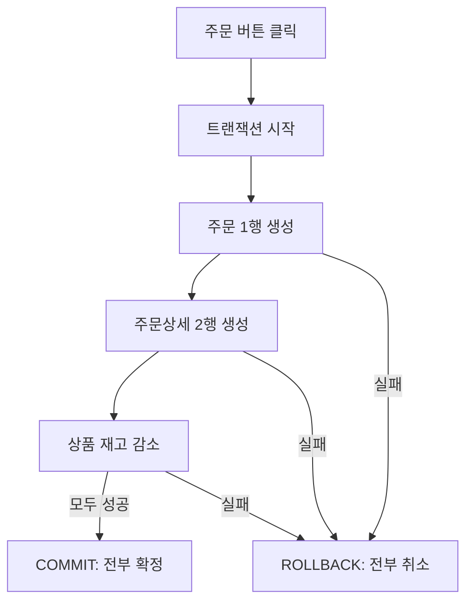

## 이번 편의 목표

- 업무 트랜잭션과 데이터베이스 트랜잭션의 관계를 구분한다.
- 주문 한 건이 주문·주문상세·재고에 어떤 변화를 만드는지 설명한다.
- 모델의 관계와 필수성이 실제 입력 순서와 무결성에 미치는 영향을 읽는다.
- CRUD 표로 업무와 엔터티의 누락·과도한 결합을 점검한다.

## 먼저 알아둘 말

| 용어 | 쉬운 뜻 |
| --- | --- |
| 업무 트랜잭션 | 사용자가 하나의 일로 인식하는 업무 사건 |
| 데이터베이스 트랜잭션 | 함께 성공하거나 함께 취소하도록 묶은 데이터 변경 단위 |
| CRUD | 생성(Create), 조회(Read), 수정(Update), 삭제(Delete)의 앞글자 |
| 원자성 | 묶인 작업이 전부 반영되거나 전부 취소되는 성질 |
| 생명주기 | 데이터가 생성되어 상태가 바뀌고 종료되는 흐름 |
| 정합성 | 서로 관련된 데이터가 업무 규칙상 모순되지 않는 상태 |

## 선수지식과 핵심 질문

[10. 관계와 조인의 이해](./10_relationship-and-join)까지 회원·주문·주문상세·상품을 분리하고 키로 연결했다.

> 사용자가 주문 버튼을 한 번 눌렀는데 왜 데이터베이스에서는 여러 행을 바꾸어야 할까?

## 버튼 한 번 뒤에서 일어나는 일

민지가 키보드 1개와 마우스 2개를 주문한다고 하자.

```text
사용자가 보는 일: 주문하기 1번

데이터베이스에서 필요한 일
  1. 주문 1004 한 행 생성
  2. 주문상세 두 행 생성
  3. 키보드 재고 1 감소
  4. 마우스 재고 2 감소
```

업무 트랜잭션 하나가 테이블 한 개만 바꾼다는 뜻은 아니다. **하나의 업무를 완성하는 데 필요한 여러 데이터 변경**이 함께 움직인다.



중간 단계 하나라도 실패하면 주문 머리글만 남거나 재고만 줄지 않도록 전체 변경을 원래 상태로 되돌린다.

## 실행 전 데이터

### 상품

| product_id | product_name | stock_qty |
| --- | --- | ---: |
| P10 | 키보드 | 5 |
| P20 | 마우스 | 8 |

### 주문과 주문상세

현재 주문 1004는 아직 없고, 주문상세에도 1004번 행이 없다.

## 하나의 트랜잭션으로 처리하기

아래 예시는 흐름을 보여 주기 위한 표준적인 형태다. 실제 재고 동시성 처리는 DBMS와 서비스 설계에 따라 잠금·조건부 수정 등을 추가한다.

```sql
BEGIN;

INSERT INTO orders (order_id, member_id, order_status, ordered_at)
VALUES (1004, 'M01', 'PAID', TIMESTAMP '2026-08-10 10:00:00');

INSERT INTO order_items (order_id, product_id, quantity, unit_price)
VALUES (1004, 'P10', 1, 50000);

INSERT INTO order_items (order_id, product_id, quantity, unit_price)
VALUES (1004, 'P20', 2, 28000);

UPDATE products SET stock_qty = stock_qty - 1 WHERE product_id = 'P10';
UPDATE products SET stock_qty = stock_qty - 2 WHERE product_id = 'P20';

COMMIT;
```

모두 성공하면 데이터는 다음 상태가 된다.

### 주문 결과

| order_id | member_id | order_status | ordered_at |
| ---: | --- | --- | --- |
| 1004 | M01 | PAID | 2026-08-10 10:00 |

### 주문상세 결과

| order_id | product_id | quantity | unit_price |
| ---: | --- | ---: | ---: |
| 1004 | P10 | 1 | 50,000 |
| 1004 | P20 | 2 | 28,000 |

### 재고 결과

| product_id | 변경 전 | 감소량 | 변경 후 |
| --- | ---: | ---: | ---: |
| P10 | 5 | 1 | 4 |
| P20 | 8 | 2 | 6 |

결과 한 행의 의미도 다르다. 주문 한 행은 주문 사건 하나이고, 주문상세 한 행은 그 주문에 포함된 상품 한 종류다.

## 일부만 성공하면 왜 문제일까

주문은 저장됐는데 두 번째 주문상세에서 오류가 났다고 하자.

| 반영 상태 | 생기는 모순 |
| --- | --- |
| 주문만 있고 주문상세가 없음 | 결제된 주문인데 산 상품이 없음 |
| 주문상세는 있는데 재고가 줄지 않음 | 실제보다 많은 재고가 있다고 표시됨 |
| 재고만 줄고 주문이 없음 | 판매 이유를 찾을 수 없는 재고 감소 |

그래서 관련 변경을 하나의 데이터베이스 트랜잭션으로 묶는다. 중간에 하나라도 실패하면 `ROLLBACK`으로 전체를 이전 상태로 되돌린다. COMMIT과 ROLLBACK의 자세한 규칙은 35편에서 다룬다.

<Callout type="important">
  모델이 정확해도 여러 테이블의 변경 순서와 트랜잭션 범위를 잘못 잡으면 모순이 생긴다. 모델은 데이터를 담을 구조이고 트랜잭션은 그 구조의 상태를 안전하게 바꾸는 단위다.
</Callout>

## 관계 필수성이 입력 순서를 만든다

`order_items.order_id`가 `orders.order_id`를 외래키로 참조하면 부모 주문이 먼저 존재해야 주문상세를 넣을 수 있다.

```text
회원 M01 존재
   ↓
주문 1004 생성
   ↓
주문상세 (1004, P10), (1004, P20) 생성
```

| 시도 | 결과 | 이유 |
| --- | --- | --- |
| 주문 1004 생성 후 주문상세 입력 | 허용 | 부모 주문이 존재함 |
| 주문 없이 주문상세 9999 입력 | 거부 | 참조할 주문 9999가 없음 |
| 수량 0인 주문상세 입력 | 거부 가능 | `quantity > 0` 규칙 위반 |

관계와 도메인 제약은 트랜잭션이 잘못된 중간 상태를 확정하지 못하도록 돕는다.

## CRUD 표로 모델을 점검하기

CRUD 표는 업무가 어떤 엔터티를 생성·조회·수정·삭제하는지 표시한다.

| 업무 | 회원 | 주문 | 주문상세 | 상품 |
| --- | --- | --- | --- | --- |
| 회원 가입 | C |  |  |  |
| 주문 생성 | R | C | C | R/U |
| 주문 조회 | R | R | R | R |
| 주문 취소 | R | U | R | U |

- 주문 생성이 회원을 `R`하는 이유는 주문자가 존재하는지 확인하기 때문이다.
- 상품의 `R/U`는 가격·재고를 읽고 재고를 수정한다는 뜻이다.
- 어떤 엔터티도 생성하지 않는다면 그 데이터가 어디에서 생기는지 다시 확인한다.
- 어떤 업무에서도 사용하지 않는 엔터티라면 모델 범위가 과한지 확인한다.

## 트랜잭션과 모델의 경계를 함께 보기

하나의 엔터티가 항상 하나의 트랜잭션에만 쓰이는 것도 아니다.

| 엔터티 | 생성하는 업무 | 변경하는 업무 | 조회하는 업무 |
| --- | --- | --- | --- |
| 회원 | 회원 가입 | 정보 변경, 탈퇴 | 로그인, 주문, 상담 |
| 주문 | 주문 생성 | 결제, 배송, 취소 | 주문 조회, 상담 |
| 상품 | 상품 등록 | 가격·재고 변경 | 검색, 주문 |

모델은 여러 업무가 공유하는 안정적인 데이터 구조여야 한다. 특정 화면이나 트랜잭션 하나만 그대로 테이블로 만들면 다른 업무에서 중복과 누락이 생길 수 있다.

## 흔한 실수와 진단법

| 실수 | 문제 | 진단 질문 |
| --- | --- | --- |
| 주문 버튼 한 번 = 테이블 한 행이라고 생각 | 주문상세·재고 변화를 놓침 | 업무 완료에 어떤 데이터가 함께 바뀌는가? |
| 트랜잭션을 너무 작게 나눔 | 일부만 COMMIT되어 모순 발생 | 하나만 실패해도 전체가 무효인 작업은 무엇인가? |
| 트랜잭션을 지나치게 크게 묶음 | 잠금 시간과 충돌 증가 | 정말 함께 성공해야 하는 최소 범위인가? |
| CRUD에서 읽기 작업을 생략 | FK 확인·가격 조회를 놓침 | 변경 전에 어떤 데이터를 확인하는가? |

## 시험 연결

1. 하나의 업무 트랜잭션은 여러 엔터티 인스턴스를 생성·변경할 수 있다.
2. 필수 관계와 외래키는 부모·자식 데이터의 입력 순서에 영향을 준다.
3. CRUD 분석은 업무와 데이터 모델의 누락·중복을 교차 점검한다.
4. 모델의 관계가 많다고 모두 한 트랜잭션으로 묶는 것은 아니다. 업무 원자성을 기준으로 범위를 정한다.

## 짧은 확인

주문 취소 시 주문상태만 `CANCELED`로 바꾸고 재고를 돌려놓지 않았다. 어떤 문제가 생겼는가?

<Collapse title="확인하기">

주문 취소라는 업무 트랜잭션의 일부만 반영됐다. 주문상태 변경과 취소 수량만큼의 재고 복구가 함께 성공하거나 함께 취소되도록 묶어야 한다. 결제 환불이 같은 원자적 업무 범위인지도 실제 요구사항에서 확인한다.

</Collapse>

## 다음 단계: 복습

[11편 복습 문제와 적용 과제](./11_model-transactions-review)에서 업무 사건을 CRUD와 데이터 변경으로 바꾸어 보자.

## 정리

<Callout type="default">
  - 업무 트랜잭션 하나는 여러 테이블의 여러 행을 바꿀 수 있다.
  - 함께 성공해야 하는 변경은 데이터베이스 트랜잭션으로 묶는다.
  - 관계와 제약조건은 잘못된 부모·자식 상태를 막는다.
  - CRUD 표는 업무와 엔터티가 빠짐없이 연결되는지 점검한다.
</Callout>

다음 편에서는 값이 없음을 나타내는 NULL과 SQL의 세 가지 논리값을 배운다.

## 참고 자료

- [PostgreSQL — Transactions](https://www.postgresql.org/docs/current/tutorial-transactions.html)
- [PostgreSQL — Foreign Keys](https://www.postgresql.org/docs/current/ddl-constraints.html#DDL-CONSTRAINTS-FK)
- [Oracle Database — Transaction Management](https://docs.oracle.com/en/database/oracle/oracle-database/23/zzpre/defining-controlling-transactions.html)
