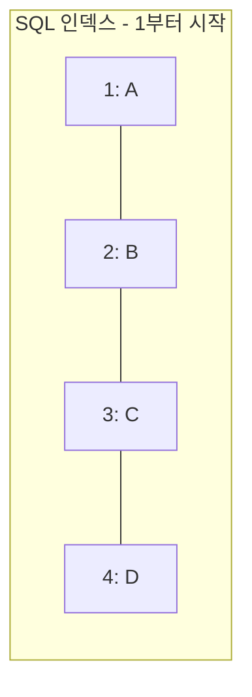

<Callout type="info">
  **이번 문서의 목표:** 이 파일을 다 읽으면 문자·숫자·날짜·변환 함수 각각을 실제 값으로 계산할 수 있고, CASE 식과 DECODE로 조건에 따라 다른 값을 반환하는 SQL을 직접 짤 수 있다.
</Callout>

## 단일행 함수란 무엇인가

**단일행 함수(single-row function)** 는 입력으로 받은 값 **한 개**에 대해 결과값 **한 개**를 돌려주는 함수다. 100개 행이 있는 테이블에 단일행 함수를 적용하면, 함수는 각 행마다 독립적으로 한 번씩 실행되어 결과도 100개 나온다. 이는 여러 행을 하나로 요약하는 **그룹 함수(group function)** 와 정반대되는 개념이다. 그룹 함수는 15편에서 본격적으로 다루는데, 예를 들어 `SUM(급여)`는 100개 행의 급여를 모두 더해 결과를 딱 1개만 낸다. "행 하나에 값 하나(단일행 함수)"와 "여러 행을 값 하나로 요약(그룹 함수)"이라는 대비를 기억해 두면 이후 함수를 배울 때마다 어느 쪽인지 헷갈리지 않는다.

> **쉽게 말하면:** 단일행 함수는 각 행에 붙어서 그 행의 값을 가공해 돌려주는 함수다. 100행이 들어가면 100개의 결과가 나온다.

이번 편에서는 문자 함수, 숫자 함수, 날짜 함수, 형변환 함수 네 가지 범주와 조건부 값을 만드는 CASE·DECODE를 다룬다. 모든 예제는 오라클(Oracle) SQL 문법 기준이며, MySQL과 다른 부분은 25편(DBMS별 문법 차이)에서 별도로 정리한다.

## 문자 함수

문자 함수는 문자열(글자들의 나열)을 자르고, 붙이고, 위치를 찾고, 길이를 재는 함수다.

### 문자열 인덱스는 1부터 시작한다

문자 함수를 배우기 전에 반드시 짚어야 할 규칙이 있다. 프로그래밍 언어(자바스크립트, 파이썬 등) 대부분은 문자열의 첫 글자 위치를 0으로 세는 **0부터 시작하는 인덱스(zero-based index)** 를 쓴다. 하지만 오라클 SQL의 문자 함수는 **첫 글자를 1번**으로 센다.



이 차이를 모르고 다른 언어의 습관대로 0을 넣으면 결과가 미묘하게 어긋난다. 예를 들어 `SUBSTR('ABCD', 0, 2)`는 얼핏 오류가 날 것 같지만, 오라클은 **0을 1과 똑같이 취급**해 첫 글자부터 시작한다. 즉 `SUBSTR('ABCD', 0, 2)`와 `SUBSTR('ABCD', 1, 2)`는 결과가 똑같이 `AB`다. 이는 SQLD 실행 결과 예측 문제에서 자주 쓰이는 함정이므로 반드시 기억해 두자.

**자주 틀리는 점**: "SQL 문자 함수의 인덱스는 1부터 시작한다"를 "0을 넣으면 오류가 난다"로 잘못 확장해 외우는 경우가 많다. 실제로는 0을 넣어도 오류 없이 1과 동일하게 처리된다.

### SUBSTR: 문자열 일부 잘라내기

`SUBSTR(문자열, 시작위치, 길이)`는 문자열의 시작위치부터 길이만큼 잘라낸다. 길이를 생략하면 시작위치부터 끝까지 전부 가져온다.

| 함수 호출 | 결과 | 설명 |
|---|---|---|
| `SUBSTR('ABCDEFGH', 1, 3)` | `ABC` | 1번째 글자부터 3글자 |
| `SUBSTR('ABCDEFGH', 7)` | `GH` | 7번째 글자부터 끝까지(길이 생략) |
| `SUBSTR('ABCDEFGH', -2)` | `GH` | 뒤에서 2번째 글자부터 끝까지 |
| `SUBSTR('ABCDEFGH', 8, -2)` | 빈 문자열 | 시작위치는 8(마지막 글자)인데 길이가 음수라 왼쪽으로 갈 방향이 없어 아무것도 못 자름 |
| `SUBSTR('ABCDEFGH', INSTR('ABCDEFGH', 'G'), 2)` | `GH` | INSTR로 찾은 G의 위치(7)부터 2글자 |

**시작위치가 음수**면 문자열의 **끝에서부터** 센다. `-1`은 마지막 글자, `-2`는 마지막에서 두 번째 글자를 가리킨다. 반면 **길이(세 번째 인자)가 음수**이면 잘라낼 방향 자체가 존재하지 않아 결과가 빈 문자열이 된다(길이는 항상 시작위치에서 오른쪽으로 나아가는 글자 수이기 때문이다). 위 표의 마지막 두 행처럼 `SUBSTR('ABCDEFGH', 7)`, `SUBSTR('ABCDEFGH', -2)`, `SUBSTR('ABCDEFGH', INSTR('ABCDEFGH', 'G'), 2)`는 모두 결과가 `GH`로 같지만, `SUBSTR('ABCDEFGH', 8, -2)`만 빈 문자열이 되어 나머지 셋과 다르다는 것이 실제 SQLD 기출에 나온 실행 결과 예측 문제의 핵심이다.

### 그 외 자주 쓰는 문자 함수

| 함수 | 입력 | 결과 | 설명 |
|---|---|---|---|
| `LENGTH('ABCDE')` | `ABCDE` | `5` | 문자열 길이(글자 수) |
| `UPPER('abc')` | `abc` | `ABC` | 대문자로 변환 |
| `LOWER('ABC')` | `ABC` | `abc` | 소문자로 변환 |
| `LPAD('5', 3, '0')` | `5` | `005` | 왼쪽을 지정한 문자로 채워 전체 길이를 맞춤 |
| `RPAD('5', 3, '0')` | `5` | `500` | 오른쪽을 지정한 문자로 채워 전체 길이를 맞춤 |
| `TRIM(' AB ')` | ` AB ` | `AB` | 양쪽 공백(또는 지정 문자) 제거 |
| `INSTR('ABCABC', 'C')` | `ABCABC` | `3` | 찾는 문자열이 처음 나오는 위치(1부터 셈) |
| `CONCAT('AB', 'CD')` | `AB`, `CD` | `ABCD` | 두 문자열 이어붙이기(`｜｜` 연산자와 동일한 역할) |

**자주 틀리는 점**: `LPAD`와 `RPAD`를 헷갈려 방향을 반대로 외우는 경우가 많다. L은 Left(왼쪽), R은 Right(오른쪽)의 약자이며, 이는 **채우는 문자를 어느 쪽에 붙이는지**를 가리킨다. 자릿수를 맞춘 코드 생성(예: 사원번호 `005`처럼 앞을 0으로 채우기)에는 LPAD를 쓴다.

## 숫자 함수

숫자 함수는 반올림, 버림, 나머지 계산처럼 수치를 가공한다.

| 함수 | 입력 | 결과 | 설명 |
|---|---|---|---|
| `ROUND(1234.567, 2)` | `1234.567` | `1234.57` | 소수점 2번째 자리까지 반올림 |
| `ROUND(1234.567, -2)` | `1234.567` | `1200` | 정수부 백의 자리 기준으로 반올림(자릿수가 음수면 소수점 왼쪽) |
| `TRUNC(1234.567, 2)` | `1234.567` | `1234.56` | 소수점 2번째 자리 아래를 버림(반올림 없음) |
| `MOD(10, 3)` | `10`, `3` | `1` | 10을 3으로 나눈 나머지 |
| `CEIL(4.1)` | `4.1` | `5` | 올림(소수점이 있으면 무조건 큰 정수로) |
| `FLOOR(4.9)` | `4.9` | `4` | 내림(소수점을 무조건 버려 작은 정수로) |
| `ABS(-7)` | `-7` | `7` | 절댓값 |

**자주 틀리는 점**: `ROUND`와 `TRUNC`를 같은 함수로 착각하는 경우가 많다. 두 함수 모두 "소수점 몇 번째 자리까지 남길지"를 두 번째 인자로 받는다는 점은 같지만, `ROUND`는 반올림하고 `TRUNC`는 그 아래 자리를 **그냥 잘라 버린다**(반올림 없음). `ROUND(1234.567, 2)`는 셋째 자리(7)를 반올림해 `1234.57`이 되지만, `TRUNC(1234.567, 2)`는 셋째 자리 이하를 그냥 버려 `1234.56`이 된다.

## 날짜 함수

날짜 함수는 오라클의 `DATE` 자료형(연·월·일·시·분·초를 통째로 담는 값)을 계산한다.

| 함수/연산 | 입력 | 결과 | 설명 |
|---|---|---|---|
| `SYSDATE` | (없음) | 현재 날짜와 시각 | 데이터베이스 서버가 인식하는 현재 시각 |
| `날짜 + 숫자` | `2026-01-01` + `5` | `2026-01-06` | 날짜에 숫자를 더하면 그만큼의 "일(day)" 수가 더해짐 |
| `날짜1 - 날짜2` | `2026-01-10` - `2026-01-01` | `9` | 날짜끼리 빼면 그 사이의 일수(정수)가 나옴 |
| `MONTHS_BETWEEN(날짜1, 날짜2)` | `2026-03-01`, `2026-01-01` | `2` | 두 날짜 사이의 개월 수 |
| `ADD_MONTHS(날짜, 개월수)` | `2026-01-31`, `1` | `2026-02-28` | 날짜에 개월 수를 더함(말일 보정 포함) |
| `TRUNC(날짜)` | `2026-01-15 18:30:00` | `2026-01-15 00:00:00` | 시·분·초를 제거(날짜의 일 단위는 그대로 유지) |
| `LAST_DAY(날짜)` | `2026-02-10` | `2026-02-28` | 그 달의 마지막 날짜 |

**자주 틀리는 점 1: 날짜 연산 결과의 단위**. `날짜 + 숫자`에서 더해지는 숫자의 단위는 항상 **일(day)** 이다. 시간 단위(시·분)를 더하고 싶으면 숫자를 24(하루의 시간 수)나 1440(하루의 분 수)으로 나눠서 표현해야 한다(예: 1시간 뒤는 `날짜 + 1/24`). 반대로 `날짜1 - 날짜2`처럼 날짜끼리 빼면 결과는 그 사이의 **일수를 나타내는 순수한 숫자**가 된다. 이 둘의 방향(숫자를 더하면 날짜가 나오고, 날짜를 빼면 숫자가 나온다)을 혼동하는 문제가 자주 나온다.

**자주 틀리는 점 2: TRUNC(날짜)는 시간만 지우지, 날짜를 지우지 않는다**. `TRUNC(SYSDATE)`는 시·분·초를 00:00:00으로 만들 뿐, 연·월·일은 그대로 유지한다. "이번 달 전체"를 조건으로 걸 때 `TRUNC(결제일시) = TO_DATE('2025-12', 'YYYY-MM')`처럼 잘못 쓰면, `TO_DATE`가 일(日)이 빠진 값을 자동으로 **그 달 1일**로 보정하기 때문에 실제로는 12월 1일 하루치 데이터만 걸러진다. 이는 SQLD 기출에 실제로 나온 함정으로, 월 전체를 조건으로 걸려면 `TO_CHAR(결제일시, 'YYYYMM') = '202512'`처럼 문자열로 월을 비교하거나, `결제일시 >= TO_DATE('20251201','YYYYMMDD') AND 결제일시 < TO_DATE('20260101','YYYYMMDD')`처럼 범위로 조건을 걸어야 한다.

## 변환 함수: TO_CHAR, TO_DATE, TO_NUMBER

오라클은 문자열, 숫자, 날짜라는 서로 다른 자료형(data type, 값의 종류를 구분하는 분류) 사이를 오갈 때 명시적인 변환 함수를 쓰도록 권장한다. 세 함수의 이름 구조는 모두 "TO_(변환하려는 목표 자료형)"으로 동일하다.


| 함수 | 입력 | 결과 | 설명 |
|---|---|---|---|
| `TO_CHAR(1234567, 'FM999,999,999')` | `1234567` | `1,234,567` | 숫자를 천 단위 구분 기호가 있는 문자열로 |
| `TO_CHAR(SYSDATE, 'YYYY-MM-DD')` | `2026-09-06 10:00:00` | `2026-09-06` | 날짜를 원하는 형식의 문자열로 |
| `TO_DATE('20260906', 'YYYYMMDD')` | `20260906` | `2026-09-06` (날짜형) | 문자열을 날짜형으로 |
| `TO_NUMBER('1,234', '999,999')` | `1,234` | `1234` (숫자형) | 구분 기호가 섞인 문자열을 숫자형으로 |

**자주 틀리는 점**: `TO_DATE('2025-12', 'YYYY-MM')`처럼 일(日) 정보를 생략하고 문자열을 날짜로 바꾸면, 오라클은 빠진 일 자리를 **자동으로 1일로 채운다**. 즉 결과는 `2025-12-01 00:00:00`이 된다. 이 보정 규칙을 모르면 "이번 달 전체"를 조회하려다 1일 하루치만 조회하는 실수를 하게 된다(위 날짜 함수 절의 함정과 같은 원리다).

또한 `TO_NUMBER('ABC')`처럼 숫자로 바꿀 수 없는 문자열을 변환하려 하면 **오류(에러)** 가 발생한다. `TO_NUMBER`는 문자열이 숫자로 해석 가능할 때만 성공하며, 문자가 섞인 진짜 텍스트는 변환할 수 없다.

## CASE 식과 DECODE: 조건에 따라 다른 값 반환하기

지금까지의 함수는 입력값 하나를 정해진 규칙대로 가공했다. 하지만 "조건에 따라 다른 값을 보여주고 싶다"는 요구는 함수 하나로 해결되지 않는다. 이때 쓰는 것이 **CASE 식**과 **DECODE 함수**다. 둘 다 "여러 조건을 검사해 처음 맞는 조건의 결과를 반환한다"는 점에서 사실상 같은 역할을 한다.

> **쉽게 말하면:** 프로그래밍 언어의 if-else if-else를 SQL 문장 안에서 쓰는 방법이다.

### CASE 식: 두 가지 형태

```sql
-- 형태 1: 값 자체를 비교(단순 CASE)
SELECT 사원명,
       CASE 부서
           WHEN '영업' THEN '매출 부서'
           WHEN '홍보' THEN '매출 부서'
           ELSE '지원 부서'
       END AS 부서구분
FROM 사원;

-- 형태 2: 조건식을 직접 씀(검색 CASE, 범위·부등호 비교 가능)
SELECT 사원명,
       CASE
           WHEN 연봉 >= 5000 THEN '고액'
           WHEN 연봉 >= 3000 THEN '중간'
           ELSE '저액'
       END AS 연봉등급
FROM 사원;
```

**자주 틀리는 점**: 단순 CASE(형태 1)는 `WHEN` 뒤에 **정확히 일치하는 값**만 쓸 수 있어 `WHEN NULL THEN ...`처럼 써도 절대 일치하지 않는다(13편에서 다룬 대로 NULL은 `=`으로 비교할 수 없는 특수한 상태이기 때문에, CASE의 내부 비교 역시 이 규칙을 그대로 따른다). NULL을 조건으로 검사하려면 반드시 검색 CASE(형태 2)를 써서 `WHEN 컬럼 IS NULL THEN ...`처럼 표현해야 한다.

### DECODE: 오라클 전용 조건 함수

`DECODE(대상, 비교값1, 결과1, 비교값2, 결과2, ..., 기본값)`은 단순 CASE와 정확히 같은 일을 하는 오라클 전용 함수다. 표준 SQL이 아니라 오라클에서만 동작하므로, MySQL로 옮길 때는 CASE로 바꿔야 한다(25편 참고).

| 함수 호출 | 결과 | 설명 |
|---|---|---|
| `DECODE(부서, '영업', '매출 부서', '홍보', '매출 부서', '지원 부서')` | `'매출 부서'` (부서가 영업일 때) | 단순 CASE와 완전히 동일한 결과 |
| `DECODE(보너스, NULL, -1, 0)` | `보너스`가 `NULL`일 때 | `-1` |

**자주 틀리는 점**: 여기서 `DECODE(보너스, NULL, -1, 0)`은 CASE와 달리 **NULL을 직접 비교값으로 써도 정상적으로 NULL을 감지**한다. 이는 DECODE 함수 내부에서만 예외적으로 적용되는 동작으로, 일반적인 `=` 비교나 단순 CASE의 `WHEN NULL`과는 다르게 취급된다는 점이 SQLD에서 "칼럼 값이 NULL일 때 반환 결과가 다른 것을 고르라"는 형태로 자주 출제된다. 즉 `CASE 칼럼 WHEN NULL THEN -1 ELSE 0 END`(단순 CASE, NULL 절대 매칭 안 됨)와 `DECODE(칼럼, NULL, -1, 0)`(정상적으로 NULL 매칭됨)은 겉보기에 똑같아 보여도 결과가 다르다.

## 핵심 정리

- 오라클 문자 함수의 인덱스는 1부터 시작하며, 0은 1과 동일하게 처리된다.
- `SUBSTR`은 시작위치가 음수면 끝에서부터 세고, 길이가 음수면 빈 문자열을 반환한다.
- `ROUND`는 반올림하고 `TRUNC`는 그 아래 자리를 버린다(반올림 없음).
- 날짜에 숫자를 더하면 "일" 단위로 날짜가 이동하고, 날짜끼리 빼면 그 사이의 일수(숫자)가 나온다.
- `TRUNC(날짜)`는 시·분·초만 지우고, `TO_DATE`에서 일을 생략하면 자동으로 1일이 된다. 둘을 혼동하면 "이번 달 전체"를 잘못 조회하게 된다.
- 단순 CASE와 DECODE는 `WHEN NULL`로 NULL을 비교해도 매칭되지 않지만, DECODE는 예외적으로 NULL 비교값을 정상 인식한다.

## 마무리 복습

<Quiz
  questionNumber={1}
  question="SUBSTR('ABCDEFGH', 8, -2)의 실행 결과로 옳은 것은?"
  options={['GH', 'FG', '빈 문자열', 'ABCDEFGH']}
  correctAnswer={3}
  explanation="시작위치 8은 문자열의 마지막 글자(H)를 가리킨다. 그런데 세 번째 인자인 길이가 -2로 음수이면, SUBSTR은 시작위치에서 오른쪽으로 나아갈 글자가 없어 잘라낼 방향 자체가 성립하지 않으므로 빈 문자열을 반환한다."
  optionExplanations={['시작위치가 7일 때(INSTR로 G를 찾은 경우)나 -2일 때 나오는 결과이지, 시작위치 8에 길이 -2를 준 경우와는 다르다.', '이런 결과가 나오려면 시작위치와 길이 조합이 달라야 한다. 8에서 -2 방향으로는 글자를 잘라낼 수 없다.', '정답이다. 길이가 음수이면 시작위치 기준으로 잘라낼 방향이 없어 빈 문자열이 된다.', '전체 문자열이 그대로 나오려면 길이를 생략하거나 충분히 큰 양수를 줘야 하는데, 이 경우는 길이가 음수라 해당하지 않는다.']}
/>

<Quiz
  questionNumber={2}
  question="ROUND(1234.567, 2)와 TRUNC(1234.567, 2)의 결과를 각각 순서대로 나열한 것은?"
  options={['1234.56, 1234.56', '1234.57, 1234.57', '1234.57, 1234.56', '1234.56, 1234.57']}
  correctAnswer={3}
  explanation="ROUND는 지정한 자리 다음 숫자를 보고 반올림한다. 소수점 셋째 자리가 7이므로 둘째 자리가 6에서 7로 올라가 1234.57이 된다. TRUNC는 반올림 없이 지정한 자리 아래를 그냥 버리므로 1234.56이 된다."
  optionExplanations={['ROUND는 반올림을 하므로 셋째 자리 7 때문에 둘째 자리가 올라가 1234.56이 아니라 1234.57이 되어야 한다.', 'TRUNC는 반올림하지 않고 그냥 버리므로 1234.57이 아니라 1234.56이 되어야 한다.', '정답이다. ROUND는 반올림해 1234.57, TRUNC는 버림하여 1234.56이 된다.', 'ROUND와 TRUNC의 결과가 서로 뒤바뀌었다. ROUND가 1234.57, TRUNC가 1234.56이 되어야 한다.']}
/>

<Quiz
  questionNumber={3}
  question="TO_DATE('2025-12', 'YYYY-MM')의 실행 결과로 가장 적절한 것은?"
  options={['2025-12-01 00:00:00', '2025-12-31 00:00:00', '2025-12-01 23:59:59', '오류가 발생한다']}
  correctAnswer={1}
  explanation="TO_DATE로 문자열을 날짜로 바꿀 때 일(日) 정보가 형식에 없으면, 오라클은 빠진 일 자리를 자동으로 1일로 채운다. 따라서 결과는 2025년 12월 1일 자정(00:00:00)이 된다."
  optionExplanations={['정답이다. 일 정보가 없으면 자동으로 1일로 보정되어 시각도 00:00:00이 된다.', "일 자리가 자동으로 그 달의 마지막 날(31일)로 채워진다는 규칙은 없다. 오라클은 항상 1일로 보정한다.", '시각이 23:59:59로 보정된다는 규칙도 없다. 시·분·초가 없으면 00:00:00으로 보정된다.', '형식 문자열(YYYY-MM)에 없는 일 자리는 자동으로 보정되므로 오류 없이 정상적으로 날짜값이 만들어진다.']}
/>

<Quiz
  questionNumber={4}
  question="결제일시 컬럼(DATE형)을 기준으로 2025년 12월 전체 데이터를 정확히 걸러내는 조건으로 옳은 것은?"
  options={["TRUNC(결제일시) = TO_DATE('2025-12', 'YYYY-MM')", "TO_CHAR(결제일시, 'YYYYMM') = '202512'", "결제일시 = '2025-12'", "SUBSTR(결제일시, 1, 7) = '2025-12'"]}
  correctAnswer={2}
  explanation="TO_CHAR로 날짜를 YYYYMM 형식의 문자열로 바꾼 뒤 202512와 비교하면, 12월에 속하는 모든 날짜(1일부터 31일까지)가 정확히 매칭된다."
  optionExplanations={["TRUNC는 시·분·초만 제거할 뿐 일(日)은 그대로 유지하고, TO_DATE는 일이 없으면 1일로 보정하므로 이 조건은 12월 1일 데이터만 매칭해 12월 전체를 놓친다.", '정답이다. YYYYMM 형식 문자열 비교는 월 단위 전체를 정확히 매칭하는 표준적인 방법이다.', 'DATE형 컬럼을 문자열과 직접 등호 비교하면 형 변환 과정에서 의도한 대로 매칭되지 않거나 오류가 발생할 수 있어 안전하지 않다.', 'DATE형 컬럼에는 문자 함수인 SUBSTR을 바로 적용할 수 없어 별도의 TO_CHAR 변환 없이는 의도한 비교가 되지 않는다.']}
/>

<Quiz
  questionNumber={5}
  question="칼럼 값이 NULL일 때, 다음 중 반환 결과가 나머지 셋과 다른 것은?"
  options={["CASE 칼럼 WHEN NULL THEN -1 ELSE 0 END", "CASE WHEN 칼럼 IS NULL THEN -1 ELSE 0 END", "DECODE(칼럼, NULL, -1, 0)", "NVL2(칼럼, 0, -1)"]}
  correctAnswer={1}
  explanation="단순 CASE 식은 WHEN 뒤에 오는 값과 등호로 비교하는데, NULL은 등호로 비교할 수 없는 특수한 상태라 WHEN NULL은 절대 일치하지 않는다. 따라서 항상 ELSE 절인 0이 반환된다. 반면 나머지 셋은 모두 -1을 반환하도록 설계되어 있어 이 문항만 결과가 다르다."
  optionExplanations={['정답이다. 단순 CASE의 WHEN NULL은 절대 매칭되지 않아 항상 ELSE 값인 0이 반환되므로 나머지 셋과 다르다.', '검색 CASE는 IS NULL로 조건을 직접 검사하므로 칼럼이 NULL일 때 정상적으로 -1을 반환한다.', 'DECODE는 예외적으로 NULL을 비교값으로 인식하므로 칼럼이 NULL일 때 정상적으로 -1을 반환한다.', 'NVL2(칼럼, 0, -1)은 칼럼이 NULL이 아니면 0, NULL이면 -1을 반환하므로 칼럼이 NULL일 때 -1을 반환한다.']}
/>

<Quiz
  questionNumber={6}
  question="날짜 연산에 대한 설명으로 옳지 않은 것은?"
  options={['날짜에 숫자를 더하면 그 숫자만큼의 일수가 더해진 날짜가 된다', '날짜에서 날짜를 빼면 그 사이의 일수를 나타내는 숫자가 된다', 'TRUNC(SYSDATE)는 연·월·일 정보까지 모두 제거하고 시각만 남긴다', 'MONTHS_BETWEEN은 두 날짜 사이의 개월 수를 계산한다']}
  correctAnswer={3}
  explanation="TRUNC(날짜)는 시·분·초를 00:00:00으로 만들 뿐 연·월·일 정보는 그대로 유지한다. 날짜 정보까지 제거해 시각만 남긴다는 설명은 TRUNC의 동작과 정반대다."
  optionExplanations={['옳은 설명이다. 날짜에 더해지는 숫자의 단위는 항상 일(day)이다.', '옳은 설명이다. 날짜끼리 빼면 그 차이만큼의 일수를 나타내는 순수한 숫자가 나온다.', '정답(틀린 설명)이다. TRUNC(날짜)는 시·분·초만 제거하고 연·월·일은 그대로 유지하는데, 이 설명은 반대로 말하고 있다.', '옳은 설명이다. MONTHS_BETWEEN은 두 날짜 사이의 개월 수 차이를 계산하는 함수다.']}
/>

<Quiz
  questionNumber={7}
  question="LPAD('5', 3, '0')의 실행 결과로 옳은 것은?"
  options={['5', '005', '500', '050']}
  correctAnswer={2}
  explanation="LPAD는 Left Pad의 줄임말로, 문자열의 왼쪽에 지정한 문자를 채워 전체 길이를 맞춘다. 원래 문자열 5의 길이가 1이므로, 목표 길이 3을 맞추기 위해 왼쪽에 0을 2개 채워 005가 된다."
  optionExplanations={['LPAD는 길이를 3으로 맞추도록 문자를 채우는 함수이므로 원본 그대로인 5만 남지 않는다.', '정답이다. 왼쪽에 0을 채워 전체 길이 3을 맞추면 005가 된다.', '오른쪽에 채우는 것은 RPAD의 동작이다. LPAD는 왼쪽에 채운다.', '왼쪽과 오른쪽에 나눠 채우는 동작이 아니라, LPAD는 항상 왼쪽에만 지정한 문자를 채운다.']}
/>

<Quiz
  questionNumber={8}
  question="TO_NUMBER('ABC')를 실행하면 어떤 일이 일어나는가?"
  options={['0이 반환된다', 'NULL이 반환된다', '오류가 발생한다', "'ABC'가 그대로 반환된다"]}
  correctAnswer={3}
  explanation="TO_NUMBER는 문자열이 숫자로 해석 가능한 형태일 때만 변환에 성공한다. ABC처럼 숫자로 해석할 수 없는 문자가 섞인 문자열을 변환하려 하면 오류가 발생한다."
  optionExplanations={['숫자로 변환할 수 없는 문자열이 조용히 0으로 처리되는 것이 아니라 오류가 발생한다.', '변환 실패가 NULL로 조용히 처리되는 것이 아니라 오류가 발생한다.', '정답이다. 숫자로 해석할 수 없는 문자열을 TO_NUMBER에 넣으면 오류가 발생한다.', 'TO_NUMBER는 숫자형 값을 반환하는 함수이므로 원본 문자열을 그대로 돌려주는 동작은 하지 않는다.']}
/>

## 참고 자료

- [Oracle Database SQL Language Reference - Single-Row Functions](https://docs.oracle.com/en/database/oracle/oracle-database/19/sqlrf/Single-Row-Functions.html)
