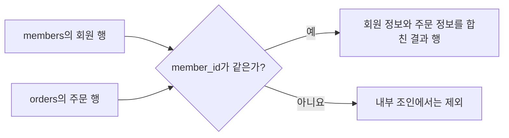

## 이번 편의 목표

- 조인이 필요한 이유를 테이블 분리와 연결 열의 관점에서 설명한다.
- 조인 조건을 만족하는 행의 조합을 직접 찾고 결과 행 수를 예측한다.
- 등가 조인, 비등가 조인, 내부 조인과 외부 조인의 차이를 구분한다.
- 조인 조건 누락으로 생기는 카테시안 곱을 진단한다.

## 먼저 알아둘 말

| 용어 | 쉬운 뜻 |
| --- | --- |
| 조인(Join) | 서로 다른 테이블의 관련 행을 한 결과 행으로 연결하는 작업 |
| 조인 조건 | 어떤 행끼리 짝지을지 정하는 비교식 |
| 등가 조인(Equi Join) | `=`로 같은 값을 연결하는 조인 |
| 비등가 조인(Non-Equi Join) | `<`, `BETWEEN`처럼 범위로 연결하는 조인 |
| 내부 조인(Inner Join) | 조건에 맞는 짝이 있는 행만 남기는 조인 |
| 외부 조인(Outer Join) | 짝이 없어도 기준 테이블의 행을 보존하는 조인 |
| 카테시안 곱 | 왼쪽 모든 행과 오른쪽 모든 행이 서로 한 번씩 만나는 결과 |

## 선수지식과 핵심 질문

선수지식은 [10. 관계와 조인의 이해](./10_relationship-and-join), [15. SELECT 문](./15_select-statement), [17. WHERE 절](./17_where-clause)이다.

이번 편의 질문은 하나다. **두 테이블을 함께 조회할 때 어떤 행끼리 연결되고, 연결되지 않은 행은 어떻게 되는가?**

## 왜 테이블을 다시 연결할까

주문 테이블에 회원 이름과 주소까지 매번 저장하면 같은 회원 정보가 주문마다 반복된다. 회원 이름을 한 번 바꿀 때 여러 주문 행을 모두 고쳐야 하는 문제도 생긴다. 그래서 회원 정보는 `members`, 주문 정보는 `orders`에 나눠 저장한다.

```text
members.member_id  1 ───── N  orders.member_id
      회원 한 명              주문 여러 건
```

분리하면 중복은 줄지만, 주문자 이름을 보고 싶을 때 두 테이블을 다시 연결해야 한다. 이 연결이 조인이다.



회원 행과 주문 행의 조합마다 조건을 검사하고, 조건이 참인 조합 하나가 결과 한 행이 된다.

### 입력 테이블

`members`

| member_id | name | city |
| --- | --- | --- |
| M01 | 민지 | 서울 |
| M02 | 준호 | 부산 |
| M03 | 소라 | 서울 |
| M04 | 현우 | 대구 |

`orders`

| order_id | member_id | status | total_amount |
| ---: | --- | --- | ---: |
| 1001 | M01 | PAID | 106000 |
| 1002 | M01 | SHIPPED | 30000 |
| 1003 | M02 | PAID | 250000 |
| 1004 | M03 | CANCELED | 70000 |
| 1005 | M03 | PAID | 50000 |

`orders.member_id`는 주문자를 나타내며 `members.member_id`를 참조한다.

## 조인은 행의 조합을 검사한다

다음 쿼리는 회원과 주문의 `member_id`가 같은 조합만 남긴다.

```sql
SELECT m.member_id, m.name, o.order_id, o.total_amount
FROM members m
JOIN orders o
  ON m.member_id = o.member_id;
```

별칭 `m`, `o`는 긴 테이블 이름을 짧게 부르는 이름이다. `m.member_id`처럼 점 앞에는 테이블 별칭, 점 뒤에는 열 이름을 쓴다.

### 연결 과정

| 회원 행 | 비교한 주문 | 조건 결과 | 출력 여부 |
| --- | --- | --- | --- |
| M01 민지 | 1001의 M01 | 참 | 출력 |
| M01 민지 | 1002의 M01 | 참 | 출력 |
| M01 민지 | 1003의 M02 | 거짓 | 제외 |
| M04 현우 | 모든 주문 | 모두 거짓 | 내부 조인에서는 제외 |

### 실행 결과

| member_id | name | order_id | total_amount |
| --- | --- | ---: | ---: |
| M01 | 민지 | 1001 | 106000 |
| M01 | 민지 | 1002 | 30000 |
| M02 | 준호 | 1003 | 250000 |
| M03 | 소라 | 1004 | 70000 |
| M03 | 소라 | 1005 | 50000 |

민지는 주문이 두 건이므로 결과에도 두 행이 나온다. 현우는 주문이 없어서 내부 조인 결과에 없다.

<Callout type="info">
  조인은 테이블을 옆으로 한 번만 붙이는 작업이 아니다. 조건을 만족하는 **행의 조합 하나마다 결과 한 행**이 생긴다.
</Callout>

## 조인 결과 행 수 예측하기

일대다 관계에서 부모 한 행은 자식 여러 행과 연결될 수 있다.

| 회원 | 연결된 주문 수 | 내부 조인 결과 행 수 |
| --- | ---: | ---: |
| M01 | 2 | 2 |
| M02 | 1 | 1 |
| M03 | 2 | 2 |
| M04 | 0 | 0 |
| 합계 | 5 | 5 |

조인한 뒤 회원 수인 4행이 나올 것이라고 생각하면 안 된다. 결과의 중심이 회원인지 주문인지, 관계가 일대일인지 일대다인지 먼저 본다.

## 등가 조인과 비등가 조인

### 등가 조인

식별자와 외래키처럼 같은 값을 `=`로 연결한다. 업무 조인의 대부분이 이 형태다.

```sql
ON m.member_id = o.member_id
```

### 비등가 조인

값이 어느 범위에 속하는지로 연결할 때 사용한다. 다음은 포인트에 맞는 등급을 찾는 표다.

`grade_ranges`

| grade | min_points | max_points |
| --- | ---: | ---: |
| BRONZE | 0 | 499 |
| SILVER | 500 | 999 |
| GOLD | 1000 | 999999 |

```sql
SELECT m.name, m.points, g.grade
FROM members m
JOIN grade_ranges g
  ON m.points BETWEEN g.min_points AND g.max_points;
```

| name | points | grade |
| --- | ---: | --- |
| 민지 | 1200 | GOLD |
| 준호 | 500 | SILVER |
| 소라 | 800 | SILVER |
| 현우 | 0 | BRONZE |

범위가 겹치면 한 회원이 여러 등급 행과 연결될 수 있다. 비등가 조인에서는 범위의 누락과 중복도 데이터 품질 문제다.

## 내부 조인과 외부 조인의 핵심 차이

| 구분 | 짝이 있는 행 | 짝이 없는 현우 |
| --- | --- | --- |
| 내부 조인 | 출력 | 제외 |
| 회원 기준 왼쪽 외부 조인 | 출력 | `NULL`을 채워 출력 |

```sql
SELECT m.name, o.order_id
FROM members m
LEFT JOIN orders o
  ON m.member_id = o.member_id;
```

마지막 결과에는 `현우 | NULL`이 추가된다. `NULL`은 주문 번호가 0이라는 뜻이 아니라 연결된 주문 행이 없다는 뜻이다. 외부 조인의 자세한 문법은 다음 편에서 다룬다.

## 조인 조건이 없으면 어떻게 될까

회원 4행과 주문 5행을 조건 없이 함께 조회하면 가능한 모든 조합인 `4 × 5 = 20행`이 생긴다.

```sql
SELECT m.name, o.order_id
FROM members m
CROSS JOIN orders o;
```

의도한 경우에는 `CROSS JOIN`이라고 명시한다. 실수로 `ON` 조건을 빠뜨려 20행이 나온다면 카테시안 곱을 의심한다.

<Callout type="warning">
  예상보다 행 수가 갑자기 커지면 먼저 조인 조건 누락, 한쪽 키의 중복, 다대다 연결을 확인한다.
</Callout>

## 시험에서는 어떻게 묻나

1. 테이블별 행 수와 조인 조건을 주고 결과 행 수를 묻는다.
2. 내부 조인에서 짝이 없는 행이 사라지는 이유를 묻는다.
3. `=` 조인과 범위 조인을 구분하게 한다.
4. 조인 조건을 빠뜨렸을 때 `N × M`행이 생긴다는 점을 묻는다.

## 짧은 확인

회원 3행, 주문 6행이 있고 모든 주문이 정확히 한 회원을 참조한다. 내부 조인 결과는 몇 행일까?

<Collapse title="확인하기">

6행이다. 주문 한 건마다 참조하는 회원 한 명과 연결되어 결과 한 행을 만든다. 회원 중 주문이 없는 사람이 있어도 주문 6건의 연결은 달라지지 않는다.

</Collapse>

## 흔한 실수와 진단법

| 증상 | 가능한 원인 | 확인 방법 |
| --- | --- | --- |
| 열 이름이 모호하다는 오류 | 양쪽에 같은 이름의 열이 있음 | `m.member_id`처럼 별칭을 붙인다. |
| 행이 예상보다 많음 | 조건 누락 또는 연결 열 중복 | 각 연결 열을 `GROUP BY`해 중복 수를 센다. |
| 행이 예상보다 적음 | 내부 조인이 짝 없는 행을 제거 | 외부 조인으로 바꾸고 `NULL` 행을 확인한다. |
| 범위 조인 결과가 중복 | 범위가 서로 겹침 | 최소·최대 경계를 나란히 정렬해 본다. |

## 다음 단계: 복습

[21-복습. 조인](./21_joins-review)에서 실제 행 조합과 결과 행 수를 직접 계산하자.

## 정리

<Callout type="default">
  - 조인은 조건을 만족하는 행의 조합마다 결과 한 행을 만든다.
  - 등가 조인은 같은 값, 비등가 조인은 범위 같은 조건으로 연결한다.
  - 내부 조인은 짝 없는 행을 버리고 외부 조인은 기준 행을 보존한다.
  - 조건 없는 두 테이블은 행 수를 곱한 카테시안 곱을 만든다.
</Callout>

다음 편에서는 `INNER`, `LEFT`, `RIGHT`, `FULL`, `ON`, `USING` 등 표준 조인 문법을 비교한다.

## 참고 자료

- [PostgreSQL - Table Expressions and Joined Tables](https://www.postgresql.org/docs/current/queries-table-expressions.html#QUERIES-JOIN)
- [Oracle Database - Joins](https://docs.oracle.com/en/database/oracle/oracle-database/21/sqlrf/Joins.html)
- [PostgreSQL - SELECT](https://www.postgresql.org/docs/current/sql-select.html)
