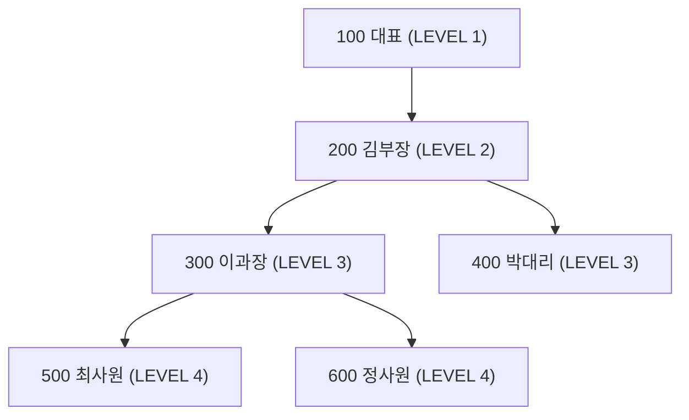

<Callout type="info">
  **이번 문서의 목표:** 이 파일을 다 읽으면 ROWNUM이 왜 원하는 결과를 주지 않는지 원리부터 설명하고, 인라인뷰(inline view)로 상위 N개를 안전하게 뽑아내며, CONNECT BY로 조직도 같은 계층 구조를 조회할 수 있다.
</Callout>

## 왜 필요한가: "상위 5명만 보여줘"라는 아주 흔한 요구

실무에서 가장 자주 나오는 요청 중 하나가 "매출 상위 5개 상품만", "급여 1등부터 3등까지만" 같은 상위 N개(Top N) 추출이다. 15편에서 배운 `ORDER BY`는 전체 결과를 정렬만 할 뿐, "몇 개까지만 보여줄지"는 별도로 지정해야 한다. Oracle은 이 역할을 오랫동안 **ROWNUM**이라는 특수한 컬럼에 맡겨 왔는데, 이 ROWNUM의 동작 방식을 정확히 모르면 시험에서도 실무에서도 똑같은 함정에 빠진다.

> **쉽게 말하면:** Top N은 "정렬해서 앞에서부터 몇 개 자르기"인데, ROWNUM은 "자르는 도중에 번호표를 나눠주는 방식"이라 정렬보다 먼저 번호가 매겨지면 원하는 순서와 어긋난다.

## ROWNUM이란 무엇인가

**ROWNUM**은 Oracle이 쿼리 결과의 각 행에 자동으로 부여하는 의사(pseudo) 컬럼이다. 의사 컬럼이란 실제 테이블에 저장된 값이 아니라, 데이터베이스가 조회 시점에 계산해서 마치 컬럼처럼 보여주는 값을 뜻한다. ROWNUM은 테이블을 만들 때 지정하는 것이 아니라, `SELECT` 문이 행을 하나씩 뽑아낼 때마다 1, 2, 3, ... 순서로 자동 부여된다.

여기서 가장 중요한 사실 하나를 짚어야 한다. **ROWNUM은 결과 집합이 "완성된 뒤"에 매겨지는 번호가 아니라, 행을 하나씩 뽑아 결과에 담는 "그 순간"에 매겨지는 번호**다. 즉 정렬(`ORDER BY`)이 끝난 다음에 붙는 꼬리표가 아니라, 원본 테이블을 훑으며 조건을 통과한 행이 결과 버퍼에 담기는 시점에 실시간으로 부여된다.

## ROWNUM의 함정: 왜 `WHERE ROWNUM = 2`는 항상 0건인가

여기서부터가 시험 단골 함정이다. 아래 사원 테이블 5행을 예로 들어보자.

| 사원번호 | 이름 | 급여 |
|----------|------|------|
| 101 | 김민준 | 3000 |
| 102 | 이서연 | 5000 |
| 103 | 박도윤 | 4000 |
| 104 | 최지우 | 2000 |
| 105 | 정하늘 | 4500 |

`SELECT * FROM 사원 WHERE ROWNUM = 2;`를 실행하면 어떻게 될까. 언뜻 "두 번째 행이 나오겠지"라고 생각하기 쉽지만, 결과는 **0건**이다. 이 결과를 이해하려면 데이터베이스가 이 쿼리를 처리하는 순서를 단계별로 따라가야 한다.

<Steps>

### 1단계: 원본 테이블에서 첫 번째 행을 가져온다

101번 김민준 행이 후보로 올라온다. 이 시점에 이 행에는 아직 ROWNUM이 없다. ROWNUM은 `WHERE` 조건을 통과해서 결과 집합에 "포함되기로 확정되는 순간"에 비로소 부여된다.

### 2단계: 이 행에 ROWNUM = 1을 부여하고 조건을 검사한다

김민준 행이 조건 검사 대상이 되는 순간 ROWNUM에 1이 할당된다. 조건은 `ROWNUM = 2`이므로 `1 = 2`는 거짓이다. 이 행은 탈락한다.

### 3단계: 두 번째 행으로 넘어간다

102번 이서연 행이 후보로 올라온다. 그런데 여기서 결정적인 규칙이 작동한다. **ROWNUM은 이전 행이 조건을 통과해 결과에 포함된 경우에만 다음 번호로 증가한다.** 방금 김민준 행이 조건을 통과하지 못해 탈락했으므로, ROWNUM 카운터는 2로 올라가지 않고 다시 1부터 시작한다.

### 4단계: 이서연 행에도 ROWNUM = 1이 부여된다

`1 = 2`는 또 거짓이므로 이서연도 탈락한다.

### 5단계: 남은 모든 행도 똑같이 반복된다

103번, 104번, 105번 모두 결과 집합에 포함되는 순간마다 ROWNUM이 1부터 다시 매겨지므로, 어떤 행도 ROWNUM이 2가 될 기회를 얻지 못한다. 최종 결과는 0건이다.

</Steps>

같은 원리로 `WHERE ROWNUM > 1`도 항상 0건이다. 첫 번째로 검사되는 행은 무조건 ROWNUM 1을 받는데, 조건이 `1 > 1`이라 거짓이 되어 탈락한다. 그러면 다음 행 역시 "이전 행이 통과하지 못했으므로" 다시 1을 받아 똑같이 탈락한다. 결국 어떤 행도 2 이상의 ROWNUM을 받을 수 없다. 이 규칙은 시험에서 "ROWNUM은 조건을 통과한 행에만 순차 부여되며, 통과하지 못하면 번호가 증가하지 않는다"는 문장으로 자주 등장한다.

반대로 `WHERE ROWNUM <= 3`이나 `WHERE ROWNUM < 4`는 정상적으로 동작한다. 첫 행이 `1 <= 3`을 통과하고, 둘째 행이 `2 <= 3`을 통과하는 식으로 조건이 순차적으로 계속 참이 되기 때문에 번호가 끊기지 않고 1, 2, 3까지 순서대로 부여된다. 즉 ROWNUM은 **1부터 끊기지 않고 이어지는 상한 조건**(`<=`, `<`)에서만 의도한 대로 동작하고, 특정 값과의 등호 비교나 하한 조건에서는 항상 실패한다.

> **자주 틀리는 점:** "ROWNUM은 각 행이 원래 가지고 있던 순번"이라고 오해하면 이 함정에 빠진다. ROWNUM은 저장된 값이 아니라 조건 검사와 동시에 실시간으로 매겨지는 번호이며, 탈락한 행 다음에는 번호가 다시 1로 리셋된다는 점을 반드시 기억해야 한다.

## Top N을 구하려면 왜 인라인뷰로 감싸야 하는가

이번에는 "급여가 가장 높은 상위 3명"을 뽑는다고 해보자. 직관적으로 이렇게 쓰고 싶어진다.

```sql
SELECT * FROM 사원 WHERE ROWNUM <= 3 ORDER BY 급여 DESC;
```

이 쿼리는 문법적으로는 실행되지만 원하는 결과를 주지 않는다. 이유는 SQL의 논리적 실행 순서에 있다. 13편에서 다뤘듯 `WHERE`는 `ORDER BY`보다 먼저 처리된다. 즉 위 쿼리는 "원본 테이블에서 아무 순서로나 앞의 3행을 먼저 뽑은 다음, 그 3행만 급여 기준으로 정렬"하는 것이다. 정렬되지 않은 원본 순서에서 앞 3개를 뽑았으니, 그 3명이 실제로 급여 1~3위라는 보장이 전혀 없다.

이 문제를 해결하는 방법이 **인라인뷰**(inline view)다. 인라인뷰란 `FROM` 절 안에 `SELECT` 문 자체를 괄호로 감싸 마치 하나의 테이블처럼 사용하는 서브쿼리를 말한다(17편의 서브쿼리 개념과 같은 뿌리이며, `FROM` 절에 놓인 서브쿼리를 특별히 인라인뷰라 부른다). 정렬을 먼저 끝낸 결과를 인라인뷰로 만들어 놓고, 그 바깥에서 `ROWNUM` 조건을 걸면 순서가 뒤바뀌지 않는다.

```sql
SELECT *
FROM (
  SELECT * FROM 사원 ORDER BY 급여 DESC
)
WHERE ROWNUM <= 3;
```

이 쿼리의 처리 순서는 다음과 같다.

<Steps>

### 1단계: 괄호 안의 서브쿼리(인라인뷰)가 먼저 완전히 실행된다

`사원` 테이블 전체가 급여 내림차순으로 정렬된 결과 집합이 만들어진다. 이서연(5000), 정하늘(4500), 박도윤(4000), 김민준(3000), 최지우(2000) 순서다.

### 2단계: 바깥 쿼리가 이 정렬된 결과를 대상으로 ROWNUM을 부여한다

이제는 이미 정렬이 끝난 상태이므로, 첫 행(이서연)이 ROWNUM 1, 둘째 행(정하늘)이 ROWNUM 2, 셋째 행(박도윤)이 ROWNUM 3을 받는다.

### 3단계: `WHERE ROWNUM <= 3` 조건으로 상위 3행만 남긴다

이서연, 정하늘, 박도윤 세 명, 즉 실제 급여 1~3위가 정확히 뽑힌다.

</Steps>

**정렬이 끝난 결과를 인라인뷰로 한 번 감싸고, 그 바깥에서 ROWNUM 조건을 걸어야 한다**는 것이 Top N 쿼리의 핵심 원칙이다. `ORDER BY`와 `ROWNUM`을 같은 레벨의 `SELECT`에 나란히 써서는 안 된다.

### FETCH FIRST: 더 간단하고 안전한 대안

Oracle 12c부터는 표준 SQL의 **행 제한 절**(row limiting clause)인 `FETCH FIRST`를 지원한다.

```sql
SELECT * FROM 사원
ORDER BY 급여 DESC
FETCH FIRST 3 ROWS ONLY;
```

`FETCH FIRST`는 `ORDER BY` 바로 뒤에 붙어서 "정렬이 끝난 다음에 앞에서부터 N개만 가져와라"는 의미가 문장 그대로 지켜지므로, 인라인뷰로 감싸는 번거로움이 없고 ROWNUM의 함정에도 애초에 걸리지 않는다. `OFFSET n ROWS FETCH FIRST m ROWS ONLY` 형태로 쓰면 앞의 n개를 건너뛰고 그다음 m개를 가져오는 페이징(paging)도 가능하다. 예를 들어 `OFFSET 3 ROWS FETCH FIRST 5 ROWS ONLY`는 4등부터 8등까지를 가져온다. 다만 SQLD 시험은 여전히 ROWNUM 기반 문제 비중이 높으므로, ROWNUM의 동작 원리를 정확히 아는 것이 우선이고 FETCH FIRST는 더 안전한 실무 대안으로 알아두면 된다. MySQL과 표준 SQL의 행 제한 문법 차이는 25편에서 대조표로 정리한다.

## 계층형 질의: 조직도처럼 자기 자신을 참조하는 데이터

이번에는 전혀 다른 문제를 보자. 사원 테이블에 "이 사원의 상사가 누구인지"를 나타내는 `상사사번` 컬럼이 있다고 하자. 이런 구조를 **자기 참조 관계**(self-referencing relationship)라 하는데, 같은 테이블의 한 행이 같은 테이블의 다른 행을 가리키는 구조다(08편에서 다룬 외래키 개념이 같은 테이블 안에서 걸리는 경우로 이해하면 된다). 이런 데이터에서 "사장부터 시작해서 몇 단계 아래 부하 직원인지" 같은 상하 관계를 조회하려면 일반 `JOIN`만으로는 몇 단계까지 내려가야 할지 미리 알 수 없어 한계가 있다. 이때 쓰는 것이 **계층형 질의**(hierarchical query)다.

다음과 같은 조직도 데이터를 예로 든다.

| 사번 | 이름 | 상사사번 |
|------|------|----------|
| 100 | 대표 | (NULL) |
| 200 | 김부장 | 100 |
| 300 | 이과장 | 200 |
| 400 | 박대리 | 200 |
| 500 | 최사원 | 300 |
| 600 | 정사원 | 300 |

대표(100번) 아래에 김부장(200번)이 있고, 김부장 아래에 이과장(300번)과 박대리(400번)가 있으며, 이과장 아래에 최사원(500번)과 정사원(600번)이 있는 3단계 조직도다.

### CONNECT BY와 START WITH

Oracle은 이런 구조를 `START WITH`와 `CONNECT BY PRIOR` 절로 조회한다.

```sql
SELECT LEVEL, 사번, 이름, 상사사번
FROM 사원
START WITH 상사사번 IS NULL
CONNECT BY PRIOR 사번 = 상사사번
ORDER BY LEVEL, 사번;
```

각 절의 역할을 하나씩 뜯어보자.

- **START WITH 상사사번 IS NULL**: 계층의 출발점(루트, root)을 정하는 조건이다. 상사가 없는 사람, 즉 최상위인 대표(100번)에서 시작하라는 뜻이다.
- **CONNECT BY PRIOR 사번 = 상사사번**: 부모 행과 자식 행을 어떻게 연결할지 정의한다. `PRIOR`가 붙은 쪽이 "이전 단계(부모)의 값"을 가리킨다.
- **LEVEL**: 역시 의사 컬럼으로, 루트를 1로 시작해 한 단계 내려갈 때마다 1씩 증가하는 계층 깊이를 나타낸다.

이 쿼리를 실행하면 다음과 같은 결과가 나온다.

| LEVEL | 사번 | 이름 | 상사사번 |
|-------|------|------|----------|
| 1 | 100 | 대표 | (NULL) |
| 2 | 200 | 김부장 | 100 |
| 3 | 300 | 이과장 | 200 |
| 3 | 400 | 박대리 | 200 |
| 4 | 500 | 최사원 | 300 |
| 4 | 600 | 정사원 | 300 |

LEVEL 값을 이용해 들여쓰기를 표현하면 조직도 모양이 그대로 눈에 보인다. `LPAD(' ', (LEVEL-1)*2) || 이름`처럼 LEVEL에 비례해 공백을 채워 넣는 방식이 시험에도 자주 나오는 응용이다.



### PRIOR의 위치가 방향을 결정한다

`CONNECT BY PRIOR 사번 = 상사사번`처럼 `PRIOR`가 **왼쪽**(사번)에 붙으면, "이전 단계 행의 사번이 = 현재 행의 상사사번"이라는 뜻이 된다. 즉 부모의 사번을 자식의 상사사번과 맞추는 것이므로 상위에서 하위로 내려가는 **순방향**(정방향, top-down) 조회가 된다. 위에서 본 조직도가 바로 이 경우다.

반대로 `PRIOR`를 **오른쪽**(상사사번)에 붙여 `CONNECT BY 사번 = PRIOR 상사사번`이라고 쓰면, "현재 행의 사번이 = 이전 단계 행의 상사사번"이라는 뜻이 되어 방향이 뒤집힌다. 이 경우 `START WITH`도 특정 말단 사원(예: `사번 = 500`)으로 지정하면, 그 사원에서 출발해 상사, 상사의 상사 순으로 거슬러 올라가는 **역방향**(bottom-up) 조회가 된다. 예를 들어 최사원(500번)에서 시작하면 이과장(300) → 김부장(200) → 대표(100) 순으로 조상을 타고 올라가는 결과가 나온다.

> **자주 틀리는 점:** "PRIOR는 무조건 순방향을 의미한다"고 외우면 틀린다. PRIOR는 방향을 정하는 게 아니라 **어느 쪽이 "이전 단계 값"인지**를 지정할 뿐이며, 등호의 좌우 어느 쪽에 붙느냐에 따라 순방향도 역방향도 될 수 있다. 기출에서는 `CONNECT BY PRIOR 자식컬럼 = 부모컬럼` 형태와 `CONNECT BY 자식컬럼 = PRIOR 부모컬럼` 형태를 뒤섞어 제시하고 방향을 맞히게 하는 문제가 반복적으로 나온다.

또한 `WHERE` 절을 계층형 질의에 함께 쓰면, `WHERE` 조건은 계층이 전개된 **이후**에 결과 행을 걸러낼 뿐, 계층을 전개하는 범위 자체를 제한하지 않는다는 점도 주의해야 한다. 특정 하위 트리(subtree)를 통째로 잘라내려면 `WHERE`가 아니라 `CONNECT BY` 절 안에 조건을 추가해야 한다.

## 핵심 정리

- ROWNUM은 행이 결과 집합에 포함되기로 확정되는 순간 1부터 순차 부여되는 의사 컬럼이며, 조건을 통과하지 못한 행 다음에는 번호가 다시 1로 리셋된다.
- 이 때문에 `WHERE ROWNUM = 2`, `WHERE ROWNUM > 1`처럼 시작값 1을 건너뛰는 조건은 항상 0건이 되고, `WHERE ROWNUM <= n`처럼 1부터 이어지는 상한 조건만 정상 동작한다.
- Top N을 정확히 구하려면 정렬을 먼저 끝낸 결과를 인라인뷰로 감싼 뒤, 바깥 쿼리에서 ROWNUM 조건을 걸어야 한다. `ORDER BY`와 ROWNUM 조건을 같은 SELECT에 나란히 쓰면 정렬 전 순서에서 잘려나간다.
- `FETCH FIRST n ROWS ONLY`는 인라인뷰 없이 정렬 직후 상위 n개를 안전하게 가져오는 표준 SQL 행 제한 절이다.
- 계층형 질의는 `START WITH`로 루트를 지정하고 `CONNECT BY PRIOR`로 부모-자식 연결 조건을 정의하며, `LEVEL`로 계층 깊이를 확인한다.
- PRIOR가 등호의 어느 쪽에 붙느냐에 따라 순방향(상위→하위) 조회와 역방향(하위→상위) 조회가 갈린다.

## 마무리 복습

<Quiz
  questionNumber={1}
  question="사원 테이블에 10건의 데이터가 있을 때, SELECT * FROM 사원 WHERE ROWNUM = 3의 실행 결과로 옳은 것은?"
  options={['3번째로 조회된 행 1건이 반환된다', '0건이 반환된다', '1번째부터 3번째까지 3건이 반환된다', '오류가 발생한다']}
  correctAnswer={2}
  explanation="ROWNUM은 조건을 통과해 결과에 포함되는 순간 1부터 순차 부여되며, 통과하지 못한 행 다음에는 번호가 리셋되어 다시 1이 된다. 첫 행이 검사되는 순간 ROWNUM은 반드시 1이므로 3 = 3 비교는 항상 참이 될 기회가 없어 어떤 행도 3을 받지 못하고 결과는 0건이다."
  optionExplanations={['ROWNUM은 저장된 순번이 아니라 조건 검사 시점에 실시간으로 매겨지는 값이라 이런 결과가 나오지 않는다', '정답. 시작값 1을 건너뛰는 등호 조건은 항상 공집합이 된다', 'ROWNUM BETWEEN 1 AND 3이나 ROWNUM <= 3이라면 이 결과가 맞지만, 등호 조건 ROWNUM = 3에는 해당하지 않는다', 'SQL 문법 자체는 올바르므로 오류가 나지 않고 정상적으로 0건이라는 결과 집합을 반환한다']}
/>

<Quiz
  questionNumber={2}
  question="급여 상위 2명을 정확히 조회하려는 의도로 작성한 다음 SQL 중, 실제로 항상 급여 1·2위를 반환하는 것은? A: SELECT * FROM 사원 WHERE ROWNUM 이하 2 ORDER BY 급여 DESC / B: SELECT * FROM (SELECT * FROM 사원 ORDER BY 급여 DESC) WHERE ROWNUM 이하 2"
  options={['A만 항상 올바른 상위 2명을 반환한다', 'B만 항상 올바른 상위 2명을 반환한다', 'A와 B 모두 항상 올바른 상위 2명을 반환한다', 'A와 B 모두 문법 오류로 실행되지 않는다']}
  correctAnswer={2}
  explanation="SQL의 논리적 실행 순서상 WHERE는 ORDER BY보다 먼저 처리된다. A는 정렬되지 않은 원본 순서에서 임의로 2행을 먼저 뽑은 뒤에야 정렬하므로 그 2행이 실제 급여 1·2위라는 보장이 없다. B는 괄호 안 서브쿼리(인라인뷰)에서 정렬을 완전히 끝낸 뒤, 이미 정렬된 결과에 대해서만 ROWNUM 조건을 적용하므로 항상 정확한 상위 2명이 반환된다."
  optionExplanations={['A는 ORDER BY 이전에 ROWNUM 조건이 적용되어 정렬 전 임의 순서에서 잘려나가므로 오답이다', '정답. 인라인뷰로 정렬을 먼저 끝낸 뒤 ROWNUM을 적용하는 B만 항상 올바르다', 'A는 원리상 원하는 결과를 보장하지 못하므로 이 선택지는 틀렸다', '두 쿼리 모두 문법적으로는 정상 실행되며, 차이는 결과의 정확성에 있다']}
/>

<Quiz
  questionNumber={3}
  question="다음 조직도(대표 100 상사없음, 김부장 200 상사 100, 이과장 300 상사 200)에서 CONNECT BY PRIOR 사번 = 상사사번, START WITH 상사사번 IS NULL로 조회할 때 이과장(300) 행의 LEVEL 값은?"
  options={['1', '2', '3', 'LEVEL은 계산되지 않는다']}
  correctAnswer={3}
  explanation="LEVEL은 START WITH로 지정한 루트 행을 1로 시작해 한 단계 내려갈 때마다 1씩 증가하는 의사 컬럼이다. 대표(100)가 LEVEL 1, 그 아래 김부장(200)이 LEVEL 2, 다시 그 아래 이과장(300)이 LEVEL 3이 된다."
  optionExplanations={['LEVEL 1은 START WITH 조건을 만족하는 루트 행인 대표(100)에 해당한다', 'LEVEL 2는 대표의 직속 부하인 김부장(200)에 해당한다', '정답. 대표에서 두 단계 아래인 이과장은 LEVEL 3이다', 'LEVEL은 CONNECT BY 계층형 질의에서 항상 자동으로 계산되는 의사 컬럼이다']}
/>

<Quiz
  questionNumber={4}
  question="CONNECT BY 절에서 PRIOR 키워드의 역할에 대한 설명으로 가장 적절한 것은?"
  options={['PRIOR는 항상 상위에서 하위로 내려가는 순방향 조회만을 의미한다', 'PRIOR는 등호 조건에서 이전 단계(부모) 행의 값이 어느 쪽인지를 지정하며, 붙는 위치에 따라 순방향과 역방향이 갈린다', 'PRIOR는 LEVEL 값을 1 감소시키는 함수다', 'PRIOR는 START WITH 조건을 대체하는 키워드다']}
  correctAnswer={2}
  explanation="PRIOR는 조인 조건의 등호 양쪽 중 어느 쪽이 이전 단계(부모) 행의 값인지를 표시하는 키워드다. CONNECT BY PRIOR 자식컬럼 = 부모컬럼처럼 PRIOR가 왼쪽에 붙으면 상위에서 하위로 내려가는 순방향이 되고, CONNECT BY 자식컬럼 = PRIOR 부모컬럼처럼 오른쪽에 붙으면 하위에서 상위로 거슬러 올라가는 역방향이 된다."
  optionExplanations={['PRIOR가 등호 오른쪽에 붙으면 역방향(하위에서 상위로 거슬러 올라가는) 조회가 되므로 항상 순방향이라는 설명은 틀렸다', '정답. PRIOR의 위치가 조회 방향을 결정한다', 'LEVEL을 감소시키는 기능은 없으며, PRIOR는 계층 연결 조건에서 부모 값의 위치를 표시하는 역할만 한다', 'PRIOR와 START WITH는 서로 다른 역할을 하는 별개의 절이며 대체 관계가 아니다']}
/>

<Quiz
  questionNumber={5}
  question="Oracle 12c 이상에서 FETCH FIRST 절을 사용한 다음 쿼리의 특징으로 옳은 것은? SELECT * FROM 사원 ORDER BY 급여 DESC FETCH FIRST 3 ROWS ONLY"
  options={['ROWNUM과 마찬가지로 정렬 전 임의 순서에서 3행을 잘라낸다', '정렬이 완료된 뒤 상위 3행을 가져오므로 인라인뷰 없이도 정확한 Top N을 구할 수 있다', 'OFFSET 절과 함께 사용할 수 없다', 'MySQL의 LIMIT과 문법이 완전히 동일하다']}
  correctAnswer={2}
  explanation="FETCH FIRST는 표준 SQL의 행 제한 절로, ORDER BY 바로 뒤에 위치해 정렬이 끝난 결과에서 곧바로 상위 n개를 가져온다. 별도의 인라인뷰로 감싸지 않아도 정렬 순서가 그대로 보장되므로 ROWNUM 방식보다 안전하다."
  optionExplanations={['FETCH FIRST는 ORDER BY 다음 단계로 명시되어 정렬 완료 후 적용되므로 정렬 전 임의 순서 문제가 발생하지 않는다', '정답. FETCH FIRST는 정렬 이후 단계로 정의되어 있어 인라인뷰 없이도 안전하게 Top N을 구한다', 'OFFSET n ROWS FETCH FIRST m ROWS ONLY 형태로 함께 사용해 페이징을 구현할 수 있다', 'MySQL은 LIMIT n 또는 LIMIT offset, n이라는 별도 문법을 쓰며 FETCH FIRST와 문법 형태가 다르다(25편 참고)']}
/>

<Quiz
  questionNumber={6}
  question="다음 중 사원 테이블(10건)에서 결과 행 수가 나머지 셋과 다른 것은?"
  options={['WHERE ROWNUM <= 1', 'WHERE ROWNUM < 2', 'WHERE ROWNUM IN (1, 2)', 'WHERE ROWNUM = 1']}
  correctAnswer={3}
  explanation="ROWNUM IN (1, 2)는 첫 행이 검사될 때 1을 받아 조건을 통과하고, 통과했으므로 다음 행이 2를 받아 역시 조건을 통과해 총 2건이 반환된다. 나머지 세 조건은 모두 사실상 ROWNUM이 1인 행 하나만 통과시키므로 1건씩 반환된다."
  optionExplanations={['ROWNUM <= 1은 오직 첫 행(ROWNUM 1)만 조건을 만족해 1건이다', 'ROWNUM < 2는 ROWNUM = 1과 동일한 효과라 1건이다', '정답. IN (1, 2) 조건은 첫 행과 그다음 행이 연속으로 조건을 통과할 수 있어 2건이 반환되어 나머지와 다르다', 'ROWNUM = 1은 정의상 항상 첫 행 1건을 반환한다']}
/>

## 참고 자료

- [Oracle Database SQL Language Reference - Hierarchical Queries](https://docs.oracle.com/en/database/oracle/oracle-database/19/sqlrf/Hierarchical-Queries.html)
- [Oracle Database SQL Language Reference - Pseudocolumns (ROWNUM)](https://docs.oracle.com/en/database/oracle/oracle-database/19/sqlrf/Pseudocolumns.html)
