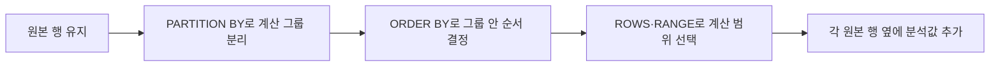

## 이번 편의 목표

- 윈도우 함수와 GROUP BY 집계의 행 수 차이를 설명한다.
- `OVER`, `PARTITION BY`, `ORDER BY`, 윈도우 프레임의 역할을 구분한다.
- `ROW_NUMBER`, `RANK`, `DENSE_RANK`의 동점 결과를 계산한다.
- `LAG`, `LEAD`, 누적합의 결과를 입력 행별로 예측한다.

## 먼저 알아둘 말

| 용어 | 쉬운 뜻 |
| --- | --- |
| 윈도우 함수 | 현재 행을 없애지 않고 관련 행 묶음을 참고해 분석값을 붙이는 함수 |
| 윈도우(Window) | 현재 행의 계산에 참고하는 행 범위 |
| `OVER` | 이 함수가 윈도우 계산임을 알리는 절 |
| `PARTITION BY` | 전체 행을 서로 독립적인 계산 그룹으로 나누는 기준 |
| 윈도우 `ORDER BY` | 각 파티션 안에서 계산 순서를 정하는 기준 |
| 프레임(Frame) | 정렬된 파티션 중 현재 계산에 실제 포함할 시작·끝 행 범위 |
| 오프셋 함수 | 앞이나 뒤 행의 값을 가져오는 `LAG`, `LEAD` 같은 함수 |

## 선수지식과 핵심 질문

선수지식은 [18. GROUP BY 절](./18_group-by)과 [20. ORDER BY 절](./20_order-by)다.

핵심 질문은 **행을 한 그룹당 한 행으로 줄이지 않고도 전체·그룹 합계, 순위, 이전 행을 어떻게 각 행 옆에 붙이는가**이다.

## GROUP BY와 가장 큰 차이

`sales`

| sale_id | city | amount |
| ---: | --- | ---: |
| 1 | 서울 | 100 |
| 2 | 서울 | 300 |
| 3 | 부산 | 200 |
| 4 | 부산 | 200 |

### GROUP BY

```sql
SELECT city, SUM(amount) AS city_sum
FROM sales
GROUP BY city;
```

| city | city_sum |
| --- | ---: |
| 서울 | 400 |
| 부산 | 400 |

원본 4행이 지역별 2행으로 줄었다.

### 윈도우 함수

```sql
SELECT sale_id, city, amount,
       SUM(amount) OVER (PARTITION BY city) AS city_sum
FROM sales
ORDER BY sale_id;
```

| sale_id | city | amount | city_sum |
| ---: | --- | ---: | ---: |
| 1 | 서울 | 100 | 400 |
| 2 | 서울 | 300 | 400 |
| 3 | 부산 | 200 | 400 |
| 4 | 부산 | 200 | 400 |

원본 4행을 유지하고 각 행 옆에 같은 지역의 합계가 붙는다.

<Callout type="info">
  GROUP BY는 여러 행을 요약해 행 수를 줄이고, 윈도우 함수는 행을 유지한 채 분석값을 추가한다.
</Callout>

## OVER 절을 세 부분으로 읽기

```sql
SUM(amount) OVER (
  PARTITION BY city
  ORDER BY sale_id
  ROWS BETWEEN UNBOUNDED PRECEDING AND CURRENT ROW
)
```

1. `PARTITION BY city`: 지역이 바뀌면 계산을 새로 시작한다.
2. `ORDER BY sale_id`: 지역 안에서 판매 번호 순으로 줄을 세운다.
3. `ROWS ...`: 첫 행부터 현재 행까지를 합계 범위로 잡는다.



GROUP BY처럼 행을 합쳐 없애지 않고, 이 네 단계를 거쳐 각 행이 참고할 범위만 정한다.

`PARTITION BY`를 생략하면 전체 결과가 한 파티션이다. `OVER ()`는 전체 행을 참고한다.

## 순위 함수 세 가지

`members`

| member_id | name | points |
| --- | --- | ---: |
| M01 | 민지 | 1200 |
| M02 | 준호 | 800 |
| M03 | 소라 | 800 |
| M04 | 현우 | 500 |

```sql
SELECT name, points,
       ROW_NUMBER() OVER (ORDER BY points DESC) AS row_no,
       RANK()       OVER (ORDER BY points DESC) AS rank_no,
       DENSE_RANK() OVER (ORDER BY points DESC) AS dense_no
FROM members;
```

| name | points | row_no | rank_no | dense_no |
| --- | ---: | ---: | ---: | ---: |
| 민지 | 1200 | 1 | 1 | 1 |
| 준호 | 800 | 2 | 2 | 2 |
| 소라 | 800 | 3 | 2 | 2 |
| 현우 | 500 | 4 | 4 | 3 |

- `ROW_NUMBER`: 동점이어도 고유한 연속 번호를 준다.
- `RANK`: 동점은 같은 순위, 다음 순위는 동점 수만큼 건너뛴다.
- `DENSE_RANK`: 동점은 같은 순위, 다음 순위는 건너뛰지 않는다.

ROW_NUMBER의 동점 순서를 안정적으로 만들려면 고유 열을 추가한다.

```sql
ROW_NUMBER() OVER (ORDER BY points DESC, member_id)
```

## 누적 합계

회원별 주문을 주문 번호 순으로 누적한다.

```sql
SELECT member_id, order_id, total_amount,
       SUM(total_amount) OVER (
         PARTITION BY member_id
         ORDER BY order_id
         ROWS BETWEEN UNBOUNDED PRECEDING AND CURRENT ROW
       ) AS running_total
FROM orders
ORDER BY member_id, order_id;
```

| member_id | order_id | total_amount | running_total |
| --- | ---: | ---: | ---: |
| M01 | 1001 | 106000 | 106000 |
| M01 | 1002 | 30000 | 136000 |
| M02 | 1003 | 250000 | 250000 |
| M03 | 1004 | 70000 | 70000 |
| M03 | 1005 | 50000 | 120000 |

파티션이 M01에서 M02로 바뀌면 누계가 다시 시작한다.

## ROWS와 RANGE 프레임

정렬 값이 같은 동점 행이 있을 때 기본 프레임과 `ROWS`의 결과가 다를 수 있다.

| id | day_no | amount |
| ---: | ---: | ---: |
| 1 | 1 | 100 |
| 2 | 1 | 200 |
| 3 | 2 | 50 |

`ROWS ... CURRENT ROW`는 실제 행 위치를 기준으로 첫 행 누계 100, 둘째 행 누계 300을 만들 수 있다. `RANGE` 계열은 같은 정렬값 `day_no = 1`인 동료 행을 한 범위로 보아 두 행 모두 300이 될 수 있다.

<Callout type="warning">
  누적합이 목적이면 기본 프레임에 기대지 말고 `ROWS BETWEEN UNBOUNDED PRECEDING AND CURRENT ROW`를 명시하면 의도가 분명하다.
</Callout>

## LAG와 LEAD

`LAG`는 이전 행, `LEAD`는 다음 행의 값을 가져온다.

```sql
SELECT order_id, total_amount,
       LAG(total_amount) OVER (ORDER BY order_id) AS prev_amount,
       LEAD(total_amount) OVER (ORDER BY order_id) AS next_amount
FROM orders
ORDER BY order_id;
```

| order_id | total_amount | prev_amount | next_amount |
| ---: | ---: | ---: | ---: |
| 1001 | 106000 | NULL | 30000 |
| 1002 | 30000 | 106000 | 250000 |
| 1003 | 250000 | 30000 | 70000 |
| 1004 | 70000 | 250000 | 50000 |
| 1005 | 50000 | 70000 | NULL |

첫 행에는 이전 행이 없고 마지막 행에는 다음 행이 없어 NULL이다. 두 번째 인수로 이동 칸 수, 세 번째 인수로 행이 없을 때 기본값을 지정할 수 있다.

```sql
LAG(total_amount, 1, 0) OVER (ORDER BY order_id)
```

## FIRST_VALUE와 LAST_VALUE

`FIRST_VALUE`는 프레임의 첫 값을, `LAST_VALUE`는 프레임의 마지막 값을 반환한다. 특히 LAST_VALUE는 기본 프레임이 현재 행까지라면 “파티션의 마지막”이 아니라 현재 행이 될 수 있다.

```sql
LAST_VALUE(total_amount) OVER (
  PARTITION BY member_id
  ORDER BY order_id
  ROWS BETWEEN UNBOUNDED PRECEDING AND UNBOUNDED FOLLOWING
)
```

파티션 전체의 마지막 주문 금액을 원하면 끝을 `UNBOUNDED FOLLOWING`으로 명시한다.

## 함수 위치 제한

논리적으로 WHERE가 윈도우 함수보다 먼저 처리되므로 같은 SELECT의 WHERE에서 윈도우 결과 별칭을 바로 사용할 수 없다.

```sql
SELECT *
FROM (
  SELECT m.*,
         ROW_NUMBER() OVER (ORDER BY points DESC) AS rn
  FROM members m
) ranked
WHERE rn <= 3;
```

먼저 안쪽에서 순위를 만들고 바깥 WHERE에서 거른다. DBMS가 `QUALIFY`를 지원하면 별도 문법을 쓸 수 있지만 지원 범위가 다르다.

## 시험에서는 어떻게 묻나

- 순위 함수 세 개의 동점 처리 결과를 묻는다.
- PARTITION BY를 생략했을 때 전체가 한 그룹임을 묻는다.
- LAG와 LEAD의 방향을 바꿔 묻는다.
- 누적합 프레임과 LAST_VALUE의 기본 프레임을 함정으로 낸다.

## 짧은 확인

점수가 `100, 90, 90, 80`일 때 RANK와 DENSE_RANK의 마지막 순위는 각각 무엇일까?

<Collapse title="확인하기">

RANK는 `1, 2, 2, 4`이므로 마지막이 4위다. DENSE_RANK는 `1, 2, 2, 3`이므로 마지막이 3위다.

</Collapse>

## 흔한 실수와 진단법

| 증상 | 원인 | 확인 |
| --- | --- | --- |
| ROW_NUMBER 동점 순서가 바뀜 | 정렬 기준이 고유하지 않음 | 기본키를 마지막 정렬 열에 추가 |
| 누계가 동점에서 한꺼번에 증가 | RANGE 성격의 기본 프레임 | ROWS 프레임 명시 |
| LAST_VALUE가 현재 값과 같음 | 프레임 끝이 현재 행 | UNBOUNDED FOLLOWING 검토 |
| WHERE에서 윈도우 함수 오류 | 논리적 처리 순서 | 서브쿼리에서 계산 후 바깥에서 필터 |

## 다음 단계: 복습

[26-복습. 윈도우 함수](./26_window-functions-review)에서 순위·누계·이전 값을 직접 계산하자.

## 정리

<Callout type="default">
  - 윈도우 함수는 원본 행을 유지하면서 분석값을 붙인다.
  - PARTITION BY는 계산 그룹, 윈도우 ORDER BY는 그룹 안의 순서를 정한다.
  - ROW_NUMBER·RANK·DENSE_RANK는 동점 처리 방식이 다르다.
  - 누적합과 LAST_VALUE는 프레임의 시작과 끝을 확인한다.
</Callout>

다음 편에서는 순위 결과를 이용해 상위 N개 행을 안정적으로 고르는 방법을 배운다.

## 참고 자료

- [PostgreSQL - Window Functions Tutorial](https://www.postgresql.org/docs/current/tutorial-window.html)
- [PostgreSQL - Window Function Details](https://www.postgresql.org/docs/current/functions-window.html)
- [Oracle Database - Analytic Functions](https://docs.oracle.com/en/database/oracle/oracle-database/21/sqlrf/Analytic-Functions.html)
