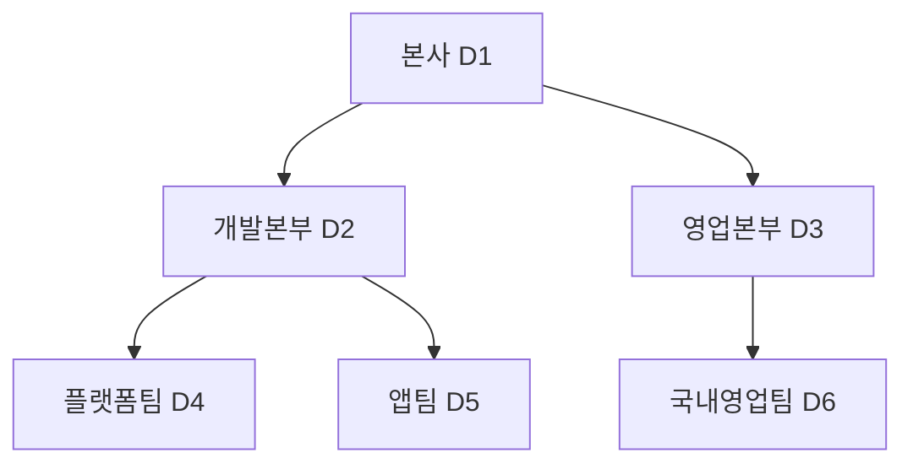

## 이번 편의 목표

- 인접 목록 구조에서 부모 열과 자식 열의 의미를 설명한다.
- Oracle의 `START WITH`, `CONNECT BY PRIOR`, `LEVEL`을 올바른 방향으로 읽는다.
- 순방향·역방향 전개와 형제 정렬을 구분한다.
- 순환 데이터의 위험과 재귀 CTE의 기본 구조를 이해한다.

## 먼저 알아둘 말

| 용어 | 쉬운 뜻 |
| --- | --- |
| 계층(Hierarchy) | 상위와 하위가 여러 단계로 이어진 구조 |
| 루트(Root) | 위에 부모가 없는 시작 노드 |
| 부모·자식 | 직접 한 단계 위·아래로 연결된 두 노드 |
| 형제(Sibling) | 같은 부모를 가진 노드들 |
| 리프(Leaf) | 아래에 자식이 없는 끝 노드 |
| 순방향 전개 | 부모에서 자식 방향으로 내려가는 탐색 |
| 역방향 전개 | 자식에서 부모 방향으로 올라가는 탐색 |
| 재귀(Recursion) | 앞 단계 결과를 이용해 다음 단계를 반복해서 찾는 방식 |

## 선수지식과 핵심 질문

선수지식은 [7. 관계](./07_relationship), [21. 조인](./21_joins), [23. 서브쿼리](./23_subqueries)다.

핵심 질문은 **한 행의 부모 번호가 같은 테이블의 어느 행을 가리키며, 시작점에서 그 연결을 어느 방향으로 반복할 것인가**이다.

## 계층 데이터를 한 테이블에 저장하기

`departments`

| dept_id | dept_name | parent_dept_id |
| --- | --- | --- |
| D1 | 본사 | NULL |
| D2 | 개발본부 | D1 |
| D3 | 영업본부 | D1 |
| D4 | 플랫폼팀 | D2 |
| D5 | 앱팀 | D2 |
| D6 | 국내영업팀 | D3 |

`parent_dept_id`는 같은 테이블의 `dept_id`를 가리킨다. 이런 저장 방식을 인접 목록(Adjacency List)이라고 한다.



각 화살표는 부모의 `dept_id`가 자식의 `parent_dept_id`에 저장되어 있다는 뜻이다.

```text
본사(D1)
├─ 개발본부(D2)
│  ├─ 플랫폼팀(D4)
│  └─ 앱팀(D5)
└─ 영업본부(D3)
   └─ 국내영업팀(D6)
```

## Oracle 계층형 질의의 세 축

```sql
SELECT dept_id, dept_name, parent_dept_id, LEVEL
FROM departments
START WITH parent_dept_id IS NULL
CONNECT BY PRIOR dept_id = parent_dept_id;
```

1. `START WITH`: 시작 행, 여기서는 부모가 없는 본사다.
2. `CONNECT BY`: 현재 단계에서 다음 단계 행을 찾는 연결 규칙이다.
3. `PRIOR`: 바로 앞 단계, 즉 부모 행 쪽 식을 표시한다.

`PRIOR dept_id = parent_dept_id`는 **부모의 dept_id = 자식의 parent_dept_id**를 뜻한다. 따라서 부모에서 자식으로 내려간다.

| dept_name | LEVEL | 의미 |
| --- | ---: | --- |
| 본사 | 1 | 시작 루트 |
| 개발본부 | 2 | 본사의 자식 |
| 플랫폼팀 | 3 | 개발본부의 자식 |
| 앱팀 | 3 | 개발본부의 자식 |
| 영업본부 | 2 | 본사의 자식 |
| 국내영업팀 | 3 | 영업본부의 자식 |

`LEVEL`은 루트에서 1로 시작해 한 단계 내려갈 때마다 1씩 증가하는 의사열이다.

## PRIOR 위치로 방향 읽기

### 부모에서 자식으로 내려가기

```sql
CONNECT BY PRIOR dept_id = parent_dept_id
```

이전 단계의 `dept_id`가 다음 행의 `parent_dept_id`와 같은 행을 찾는다.

### 자식에서 부모로 올라가기

```sql
START WITH dept_id = 'D4'
CONNECT BY dept_id = PRIOR parent_dept_id
```

이전 단계 자식의 `parent_dept_id`와 같은 `dept_id`를 가진 부모를 찾는다. 플랫폼팀 → 개발본부 → 본사 순으로 올라간다.

<Callout type="warning">
  PRIOR를 등호의 왼쪽·오른쪽이라는 모양만으로 외우지 말자. PRIOR가 붙은 식은 **이전 단계 행의 값**이라고 바꿔 읽는다.
</Callout>

## 보기 좋은 계층 표시

```sql
SELECT LPAD(' ', (LEVEL - 1) * 2) || dept_name AS tree_name,
       LEVEL
FROM departments
START WITH parent_dept_id IS NULL
CONNECT BY PRIOR dept_id = parent_dept_id
ORDER SIBLINGS BY dept_name;
```

`LPAD`는 단계에 따라 들여쓰기를 만들고, `ORDER SIBLINGS BY`는 부모·자식 순서를 깨뜨리지 않으면서 같은 부모의 자식들끼리 정렬한다.

일반 `ORDER BY dept_name`은 전체 결과를 이름순으로 다시 섞어 계층 표시가 깨질 수 있다.

## 경로와 리프 확인

Oracle은 계층 탐색에 유용한 기능을 제공한다.

```sql
SELECT dept_name,
       SYS_CONNECT_BY_PATH(dept_name, ' > ') AS path,
       CONNECT_BY_ISLEAF AS is_leaf
FROM departments
START WITH parent_dept_id IS NULL
CONNECT BY PRIOR dept_id = parent_dept_id;
```

| dept_name | path | is_leaf |
| --- | --- | ---: |
| 본사 | ` > 본사` | 0 |
| 개발본부 | ` > 본사 > 개발본부` | 0 |
| 플랫폼팀 | ` > 본사 > 개발본부 > 플랫폼팀` | 1 |

- `SYS_CONNECT_BY_PATH`: 루트부터 현재 행까지 경로 문자열을 만든다.
- `CONNECT_BY_ISLEAF`: 자식이 없는 리프면 1, 아니면 0이다.
- `CONNECT_BY_ROOT 열`: 현재 행이 속한 루트의 열 값을 가져온다.

## WHERE와 계층 전개의 관계

Oracle 계층형 질의에서 `WHERE`는 전개된 개별 행을 거르는 역할을 하며, 어떤 행을 전개할지 제한하려면 조건 위치를 세심히 구분해야 한다. 부모 행을 WHERE로 숨겨도 이미 만들어진 자손 행이 모두 자동 제거된다고 단정하면 안 된다.

특정 연결만 따라가야 한다면 `CONNECT BY` 조건에 넣고, 시작 루트를 제한하려면 `START WITH`, 최종 표시 행을 거르면 `WHERE`를 검토한다.

## 순환 데이터

다음처럼 D1의 부모를 D4로 잘못 지정하면 `D1 → D2 → D4 → D1` 순환이 생긴다.

```text
D1.parent = D4
D2.parent = D1
D4.parent = D2
```

탐색이 끝나지 못하거나 순환 오류가 날 수 있다. Oracle의 `NOCYCLE`과 `CONNECT_BY_ISCYCLE`로 순환을 탐지할 수 있지만, 근본적으로 부모 관계 데이터의 무결성을 관리해야 한다.

```sql
CONNECT BY NOCYCLE PRIOR dept_id = parent_dept_id
```

## 재귀 CTE로 표현하기

PostgreSQL 등에서는 `WITH RECURSIVE`를 사용한다.

```sql
WITH RECURSIVE dept_tree AS (
  -- 앵커: 시작 행
  SELECT dept_id, dept_name, parent_dept_id, 1 AS level_no
  FROM departments
  WHERE parent_dept_id IS NULL

  UNION ALL

  -- 재귀: 직전 단계의 자식 찾기
  SELECT d.dept_id, d.dept_name, d.parent_dept_id,
         t.level_no + 1
  FROM departments d
  JOIN dept_tree t
    ON d.parent_dept_id = t.dept_id
)
SELECT *
FROM dept_tree;
```

앵커가 LEVEL 1을 만들고, 재귀 부분이 앞 단계 결과와 연결해 다음 자식을 반복해서 추가한다. 제품마다 `RECURSIVE` 키워드와 순환 방지 기능이 다르다.

## 시험에서는 어떻게 묻나

- PRIOR가 붙은 열을 보고 순방향·역방향을 판단하게 한다.
- 루트 LEVEL이 1이라는 점을 묻는다.
- 형제 정렬에 `ORDER SIBLINGS BY`가 필요함을 묻는다.
- START WITH·CONNECT BY·WHERE의 역할을 바꿔 낸다.

## 짧은 확인

`START WITH dept_id = 'D2' CONNECT BY PRIOR dept_id = parent_dept_id`의 결과에 D1 본사가 포함될까?

<Collapse title="확인하기">

포함되지 않는다. D2 개발본부에서 시작해 자식 방향으로 내려가므로 D4 플랫폼팀과 D5 앱팀이 이어진다. 부모 D1로 올라가려면 역방향 연결이 필요하다.

</Collapse>

## 흔한 실수와 진단법

| 증상 | 원인 | 진단법 |
| --- | --- | --- |
| 부모 대신 자식 방향이 반대 | PRIOR 해석 오류 | “이전 행 값 = 다음 행 값”으로 읽기 |
| 트리 순서가 깨짐 | 일반 ORDER BY 사용 | ORDER SIBLINGS BY 검토 |
| 무한 전개·순환 오류 | 부모 관계가 원으로 연결 | 경로와 NOCYCLE로 순환 확인 |
| 필요한 가지가 사라짐 | 조건 위치가 잘못됨 | 시작·연결·최종 필터 역할 분리 |

## 다음 단계: 복습

[28-복습. 계층형 질의](./28_hierarchical-queries-review)에서 PRIOR 방향과 LEVEL을 직접 추적하자.

## 정리

<Callout type="default">
  - 인접 목록은 부모 번호를 같은 테이블의 식별자로 저장한다.
  - START WITH는 시작점, CONNECT BY는 반복 연결, PRIOR는 이전 단계 행을 뜻한다.
  - LEVEL은 루트 1부터 시작하고 ORDER SIBLINGS BY는 형제만 정렬한다.
  - 순환 데이터는 탐색을 깨뜨리므로 탐지와 무결성 관리가 필요하다.
</Callout>

다음 편에서는 같은 테이블을 한 번만 연결해 부모 이름이나 행 사이 관계를 찾는 셀프 조인을 배운다.

## 참고 자료

- [Oracle Database - Hierarchical Queries](https://docs.oracle.com/en/database/oracle/oracle-database/21/sqlrf/Hierarchical-Queries.html)
- [Oracle Database - Hierarchical Query Operators](https://docs.oracle.com/en/database/oracle/oracle-database/21/sqlrf/Hierarchical-Query-Operators.html)
- [PostgreSQL - WITH Queries and Recursive Queries](https://www.postgresql.org/docs/current/queries-with.html)
