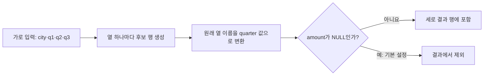

## 이번 편의 목표

- UNPIVOT이 여러 열을 행으로 바꾸는 과정을 설명한다.
- 값 열과 이름 열, `IN` 목록의 역할을 구분한다.
- `INCLUDE NULLS`와 기본 NULL 제외 동작의 결과 행 수를 계산한다.
- PIVOT과 UNPIVOT이 항상 완전한 역변환이 아닌 이유를 설명한다.

## 먼저 알아둘 말

| 용어 | 쉬운 뜻 |
| --- | --- |
| UNPIVOT | 가로로 펼쳐진 여러 열을 이름과 값의 세로 행으로 접는 변환 |
| 측정값 열 | Q1, Q2처럼 같은 종류의 값이 열별로 나뉘어 저장된 열 |
| 이름 열 | 원래 어느 열에서 왔는지 Q1·Q2 같은 이름을 담는 새 열 |
| 값 열 | 원래 각 셀의 값을 담는 새 열 |
| `EXCLUDE NULLS` | 값이 NULL인 변환 행을 결과에서 제외하는 기본 동작 |
| `INCLUDE NULLS` | 값이 NULL이어도 변환 행을 결과에 포함하는 옵션 |

## 선수지식과 핵심 질문

선수지식은 [30. PIVOT 절](./30_pivot)과 [12. NULL 속성의 이해](./12_null-attributes)다.

핵심 질문은 **한 원본 행의 여러 열을 각각 몇 개의 결과 행으로 바꾸며, 빈 값도 행으로 남길 것인가**이다.

## 넓은 표를 긴 표로 바꾸기

`quarterly_sales`

| city | q1 | q2 | q3 |
| --- | ---: | ---: | ---: |
| 서울 | 150 | 80 | NULL |
| 부산 | 200 | NULL | 120 |

원하는 긴 표는 다음과 같다.

| city | quarter | amount |
| --- | --- | ---: |
| 서울 | Q1 | 150 |
| 서울 | Q2 | 80 |
| 부산 | Q1 | 200 |
| 부산 | Q3 | 120 |

NULL 열은 기본적으로 결과 행에서 빠졌다.



원본 한 행은 대상 열 수만큼 후보 행을 만들고, 기본 `EXCLUDE NULLS`가 빈 값의 후보 행을 제거한다.

## Oracle UNPIVOT 문법

```sql
SELECT city, quarter, amount
FROM quarterly_sales
UNPIVOT (
  amount
  FOR quarter IN (
    q1 AS 'Q1',
    q2 AS 'Q2',
    q3 AS 'Q3'
  )
)
ORDER BY city, quarter;
```

세 부분으로 읽는다.

1. `amount`: 원래 셀 값이 들어갈 새 값 열이다.
2. `FOR quarter`: 원래 열 이름을 구분할 새 이름 열이다.
3. `IN (q1, q2, q3)`: 행으로 접을 원본 열 목록이다.

```text
서울 | q1=150, q2=80, q3=NULL
  ↓ 열 하나마다 후보 행 하나
서울 | Q1 | 150
서울 | Q2 | 80
서울 | Q3 | NULL  ← 기본 EXCLUDE NULLS라 제외
```

## 결과 행 수 계산

원본은 2행이고 접을 열은 3개이므로 NULL을 포함하면 최대 `2 × 3 = 6행`이다. NULL 셀이 두 개이므로 기본 제외 결과는 `6 - 2 = 4행`이다.

| 설정 | 결과 행 수 |
| --- | ---: |
| EXCLUDE NULLS 기본 | 4 |
| INCLUDE NULLS | 6 |

## INCLUDE NULLS

```sql
SELECT city, quarter, amount
FROM quarterly_sales
UNPIVOT INCLUDE NULLS (
  amount
  FOR quarter IN (q1 AS 'Q1', q2 AS 'Q2', q3 AS 'Q3')
);
```

서울 Q3와 부산 Q2도 amount가 NULL인 행으로 남는다.

<Callout type="warning">
  NULL을 제외하면 “해당 분기 열은 있었지만 값이 없음”이라는 정보가 결과 행 자체에서 사라진다. 분석 목적에 따라 포함 여부를 정한다.
</Callout>

## 나머지 열은 반복된다

`city`처럼 UNPIVOT 대상이 아닌 열은 만들어진 각 결과 행에 반복된다. 원본에 `year`도 있다면 각 분기 행마다 같은 city와 year가 복사된다.

| 원본에서의 역할 | 변환 후 |
| --- | --- |
| UNPIVOT 대상 q1·q2·q3 | quarter 값과 amount 값으로 변환 |
| 대상이 아닌 city·year | 각 결과 행에 식별 정보로 반복 |

## 데이터 타입 조건

하나의 값 열 `amount`로 모을 q1·q2·q3는 서로 호환되는 타입 계열이어야 한다. q1은 숫자, q2는 날짜, q3는 문자처럼 완전히 다른 타입이면 한 열에 담기 어렵다.

필요하면 UNPIVOT 전에 명시적으로 같은 타입으로 변환하지만, 숫자를 문자로 바꾸면 이후 합계 계산 전에 다시 변환해야 하므로 데이터 모델 자체가 적절한지도 검토한다.

## 여러 값 열을 한 번에 접기

분기별 매출과 건수가 각각 열로 있다.

| city | q1_amount | q1_count | q2_amount | q2_count |
| --- | ---: | ---: | ---: | ---: |
| 서울 | 150 | 2 | 80 | 1 |

```sql
SELECT city, quarter, amount, sale_count
FROM quarterly_summary
UNPIVOT (
  (amount, sale_count)
  FOR quarter IN (
    (q1_amount, q1_count) AS 'Q1',
    (q2_amount, q2_count) AS 'Q2'
  )
);
```

| city | quarter | amount | sale_count |
| --- | --- | ---: | ---: |
| 서울 | Q1 | 150 | 2 |
| 서울 | Q2 | 80 | 1 |

값 열 묶음의 개수와 원본 열 묶음의 위치를 맞춘다.

## UNION ALL로 풀어 쓰기

UNPIVOT을 지원하지 않는 DBMS에서는 다음처럼 표현할 수 있다.

```sql
SELECT city, 'Q1' AS quarter, q1 AS amount
FROM quarterly_sales
WHERE q1 IS NOT NULL
UNION ALL
SELECT city, 'Q2', q2
FROM quarterly_sales
WHERE q2 IS NOT NULL
UNION ALL
SELECT city, 'Q3', q3
FROM quarterly_sales
WHERE q3 IS NOT NULL;
```

각 열을 별도 SELECT로 읽어 같은 세 열 구조로 만들고 이어 붙인다.

## PIVOT의 완전한 역연산일까

항상 그렇지 않다. PIVOT에서 여러 원본 행을 SUM으로 합쳐 150 하나로 만들었다면, UNPIVOT으로 다시 세로로 돌려도 원래 100과 50 두 행을 복원할 수 없다.

```text
원본: 서울 Q1 100 + 서울 Q1 50
PIVOT: 서울 q1=150       ← 개별 행 정보 소실
UNPIVOT: 서울 Q1 150     ← 100과 50으로 분리 불가능
```

또한 기본 UNPIVOT은 NULL 행을 제외하므로 빈 조합 정보도 달라질 수 있다.

<Callout type="info">
  모양은 반대로 바꾸지만, 집계나 NULL 제외로 잃은 정보까지 되살리는 역함수는 아니다.
</Callout>

## 정규화 관점

분기가 계속 늘어날 때 q1, q2, q3, q4 열을 매번 추가하는 넓은 표는 조회·제약조건·확장에 불편할 수 있다. 원래부터 `city, quarter, amount` 형태로 행을 저장하고 보고서에서만 PIVOT하는 설계가 더 자연스러운 경우가 많다.

UNPIVOT은 외부 파일이나 기존 넓은 표를 분석하기 좋은 긴 형태로 바꿀 때 유용하지만, 잘못된 모델을 영구히 감추는 용도로만 사용하지 않는다.

## 시험에서는 어떻게 묻나

- 값 열과 이름 열의 위치를 바꾼 문법을 찾게 한다.
- 기본 EXCLUDE NULLS와 INCLUDE NULLS의 행 수를 계산하게 한다.
- 변환 대상 열의 타입 호환성을 묻는다.
- PIVOT 집계로 소실된 원본 행은 복원되지 않는다는 점을 묻는다.

## 짧은 확인

원본 5행, UNPIVOT 대상 열 4개, 그 20개 셀 중 NULL이 3개다. 기본 결과 행 수는?

<Collapse title="확인하기">

최대 5 × 4 = 20행에서 NULL 셀 3개가 제외되어 17행이다.

</Collapse>

## 흔한 실수와 진단법

| 증상 | 원인 | 해결 |
| --- | --- | --- |
| 예상보다 행이 적음 | 기본 NULL 제외 | INCLUDE NULLS 필요 여부 검토 |
| 타입 오류 | 접을 열의 타입 비호환 | 원본 타입 나란히 확인·명시 변환 |
| 원본 상세가 복구되지 않음 | PIVOT에서 이미 집계 | 집계 전 원본 보존 여부 확인 |
| 중복처럼 보이는 행 | 식별 열을 결과에서 누락 | 원본 키·연도 등 반복 열 포함 |

## 다음 단계: 복습

[31-복습. UNPIVOT 절](./31_unpivot-review)에서 결과 행 수와 NULL 포함 여부를 계산하자.

## 정리

<Callout type="default">
  - UNPIVOT은 여러 원본 열을 이름 열과 값 열의 행으로 바꾼다.
  - 기본은 NULL 값의 변환 행을 제외하고 INCLUDE NULLS로 보존할 수 있다.
  - 대상 열들은 한 값 열에 담을 수 있도록 타입이 호환되어야 한다.
  - PIVOT 집계로 잃은 상세 행은 UNPIVOT으로 복원할 수 없다.
</Callout>

다음 편에서는 문자열의 모양을 패턴으로 검사하고 추출하는 정규 표현식을 배운다.

## 참고 자료

- [Oracle Database - unpivot_clause](https://docs.oracle.com/en/database/oracle/oracle-database/21/sqlrf/SELECT.html)
- [Oracle Database - Using PIVOT and UNPIVOT](https://docs.oracle.com/en/database/oracle/oracle-database/21/dwhsg/sql-analysis-reporting-data-warehouses.html)
- [PostgreSQL - Combining Queries](https://www.postgresql.org/docs/current/queries-union.html)
