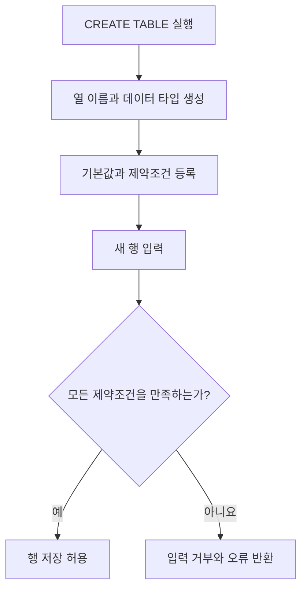

## 이번 편의 목표

- DDL이 행의 값이 아니라 데이터 구조를 정의하는 언어임을 설명한다.
- `CREATE TABLE`의 타입과 제약조건을 읽고 허용·거부 데이터를 판단한다.
- `ALTER`, `RENAME`, `TRUNCATE`, `DROP`의 변경 범위를 구분한다.
- Oracle과 일반적인 트랜잭션 DDL 차이를 시험 관점에서 주의한다.

## 먼저 알아둘 말

| 용어 | 쉬운 뜻 |
| --- | --- |
| DDL(Data Definition Language) | 테이블·열·제약조건 같은 데이터 구조를 정의하는 SQL |
| 스키마 | 테이블과 다른 객체가 속한 논리적 구조 또는 그 구조 정의 |
| 데이터 타입 | 열에 어떤 종류와 크기의 값을 저장할지 정하는 규칙 |
| 제약조건 | 잘못된 데이터가 들어오지 못하게 데이터베이스가 검사하는 규칙 |
| `TRUNCATE` | 테이블 구조는 두고 모든 행을 빠르게 비우는 DDL |
| `DROP` | 테이블의 행뿐 아니라 구조 자체를 제거하는 DDL |

## 선수지식과 핵심 질문

선수지식은 [6. 속성](./06_attribute), [8. 식별자](./08_identifier), [12. NULL 속성의 이해](./12_null-attributes)다.

핵심 질문은 **어떤 모양의 데이터만 저장할 수 있도록 구조와 규칙을 데이터베이스에 선언할 것인가**이다.

## DDL은 빈 그릇과 검사 규칙을 만든다

다음은 회원 테이블이다. 예시는 표준 SQL과 Oracle에서 흔한 표현을 중심으로 하며 타입 이름은 DBMS마다 다를 수 있다.

```sql
CREATE TABLE members (
  member_id    VARCHAR(10)  CONSTRAINT pk_members PRIMARY KEY,
  name         VARCHAR(50)  NOT NULL,
  email        VARCHAR(100) CONSTRAINT uq_members_email UNIQUE,
  grade        VARCHAR(10)  DEFAULT 'BRONZE' NOT NULL,
  points       NUMBER(10)   DEFAULT 0 NOT NULL,
  joined_at    DATE         DEFAULT CURRENT_DATE NOT NULL,
  CONSTRAINT ck_members_points CHECK (points >= 0),
  CONSTRAINT ck_members_grade
    CHECK (grade IN ('BRONZE', 'SILVER', 'GOLD'))
);
```



DDL이 만든 구조는 이후 모든 입력 행의 타입·필수값·고유성·참조·범위를 검사한다.

### 만들어진 구조

| 열 | 타입·크기 | NULL | 기본값 | 추가 규칙 |
| --- | --- | --- | --- | --- |
| member_id | 문자 10 | 불가 | 없음 | 기본키, 중복 불가 |
| name | 문자 50 | 불가 | 없음 | 반드시 입력 |
| email | 문자 100 | 가능 | NULL | 값이 있으면 고유 |
| grade | 문자 10 | 불가 | BRONZE | 세 등급 중 하나 |
| points | 숫자 최대 10자리 | 불가 | 0 | 0 이상 |
| joined_at | 날짜 | 불가 | 현재 날짜 | 가입일 |

`NUMBER(10)`의 정밀도 해석과 `VARCHAR`·`VARCHAR2`, `CURRENT_DATE`의 구체적 동작은 DBMS에 따라 다르다.

## 제약조건을 데이터로 시험하기

| 입력 사례 | 허용 여부 | 이유 |
| --- | --- | --- |
| `M01, 민지, a@x.com, GOLD, 100` | 허용 | 모든 규칙 충족 |
| `M01, 준호, b@x.com, SILVER, 0` | 거부 | 기본키 M01 중복 |
| `M02, NULL, c@x.com, BRONZE, 0` | 거부 | name NOT NULL |
| `M03, 소라, a@x.com, BRONZE, 0` | 거부 | email 고유값 중복 |
| `M04, 현우, NULL, VIP, 0` | 거부 | grade CHECK 위반 |
| `M05, 유진, NULL, BRONZE, -1` | 거부 | points CHECK 위반 |

<Callout type="info">
  DDL을 이해했다는 것은 문법을 외운 것이 아니라, 어떤 행이 저장되고 어떤 행이 거부되는지 설명할 수 있다는 뜻이다.
</Callout>

## 주요 제약조건 비교

| 제약조건 | 막는 문제 | NULL |
| --- | --- | --- |
| PRIMARY KEY | 행 식별자의 중복·부재 | 불가 |
| UNIQUE | 값 중복 | DBMS 규칙에 따라 여러 NULL 허용 가능 |
| NOT NULL | 값 부재 | 불가 |
| CHECK | 값 범위·목록 위반 | 식이 UNKNOWN이면 허용될 수 있어 NOT NULL 별도 검토 |
| FOREIGN KEY | 존재하지 않는 부모 참조 | NULL 허용 여부는 열 규칙에 따름 |

CHECK `(points >= 0)`에서 points가 NULL이면 비교 결과는 UNKNOWN이다. NULL까지 막으려면 `NOT NULL`도 필요하다.

## 외래키가 있는 주문 테이블

```sql
CREATE TABLE orders (
  order_id      NUMBER       CONSTRAINT pk_orders PRIMARY KEY,
  member_id     VARCHAR(10)  NOT NULL,
  status        VARCHAR(20)  DEFAULT 'PAID' NOT NULL,
  total_amount  NUMBER(12)   NOT NULL,
  ordered_at    DATE         DEFAULT CURRENT_DATE NOT NULL,
  CONSTRAINT fk_orders_member
    FOREIGN KEY (member_id) REFERENCES members(member_id),
  CONSTRAINT ck_orders_amount CHECK (total_amount >= 0)
);
```

M99 회원이 없다면 `member_id = 'M99'` 주문은 외래키 규칙 때문에 거부된다. 부모 회원을 먼저 만들거나 유효한 회원 번호를 사용해야 한다.

삭제·변경 시 `ON DELETE` 같은 참조 동작은 DBMS와 선언에 따라 달라진다. 아무 옵션도 없으면 자식이 참조 중인 부모 삭제가 제한되는 경우가 일반적이다.

## ALTER TABLE: 기존 구조 변경

### 열 추가

```sql
ALTER TABLE members
ADD phone VARCHAR(20);
```

기존 행의 phone은 기본값이 없으므로 NULL로 시작한다.

### 제약조건 추가

```sql
ALTER TABLE members
ADD CONSTRAINT uq_members_phone UNIQUE (phone);
```

기존 데이터가 이미 중복이면 제약조건 추가가 실패할 수 있다. 새 규칙은 과거 데이터도 검사한다.

### 열 타입 변경

Oracle 예시:

```sql
ALTER TABLE members
MODIFY name VARCHAR2(100);
```

열 크기를 늘리는 것은 비교적 단순하지만, 100자 값이 이미 있는데 20자로 줄이려 하면 실패할 수 있다. 타입 변경 전에 기존 최댓값과 변환 가능성을 확인한다.

### 열·제약조건 제거

```sql
ALTER TABLE members DROP COLUMN phone;
ALTER TABLE members DROP CONSTRAINT uq_members_email;
```

열 제거는 데이터를 잃는 작업이다. 의존하는 뷰·인덱스·애플리케이션도 확인한다.

## RENAME, TRUNCATE, DROP 비교

```sql
RENAME members TO customers;
TRUNCATE TABLE orders;
DROP TABLE orders;
```

| 명령 | 구조 | 데이터 행 | 대표 용도 |
| --- | --- | --- | --- |
| RENAME | 이름만 변경 | 유지 | 객체 이름 변경 |
| DELETE | 유지 | 조건에 맞는 행 삭제 | 일부 또는 전체 행을 트랜잭션으로 삭제 |
| TRUNCATE | 유지 | 전체 제거 | 테이블을 빠르게 비우기 |
| DROP | 제거 | 전체 제거 | 객체 자체 없애기 |

TRUNCATE는 WHERE를 쓸 수 없고 일반적으로 저장 공간·고수위 표시·자동 증가 값 처리 등에서 DELETE와 차이가 있다. 정확한 세부 동작은 DBMS별로 다르다.

<Callout type="error">
  Oracle에서는 DDL 전후 암시적 COMMIT이 발생하는 것으로 시험에 자주 다뤄진다. TRUNCATE·DROP을 실행한 뒤 일반 DML처럼 ROLLBACK할 수 있다고 가정하지 않는다.
</Callout>

PostgreSQL처럼 트랜잭션 안의 여러 DDL을 롤백할 수 있는 제품도 있다. “모든 DBMS에서 DDL은 절대 롤백 불가”라고 일반화하지 말고, SQLD의 Oracle 중심 문제와 제품 문서를 구분한다.

## CTAS: 조회 결과로 테이블 만들기

```sql
CREATE TABLE gold_members AS
SELECT member_id, name, points
FROM members
WHERE grade = 'GOLD';
```

SELECT 결과의 열과 행으로 새 테이블을 만든다. NOT NULL 일부를 제외한 기본키·외래키·CHECK·인덱스 등 모든 제약과 객체가 자동 복제된다고 생각하면 안 된다. 생성 후 구조를 확인하고 필요한 규칙을 추가한다.

## 시험에서는 어떻게 묻나

- DELETE·TRUNCATE·DROP의 구조 보존과 롤백 차이를 묻는다.
- CHECK와 NULL의 UNKNOWN 처리 때문에 NOT NULL이 별도로 필요함을 묻는다.
- ALTER로 새 제약조건을 추가할 때 기존 데이터도 검사된다는 점을 묻는다.
- CTAS가 원본의 모든 제약조건을 복제하지 않는다는 점을 함정으로 낸다.

## 짧은 확인

`CHECK (score BETWEEN 0 AND 100)`만 있고 NOT NULL이 없다. score에 NULL을 넣으면 반드시 거부될까?

<Collapse title="확인하기">

반드시 거부된다고 볼 수 없다. NULL과 범위 비교는 UNKNOWN이고 CHECK는 FALSE 위반을 막으므로 NULL이 허용될 수 있다. 값 필수라면 NOT NULL을 함께 선언한다.

</Collapse>

## 흔한 실수와 진단법

| 증상 | 원인 | 확인 |
| --- | --- | --- |
| 제약 추가 실패 | 기존 데이터가 새 규칙 위반 | 중복·NULL·범위 먼저 조회 |
| 타입 축소 실패 | 기존 값이 새 크기를 초과 | MAX 길이·범위 계산 |
| 부모 행 삭제 실패 | 자식 외래키가 참조 | 자식 행과 삭제 규칙 확인 |
| 복구 불가 | TRUNCATE·DROP 실행 | 제품의 DDL 트랜잭션 규칙 확인 |

## 다음 단계: 복습

[33-복습. DDL](./33_ddl-review)에서 구조와 허용·거부 데이터를 직접 판단하자.

## 정리

<Callout type="default">
  - DDL은 테이블 구조, 타입, 기본값과 제약조건을 정의한다.
  - 제약조건은 새 데이터뿐 아니라 추가 시 기존 데이터도 검사할 수 있다.
  - TRUNCATE는 구조를 남기고 전체 행을 비우며 DROP은 구조까지 제거한다.
  - DDL의 커밋·롤백 동작은 DBMS 차이를 확인한다.
</Callout>

다음 편에서는 만들어진 구조 안의 행을 입력·수정·삭제·병합하는 DML을 다룬다.

## 참고 자료

- [Oracle Database - CREATE TABLE](https://docs.oracle.com/en/database/oracle/oracle-database/21/sqlrf/CREATE-TABLE.html)
- [Oracle Database - ALTER TABLE](https://docs.oracle.com/en/database/oracle/oracle-database/21/sqlrf/ALTER-TABLE.html)
- [PostgreSQL - Data Definition](https://www.postgresql.org/docs/current/ddl.html)
