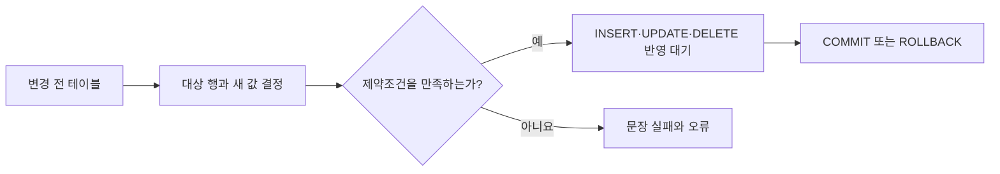

## 이번 편의 목표

- DML과 DDL의 변경 대상을 구분한다.
- `INSERT`, `UPDATE`, `DELETE`, `MERGE`의 실행 전후 데이터를 예측한다.
- WHERE 누락과 열 순서 불일치로 생기는 사고를 진단한다.
- 제약조건과 트랜잭션이 DML에 미치는 영향을 설명한다.

## 먼저 알아둘 말

| 용어 | 쉬운 뜻 |
| --- | --- |
| DML(Data Manipulation Language) | 테이블 안의 행을 입력·수정·삭제·조회하는 SQL |
| 영향 행 수 | 한 SQL로 실제 추가·수정·삭제된 행의 개수 |
| 대상 행 | WHERE 조건을 만족해 변경에 참여하는 행 |
| `MERGE` | 조건에 맞는 행은 수정하고 없으면 입력하는 작업을 한 문장으로 표현하는 기능 |
| 원자성 | 한 SQL 또는 트랜잭션이 일부만 어중간하게 반영되지 않게 하는 성질 |

## 선수지식과 핵심 질문

선수지식은 [33. DDL](./33_ddl), [17. WHERE 절](./17_where-clause), [12. NULL 속성의 이해](./12_null-attributes)다.

핵심 질문은 **실행 전 어떤 행이 대상이며, 실행 후 어떤 셀과 행이 달라지는가**이다.

## DML의 전체 흐름



일반 DML 변경은 트랜잭션 안에서 확정 전 상태로 존재하며 다음 편의 COMMIT·ROLLBACK으로 마무리한다.

## 공통 시작 데이터

`members`

| member_id | name | grade | points |
| --- | --- | --- | ---: |
| M01 | 민지 | GOLD | 1200 |
| M02 | 준호 | SILVER | 500 |
| M03 | 소라 | SILVER | 800 |

## INSERT: 새 행 넣기

```sql
INSERT INTO members (member_id, name, grade, points)
VALUES ('M04', '현우', 'BRONZE', 0);
```

### 실행 후

| member_id | name | grade | points |
| --- | --- | --- | ---: |
| M01 | 민지 | GOLD | 1200 |
| M02 | 준호 | SILVER | 500 |
| M03 | 소라 | SILVER | 800 |
| **M04** | **현우** | **BRONZE** | **0** |

영향 행 수는 1이다. 열 목록과 VALUES의 값은 위치별로 대응한다.

### 열 목록을 명시하는 이유

```sql
INSERT INTO members
VALUES ('M05', '유진', 100, 'GOLD');
```

테이블의 실제 열 순서가 `member_id, name, grade, points`라면 숫자 100이 grade에 들어가려 해 타입 오류가 난다. 열 목록을 쓰면 의도가 드러나고 나중에 열이 추가되어도 위험을 줄인다.

### SELECT 결과 입력

```sql
INSERT INTO gold_members (member_id, name)
SELECT member_id, name
FROM members
WHERE grade = 'GOLD';
```

SELECT가 두 행을 반환하면 INSERT도 두 행을 추가한다. 대상 열 개수와 SELECT 열 개수·타입이 맞아야 한다.

## UPDATE: 기존 행의 열 값 바꾸기

M02의 포인트를 200 늘린다.

```sql
UPDATE members
SET points = points + 200
WHERE member_id = 'M02';
```

| member_id | 변경 전 points | 변경 후 points |
| --- | ---: | ---: |
| M02 | 500 | 700 |

오른쪽 `points + 200`은 변경 전 행의 points를 읽어 계산한다.

### 여러 열 변경

```sql
UPDATE members
SET grade = 'GOLD',
    points = 1000
WHERE member_id = 'M03';
```

M03 한 행의 두 열이 함께 바뀐다. SET 항목을 쉼표로 구분하며 `AND`를 쓰지 않는다.

<Callout type="error">
  `UPDATE members SET points = 0;`처럼 WHERE를 빼면 테이블의 모든 행이 대상이다. 실행 전 같은 WHERE를 붙인 SELECT로 대상 행과 건수를 확인한다.
</Callout>

## DELETE: 조건에 맞는 행 제거

```sql
DELETE FROM members
WHERE member_id = 'M04';
```

M04 한 행이 제거되고 테이블 구조는 남는다.

| 명령 | 일부 행 조건 | 구조 보존 | 트랜잭션 제어 |
| --- | --- | --- | --- |
| DELETE | WHERE 가능 | 예 | 일반적으로 COMMIT 전 ROLLBACK 가능 |
| TRUNCATE | WHERE 불가 | 예 | Oracle에서는 DDL로 암시적 COMMIT 주의 |
| DROP | WHERE 불가 | 아니요 | 객체 제거 |

외래키가 M04를 참조 중이면 삭제가 거부되거나 선언된 참조 동작이 수행될 수 있다.

## MERGE: 있으면 수정, 없으면 입력

외부에서 들어온 `member_updates`를 기존 회원과 동기화한다고 하자.

`member_updates`

| member_id | name | points |
| --- | --- | ---: |
| M02 | 준호 | 900 |
| M05 | 유진 | 100 |

```sql
MERGE INTO members m
USING member_updates u
ON (m.member_id = u.member_id)
WHEN MATCHED THEN
  UPDATE SET m.name = u.name,
             m.points = u.points
WHEN NOT MATCHED THEN
  INSERT (member_id, name, grade, points)
  VALUES (u.member_id, u.name, 'BRONZE', u.points);
```

### 실행 결과

| member_id | 처리 | 결과 points |
| --- | --- | ---: |
| M02 | 기존 짝이 있어 UPDATE | 900 |
| M05 | 기존 짝이 없어 INSERT | 100 |

MERGE의 소스 한 행이 대상 테이블 여러 행과 모호하게 연결되거나 소스 키가 중복되면 오류·중복 처리 문제가 생길 수 있다. ON 조건의 고유성을 확인한다.

## 제약조건 위반 시

```sql
UPDATE members
SET points = -100
WHERE member_id = 'M01';
```

`CHECK (points >= 0)`가 있다면 문장이 실패하고 M01은 1200을 유지한다. 한 UPDATE가 여러 행을 바꾸다가 한 행에서 제약을 위반하면 문장 전체의 원자성에 따라 일부만 남지 않는 것이 일반적이다.

## 안전한 변경 습관

<Steps>

### 트랜잭션을 시작하고 대상 SELECT를 실행한다

UPDATE·DELETE와 같은 WHERE로 대상 행과 건수를 확인한다.

### 변경 SQL을 실행한다

도구가 표시하는 영향 행 수가 예상과 같은지 본다.

### 변경 결과를 다시 SELECT한다

값뿐 아니라 관련 행과 제약조건 영향까지 확인한다.

### 맞으면 COMMIT, 틀리면 ROLLBACK한다

자동 커밋 설정과 DDL 혼입 여부도 확인한다.

</Steps>

## 시험에서는 어떻게 묻나

- UPDATE·DELETE의 WHERE 누락 시 전체 행이 대상임을 묻는다.
- INSERT 열 목록과 VALUES 위치를 대응하게 한다.
- MERGE의 MATCHED·NOT MATCHED 동작을 바꿔 묻는다.
- DELETE와 TRUNCATE의 트랜잭션·구조 차이를 비교한다.

## 짧은 확인

회원 10행 중 `grade = 'GOLD'`인 행이 3개다. `UPDATE members SET points = points + 100 WHERE grade = 'GOLD'`의 영향 행 수는?

<Collapse title="확인하기">

3행이다. 각 GOLD 회원의 기존 points에 100이 더해지며 다른 7행은 그대로다.

</Collapse>

## 흔한 실수와 진단법

| 증상 | 원인 | 진단법 |
| --- | --- | --- |
| 전 행 수정·삭제 | WHERE 누락 | 같은 조건 SELECT의 건수 확인 |
| INSERT 타입 오류 | 열과 값 순서 불일치 | 열 목록과 VALUES에 번호 붙이기 |
| MERGE 오류 | ON 조건이 여러 행과 연결 | 소스·대상 키 중복 검사 |
| 변경값이 사라짐 | ROLLBACK 또는 미커밋 종료 | 트랜잭션 상태 확인 |

## 다음 단계: 복습

[34-복습. DML](./34_dml-review)에서 변경 전후 행과 영향 행 수를 직접 계산하자.

## 정리

<Callout type="default">
  - INSERT는 새 행, UPDATE는 기존 열, DELETE는 기존 행을 변경한다.
  - WHERE가 없으면 UPDATE와 DELETE는 모든 행을 대상으로 한다.
  - MERGE는 연결 조건에 따라 수정과 입력을 나눈다.
  - 변경 후 영향 행 수와 결과 SELECT를 확인한 뒤 트랜잭션을 마무리한다.
</Callout>

다음 편에서는 여러 DML을 하나의 작업으로 묶어 확정하거나 되돌리는 TCL을 다룬다.

## 참고 자료

- [Oracle Database - INSERT](https://docs.oracle.com/en/database/oracle/oracle-database/21/sqlrf/INSERT.html)
- [Oracle Database - UPDATE](https://docs.oracle.com/en/database/oracle/oracle-database/21/sqlrf/UPDATE.html)
- [Oracle Database - MERGE](https://docs.oracle.com/en/database/oracle/oracle-database/21/sqlrf/MERGE.html)
