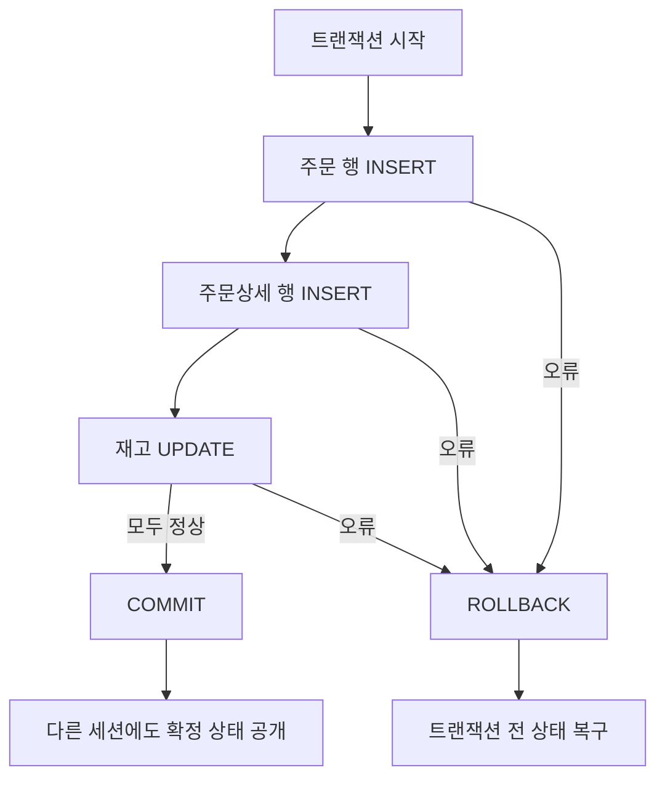

## 이번 편의 목표

- 트랜잭션의 시작과 종료 경계를 설명한다.
- `COMMIT`, `ROLLBACK`, `SAVEPOINT`, `ROLLBACK TO`의 결과를 계산한다.
- ACID의 네 성질을 주문 사례에 연결한다.
- 자동 커밋과 Oracle DDL의 암시적 커밋 함정을 구분한다.

## 먼저 알아둘 말

| 용어 | 쉬운 뜻 |
| --- | --- |
| TCL(Transaction Control Language) | DML 변경을 확정하거나 취소하는 SQL |
| 트랜잭션 | 하나의 논리적 업무로 함께 성공하거나 실패해야 하는 작업 묶음 |
| `COMMIT` | 현재 트랜잭션 변경을 영구 확정하는 명령 |
| `ROLLBACK` | 확정되지 않은 변경을 취소하는 명령 |
| 저장점(Savepoint) | 트랜잭션 중간에 되돌아갈 위치를 표시한 이름 |
| 세션(Session) | 사용자나 프로그램이 DB에 접속해 작업하는 연결 단위 |

## 선수지식과 핵심 질문

선수지식은 [11. 모델이 표현하는 트랜잭션](./11_model-transactions)과 [34. DML](./34_dml)이다.

핵심 질문은 **여러 변경 중 어디까지 확정됐고, 오류가 나면 어느 시점까지 되돌릴 것인가**이다.

## 주문 하나의 트랜잭션



주문만 생성되고 재고는 줄지 않는 상태를 막으려면 세 DML을 한 트랜잭션 경계로 묶는다.

## COMMIT과 ROLLBACK

시작 데이터:

| member_id | points |
| --- | ---: |
| M01 | 100 |
| M02 | 200 |

```sql
UPDATE members SET points = 150 WHERE member_id = 'M01';
DELETE FROM members WHERE member_id = 'M02';
```

현재 세션에서는 M01=150만 보인다. 아직 COMMIT하지 않았다면 다음 선택이 가능하다.

### COMMIT

```sql
COMMIT;
```

M01=150, M02 삭제가 확정된다. 이후 같은 트랜잭션의 일반 ROLLBACK으로 원래 상태를 되돌릴 수 없다.

### ROLLBACK

```sql
ROLLBACK;
```

두 DML 모두 취소되어 M01=100, M02=200으로 돌아간다.

<Callout type="info">
  COMMIT과 ROLLBACK은 바로 앞 SQL 한 줄만이 아니라 **마지막 트랜잭션 종료 이후의 미확정 변경 전체**를 대상으로 한다.
</Callout>

## SAVEPOINT로 일부만 되돌리기

```sql
UPDATE members SET points = points + 100 WHERE member_id = 'M01'; -- A
SAVEPOINT after_bonus;

DELETE FROM members WHERE member_id = 'M02';                     -- B
UPDATE members SET points = -1 WHERE member_id = 'M01';          -- C, 오류 가정

ROLLBACK TO after_bonus;
COMMIT;
```

시간 순서:

| 시점 | M01 | M02 | 상태 |
| --- | ---: | ---: | --- |
| 시작 | 100 | 200 | 확정 상태 |
| A 후 | 200 | 200 | 미확정 |
| 저장점 | 200 | 200 | 돌아갈 위치 기록 |
| B 후 | 200 | 삭제 | 미확정 |
| ROLLBACK TO 후 | 200 | 200 | 저장점 이후 B 취소 |
| COMMIT 후 | 200 | 200 | A만 확정 |

`ROLLBACK TO`는 트랜잭션 전체를 끝내지 않고 저장점 이후 변경을 취소한다. 일반 `ROLLBACK`은 전체 미확정 변경을 취소하고 트랜잭션을 끝낸다.

## COMMIT 후 저장점은 쓸 수 없다

```sql
SAVEPOINT s1;
UPDATE ...;
COMMIT;
ROLLBACK TO s1; -- 사용할 수 없음
```

COMMIT으로 트랜잭션이 종료되면 그 안의 저장점도 사라진다. 새 트랜잭션에서 이전 저장점으로 돌아갈 수 없다.

## ACID를 주문 사례로 이해하기

| 성질 | 쉬운 질문 | 주문 사례 |
| --- | --- | --- |
| Atomicity 원자성 | 전부 또는 전무인가? | 주문·상세·재고가 함께 성공 또는 취소 |
| Consistency 일관성 | 규칙을 지킨 상태로 이동하는가? | 재고 음수·없는 회원 주문 금지 |
| Isolation 격리성 | 동시에 실행돼도 서로 방해를 통제하는가? | 두 주문이 같은 마지막 재고를 동시에 차감하지 않음 |
| Durability 지속성 | 확정 후 장애에도 남는가? | COMMIT된 주문은 시스템 재시작 뒤에도 보존 |

ACID는 TCL 명령 이름 네 개가 아니라 트랜잭션 시스템이 보장하려는 성질이다. 격리 수준과 잠금의 세부 내용은 DBMS 설정에 따라 달라진다.

## 다른 세션에서는 언제 보일까

세션 A가 UPDATE하고 아직 COMMIT하지 않았다면 세션 B는 일반적으로 A의 미확정 값을 그대로 보지 않는다. B가 보는 값과 대기 여부는 격리 수준·잠금·DBMS에 따라 다르지만, 미확정 변경을 다른 사용자에게 확정 데이터처럼 노출하지 않는 것이 기본 목적이다.

```text
세션 A: UPDATE 100 → 200 ── COMMIT ── 확정
세션 B: 기존 100 조회 ─────────────── 새 조회에서 200 가능
```

## 트랜잭션은 언제 시작하고 끝날까

제품과 클라이언트 설정에 따라 명시적 `BEGIN`이 필요하거나 첫 DML에서 자동으로 시작될 수 있다. 보통 다음 사건은 경계에 영향을 준다.

- COMMIT 또는 ROLLBACK 실행
- 정상적인 연결 종료 또는 비정상 종료
- 자동 커밋 모드에서 각 문장 종료
- Oracle에서 DDL 실행 전후의 암시적 COMMIT

### 자동 커밋

SQL 도구의 자동 커밋이 켜져 있으면 DML 한 줄마다 즉시 COMMIT될 수 있다. 그 뒤 ROLLBACK이 되지 않는 이유를 SQL 문법 오류로 오해하지 말고 도구 설정을 확인한다.

### Oracle DDL 주의

```sql
UPDATE members SET points = 999 WHERE member_id = 'M01';
CREATE TABLE test_table (id NUMBER);
ROLLBACK;
```

Oracle 시험 관점에서는 DDL 실행 전에 암시적 COMMIT이 발생해 앞의 UPDATE가 이미 확정될 수 있다. PostgreSQL 등 트랜잭션 DDL을 지원하는 제품과 구분한다.

<Callout type="warning">
  운영 데이터에서 TCL을 연습할 때 자동 커밋과 DDL 혼입을 먼저 확인한다. ROLLBACK이 언제나 안전망이 되는 것은 아니다.
</Callout>

## 읽기 일관성과 잠금의 기초

- 읽기 일관성은 한 쿼리가 논리적으로 일관된 시점의 데이터를 보도록 돕는다.
- 잠금은 같은 데이터를 동시에 변경할 때 충돌을 통제한다.
- COMMIT과 ROLLBACK은 보유한 여러 잠금을 해제하는 경계가 되기도 한다.

긴 트랜잭션은 잠금을 오래 유지하고 다른 작업을 기다리게 할 수 있으므로 업무상 필요한 범위로 짧게 설계한다.

## 시험에서는 어떻게 묻나

- SAVEPOINT 전후 변경 중 무엇이 남는지 시간표로 묻는다.
- COMMIT 이후 ROLLBACK이 이전 변경을 취소할 수 있는지 묻는다.
- Oracle DDL의 암시적 COMMIT을 함정으로 낸다.
- ACID의 이름과 사례를 서로 바꿔 제시한다.

## 짧은 확인

A 실행 → SAVEPOINT S → B 실행 → ROLLBACK TO S → C 실행 → COMMIT 순서라면 무엇이 확정될까?

<Collapse title="확인하기">

A와 C가 확정된다. B는 저장점 이후 변경이므로 취소됐고, ROLLBACK TO 뒤 트랜잭션은 계속되어 C를 실행한 뒤 COMMIT한다.

</Collapse>

## 흔한 실수와 진단법

| 증상 | 원인 | 확인 |
| --- | --- | --- |
| ROLLBACK이 안 됨 | 이미 COMMIT 또는 자동 커밋 | 도구 설정·로그 확인 |
| 저장점 없음 오류 | COMMIT으로 트랜잭션 종료 | 저장점 생성 시점 확인 |
| 다른 세션이 대기 | 미커밋 변경의 잠금 | 트랜잭션을 빠르게 확정·취소 |
| 앞 DML이 뜻밖에 확정 | Oracle DDL 암시적 COMMIT | DDL 실행 시점 확인 |

## 다음 단계: 복습

[35-복습. TCL](./35_tcl-review)에서 저장점과 확정 상태를 시간순으로 추적하자.

## 정리

<Callout type="default">
  - COMMIT은 미확정 변경을 영구 확정하고 ROLLBACK은 취소한다.
  - SAVEPOINT와 ROLLBACK TO로 트랜잭션 일부만 되돌릴 수 있다.
  - COMMIT 뒤에는 이전 저장점과 미확정 상태가 사라진다.
  - 자동 커밋과 DBMS별 DDL 트랜잭션 규칙을 확인한다.
</Callout>

다음 편에서는 누가 어떤 객체를 조회·변경할 수 있는지 권한을 제어하는 DCL을 다룬다.

## 참고 자료

- [Oracle Database - COMMIT](https://docs.oracle.com/en/database/oracle/oracle-database/21/sqlrf/COMMIT.html)
- [Oracle Database - ROLLBACK](https://docs.oracle.com/en/database/oracle/oracle-database/21/sqlrf/ROLLBACK.html)
- [PostgreSQL - Transaction Management](https://www.postgresql.org/docs/current/tutorial-transactions.html)
